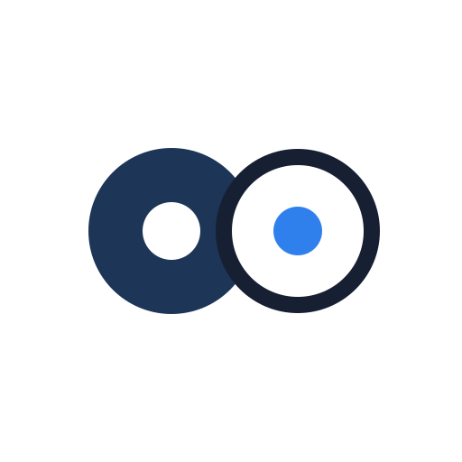

# realtime-agent

<p align="center">
  
</p>

`realtime-agent` 是一个用于构建实时 AI Agent 应用的开发框架。它帮助 Agent 听、说、看、调用工具、启动后台任务，并和真实设备侧能力协同工作。

它面向的不只是网页聊天机器人，而是智能眼镜、手机 App、浏览器摄像头 / 麦克风、嵌入式设备、机器人和其他实时多模态 Agent 应用。这类应用通常需要稳定的设备输入输出、可替换的模型链路、可扩展的业务能力和可排查的运行产物。

**从这里开始：** [快速开始](docs/getting-started/quickstart.md) · [开发者总览](docs/getting-started/developer-overview.md) · [示例](examples/README.md) · [Device SDK](devices) · [协议](protocol/README.md) · [贡献指南](CONTRIBUTING.md)


## 可以构建什么

- 支持用户打断、低延迟播放和输出恢复的实时语音 Agent。
- 可以在对话中使用图片、视频帧和设备 stream 的视觉辅助 Agent。
- 面向智能眼镜、手机、浏览器设备、嵌入式硬件或自定义客户端的设备协作助手。
- 可以调用业务工具、外部 API、设备命令和本地服务的 Agent。
- 用于导航、提醒、找物、巡检、观察和持续状态维护的后台任务。
- 可观测的 Agent 应用：一次运行之后，可以查看模型请求、工具调用、stream、输出决策和播放决策。

## 快速开始

准备本地 Python 环境：

```bash
uv sync --python 3.11
uv pip install -e .
```

启动示例 Agent server：

```bash
uv run realtime-agent.server.run --config examples/device_demo/agent-server/server.yaml
```

默认服务地址：

```text
http://127.0.0.1:8765
```

检查服务状态：

```bash
curl http://127.0.0.1:8765/api/health
curl http://127.0.0.1:8765/api/debug/devices
curl http://127.0.0.1:8765/api/debug/playback
```

在另一个终端打开浏览器眼镜模拟组件：

```bash
uv run realtime-agent.web.open --serve
```

浏览器组件会作为普通 Device 注册到 server，可用于测试麦克风输入、摄像头输入、server 下发的 speaker 输出、控制事件和 stream 生命周期。

运行一个最小契约测试：

```bash
uv run python -m pytest examples/device_demo/app-tests/test_ios_device_demo_contract.py -q
```

完整首次运行流程见 [快速开始](docs/getting-started/quickstart.md)。

## 选择开发路径

### 构建 Agent 能力

如果你想让 Agent 执行新的业务动作，从这条路径开始。

大多数应用自己的能力放在：

```text
examples/<your-app>/agent-server/capabilities/
  tools.py
  tasks.py
```

一次性、短生命周期的动作适合写成 `Tool`。需要持续运行、维护状态、消费 stream 或多次输出的流程适合写成 `Task`。

常见修改包括：

- 在 `capabilities/tools.py` 中增加业务工具。
- 在 `capabilities/tasks.py` 中增加后台任务。
- 在应用配置中暴露新能力。
- 查看应用 `runs/` 目录里的运行产物。

建议从 [第一个 Tool 和 Task](docs/tutorials/build-first-capability.md) 开始。

### 接入设备

如果你想接入眼镜、手机 App、浏览器 UI、ESP32、机器人、Linux 网关或其他客户端，从这条路径开始。

设备侧代码负责：

- 注册到 server。
- 启用自己支持的 sensor、actuator、stream 和 command。
- 上传音频、图片、视频或传感器数据。
- 处理 server 下发的控制事件。
- 消费 speaker 输出或自定义设备命令。

当前 SDK 入口：

| SDK | 入口 |
| --- | --- |
| Python | [devices/python](devices/python/README.md) |
| TypeScript | [devices/typescript](devices/typescript/README.md) |
| Swift | [devices/swift](devices/swift/README.md) |
| Kotlin / Java | [devices/kotlin](devices/kotlin/README.md) |
| C | [devices/c](devices/c/README.md) |

设备接入模型见 [端侧 App 接入指南](docs/reference/device-app-integration.md)。

### 优化模型链路

如果你想提升回复质量、延迟、稳定性或 provider 行为，从这条路径开始。

`realtime-agent` 支持两类主要模型链路：

| 链路 | 适合场景 | 代价 |
| --- | --- | --- |
| Omni / Realtime | 更快跑通实时语音体验，组件更少 | 对 ASR、视觉、LLM、TTS 等单独阶段的控制更少 |
| VL | 更细控制 ASR、视觉模型、工具、上下文、提示词和 streaming TTS | 组件更多，延迟风险更高，调试成本更高 |

常见修改包括：

- 调整 system prompt、工具描述和任务描述。
- 调整上下文组装和视觉资产进入模型的方式。
- 替换 ASR、TTS、视觉模型或 realtime 模型 provider。
- 配置 OpenAI-compatible 或 DashScope-compatible 模型服务。
- 查看 `model-request.json`、`agent-events.jsonl` 以及 stream / playback 日志。

更完整的链路说明见 [开发者总览](docs/getting-started/developer-overview.md)。

## 核心概念

| 概念 | 含义 |
| --- | --- |
| Server SDK | Python 运行时，负责 session、agent loop、工具、任务、上下文、模型 provider 和运行产物。 |
| Device SDK | 端侧 SDK，用于把真实设备或模拟设备接入 server 协议。 |
| Device | 注册到 server 的客户端，声明自己的输入、输出、stream、command 或自定义硬件能力。 |
| Tool | Agent 可以在对话中调用的短生命周期动作。 |
| Task | Agent 可以启动、观测、发送信号和取消的长流程任务。 |
| Context API | Tool 和 Task 用来请求设备能力、资产、输出和运行时数据的 SDK 接口。 |
| Model Lane | 模型执行链路，例如 Omni / Realtime 或 VL。 |
| Run Artifacts | 记录模型请求、工具事件、stream 事件、输出决策和播放决策的调试产物。 |

## 仓库结构

```text
agent-server/   Python server SDK 和服务端运行时
devices/        Python、TypeScript、Swift、Kotlin/Java、C 的 Device SDK
protocol/       共享协议文档、fixture 和协议测试
examples/       示例应用、设备模拟器、回放测试和硬件参考工程
docs/           入门文档、参考文档、how-to 文档和设计说明
testdata/       共享测试资产，例如录制音频样例
tools/          开发和校验工具
```

项目边界可以按这个原则理解：

> 业务能力放应用目录，设备能力放端侧，通用框架能力才放 SDK 核心。

## 示例

主要示例应用是：

```text
examples/device_demo/
```

它是面向端侧 App 开发者的最小 Swift 真机 demo，用于验证 Device SDK 的设备注册、音频上行、相机帧上传、speaker 下行播放和控制事件。

开发支持设备包括：

- 浏览器眼镜模拟组件：`uv run realtime-agent.web.open --serve`
- Swift 真机 demo：`examples/device_demo/ios/`
- Python 手机视觉模拟组件：`examples/dev-support/devices/python-phone/`
- Python playback glass：`examples/dev-support/devices/python-playback-glass/`

当前示例清单见 [示例](examples/README.md)。

## 排查运行问题

示例应用的运行产物默认写到：

```text
examples/device_demo/agent-server/runs
```

最常用的文件：

| 文件 | 用途 |
| --- | --- |
| `model-request.json` | 查看模型实际收到的消息、工具和上下文。 |
| `agent-events.jsonl` | 查看服务端 Agent 和 provider 的关键事件。 |
| `tool-events.jsonl` | 查看工具调用参数、结果、耗时和错误。 |
| `stream-events.jsonl` | 查看音频、图片、视频和传感器 stream 生命周期。 |
| `output-decisions.jsonl` | 查看服务端输出仲裁决策。 |
| `playback-decisions.jsonl` | 查看端侧播放仲裁决策。 |

这些产物是项目模型的一部分：实时 Agent 不应该只是能跑，还应该能在一次对话之后被排查和复盘。

## 文档

- [realtime-agent 是什么](docs/getting-started/what-is-realtime-agent.md)
- [快速开始](docs/getting-started/quickstart.md)
- [开发者总览](docs/getting-started/developer-overview.md)
- [项目结构](docs/reference/project-layout.md)
- [端侧 App 接入指南](docs/reference/device-app-integration.md)
- [CLI 参考](docs/reference/cli.md)
- [测试说明](docs/testing.md)
- [协议](protocol/README.md)

## 贡献

欢迎贡献。先阅读 [CONTRIBUTING.md](CONTRIBUTING.md) 和仓库开发说明 [AGENTS.md](AGENTS.md)。

提交变更前，运行和改动范围最相关的测试。对于 Device Demo 和 Swift Device SDK 入口改动，下面的契约测试可以作为一个轻量 smoke test：

```bash
uv run python -m pytest examples/device_demo/app-tests/test_ios_device_demo_contract.py -q
```

## License

在生产环境使用或重新分发本项目之前，请先确认仓库的 license 信息。
