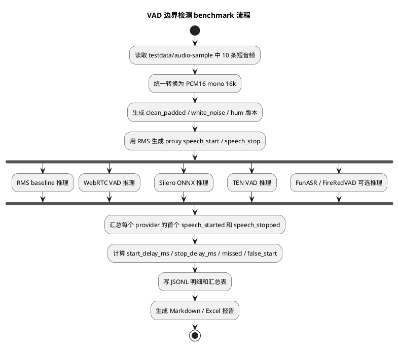

# VAD 边界检测基准实验方案

## 背景

Omni manual 模式需要由客户端或服务端本地逻辑主动判断用户语音边界：

```text
speech_started -> flush 短 pre-roll -> 持续 append Omni
speech_stopped -> stop append -> input_audio_buffer.commit -> response.create
```

最近的链路排查说明，继续用 ASR final、ASR text delta 或 provider 句边界作为 `speech_started` 的唯一来源，会让用户真实开口到 Omni 开始收到音频之间产生明显延迟。临时把 pre-roll 提高到 10000ms 可以减少丢首字，但它只是兜底，会增加 provider 处理负担，也可能把播放期回声和环境音混进当前 turn。

本实验先不改 Omni / VL 主链路，只做独立 VAD benchmark。目标是用同一批短音频和同一套 RMS 派生边界，对几个典型 VAD 方案做相对比较，回答第一轮接入前最关键的问题：

- 哪个 VAD 能更早给出 `speech_started`。
- 哪个 VAD 能更稳定、低延迟地给出 `speech_stopped`。
- 在当前样本复杂度较低的情况下，pre-roll 是否可以回到 1000-2000ms。
- 哪些 VAD 值得进入后续真实 mic、播放回声和 barge-in 场景实验。

## 实验边界

本轮只验证边界检测延迟，不验证 ASR 文本正确率、Omni 回复质量、端侧播放打断和视觉采样。

本轮不把 RMS 边界当作人工标注真值。RMS 只作为可自动复现的 proxy ground truth，用于第一轮横向比较。后续进入真实链路前，仍需要对关键样本做人工听检或真机 runs 对齐。

## 候选方案

| 方案 | 本轮定位 | 主要输入要求 | 关注点 |
| --- | --- | --- | --- |
| RMS baseline | 零依赖基线，复用或对齐现有 `ServerVadProcessor` 思路 | PCM16 mono 16k | 用于确认测试 harness 和标注逻辑，不作为最终方案 |
| WebRTC VAD / py-webrtcvad | 极低延迟 start detector | PCM16 mono，8/16/32/48k，10/20/30ms frame | `speech_started` 是否足够早；弱声、噪声下是否误判 |
| Silero VAD ONNX | 第一正式候选 | 推荐 PCM16 mono 16k | 综合延迟、稳定性、部署成本 |
| TEN VAD | 第二正式候选 | 16k，常见 hop 为 10/16ms | 重点观察 `speech_stopped` 延迟和 endpoint 表现 |
| RMS start + Silero stop | 组合候选 | PCM16 mono 16k | 用 RMS 低成本能量门限触发 start，用 Silero 控制 stop |
| Silero start + RMS guard stop | 组合候选 | PCM16 mono 16k | 用 Silero 触发 start，用 RMS 防止低能量尾音过早截断 |
| FunASR FSMN-VAD | 中文生态对照 | 16k WAV/PCM，需确认 streaming 接法 | 不能用 ASR 句边界替代 VAD，只测独立 VAD 输出 |
| FireRedVAD | 新模型对照 | 16k mono PCM/WAV | 若安装顺利进入第一轮，否则放第二阶段 |

参考资料：

- Silero VAD：https://github.com/snakers4/silero-vad
- WebRTC VAD Python：https://github.com/wiseman/py-webrtcvad
- TEN VAD：https://github.com/TEN-framework/ten-vad
- FunASR：https://github.com/modelscope/FunASR
- FireRedVAD：https://github.com/FireRedTeam/FireRedVAD

## 样本选择

第一轮从 `testdata/audio-sample/` 选择 10 个最短且语义不同的样本。当前这些文件均为 16kHz、单声道、16-bit WAV，不需要额外格式转换。

| 序号 | 音频 | 时长 | 选择原因 |
| --- | --- | ---: | --- |
| 1 | `testdata/audio-sample/回家.wav` | 2.005s | 极短指令，验证短句 start/stop |
| 2 | `testdata/audio-sample/继续.wav` | 2.091s | 极短词，容易暴露 min speech 过长问题 |
| 3 | `testdata/audio-sample/你是谁呀.wav` | 2.133s | 短问句 |
| 4 | `testdata/audio-sample/步行回家.wav` | 2.453s | 短导航指令 |
| 5 | `testdata/audio-sample/我叫什么呀.wav` | 2.645s | 短问句 |
| 6 | `testdata/audio-sample/自我介绍一下.wav` | 2.667s | 常用测试样本，已有 Paraformer 实验记录 |
| 7 | `testdata/audio-sample/给我讲个笑话吧.wav` | 2.709s | 普通请求 |
| 8 | `testdata/audio-sample/我刚才问了你什么.wav` | 2.731s | 较长短句，含连续语音 |
| 9 | `testdata/audio-sample/一分钟后提醒我.wav` | 2.752s | 任务型指令 |
| 10 | `testdata/audio-sample/我的住址在哪里.wav` | 3.221s | 稍长问句，补充 stop 延迟观察 |

如果后续需要加入 runs 产物，优先选择以下类型：

- 用户真实 mic 输入 WAV，且日志中能找到同一段 audio chunk 的上传时间。
- 播放期无人说话但存在 speaker 回采的录音。
- 播放中真人插话的录音。

这些 runs 样本必须记录来源路径、run id、设备、采样率和是否包含真实用户隐私。不能把 runs 音频提交到仓库。

## 音频增强

第一轮以原始短音频为主，同时生成少量可复现增强版本。增强音频只写入 `runs/vad-benchmark/`，不提交仓库。

建议每条原始音频生成 3 个输入版本：

| 版本 | 处理方式 | 目的 |
| --- | --- | --- |
| `clean_padded` | 前置 1500ms 静音，后置 1200ms 静音 | 让 start/stop 延迟有可测窗口 |
| `white_noise_snr20` | 在 `clean_padded` 上叠加 SNR 20dB 白噪声 | 观察轻噪声下 start/stop 偏移 |
| `hum_50hz_snr25` | 在 `clean_padded` 上叠加 50Hz 低频噪声，SNR 25dB | 模拟设备底噪或环境低频干扰 |

暂不做复杂场景组合，例如音乐、多人声、强回声、非平稳噪声。当前目标是先得到低成本、可重复的延迟基准。

## RMS 边界标注

### 输入标准化

所有样本进入 benchmark 前统一为：

```text
sample_rate = 16000
channels = 1
sample_width = 16-bit signed PCM
frame_ms = 20
hop_ms = 10
```

### 标注原则

RMS 标注用于生成每条样本的 proxy speech interval：

```text
speech_start_ms = 第一段持续高于阈值的帧起点
speech_stop_ms = 最后一段持续高于阈值的帧终点
```

阈值不使用固定绝对值，避免不同录音音量差异导致偏差。建议按每条音频自适应计算：

1. 计算每 20ms frame 的 RMS。
2. 对 RMS 做 5 frame 中值平滑。
3. 取前后静音 padding 内的 RMS 分布估计 noise floor。
4. 取整段音频 RMS 的 P95 作为 speech peak 近似。
5. 阈值取：

```text
threshold = max(noise_floor * 3.0, speech_peak * 0.08, absolute_floor)
```

其中 `absolute_floor` 用于防止极低噪声样本阈值过小，初始可设为 PCM full scale 的 `0.005`。

### 去抖规则

为避免爆音或单帧噪声影响标注：

- `speech_start_ms` 要求连续至少 80ms 高于阈值。
- `speech_stop_ms` 要求从后向前找到最后一段至少 80ms 高于阈值的语音，再取该段结束点。
- 如果一条样本无法得到稳定边界，标记为 `label_status=unstable`，保留在明细中但不进入汇总均值。

### 误差说明

RMS 对弱声、摩擦音、句尾轻声和低频噪声不够准确，因此本轮指标只能解释为“相对 RMS 边界的延迟”。如果某个 VAD 与 RMS 差异很大，应抽样听检，不直接判定 VAD 错误。

## Provider 抽象

实验脚本建议放在：

```text
tools/vad_benchmark/
```

核心接口保持窄边界：

```python
class VADProvider:
    """统一 VAD Provider 接口。

    主要功能：接收连续 PCM16 音频帧，输出语音开始和语音结束事件。
    主要方法：reset() 清空状态；process() 处理一帧音频并返回事件列表。
    主要属性：name 标识 provider；config 保存阈值、帧长和后处理参数。
    """

    name: str

    def reset(self) -> None:
        ...

    def process(self, frame: bytes, audio_ms: int) -> list[dict]:
        ...
```

Provider 只能输出实验层事件：

```json
{
  "event": "speech_started",
  "provider": "silero_onnx",
  "audio_ms": 1620,
  "score": 0.83,
  "infer_ms": 0.42
}
```

```json
{
  "event": "speech_stopped",
  "provider": "silero_onnx",
  "audio_ms": 3480,
  "score": 0.12,
  "infer_ms": 0.38
}
```

不要在 VAD provider 中加入 cancel、barge-in、Omni commit、response.create 或视觉采样逻辑。这些属于下游策略层。

## Benchmark 流程



## 指标定义

### 单条样本指标

| 指标 | 计算方式 | 说明 |
| --- | --- | --- |
| `label_start_ms` | RMS proxy start | 自动标注的说话开始 |
| `label_stop_ms` | RMS proxy stop | 自动标注的说话结束 |
| `detected_start_ms` | provider 第一条 `speech_started` | 未检测到则为空 |
| `detected_stop_ms` | provider 第一条有效 `speech_stopped` | 必须发生在 start 后 |
| `start_delay_ms` | `detected_start_ms - label_start_ms` | 负数表示早于 RMS 边界 |
| `stop_delay_ms` | `detected_stop_ms - label_stop_ms` | 越小越适合 Omni manual commit |
| `missed_start` | 无 `speech_started` | 短句和弱声重点关注 |
| `missed_stop` | 有 start 但无 stop | 会导致 Omni 不 commit |
| `false_start_before_label_ms` | start 早于 label 超过容忍窗口 | 初始容忍窗口建议 300ms |
| `infer_ms_avg` | 每 frame 平均推理耗时 | 估算实时运行压力 |
| `infer_ms_p95` | 每 frame P95 推理耗时 | 观察尾延迟 |

### 汇总指标

每个 provider 输出：

- `start_delay_ms_avg`
- `start_delay_ms_p50`
- `start_delay_ms_p95`
- `stop_delay_ms_avg`
- `stop_delay_ms_p50`
- `stop_delay_ms_p95`
- `missed_start_count`
- `missed_stop_count`
- `false_start_count`
- `infer_ms_avg`
- `infer_ms_p95`

第一轮不做复杂 ROC 曲线，只保留原始 score，便于后续调整阈值后重算。

## 输出产物

所有实验产物写入：

```text
runs/vad-benchmark/<timestamp>/
```

建议目录：

```text
runs/vad-benchmark/<timestamp>/
  manifest.json
  labels.jsonl
  provider-events.jsonl
  sample-results.jsonl
  summary.json
  summary.xlsx
  report.md
  generated-audio/
```

字段要求：

- `manifest.json` 记录 git commit、Python 版本、依赖版本、样本列表、增强配置。
- `labels.jsonl` 记录每条音频的 RMS 阈值、start/stop、标注状态。
- `provider-events.jsonl` 记录每个 provider 每条事件和每 frame 推理耗时。
- `sample-results.jsonl` 记录单条样本的最终指标。
- `summary.xlsx` 用于人工审阅和后续汇报。

`runs/` 不提交。若需要保留结论，只把 `report.md` 的摘要复制到文档，不能提交原始用户音频或隐私 runs 产物。

## 参数初始值

| 参数 | 初始值 | 说明 |
| --- | ---: | --- |
| `chunk_ms` | 20ms | 统一实时推理粒度 |
| `hop_ms` | 10ms | RMS 标注使用 |
| `leading_silence_ms` | 1500ms | 给 start 延迟留窗口 |
| `trailing_silence_ms` | 1200ms | 给 stop 延迟留窗口 |
| `min_speech_ms` | 80ms | RMS 标注去抖 |
| `stop_silence_ms` | 400ms | 实验层通用 stop 后处理初始值 |
| `false_start_tolerance_ms` | 300ms | 早触发容忍窗口 |
| `target_pre_roll_ms` | 1000-2000ms | Omni manual 目标范围 |

不同 provider 可以有独立参数，但必须写入 `manifest.json`，避免同一轮报告无法复现。

### Stop wait sweep

`speech_stopped` 延迟不能只用一个固定静音窗口评估。Omni manual 里真正影响
`input_audio_buffer.commit` 的是“VAD 确认结束并发出 stop 事件”的时间，而不是最后一帧语音时间。

第一轮 sweep 使用：

```text
stop_wait_ms = 200 / 300 / 400 / 600 / 800 / 1000
```

每个 provider 都应按这些 stop wait 单独输出结果。报告中同时保留：

- 同一 provider 在不同 stop wait 下的 `stop_delay_ms_p50/p95`。
- `missed_stop_count`。
- `false_start_count`。
- 噪声增强版本下的最佳 stop wait。

如果 `stop_wait_ms` 变大但 `stop_delay_ms` 没有变化，说明脚本记录的是语音结束点而不是 stop 事件发出点，应修正实验口径。

## 初步验收标准

第一轮实验不要求选出最终生产方案，只需要给出明确排序和后续建议。

建议标准：

- 必须能在 10 条 clean_padded 样本上全部检测到 `speech_started`。
- clean_padded 的 `start_delay_ms_p95` 应小于 500ms。
- clean_padded 的 `stop_delay_ms_p95` 应小于 800ms。
- 加噪版本不能出现大量 `missed_stop`。
- 单 frame `infer_ms_p95` 应明显小于 chunk 时长，初始目标小于 5ms。
- 如果某方案需要 3000ms 以上 pre-roll 才能不丢首字，不进入 Omni manual 第一候选。

## 与 Omni manual 的接入判断

实验报告最后应回答：

1. 推荐哪个 provider 作为第一正式候选。
2. 推荐的 `pre_roll_ms`、`stop_silence_ms`、`min_speech_ms` 是多少。
3. 是否需要双层 VAD：
   - WebRTC/RMS 做低成本 `speech_started` 候选。
   - Silero/TEN 做确认和 `speech_stopped`。
   - 如果数据不能证明 RMS/WebRTC 的 start 延迟低于 Silero，不应把它们描述为“更快启动”。
4. 哪些场景必须进入第二轮：
   - 真实 mic runs。
   - 播放回声无人说话。
   - 播放中真人插话。
   - 弱声和远场。
5. 是否可以把 Omni manual 当前 10000ms pre-roll 降回 1000-2000ms。

## 风险和注意事项

- RMS proxy ground truth 可能偏早或偏晚，不能直接代表人耳标注。
- 短样本数据多样性不足，本轮只能验证低成本延迟趋势。
- WebRTC VAD 的 frame 约束较强，脚本必须严格按 10/20/30ms 切帧。
- 实验阶段 Silero / TEN / FireRedVAD 的依赖不要直接加入主包依赖；正式接入某个方案时，需要同步记录主包依赖和锁文件影响。
- FunASR 如果只能通过 ASR final 得到句边界，不应算作独立 VAD 方案。
- 所有 runs 音频都可能包含真实用户数据，默认不得提交。

## 后续实施步骤

1. 新增 `tools/vad_benchmark/` 实验脚本，先实现 RMS baseline、WebRTC VAD、Silero ONNX。
2. 跑 10 条 clean_padded 样本，确认 labels 和 provider-events 结构。
3. 加入 white noise / 50Hz hum 两个增强版本。
4. 接入 TEN VAD，比较 stop 延迟。
5. 视安装成本接入 FunASR FSMN-VAD 和 FireRedVAD。
6. 生成 `runs/vad-benchmark/<timestamp>/summary.xlsx` 和 `report.md`。
7. 根据结果决定是否进入 Omni manual 主链路接入设计。

## 人工标注工具

真实环境录音进入第二轮实验前，先用小窗口工具人工标注真实说话起止时间：

```bash
uv run python tools/vad_benchmark/annotate_vad_labels.py path/to/recording.wav
```

工具能力：

- 显示当前音频的 waveform。
- 显示 20ms frame / 10ms hop 的 RMS intensity 曲线。
- 点击画布移动游标。
- 按 `S` 或点击 `Set Start` 标记 `speech_start_ms`。
- 按 `E` 或点击 `Set End` 标记 `speech_end_ms`。
- 点击 `Save` 保存同目录 sidecar 标签。

保存格式：

```text
path/to/recording.vad-label.json
```

示例字段：

```json
{
  "schema": "realtime-agent.vad-label.v1",
  "source_path": "path/to/recording.wav",
  "source_name": "recording.wav",
  "sample_rate": 16000,
  "duration_ms": 4210,
  "speech_start_ms": 1320,
  "speech_end_ms": 3180,
  "notes": "真实环境近讲",
  "created_at": "2026-06-05T12:00:00"
}
```

后续 benchmark 应优先读取 `.vad-label.json` 作为人工标签；没有人工标签时才回退到 RMS proxy label。
