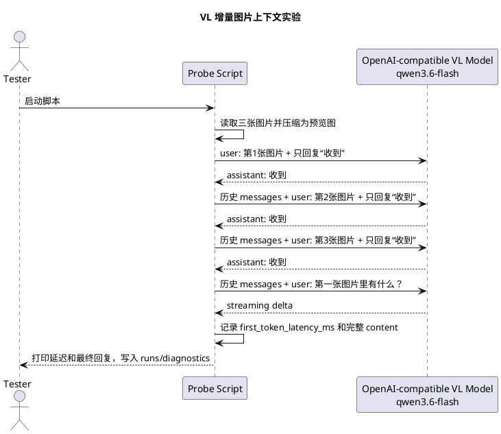

# VL 增量图片上下文预览压缩实验

## 实验目标

Vision 链路在使用 VL 模型时，如果把本轮采集到的多张照片一次性全部提交给模型，会同时增加网络传输、图片预处理、视觉编码和模型 prefill 成本，导致首 token 延迟偏高。

本次实验验证两件事：

1. `qwen3.6-flash` 是否能接受“多次提交图片，每次只确认收到，最后再追问第一张图”的消息形态。
2. 图片压缩为预览图后，第四轮问题的首 token 延迟是否下降到可接受范围。

需要特别说明：当前实验使用 OpenAI-compatible Chat Completions。该接口通常是无状态 HTTP 调用，每次请求仍需要携带历史 `messages`。因此实验验证的是“分多轮消息携带历史图片时，模型能否引用第一张图”，不是证明 provider 已经在服务端提前完成图片预计算或视觉缓存。

## 调研结论

公开资料中常见的预览图尺寸有三个档位：

1. `512px`：低延迟预览档。OpenAI Vision 的 `detail=low` 使用 512x512 低清图像预算，适合先判断画面大意。
2. `768px` / `1024px`：中间档。适合需要更多细节但仍希望控制请求体和视觉 token 的场景。
3. `1568px` 或约 `1.15MP`：上限档。Claude Vision 文档建议控制在该级别以内，避免服务端额外缩放并增加 time-to-first-token。

因此当前实验脚本默认采用 `512px` 最大边长和 JPEG quality `80` 作为低延迟预览图方案，同时保留参数支持 `768 / 1024 / 1568` 对照测试。

参考资料：

- OpenAI Images and Vision guide：`detail=low` 使用 512x512 低清图像预算。
- Anthropic Claude Vision guide：建议把图片控制在约 1.15MP / 1568px 以内以避免额外 TTFT。

## 实验脚本

脚本位置：

```bash
tools/vl_incremental_image_context_probe.py
```

默认图片顺序：

```text
1. testdata/image-sample/基辅美食.jpeg
2. testdata/image-sample/刚子等饭吃.jpeg
3. testdata/image-sample/刚子看电脑.jpeg
```

默认执行命令：

```bash
uv run python tools/vl_incremental_image_context_probe.py --timeout-seconds 90
```

对照不同预览尺寸：

```bash
uv run python tools/vl_incremental_image_context_probe.py --timeout-seconds 90 --preview-max-side 768
uv run python tools/vl_incremental_image_context_probe.py --timeout-seconds 90 --preview-max-side 1024
uv run python tools/vl_incremental_image_context_probe.py --timeout-seconds 90 --preview-max-side 1568
```

负向对照：

```bash
uv run python tools/vl_incremental_image_context_probe.py --timeout-seconds 90 --final-without-images
```

负向对照会在第四轮移除历史 `image_url`，只保留文字历史。它用于确认 Chat Completions 路径不能假设 provider 已经保存了前面几轮图片。

## 实验过程

实验请求顺序：



脚本在第四轮使用 streaming 调用，只把第一个非空文本 delta 的到达时间记录为 `first_token_latency_ms`；完整模型回复仍写入 JSON，并打印到终端。

## 实验结果

模型和 provider：

```text
provider: dashscope-compatible
model: qwen3.6-flash
base_url: https://dashscope.aliyuncs.com/compatible-mode/v1
extra_body: {"enable_thinking": false}
```

512px 预览图结果：

```text
output: runs/diagnostics/vl-incremental-image-context-20260526T173542.json
image_1_ack: 2726ms
image_2_ack: 1268ms
image_3_ack: 1361ms
ask_first_image first_token_latency_ms: 1029ms
```

512px 压缩效果：

```text
基辅美食.jpeg: 384464 bytes -> 44192 bytes, 960x1280 -> 384x512
刚子等饭吃.jpeg: 167512 bytes -> 16071 bytes, 960x1280 -> 384x512
刚子看电脑.jpeg: 202937 bytes -> 25331 bytes, 960x1280 -> 384x512
```

第四轮最终回复能正确描述第一张 `基辅美食.jpeg`，内容为餐桌俯拍、多道菜肴和餐具，说明模型在携带历史 image blocks 的情况下可以按顺序引用第一张图。

768px 预览图结果：

```text
output: runs/diagnostics/vl-incremental-image-context-20260526T173631.json
image_1_ack: 3725ms
image_2_ack: 1323ms
image_3_ack: 1266ms
ask_first_image first_token_latency_ms: 1137ms
preview_bytes: [89175, 32188, 48885]
```

负向对照结果：

```text
output: runs/diagnostics/vl-incremental-image-context-20260526T164733.json
final_without_images: true
ask_first_image request_image_block_count: 0
```

第四轮移除历史 `image_url` 后，模型仍然返回了一段看似具体但与第一张图不一致的描述。这说明 Chat Completions 路径不能依赖“前三轮已经提交过图片”来让第四轮自动看到图片；第四轮如果要可靠回答第一张图，仍必须在请求历史中保留对应 image blocks，或切换到 provider 明确支持的有状态多模态会话能力。

## 结论

1. 多轮图片提交方案在 `qwen3.6-flash` 上可用：前三轮分别提交图片并要求“收到”，第四轮携带历史 image blocks 后询问第一张图，模型能正确回答第一张图片内容。
2. 512px 预览图对延迟改善明显：第四轮首 token 延迟约 `1029ms`，比未压缩多图请求更适合作为实时语音交互路径的候选方案。
3. 768px 预览图提供更多视觉细节，但本次测试中第四轮首 token 延迟略高于 512px，且请求字节数约翻倍。
4. Chat Completions 路径不是“服务端提前预计算图片”的严格实现；它更像“客户端逐步维护视觉历史，并在最终问题请求中带上必要图片”。
5. 当前工程默认策略应优先采用“实时采样 -> 预览压缩 -> 视觉上下文预算 -> 用户问题时只带必要图片”的方案，而不是把本 turn 所有原图一次性提交。

## 后续实现建议

1. 在 `agent.visual.realtime_video` 或 `agent.vision.multimodal` 下新增预览图配置：

   ```yaml
   image_preview:
     enabled: true
     max_side: 512
     jpeg_quality: 80
   ```

2. `VlVisualAppender` 或资产 claim 层应优先生成模型用预览图，同时保留原始资产供 runs 排障和必要时二次高清请求。
3. 每轮 VL 请求应记录：
   - 原图字节数和尺寸。
   - 预览图字节数和尺寸。
   - 被选中的图片数量。
   - `first_token_latency_ms`。
   - source map 中的图片选择原因。
4. 默认 `max_images_per_turn` 不应按“本 turn 所有图片”理解，而应按“进入模型请求的图片预算”理解；建议默认 1-3 张。
5. 如果后续切换到明确支持有状态图片会话的 Realtime/VL provider，需要重新做等价实验，确认“提前提交图片但不触发回复”是否真的降低最终问题的 first token latency。
