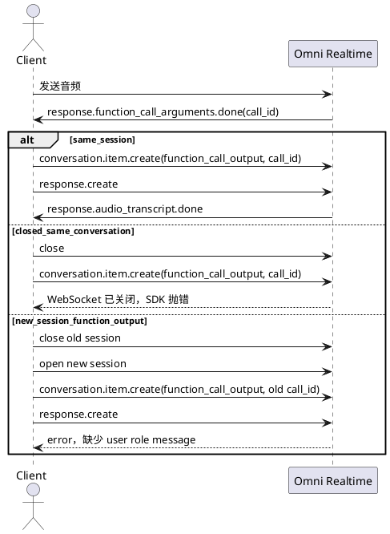

# Omni Realtime session 结束后工具结果注入实验

## 背景

本实验验证 Qwen Omni Realtime 在模型触发工具调用后，如果音频 session 或
Realtime conversation 已经结束，是否还能把工具结果追加回对话，并让模型基于工具结果
继续生成反馈。

实验脚本：

```bash
uv run python tools/omni_post_session_tool_result_experiment.py \
  --audio 'testdata/audio-sample/帮我查一下今天的天气.wav' \
  --out-dir runs/omni-post-session-tool-result
```

脚本会先让模型触发 `probe_weather` 工具调用，然后用不同方式回填
`function_call_output`，观察是否收到 `response.audio_transcript.done` 或其它反馈事件。

## 官方接口边界

阿里云百炼 Realtime 客户端事件文档说明：

- 工具调用场景中，客户端通过 `conversation.item.create` 回传工具结果后，需要发送
  `response.create` 触发模型生成最终响应。
- `conversation.item.create` 当前仅支持 `function_call_output` 类型。
- `function_call_output.call_id` 必须对应 `response.function_call_arguments.done` 事件中的
  `call_id`。

Python SDK 文档中对应方法是：

- `OmniRealtimeConversation.create_item(item)`：发送 `conversation.item.create`。
- `OmniRealtimeConversation.create_response(...)`：指示服务端生成模型响应。
- `OmniRealtimeConversation.close()`：终止任务并关闭连接。

## 实验方式



## 实验结果

### 1. 同一活跃 session 回填工具结果

运行命令：

```bash
uv run python tools/omni_post_session_tool_result_experiment.py \
  --audio 'testdata/audio-sample/帮我查一下今天的天气.wav' \
  --out-dir runs/omni-post-session-tool-result-same-session-v2 \
  --modes same_session
```

关键事件：

- 收到工具调用：
  `response.function_call_arguments.done(call_a2b4930c31884a0c986b4bd9)`
- 客户端发送：
  `conversation.item.create(function_call_output)`
- 客户端发送：
  `response.create`
- 服务端返回：
  `conversation.item.created(function_call_output)`
- 服务端继续生成：
  `response.created`
- 收到反馈：
  `response.audio_transcript.done`

结果：

```text
same_session: tool_call=True sent=True response_create=True feedback=True errors=0
```

结论：这是官方支持的路径。工具结果必须在原 Realtime conversation 仍然打开时回填。

### 2. 关闭后继续使用原 conversation 对象回填

运行命令：

```bash
uv run python tools/omni_post_session_tool_result_experiment.py \
  --audio 'testdata/audio-sample/帮我查一下今天的天气.wav' \
  --out-dir runs/omni-post-session-tool-result \
  --modes closed_same_conversation
```

关键事件：

- 收到工具调用：
  `response.function_call_arguments.done(call_a213772db8194f21b4eed270)`
- 客户端关闭 conversation：
  `conversation.close`
- 之后发送 `conversation.item.create` 失败。

错误：

```text
WebSocketConnectionClosedException: Connection is already closed.
```

结果：

```text
closed_same_conversation: tool_call=True sent=True response_create=False feedback=False errors=1
```

结论：session / websocket 关闭后，原 conversation 对象不能再追加工具结果。

### 3. 新 session 中沿用旧 call_id 回填 function_call_output

运行命令：

```bash
uv run python tools/omni_post_session_tool_result_experiment.py \
  --audio 'testdata/audio-sample/帮我查一下今天的天气.wav' \
  --out-dir runs/omni-post-session-tool-result \
  --modes new_session_function_output
```

关键事件：

- 旧 session 收到工具调用：
  `response.function_call_arguments.done(call_dfb53b27fbba4057af456534)`
- 关闭旧 session。
- 打开新 session。
- 在新 session 中发送：
  `conversation.item.create(function_call_output, old call_id)`
- 服务端创建了 `function_call_output` item，但随后报错。

错误：

```text
<400> InternalError.Algo.InvalidParameter: The input messages do not contain elements with the role of user
```

结果：

```text
new_session_function_output: tool_call=True sent=True response_create=True feedback=False errors=1
```

结论：旧 session 的 `call_id` 不能作为新 session 中完整工具调用上下文使用。新 session
即使接受了 `function_call_output` item，也无法基于它正常生成工具反馈。

## 补充实验：活跃 session 内 late result 注入

为验证“统一 Tool Run 等待窗口”重构方案（Tool 调用先返回“运行中”，真实结果稍后回灌），
在同一活跃 session 内补充了三种 late result 注入方式：

```bash
uv run python tools/omni_post_session_tool_result_experiment.py \
  --audio 'testdata/audio-sample/帮我查一下今天的天气.wav' \
  --out-dir runs/omni-late-result-injection \
  --modes same_session_second_function_output \
          same_session_instructions_followup \
          same_session_delayed_function_output
```

### 4. 同 call_id 二次回填 function_call_output（same_session_second_function_output）

流程：先回填 `status=running` 的 `function_call_output` 并 `response.create`（模型播报“正在查询”），
等 `response.done` 后用**同一 call_id** 再回填最终结果并再次 `response.create`。

结果（两次运行）：

- 协议层面：服务端**接受**同一 `call_id` 的第二个 `function_call_output` item，
  两个 item 都返回 `conversation.item.created`，无 error 事件。
- 模型层面行为不稳定：
  - 第 1 次运行：follow-up 播报了最终结果（“上海今天天气晴朗，气温26度。”）。
  - 第 2 次运行：follow-up 没有播报，模型**重新发起了一次 `probe_weather` 工具调用**
    （新的 call_id），导致没有用户可听反馈。

```text
run1: followup item_sent=True response_create=True feedback=True
run2: followup item_sent=True response_create=True feedback=False（模型重试工具调用）
```

结论：二次回填协议可行但模型行为不可控，可能触发重复工具调用，不适合作为 late result
注入的主路径。

### 5. create_response(instructions=结果文本)（same_session_instructions_followup）

流程：先回填 `status=running` 的 `function_call_output`（模型播报“正在查询”），late result 到达后
不创建任何 item，直接 `create_response(instructions=携带最终结果文本和播报指令)`。

结果（两次有效运行，另一次模型未触发工具调用、与注入机制无关）：

```text
run1: followup feedback=True（“上海今天是大晴天，气温26度。”）
run2: followup feedback=True（“上海今天晴天，气温26度。”）
```

两次都正确播报最终结果，没有重复工具调用，无 error。

结论：instructions 注入是活跃 session 内 late result 的**最可靠路径**。注意结果文本不进入
provider conversation item 历史，服务端 messages 需要另行落盘保持上下文一致。

### 6. 延迟回填原 call_id（same_session_delayed_function_output）

流程：模型发出 function_call 后**不回填**，分别延迟 15 秒和 60 秒后再回填原 `call_id` 的
`function_call_output` 并 `response.create`。

结果：

```text
delay=15s: followup item_sent=True response_create=True feedback=True（“今天上海是大晴天，气温26度。”）
delay=60s: followup item_sent=True response_create=True feedback=True
```

provider 在至少 60 秒内容忍未回填的 function_call，连接保持，延迟回填后正常生成反馈。

结论：延迟回填协议上可行，且对话历史最干净（只有一个最终 `function_call_output`）。
缺点是挂起期间模型不会主动播报“正在查询”（除非客户端另行驱动），且挂起期间用户再次
说话时的行为未验证。

## 结论

当前可验证的可行路径只有一种：

1. 在原 Realtime conversation 仍然打开时，发送
   `conversation.item.create(type=function_call_output, call_id=原工具调用 call_id, output=...)`。
2. 立即发送 `response.create`。
3. 等待 `response.created`、`response.audio_transcript.done` 或音频事件。

不成立的路径：

- 关闭 websocket / conversation 后继续用原对象回填工具结果。
- 新建 session 后沿用旧 session 的 `call_id` 回填 `function_call_output`。

活跃 session 内 late result 注入的补充结论：

- 同 call_id 二次回填：协议接受，但模型可能重试工具调用，行为不稳定，不推荐。
- `create_response(instructions=结果文本)`：两次运行均正确播报，**推荐作为活跃 session 内
  late result 回灌的主路径**；结果需另行写入服务端 messages 保持上下文一致。
- 延迟回填原 call_id：provider 至少容忍 60 秒挂起，协议可行、历史最干净；但挂起期间
  无法靠 provider 驱动“正在查询”播报，且挂起期间用户插话行为未验证。

工程建议：

- 前台 Tool 必须在 audio session / provider conversation 关闭前完成，或至少在关闭前回填一个
  “工具仍在执行 / 已转后台任务”的短结果。
- 真正长耗时能力应设计成 Task：前台 Tool 只启动 Task 并立刻返回，模型基于启动结果给用户反馈。
- 如果工具结果晚于 session 关闭，只能作为下一轮新的用户上下文或系统上下文重新进入模型，不能再使用旧
  `call_id` 的 `function_call_output` 协议语义。
- 统一 Tool Run 重构中，活跃 session 的 late result follow-up 应采用
  “等待窗口超时 → 回填 running `function_call_output` + `response.create` →
  结果到达后 `create_response(instructions=最终结果)`”的组合。
