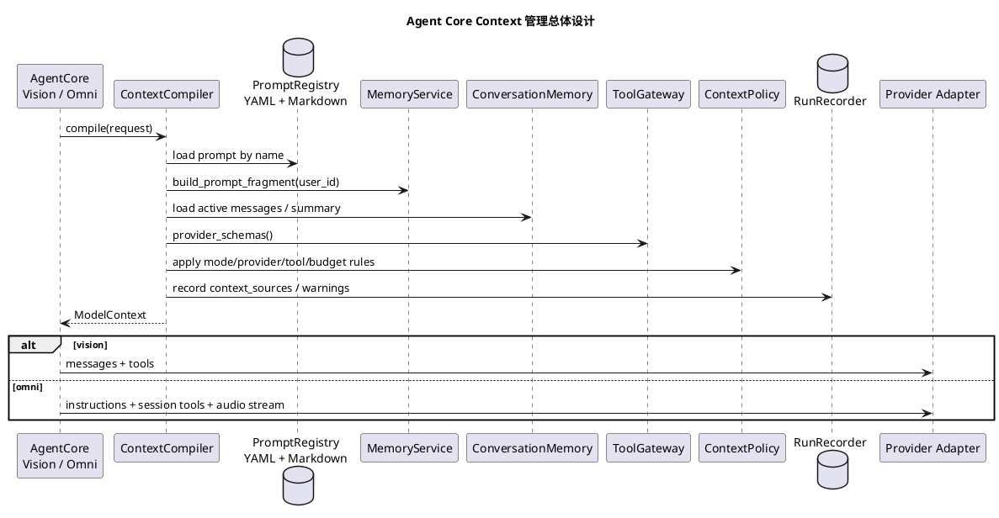

# Agent Core 大模型上下文管理设计方案

## 1. 背景

当前 Agent Core 的大模型上下文由多个模块分别拼接：

- `server.yaml` 提供 Vision Realtime / Omni Realtime 主系统提示。
- `app.py` 在启用 Memory 时追加长期记忆使用规则。
- `VisionRealtimeAgentCore` 自行拼接 Vision prompt、长期记忆、历史摘要、active messages 和 tools。
- `OmniRealtimeAgentCore` 自行拼接 Omni prompt、工具调用语音规则、长期记忆、历史摘要、等价 messages 和 Omni Realtime tools。
- `tools.py` / `tasks.py` 通过 `ToolSpec.description`、Pydantic `Field(description=...)`、`TaskStartTool` 自动生成工具 schema。
- `memory/__init__.py`、`conversation.py`、业务视觉 Tool 内部还各自维护子 Agent 提示词。

这些内容都可能影响模型行为，但目前没有统一的命名、版本、来源记录、预算控制和最终上下文快照。后续如果继续在各处直接改字符串，会导致以下问题：

1. 难以确认某段提示词是否真的进入了模型。
2. Vision Realtime 和 Omni Realtime 链路的上下文规则容易漂移。
3. 工具 schema、记忆片段、历史摘要和系统提示之间可能互相重复或冲突。
4. `model-request.json` 能看到最终请求，但缺少每段内容的来源、类型、裁剪原因和预算占用。
5. 后续做 prompt 优化、A/B、回归测试和真实设备排障时，缺少稳定的对照基线。

现状详见 `agent-server/docs/internal/AgentCore上下文现状盘点.md`。

## 2. 目标

本方案目标是新增一层轻量的上下文管理基础设施，让所有模型可见内容先进入统一编译流程，再交给 Vision Realtime / Omni Realtime / 子 Agent provider。

具体目标：

1. 集中管理主 Agent 和子 Agent 的 prompt，不再把核心提示词散落在业务代码中。
2. 为每段 prompt 建立简单唯一的 `name`，让开发者能按名称找到并调整。
3. 用统一 `ContextCompiler` 构造最终 `ModelContext`。
4. 为每次模型调用记录 `context_sources`、prompt 名称、工具列表、历史消息策略、记忆片段和裁剪原因。
5. 支持 Vision Realtime 和 Omni Realtime 两条运行循环共享同一套上下文策略，同时保留 provider 差异。
6. 把“常驻上下文”和“按需上下文”分开，减少系统提示膨胀。
7. 为后续 token budget、prompt 回归测试、上下文 diff 和线上平台接入保留扩展点。

## 3. 非目标

本阶段不做以下事情：

1. 不引入 LangChain / LlamaIndex 作为 Agent 运行时。
2. 不接入 Langfuse / LangSmith 等外部 prompt 管理平台。
3. 不重写所有提示词文案。
4. 不改变端侧协议、Tool API、Task API 或 Output Service 语义。
5. 不把业务 Task 兜底逻辑写进 SDK core。
6. 不要求 Vision Realtime 和 Omni Realtime 共用同一个 provider turn loop。
7. 不在第一阶段重写 Tool / Task 的用户通知行为，只先盘点、收敛入口和补可观测记录。

## 4. 总体设计

新增 `realtime_agent.agent_core.context` 包，提供 PromptRegistry、ContextSource、ContextCompiler 和 ModelContext。



## 5. 核心对象

### 5.1 PromptRegistry

`PromptRegistry` 管理 repo 内提示词资产。第一阶段使用 YAML + Markdown，不接外部平台。

建议目录：

```text
agent-server/realtime_agent/prompts/
  registry.yaml
  omni_system.md
  vision_system.md
  memory_rules.md
  omni_tool_call_rules.md
  tool_result_failure_followup.md
  capture_photo_followup.md
  vision_interpreter.md
  memory_manager.md
  message_summarizer.md
```

`registry.yaml` 示例：

```yaml
prompts:
  - name: omni_system
    file: omni_system.md
    description: Omni Realtime 主 Agent 系统提示词。

  - name: memory_rules
    file: memory_rules.md
    description: 主 Agent 使用长期记忆的通用规则。

  - name: vision_interpreter
    file: vision_interpreter.md
    description: 图片解读子 Agent 提示词。
```

PromptRegistry 职责：

1. 读取 prompt metadata。
2. 读取 Markdown 正文。
3. 校验 `name` 唯一、文件存在。
4. 支持按 `name` 查找 prompt。
5. 返回 `PromptAsset`。

第一阶段只支持本地文件；后续如果需要 UI、灰度、回滚或 A/B，可把同一接口接到 Langfuse / LangSmith。

第一版目录也保持平铺。每个 prompt 都有全局唯一 `name`，开发者可以直接在 `realtime_agent/prompts/` 下找到同名 Markdown 文件。等 prompt 数量明显增长后，再考虑按目录分类。

这里刻意不在第一版引入 `id/version/scope/mode/owner/variables/tests` 这类完整元数据：

| 字段 | 为什么第一版不需要 |
| --- | --- |
| `id` | 对开发者来说 `name` 已经足够表达唯一名称，例如 `omni_system`。 |
| `version` | 当前 prompt 跟随 git 版本管理即可；需要线上灰度或回滚时再引入。 |
| `scope` | 第一版不需要；用途直接体现在 prompt 名称和 description 中。 |
| `mode` | 由 ContextCompiler 显式选择 prompt 名称，不在 registry 里再做复杂筛选。 |
| `owner` | 当前仓库团队很小，所有 prompt 先归项目维护；后续多人协作再补。 |
| `variables` | 第一版尽量避免复杂模板变量；确实需要动态内容时由 ContextSource 注入。 |
| `tests` | 测试入口放在测试文件和设计文档中维护，不要求每个 prompt metadata 反向声明。 |

### 5.2 ContextSource

`ContextSource` 表示一段进入模型上下文的内容及其来源。

建议字段：

```python
@dataclass(frozen=True)
class ContextSource:
    source_id: str
    source_kind: Literal[
        "prompt",
        "memory",
        "message",
        "tool",
        "modal",
        "runtime",
    ]
    content: Any
    source_name: str
    token_estimate: int | None = None
    priority: int = 100
    metadata: dict[str, Any] = field(default_factory=dict)
```

这里的 `source_kind` 不是 prompt 分类，而是模型可见上下文的粗粒度来源。比如工具定义和工具结果都属于 `tool`，再通过 `source_name` 区分为 `tool_schema:capture_photo` 或 `tool_result:capture_photo`。

每个来源都必须能回答三个问题：

1. 这段内容从哪里来？
2. 为什么这一轮需要给模型看？
3. 如果超预算，能不能裁剪，怎么裁剪？

### 5.3 ModelContext

`ModelContext` 是 ContextCompiler 的输出，Vision Realtime / Omni Realtime 只消费这个结构。

```python
@dataclass(frozen=True)
class ModelContext:
    mode: Literal["vision", "omni"]
    provider: str
    model: str
    instructions: str
    messages: list[dict[str, Any]]
    tools: list[dict[str, Any]]
    modal_inputs: list[dict[str, Any]]
    context_sources: list[ContextSource]
    warnings: list[dict[str, Any]]
    metadata: dict[str, Any]
```

Vision 链路使用：

- `instructions` 作为 system message。
- `messages` 作为 active history + 当前输入。
- `tools` 作为 Chat Completions tools。

Omni Realtime 链路使用：

- `instructions` 作为 provider session instructions。
- `tools` 转成 provider realtime function schema。
- `messages` 主要用于等价请求视图和后续 provider 支持历史注入时使用。
- `modal_inputs` 用于描述当前音频流、视觉帧等非 Vision 输入。

### 5.4 ContextPolicy

`ContextPolicy` 控制上下文选择、裁剪、去重和 provider 差异。

建议配置：

```yaml
context:
  token_budget:
    total: 12000
    instructions: 3000
    active_messages: 5000
    memory: 1500
    tools: 2500
  history:
    max_messages: 30
    include_roles: [user, assistant]
    exclude_tool_history: true
  tools:
    expose_output_schema: false
    collapse_task_start_common_suffix: true
  realtime:
    inline_vision_tools:
      - capture_photo
      - interpret_current_view
      - interpret_image
    audio_before_tool_policy: drop_or_defer
```

第一阶段可先实现结构，不必马上做精确 token 预算；但接口必须预留 `token_estimate` 和 `truncated` 记录。

### 5.5 ContextCompiler

`ContextCompiler` 是唯一的主 Agent 上下文拼接入口。

输入：

```python
@dataclass(frozen=True)
class ContextCompileRequest:
    mode: Literal["vision", "omni"]
    provider: str
    model: str
    user_id: str
    session_id: str
    current_input: dict[str, Any]
    include_tools: bool = True
    reason: str = "agent_turn"
```

主要流程：

1. 从 PromptRegistry 加载主系统提示。
2. 按配置追加共享规则，例如 memory rules、realtime tool rules。
3. 从 MemoryService 读取长期记忆片段。
4. 从 ConversationMemory 读取历史摘要和 active user/assistant messages。
5. 从 ToolGateway 读取 provider schemas，并应用 ToolPolicy / SkillPolicy / ContextPolicy。
6. 添加当前输入视图。
7. 估算预算并按优先级裁剪。
8. 输出 ModelContext。
9. 通过 RunRecorder 记录 context trace。

## 6. 上下文分层策略

### 6.1 常驻上下文

常驻上下文应该少而稳定：

1. 主 Agent 身份和回复风格。
2. 本应用不可违反的业务边界。
3. 工具调用基本规则。
4. 记忆使用基本规则。

不应该常驻：

1. 设备协议细节。
2. Task 内部状态机。
3. Tool 执行栈。
4. MCP server 内部结构。
5. 大量历史对话原文。
6. 非当前任务相关的长期记忆详情。

### 6.2 按需上下文

按需上下文通过 Tool 或 source 动态进入：

1. 详细长期记忆：通过 `memory_search`。
2. Skill 说明：通过 `read_skill`。
3. 外部资料：通过 `search_web` 或 MCP 专用 Tool。
4. 图片内容：Realtime 视觉帧或视觉 Tool 子 Agent。
5. Task 运行详情：通过 `task_runtime_manager`。

### 6.3 历史消息

历史消息分三层：

1. active messages：最近、未压缩、可直接进入模型的 user/assistant 文本。
2. summary fragment：更早历史压缩摘要，进入 system prompt。
3. audit messages：完整 `messages.jsonl`，包括 tool 调用和 tool result，只用于排障，不直接作为孤立 tool history 回灌。

### 6.4 工具 schema

工具 schema 应只包含模型决策需要的信息：

1. 工具名。
2. 高层语义 description。
3. 必要输入字段及描述。
4. 必要枚举和约束。

不应包含：

1. 端侧协议细节。
2. 内部 mock 实现。
3. 过长通用规则重复段。
4. 不希望模型填写的废弃字段。

### 6.5 Tool / Task 模型可见内容与通知边界

Tool / Task 相关内容分成三类管理，不能混成同一种 prompt：

| 类别 | 例子 | 是否进入模型上下文 | 管理方式 |
| --- | --- | --- | --- |
| 模型决策说明 | `ToolSpec.description`、Pydantic `Field(description=...)`、TaskStartTool description | 是 | 作为 `source_kind="tool"` 的 schema 来源记录 |
| 工具执行结果 | ToolResult 文本、失败原因、Task 启动返回摘要 | 视链路而定 | 作为 `source_kind="tool"` 的 result 来源记录 |
| 用户通知 | `context.output.say()`、Task 进度播报、完成 / 失败播报 | 不一定 | 由 Tool / Task notification policy 管理，并记录到 runs |

设计原则：

1. 模型可见说明要短，只描述模型做决策需要知道的能力、参数和约束。
2. 用户通知要面向用户体验，不应该直接复用工具 schema 文案。
3. 工具执行中的用户播报、Task 进度通知和模型后续总结要分开记录。
4. Tool result 是否回灌给模型，必须由 ContextPolicy 或 Tool / Task 运行策略显式决定。
5. Realtime 模式下要特别记录工具调用前后的音频处理策略，避免工具前预音频和工具结果播报互相覆盖。

## 7. 运行产物与可观测性

每次模型调用应在 `model-request.json` 或新增 `context.json` 中记录：

```json
{
  "runner": "agent_core_omni_audio",
  "provider": "qwen",
  "model": "qwen3.5-omni-plus-realtime",
  "prompts": [
    {"name": "omni_system"},
    {"name": "memory_rules"},
    {"name": "omni_tool_call_rules"}
  ],
  "context_sources": [
    {"source_id": "prompt:omni_system", "source_kind": "prompt", "source_name": "omni_system", "token_estimate": 420},
    {"source_id": "memory:user:basic", "source_kind": "memory", "source_name": "long_term_memory", "token_estimate": 120},
    {"source_id": "tools:provider_schema", "source_kind": "tool", "source_name": "tool_schema", "tool_count": 9},
    {"source_id": "tool_result:capture_photo", "source_kind": "tool", "source_name": "tool_result:capture_photo", "included": false, "reason": "inline_vision_result_hidden"}
  ],
  "notifications": [
    {"source_id": "task:start_find_object_task", "channel": "output", "event": "task_started", "model_visible": false}
  ],
  "warnings": [],
  "truncations": []
}
```

新增事件建议：

| 事件 | 触发时机 | 关键字段 |
| --- | --- | --- |
| `context.compile.started` | 开始编译上下文 | `mode/provider/model/user_id/session_id` |
| `context.source.added` | 添加一段来源 | `source_id/source_kind/source_name/token_estimate` |
| `context.source.skipped` | 跳过一段来源 | `source_id/reason` |
| `context.source.truncated` | 裁剪内容 | `source_id/before_tokens/after_tokens/reason` |
| `context.compile.completed` | 编译完成 | `source_count/tool_count/warning_count/token_estimate` |
| `context.notification.recorded` | 记录 Tool / Task 用户通知 | `source_id/channel/event/model_visible` |

## 8. 目录结构

建议新增：

```text
agent-server/realtime_agent/
  prompts/
    registry.yaml
    omni_system.md
    vision_system.md
    memory_rules.md
    omni_tool_call_rules.md
    tool_result_failure_followup.md
    capture_photo_followup.md
    vision_interpreter.md
    memory_manager.md
    message_summarizer.md
  agent_core/context/
    __init__.py
    compiler.py
    models.py
    policy.py
    registry.py
    sources.py

agent-server/tests/
  test_context_prompt_registry.py
  test_context_compiler.py
```

文档：

```text
agent-server/docs/internal/
  AgentCore上下文现状盘点.md
  AgentCore上下文管理设计.md
```

## 9. 开发计划

计划按“先统一静态 prompt，再统一运行时上下文”的顺序推进。第一版只解决当前混乱点，不引入复杂元数据、外部平台或细粒度 source 类型。

### Phase 1：建立平铺 PromptRegistry

目标：

1. 新增 `realtime_agent/prompts/` 平铺目录。
2. 新增 `registry.yaml`，每个 prompt 只包含 `name`、`file`、`description`。
3. 迁移静态 prompt：
   - `omni_system.md`
   - `vision_system.md`
   - `memory_rules.md`
   - `omni_tool_call_rules.md`
   - `vision_interpreter.md`
   - `memory_manager.md`
   - `message_summarizer.md`
   - `tool_result_failure_followup.md`
   - `capture_photo_followup.md`
4. 保持现有运行行为不变，先不改变 AgentCore 的拼接逻辑。

验收：

1. PromptRegistry 能加载全部 prompt。
2. `name` 唯一，`file` 必须存在。
3. 不再新增散落在代码里的大段静态 prompt。
4. 现有 AgentCore 测试通过。

### Phase 2：引入 ContextSource 和 ModelContext 结构

目标：

1. 新增 `ContextSource`，只保留粗粒度 `source_kind`：
   - `prompt`
   - `memory`
   - `message`
   - `tool`
   - `modal`
   - `runtime`
2. 新增 `ModelContext`，统一表达 `instructions/messages/tools/modal_inputs/context_sources`。
3. 先只做结构和记录，不做复杂裁剪策略。
4. 明确 `tool_schema`、`tool_result` 不是独立 prompt 类型，而是 `source_kind="tool"` 下的 `source_name`。

验收：

1. 单元测试覆盖 `ContextSource` 和 `ModelContext` 的基本构造。
2. `model-request.json` 能输出 `context_sources`。
3. trace 中能看出每一段模型可见内容来自 prompt、memory、message、tool、modal 还是 runtime。

### Phase 3：ContextCompiler 接入 VisionRealtimeAgentCore

目标：

1. VisionRealtimeAgentCore 不再直接散落拼接 system prompt、memory、history 和工具上下文。
2. ContextCompiler 生成 Vision 模式的 `instructions/messages/tools`。
3. 保留当前工具调用、工具结果回填和历史消息语义。

验收：

1. vision 模式 model request 与迁移前语义一致。
2. 工具调用和工具结果回填测试通过。
3. 历史 tool 消息仍不作为孤立 tool message 回灌。
4. `context_sources` 能解释本轮 Vision 请求的来源。

### Phase 4：ContextCompiler 接入 OmniRealtimeAgentCore

目标：

1. OmniRealtimeAgentCore 不再自行拼 prompt / history / tools。
2. Realtime provider session 使用 `ModelContext.instructions` 和 `ModelContext.tools`。
3. Realtime 等价 model request 由 ModelContext 生成。
4. Realtime inline vision tools 过滤迁移到 ContextPolicy。

验收：

1. mock realtime 测试通过。
2. tool call bridge 测试通过。
3. visual sampler 测试通过。
4. runs 中能看到 prompt name 和 context_sources。

### Phase 5：清理工具可见内容与上下文检查工具

目标：

1. 收敛工具 description、参数 Field 说明和 TaskStartTool 通用说明。
2. 去掉工具 schema 中的 mock / 内部实现细节。
3. 梳理 Tool result 是否回灌给模型的规则。
4. 梳理 Tool / Task 用户通知策略：
   - 工具执行中是否播报。
   - Task 启动是否播报。
   - Task 进度是否播报。
   - Task 完成 / 失败是否播报。
   - 哪些通知只写 runs，不进入模型上下文。
5. 检查不应暴露给模型的字段。
6. 提供本地 CLI 查看最终上下文。

候选命令：

```bash
uv run realtime-agent.context.inspect --config examples/device_demo/agent-server/server.yaml --mode omni
```

验收：

1. 当前默认可见 9 个工具的 schema 有快照测试。
2. `capture_photo` / `interpret_image` / `interpret_current_view` 默认不可见事实有测试。
3. Task 工具 description 不再包含误导性 mock 字样。
4. Tool result 回灌策略有测试覆盖。
5. Task 启动、进度、完成、失败通知路径有行为测试或可复现联调说明。
6. CLI 能输出最终 instructions、messages、tools 和 source map。

### Phase 6：预算、裁剪和 diff

目标：

1. 引入 token 估算。
2. 对 active history、memory、tools 设置预算。
3. 记录被裁剪来源和原因。
4. 支持对比迁移前后上下文 diff。

验收：

1. 超预算时不会静默截断。
2. `context.compile.completed` 包含预算和裁剪摘要。
3. diff 能说明 prompt、memory、messages、tools 哪些内容发生变化。

## 10. 测试策略

### 单元测试

| 测试目标 | 建议测试 |
| --- | --- |
| registry 加载 | prompt 的 `name` 唯一，文件存在 |
| prompt 读取 | registry 能按 `name` 读取 Markdown 正文；缺失文件时报错 |
| vision context | system + active messages + tools 顺序正确 |
| omni context | instructions + tools + input_audio_stream 等价视图正确 |
| tool policy | denylist / allowlist / Skill policy 生效 |
| tool result policy | 工具结果按策略进入或不进入下一轮模型上下文 |
| task notification | Task 启动、进度、完成、失败通知路径符合预期 |
| memory | 启用时注入规则和片段；禁用时不注入 |
| history | tool history 不作为孤立 tool message 回灌 |
| trace | model-request.json 包含 context_sources |

### 回归测试

优先跑：

```bash
uv run python -m pytest agent-server/protocol-tests/sdk/agent_core/test_agent_core_router.py -q
uv run python -m pytest agent-server/protocol-tests/sdk/agent_core/test_omni_audio_agent_core.py -q
uv run python -m pytest agent-server/protocol-tests/sdk/agent_core/test_realtime_provider_tool_bridge.py -q
uv run python -m pytest agent-server/protocol-tests/sdk/runtime/test_memory_service.py -q
uv run python -m pytest agent-server/protocol-tests/sdk/runtime/test_conversation_memory_service.py -q
```

### 人工联调观察点

1. `model-request.json` 是否能解释最终模型上下文。
2. `agent-events.jsonl` 是否记录 context compile 事件。
3. Realtime 工具调用前是否仍有 provider 预音频。
4. 视觉问题是否仍能通过 Omni Realtime 视觉帧回答。
5. 找物、红绿灯、计时器是否仍通过 TaskStartTool 启动。

## 11. 关键设计取舍

### 11.1 为什么不直接接 Langfuse / LangSmith

当前主要问题是代码内上下文来源混乱。外部平台能解决 prompt 存储、版本、回滚和 UI，但不能自动解决：

1. Vision Realtime / Omni Realtime 两条链路的上下文编译差异。
2. Tool schema 和 TaskStartTool 的模型可见内容。
3. Memory、summary、active messages 的预算和裁剪。
4. Omni Realtime 音频、视觉帧和 provider 私有事件。

所以第一阶段先在 repo 内建立 PromptRegistry 和 ContextCompiler。等对象模型稳定后，再把 PromptRegistry 后端替换成外部平台。

### 11.2 为什么不把所有内容放进 system prompt

system prompt 越长，越难控制冲突，也越浪费 token。长期记忆详情、Skill 文档、Task 运行详情和外部资料应该按需读取。常驻 system prompt 只保留稳定规则。

### 11.3 为什么保留 Vision Realtime / Omni Realtime provider 差异

Vision Realtime 是级联链路：`system + messages + tools`，由 ASR 产出文本 turn，再调用视觉语言模型和流式 TTS。

Omni Realtime 是 session instructions + function tools + audio stream + provider events。强行抽成完全一样的 messages 会掩盖真实协议差异。因此统一的是 `ModelContext` 语义，不是强迫 provider payload 完全一致。

## 12. 待确认问题

1. PromptRegistry 第一版是否允许 app 覆盖 SDK 默认 prompt？
2. `server.yaml` 中现有 prompt 是否迁移为 prompt name 引用，还是继续允许 inline prompt？
3. Omni Realtime `capture_photo` 特例是否保留为 ContextPolicy hook，还是迁回 external-business-app 能力层？
4. Token 估算第一版使用近似字符数，还是引入 provider tokenizer？
5. `context.inspect` CLI 是否需要同时支持读取最近一次 runs 产物做 diff？
6. Tool result 默认是否进入下一轮模型上下文，是否允许单个 Tool 覆盖？
7. Task 进度通知默认是否对用户播报，还是只写运行产物？
8. Tool / Task notification policy 放在 SDK 默认策略中，还是允许示例应用配置覆盖？

## 13. 设计结论

本方案的核心不是“换一套 prompt 模板”，而是把所有模型可见内容变成可注册、可编译、可追踪、可测试的上下文资产。

落地后，Agent Core 的职责会变成：

1. 决定当前要运行 Vision Realtime 还是 Omni Realtime loop。
2. 请求 ContextCompiler 生成 ModelContext。
3. 把 ModelContext 交给 provider。
4. 把 provider 输出、tool call 和错误写回统一 runs。

而提示词、记忆、历史、工具 schema、视觉输入和后续规则都由上下文层统一管理。

## 14. 实施记录

### 阶段 1：建立平铺 PromptRegistry

- 状态：已完成。
- 实现：新增 `realtime_agent/prompts/` 平铺目录、`registry.yaml` 和 9 个 Markdown prompt 文件；新增 `PromptRegistry` 和 `PromptAsset`。
- 文件：`agent-server/realtime_agent/prompts/`、`agent-server/realtime_agent/agent_core/context/registry.py`、`agent-server/realtime_agent/agent_core/context/models.py`。
- 验证：`uv run python -m pytest agent-server/protocol-tests/sdk/agent_core/test_context_prompt_registry.py -q` 通过。
- 风险：`server.yaml` 仍保留 inline prompt，当前实现先记录为 `omni_system/vision_system` 来源；后续如要改成 prompt name 引用，需要单独做配置迁移。

### 阶段 2：引入 ContextSource 和 ModelContext

- 状态：已完成。
- 实现：新增 `ContextSource`、`ModelContext`、`ContextPolicy`、`ContextCompiler`；`source_kind` 保持粗粒度分类；model request 支持输出 `context_sources`、`prompts`、`warnings`、`truncations` 和 `context_metadata`。
- 文件：`agent-server/realtime_agent/agent_core/context/`、`agent-server/realtime_agent/observability.py`。
- 验证：`uv run python -m pytest agent-server/protocol-tests/sdk/agent_core/test_context_compiler.py -q` 通过。
- 风险：token 估算第一版使用字符数近似，没有接 provider tokenizer。

### 阶段 3：ContextCompiler 接入 VisionRealtimeAgentCore

- 状态：已完成。
- 实现：Vision Realtime 工具循环改由 ContextCompiler 生成 `instructions/messages/tools`；保留工具调用、工具结果回填和历史 tool 消息不孤立回灌的语义；工具结果回灌时记录 `context.source.added`。
- 文件：`agent-server/realtime_agent/agent_core/vision.py`。
- 验证：`uv run python -m pytest agent-server/protocol-tests/sdk/runtime/test_model_request_logging.py agent-server/protocol-tests/sdk/agent_core/test_vision_agent_tool_loop_async.py -q` 通过。
- 风险：没有用真实视觉语言模型做 provider 侧回归，本阶段为 mock/契约验证。

### 阶段 4：ContextCompiler 接入 OmniRealtimeAgentCore

- 状态：已完成。
- 实现：Omni Realtime 会话打开时由 ContextCompiler 生成 session instructions、Omni Realtime tools、等价 messages 和 source map；inline vision tool 过滤迁移到 ContextPolicy；Omni Realtime 工具结果记录 `context.source.added`。
- 文件：`agent-server/realtime_agent/agent_core/omni.py`。
- 验证：`uv run python -m pytest agent-server/protocol-tests/sdk/agent_core/test_omni_audio_agent_core.py -q`、`uv run python -m pytest agent-server/protocol-tests/sdk/agent_core/test_realtime_provider_tool_bridge.py -q` 通过。
- 风险：未做真实 Qwen Omni Realtime 联调；真实 provider 的预音频和工具结果注入仍需设备侧观察。

### 阶段 5：清理工具可见内容与上下文检查工具

- 状态：已完成可自动验证部分。
- 实现：新增 `realtime-agent.context.inspect` CLI；Tool 前置播报和 Task 直接通知记录 `context.notification.recorded`；清理 external-business-app 红绿灯任务 description 中的 mock 字样；prompt 子 Agent 文案改为优先从 PromptRegistry 读取。
- 文件：`agent-server/realtime_agent/cli/context.py`、`agent-server/realtime_agent/tools.py`、`agent-server/realtime_agent/tasks.py`、`examples/dev-support/agent-server/capabilities/tasks.py`、`pyproject.toml`。
- 验证：`uv run realtime-agent.context.inspect --config examples/device_demo/agent-server/server.yaml --mode omni --user-id inspect-user --session-id inspect-device` 输出 JSON 并通过 `python -m json.tool` 校验。
- 待验收：Task 进度通知是否默认播报仍需产品体验确认；当前只记录策略和通知事件，不改变默认通知语义。

### 阶段 6：预算、裁剪和 diff

- 状态：已完成最小闭环。
- 实现：ContextSource 记录 `token_estimate`；ContextCompiler 超预算时写 warning，不自动裁剪；`realtime-agent.context.inspect` 支持 `--compare-model-request`，可与已有 `model-request.json` 做摘要级 diff。
- 文件：`agent-server/realtime_agent/agent_core/context/models.py`、`agent-server/realtime_agent/agent_core/context/compiler.py`、`agent-server/realtime_agent/cli/context.py`。
- 验证：`uv run realtime-agent.context.inspect --config examples/device_demo/agent-server/server.yaml --mode vision --text 测试 --compare-model-request /tmp/realtime-agent-context-inspect.json` 输出 `diff` 并通过 JSON 校验。
- 风险：第一版不做自动裁剪，后续需要基于真实长对话 runs 再确定裁剪优先级。

### 验证汇总

已通过：

```bash
uv run python -m pytest agent-server/protocol-tests/sdk/agent_core/test_context_prompt_registry.py agent-server/protocol-tests/sdk/agent_core/test_context_compiler.py -q
uv run python -m pytest agent-server/protocol-tests/sdk/agent_core/test_agent_core_router.py::test_agent_mode_text_builds_text_core agent-server/protocol-tests/sdk/agent_core/test_agent_core_router.py::test_agent_mode_omni_audio_builds_realtime_core -q
uv run python -m pytest agent-server/protocol-tests/sdk/agent_core/test_omni_audio_agent_core.py -q
uv run python -m pytest agent-server/protocol-tests/sdk/agent_core/test_realtime_provider_tool_bridge.py -q
uv run python -m pytest agent-server/protocol-tests/sdk/runtime/test_model_request_logging.py agent-server/protocol-tests/sdk/agent_core/test_vision_agent_tool_loop_async.py -q
uv run python -m pytest agent-server/protocol-tests/sdk/runtime/test_memory_service.py agent-server/protocol-tests/sdk/runtime/test_conversation_memory_service.py agent-server/protocol-tests/sdk/runtime/test_tool_spec_schema.py agent-server/protocol-tests/sdk/runtime/test_task_signal_bridge.py -q
uv run python -m pytest agent-server/unit-tests/cli/test_package_boundary.py -q
git diff --check
```

已发现但未在本阶段处理的既有失败：

```bash
uv run python -m pytest agent-server/protocol-tests/sdk/agent_core/test_agent_core_router.py -q
```

其中 `test_task_engine_create_query_cancel_and_agent_event_bridge` 期望 Task 状态为 `running`，当前实现返回 `started`。

```bash
uv run python -m pytest agent-server/unit-tests/cli/test_release_package.py agent-server/unit-tests/cli/test_package_check_release_inputs.py -q
```

其中 `test_example_app_can_be_copied_to_temp_project_and_generate_endpoint_configs` 查找复制后 `external-business-app/server.yaml`，当前示例应用实际配置位于 `examples/device_demo/agent-server/server.yaml`。
