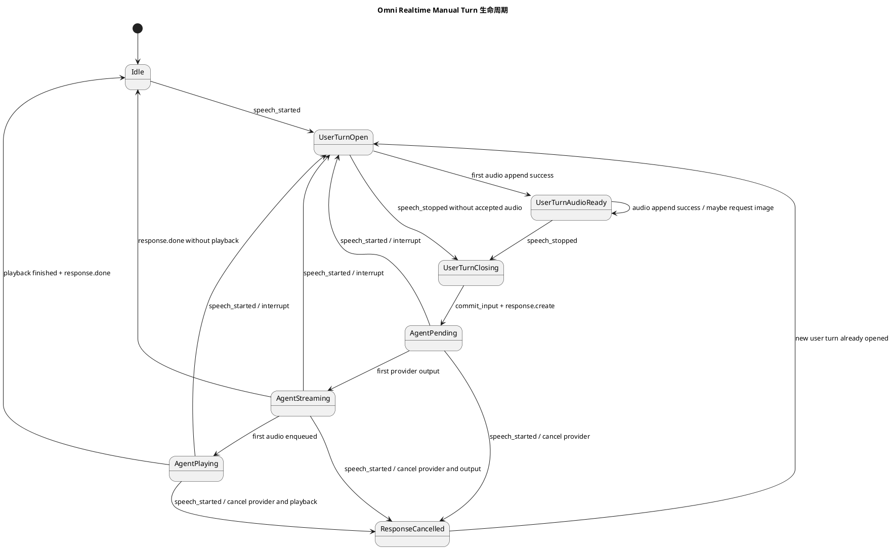
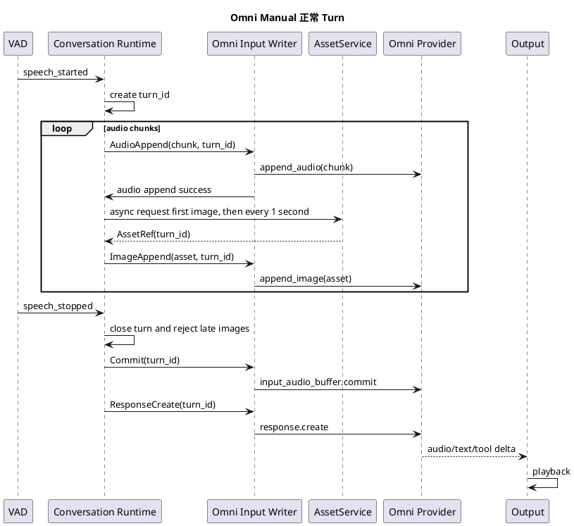
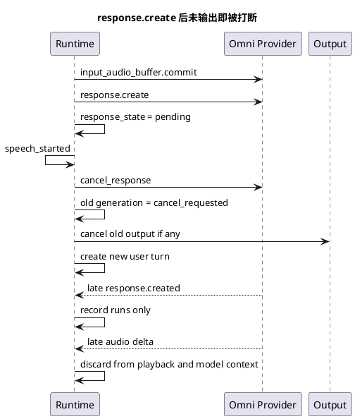
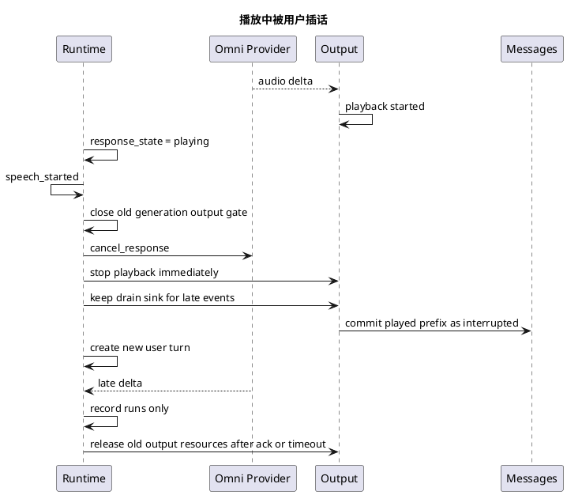

# Omni Realtime Manual Turn 生命周期设计

## 背景

Omni Realtime manual 模式下，provider 不负责判断用户语音边界。服务端必须基于本地 `speech_started` / `speech_stopped` 信号，把麦克风音频、视觉帧、输入提交、响应创建和打断处理组织成稳定的 turn 生命周期。

本设计的目标是让每个用户语音 turn 都有清晰边界：

```text
speech_started -> append audio / append image -> speech_stopped -> commit_input -> response.create
```

其中 `speech_started` / `speech_stopped` 是唯一可信的用户说话边界。ASR final、provider transcript、response done、playback done 都不能反向决定用户 turn 是否开始或结束。

## 目标

1. 用户开始说话后，立即进入新的用户 turn，并允许音频持续 append 到 Omni provider。
2. 用户停止说话后，立即停止本 turn 的音频和图片 append，并执行 `input_audio_buffer.commit` 与 `response.create`。
3. 图片采样跟随音频 turn，不再由独立视觉线程按全局时间自行判断 turn 生命周期。
4. 用户插话可以发生在 Agent 生成、流式输出、播放或 pending 阶段的任意时刻。
5. 旧 response 被打断后，不能继续播放旧音频，也不能把用户没有听到的内容当作完整上下文传给下一轮模型。
6. 所有迟到事件都要进入 runs 诊断，但只有符合语义的内容进入模型上下文。

## 非目标

1. 不在本设计中重新选择 VAD 模型。
2. 不把 ASR 文本作为 Omni manual 的 turn 边界。
3. 不要求视觉帧阻塞音频 append 或阻塞 commit。
4. 不保证 provider cancel 后不会再返回迟到事件；本地必须能识别和丢弃迟到输出。

## 核心假设

1. `speech_started` 和 `speech_stopped` 总是成对出现。
2. 一次用户插话一定体现为上一个 `speech_stopped` 之后的下一个 `speech_started`。
3. 麦克风 audio chunk 会持续到达服务端，但图片采样策略不依赖 chunk 计数。
4. Omni provider manual 输入 buffer 要求同一轮输入中先 append audio，再 append image。
5. `speech_stopped` 后应优先保证 commit/create 的确定性，不等待迟到图片。

## 总体状态机



## 用户 Turn 状态

每个 session 最多只有一个当前用户 turn。`speech_started` 创建新的 `turn_id`，`speech_stopped` 关闭它。

建议维护的最小状态：

| 字段 | 含义 |
| --- | --- |
| `turn_id` | 当前用户语音 turn 的唯一标识。 |
| `phase` | `open`、`audio_ready`、`closing`、`committed`。 |
| `has_provider_audio` | 当前 turn 是否已经成功 append 过 provider audio。 |
| `audio_appended_ms` | 当前 turn 已成功 append 的音频时长，仅用于诊断和 runs 观察。 |
| `visual_started` | 当前 turn 是否已经在首个 audio append 成功后启动图片采样。 |
| `visual_interval_seconds` | 图片采样固定间隔，默认沿用当前策略为 1 秒。 |
| `commit_started` | 是否已经开始 commit，本字段为 true 后禁止 append image。 |

### `speech_started`

`speech_started` 到达时：

1. 创建新的 `turn_id`。
2. 将用户 turn phase 设为 `open`。
3. 重置 `has_provider_audio=false`。
4. 重置 `audio_appended_ms=0`。
5. 重置图片采样状态。
6. 如果存在旧 Agent response，按打断规则取消。
7. 允许后续 audio chunk append 到 provider。

`speech_started` 不应直接 append image。图片必须等到本 turn 至少有一段 audio append 成功之后。

### `audio append success`

每个 audio chunk 成功 append 到 provider 后：

1. 如果当前 turn phase 是 `open`，切换为 `audio_ready`。
2. 设置 `has_provider_audio=true`。
3. 累加 `audio_appended_ms`。
4. 如果本 turn 尚未启动图片采样，立即异步请求第一张图片，并启动固定 1 秒间隔的后续采样。

图片采样的启动由首个成功 append 的音频驱动；后续采样沿用当前已实现的固定时间间隔策略，不再按音频 chunk 数或累计音频时长触发。

推荐策略：

```text
first successful audio append -> request first image immediately
then every 1 second while this turn is still active -> request next image
speech_stopped -> reject future and late image append
```

### `speech_stopped`

`speech_stopped` 到达时：

1. 将当前 turn phase 设为 `closing`。
2. 设置 `commit_started=true`。
3. 拒绝新的图片请求。
4. 迟到图片返回后直接记录为 discarded，不再 append 到 provider。
5. 执行 `commit_input`。
6. 执行 `response.create`。
7. 将用户 turn phase 设为 `committed`。

`speech_stopped` 后不等待 in-flight image request。原因是图片是本 turn 的辅助上下文，不能阻塞 Omni manual 的输入提交。

## 图片采样策略

图片采样以首个成功 append 的音频作为启动信号，之后按固定 1 秒间隔采样：

```text
first audio append success
  -> request first image asynchronously
  -> start 1 second visual sampling timer
image returns
  -> validate turn state
  -> append image or discard
speech_stopped
  -> stop timer
  -> reject late image append
```

### 请求图片

触发图片请求时，应带上当前 `turn_id` 和采样点信息：

| 字段 | 含义 |
| --- | --- |
| `turn_id` | 图片所属用户 turn。 |
| `audio_offset_ms` | 触发图片请求时，本 turn 已 append 的音频时长，仅用于诊断。 |
| `frame_index` | 当前 turn 内第几张图片。 |
| `correlation_id` | 用于 runs 追踪请求和返回。 |

图片请求可以异步执行，但不能阻塞音频 append 热路径。固定 1 秒间隔只用于决定何时发起图片请求，不要求 audio chunk 计数精确命中。

### append 图片

图片返回后，只有同时满足以下条件才允许 append 到 provider：

1. session 仍然打开。
2. `asset.turn_id == current_turn.turn_id`。
3. 当前 turn phase 是 `audio_ready`。
4. `has_provider_audio == true`。
5. `commit_started == false`。

任何条件不满足，都应记录 `visual_frame.discarded`，但不视为主链路错误。

### provider 写入串行化

虽然图片请求可以异步，provider 写入不应多线程并发调用。推荐使用 session 级 input writer 串行执行：

```text
AudioAppend(chunk)
ImageAppend(asset, turn_id)
Commit(turn_id)
ResponseCreate(turn_id)
```

这样可以保证 provider 看到的输入顺序稳定，避免 `append image before append audio` 一类错误。

## Agent Response 生命周期

`response.create` 之后，Agent response 进入独立生命周期。它不能只用 playback 状态表达，因为用户可能在 provider 尚未返回任何内容前插话。

建议 response 状态：

| 状态 | 含义 |
| --- | --- |
| `none` | 没有活跃 response。 |
| `create_requested` | 本地已调用 `response.create`。 |
| `pending` | 等待 provider 返回 `response.created` 或第一个 delta。 |
| `streaming` | provider 已开始返回 text/audio/tool delta。 |
| `playing` | 至少有一部分 audio 已进入 playback。 |
| `cancel_requested` | 用户插话后，本地已请求取消 provider response。 |
| `cancelled` | 本地已关闭该 response generation，后续迟到事件只进 runs。 |
| `done` | provider 正常完成，且输出链路完成。 |

### response generation

每次 `response.create` 都应创建新的 response generation：

```text
response_generation += 1
active_response_generation = response_generation
response_state = pending
```

provider 迟到事件必须先校验 generation。旧 generation 的 delta、done、created 不能进入当前播放链路。

如果 provider 后续才返回真实 `response_id`，应把它绑定到当前 generation；如果该 generation 已经被 cancel，则只用于诊断和后续 cancel 补偿。

## 打断规则

打断由新的 `speech_started` 触发。打断对象是上一轮 Agent response，而不仅是正在播放的音频。

### 打断 pending response

场景：

```text
commit_input -> response.create -> no provider output yet -> speech_started
```

处理：

1. 调用 provider cancel。
2. 将 response state 设为 `cancel_requested`。
3. 标记 active response generation 已关闭。
4. 后续迟到 `response.created` 只记录到 runs。
5. 后续迟到 audio/text delta 不播放，不进入模型上下文。

### 打断 streaming response

场景：

```text
provider 已返回 text/audio delta，但还没有播放或只生成未播放内容 -> speech_started
```

处理：

1. 调用 provider cancel。
2. 停止旧 response 继续进入 output。
3. 未播放内容只进入 runs 诊断。
4. 不把未播放内容写入下一轮模型上下文。

### 打断 playing response

场景：

```text
Agent 已经播放部分音频 -> speech_started
```

处理：

1. 调用 provider cancel。
2. 停止 playback 和 output stream。
3. 已经播放给用户的 Agent 内容可以进入模型上下文，但必须标记 `interrupted=true`、`playback_complete=false`。
4. 已生成但未播放的内容只进入 runs 诊断。

## 打断资源释放顺序

打断时既要让用户体感上“立刻停止”，又要避免消费方资源已经释放、生产方仍继续产生旧输出而触发异常。因此打断不能简单地先关闭所有输出对象，而应采用“先关闸、再取消生产、最后释放资源”的顺序。

推荐顺序：

1. 标记旧 response generation 为 `cancel_requested`，立即关闭旧 generation 进入播放和模型上下文的入口。
2. 立即向端侧或本地 playback 发出停止播放信号，让用户听感上马上停止。
3. 请求 provider cancel，阻止旧 response 继续生成。
4. 保留旧 output stream / response sink 的最小 drain 能力，允许迟到 delta 被识别、记录并丢弃。
5. 等待 provider cancel ack、response done、output finish，或等待一个很短的本地超时。
6. 超时或确认结束后，再释放旧 output stream、playback buffer、response sink 和 turn 相关资源。
7. 新用户 turn 不等待旧资源完全释放；它可以在第 1 步完成后立即开始接收和 append 新音频。

这个顺序的重点是：用户侧先停止播放，生产侧尽快 cancel，消费侧不要立刻销毁到无法接收迟到事件。消费侧应至少能在短时间内安全处理以下迟到事件：

| 迟到事件 | 处理 |
| --- | --- |
| 旧 response audio delta | 记录 runs，不进入 speaker。 |
| 旧 response text delta | 记录 runs，不进入模型上下文。 |
| 旧 response done/cancelled | 标记旧 generation 结束，然后释放资源。 |
| 旧 output finish | 如果 generation 已关闭，只作为资源释放确认。 |

如果某个下游消费方无法保留 drain 能力，就必须在 producer cancel 完成或本地超时后再销毁它；否则需要在消费方入口显式捕获 “resource already closed” 类异常，并按旧 generation 迟到事件处理，不能让异常传播到主链路。

## “丢弃”的精确定义

打断后的“丢弃”不是删除所有证据，而是按不同链路分别处理：

| 链路 | 处理方式 |
| --- | --- |
| Provider | 尽力调用 cancel，终止旧 response 继续生成。 |
| Playback | 旧 response 的迟到 audio delta 不再进入 speaker。 |
| Model context | 只保留用户实际听到或系统确认已输出的 Agent 内容。 |
| Runs | 完整记录 cancel、迟到事件、未播放文本和丢弃原因。 |

这样可以避免模型在下一轮基于“它以为自己已经说过、但用户没有听到”的内容继续对话。

## 标准时序

### 正常一轮问答



### Pending 阶段被插话



### 播放中被插话



## 上下文写入规则

Omni manual 链路至少应区分三类文本：

| 类型 | 是否进入模型上下文 | 说明 |
| --- | --- | --- |
| 用户转写文本 | 是 | 来自当前或历史用户 turn。 |
| Agent 已播放文本 | 是 | 用户已经听到，下一轮模型可以引用。 |
| Agent 已生成但未播放文本 | 否 | 只写 runs，不能让模型假设用户听过。 |

如果无法精确获得已播放文本边界，优先保守处理：

1. 已确认播放完成的 response 正常写入上下文。
2. 被打断 response 只写入已确认播放前缀。
3. 无法确认播放前缀时，不把该 Agent 内容写入模型上下文，只在 runs 中记录。

## 运行产物建议

为了排查 turn 生命周期，需要在 runs 中记录以下事件：

| 事件 | 关键字段 |
| --- | --- |
| `omni.turn.started` | `turn_id`、`session_id`、`stream_id`、`reason` |
| `omni.input_audio.appended` | `turn_id`、`duration_ms`、`audio_appended_ms` |
| `omni.visual_frame.requested` | `turn_id`、`frame_index`、`audio_offset_ms` |
| `omni.visual_frame.appended` | `turn_id`、`frame_index`、`asset_id` |
| `omni.visual_frame.discarded` | `turn_id`、`asset_id`、`reason` |
| `omni.turn.stopped` | `turn_id`、`audio_appended_ms` |
| `omni.input.committed` | `turn_id`、`reason` |
| `omni.response.create.requested` | `turn_id`、`response_generation` |
| `omni.response.cancel.requested` | `response_generation`、`response_state`、`reason` |
| `omni.response.late_event.discarded` | `response_generation`、`event_type`、`reason` |
| `omni.playback.interrupted` | `response_generation`、`played_text_available` |

这些事件应能回答四个问题：

1. 每张图片属于哪个用户 turn。
2. 图片 append 前，本 turn 是否已经成功 append audio。
3. `speech_stopped` 后是否还有迟到图片或迟到 response delta。
4. 插话时旧 response 处于 pending、streaming 还是 playing。

## 验收标准

1. 任意 turn 中，provider 不会收到 image-before-audio。
2. `speech_stopped` 后不会再向同一 turn append image。
3. `response.create` 后、provider 尚未输出时发生插话，也会取消旧 response generation。
4. 旧 response 的迟到 audio delta 不会进入播放。
5. 被打断但未播放的 Agent 文本不进入下一轮模型上下文。
6. 短语音 turn 也能在第一段成功 audio append 后尽快请求至少一张图片。
7. 长语音 turn 在首个 audio append 成功后，按固定 1 秒间隔稳定采样。

## 实施顺序建议

1. 引入用户 turn 状态，先只记录 `turn_id`、phase 和 audio append 状态。
2. 把图片采样从独立 sampler loop 改为 audio append success 触发。
3. 引入 session 级 input writer，串行化 audio、image、commit 和 response.create。
4. 引入 response generation 和 pending/streaming/playing/cancel 状态。
5. 收紧 message 写入规则，区分已播放、未播放和 interrupted Agent 内容。
6. 补 runs 事件和协议测试，再用真实 browser-glass / device demo 做插话回归。

## 实施记录

### 阶段 1：服务端 turn 生命周期与视觉采样

- 状态：已完成。
- 目标：让 Omni manual 使用 `speech_started/speech_stopped` 创建和关闭用户 turn，图片必须绑定当前 turn 且在首个 provider audio append 成功后才请求。
- 实现：
  - 在 `OmniRealtimeAgentCore` 中新增 `_OmniManualUserTurn`，记录 `turn_id`、phase、`has_provider_audio`、`audio_appended_ms`、`commit_started` 等状态。
  - `speech_started` 创建新 turn，并先打断旧 response/output；`speech_stopped` 将 turn 切到 closing，立即关闭视觉 append 窗口并使视觉 generation 失效。
  - 首个 provider audio append 成功后立即启动 visual sampler，请求第一张图片；后续仍沿用固定 `visual_frame_interval_seconds` 间隔采样。
  - 图片返回后必须校验当前 turn、phase=`audio_ready`、已有 provider audio、未开始 commit、generation 匹配，否则只记录 `omni.visual_frame.discarded`。
- 文件：
  - `agent-server/realtime_agent/conversation/core/omni_host.py`
  - `agent-server/protocol-tests/sdk/conversation/test_omni_agent_core.py`
- 验证：
  - `.venv/bin/python -m pytest agent-server/protocol-tests/sdk/conversation/test_omni_agent_core.py -q` 通过。

### 阶段 2：provider 输入串行化

- 状态：已完成。
- 目标：避免 audio/image/commit/create 多线程并发调用 provider，消除 image-before-audio 竞态。
- 实现：
  - 新增 session 级 `_input_writer_lock`。
  - provider `append_audio`、`append_image`、`commit_input`、`create_response` 都通过同一把锁串行执行。
  - 图片 append 前在锁内再次校验 turn 状态，防止拿到锁之前 turn 已 stopped/committed。
- 文件：
  - `agent-server/realtime_agent/conversation/core/omni_host.py`
- 验证：
  - `.venv/bin/python -m pytest agent-server/protocol-tests/sdk/conversation/test_omni_agent_core.py -q` 通过。

### 阶段 3：pending response 打断与迟到输出隔离

- 状态：已完成。
- 目标：`response.create` 已发但 provider 未输出时，下一次 `speech_started` 也必须取消旧 response generation；迟到 audio/text 只进 runs，不进入播放或模型上下文。
- 实现：
  - 新增 `_OmniResponseLifecycle`，在本地 `create_response` 请求时创建 response generation，而不是等 provider `response.created`。
  - 打断时先标记旧 generation 关闭并停止 playback，再调用 provider cancel。
  - provider 返回真实 response_id 后绑定到当前 generation；被打断 generation 的迟到 audio/text/done 被识别并丢弃。
  - 对 provider VAD 兼容路径保留保护：不同 response_id 的新 `response.created` 会开启新 generation。
- 文件：
  - `agent-server/realtime_agent/conversation/core/omni_host.py`
  - `agent-server/protocol-tests/sdk/conversation/test_omni_agent_core.py`
- 验证：
  - 新增 `test_omni_manual_interrupt_cancels_pending_response_before_provider_output` 覆盖 pending 阶段插话。
  - `.venv/bin/python -m pytest agent-server/protocol-tests/sdk/conversation/test_omni_agent_core.py -q` 通过。

### 阶段 4：验收审计补齐

- 状态：已完成。
- 目标：补齐设计文档中对 turn 归属、模型上下文收敛、runs 诊断事件和长语音采样的验收要求。
- 实现：
  - 图片 append 前显式校验 `asset.metadata["turn_id"]`，不允许其他 turn 的图片进入当前 provider buffer。
  - 被打断的 Agent 文本只写入确认已播放前缀；未确认播放或未播放的 generated text 只进入 runs 诊断，不写入 `messages.jsonl` 模型上下文。
  - `omni.input_audio.appended`、`omni.input.committed`、`omni.response.create.requested` 补齐 `turn_id`，`response.create` 补齐 `response_generation`。
  - `omni.response.cancel.requested`、`omni.response.late_event.discarded`、`omni.playback.interrupted` 用于排查 cancel、迟到输出和播放打断。
  - 新增长语音固定间隔采样测试，验证首帧之后不依赖 audio chunk 计数继续采样。
- 文件：
  - `agent-server/realtime_agent/conversation/core/omni_host.py`
  - `agent-server/protocol-tests/sdk/conversation/test_omni_agent_core.py`
- 验证：
  - 新增 `test_omni_manual_turn_discards_asset_from_other_turn` 覆盖图片 turn 归属。
  - 新增 `test_omni_manual_turn_samples_long_speech_at_fixed_interval` 覆盖固定间隔采样。
  - 新增 `test_conversation_runtime_omni_manual_records_turn_lifecycle_events` 覆盖关键 runs 事件字段。

### 当前验证

- `.venv/bin/python -m py_compile agent-server/realtime_agent/conversation/core/omni_host.py`：通过。
- `.venv/bin/python -m pytest agent-server/protocol-tests/sdk/conversation/test_omni_agent_core.py -q`：通过。
- `.venv/bin/python -m pytest agent-server/protocol-tests/sdk/config/test_config_sync.py -q`：通过。

### 待人工验收

- 需要用真实 browser-glass / device demo 复测：
  - 短语音 turn 是否能在首个 audio append 后拿到首帧照片。
  - `speech_stopped` 后迟到图片是否只记录 discarded，不再触发 provider image-before-audio。
  - response pending、streaming、playing 三种阶段插话时，端侧听感是否立即停止，后续迟到旧音频不再播放。
