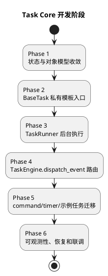

# Task Core 开发计划

本文基于 [TaskCore设计.md](TaskCore设计.md)，拆分 `realtime-agent` Task Core 的实现步骤。目标是先建立稳定的 Task actor 内核，再迁移端侧命令、计时器和示例任务，避免后台执行、事件路由和业务任务改造同时落地导致排障困难。

## 1. 实施原则

1. 先改 SDK 内核，再迁移示例应用任务。
2. 每个阶段必须能独立测试，不依赖真实端侧设备才能暴露核心问题。
3. `task.event.*` 是 Task actor 的唯一输入事件；`TaskSignal` 只做 Agent 回流、Output 通知和 runs 记录。
4. 对外生命周期状态只使用 `started`、`finished`、`cancelled`、`failed`。
5. 业务开发者只覆写 `run()` 和 `on_*()` hook，不覆写 BaseTask 私有 `_process_*()`。

## 2. 总体顺序

## 3. Phase 1：状态与对象模型收敛

目标：让 `TaskRef`、`TaskStateMachine`、`TaskStore` 和设计文档中的生命周期语义一致。

改动范围：

1. `agent-server/realtime_agent/tasks.py`
2. `agent-server/tests/`
3. 与 Task 状态相关的 runs 序列化和反序列化逻辑。

具体改动：

1. `TaskRef.state` 收敛为 `started`、`finished`、`cancelled`、`failed`。
2. `TaskStateMachine` 只允许：
   - `started -> finished`
   - `started -> cancelled`
   - `started -> failed`
   - 终态不可回退。
3. `timeout` 不作为生命周期状态，超时统一记录为 `failed`，并在 `metadata.error.reason` 或失败 payload 中写 `timeout`。
4. 兼容读取旧 runs 中的 `running`、`completed`、`timeout`：
   - `running` 映射为 `started`
   - `completed` 映射为 `finished`
   - `timeout` 映射为 `failed`，并补 `reason=timeout`

验收：

1. 新建任务后对外状态为 `started`。
2. 正常完成后状态为 `finished`。
3. 取消后状态为 `cancelled`。
4. 失败和超时后状态为 `failed`。
5. 重复终态迁移不会重复写结果或重复播报。

测试：

1. 状态迁移合法性测试。
2. 旧状态兼容读取测试。
3. 重复 `finish/error/cancel` 幂等测试。

## 4. Phase 2：BaseTask 私有模板入口

目标：把框架不变量和业务扩展点分开。

改动范围：

1. `agent-server/realtime_agent/tasks.py`
2. 示例应用中的 `BaseTask` 子类。
3. 相关单元测试。

具体改动：

1. `BaseTask` 对业务开发者暴露：
   - `run(context)`
   - `on_start(context, event)`
   - `on_process(context, event)`
   - `on_status(context, event)`
   - `on_finish(context, event)`
   - `on_cancel(context, event)`
   - `on_error(context, event)`
2. `BaseTask` 内部实现私有模板入口：
   - `_process_start()`
   - `_process_process()`
   - `_process_status()`
   - `_process_finish()`
   - `_process_cancel()`
   - `_process_error()`
3. `_process_finish()` 先调用 `on_finish()`，再统一 `context.complete()`。
4. `_process_error()` 先调用 `on_error()`，再统一 `context.fail()`。
5. `_process_cancel()` 调用 `on_cancel()` 后统一推进 `cancelled`。
6. 文档和注释明确 `_process_*()` 是 SDK 内部入口，不作为业务覆写契约。

验收：

1. 业务覆写 `on_finish()` 不能绕过 `finished` 状态流转。
2. 业务覆写 `on_error()` 不能绕过 `failed` 状态流转。
3. `on_process()` 和 `on_status()` 不直接改变生命周期状态。

测试：

1. 覆写 `on_finish()` 后仍完成任务。
2. 覆写 `on_error()` 后仍失败任务。
3. `_process_*()` 的分发表覆盖六种事件类型。

## 5. Phase 3：TaskRunner 后台执行

目标：`TaskEngine.create()` 快速返回，不等待长任务执行完成。

改动范围：

1. `agent-server/realtime_agent/tasks.py`
2. `agent-server/realtime_agent/tools.py` 中 `TaskStartTool` 相关测试。
3. `agent-server/tests/`。

具体改动：

1. 新增 `TaskRunner`，由 Task Core 持有后台事件循环或等价的后台任务执行器。
2. `TaskEngine.create()`：
   - 创建 `TaskRef(started)`
   - 保存 Task actor 实例
   - 写入 `task.started` 信号
   - 提交 `task.run(context)`
   - 立即返回 `TaskRef(started)`
3. `TaskRunner` 捕获后台异常，转为 `task.event.error`，payload 写入：
   - `reason=runner_failed`
   - `raw_error`
   - 安全 `user_message`
4. `TaskEngine.shutdown()` 关闭 runner、调度器和未完成任务。

验收：

1. 长 `run()` 不阻塞启动工具返回。
2. 后台异常进入 `failed`。
3. runner 状态可在 runs 或 debug API 中观察。

测试：

1. `TaskEngine.create()` 对长任务立即返回。
2. `run()` 抛异常后状态为 `failed`。
3. `TaskStartTool` 的耗时不接近任务实际运行耗时。

## 6. Phase 4：统一事件解析与路由

目标：新增 `TaskEngine.dispatch_event(event: Event)`，让外部输入回到具体 Task actor。

改动范围：

1. `agent-server/realtime_agent/tasks.py`
2. `agent-server/realtime_agent/app.py`
3. runs 记录和测试。

具体改动：

1. 新增 `TaskEventView`。
2. 实现 `TaskEngine.dispatch_event(event: Event)`：
   - 校验 `event_name` 是 `task.event.*`
   - 解析 `task_event_type`
   - 校验 `payload.task_id`
   - 查找 Task actor
   - 校验 `payload.task_type`
   - 拒绝终态任务重复分发
   - 提交 `_process_*()` 到 `TaskRunner`
3. 记录分发结果：
   - `task.event.dispatch.accepted`
   - `task.event.dispatch.skipped`
   - `task.event.dispatch.failed`
4. `TaskEngine.cancel()` 改为投递 `task.event.cancel`。
5. 调度器到点改为投递 `task.event.finish`、`task.event.process` 或 `task.event.error`。

验收：

1. `task.event.process` 能定位到指定 Task actor。
2. 缺 `task_id`、找不到实例、`task_type` 不匹配、终态重复事件都有明确记录。
3. 终态重复事件不重复调用业务 hook。

测试：

1. `dispatch_event()` 解析六种 `task.event.*`。
2. `command.progress` 转换后的事件触发 `on_process()`。
3. 终态后重复 `finish` 被跳过。
4. 设备离线事件进入 `on_error()`。

## 7. Phase 5：command、timer 和示例任务迁移

目标：把现有混杂在 App 层、`TaskSignal` 和 `CommandHandle.results()` 的任务推进逻辑迁到 Task actor。

改动范围：

1. `agent-server/realtime_agent/app.py`
2. `agent-server/realtime_agent/tools.py`
3. `dev-support/agent-server/capabilities/tasks.py`
4. `examples/device_app_demo/tests/`

具体改动：

1. `_handle_device_command_report()` 不再直接完成任务，只负责转换事件：
   - `command.accepted -> task.event.status`
   - `command.progress -> task.event.process` 或 `task.event.status`
   - `command.completed -> task.event.finish`
   - `command.failed -> task.event.error`
2. `command.failed.message` 写入 `raw_error`，只有端侧明确提供 `user_message` 或 `text` 时才允许播报。
3. `find_object_task` 和 `traffic_light_task`：
   - `run()` 只启动第一步命令并返回。
   - `on_process()` 处理 `peer.receiver.ready`、`peer.sender.connected` 等节点。
   - `on_finish()` 处理结果摘要和必要播报。
   - `on_error()` 处理安全错误文案。
4. `timer_task`：
   - 到点投递 `task.event.finish`。
   - 允许直通通知，但仍经过 `TaskSignalBridge` 和 Output Service。
5. 会话关闭：
   - `timer_task` 按策略继续。
   - 视频类任务按策略取消，并生成 `task.event.cancel`。

验收：

1. `start_find_object_task` 立即返回。
2. phone `command.progress` 能触发后续 glass 命令。
3. phone `command.completed` 能触发 `on_finish()` 并最终 `finished`。
4. phone `command.failed` 原文落盘但不直接播报。
5. 计时器到点能播报。
6. 会话关闭后视频任务取消，计时器继续。

测试：

1. `start_find_object_task` 不等待 `command.completed`。
2. `command.progress` 触发 `on_process()`。
3. `command.completed` 触发 `_process_finish()`。
4. `command.failed` 触发 `_process_error()`。
5. `timer_task` 到点走 `task.event.finish`。
6. 会话关闭策略覆盖 continue/cancel。

## 8. Phase 6：可观测性、恢复和联调

目标：让真实跨设备问题可以从 runs 和 debug API 中定位。

改动范围：

1. `agent-server/realtime_agent/observability.py`
2. `agent-server/realtime_agent/tasks.py`
3. `agent-server/realtime_agent/app.py`
4. `agent-server/docs/how-to/运行产物排查说明.md`
5. `examples/device_app_demo/tests/`

具体改动：

1. runs 中补充：
   - `task-events.jsonl`
   - `task-dispatch-events.jsonl`
   - `task-runner-events.jsonl`
2. `/api/debug/tasks` 展示：
   - TaskRef state
   - runner 子状态
   - metadata.waiting_for
   - 最近 dispatch 结果
   - 最近 TaskSignal
3. `TaskStore` 支持恢复 recoverable task。
4. 不可恢复的端侧连接类任务在服务重启后进入 `failed`，并记录安全原因。
5. 更新文档中的 runs 排障说明。

验收：

1. 能从 runs 判断 Task 是何时启动、何时收到端侧事件、何时终态。
2. 能区分 dispatch skipped、dispatch failed 和业务 `on_error()`。
3. 真实浏览器眼镜 + Python phone 联调时，找物任务的每个关键节点可观测。

测试和联调：

1. 单元测试覆盖 runs 记录。
2. 本地启动 server、browser-glass、python-phone。
3. 触发找物任务，观察：
   - `task.event.start`
   - `command.requested`
   - `command.progress`
   - `task.event.process`
   - `command.completed`
   - `task.event.finish`
   - `task.finished`
4. 断开设备，观察未完成任务进入 `failed`，且错误原文不播报。

## 9. 建议开发顺序

优先顺序：

1. Phase 1：状态与对象模型收敛。
2. Phase 2：BaseTask 私有模板入口。
3. Phase 3：TaskRunner 后台执行。
4. Phase 4：统一事件解析与路由。
5. Phase 5：迁移 command、timer 和示例任务。
6. Phase 6：补可观测性、恢复和真实联调。

最小可合并切片：

1. `TaskRef` 状态和状态机改造，测试通过。
2. `BaseTask._process_*()` 和 `TaskEventView`，测试通过。
3. `TaskRunner` 后台执行，`TaskEngine.create()` 快返回。
4. `dispatch_event()` 完整路由，含 skipped/failed 记录。
5. `timer_task` 迁移，验证到点播报。
6. `find_object_task` 迁移，验证跨设备链路。

## 10. 风险和注意事项

1. `TaskEngine.create()` 后台化后，要避免临时 event loop 退出导致后台任务被取消。
2. `_process_finish()` 和 `_process_error()` 必须保证终态流转，即使业务 hook 抛异常，也要进入安全失败路径。
3. `TaskSignalBridge` 不能重新承担事件分发职责，否则会回到当前混乱状态。
4. `command.failed.message` 不得默认作为 TTS 文案。
5. 会话关闭不能一刀切取消所有任务，必须依赖 `session_close_policy`。
6. 真实端侧命令可能重复、乱序、延迟到达，dispatch 必须保证终态幂等。

## 11. 当前实现记录

更新时间：2026-05-13

本轮已完成：

1. Phase 1 已落地：
   - `TaskRef.state` 收敛为 `started`、`finished`、`cancelled`、`failed`。
   - `TaskStateMachine` 只允许 `started -> finished/cancelled/failed`。
   - 旧 runs 中的 `scheduled/running/waiting_external/completed/timeout` 会在读取时映射到新状态。
   - 超时不再作为生命周期状态，查询时统一流转到 `failed`，payload 记录 `reason=timeout`。
2. Phase 2 已落地：
   - `BaseTask` 新增 `run()` 和 `on_start/on_process/on_status/on_finish/on_cancel/on_error`。
   - `_process_start/_process_process/_process_status/_process_finish/_process_cancel/_process_error` 作为内部模板入口。
   - `_process_finish()`、`_process_error()`、`_process_cancel()` 统一注入终态流转逻辑。
   - 旧版 `on_start(context)`、`on_cancel(context)` 签名保持兼容。
3. Phase 3 已落地：
   - 新增 `TaskRunner`。
   - `TaskEngine.create()` 创建 `TaskRef(started)` 后提交后台 `task.run(context)`，并快速返回。
   - 后台异常会转换为 `task.event.error`。
   - `TaskEngine.shutdown()` 会关闭调度器和 runner。
4. Phase 4 已落地：
   - 新增 `TaskEventView`。
   - 新增 `TaskEngine.dispatch_event(event)`，支持 `task.event.start/process/status/finish/cancel/error`。
   - 分发结果写入 `task.event.dispatch.accepted/skipped/failed`。
   - `TaskEngine.cancel()` 通过 `task.event.cancel` 进入 Task actor，取消 API 保持同步返回取消后的状态。
   - 缺少 Task 实例但存在 TaskRef 时，`finish/error/cancel` 会走默认终态收口，避免端侧终态事件丢失。
5. Phase 5 部分落地：
   - `app._handle_device_command_report()` 不再直接 `complete/fail`，统一把 `command.*` 转成 `task.event.*`。
   - `CommandResultBroker` 记录命令登记时的 `task_id/task_type` 元数据；端侧只回 `command_id` 时也能路由到对应 Task。
   - `timer_task` 到点通过 `task.event.finish` 完成。
   - `find_object_task`、`traffic_light_task` 已补 `on_finish()`，可以由 `command.completed -> task.event.finish` 驱动业务信号、播报和完成。

本轮暂未完全落地：

1. Phase 5 中 `find_object_task`、`traffic_light_task` 仍保留旧的 `on_start()` 阻塞编排作为兼容路径；后续可以继续拆成 `run()` 快速启动、`on_process()` 处理 ready/connected、`on_finish()` 处理终态的纯 actor 形态。
2. Phase 6 已补 `/api/debug/tasks`，可以查看 TaskRef、最近 TaskSignal 和调度等待项；dispatch 结果目前仍通过现有 `TaskSignalBridge` 记录。
3. 尚未新增独立的 `task-events.jsonl`、`task-dispatch-events.jsonl`、`task-runner-events.jsonl`。
4. `session_close_policy`、任务恢复策略和真实跨设备联调仍需后续切片。

已验证：

1. `uv run python -m pytest agent-server/protocol-tests/sdk/runtime/test_task_engine_scheduler.py agent-server/protocol-tests/sdk/runtime/test_task_engine_persistence.py agent-server/protocol-tests/sdk/runtime/test_task_manage_tool.py agent-server/protocol-tests/acceptance/test_architecture_design_contract_acceptance.py examples/device_app_demo/app-tests/capabilities/test_phone_task_contract.py examples/device_app_demo/app-tests/capabilities/test_peer_video_tasks.py -q`
   - 结果：26 passed。

补充说明：

1. 本轮也尝试运行 `uv run python -m pytest agent-server/tests -q`，但当前工作树存在多类与 Task Core 无直接关系的既有失败，包括文档状态矩阵、CLI 帮助输出、ControlService 路由、输出播放、ASR 输入流等。上述失败未在本轮处理。
