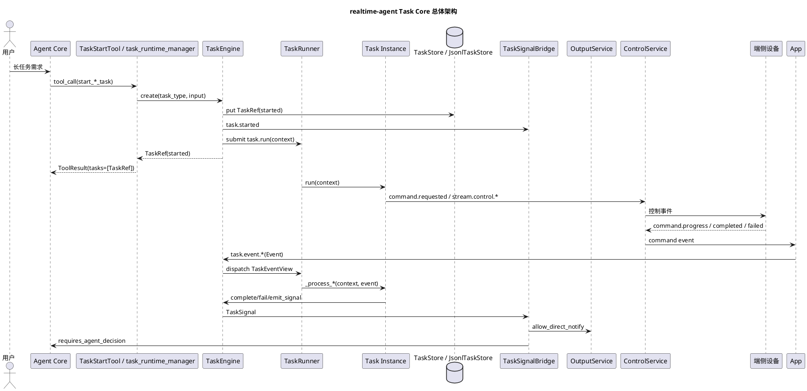
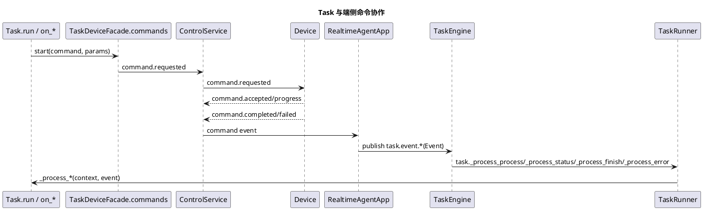

# realtime-agent Task Core 设计

本文面向当前新版 `realtime-agent`，说明 Task Core 的目标架构、当前实现边界和后续演进要求。文档统一使用当前 `realtime_agent` 实现中的名称，例如 `TaskEngine`、`TaskRef`、`TaskSignal`、`TaskSignalBridge`、`TaskStartTool`、`TaskRuntimeManagerTool`、`TaskContext` 和 `command.*`。

## 1. 文档定位

Task Core 是 `realtime-agent` 中与 Agent Core 平级的后台任务运行模块。它负责承接长生命周期、可取消、可查询、可恢复或需要端侧协作的任务。

本文重点回答：

1. Task Core 与 Agent Core 的职责边界。
2. 模型如何启动、查询、取消 Task。
3. Task Core 如何管理任务状态、后台执行、信号、通知和端侧命令。
4. 长流程结果如何回流 Agent Core。
5. 什么时候允许 Task 直接播报。
6. 当前实现有哪些偏差，后续如何演进。

## 2. 设计目标

Task Core 的目标：

1. 统一托管所有后台任务，不让 Agent Core 持有长期任务状态。
2. 让模型通过工具启动或管理 Task，而不是直接操作 Task 实例。
3. 让 `start_*_task` Tool 快速返回 `TaskRef`，不等待任务最终完成。
4. 让 Task 在统一状态机、统一存储、统一信号和统一输出仲裁下运行。
5. 让端侧直连、计时器、导航、找物、红绿灯等长流程复用同一套任务管理语义。
6. 让任务结果默认以结构化 `TaskSignal` 回流 Agent Core，由模型决定下一步动作。
7. 允许高时效任务直接通知用户，但必须经过 Output Service 的统一仲裁。
8. 让业务开发者只实现 `BaseTask`，不直接操作 WebSocket、播放器、底层设备连接或临时线程。

非目标：

1. 不新增一套端侧 Task 协议。端侧仍使用 `command.*`、`stream.*`、资产和控制事件。
2. 不把 MCP、Skill、设备连接直接暴露给模型。
3. 第一阶段不实现分布式任务队列；先完成单进程可靠后台执行器。

## 3. 当前核心组件

Task Core 由以下当前实现组件组成：

| 组件 | 说明 |
| --- | --- |
| `BaseTask` | 业务任务基类，示例应用通过它实现计时器、找物、红绿灯、导航等任务。 |
| `TaskSpec` | 任务模板描述，声明 `task_type`、输入模型、超时、取消能力和启动工具名。 |
| `TaskRef` | 对外稳定任务引用，供模型、工具、调试接口和运行产物使用。 |
| `TaskEngine` | 任务创建、查询、取消、状态推进和信号处理入口。 |
| `TaskContext` | Task 访问设备、资产、输出、上下文和任务状态的统一上下文。 |
| `TaskSignal` | Task 对 Agent Core 或 Output Service 发布的结构化业务信号，不负责驱动 Task actor。 |
| `TaskSignalBridge` | 负责记录信号、同步 Agent 上下文、进入 Output Service。 |
| `TaskStore` / `JsonlTaskStore` | 保存 `TaskRef` 和 `TaskSignal`，支持运行产物和后续恢复。 |
| `TaskScheduler` | 负责延时信号、超时检查和调度类任务。 |
| `TaskStartTool` | 根据 `BaseTask.spec()` 自动生成 `start_*_task` 工具。 |
| `TaskRuntimeManagerTool` | 提供任务类型查询、实例查询和取消能力。 |
| `TaskDeviceFacade.commands` / `CommandHandle` | Task 通过 Context API 下发端侧命令并接收回报。 |
| `RealtimeAgentApp._handle_command_result()` | 把端侧 `command.*` 回报转换成 `task.event.*` 后交给 TaskEngine。 |
| `OutputService.notify_task_signal()` | 在允许直通通知时，把任务信号交给输出仲裁和播放链路。 |

## 4. 核心边界

### 4.1 Agent Core 负责

1. 理解用户意图。
2. 决定是否启动、查询或取消后台任务。
3. 选择模型可见工具，例如 `start_timer_task`、`start_find_object_task`、`task_runtime_manager`。
4. 接收任务事件回流后，结合上下文做开放式决策。
5. 决定是否回复、追问、调用其他工具或更新记忆。

Agent Core 不负责：

1. 保存任务实例。
2. 等待端侧命令完成。
3. 维护任务状态机。
4. 直接操作端侧设备连接。

### 4.2 Task Core 负责

1. 注册和发现 `BaseTask`。
2. 根据 Task 类型创建 `TaskRef`。
3. 管理任务状态流转。
4. 执行 `run()`，并通过 BaseTask 私有分发入口把外部输入交给 Task 实例的 `on_*()` hook。
5. 保存任务输入、状态、结果、错误、信号和调度信息。
6. 接收端侧 `command.*` 回报并推进任务。
7. 发布结构化 `TaskSignal`。
8. 必要时申请直接通知用户。

Task Core 不负责：

1. 自己做自然语言开放式推理。
2. 直接拼接最终对话回复。
3. 绕过 Output Service 播放音频。
4. 绕过 Context API 操作设备。

### 4.3 端侧负责

1. 接收 `command.requested`。
2. 回报 `command.accepted`、`command.progress`、`command.completed`、`command.failed`。
3. 处理摄像头、麦克风、扬声器、本地模型、视频连接和硬件资源。
4. 释放端侧资源并上报最终状态。

端侧不需要理解 Task Core 内部状态机。

## 5. 总体架构



## 6. 模型可见入口

Task 不直接暴露给模型。模型只能通过工具进入 Task Core。

### 6.1 自动启动 Tool

SDK 根据 `BaseTask.spec()` 自动生成启动工具：

```text
timer_task -> start_timer_task
find_object_task -> start_find_object_task
traffic_light_task -> start_traffic_light_task
```

规则：

1. 默认工具名为 `start_{task_type}`。
2. 如果 `task_type` 不以 `_task` 结尾，则工具名为 `start_{task_type}_task`。
3. 可通过 `BaseTask.start_tool_name` 覆盖。
4. 工具参数 schema 来自 `BaseTask.input_model`。
5. 工具返回 `TaskRef`，并写入 `ToolResult.tasks`。

### 6.2 运行时管理 Tool

`task_runtime_manager` 负责：

1. `list_types`
2. `list_instances`
3. `query`
4. `cancel`

它不负责启动具体任务。启动必须调用具体 `start_*_task` Tool，这样模型可以得到明确输入 schema。

## 7. 任务对象模型

### 7.1 TaskSpec

`TaskSpec` 描述任务模板：

```python
@dataclass
class TaskSpec:
    task_type: str
    version: str = "v1"
    input_model: Any = dict
    start_tool_name: str | None = None
    timeout_seconds: float | None = None
    cancel_supported: bool = True
    max_running_per_user: int | None = None
    start_result_timeout_seconds: float = 3.0
```

建议后续扩展：

```python
recoverable: bool = False
session_close_policy: Literal["continue", "cancel", "pause"] = "cancel"
```

### 7.2 TaskRef

`TaskRef` 是对外稳定任务引用：

```python
@dataclass
class TaskRef:
    task_id: str
    task_type: str
    state: str
    summary: str = ""
    metadata: dict = field(default_factory=dict)
```

`metadata` 建议包含：

```json
{
  "user_id": "user-001",
  "session_id": "dev-browser-glass-001",
  "input": {},
  "version": "v1",
  "timeout_seconds": 30,
  "deadline_at": 0,
  "created_at": 0,
  "started_at": 0,
  "updated_at": 0,
  "runner": {
    "state": "submitted|running|finished|failed|cancelled"
  },
  "external": {
    "commands": [],
    "streams": [],
    "schedules": []
  },
  "error": {
    "code": "",
    "raw_message": "",
    "user_message": ""
  }
}
```

### 7.3 BaseTask

目标接口应把 Task 看成一个后台运行的 actor。`run()` 负责启动这个 actor，`on_*` 是业务开发者覆写的事件 hook：

```python
class BaseTask:
    task_spec = TaskSpec(task_type="...")

    async def run(self, context: TaskContext) -> TaskRunResult | None: ...
    async def on_start(self, context: TaskContext, event: TaskEventView) -> None: ...
    async def on_process(self, context: TaskContext, event: TaskEventView) -> None: ...
    async def on_status(self, context: TaskContext, event: TaskEventView) -> None: ...
    async def on_finish(self, context: TaskContext, event: TaskEventView) -> None: ...
    async def on_cancel(self, context: TaskContext, event: TaskEventView) -> None: ...
    async def on_error(self, context: TaskContext, event: TaskEventView) -> None: ...
```

语义必须明确：

1. `run()` 在 Task Core 的后台 runner 中执行，启动后 `TaskEngine.create()` 立即返回 `TaskRef`。
2. `run()` 用于初始化任务、下发第一批端侧命令、登记需要监听的事件源和调度器；它不应该长时间阻塞等待整个任务完成。
3. `run()` 可以返回 `TaskRunResult`，其中的 `TaskAgentReply` 用来告诉 Agent 启动成功或失败后应如何简短回应用户；这不是任务最终结果。
4. Task 实例创建后由 Task Core 纳入管理，直到显式完成、失败、取消或超时。
5. 端侧 `command.*`、数据流状态、调度器到点、设备离线、用户取消等外部输入都保持为统一 `Event` 信封。
6. Task Core 只允许 `start`、`process`、`status`、`finish`、`cancel`、`error` 六种事件类型，业务代码不能新增事件类型。
7. 六种事件类型不是新的协议域，而是 Task Core 从 `Event.event_name` 和 `payload` 中推导出来的处理语义。
8. 事件来源仍通过系统级 `event_name` 的第一层平面隔离，例如 `control`、`stream`、`task`、`system`。
9. 业务差异写入系统级 `Event.payload`，例如 `payload.status="peer.receiver.ready"`、`payload.result={...}`、`payload.error_code="device_offline"`。
10. Task Core 根据推导出的 `task_event_type` 调用当前实例的 `_process_start()`、`_process_process()`、`_process_status()`、`_process_finish()`、`_process_cancel()` 或 `_process_error()`。
11. `BaseTask._process_finish()` 固定负责终态注入，内部调用可覆写的 `on_finish()`，最后由模板方法完成状态流转。
12. `BaseTask._process_error()` 固定负责失败注入，内部调用可覆写的 `on_error()`，最后由模板方法完成状态流转。
13. `on_cancel()` 用于清理端侧命令、stream、schedule 和本地资源。

当前实现已经支持显式 `task_spec = TaskSpec(...)`，并在类创建时同步旧的 `task_type/input_model` 类属性以兼容发现器和旧测试。默认 `BaseTask.run()` 仍会委托 `on_start(context)`，只作为旧任务的兼容入口；新任务应显式实现 `run()`。

### 7.4 Task 事件视图

Task Core 不新增第二套事件协议。所有输入仍使用总体架构中定义的统一 `Event` 信封：

```json
{
  "event_name": "command.progress",
  "user_id": "user-001",
  "producer_id": "dev-python-phone",
  "session_id": "dev-python-phone",
  "payload": {
    "task_id": "task_001",
    "status": "peer.receiver.ready"
  }
}
```

Task Core 内部可以构造一个轻量的 `TaskEventView`，它只是对 `Event` 的分类视图，不是新的对外协议对象：

```python
@dataclass
class TaskEventView:
    event: Event
    task_id: str
    task_type: str
    task_event_type: Literal["start", "process", "status", "finish", "cancel", "error"]
```

事件类型固定如下。这里描述的是事件语义和业务扩展点，不描述 Task Core 内部模板方法：

| task_event_type | 业务 hook | 语义 |
| --- | --- | --- |
| `start` | `on_start()` | Task 实例启动后的初始化事件。 |
| `process` | `on_process()` | 过程推进事件，例如端侧处理中、阶段转换、识别中间结果。 |
| `status` | `on_status()` | 状态通知事件，例如 accepted、ready、heartbeat。 |
| `finish` | `on_finish()` | 正常终态事件，业务可补充播报、结果摘要或资源清理。 |
| `cancel` | `on_cancel()` | 取消事件，业务可清理端侧命令、stream、schedule 和本地资源。 |
| `error` | `on_error()` | 异常终态事件，业务可补充用户可听错误、错误归因或资源清理。 |

Task Core 的实现可以使用 `_process_*()` 私有模板方法承载框架约束。`_process_*()` 是架构内部入口，不是事件协议的一部分，不属于 Task 开发者扩展契约，也不应该出现在事件语义表里。

Task Core 面向任务实例分发的系统事件名应与六种处理语义一致：

| 系统事件 | task_event_type | 说明 |
| --- | --- | --- |
| `task.event.start` | `start` | Task 实例启动。 |
| `task.event.process` | `process` | Task 过程推进。 |
| `task.event.status` | `status` | Task 状态通知。 |
| `task.event.finish` | `finish` | Task 正常终态。 |
| `task.event.cancel` | `cancel` | Task 取消。 |
| `task.event.error` | `error` | Task 异常终态。 |

这些事件就是总体架构中的统一 `Event`，事件域为 `task`。Task Core 只接收和分发 `task.event.*` 这一组任务事件；具体路由到哪个 Task actor，必须依赖 `payload.task_id`。`task_type` 建议同时写入 payload，便于日志、校验和恢复。

```json
{
  "event_name": "task.event.process",
  "user_id": "user-001",
  "producer_id": "server-main",
  "payload": {
    "task_id": "task_001",
    "task_type": "find_object_task",
    "cause": {
      "domain": "device",
      "event": "command.progress"
    },
    "status": "peer.receiver.ready"
  }
}
```

Task Core 路由规则：

1. `payload.task_id` 是必填字段，用于定位正在运行的 Task 实例。
2. `payload.task_type` 是建议字段，Task Core 可用于校验事件是否投递给了正确类型的 Task。
3. 如果 `task_id` 不存在、已终态或与 `task_type` 不匹配，Task Core 不应调用 `_process_*()`，应记录 `task.event.dispatch.skipped` 或 `task.event.dispatch.failed`。
4. `event_name` 只表达事件处理语义，不承载实例身份；不要把 `task_id` 拼进事件名。

### 7.5 Task 事件解析与路由

`TaskEngine.dispatch_event(event: Event)` 是 Task Core 唯一的任务事件入口。它只接收统一 `Event`，不接收端侧原始对象、`TaskSignal` 或临时字典。

解析步骤：

1. 校验 `event.event_name` 必须属于 `task.event.start`、`task.event.process`、`task.event.status`、`task.event.finish`、`task.event.cancel`、`task.event.error`。
2. 从 `event.event_name` 解析 `task_event_type`。例如 `task.event.finish` 解析为 `finish`。
3. 从 `event.payload.task_id` 解析目标 Task 实例 ID。缺失时记录 `task.event.dispatch.failed`，原因是 `missing_task_id`。
4. 从 Task Store 读取 `TaskRef` 和运行中的 Task 实例。
5. 如果找不到 `task_id`，记录 `task.event.dispatch.skipped`，原因是 `task_not_found`。
6. 如果 Task 已经处于 `finished`、`cancelled`、`failed` 终态，记录 `task.event.dispatch.skipped`，原因是 `task_terminal`；重复终态事件只能落盘，不能再次调用业务 hook。
7. 如果 payload 携带 `task_type`，必须与 `TaskRef.task_type` 一致；不一致时记录 `task.event.dispatch.failed`，原因是 `task_type_mismatch`。
8. 构造 `TaskEventView(event, task_id, task_type, task_event_type)`。
9. 根据 `task_event_type` 选择 BaseTask 私有模板入口，并提交到 TaskRunner。
10. TaskRunner 在同一个 Task actor 执行上下文里调用 `_process_*()`，再由 `_process_*()` 调用业务 `on_*()` hook。

路由表：

| event_name | task_event_type | BaseTask 内部入口 | 业务 hook |
| --- | --- | --- | --- |
| `task.event.start` | `start` | `_process_start()` | `on_start()` |
| `task.event.process` | `process` | `_process_process()` | `on_process()` |
| `task.event.status` | `status` | `_process_status()` | `on_status()` |
| `task.event.finish` | `finish` | `_process_finish()` | `on_finish()` |
| `task.event.cancel` | `cancel` | `_process_cancel()` | `on_cancel()` |
| `task.event.error` | `error` | `_process_error()` | `on_error()` |

伪代码：

```python
async def dispatch_event(self, event: Event) -> None:
    task_event_type = parse_task_event_type(event.event_name)
    if task_event_type is None:
        await self._record_dispatch_failed(event, reason="unsupported_event")
        return

    payload = event.payload or {}
    task_id = payload.get("task_id")
    if not task_id:
        await self._record_dispatch_failed(event, reason="missing_task_id")
        return

    ref = await self._store.get(task_id)
    task = self._actors.get(task_id)
    if ref is None or task is None:
        await self._record_dispatch_skipped(event, reason="task_not_found")
        return

    if ref.state in {"finished", "cancelled", "failed"}:
        await self._record_dispatch_skipped(event, reason="task_terminal")
        return

    expected_type = payload.get("task_type")
    if expected_type and expected_type != ref.task_type:
        await self._record_dispatch_failed(event, reason="task_type_mismatch")
        return

    view = TaskEventView(
        event=event,
        task_id=task_id,
        task_type=ref.task_type,
        task_event_type=task_event_type,
    )
    await self._runner.submit_event(task_id, task, view)
```

`TaskRunner.submit_event()` 内部按类型调用私有模板入口：

```python
async def _run_event(task: BaseTask, context: TaskContext, view: TaskEventView) -> None:
    handlers = {
        "start": task._process_start,
        "process": task._process_process,
        "status": task._process_status,
        "finish": task._process_finish,
        "cancel": task._process_cancel,
        "error": task._process_error,
    }
    await handlers[view.task_event_type](context, view)
```

`task.event.*` 可以由不同场景产生，但写入 Task Core 的事件名始终是 `task.event.<type>`。产生原因写入 `payload.cause`，不再引入另一组“来源事件名 / 分发事件名”概念：

| 触发场景 | 写入 Task Core 的事件 | payload 建议 |
| --- | --- | --- |
| runner 启动 Task | `task.event.start` | `cause.domain="task_runner"`、`reason="runner_started"` |
| 端侧确认收到长命令 | `task.event.status` | `cause.domain="device"`、`cause.event="command.accepted"`、command payload |
| 端侧上报长命令进度 | `task.event.process` 或 `task.event.status` | `cause.domain="device"`、`cause.event="command.progress"`、`status`、command payload |
| 端侧长命令完成 | `task.event.finish` | `cause.domain="device"`、`cause.event="command.completed"`、`result`、command payload |
| 端侧长命令失败 | `task.event.error` | `cause.domain="device"`、`cause.event="command.failed"`、`raw_error`、`error_code`、command payload |
| 定时器到点 | `task.event.finish` 或 `task.event.process` | `cause.domain="timer"`、timer payload |
| 设备离线 | `task.event.error` | `cause.domain="system"`、`device_id`、`reason="device_offline"` |
| 用户取消 Task | `task.event.cancel` | `cause.domain="user"`、`reason="user_requested"` |

Task 开发者不能定义第七种处理语义，也不应该新增 `task.event.*` 之外的任务分发事件名。如果需要表达新的业务节点，只能扩展 payload，并在对应 `on_*()` 中处理。

BaseTask 应使用私有模板方法保证终态注入逻辑不会被业务覆写绕过。下面代码是框架内部实现示意，不是 Task 开发者需要实现的接口：

```python
class BaseTask:
    async def _process_finish(self, context: TaskContext, event: TaskEventView) -> None:
        payload = dict(event.event.payload or {})
        await self.on_finish(context, event)
        result = dict(payload.get("result") or payload)
        summary = str(payload.get("summary") or "")
        await context.complete(result, summary=summary)

    async def _process_error(self, context: TaskContext, event: TaskEventView) -> None:
        payload = dict(event.event.payload or {})
        await self.on_error(context, event)
        message = str(payload.get("user_message") or payload.get("message") or "任务执行失败")
        await context.fail(message, payload=payload)

    async def on_finish(self, context: TaskContext, event: TaskEventView) -> None:
        return None

    async def on_error(self, context: TaskContext, event: TaskEventView) -> None:
        return None
```

约束：

1. `TaskEngine` 分发 `task.event.finish` 时调用 `_process_finish()`，不直接调用 `on_finish()`。
2. `TaskEngine` 分发 `task.event.error` 时调用 `_process_error()`，不直接调用 `on_error()`。
3. 业务 Task 可以覆写 `on_finish()` / `on_error()` 做播报、清理或 payload 补充，但不能覆写 `_process_finish()` / `_process_error()`；这些方法是 BaseTask 内部实现细节，不提供兼容性承诺。
4. 即使业务 Task 覆写了 `on_finish()` / `on_error()`，完成和失败状态流转仍由 BaseTask 模板方法兜底执行。

## 8. 状态机

状态机只管理 TaskRef 的生命周期，不管理业务过程节点。

它的作用：

1. 防止非法生命周期流转，例如已 `finished` 的任务又被推进到 `started`。
2. 保证 `finish`、`error`、`cancel` 等终态事件具备幂等语义，重复到达时不会重复播报或重复写结果；超时应归一为带 `reason="timeout"` 的失败事件。
3. 给 `task_runtime_manager.query/list/cancel`、恢复未完成任务、超时扫描和调试 API 提供稳定状态。
4. 让 Task Core 可以区分“生命周期状态”和“业务内部阶段变化”。业务阶段不写进生命周期状态，而写进 `metadata.phase`、`metadata.step` 或 `payload.status`。

因此，状态机不是用来表达 `peer.receiver.ready`、`正在找手机`、`模型预热完成` 这类业务节点；这些属于 `task.event.process/status` 的 payload。

生命周期状态应尽量与任务事件语义对齐。事件是输入，状态是事件作用后的稳定结果：

| 输入事件 | 生命周期状态 | 说明 |
| --- | --- | --- |
| `task.event.start` | `started` | Task 实例已启动并纳入 Task Core 管理。 |
| `task.event.process` | 不改变生命周期状态 | 业务过程推进，写入事件日志或 metadata。 |
| `task.event.status` | 不改变生命周期状态 | 状态通知，写入事件日志或 metadata。 |
| `task.event.finish` | `finished` | 正常完成。 |
| `task.event.cancel` | `cancelled` | 用户、系统或上游取消。 |
| `task.event.error` | `failed` | 执行失败。超时可作为 `failed` 的一种 reason，而不是单独新增事件语义。 |

`scheduled` 不应作为当前主流程的 Task 生命周期状态。它只有在 Task Core 支持“创建后等待未来某个时间再启动”的调度任务时才成立；当前 `TaskEngine.create()` 的目标语义是立即提交后台 runner，因此外部可见状态应直接是 `started`。

`waiting_external` 也不建议作为主生命周期状态。等待端侧、资产、MCP 或定时器属于运行中的等待原因，应该记录在 `metadata.waiting_for`、`metadata.phase` 或 runner 子状态里；Task 对外生命周期仍然是 `started`。

允许迁移：

```text
started -> finished / cancelled / failed
finished / cancelled / failed -> terminal
```

禁止终态回到非终态。

业务阶段不应复用生命周期状态，应写入 `metadata.phase` 或 `metadata.step`。

## 9. 启动语义

### 9.1 目标语义

`TaskEngine.create()` 必须快速返回：

```text
TaskEngine.create()
  -> 创建 TaskRef(started)
  -> emit task.event.start / task.started
  -> TaskRunner.submit(task.run(context))
  -> return TaskRef(started)
```

这解决两个问题：

1. 模型工具调用不会被端侧长流程阻塞。
2. Realtime 工具调用期间的音频压制不会持续几十秒。
3. Task 实例成为被 Task Core 托管的后台个体，后续事件都回到同一个实例处理。

### 9.2 当前实现状态

当前实现已经落地后台 TaskRunner：

```text
TaskEngine.create()
  -> 创建 TaskRef(started)
  -> emit task.started
  -> TaskRunner.submit(task.run(context))
  -> 最多等待 TaskSpec.start_result_timeout_seconds
  -> return TaskRef(started)
```

`TaskEngine.create()` 不再直接同步等待 `on_start()` 或整个端侧长流程。`find_object_task`
和 `traffic_light_task` 已迁移为在 `run()` 中启动 phone receiver 后快速返回；
phone ready、phone completed 和端侧失败等后续输入通过 `command.*` 回报转换成
`task.event.*`，再由 Task Core 分发到同一个 Task 实例处理。

当前剩余差距不再是启动阻塞，而是 peer video Task 仍保留少量
`CommandHandle.results()` watcher 作为失败、离线和 ready 超时兜底。主流程已经走
`task.event.*` actor 模型；后续如果继续收敛，应评估这些 watcher 是否可以完全合并到
统一事件分发和调度机制中。

### 9.3 为什么需要 TaskRunner

不能简单依赖调用方 event loop 的 `asyncio.create_task()`。原因：

1. Tool 可能运行在主 server loop。
2. Tool 也可能通过 `ToolGateway.call_sync_safe()` 在线程里使用 `asyncio.run()`。
3. 临时 loop 一旦结束，挂在上面的后台协程会被取消。

因此 Task Core 必须持有自己的后台 runner。

第一阶段推荐：

```text
TaskRunnerThread
  -> asyncio.new_event_loop()
  -> loop.run_forever()
  -> submit 使用 asyncio.run_coroutine_threadsafe()
```

## 10. TaskRunner

建议新增：

```python
class TaskRunner:
    def start(self) -> None: ...
    def submit_start(self, task_id: str, coro: Coroutine) -> Future: ...
    def submit_event(self, task_id: str, coro: Coroutine) -> Future: ...
    def cancel_task(self, task_id: str) -> bool: ...
    def shutdown(self, timeout_seconds: float) -> None: ...
```

TaskEngine 使用 runner：

1. `create()` 提交 `run()`。
2. `dispatch_event()` 接收统一 `Event` 信封，生成 `TaskEventView` 后提交对应 `_process_*()`。
3. `cancel()` 投递 `task.event.cancel`，再由 `dispatch_event()` 提交 `_process_cancel()`。
4. `shutdown()` 停止 runner 和调度器。

后台异常处理：

1. 捕获原始异常。
2. 写入 `task.runner.failed` 和 `metadata.error.raw_message`。
3. 生成安全用户文案。
4. 投递 `task.event.error`，payload 中携带 `reason="runner_failed"`、`raw_error` 和安全 `user_message`。

## 11. TaskSignal

`TaskSignal` 不是 Task actor 的输入事件，也不参与 `_process_*()` 分发。Task actor 的输入统一使用 `task.event.*`；`TaskSignal` 只用于 Task Core 向 Agent Core、Output Service 和 runs 发布结构化结果、提醒和可观测信号。

```python
@dataclass
class TaskSignal:
    task_id: str
    task_type: str
    signal_name: str
    user_id: str
    session_id: str | None
    payload: dict = field(default_factory=dict)
    priority: str = "normal"
    ttl_seconds: float = 0
    requires_agent_decision: bool = False
    allow_direct_notify: bool = True
```

语义：

1. `requires_agent_decision=True`：需要回流 Agent Core，由模型决定下一步。
2. `allow_direct_notify=True`：允许直接进入 Output Service。
3. 两者同时为 true 时，必须由策略决定直发和 Agent 回流顺序。

标准信号建议与生命周期状态对齐：

```text
task.started
task.signal.emitted
task.finished
task.cancelled
task.failed
phone_task.started
phone_task.progress
phone_task.finished
phone_task.failed
```

建议新增：

```text
task.runner.submitted
task.runner.started
task.runner.finished
task.runner.failed
task.runner.waiting_external
```

约束：

1. `TaskSignal` 可以由 Task 实例、TaskEngine 或 TaskRunner 发布。
2. `TaskSignalBridge` 只负责记录、Agent 回流和直通通知，不负责调用 Task 实例的 `on_*()`。
3. 端侧 `command.*` 不能直接转换成表示终态的 `TaskSignal` 来完成任务；必须先转换成 `task.event.*` 并进入 `TaskEngine.dispatch_event()`。
4. 是否播报由 `allow_direct_notify`、安全文案和 Output Service 仲裁共同决定。

## 12. Agent 回流和直接通知

### 12.1 默认路径

任务结果默认先结构化回流 Agent Core：

```text
TaskSignal
  -> TaskSignalBridge
  -> task.requires_agent_context_sync
  -> Agent Core 特殊输入
  -> 模型决定是否播报或继续调用工具
```

### 12.2 直接通知路径

高时效事件可以直通 Output Service：

```text
TaskSignal(allow_direct_notify=True)
  -> TaskSignalBridge
  -> OutputService.notify_task_signal()
  -> NotificationCoordinator
  -> actuator.speaker
```

适合直通：

1. 计时器到点。
2. 安全提醒。
3. 用户明确等待的短提示，例如“已取消”。

不适合默认直通：

1. 端侧异常。
2. 模型或工具内部错误。
3. 需要总结的复杂任务结果。

### 12.3 错误文案规则

原始错误只落盘，不直接播报。

字段建议：

| 字段 | 用途 | 是否可播报 |
| --- | --- | --- |
| `payload.raw_error` | 原始端侧异常、栈、协议错误 | 否 |
| `payload.message` | 内部摘要或兼容字段 | 默认否 |
| `payload.error_code` | 稳定错误码 | 否 |
| `payload.user_message` | 用户可听文案 | 是 |
| `payload.text` | 用户可听文案 | 是 |

`OutputService.notify_task_signal()` 取文案时应优先：

```text
payload.text
  or payload.user_message
  or SDK 根据 signal_name/error_code 生成的安全文案
```

不要默认把 `payload.message` 当作 TTS 文本。

## 13. 设备命令和端侧协作

端侧能力通过 `TaskContext.devices.commands.start()` 发起。底层仍使用当前协议：

```text
command.requested
command.accepted
command.progress
command.completed
command.failed
```

时序：



`RealtimeAgentApp._handle_command_result()` 只负责把端侧回报转换成统一 `task.event.*` 事件并交给 `TaskEngine.dispatch_event()`。`TaskEngine` 基于这份 `Event` 生成内部 `TaskEventView` 并分发给具体 Task 实例。事件如何解释由具体 Task 实例定义。

端侧 `command.*` 回报要进入 Task actor，必须满足：

1. payload 带 `task_id`。
2. `task_id` 对应的 Task 实例仍在 TaskEngine 管理中。
3. 如果 payload 带 `task_type`，它必须与 TaskRef 的 `task_type` 一致。

不满足这些条件的 `command.*` 仍可由 `CommandResultBroker` 记录和唤醒等待者，但不能投递给 Task 实例。

推荐默认映射：

1. `command.accepted` -> `task.event.status`
2. `command.progress` -> `task.event.process`，如果 payload 只是状态心跳，也可以转成 `task.event.status`
3. `command.completed` -> `task.event.finish`
4. `command.failed` -> `task.event.error`

Task Core 的默认分发规则：

1. `task.event.status` 调用 `_process_status()`，默认再调用 `on_status()`。
2. `task.event.process` 调用 `_process_process()`，默认再调用 `on_process()`。
3. `task.event.finish` 调用 `_process_finish()`，模板方法先调用 `on_finish()`，再固定完成任务。
4. `task.event.error` 调用 `_process_error()`，模板方法先调用 `on_error()`，再固定失败任务。

具体 Task 可以通过覆写方法定义业务节点：

```python
class FindObjectTask(BaseTask):
    async def run(self, context: TaskContext) -> None:
        await context.devices.commands.start(
            name="peer.video.receiver.start",
            selector={"device_role": "phone"},
            params={...},
        )

    async def on_process(self, context: TaskContext, event: TaskEventView) -> None:
        status = event.event.payload.get("status")
        if status == "peer.receiver.ready":
            await context.devices.commands.start(
                name="peer.video.sender.start",
                selector={"device_role": "glass"},
                params={...},
            )

    async def on_finish(self, context: TaskContext, event: TaskEventView) -> None:
        result = event.event.payload.get("result") or {}
        await context.output.say(result.get("message") or "任务完成")
        event.event.payload["summary"] = "找物完成"
```

当前实现：

1. `_handle_device_command_report()` 已把端侧 `command.accepted/progress/completed/failed`
   转换成 `task.event.status/process/finish/error`，并调用 `TaskEngine.dispatch_event()`。
2. `command.failed.message` 会写入 `raw_error`；未提供 `user_message` 或 `text` 时，
   对外用户消息会收敛成通用失败文案，避免直接播报端侧原始异常。
3. `CommandResultBroker.fail_device_commands()` 会在设备离线或心跳超时时失败化该设备上
   未完成 command，唤醒仍在等待的 watcher。
4. peer video Task 的主流程已经由 `on_process()` / `on_finish()` / `on_error()` 处理；
   但仍保留 `CommandHandle.results()` watcher 处理设备离线、ready 超时等兜底路径。

仍需改进：

1. 设备离线、ready 超时等 watcher 兜底路径是否可以全部转换为 `task.event.error`，
   需要继续收敛。
2. peer video Task 的失败、取消和清理逻辑需要继续作为 Task Core 事件化模型的验收场景。
3. 文档和测试应继续区分“主流程事件分发已落地”和“watcher 兜底仍存在”，避免再次把
   已修复的启动阻塞误判为当前缺口。

## 14. 会话关闭策略

音频会话关闭不等于所有后台任务都应取消。建议在 `TaskSpec` 中增加：

```python
session_close_policy: Literal["continue", "cancel", "pause"]
```

默认策略：

| Task | 策略 | 说明 |
| --- | --- | --- |
| `timer_task` | `continue` | 用户关闭对话后计时器仍应到点提醒。 |
| `find_object_task` | `cancel` | 依赖当前眼镜画面和端侧视频链路。 |
| `traffic_light_task` | `cancel` | 依赖当前实时场景，关闭会话后继续运行风险较高。 |
| `navigation_task` | `pause` 或 `continue` | 取决于后续产品语义。 |

## 15. 存储和恢复

当前实现：

1. `TaskStore`：内存存储。
2. `JsonlTaskStore`：JSONL 持久化。
3. `restore_unfinished()`：恢复未终态任务快照并补回 Task 实例。

目标增强：

1. `TaskRunner` 状态可观测。
2. schedule 可恢复。
3. recoverable task 可恢复。
4. 不可恢复的端侧连接类任务在服务重启后进入 failed 或 requires_agent_decision。
5. `TaskRef.metadata.external.commands` 记录端侧 command。
6. `TaskRef.metadata.external.schedules` 记录延迟信号。

## 16. 取消和超时

### 16.1 取消

取消流程：

```text
task_runtime_manager.cancel(task_id)
  -> TaskEngine.cancel()
  -> TaskEngine.dispatch_event(task.event.cancel)
  -> TaskRunner.submit_event(_process_cancel)
  -> Task 清理 command / stream / schedule
  -> transition(cancelled)
  -> emit task.cancelled
```

`on_cancel()` 应尽力清理端侧资源，但失败不应阻塞状态进入 `cancelled`。

### 16.2 超时

超时由 `TaskScheduler` 或 runner 监控：

1. 到达 deadline。
2. 投递 `task.event.error`，payload 中记录 `reason="timeout"`。
3. 取消 runner future。
4. 调用 `_process_cancel()` 或专用清理。
5. 状态进入 `failed`，并在结果或 metadata 中保留超时原因。

## 17. 可观测性

必须能从 runs 判断：

1. Task 是什么时候创建的。
2. 启动 Tool 是否快速返回。
3. 后台 runner 是否启动。
4. 端侧 command 发给了哪些设备。
5. command 是否 accepted/progress/completed/failed。
6. Task 为什么 finished/failed/cancelled，failed 是否由 timeout 引起。
7. 哪些信号进入了 Output Service。
8. 哪些信号回流 Agent Core。

建议产物：

```text
task-signals.jsonl
tool-events.jsonl
agent-events.jsonl
control-events.jsonl
control-routes.jsonl
command-events.jsonl
system-events.jsonl
tasks/*.jsonl 或 tasks.sqlite
```

建议新增 Debug API：

```text
GET /api/debug/tasks
GET /api/debug/tasks/{task_id}
```

## 18. 当前实现问题和修复要求

### 18.1 启动 Tool 阻塞

问题：

```text
start_find_object_task
  -> TaskEngine.create()
  -> await find_object_task.on_start()
  -> 等待 phone 端 30 秒完成
```

结果：

1. Realtime 工具调用期间音频被 suppress。
2. 用户听到静音。
3. 会话关闭后任务结果无法播报。

修复：

1. `TaskEngine.create()` 使用 `TaskRunner` 后台提交 `run()`。
2. `start_*_task` Tool 立即返回 `TaskRef(started)`。
3. `tool-events.jsonl` 中 `duration_ms` 不应接近端侧任务耗时。

### 18.2 端侧错误原文被播报

问题：

1. `command.failed.message` 可能被直接写入失败信号或失败文案。
2. `task.failed` 设置 `allow_direct_notify=True`。
3. Output Service 读取 `payload.message` 作为 TTS 文本。

修复：

1. `task.failed` 默认 `allow_direct_notify=False`。
2. 原始错误写入 `raw_error`。
3. 用户播报只使用 `text` / `user_message` / 安全文案。

### 18.3 会话关闭和后台任务关系不清

问题：

视频类任务依赖当前设备和音频会话，但当前没有统一 session close policy。

修复：

1. `TaskSpec` 增加 `session_close_policy`。
2. 会话关闭时按策略继续、取消或暂停任务。
3. runs 中记录 `task.session_closed.policy_applied`。

### 18.4 端侧事件处理入口混杂

问题：

1. peer video Task 当前在 `on_start()` 中通过 `CommandHandle.results()` 自己等待端侧事件。
2. App 层同时把携带 `task_id` 的 `command.*` 转成 `TaskSignal` 或直接 `complete()` / `fail()`。
3. `TaskSignalBridge` 负责记录和通知，但不负责调用 Task 实例的业务处理方法。
4. 结果是端侧事件到底由 Task 自己处理，还是由 App 层处理，并不直观。

修复：

1. 复用统一 `Event` 信封，不新增对外 Task 事件协议。
2. 新增 `TaskEngine.dispatch_event()`，负责把端侧事件、调度事件、设备离线事件分类为 `TaskEventView` 并路由到具体 Task 实例。
3. Task 实例实现 `run()` 和 `on_start()` / `on_process()` / `on_status()` / `on_finish()` / `on_cancel()` / `on_error()`；Task Core 只分发到 BaseTask 的 `_process_*()` 模板方法。
4. App 层只传递统一 `Event`，不解释业务状态。
5. Task 完成、失败、播报和业务信号由 Task 实例负责，Task Core 负责状态机、调度、存储和输出仲裁。

## 19. 维护约束

本文档只记录目标架构、语义约束和验收方向。具体开发以当前代码、测试和 How-to 文档为准。

## 20. 测试计划

必须覆盖：

1. `TaskEngine.create()` 对长 `run()` 立即返回。
2. 后台 `run()` 抛异常，任务进入 failed。
3. `start_find_object_task` Tool 不等待 `command.completed`。
4. `timer_task` 到点通过 `task.event.finish` 完成，并在允许直通通知时播报。
5. `command.failed` 原文落盘但不播报。
6. `command.progress` 经 `TaskEngine.dispatch_event()` 调用对应 Task 实例的 `_process_process()`，并触发业务 `on_process()`。
7. `command.completed` 调用 `_process_finish()`；即使业务覆写 `on_finish()`，也必须由 `BaseTask._process_finish()` 完成 `context.complete()`。
8. `requires_agent_decision=True` 的信号写入 Agent 上下文同步。
9. 会话关闭后 `timer_task` 继续，`find_object_task` 取消。
10. 设备离线时未完成 command 推进到 Task 实例的 `_process_error()`，并触发业务 `on_error()`。
11. `TaskEngine.shutdown()` 清理 runner 和 schedule。

## 21. 最终结论

1. Task Core 是当前 `realtime-agent` 的后台任务运行中心，职责与 Agent Core 平级。
2. 目标模型是 Task actor：`TaskEngine.create()` 创建并托管 Task 实例，`TaskRunner` 后台执行 `run()`，后续所有外部输入都以统一 `Event` 信封进入 TaskEngine，再通过 `TaskEventView` 回到该实例。
3. 第一阶段实现统一围绕 `TaskEngine`、`TaskRunner`、`TaskEventView`、`TaskSignalBridge`、`TaskStartTool` 和 `TaskRuntimeManagerTool` 演进。
4. 后台化 `TaskEngine.create()` 已落地，长任务启动不会继续阻塞模型工具调用。
5. 端侧 `command.*` 到 `task.event.*` 的主分发入口已落地，后续重点是把 watcher
   兜底、离线失败和取消清理继续收敛到统一 Task actor 模型。
6. 错误通知策略已经避免直接播报端侧原始异常，但还需要用真实端侧失败场景继续验收。
7. 端侧直连视频任务仍应作为 Task Core 的典型验收场景：启动快返回、后台运行、端侧事件回流、失败可观测、输出可仲裁。
