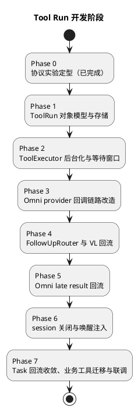

# Tool Run 统一异步工具调用实施计划

本文基于 [ToolRun统一异步工具调用设计.md](ToolRun统一异步工具调用设计.md)，拆分 `realtime-agent` Tool Run 机制的实现步骤。目标是先建立 Tool Run 内核与等待窗口语义且默认行为不变，再分链路接入 late result follow-up，最后收敛 Task 信号回流和业务工具迁移，避免执行模型、provider 回调契约和回流路由同时改动导致排障困难。

## 0. 实施进度（落地状态）

Phase 0–7 已全部落地，默认 `fail_fast` 路径行为与重构前一致，全量 sdk 协议测试通过。说明：`test_realtime_provider_tool_bridge.py::test_realtime_core_records_tool_result_injection_and_audio_output` 存在与本重构无关的时序抖动（单个非 final mic chunk 是否及时转发到 fake provider），偶发失败，已单独记录跟进，不影响本重构。

| Phase | 状态 | 关键产物 |
| --- | --- | --- |
| 1 ToolRun 对象模型与存储 | 已落地 | `tool_run.py`（ToolRun/状态机/CAS Store/JsonlToolRunStore）；ToolSpec 新增 `late_result_policy`、`background_timeout_seconds`、`follow_up_ttl_seconds`、`allow_concurrent_runs` 及注册期校验；`test_tool_run_model.py` |
| 2 ToolExecutor 后台化与等待窗口 | 已落地 | `ToolResult.running`；`ToolRunRunner`（独立线程池+每用户并发上限）；等待窗口 + CAS 裁决 + 去重；`test_tool_run_executor.py` |
| 3 Omni provider 回调链路改造 | 已落地 | follow-up 单槽改 FIFO 队列 + `_active_response` 串行约束；running 回填与 prompt 规则；`submit_followup_instructions`；`test_omni_agent_core.py` 新增用例 |
| 4 FollowUpRouter 与 VL 回流 | 已落地 | `conversation/follow_up.py`（Router/PendingQueue/VL 注入器）；VL 核心 `inject_followup_result`/`is_turn_idle`/turn 完成 flush；app 装配；`test_follow_up_router.py`、`test_vl_follow_up_injection.py` |
| 5 Omni late result 回流 | 已落地 | Omni 注入器与核心 `inject_followup_result`/`is_turn_idle`/turn 完成 flush；mock provider `submit_followup_instructions`；`test_omni_follow_up_injection.py` |
| 6 session 关闭与唤醒注入 | 已落地 | `pending_notification.py`（Jsonl 存储）；router `on_session_closed` 写待通知；会话打开消费注入；idle 关闭续期；重启恢复失败化；`test_pending_notification.py` |
| 7 Task 回流收敛与业务工具迁移 | 已落地 | `TaskSignalBridge` `requires_agent_decision` 转投 router（保留 `allow_direct_notify`）；`query_route_plan`/`search_web`/`mcp_call` 切 `background`；`query_route_plan` 超时语义改后台总预算；全链路集成测试 |

仍待真实环境验收（不阻塞代码合入）：Omni 真机 late result 两段播报、导航 49 秒级真实链路、挂起插话与 instructions 长文本（见 Phase 0 遗留项）。

## 1. 实施原则

1. 先改 SDK 内核（tools.py 执行层），再改 provider 回调链路，最后接业务工具。
2. 默认 `late_result_policy="fail_fast"`，全量行为与现状一致；`background` 按工具逐个开启，可单工具回退。
3. 每个阶段可独立测试，不依赖真实 Omni provider 或真实 MCP 才能暴露核心问题；Omni 注入路径以 fake provider 单测 + 实验脚本实测双覆盖。
4. messages.jsonl 是工具结果的唯一事实源；provider item 历史允许缺失最终结果。
5. 同一 ToolRun 至多一次模型 follow-up；所有决策落盘可观测。

## 2. 总体顺序

## 3. Phase 0：协议实验定型（已完成）

结论已写入 [omni-session结束后工具结果注入实验.md](../experiment/omni-session结束后工具结果注入实验.md)：

1. 活跃 session 主路径：回填 running `function_call_output` + `response.create`，late result 用 `create_response(instructions=...)` 注入（2/2 成功）。
2. 同 call_id 二次回填协议可行但模型行为不稳定，不采用。
3. 延迟回填 provider 至少容忍 60 秒，作为备选，本期不采用。
4. session 关闭后旧 call_id 不可用，只能走待通知 / 唤醒注入。

遗留未验证项（不阻塞，后续按需补实验）：

1. function_call 挂起期间用户插话的 provider 行为。
2. instructions 携带长文本（如完整路线）的长度上限与播报质量。
3. `create_response(instructions=...)` 与并发用户语音输入的竞态。

## 4. Phase 1：ToolRun 对象模型与存储

目标：建立可追踪、可落盘的 Tool Run 实体，不改变任何执行行为。

改动范围：

1. 新增 `agent-server/realtime_agent/tool_run.py`（`ToolRun`、`ToolRunStateMachine`、`ToolRunStore`、`JsonlToolRunStore`）。
2. `agent-server/realtime_agent/tools.py`：`ToolSpec` 增加 `late_result_policy`、`background_timeout_seconds`、`follow_up_ttl_seconds`；注册期校验。
3. `agent-server/protocol-tests/sdk/runtime/` 新增单测。

具体改动：

1. `ToolRun` 字段与状态机按设计文档 5.1 / 5.2 实现；状态迁移用单一锁内 CAS 接口 `try_transition(run_id, from_states, to_state) -> bool`。
2. `JsonlToolRunStore` 复用 `JsonlTaskStore` 的写入模式，产物为 `tool_runs.jsonl`。
3. `ToolSpec` 校验规则：
   - `forbidden` 工具的 `timeout_seconds` 必须 ≤ 等待窗口（沿用现有 `_validate_tool_timeout()`）。
   - `background` 工具允许 `timeout_seconds` 缺省，`background_timeout_seconds > 等待窗口`。
   - `REALTIME_TERMINAL_SESSION_TOOLS` 与 `capture_photo` 注册为 `background` 时直接报错。

验收：

1. 状态机禁止非法迁移与终态回退；并发 `try_transition` 只有一个成功。
2. `tool_runs.jsonl` 可重放出完整生命周期。
3. 现有全部工具默认 `fail_fast`，注册行为无变化。

测试：

1. 状态迁移合法性与 CAS 并发测试。
2. store 落盘 / 读取回放测试。
3. ToolSpec 策略校验测试（含 forbidden 工具误配 background）。

## 5. Phase 2：ToolExecutor 后台化与等待窗口

目标：`ToolGateway.call()` 统一经 Tool Run 执行；`fail_fast` 行为与现状一致，`background` 工具窗口超时返回 running 结果。

改动范围：

1. `agent-server/realtime_agent/tools.py`：`ToolExecutor`、`ToolGateway`、`ToolResult`。
2. 新增 Tool Run runner（`tool_run.py` 内，复用 `TaskRunner` 的“独立线程 + 事件循环”实现，独立实例）。

具体改动：

1. `ToolResult` 增加 `status: Literal["completed", "running"] = "completed"` 字段与 `ToolResult.running(run_id, tool_name)` 构造器；现有消费方不读取该字段时行为不变。
2. `ToolExecutor.execute()` 改为：创建 ToolRun → 提交 runner → `future` 上等待窗口：
   - 窗口内完成：CAS `running -> completed_inline`，返回最终结果。
   - 窗口超时 + `fail_fast`：取消 future，CAS `running -> failed(reason=timeout)`，返回 TIMEOUT 失败（现行为）。
   - 窗口超时 + `background`：CAS `running -> reported_running`，返回 running 结果；future 继续运行，完成回调里 CAS `reported_running -> completed_late / failed` 并通知 FollowUpRouter（Phase 4 前先只落盘）。
3. CAS 竞态规则：工具完成回调与窗口超时同时发生时，先成功的迁移生效；失败方只记录事件。
4. 去重：`ToolGateway.call()` 入口检查同 session 同名 `reported_running` 实例，命中时返回该 run 的 running 结果并记录 `tool_run.dedupe.reused`。
5. runner 使用独立 `ThreadPoolExecutor` 与每用户并发上限（默认 4），避免耗尽默认 executor。
6. `emit_progress_once()`、trace 记录、`call_sync_safe()` 语义保持不变。

验收：

1. 全量现有单测不修改即通过（默认 fail_fast 路径）。
2. background 工具：窗口内完成 → 最终结果；模拟 10 秒工具 → 3 秒返回 running，后台完成后 `tool_runs.jsonl` 中状态为 `completed_late`。
3. 3 秒边界竞态下不出现“running 与 inline 双结果”。
4. 模型重试同名工具时复用 run_id。

测试：

1. fail_fast 回归测试（现有用例）。
2. background 窗口内 / 超窗 / 后台失败 / 后台超时（deadline）四路径测试。
3. 完成与窗口同时到达的竞态测试（事件注入控制时序）。
4. 去重与并发上限测试。

## 6. Phase 3：Omni provider 回调链路改造

目标：让 running 结果能经现有回填链路进入 Omni 会话，并把 follow-up response 下发结构队列化。

改动范围：

1. `agent-server/realtime_agent/conversation/core/omni_host.py`：`_pending_tool_followup_response`、`_submit_tool_result()`、`_create_pending_tool_followup_response()`、`_tool_result_followup_instructions()`、`_append_realtime_tool_call_prompt_rule()`。

具体改动：

1. `_pending_tool_followup_response` 单槽 dict 改为 FIFO 队列；`response.done` 后逐条下发，保持“同时只有一个活跃 response”。
2. `_submit_tool_result()` 对 `status=running` 的结果走普通 `function_call_output` 回填 + follow-up response 入队（不走 capture_photo 图片分支）。
3. `_tool_result_followup_instructions()` 增加 running 分支文案：告知用户正在处理、不要重复调用工具、不念内部标识。
4. `_append_realtime_tool_call_prompt_rule()` 追加 running 语义的 prompt 规则（设计文档 6.3）。
5. 新增 provider 侧 late result 下发入口 `submit_followup_instructions(instructions, output_modalities)`：仅入 follow-up 队列，由 Phase 5 的 FollowUpRouter 调用。

验收：

1. fake provider 单测下：running 回填后收到一次 follow-up `response.create`；连续两个工具调用的 follow-up 不互相覆盖、按序下发。
2. 现有 capture_photo、terminal tool 路径行为不变。

测试：

1. follow-up 队列顺序与并发测试。
2. running 回填 + follow-up instructions 内容断言。
3. 实验脚本实测一次组合路径（running 回填 → instructions 注入）作为联调确认。

## 7. Phase 4：FollowUpRouter 与 VL 回流

目标：建立统一回流路由，先打通 VL 链路（无协议约束，最易验证端到端语义）。

改动范围：

1. 新增 `agent-server/realtime_agent/conversation/follow_up.py`（`FollowUpRouter`、`PendingFollowUpQueue`）。
2. `agent-server/realtime_agent/conversation/core/vision_host.py` / `loop.py`：新增“无音频输入的文本驱动响应 turn”入口。
3. `agent-server/realtime_agent/app.py`：装配 router，订阅 `agent.response.completed`。

具体改动：

1. `FollowUpRouter.submit(completion)` 按设计文档 7.2 决策：TTL 检查 → session 活跃 → turn 空闲 → 注入；否则入 `PendingFollowUpQueue`（user 维度）。
2. turn 空闲判定：复用 `_set_turn_state()` 状态 + `agent.response.started/completed` 事件；判定接口由各 core 暴露 `is_turn_idle(user_id, session_id) -> bool`。
3. VL 注入：late result 以 `role=user` 包装文本写入 messages（事件 `tool_result.late.done`），调用 `VlAgentLoop` 的文本驱动 turn 生成回复；输出经现有 TTS 链路。
4. `agent.response.completed` 触发 queue flush；flush 逐条重新决策。
5. 每次决策写 `ToolRun.follow_up` 并记录 `tool_run.follow_up.*` 事件；CAS 保证至多一次模型 follow-up。

验收：

1. VL 会话空闲时，late result 在数秒内驱动一次模型播报，messages.jsonl 含 late 结果与助手回复。
2. VL 正在回答时 late result 入队，本轮结束后 flush 播报，不打断当前回复。
3. TTL 过期结果不打扰，状态 `expired`。

测试：

1. router 决策表全分支单测（活跃空闲 / 活跃忙 / 关闭 / 过期）。
2. flush 与新完成并发的幂等测试。
3. VL 端到端：fake provider + 模拟慢工具，断言两段播报（“正在查” + 最终结果）。

## 8. Phase 5：Omni late result 回流

目标：Omni 活跃 session 的 late result 经 instructions 注入驱动播报。

改动范围：

1. `follow_up.py`：Omni channel 实现。
2. `omni_host.py`：`is_turn_idle` 判定（含 `_OmniResponseLifecycle` 非 pending/active）、`submit_followup_instructions()` 接线。
3. `conversation/context/`：`_load_runtime_messages()` 识别 `tool_result.late.done`，避免历史重复注入。

具体改动：

1. Omni 注入 = 组装 instructions（基础 prompt 衍生 + 结果摘要 + 播报指令）→ `submit_followup_instructions()` 入 follow-up 队列 → `response.done` 后下发。
2. 同步写 messages.jsonl（`role=tool` 语义、事件 `tool_result.late.done`）。
3. 用户正在说话 / response in-flight 时不注入，回到 pending queue。
4. instructions 中的结果摘要做长度截断（暂定 2000 字符，超长部分留在 messages 供下轮上下文）。

验收：

1. 端到端（真实 Omni 或实验脚本驱动）：慢工具场景听到两段播报，全程无 provider error。
2. late result 到达时用户正在提问另一个问题：不打断，当前回复完成后播报。
3. 重建 session 时历史不出现重复工具结果。

测试：

1. fake provider 下 follow-up 注入与队列约束单测。
2. busy → flush 的 Omni 端到端用例。
3. 实验脚本回归一次组合路径。

## 9. Phase 6：session 关闭与唤醒注入

目标：session 不活跃时 late result 不丢失。

改动范围：

1. 新增 `pending_notifications` 存储（复用 jsonl 模式，user 维度）。
2. `app.py`：wake / session open 钩子消费未过期条目；idle 清理路径对存在 `reported_running` Run 的 session 续期（上限 `deadline_at`）。
3. `conversation/context/`：context compiler 把待通知条目作为 notification source 注入首轮。

具体改动：

1. router 的 closed 分支写入待通知条目（含 TTL）；`tool_run.follow_up.decided(channel=wake_context)`。
2. `control.user.wake.detected` / audio session open 时读取并标记消费，注入首轮上下文；过期条目只落盘。
3. 服务重启恢复：启动时扫描 `tool_runs.jsonl`，`running`/`reported_running` 置 `failed(reason=server_restart)` 并生成待通知条目。
4. idle 续期：`_run_maintenance` 的 audio session idle 判定增加 active Tool Run 检查。

验收：

1. session 关闭后完成的导航结果，在下次唤醒首轮被模型自然提及。
2. 重启后无悬挂 running Run；用户下次唤醒得到“查询中断”说明。
3. 存在 running Run 时 session 不被 idle 提前关闭，Run 终态后正常关闭。

测试：

1. 待通知写入 / 消费 / 过期单测。
2. 重启恢复扫描单测。
3. idle 续期边界测试（deadline 上限）。

## 10. Phase 7：Task 回流收敛、业务工具迁移与联调

目标：Task 结果获得同等 follow-up 能力；首批外部能力切换 background；全链路验收。

改动范围：

1. `agent-server/realtime_agent/tasks.py`：`TaskSignalBridge.handle_signal()` 的 `requires_agent_decision` 分支转投 FollowUpRouter（保留落盘与 `allow_direct_notify` 直通）。
2. `agent-server/realtime_agent/tools.py`：`query_route_plan`、`search_web`、`mcp_call` 声明 `late_result_policy="background"`；`query_route_plan` 移除内部“超时软失败”降级中与窗口重复的部分（保留 MCP 单次调用 deadline）。
3. 文档：How-to 与 reference 更新工具开发约定。

具体改动：

1. `TaskSignal` 复用 `ToolRunCompletion` 的回流通道；timer 到点等 `allow_direct_notify` 信号路径不变。
2. `query_route_plan` 的 `timeout_seconds` 入参语义改为后台总超时（映射 `background_timeout_seconds`），不再作为前台等待时间。
3. 联调验收场景（browser-glass / python-playback-glass）：
   - 慢路线规划（人工注入 20 秒延迟）：3 秒内“正在查”，结果到后播报路线。
   - 查询期间追问天气：天气先答，路线结果随后播报。
   - 查询期间关闭会话：下次唤醒首轮提及路线结果。
   - timer_task 到点：直通播报不回归。

验收：

1. 导航 49 秒级真实场景用户全程有反馈，runs 可完整解释每一步。
2. Task 完成信号在活跃 session 内由模型组织回复，而非只写 messages。
3. 全量回归测试通过；`fail_fast` 工具行为与重构前一致。

测试：

1. TaskSignal 经 router 回流的单测与端到端用例。
2. `query_route_plan` background 化后的超时 / 失败 / 成功三态测试。
3. 系统级回归（dev-support 录制用例）。

## 11. 风险与回滚

| 风险 | 缓解 | 回滚 |
| --- | --- | --- |
| running 结果诱发模型重试 | 去重 + prompt 规则，`tool_run.dedupe.reused` 观测 | 单工具回退 `fail_fast` |
| instructions 注入播报质量不稳定 | Phase 0 遗留实验补测；摘要截断 | 关闭 Omni channel，late result 走待通知 |
| follow-up 队列与用户语音竞态 | 只在 turn 空闲注入，busy 入队 | 同上 |
| 后台并发耗尽线程池 | 独立 executor + 每用户上限 | 降低 background 工具数量 |
| 行为回归 | 默认 fail_fast、分阶段合入、每阶段独立验收 | 按阶段回退 |

## 12. 维护约束

本文档只记录实施顺序、改动范围和验收方向。接口签名与字段以实现时的代码评审为准；与设计文档冲突时，先更新设计文档再实施。
