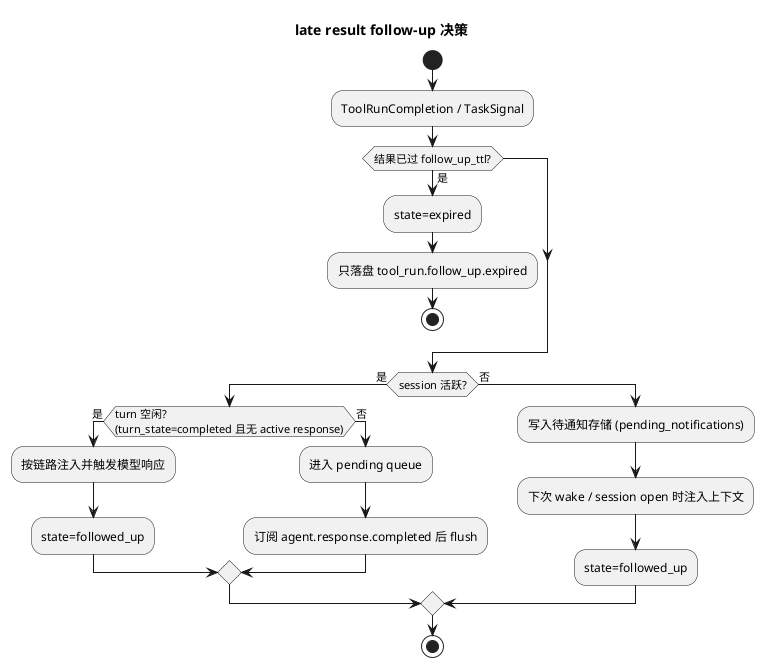

# realtime-agent Tool Run 统一异步工具调用设计

本文面向当前新版 `realtime-agent`，说明把 Tool 和 Task 的运行语义统一为异步能力调用机制（Tool Run）的目标架构、协议依据和当前实现差距。文档统一使用当前实现中的名称，例如 `ToolGateway`、`ToolExecutor`、`ToolSpec`、`ToolResult`、`OmniToolBridge`、`VlAgentLoop`、`TaskEngine`、`TaskRunner`、`TaskSignalBridge`、`OutputService.notify_task_signal()`。

## 1. 文档定位

Tool Run 是一次模型可见能力调用在系统内部的可追踪运行实体。本文重点回答：

1. 为什么 Tool / Task 的静态二分无法覆盖外部耗时不可控的能力。
2. Tool Run 的对象模型、状态机和等待窗口语义。
3. 等待窗口超时后，late result 如何回到 Agent 流程（follow-up 机制）。
4. Omni Realtime 与 VL 两条链路各自的注入机制和协议依据。
5. session 忙、session 已关闭等场景下的排队与待通知策略。
6. 当前实现差距和演进约束。

配套文档：

- 实施步骤见 [ToolRun统一异步工具调用实施计划.md](ToolRun统一异步工具调用实施计划.md)。
- Omni 协议边界实验见 [omni-session结束后工具结果注入实验.md](../experiment/omni-session结束后工具结果注入实验.md)。
- Task Core 既有设计见 [TaskCore设计.md](TaskCore设计.md)。

## 2. 背景与问题

当前模型可调用能力分为两类：

1. Tool：前台短任务。模型调用后等待结果，结果追加回当前 agent loop。`ToolExecutor` 用 `asyncio.wait_for` 强制 `TOOL_MAX_WAIT_TIMEOUT_SECONDS = 3.0` 的全局硬上限，超时即失败。
2. Task：后台任务。`TaskStartTool` 调用 `TaskEngine.create()` 快速返回 `TaskRef`，任务在 `TaskRunner` 后台运行，结果通过 `TaskSignal` 回流。

真实外部能力接入后暴露的问题：

1. `query_route_plan` 这类外部 MCP 能力的耗时不可控（地理编码、路线规划、Streamable HTTP 初始化各自都是网络调用，实测出现过约 49 秒），3 秒硬上限只能把它降级为“软失败”结果，用户得到的是“查询超时”而不是稍后送达的真实路线。
2. `TaskSignal` 回流是断头路：`requires_agent_decision=True` 时 `TaskSignalBridge` 只把结果以 `role=user` 写入 messages.jsonl，没有任何机制在活跃 session 上触发新的模型响应；结果只能等下次 session 打开时进入上下文。
3. 工具结果晚于 session 关闭时，旧 `call_id` 的 `function_call_output` 协议语义已不可用（实验已证实），结果无处安放。
4. Omni 链路的工具执行同步阻塞在 provider websocket 回调线程上（`OmniToolBridge.commit_tool_call()` 内部 `ToolGateway.call_sync_safe()`），等待期间后续 provider 事件的处理停滞。

结论：需要表达的不是“这个能力天然是 Tool 还是 Task”，而是一次调用在运行时的完成状态。模型关心的是：当前 turn 能否拿到最终结果；拿不到时是否知道工具已启动；稍后完成时系统能否把结果重新送入 Agent 流程。

## 3. 设计目标

1. 所有模型可见能力统一称为 Tool；系统内部每次调用生成一个可追踪的 Tool Run。
2. Agent loop 配置短等待窗口（默认 3 秒，沿用 `TOOL_MAX_WAIT_TIMEOUT_SECONDS`）。
3. 窗口内完成：行为与现状完全一致，最终结果追加给模型，当前 turn 继续。
4. 窗口内未完成：向模型返回“工具已启动仍在处理”的结构化结果，当前 turn 不再阻塞；Tool 继续在后台运行。
5. 后台完成后，follow-up 机制按会话状态决定结果去向：活跃且空闲则触发新的模型响应；正在回答其他问题则进入 pending queue；session 已关闭则记录为待通知结果或在下次唤醒时注入上下文。
6. Task 结果回流（`requires_agent_decision=True` 的 `TaskSignal`）收敛到同一 follow-up 机制，获得“结果回来后由模型组织回复”的能力。
7. 工具执行不再阻塞 provider 事件线程。

非目标：

1. 不改变模型可见的工具调用协议（function calling schema 不变；只新增“运行中”结果形态）。
2. 不替换 Task Core；`TaskEngine` / `TaskRunner` / `task.event.*` actor 模型保持不变，Tool Run 只统一“调用与结果回流”这一层。
3. 第一阶段不做分布式 Tool Run 队列与跨进程恢复。

## 4. 协议依据（Omni Realtime 实验结论）

统一 Tool Run 的关键不确定点在 Omni Realtime 的服务端协议边界，已通过 `tools/omni_post_session_tool_result_experiment.py` 验证（详见实验文档）：

| 方式 | 协议层 | 模型行为 | 结论 |
| --- | --- | --- | --- |
| 同 call_id 二次回填 `function_call_output` | 接受 | 不稳定：一次正确播报，一次重新发起工具调用 | 不作为主路径 |
| `create_response(instructions=最终结果文本)` | 接受，不产生 item | 两次运行均正确播报 | **主路径** |
| 延迟回填原 call_id（15s / 60s） | 接受，provider 至少容忍 60 秒挂起 | 正确播报 | 备选；挂起期间插话行为未验证 |
| session 关闭后回填旧 call_id | 拒绝（连接已关闭 / 新 session 报缺 user message） | 不可用 | 只能走待通知 / 唤醒注入 |

由此确定 Omni 活跃 session 的组合方案：

```text
等待窗口超时
  -> 回填 status=running 的 function_call_output + response.create（模型播报“正在查询”）
late result 到达
  -> create_response(instructions=最终结果 + 播报指令)
  -> 结果同步写入 messages.jsonl（provider item 历史里没有最终结果，服务端消息是唯一事实源）
```

## 5. Tool Run 对象模型

### 5.1 ToolRun

```python
@dataclass
class ToolRun:
    run_id: str                      # new_id("tool_run")
    tool_name: str
    user_id: str
    session_id: str
    provider_tool_call_id: str       # provider call_id；VL 链路为 provider tool_call id
    state: str                       # 见 5.2
    result_policy: str               # ToolSpec.late_result_policy 快照
    input_data: dict
    created_at: float
    deadline_at: float | None        # 后台执行总超时
    result: dict | None              # 终态 ToolResult 快照
    follow_up: dict                  # 回流决策记录，见 7.4
    metadata: dict
```

存储复用 `JsonlTaskStore` 的模式（`tool_runs.jsonl`），与 `TaskRef` 分开存放；两者语义不同，不合并实体。

### 5.2 状态机

```text
running                       # 已提交后台执行（含等待窗口期间）
  -> completed_inline         # 窗口内完成，结果已随当前 turn 回填
  -> reported_running         # 窗口超时，已向模型返回“运行中”结构化结果
reported_running
  -> completed_late           # 后台完成，待 follow-up 或已 follow-up
  -> failed                   # 后台失败（含 deadline 超时，reason=timeout）
completed_late
  -> followed_up              # 已驱动模型 follow-up 或已注入待通知
  -> expired                  # 超过 follow-up TTL，只落盘不打扰
```

约束：

1. `running -> completed_inline` 与 `running -> reported_running` 的竞态必须由一次 CAS 式裁决决定：等待窗口到期与工具完成几乎同时发生时，只能走其中一条路径，禁止“先返回 running 又立刻 inline 回填”。
2. 终态（`completed_inline`、`followed_up`、`failed`、`expired`）不可回退；重复完成回调只落盘 `tool_run.duplicate_completion`。
3. 超时不是独立状态：后台 deadline 到期统一进入 `failed`，`metadata.error.reason="timeout"`，与 Task Core 的约定一致。

### 5.3 与 TaskRef 的关系（已修订）

本节最初的结论是“两者语义不同，不合并实体”。Tool Run 全部落地后该结论已被推翻：Task 的 actor 事件模型是“Tool 必须 3 秒内返回”这一旧约束的产物，等待窗口取消了该前提，background Tool 的协程可以驻留并内联消费端侧命令回报。Task 不再作为一等概念维护，全部职责并入 Tool；论证与映射见 [Tool与Task概念统一设计.md](Tool与Task概念统一设计.md)，迁移步骤见 [Tool与Task概念统一实施计划.md](Tool与Task概念统一实施计划.md)。

## 6. ToolSpec 扩展与执行链路

### 6.1 late_result_policy

```python
late_result_policy: Literal["background", "fail_fast", "forbidden"] = "fail_fast"
```

| 策略 | 语义 | 适用 |
| --- | --- | --- |
| `background` | 窗口超时转后台，late result 走 follow-up | `query_route_plan`、`search_web`、`mcp_call` 等外部能力 |
| `fail_fast` | 维持现状：窗口超时即失败 | 默认值；端侧短命令、查询类工具 |
| `forbidden` | 不允许超窗，注册时校验必须声明 `timeout_seconds <= 窗口` | `close_audio_session` 等 `REALTIME_TERMINAL_SESSION_TOOLS`、`capture_photo`（图片回填强依赖活跃 session 的 append_video/commit 同步语义） |

同时为 `background` 工具增加 `background_timeout_seconds`（后台总超时，默认 60 秒）和 `follow_up_ttl_seconds`（结果时效，默认 300 秒）。

### 6.2 ToolExecutor 后台化

```text
ToolGateway.call()
  -> 创建 ToolRun(running) 并落盘
  -> 提交 tool.run() 到 Tool Run runner（复用 TaskRunner 的“独立线程 + 事件循环”模式，独立实例与线程池）
  -> 等待窗口 wait_window_seconds（默认 3.0）
  -> 窗口内完成: CAS 置 completed_inline，返回最终 ToolResult（现行为）
  -> 窗口超时且 policy=background: CAS 置 reported_running，返回 ToolResult.running(...)
  -> 窗口超时且 policy=fail_fast: 取消后台 future，返回 TIMEOUT 失败（现行为）
```

要点：

1. 不能复用 Task Core 的 `TaskRunner` 实例：Tool 内部大量使用 `asyncio.to_thread`（默认 executor），长耗时 MCP 调用并发时会耗尽默认线程池。Tool Run runner 需要独立线程池和每用户并发上限。
2. `call_sync_safe()` 语义保持不变：仍同步返回一个 `ToolResult`，只是该结果可能是 `running` 形态；provider 回调线程的占用时间上限即等待窗口。
3. 去重：同一 `session_id` 内同名工具存在 `reported_running` 实例时，新调用默认返回同一 `run_id` 的“仍在运行”结果而不是再启动一次，防止模型重试导致重复后台执行。可通过 `ToolSpec` 显式允许并发。

### 6.3 “运行中”结构化结果

`ToolResult` 增加 running 形态（新增 `status` 字段，不破坏现有冻结结构的消费方）：

```json
{
  "ok": true,
  "status": "running",
  "data": {"tool_run_id": "tool_run_xxx", "tool_name": "query_route_plan"},
  "message": "工具已启动，仍在后台处理，结果稍后送达。请先告诉用户正在处理，不要重复调用该工具，也不要向用户提及任何内部标识。"
}
```

配套 prompt 约束（追加到 `_append_realtime_tool_call_prompt_rule()` 和 VL system prompt 的工具规则中）：

1. 收到 `status=running` 时，用一句话告知用户正在处理，不要重复调用同名工具。
2. 不向用户播报 `tool_run_id` 等内部字段。
3. 结果稍后由系统送达，届时再组织回复。

## 7. Follow-up 路由器

### 7.1 职责与输入

新增 `FollowUpRouter`（建议落在 `realtime_agent/conversation/` 下），统一接收两类输入：

1. `ToolRunCompletion`：后台 Tool Run 完成或失败。
2. `TaskSignal(requires_agent_decision=True)`：由 `TaskSignalBridge` 转投，替代当前“只写 messages.jsonl”的断头路径。

`TaskSignalBridge` 保留记录与 `allow_direct_notify` 直通职责不变。

### 7.2 会话状态判定



判定依据复用现有信号，不新增状态源：

1. session 活跃：`OmniRealtimeAgentCore` / `VisionRealtimeAgentCore` 的 session 表与 `close_pending` 标记。
2. turn 空闲：`_set_turn_state()` 维护的 turn 状态（`completed` / `interrupted` / `failed` 视为空闲）；Omni 链路还需确认无 in-flight response（`_OmniResponseLifecycle` 非 pending/active）。
3. flush 时机：监听 `agent.response.completed` 控制事件；flush 时逐条重新走判定（可能再次入队）。

### 7.3 注入机制（按链路）

**Omni Realtime（活跃 session）**：

```text
conversation.create_response(
    instructions=base_prompt 衍生的 follow-up 指令 + 工具最终结果摘要,
    output_modalities=当前会话 modalities,
)
```

复用现有 `_tool_result_followup_instructions()` 的模板思路；必须经由现有 `_pending_tool_followup_response` 同款“等 response.done 再 create”的约束（该单槽结构需先队列化）。结果同时以 `role=tool` 语义写入 messages.jsonl（事件 `tool_result.late.done`），保证下次 session 重建上下文一致。

**VL（活跃 session）**：

late result 以消息形式追加（`role=user`，内容为系统包装的工具结果文本，沿用 `task_signal.result` 的包装风格），然后复用 `VlAgentLoop` 触发一次文本驱动的响应 turn（不带音频输入）。VL 是无状态请求式 provider，无协议约束，这条链路最先落地。

**session 已关闭**：

写入 `pending_notifications.jsonl`（user 维度）：

```json
{"user_id": "...", "source": "tool_run|task_signal", "run_id": "...", "text": "...",
 "payload": {...}, "created_at": 0, "ttl_seconds": 300}
```

消费时机：

1. 下次 `control.user.wake.detected` 或 audio session open 时，由 context compiler 作为 notification/context source 注入（未过期条目），模型在首轮自然提及。
2. 产品允许主动播报的设备，可经 `OutputService.notify_task_signal()` 同款仲裁直接 TTS（默认关闭）。

### 7.4 幂等与记录

每次决策写入 `ToolRun.follow_up`：

```json
{"decision": "followed_up|queued|pending_notification|expired",
 "channel": "omni_instructions|vl_turn|wake_context|direct_notify",
 "decided_at": 0, "attempts": 1}
```

约束：同一 ToolRun 至多产生一次模型 follow-up；flush 与新完成事件并发时以 `follow_up.decision` 的 CAS 为准。

## 8. 与会话生命周期的配合

1. **idle 续期**：存在 `reported_running` 的 Tool Run 时，audio session idle 检查（`app.py` 的 `audio_session_idle_timeout_seconds` 路径）应延后关闭，至多延长到该 Run 的 `deadline_at`；避免“用户在等导航结果时 session 被 idle 关掉”。
2. **close 前交代**：session 进入 `close_pending` 且存在 `reported_running` Run 时，follow-up 注定走待通知路径；可选地在关闭前驱动一句“查到后我再告诉你”（第一阶段可不做）。
3. **服务重启**：`running` / `reported_running` 的 Run 在重启后统一置 `failed(reason=server_restart)` 并生成待通知条目（“刚才的查询中断了”）；不自动重放，外部查询的幂等性无法保证。

## 9. provider 回调链路改造（Omni）

当前 `RealtimeProviderCallbacks.tool_call_done` 是同步契约：回调返回 result dict，`_handle_provider_event()` 直接拿它调用 `_submit_tool_result()`。改造后：

1. `tool_call_done` 仍同步返回（等待窗口内拿到的）`ToolResult` 序列化 dict —— 可能是最终结果，也可能是 running 形态；`_submit_tool_result()` 的回填逻辑不感知差别。
2. `_pending_tool_followup_response` 由单槽 dict 改为 FIFO 队列，follow-up `response.create`（含 late result instructions）统一经它在 `response.done` 后串行下发，遵守“同时只有一个活跃 response”的 provider 约束。
3. late result 的 `create_response(instructions=...)` 由 FollowUpRouter 经同一队列提交，不直接操作 conversation 对象。
4. 等待窗口仍会占用 websocket 回调线程至多 3 秒（与现状一致）；是否进一步把窗口等待移出回调线程，留给后续优化，不在本次范围。

## 10. 可观测性

runs 新增/规范以下事件（写入 agent-events.jsonl / tool-events.jsonl）：

```text
tool_run.created
tool_run.completed_inline
tool_run.reported_running
tool_run.completed_late
tool_run.failed                  # 含 reason=timeout / server_restart
tool_run.duplicate_completion
tool_run.follow_up.decided       # decision + channel
tool_run.follow_up.queued
tool_run.follow_up.flushed
tool_run.follow_up.expired
tool_run.dedupe.reused           # 模型重试被去重
```

必须能从 runs 回答：调用何时创建、是否窗口内完成、窗口超时后模型听到了什么、late result 何时到达、follow-up 走了哪条通道、为什么没有播报（expired / session closed / queue）。

## 11. 当前实现差距清单

| 差距 | 现状位置 | 目标 |
| --- | --- | --- |
| Tool 超时即失败，无后台延续 | `tools.py` `ToolExecutor.execute()` | 等待窗口 + 后台 runner |
| `_pending_tool_followup_response` 单槽 | `conversation/core/omni_host.py` | FIFO 队列 |
| TaskSignal 回流断头 | `tasks.py` `TaskSignalBridge.handle_signal()` | 转投 FollowUpRouter |
| 工具执行阻塞 provider 回调线程且无上限外约束 | `omni_host.py` `OmniToolBridge.commit_tool_call()` | 占用上限=等待窗口，后台延续 |
| session 关闭后结果无处安放 | 无 | pending_notifications + 唤醒注入 |
| 模型重试无去重 | 无 | session 内同名 running 去重 |
| idle 关闭与等待结果矛盾 | `app.py` idle 清理 | running Run 续期 |

## 12. 风险与约束

1. **模型重复调用**：running 结果可能诱发模型重试（实验中二次回填后模型重新发起了工具调用）。去重 + prompt 规则双保险，并以 `tool_run.dedupe.reused` 观测。
2. **instructions 注入的上下文一致性**：最终结果不在 provider item 历史中，messages.jsonl 是唯一事实源；`_load_runtime_messages()` 注入历史时需识别 `tool_result.late.done` 避免重复。
3. **挂起插话未验证**：延迟回填路径（备选）在用户插话场景的 provider 行为未做实验，第一阶段不采用。
4. **3 秒窗口仍占用回调线程**：与现状持平，不恶化；彻底异步化另行立项。
5. **灰度与回滚**：所有工具默认 `fail_fast`，行为与现状一致；`background` 按工具逐个开启，出问题可单工具回退。

## 13. 维护约束

本文档只记录目标架构、协议依据和语义约束。具体开发以当前代码、测试和实施计划为准；实验结论以实验文档及 `runs/omni-late-result-injection*` 产物为准。
