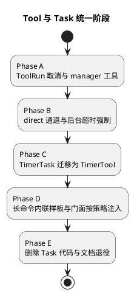

# Tool 与 Task 概念统一实施计划

本文基于 [Tool与Task概念统一设计.md](Tool与Task概念统一设计.md)，拆分 Task 概念退役、能力并入 Tool 的实施步骤。原则是先把 Tool Run 补齐到能完全承接 Task 职责，再迁移唯一内置任务 TimerTask，最后整体删除 Task 代码与文档，避免删除与补能力交错导致回归无法定位。

## 0. 实施进度（落地状态）

Phase A–E 已全部落地，Task 概念已从 `agent-server/realtime_agent` 包源码中完全移除
（`grep BaseTask/TaskEngine/TaskSignalBridge/TaskDeviceFacade/TaskContext` 在源码中无命中），
全量 sdk 协议测试通过；agent-server 其余失败均为与本重构无关的预存在失败（设备示例文件缺失、
preflight/live-check 环境依赖）。

| Phase | 状态 | 关键产物 |
| --- | --- | --- |
| A ToolRun 取消与 tool_run_manager | 已落地 | `cancelled` 终态 + `ToolRunRunner.cancel`；`ToolSpec.cancel_supported/max_running_per_user/running_message`；`ToolExecutor.cancel_run`；`ToolRunAdmin` + `ToolRunManagerTool`；`test_tool_run_cancel.py` |
| B direct 通道与后台超时强制 | 已落地 | `ToolSpec.late_result_notify`；`FollowUpRouter` direct 分支 + `OutputService.notify_tool_run`；后台 `asyncio.wait_for` 强制超时 + `background_timeout_seconds_for` 按入参预算；`test_tool_run_direct_and_timeout.py` |
| C TimerTask 迁移为 TimerTool | 已落地 | 内置 `TimerTool`（start_timer，background+direct+cancel）；删除 TimerTask/BUILTIN_TASKS；mock adapter 改 start_timer；`test_timer_tool.py` |
| D 长命令内联样板与门面按策略注入 | 已落地 | `ToolContextFactory` 按 background 注入 `BackgroundDeviceFacade`；find_object 内联消费样板；删除 app `command.*→task.event.*` 转换；`test_background_tool_device_command.py` |
| E 删除 Task 代码与文档退役 | 已落地 | 删除 `tasks.py`/`task_store/`/Task 工具/Task 门面/app 装配；`TaskDeviceFacade`→`BackgroundDeviceFacade`；清理 `__init__`/`preflight`/`cli` 导出；移除 conversation 层 `TaskSignal`/`consume_task_signal`；`/api/debug/tasks` 改列 Tool Run；测试迁移；教程与参考文档改为 background 工具示例 |

遗留（不阻塞，已通过后台任务 chip 记录）：
1. 补回 background 工具连续 sensor 流契约测试（原 test_task_device_stream_contract 删除）。
2. `config.tasks` 配置段与示例 yaml 的 `tasks:` 节点尚未清理（app 已不读取，仅 P0 配置契约测试仍引用）；参考文档 `上下文设备接口设计.md` 仍有少量 Task 叙述性文字待清理。

## 1. 实施原则

1. 每个阶段结束时全量 sdk 测试必须通过，且 `fail_fast` 工具行为始终不变。
2. 先补能力（取消、direct 通道、manager 工具、long-running 门面），后删 Task；删除阶段不引入新行为。
3. Task 相关测试随其被替代的能力同阶段迁移成 Tool Run 测试，不留无主测试。
4. 本仓库无外部 SDK 消费者，公共导出直接删除，不做 deprecation shim。

## 2. 总体顺序

## 3. Phase A：ToolRun 取消与 tool_run_manager

目标：模型和用户可以取消后台 Tool Run。

改动范围：

1. `realtime_agent/tool_run.py`：状态机新增 `cancelled` 终态（`running/reported_running -> cancelled`）；`ToolRunRunner.cancel(run_id)`（需要 runner 持有 run_id → future 映射）。
2. `realtime_agent/tools.py`：`ToolSpec` 新增 `cancel_supported: bool = False`、`max_running_per_user: int | None = None`、`running_message: str | None = None`；`ToolExecutor` 超窗返回 running 时使用 `running_message`；新增 `ToolRunManagerTool`（`tool_run_manager`：list_instances / query / cancel）。
3. 取消语义：`cancel()` CAS 推进 `cancelled` → runner future.cancel → 工具协程收到 `CancelledError`，`finally` 清理；CAS 失败（已完成）返回明确"来不及取消"。

验收：

1. 取消 running/reported_running 的运行后状态为 `cancelled`，无 follow-up。
2. 取消与完成竞态只有一个生效。
3. `cancel_supported=False` 的工具取消请求被拒绝并提示。
4. `running_message` 出现在超窗返回的 running 结果中。

测试：状态机扩展、cancel 竞态、manager 工具三动作、running_message 注入。

## 4. Phase B：direct 通道与后台超时强制

目标：late result 可以不经模型直通播报；后台超时真正强制。

改动范围：

1. `ToolSpec.late_result_notify: Literal["model", "direct"] = "model"`；`FollowUpCompletion.notify_policy`。
2. `conversation/follow_up.py`：`notify_policy=direct` 时不注入模型，经 `OutputService` 通知仲裁直通播报 `ToolResult.message`（复用 `notify_task_signal` 同形仲裁入口）；会话关闭仍落待通知。
3. `ToolExecutor`：后台执行包 `asyncio.wait_for(background_timeout)`，超时 CAS `failed(reason=timeout)` 并按现有 follow-up 策略回流；支持工具覆写 `background_timeout_seconds_for(input_data)`（timer 类按入参定预算）。

验收：

1. direct 工具完成后直接 TTS 播报，模型不产生新 turn；runs 记录 `tool_run.follow_up.decided(channel=direct_notify)`。
2. 后台超过预算的工具进入 failed(timeout)，并按策略回流"没有成功"。

测试：direct 通道决策、direct + 会话关闭、后台超时强制、按入参预算。

## 5. Phase C：TimerTask 迁移为 TimerTool

目标：唯一内置 Task 改写为 background Tool，删除 `BUILTIN_TASKS`。

改动范围：

1. 新增内置 `TimerTool`（`start_timer`）：`late_result_policy=background`、`late_result_notify=direct`、`cancel_supported=True`、`running_message="计时器已开始计时。"`；`run()` = sleep + 返回到点文案；`background_timeout_seconds_for` = seconds + 余量。
2. 删除 `TimerTask`、`BUILTIN_TASKS`、`_normalize_timer_task_input` 改挂到 `start_timer` 入参归一。
3. provider prompt / 工具描述中 `start_timer_task` 相关文案与别名归一更新。

验收：

1. "倒计时 10 秒"端到端：3 秒内听到"计时器已开始计时"，10 秒后直通播报到点消息。
2. "取消计时器"经 `tool_run_manager.cancel` 生效，不再到点播报。
3. 重启后计时 Run 失败化并产生"计时中断"待通知。

测试：timer 三场景（到点 / 取消 / 重启），原 `test_builtin_tools_tasks.py` 中 timer 用例迁移。

## 6. Phase D：长命令内联样板与设备门面按策略注入

目标：原 Task 的端侧命令协作模式有等价的 Tool 写法，权限按策略注入。

改动范围：

1. `ToolContextFactory`：`late_result_policy=background` 的工具注入 long-running 设备门面（允许持续 stream 与长命令），`fail_fast` 维持现状；`TaskDeviceFacade` 的能力差异收敛为该注入开关。
2. 编写 find_object 形态的内联消费样板（`async for event in handle.results()` + `finally stop()`），落在教程与单测中（fake 设备命令回报驱动）。
3. app 层 `_handle_device_command_report` 保留 `CommandResultBroker` 路径，删除 `command.*` → `task.event.*` 转换。

验收：

1. background 工具可以发起长命令并在协程内收到 accepted/progress/completed/failed 回报。
2. 设备离线时挂起的 `results()` 被失败唤醒，工具按失败结果回流。
3. `fail_fast` 工具仍无法发起长命令（权限边界不回退）。

测试：内联长命令端到端（fake 设备）、离线唤醒、权限边界。

## 7. Phase E：删除 Task 代码与文档退役

目标：仓库中不再存在 Task 概念。

改动范围：

1. 删除 `realtime_agent/tasks.py`、`task_store/`、`TaskStartTool`、`TaskRuntimeManagerTool`、`TaskDeviceFacade`，以及 `app.py` 的 TaskEngine 装配与 task 自动发现。
2. 清理 `__init__.py`、`preflight.py`、`cli/sdk.py` 公共导出；`SystemToolContext.tasks` 字段移除。
3. 测试迁移：`test_task_engine_*`、`test_task_manage_tool`、`test_task_signal_bridge` 中已被 Phase A–D 等价覆盖的删除，仍有独立价值的改写为 Tool Run 用例。
4. 文档：`TaskCore设计.md`、`TaskCore实施计划.md` 移入 `docs/deprecated/` 并加注记；重写 `docs/tutorials/build-first-capability.md`；修订 ToolRun 设计 5.3 节与 README 索引；`运行产物排查说明` 中 task 产物条目更新。

验收：

1. 全仓 `grep -ri "BaseTask\|TaskEngine\|TaskSignal"` 仅命中 deprecated 文档与 git 历史。
2. 全量测试通过；preflight / cli 公共名校验更新后通过。

## 8. 风险与回滚

| 风险 | 缓解 | 回滚 |
| --- | --- | --- |
| 取消竞态引入新状态机缺陷 | CAS 单点裁决 + 竞态测试 | Phase A 独立可回退 |
| direct 通道播报与正在进行的对话冲突 | 复用 NotificationCoordinator 仲裁（优先级/TTL/打断策略不变） | 单工具改回 `model` |
| timer 行为回归（别名、到点精度） | 端到端三场景验收 + 原测试迁移 | Phase C 独立可回退，TimerTask 删除在验收后 |
| 删除阶段牵连面大 | Phase E 不含行为变化，纯删除 + 测试迁移 | git revert 单提交 |

## 9. 维护约束

本文档只记录迁移顺序、改动范围和验收方向。实施中发现 Task 仍有本文未盘点的职责时，先回到设计文档补充映射，再继续实施。
