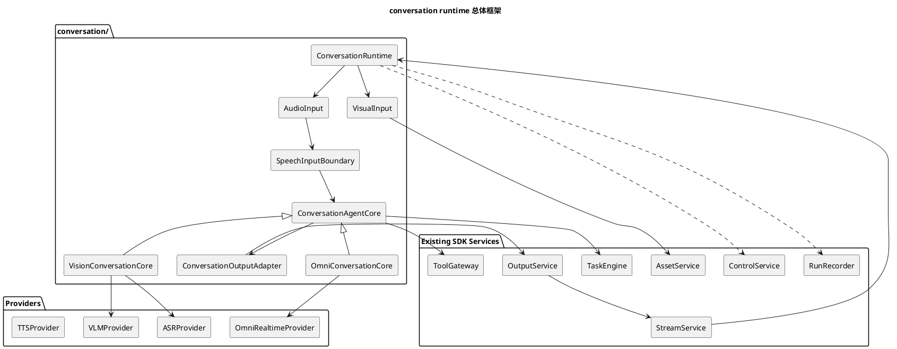

# conversation 音视频链路重构实施计划

更新时间：2026-06-02

对应设计文档：

- [realtime-agent 抽象架构设计](realtime-agent抽象架构设计.md)
- [音视频对话统一链路设计](音视频对话统一链路设计.md)

## 1. 文档定位

本文是 `realtime_agent/conversation/` 新音视频对话运行时的实施指导文件。

本文不重新设计整个 `realtime-agent` SDK，而是约束以下问题：

1. 哪些音视频链路强相关模块需要在 `conversation/` 中重做。
2. 哪些现有服务必须复用，不能因为新链路而重写。
3. 新旧链路如何并存、切换和逐步迁移。
4. Omni Manual 模式和 VL 链路如何在同一套输入、Agent Core、输出框架下落地。
5. 每个阶段的代码范围、验收命令和运行观察点。

本文面向后续开发执行，不是纯概念设计。

## 2. 当前代码审查结论

当前 `agent-server/realtime_agent/` 已经存在若干可复用基础设施，不能把本次重构理解为重写 SDK。

### 2.1 应继续复用的模块

| 模块 | 当前职责 | 重构策略 |
| --- | --- | --- |
| `control/service.py` | 设备注册、控制事件路由、active device 状态。 | 保持不动。 |
| `stream/service.py` | 上下行二进制 stream 生命周期、seq、finish、cancel、ack。 | 保持不动。 |
| `asset/service.py`、`asset/turn_buffer.py` | 图片、音频、视频等资产保存和 turn 级视觉 buffer。 | 保持不动，只通过接口调用。 |
| `tools.py` | Tool 注册、schema、执行、运行上下文、设备和资产 facade。 | 保持不动。 |
| `tasks.py` | Task 生命周期、信号、定时器、后台任务编排。 | 保持不动。 |
| `output/service.py` | 文本转 TTS、Omni 原生音频、播放仲裁、端侧输出事件。 | 第一阶段复用，必要时只包一层适配器。 |
| `observability.py` | runs 产物、事件记录、调试证据。 | 继续作为观测入口。 |

这些模块已经承担了 SDK 基础能力。重写它们会放大协议、端侧和联调成本，不属于本次重构目标。

### 2.2 需要在 conversation 中重做的模块

| 当前位置 | 当前问题 | conversation 目标 |
| --- | --- | --- |
| `audio_pipeline/service.py` | 音频处理、VAD、AgentCore 转发混在一个外层 pipeline 中。 | 收敛为音频规范化和语音输入边界。 |
| `agent_core/vision.py` | ASR、VAD 边界、视觉采样、VL 请求、TTS 触发集中在 Vision Core 内。 | 拆成输入边界、VL Agent Core、响应生成。 |
| `agent_core/omni.py` | Provider VAD 与 Omni Core 深耦合，尚不支持 Manual turn 控制。 | 新 Omni Agent Core 优先支持 Manual 模式。 |
| `realtime_pipeline/vision.py`、`realtime_pipeline/omni.py` | 已经有 pipeline 包装，但与外层 `AudioPipeline` 职责重叠。 | 作为旧链路兼容层，不继续扩展新能力。 |
| `app.py` 中 legacy AgentCoreRouter 装配 | 应用装配入口过重，但仍是统一 composition root。 | 增加 conversation runtime 分支，并把旧 router 明确为 legacy fallback。 |

## 3. 重构原则

1. 新链路放在 `agent-server/realtime_agent/conversation/` 下。
2. 不新增 `v2`、`new_runtime`、`experimental_runtime` 这类临时目录名。
3. 先实现 Omni Manual，后迁移 VL。
4. 新旧链路并存，通过配置切换。
5. 不修改控制协议事件名，不修改 stream 二进制帧格式。
6. 不把大字节媒体放入控制信令 JSON。
7. 第一阶段不重写 `OutputService`，只通过 adapter 使用。
8. 第一阶段不重写 Tool / Task / Asset / Stream / Control。
9. 抽象优先使用 Python `Protocol`，除非确实需要共享状态或模板方法，再使用基类。
10. 每阶段必须保留可运行链路，不允许长时间处于半迁移状态。

## 4. 目标目录结构

推荐目录结构：

```text
agent-server/realtime_agent/conversation/
  __init__.py
  types.py
  runtime.py
  config.py

  input/
    __init__.py
    audio.py
    speech.py
    vad.py
    asr.py
    visual.py

  core/
    __init__.py
    base.py
    omni.py
    vision.py
    loop.py
    context.py

  providers/
    __init__.py
    omni_realtime.py
    vlm.py
    asr.py
    tts.py

  output/
    __init__.py
    router.py
    adapters.py

  events.py
  recorder.py
```

目录含义：

| 目录 | 职责 |
| --- | --- |
| `types.py` | 跨模块共享的数据结构，例如 `SpeechInputDelta`、`AgentOutputDelta`。 |
| `runtime.py` | 新 conversation runtime 装配入口。 |
| `config.py` | conversation 层配置解析和兼容旧配置映射。 |
| `input/` | 音频规范化、VAD/ASR 边界、视觉输入绑定。 |
| `core/` | Omni / VL Agent Core 和核心循环。 |
| `providers/` | 对现有 provider adapter 的轻量包装。 |
| `output/` | 对现有 `OutputService` 的适配，不重写播放仲裁。 |
| `events.py` | conversation 内部事件定义，避免与系统级 event 混淆。 |
| `recorder.py` | 将 conversation 内部事件写入 runs 产物。 |

## 5. 总体运行框架



## 6. 核心数据结构

### 6.1 `SpeechInputDelta`

`SpeechInputDelta` 是语音输入边界给 Agent Core 的标准输入单位。

建议字段：

```python
@dataclass(slots=True)
class SpeechInputDelta:
    kind: Literal[
        "audio_chunk",
        "asr_text_delta",
        "turn_started",
        "turn_ended",
    ]
    session_id: str
    user_id: str | None
    stream_id: str | None
    audio: StreamChunk | None = None
    text_delta: str | None = None
    final_text: str | None = None
    turn_id: str | None = None
    monotonic_ms: int | None = None
    metadata: Mapping[str, Any] = field(default_factory=dict)
```

命名原则：

1. 使用 `Delta`，不使用 `Event`，避免与系统控制事件混淆。
2. ASR 字段使用 `asr_text_delta`、`final_text`，不使用 `transcript` 作为抽象名。
3. `turn_started` / `turn_ended` 表示输入边界结论，不等价于 provider 原始事件。

### 6.2 `AgentOutputDelta`

`AgentOutputDelta` 是 Agent Core 给输出层的标准输出单位。

建议字段：

```python
@dataclass(slots=True)
class AgentOutputDelta:
    kind: Literal[
        "text_delta",
        "text_final",
        "audio_chunk",
        "output_started",
        "output_finished",
        "output_cancel_requested",
    ]
    session_id: str
    output_id: str | None = None
    text_delta: str | None = None
    audio: bytes | None = None
    sample_rate_hz: int | None = None
    metadata: Mapping[str, Any] = field(default_factory=dict)
```

第一阶段可以不要求所有旧模块都产出 `AgentOutputDelta`，但新 `conversation/` 内部应使用这个结构作为目标接口。

## 7. 核心接口

### 7.1 `ConversationAgentCore`

建议使用 `Protocol`：

```python
class ConversationAgentCore(Protocol):
    async def open(self, context: ConversationContext) -> None: ...
    async def consume_speech(self, delta: SpeechInputDelta) -> None: ...
    async def interrupt(self, reason: str = "user_speech") -> None: ...
    async def close(self) -> None: ...
```

职责：

1. 消费标准 `SpeechInputDelta`。
2. 管理链路专属上下文。
3. 决定何时调用 provider。
4. 决定何时调用工具和任务。
5. 将结果交给输出 adapter。

不负责：

1. 不直接管理 WebSocket。
2. 不直接解析端侧控制事件。
3. 不直接保存图片或二进制 stream。
4. 不直接实现播放仲裁。

### 7.2 `SpeechInputBoundary`

建议接口：

```python
class SpeechInputBoundary(Protocol):
    async def open(self, context: ConversationContext) -> None: ...
    async def append_audio(self, chunk: StreamChunk) -> AsyncIterator[SpeechInputDelta]: ...
    async def flush(self) -> AsyncIterator[SpeechInputDelta]: ...
    async def close(self) -> None: ...
```

职责：

1. 接收规范化音频 chunk。
2. 输出 `audio_chunk`。
3. 输出 `turn_started` / `turn_ended`。
4. 如果当前链路需要 ASR，输出 `asr_text_delta` 和 `final_text`。

不负责：

1. 不执行打断。
2. 不调用 Omni `commit()`。
3. 不调用 VL 模型。
4. 不启动或停止视觉采样。

### 7.3 `VoiceActivityBoundary`

`VoiceActivityBoundary` 是 `SpeechInputBoundary` 内的一个可替换组件。

建议接口：

```python
class VoiceActivityBoundary(Protocol):
    async def append_audio(self, chunk: StreamChunk) -> list[SpeechBoundaryDelta]: ...
    async def flush(self) -> list[SpeechBoundaryDelta]: ...
```

输出只允许：

| kind | 含义 |
| --- | --- |
| `speech_started` | 用户开始有效说话。 |
| `speech_stopped` | 用户停止说话，可以提交本轮输入。 |

注意：

1. 打断不在 VAD 组件中处理。
2. 视觉采样不在 VAD 组件中处理。
3. ASR 文本不从 `VoiceActivityBoundary` 输出。
4. ASR/VAD 合一 provider 的句子边界可以适配成 `speech_started` / `speech_stopped`。

### 7.4 `ConversationOutputAdapter`

建议接口：

```python
class ConversationOutputAdapter(Protocol):
    async def emit(self, delta: AgentOutputDelta) -> None: ...
    async def cancel_current(self, reason: str) -> None: ...
    async def close(self) -> None: ...
```

第一阶段实现应包装现有 `OutputService`，不要重写 `PlaybackArbiter`。

## 8. 新旧模块映射

| 目标概念 | 当前可复用实现 | 迁移说明 |
| --- | --- | --- |
| `ConversationRuntime` | `RealtimeAgentApp`、`LegacyAgentCoreRouter` | 作为 app 内新分支接入；旧 router 只作为 legacy fallback。 |
| `AudioInput` | `AudioPipeline` | conversation runtime 通过外层 `AudioPipeline` 接收规范化音频；`RealtimeAudioNormalizer` 只供 legacy pipeline 使用。 |
| `VoiceActivityBoundary` | `ServerVadProcessor` | Omni Manual 第一版可复用 RMS + silence timeout 逻辑。 |
| `ASRProvider` | `AsrProviderAdapter`、`DashScopeAsrProviderAdapter` | 当前类名可保留，conversation providers 做包装。 |
| `VLMProvider` | `VisionModelAdapter` | 先包装，不重写请求构造。 |
| `OmniRealtimeProvider` | `RealtimeProviderAdapter`、`QwenOmniRealtimeAdapter` | 增加 manual 配置和显式 response create。 |
| `TTSProvider` | `StreamingTTS`、`DashScopeStreamingTTS` | 继续由 OutputService 管理。 |
| `ConversationOutputAdapter` | `OutputService`、`OutputRouter` | 只做薄适配。 |
| `VisualInput` | `TurnPhotoBuffer`、visual appender | 先复用当前视觉资产链路。 |

## 9. 分阶段实施计划

### Phase 0：准备和保护旧链路

目标：建立新目录、配置开关和最小类型，不改变旧运行行为。

改动范围：

1. 新增 `agent-server/realtime_agent/conversation/` 目录。
2. 新增 `types.py`、`events.py`、`core/base.py`。
3. 新增配置项：

```yaml
agent:
  conversation:
    runtime: legacy | conversation
```

默认值必须是 `legacy`。

关键任务：

1. 定义 `SpeechInputDelta`、`AgentOutputDelta`。
2. 定义 `ConversationAgentCore`、`SpeechInputBoundary`、`ConversationOutputAdapter` Protocol。
3. 在 `RealtimeAgentApp` 装配层只读取配置，不切换实际链路。
4. 补单元测试验证默认仍走旧链路。

验收命令：

```bash
uv run python -m py_compile agent-server/realtime_agent/conversation/types.py agent-server/realtime_agent/conversation/core/base.py
uv run python -m pytest agent-server/unit-tests -q
```

验收标准：

1. 默认配置下现有 Omni / VL demo 行为不变。
2. 新类型不会引入 provider、control、stream 的循环依赖。
3. `conversation.runtime` 缺省时不改变旧配置含义。

### Phase 1：Omni Manual Provider 适配

目标：让现有 Omni provider 支持 Manual 模式所需的底层能力。

改动范围：

1. `agent_core/omni.py` 或 `conversation/providers/omni_realtime.py`。
2. `RealtimeProviderConfig` 增加 `turn_detection=manual` 的兼容解析。
3. `QwenOmniRealtimeAdapter` 支持：
   - `enable_turn_detection=False`
   - 显式 `commit_input()`
   - 显式 `create_response()`

关键任务：

1. 保留 `semantic_vad`、`server_vad` 旧 provider VAD 模式。
2. 新增 manual 模式配置，但不立即作为默认。
3. 明确 Manual 模式只支持 WebSocket，不支持 WebRTC。
4. `commit_input()` 不再隐含等价于 `response.create`，需要显式方法。
5. 真实 DashScope SDK / WebSocket 事件写入 runs 产物，便于验证。

验收命令：

```bash
uv run python -m pytest agent-server/model-provider-tests -q
uv run python -m pytest agent-server/unit-tests -q
```

运行观察点：

1. session update 中 `enable_turn_detection=False`。
2. 用户停止说话后能看到 `input_audio_buffer.commit`。
3. commit 后能看到显式 response create。
4. provider audio delta 仍能进入现有 `OutputService`。

### Phase 2：Omni conversation runtime 最小链路

目标：在 `conversation/` 中跑通 Omni Manual 的最小音频链路。

目标链路：

```text
sensor.mic
  -> AudioInput
  -> VoiceActivityBoundary
  -> OmniConversationCore
  -> OmniRealtimeProvider manual commit/create_response
  -> ConversationOutputAdapter
  -> OutputService
  -> actuator.speaker
```

改动范围：

1. `conversation/runtime.py`
2. `conversation/input/audio.py`
3. `conversation/input/vad.py`
4. `conversation/core/omni.py`
5. `conversation/output/adapters.py`
6. `app.py` 的装配分支。

关键任务：

1. `AudioInput` 先复用现有 `AudioPipeline` 的格式校验和重采样逻辑，避免重复实现。
2. `VoiceActivityBoundary` 第一版复用 `ServerVadProcessor` 逻辑。
3. `OmniConversationCore` 对每个 `audio_chunk` append 到 provider。
4. `turn_started` 触发统一 speech started 通知和输出打断。
5. `turn_ended` 触发 provider `commit_input()` 和 `create_response()`。
6. provider 原生音频通过 `ConversationOutputAdapter` 进入现有 `OutputService`。
7. 新链路只在 `agent.conversation.runtime=conversation` 且 `agent.mode=omni` 时启用。

验收命令：

```bash
uv run python -m pytest agent-server/unit-tests -q
uv run python -m pytest agent-server/protocol-tests -q
```

手工联调观察点：

1. 设备端收到 `audio.speech.started`。
2. 设备端收到 `audio.speech.stopped`。
3. 用户说话期间助手输出会被取消或暂停。
4. `runs/*/stream-events.jsonl` 中上行音频持续写入。
5. `runs/*/agent-events.jsonl` 中能看到 turn started / ended。
6. `runs/*/output-decisions.jsonl` 中能看到 Omni 原生音频输出。

### Phase 3：视觉采样接入 Omni conversation runtime

目标：让 Omni Manual 链路在用户 turn 内继续支持 realtime video / 图片采样。

改动范围：

1. `conversation/input/visual.py`
2. `conversation/core/omni.py`
3. 现有 `agent_core/visual/` appender 或对应视觉资产模块。

关键任务：

1. `turn_started` 启动视觉采样。
2. `turn_ended` 停止或收尾视觉采样。
3. Omni 支持图片即时 append 给 realtime provider。
4. 视觉采样失败不能阻塞音频 turn 提交。
5. 当前 turn 的视觉资产在 turn 结束、取消、异常关闭时清理。

验收命令：

```bash
uv run python -m pytest agent-server/unit-tests -q
uv run python -m pytest agent-server/protocol-tests -q
```

手工联调观察点：

1. 用户说话时端侧收到 RGB stream open 请求。
2. 图片资产进入 turn buffer。
3. Omni provider 收到对应视觉输入。
4. turn 结束后采样停止。

### Phase 4：VL conversation runtime

目标：把 VL 链路迁到同一套 `SpeechInputDelta` 输入模型。

目标链路：

```text
sensor.mic
  -> AudioInput
  -> ASR-backed SpeechInputBoundary
       -> audio_chunk
       -> asr_text_delta
       -> turn_started
       -> turn_ended(final_text)
  -> VisionConversationCore
  -> VLMProvider
  -> OutputService(TTS)
  -> actuator.speaker
```

改动范围：

1. `conversation/input/asr.py`
2. `conversation/core/vision.py`
3. `conversation/providers/asr.py`
4. `conversation/providers/vlm.py`
5. `conversation/output/adapters.py`

关键任务：

1. 包装现有 `AsrProviderAdapter`，不要第一阶段重写 Paraformer 协议解析。
2. 将当前 `TranscriptEvent.sentence_begin` 适配为 `turn_started`。
3. 将当前 `TranscriptEvent.sentence_end` 适配为 `turn_ended`。
4. 将 ASR partial 适配为 `asr_text_delta`。
5. `VisionConversationCore` 只在 `turn_ended(final_text)` 后请求 VLM。
6. VLM 文本输出继续走现有 `OutputService.on_assistant_vision_delta()` 或对应 adapter。
7. 视觉资产 flush 复用当前 turn buffer 和 visual appender。

验收命令：

```bash
uv run python -m pytest agent-server/unit-tests -q
uv run python -m pytest agent-server/protocol-tests -q
uv run python -m pytest agent-server/model-provider-tests -q
```

手工联调观察点：

1. ASR partial 写入 runs。
2. `turn_started` 与 Paraformer `sentence_begin` 对齐。
3. `turn_ended` 与 Paraformer `sentence_end` 对齐。
4. final text 只提交一次给 VLM。
5. VLM 响应文本进入 TTS 并播放。

### Phase 5：旧链路兼容和路由收敛

目标：让 `RealtimeAgentApp` 能稳定选择旧链路或 conversation 链路，旧 `AgentCoreRouter` 只作为 legacy fallback 保留。

改动范围：

1. `app.py`
2. `agent_core/router.py` 或当前 legacy 装配逻辑所在文件。
3. `conversation/runtime.py`
4. 配置文档和示例配置。

关键任务：

1. `agent.conversation.runtime=legacy` 时保持旧链路。
2. `agent.conversation.runtime=conversation` 时进入新链路。
3. `agent.mode=omni` 和 `agent.mode=vision` 都支持 conversation runtime。
4. app 层 dispatch 不理解 Omni / VL 内部差异。
5. 新旧链路 runs 产物字段尽量保持可对照。

验收命令：

```bash
uv run python -m pytest agent-server/unit-tests -q
uv run python -m pytest agent-server/protocol-tests -q
uv run python -m pytest -m sdk -q
```

### Phase 6：清理旧职责重叠

目标：在新链路稳定后，清理旧 `AudioPipeline`、`RealtimeAudioNormalizer` 和 `realtime_pipeline/*` 的重复职责。

前置条件：

1. Omni Manual conversation runtime 已完成真机或 browser-glass 联调。
2. VL conversation runtime 已完成至少一次真实 ASR + VLM + TTS 联调。
3. runs 产物能覆盖 turn 边界、ASR、模型请求、输出播放。
4. 旧链路仍可通过配置回退。

清理范围：

1. 明确 `AudioPipeline` 是旧链路兼容组件还是被 conversation `AudioInput` 替代。
2. 明确 `realtime_pipeline/vision.py` 和 `realtime_pipeline/omni.py` 是否只保留兼容。
3. 删除不再使用的重复 normalizer。
4. 文档更新旧链路状态。

验收命令：

```bash
uv run python -m pytest agent-server/unit-tests -q
uv run python -m pytest agent-server/protocol-tests -q
uv run python -m pytest docs -q
```

如果没有专门的 docs 测试，则至少执行：

```bash
rg "过期命名" agent-server/docs
```

这里的 `过期命名` 需要替换成当阶段已经废弃的具体术语，例如旧输入 pipeline 名称、旧 transcript provider 抽象名或临时 runtime 目录名。确认文档不再引用这些命名。

## 10. 配置设计

建议新增配置：

```yaml
agent:
  conversation:
    runtime: legacy
    input:
      audio:
        expected_sample_rate_hz: 16000
        target_sample_rate_hz: 16000
      vad:
        provider: server_vad
        min_speech_ms: 240
        silence_timeout_ms: 650
        pre_roll_ms: 160
    omni:
      turn_detection: manual
    vision:
      speech_boundary: asr_sentence
```

配置原则：

1. `agent.conversation.runtime` 缺省为 `legacy`。
2. `agent.conversation.omni.turn_detection=manual` 只影响新 conversation Omni 链路。
3. 旧 `agent.omni.turn_detection` 保持兼容。
4. ASR/VAD 合一 provider 使用 `speech_boundary=asr_sentence`。
5. 独立 VAD 使用 `vad.provider=server_vad`、`webrtc_vad` 或未来 `silero_vad`。

## 11. 运行产物要求

新链路必须写入足够的 runs 证据，避免后续只能靠日志猜测。

建议新增或扩展：

| 文件 | 内容 |
| --- | --- |
| `conversation-events.jsonl` | conversation runtime 内部 delta 和状态变化。 |
| `agent-events.jsonl` | 保持现有 Agent 事件，新增 conversation 来源 metadata。 |
| `stream-events.jsonl` | 保持现有 stream 上下行证据。 |
| `output-decisions.jsonl` | 继续记录播放、取消、TTS/native audio 决策。 |
| `model-request.json` | VL 模型请求仍不落完整图片 base64。 |

关键事件：

1. `speech_input.audio_chunk`
2. `speech_input.asr_text_delta`
3. `speech_input.turn_started`
4. `speech_input.turn_ended`
5. `omni.input_audio.commit`
6. `omni.response.create`
7. `vision.final_text.submitted`
8. `output.native_audio.delta`
9. `output.tts.text_delta`
10. `output.cancel_requested`

## 12. 测试策略

### 12.1 单元测试

重点覆盖：

1. `SpeechInputDelta` 字段和序列化。
2. `VoiceActivityBoundary` start / stop 去重。
3. 静音确认窗口。
4. 短噪声不产生有效 turn。
5. ASR `sentence_begin` / `sentence_end` 到 turn delta 的映射。
6. Omni Manual `turn_ended` 后 commit 和 create_response 顺序。
7. VL final text 只提交一次。
8. 输出 adapter 调用现有 `OutputService` 的路径。

测试 docstring 必须写明测试目标、测试方法和预期结果。

### 12.2 协议测试

如果不改控制事件名和 stream schema，协议测试主要用于防回归。

必须确认：

1. `audio.speech.started` 仍按旧协议下发。
2. `audio.speech.stopped` 仍按旧协议下发。
3. output finish / cancel 事件名不变。
4. 图片和音频 bytes 不进入控制 JSON。

### 12.3 Provider 集成测试

重点覆盖：

1. DashScope Omni Manual session update。
2. Manual commit。
3. Manual response create。
4. Paraformer sentence boundary 映射。
5. VLM 请求中 final text 和视觉资产组合。

### 12.4 跨设备联调

Omni Manual 最小联调顺序：

1. 启动 server，配置 `agent.mode=omni`、`agent.conversation.runtime=conversation`、`turn_detection=manual`。
2. 启动 browser-glass 或 Swift demo。
3. 说一句短句，观察 speech started / stopped。
4. 检查 Omni provider 是否收到 commit 和 response create。
5. 检查端侧是否播放 provider 原生音频。
6. 在助手播放时说话，观察输出取消。

VL conversation 联调顺序：

1. 启动 server，配置 `agent.mode=vision`、`agent.conversation.runtime=conversation`。
2. 启动带麦克风和相机能力的端侧。
3. 说一句带视觉指令的问题。
4. 检查 ASR partial、final text。
5. 检查 turn 内视觉资产。
6. 检查 VLM 请求和 TTS 播放。

## 13. 风险和缓解

| 风险 | 表现 | 缓解 |
| --- | --- | --- |
| 新旧链路双重消费音频 | provider 收到重复 chunk，ASR 或 Omni 响应异常。 | 通过 runtime 配置单选，只允许一个输入消费者绑定。 |
| VAD stop 过早 | 用户一句话被切成多轮。 | 增加 silence timeout、min speech、pre-roll 配置，并写 runs 证据。 |
| VAD stop 过晚 | Omni Manual commit 延迟，交互变慢。 | 本地开发暴露 DEBUG 参数，记录 stop 判定原因。 |
| VL final text 重复提交 | VLM 被调用两次。 | `turn_id` 去重，final text 提交后标记 consumed。 |
| 打断逻辑又混入 VAD | VAD 组件承担输出取消职责。 | `VoiceActivityBoundary` 只输出 speech 边界，打断放在 Agent Core 或输出 adapter。 |
| OutputService 被重复实现 | 新旧输出仲裁不一致。 | 第一阶段只包装现有 `OutputService`。 |
| app.py 继续膨胀 | 装配逻辑难以维护。 | 只在 app.py 增加 runtime 工厂，具体组装放进 `conversation/runtime.py`。 |

## 14. 不做事项

本次重构不做：

1. 不重写设备注册协议。
2. 不重写 stream lifecycle。
3. 不重写 Tool / Task 系统。
4. 不重写 AssetService。
5. 不重写 OutputService 播放仲裁。
6. 不把 Omni 和 VL 强行合成同一个 provider。
7. 不把 ASR 文本命名为 transcript 抽象。
8. 不把打断逻辑放进 VAD。
9. 不要求所有旧 AgentCore 立即删除。

## 15. 推荐开发顺序

实际执行时建议按以下顺序拆 PR 或本地提交：

1. `conversation` 基础类型和配置开关。
2. Omni provider manual 能力。
3. Omni conversation audio-only 最小链路。
4. Omni conversation 视觉采样。
5. VL ASR-backed speech input boundary。
6. VL conversation runtime。
7. 新旧路由收敛。
8. 旧职责重叠清理。
9. 文档和示例配置最终收敛。

每一步都应能单独运行和回退。不要在一个阶段里同时修改输入边界、provider 协议、输出播放和设备协议。

## 16. 迭代轮次与交付标准

第 9 节按技术 phase 描述模块拆解顺序，本节按可合入的开发轮次定义交付边界。这里的“第一轮”不是完整重构完成，也不是只写到第一轮为止，而是第一个可验证里程碑。后续必须继续完成第二轮、第三轮、第四轮和第五轮，直到第五轮的完整重构完成标准全部满足。

分轮原则：

1. 每一轮必须有独立交付目标、完成标准和验收命令。
2. 每一轮结束时旧链路必须仍可通过配置回退。
3. 每一轮只能声明自己覆盖的能力，不能把后续轮次能力提前写成已完成。
4. 第五轮通过前，本文不能写“重构已完成”，只能写“已完成到某轮可测试状态”。

### 16.1 第一轮：Omni Manual 音频最小链路

对应 phase：

1. Phase 0：准备和保护旧链路。
2. Phase 1：Omni Manual Provider 适配。
3. Phase 2：Omni conversation runtime 最小链路。

交付目标：在不影响旧链路默认行为的前提下，让 Omni Manual 的 audio-only conversation runtime 跑通。

完成标准：

1. 新增 `conversation/` 目录和基础抽象。
2. 旧链路默认不变。
3. Omni Manual 在 `conversation` runtime 下可配置启用。
4. 服务器侧 VAD 能触发 `turn_started` / `turn_ended`。
5. `turn_ended` 后 Omni provider 执行 commit 和 response create。
6. Omni 原生音频能通过现有 `OutputService` 播放。
7. runs 产物能证明上述链路。

验收命令：

```bash
uv run python -m pytest agent-server/unit-tests -q
uv run python -m pytest agent-server/protocol-tests -q
uv run python -m pytest agent-server/model-provider-tests -q
```

本轮不包含：

1. VL 完成迁移。
2. Omni 视觉采样完成迁移。
3. 独立成熟 VAD 模型接入。
4. 旧 `realtime_pipeline/` 删除。
5. `OutputService` 重构。
6. app.py 完全瘦身。

### 16.2 第二轮：Omni 视觉采样和打断收敛

对应 phase：

1. Phase 3：视觉采样接入 Omni conversation runtime。
2. Phase 5 中与 Omni 路由、输出取消相关的子任务。

交付目标：让 Omni Manual conversation runtime 覆盖当前 Omni 链路的音频、视觉、打断和输出能力。

完成标准：

1. `turn_started` 启动本轮视觉采样。
2. `turn_ended` 停止或收尾视觉采样。
3. Omni provider 能收到 turn 内视觉输入。
4. 视觉采样失败不阻塞音频 turn commit 和 response create。
5. 用户在助手输出期间说话时，新链路能触发输出取消。
6. `VoiceActivityBoundary` 仍只输出 speech 边界，不包含打断逻辑。
7. runs 产物能串起 speech boundary、视觉采样、provider append、输出取消和播放恢复。

验收命令：

```bash
uv run python -m pytest agent-server/unit-tests -q
uv run python -m pytest agent-server/protocol-tests -q
uv run python -m realtime_agent_python_playback_glass conversation-regression --target omni-manual
```

本轮不包含：

1. VL 完成迁移。
2. 删除旧 Omni 链路。
3. 重写 `OutputService` 播放仲裁。

### 16.3 第三轮：VL conversation runtime 迁移

对应 phase：

1. Phase 4：VL conversation runtime。
2. Phase 5 中与 Vision/VL 路由相关的子任务。

交付目标：让 VL 链路迁入 conversation runtime，并与 Omni 共用 `SpeechInputDelta` 输入模型。

完成标准：

1. VL 使用 ASR-backed `SpeechInputBoundary`。
2. ASR partial 被适配为 `asr_text_delta`。
3. Paraformer `sentence_begin` 被适配为 `turn_started`。
4. Paraformer `sentence_end` 被适配为 `turn_ended(final_text)`。
5. `VisionConversationCore` 只在 `turn_ended(final_text)` 后请求 VLM。
6. turn 内视觉资产能进入 VLM 请求。
7. VLM 响应文本能通过现有 `OutputService` 进入 TTS 和播放。
8. final text 不重复提交。
9. 至少完成一次真实 ASR + VLM + TTS 联调。

验收命令：

```bash
uv run python -m pytest agent-server/unit-tests -q
uv run python -m pytest agent-server/protocol-tests -q
uv run python -m pytest agent-server/model-provider-tests -q
uv run python -m realtime_agent_python_playback_glass conversation-regression --target vl-conversation
```

本轮不包含：

1. 删除旧 Vision/VL 链路。
2. 清理所有旧 normalizer 和 pipeline 重叠职责。
3. 引入新的独立 VAD 模型。

### 16.4 第四轮：新旧路由收敛和旧职责清理

对应 phase：

1. Phase 5：旧链路兼容和路由收敛。
2. Phase 6：清理旧职责重叠。

交付目标：让 `RealtimeAgentApp` 只负责选择 runtime，让旧链路变成明确的 legacy fallback，不再继续承载新能力。

完成标准：

1. `agent.mode=omni` 和 `agent.mode=vision` 都可以通过 `agent.conversation.runtime=conversation` 进入新链路。
2. `SpeechInputDelta` 成为 conversation runtime 内唯一的语音输入抽象。
3. `agent.conversation.runtime=legacy` 仍可作为回退路径运行。
4. `AudioPipeline`、`RealtimeAudioNormalizer`、`realtime_pipeline/*` 的职责重叠已经清理或明确标记为 legacy-only。
5. `app.py` 只负责选择和装配 runtime，不直接理解 Omni / VL 的输入细节。
6. 打断、视觉采样、turn 提交分别位于清晰的 Agent Core 或 runtime 控制逻辑中。
7. `ConversationOutputAdapter` 复用现有 `OutputService`，新链路和旧链路不产生两套播放仲裁。

验收命令：

```bash
uv run python -m pytest agent-server/unit-tests -q
uv run python -m pytest agent-server/protocol-tests -q
uv run python -m pytest examples/dev-support/unit-tests/python_playback_glass -q
uv run python -m realtime_agent_python_playback_glass conversation-regression
```

本轮不包含：

1. 大规模重写 Tool / Task / Asset / Stream / Control。
2. 强制删除所有 legacy 文件。
3. 引入新的业务功能。

### 16.5 第五轮：最终验收和文档收敛

对应 phase：

1. Phase 6 后的验证和文档收敛。

交付目标：确认 conversation runtime 已经成为音视频对话主链路，旧文档和旧实现状态清晰，不再影响后续开发判断。

完整重构完成标准：

1. Omni Manual 支持音频输入、speech boundary、打断、视觉采样、manual commit、manual response create 和原生音频播放。
2. VL 支持音频输入、ASR partial、ASR final、turn 内视觉资产、VLM 请求、TTS 播放和输出取消。
3. 两条链路共享控制事件、stream 事件、runs 产物和输出仲裁语义。
4. 端侧无需理解 Omni / VL 内部差异，只处理统一的 speech、output、stream 控制事件。
5. `agent-server/unit-tests` 覆盖核心 delta、boundary、turn 提交、输出 adapter。
6. `agent-server/protocol-tests` 验证控制事件和 stream schema 未被破坏。
7. `agent-server/model-provider-tests` 覆盖 Omni Manual 和 VL ASR/VLM provider 关键路径。
8. 至少完成一次 Omni Manual 的真实设备或 browser-glass 联调。
9. 至少完成一次 VL 的真实 ASR + VLM + TTS 联调。
10. runs 产物能串起音频输入、speech boundary、ASR、模型请求、输出播放和打断。
11. [音视频对话统一链路设计](音视频对话统一链路设计.md) 与最终实现一致。
12. [realtime-agent 抽象架构设计](realtime-agent抽象架构设计.md) 中的 conversation 相关抽象与代码命名一致。
13. 本实施计划记录每个 phase 的最终状态和验证命令。
14. `agent-server/docs/README.md` 不再索引过期音视频链路文档。

最终验收命令：

```bash
uv run python -m pytest agent-server/unit-tests -q
uv run python -m pytest agent-server/protocol-tests -q
uv run python -m pytest agent-server/model-provider-tests -q
uv run python -m pytest examples/dev-support/unit-tests/python_playback_glass -q
uv run python -m realtime_agent_python_playback_glass conversation-regression
git diff --check
```

## 17. 当前实施状态

本节记录当前代码已经完成的范围，避免后续把计划项误认为已交付能力。

### 17.1 已完成到可测试状态

1. Phase 0：已新增 `conversation/` 基础类型、运行时配置和旧 `ConversationMemoryService` 导入兼容。
2. Phase 1：Omni provider 已支持 manual turn detection、显式 `commit_input()` 和 `create_response()`。
3. Phase 2：Omni conversation runtime 已支持 audio-only Manual 链路，`turn_ended` 后执行 commit 和 response create。
4. Phase 3：Omni conversation runtime 已把 `turn_started/turn_ended` 接入现有视觉采样状态，用户说话期间可触发输出取消。
5. Phase 4：VL conversation runtime 已完成第一版包装式迁移：`AsrSpeechInputBoundary` 把 ASR partial、sentence begin、sentence end/final 映射为 `SpeechInputDelta`，`VisionConversationRuntime` 复用旧 `VisionRealtimeAgentCore` 的 VLM、工具、视觉资产和 TTS 输出逻辑。
6. Phase 5：conversation runtime 装配已从 `RealtimeAgentApp` 抽到 `conversation/runtime.py`，app conversation 分支只负责传入配置快照和服务依赖。
7. Phase 5：`AgentCoreRouter` 已收敛为 `LegacyAgentCoreRouter` 的兼容别名，`RealtimeAgentApp` 只在 `agent.conversation.runtime=legacy` 时调用该旧 router。
8. Phase 6：`realtime_pipeline/vision.py`、`realtime_pipeline/omni.py` 和 `RealtimeAudioNormalizer` 已标记为 legacy realtime pipeline 兼容层；conversation runtime 已改用 `ConversationRuntimeEventEmitter` 和 `ConversationOutputController`，不再导入 legacy `realtime_pipeline` helper；`AudioPipeline` 明确为新旧链路共享的上行音频预处理入口。
9. 验收基础设施：已补齐 Python Device SDK 最小公共包 `realtime_agent_device`，server SDK、Python 参考端和 interop 测试可共享同一套控制事件与 stream codec。
10. 系统联调：已用 `python-playback-glass` 通过真实 WebSocket 分别完成 Omni Manual conversation runtime 和 VL conversation runtime 回放；回放包含 `sensor.mic`、`sensor.rgb`、`actuator.speaker`，VL 链路覆盖真实 ASR、VLM 和 TTS，Omni 链路覆盖 manual commit、manual response create 和原生音频输出。

### 17.2 已执行验证

当前已执行并通过的验证命令：

```bash
uv run python -m py_compile agent-server/realtime_agent/conversation/input/asr.py agent-server/realtime_agent/conversation/core/vision.py agent-server/realtime_agent/agent_core/vision.py agent-server/realtime_agent/app.py
uv run python -m pytest agent-server/protocol-tests/sdk/runtime/test_conversation_runtime_foundation.py agent-server/protocol-tests/sdk/runtime/test_conversation_memory_service.py agent-server/protocol-tests/sdk/config/test_config_sync.py agent-server/protocol-tests/sdk/runtime/test_stream_and_audio_pipeline.py::test_vision_conversation_runtime_uses_asr_sentence_end_for_response agent-server/protocol-tests/sdk/agent_core/test_omni_agent_core.py::test_conversation_runtime_omni_manual_commits_and_creates_response agent-server/protocol-tests/sdk/agent_core/test_omni_agent_core.py::test_conversation_runtime_omni_manual_starts_visual_sampler_on_turn_started agent-server/protocol-tests/sdk/agent_core/test_omni_agent_core.py::test_conversation_runtime_omni_manual_requests_output_cancel_on_user_speech agent-server/protocol-tests/sdk/agent_core/test_omni_agent_core.py::test_realtime_create_response_forwards_to_provider_and_records_event agent-server/protocol-tests/sdk/agent_core/test_omni_agent_core.py::test_qwen_omni_manual_turn_detection_disables_provider_vad agent-server/protocol-tests/sdk/agent_core/test_omni_agent_core.py::test_qwen_omni_create_response_records_manual_request agent-server/protocol-tests/sdk/agent_core/test_agent_core_router.py::test_agent_mode_text_builds_text_core agent-server/protocol-tests/sdk/agent_core/test_agent_core_router.py::test_agent_mode_omni_audio_builds_realtime_core -q
uv run python -m pytest agent-server/protocol-tests/sdk/agent_core/test_agent_core_router.py::test_vision_agent_server_vad_cancels_active_output agent-server/protocol-tests/sdk/agent_core/test_agent_core_router.py::test_vision_agent_paraformer_sentence_begin_cancels_active_output agent-server/protocol-tests/sdk/agent_core/test_agent_core_router.py::test_vision_pipeline_emits_output_audio_events_and_honors_pause_resume agent-server/protocol-tests/sdk/agent_core/test_omni_agent_core.py::test_realtime_append_audio_does_not_require_final_and_opens_speaker_stream agent-server/protocol-tests/sdk/agent_core/test_omni_agent_core.py::test_omni_audio_done_closes_current_output_stream agent-server/protocol-tests/sdk/agent_core/test_omni_agent_core.py::test_realtime_provider_speech_started_publishes_control_event_after_output_finish agent-server/protocol-tests/sdk/agent_core/test_omni_agent_core.py::test_realtime_mode_uses_builtin_mock_provider_for_local_chain agent-server/protocol-tests/sdk/agent_core/test_omni_agent_core.py::test_realtime_commit_input_forwards_to_provider_and_records_event agent-server/protocol-tests/sdk/agent_core/test_omni_pipeline_interrupt.py::test_omni_provider_speech_started_requests_cancel_even_while_only_listening agent-server/protocol-tests/sdk/agent_core/test_realtime_provider_tool_bridge.py::test_realtime_core_records_tool_result_injection_and_audio_output -q
uv run python -m pytest agent-server/protocol-tests --ignore=agent-server/protocol-tests/sdk/interop -q
uv pip install -e .
uv run python -m pytest agent-server/unit-tests -q
uv run python -m pytest agent-server/protocol-tests/sdk/interop/test_server_device_loopback.py -q
uv run python -m pytest agent-server/protocol-tests -q
uv run python -m pytest agent-server/model-provider-tests -q
uv run python -m pytest examples/dev-support/unit-tests/python_playback_glass -q
uv run python -m realtime_agent_python_playback_glass conversation-regression --target omni-manual --work-root runs/python-playback-glass/conversation-regression --report runs/python-playback-glass/conversation-regression/report.json
uv run python -m realtime_agent_python_playback_glass conversation-regression --target vl-conversation --work-root runs/python-playback-glass/conversation-regression --report runs/python-playback-glass/conversation-regression/report.json
uv run python -m py_compile agent-server/realtime_agent/conversation/events.py agent-server/realtime_agent/conversation/output/adapters.py agent-server/realtime_agent/conversation/core/omni.py agent-server/realtime_agent/conversation/core/vision.py agent-server/realtime_agent/agent_core/router.py agent-server/realtime_agent/agent_core/__init__.py agent-server/realtime_agent/app.py
uv run python -m pytest agent-server/protocol-tests/sdk/runtime/test_conversation_runtime_foundation.py -q
uv run python -m pytest agent-server/protocol-tests/sdk/agent_core/test_agent_core_router.py::test_agent_core_router_is_legacy_compat_alias agent-server/protocol-tests/sdk/agent_core/test_agent_core_router.py::test_agent_mode_text_builds_text_core agent-server/protocol-tests/sdk/agent_core/test_agent_core_router.py::test_agent_mode_omni_audio_builds_realtime_core -q
uv run python -m pytest agent-server/unit-tests -q
uv run python -m pytest agent-server/protocol-tests -q
uv run python -m pytest agent-server/model-provider-tests -q
uv run python -m pytest examples/dev-support/unit-tests/python_playback_glass -q
uv run python -m pytest agent-server/protocol-tests/acceptance/test_next_docs_contract.py -q
uv run python -m realtime_agent_python_playback_glass conversation-regression --work-root runs/python-playback-glass/conversation-regression --report runs/python-playback-glass/conversation-regression/report.json
```

当前未保留未通过的 unit/protocol 验证命令；此前 `realtime_agent_device` 缺失导致的 unit-tests 和 interop 收集失败已通过补齐 Python Device SDK 解决。

### 17.3 交付标准满足情况

1. Phase 6 已按“不强制删除所有 legacy 文件”的边界完成：`realtime_pipeline/*` 保留为 `agent.conversation.runtime=legacy` 的回退实现，`LegacyAgentCoreRouter` 是旧 `AgentCoreRouter` 名称的兼容别名，新 conversation runtime 不再导入 legacy `realtime_pipeline` helper。
2. conversation 回归入口已经固化在 `python-playback-glass conversation-regression`，并写入最终验收命令；该入口会派生 Omni Manual 与 VL conversation 两套真实 server 配置并执行 WebSocket 回放。
3. 第五轮文档收敛已完成：`agent-server/docs/README.md` 只索引新的抽象架构、统一链路和实施计划；重复和过期文档已移动到 `agent-server/docs/deprecated/`。
4. 当前交付标准仍保留 legacy fallback，因此“旧 pipeline 文件仍存在”不是未完成项；后续若要完全删除旧链路，应作为新的破坏性迁移计划单独设计和验收。
