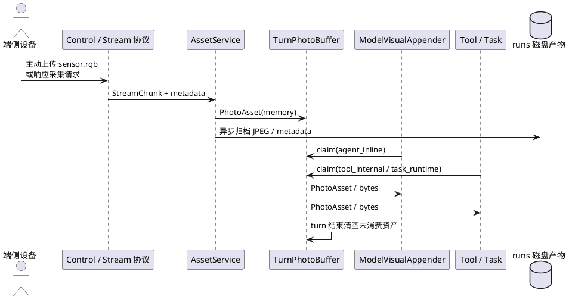

# SDK 照片资产处理链路设计

更新时间：2026-05-22

本文描述 `realtime-agent` SDK 内部的照片资产处理链路。它只约束通用 SDK 能力：协议扩展、资产生命周期、turn buffer、消费声明、模型视觉 append 和测试边界；不定义 for-blind-app 的 360 识别、万物监测、定时提醒等业务能力。

## 1. 背景

SDK 中已有多条图片处理路径：

1. Tool 请求 `sensor.rgb` 单帧后，把图片交给 Vision/VL 主模型。
2. Omni Realtime 在用户语音期间按固定频率采集图片，并即时 append 到 Realtime provider。
3. Tool 可以在内部调用图片理解模型，但主模型不一定能看到原图。
4. Task 可以长期订阅或请求视觉资产，但不应该把每一帧都塞进主模型上下文。

这些路径需要共享同一套照片资产生命周期，否则会出现重复消费、跨 turn 污染、provider 差异泄漏到业务 Tool、异步落盘阻塞主链路等问题。

## 2. 目标和非目标

目标：

1. 所有 `sensor.rgb` 上传统一进入 `PhotoAsset` 模型。
2. 支持端侧主动上传和 server 请求采集两种入口。
3. 引入 turn 级 `TurnPhotoBuffer`，自动消费只在当前 turn 内有效。
4. 通过 claim 保证每张照片只被一个业务消费路径消费。
5. 抽象 `ModelVisualAppender`，隔离 Omni Realtime 与 Vision/VL 的 append 差异。
6. 让协议扩展保持事件名和二进制 stream 格式稳定。

非目标：

1. SDK 不实现具体业务视觉任务，例如找物、红绿灯、360 识别或万物监测。
2. SDK 不统一处理所有视频帧；长期视频流仍可由端侧或应用 Task 自行编排。
3. runs 排障读取不属于业务消费，不创建 claim。
4. SDK 不把旧业务逻辑作为兜底写进 core。

## 3. 总体模型



## 4. 上传和管理

上传方式只有两类：

| 上传方式 | 发起方 | 协议入口 | 典型场景 |
| --- | --- | --- | --- |
| 端侧主动上传 | device | `/ws/stream` 输入 chunk | 端侧主动拍照、连续采样、调试上传。 |
| server 请求采集 | server | `stream.control.open.requested` -> `/ws/stream` | `capture_photo`、realtime-video、Task 周期采样。 |

管理规则：

1. 每个 `sensor.rgb` 上传成功后生成一个 `PhotoAsset`。
2. `PhotoAsset` 先进入内存 buffer，主链路不等待磁盘写入。
3. 磁盘归档异步执行，只用于排障和回放证据。
4. 上传方可传 `ttl_seconds`；为空时使用 server 默认值。
5. TTL 只影响 turn buffer 可消费时间，不影响 runs 产物保留。
6. 正常完成、用户打断、provider 失败都算 turn 结束，必须清理 buffer。

## 5. 核心对象

### 5.1 PhotoAsset

`PhotoAsset` 是 server 内部照片资产对象，核心字段包括：

```json
{
  "asset_id": "asset_xxx",
  "user_id": "user-001",
  "session_id": "device-or-session",
  "turn_id": "turn_xxx",
  "stream_type": "sensor.rgb",
  "mime_type": "image/jpeg",
  "created_at_ms": 1760000000000,
  "expires_at_ms": 1760000005000,
  "disk_uri": "/runs/.../photos/asset_xxx.jpg",
  "metadata": {
    "upload_mode": "device_push | server_requested",
    "request_id": "asset_req_xxx",
    "correlation_id": "turn_or_task_id",
    "capture_reason": "capture_photo | realtime_video | task_sampling",
    "captured_at_ms": 1760000000000,
    "sequence_index": 0,
    "direction": "front"
  }
}
```

`direction` 第一阶段默认 `front`，未来由端侧 IMU / 姿态融合解析后写入。

### 5.2 TurnPhotoBuffer

`TurnPhotoBuffer` 按 `user_id + session_id + turn_id` 管理当前 turn 的照片资产。

职责：

1. 存储未消费照片。
2. 按条件查询当前 turn 的照片。
3. 执行业务 claim，避免重复消费。
4. turn 结束清空 buffer。
5. 不删除已归档的 runs 文件。

状态：

```text
buffered -> claimed -> consumed
buffered -> expired
buffered/claimed -> cleared_by_turn_end
```

### 5.3 PhotoAssetClaim

业务消费必须声明消费方式：

```json
{
  "claim_id": "claim_xxx",
  "asset_id": "asset_xxx",
  "consumer": "agent_inline | tool_internal | task_runtime",
  "owner": "VisionRealtimeAgentCore | OmniRealtimeAgentCore | tool:capture_photo | task:custom_visual_task",
  "claimed_at_ms": 1760000001000,
  "reason": "tool_result_followup | realtime_video_append | task_observation"
}
```

## 6. 消费语义

SDK 只定义三类业务消费：

| 消费方式 | consumer | 主模型是否看到原图 | 典型场景 |
| --- | --- | --- | --- |
| 主模型直接看图 | `agent_inline` | 是 | 用户问“前面有什么”。 |
| Tool 内部分析 | `tool_internal` | 否 | OCR、专用图片解析工具。 |
| Task 运行时分析 | `task_runtime` | 通常否 | 长周期监测、找物、红绿灯。 |

`ToolResult.assets` 不能作为自动 append 依据。Tool 必须通过 `VisualAssetRef.visibility` 表达是否允许主模型看到原图：

1. `append_to_agent`：AgentCore 可把资产和工具文本 append 给主模型。
2. `internal_only`：主模型只能看到 Tool 的文本或结构化结果。

Task 默认不把每帧原图 append 给主模型，只返回 observation、summary 或 TaskSignal。

## 7. 模型 append 策略

SDK 用 `ModelVisualAppender` 隔离 provider 差异：

```text
ModelVisualAppender
  append_visual_assets(visual_assets, context)
  flush_turn_assets(context)
```

Omni Realtime：

1. 语音开始后按配置请求 `sensor.rgb`。
2. 每张图片上传后由 `OmniVisualAppender` 立即 claim。
3. append 到 Realtime provider 时保留上传顺序。
4. 语音停止、response done、输入 stream 关闭时停止采样并清理 buffer。

Vision/VL：

1. 用户说话期间采样图片，只写入 turn buffer。
2. ASR final 后，`VlVisualAppender.flush_turn_assets()` 按时间顺序 claim 当前 turn 图片。
3. 构造同一条 user message：文本说明图片顺序、时间戳和 direction，再追加 image blocks。
4. `model-request.json` 只记录脱敏图片摘要和 source map，不写完整 base64。

## 8. 协议扩展

协议保持事件名和二进制 stream 格式稳定，只扩展 `sensor.rgb` metadata 与采集请求 payload。

`sensor.rgb` stream metadata 支持：

| 字段 | 必填 | 说明 |
| --- | --- | --- |
| `request_id` | 条件 | server 请求采集时用于匹配 pending 请求。 |
| `correlation_id` | 否 | 连续采样或 Task 关联 ID。 |
| `turn_id` | 否 | 当前用户 turn ID。 |
| `ttl_seconds` | 否 | buffer 有效期，单位秒。 |
| `capture_reason` | 否 | `capture_photo`、`realtime_video`、`task_sampling` 等。 |
| `captured_at_ms` | 否 | 端侧实际拍摄时间。 |
| `sequence_index` | 否 | 同一 turn / correlation 下的图片序号。 |
| `direction` | 否 | 默认 `front`。 |

`stream.control.open.requested` 可携带：

```json
{
  "stream_type": "sensor.rgb",
  "mode": "single | continuous",
  "format": "jpeg",
  "request_id": "asset_req_xxx",
  "correlation_id": "turn_or_task_id",
  "turn_id": "turn_xxx",
  "ttl_seconds": 5,
  "capture_reason": "realtime_video",
  "frequency_hz": 1,
  "sample_count": 1,
  "direction": "front"
}
```

第一阶段不新增 `photo.*` 事件、不新增独立图片上传 HTTP API、不新增点对点 `target_device_id` 字段。

## 9. 测试边界

必测范围：

1. P0：协议文档、fixture、schema examples 可解析。
2. L1 Server：`sensor.rgb` 上传进入 buffer，TTL、claim、清理和异步归档行为正确。
3. L1 Device：未知字段可忽略，新 metadata 可 round-trip。
4. AgentCore：Omni 即时 append，Vision/VL 批量 append。
5. 应用层：业务 Tool / Task 不绕过 SDK 消费语义。

推荐命令：

```bash
uv run python -m pytest protocol/protocol-tests -q
uv run python -m pytest agent-server/protocol-tests -q
uv run python -m pytest devices/python/protocol-tests -q
```
