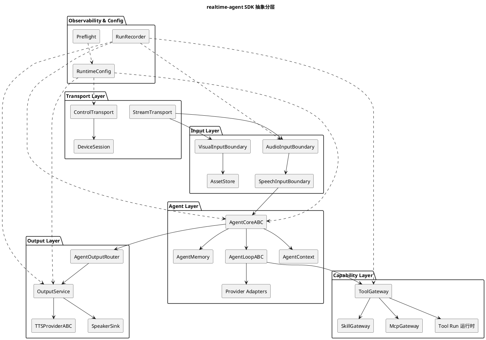

# realtime-agent 抽象架构设计

## 文档定位

本文描述 `realtime-agent` SDK 的理想抽象架构。它不逐行解释当前实现，也不作为某次重构的实施计划，而是回答：

1. SDK 应该有哪些稳定的概念层。
2. 每个概念层应该暴露哪些抽象接口。
3. `AgentCore`、`AgentLoop`、`AgentContext`、`Provider`、`Tool`、`后台 Tool`、`Output` 等核心概念如何区分。
4. Omni、VL 和未来自定义 Agent 如何在同一套抽象下扩展。

具体音视频链路设计见 [音视频对话统一链路设计.md](音视频对话统一链路设计.md)。本文是更高一层的 SDK 抽象设计。

## 总体分层

理想架构分为六层：

```text
Transport Layer
  -> Input Layer
  -> Agent Layer
  -> Capability Layer
  -> Output Layer
  -> Observability & Config Layer
```

依赖方向只能从上游调用下游能力，不能反向穿透：



## 设计原则

1. 抽象层表达稳定概念，具体 provider、设备、模型和协议只作为实现细节。
2. `AgentCore` 是模型运行时核心，不是 WebSocket handler，也不是工具执行器。
3. `AgentLoop` 是一次或多次模型推理的控制循环，属于 `AgentCore` 内部，不拥有设备连接。
4. 输入层只产生标准输入事件，不理解模型上下文和工具策略。
5. 输出层只负责把 Agent 结果变成用户可感知输出，不理解模型推理过程。
6. Tool / Skill / MCP 都属于能力层，模型只能通过 Agent 暴露的 schema 间接访问。
7. runs 产物和 preflight 是跨层观测能力，但不能反向改变业务逻辑。

## Transport Layer

Transport Layer 负责设备连接、控制通道和数据流通道。

### 核心抽象

#### `ControlTransportABC`

职责：

1. 接收设备注册、心跳、唤醒、命令回执和 audio session 回执。
2. 向设备发送控制事件。
3. 不解析模型语义。

不负责：

1. 不判断用户是否说话。
2. 不决定是否打断。
3. 不直接调用 Agent 或 Tool。

#### `StreamTransportABC`

职责：

1. 接收上行二进制 stream，例如 `sensor.mic`、`sensor.rgb`。
2. 发送下行二进制 stream，例如 `actuator.speaker`。
3. 管理 stream 生命周期、seq、finish、cancel 和 backpressure。

不负责：

1. 不做 ASR、VAD 或 TTS。
2. 不构造模型请求。
3. 不保存对话历史。

#### `DeviceSession`

职责：

1. 绑定 `user_id`、`device_id`、`session_id` 和 stream。
2. 记录设备能力和当前会话状态。
3. 为 Input / Output 层提供稳定设备上下文。

## Input Layer

Input Layer 负责把端侧传入的数据转换为 Agent 可消费的标准输入事件。

### 核心抽象

#### `AudioInputBoundaryABC`

职责：

1. 校验音频格式。
2. 重采样、声道转换和轻量质量诊断。
3. 把连续音频交给 `SpeechInputBoundary`。
4. 保证后续组件看到的是规范化音频。

不负责：

1. 不构造 prompt。
2. 不调用模型。
3. 不执行工具。
4. 不直接播放输出。

#### `SpeechInputBoundaryABC`

职责：

1. 将连续音频和可选 ASR 结果转换成标准 `SpeechInputDelta`。
2. 屏蔽独立 VAD、ASR/VAD 合一 provider、端侧按钮模式等来源差异。
3. 给 Agent 层输出统一的输入事件。

标准 delta：

| 事件 | 含义 | 主要消费者 |
| --- | --- | --- |
| `audio_chunk` | 规范化后的上行音频片。 | Omni agent、诊断、录音产物 |
| `asr_text_delta` | 流式 ASR 文本增量。 | VL agent、调试 UI、runs |
| `turn_started` | 用户开始一个有效语音 turn。 | 打断、视觉采样、端侧提示 |
| `turn_ended` | 用户语音 turn 结束，包含 ASR final text 或可提交标记。 | VL / Omni turn 提交 |

注意：`SpeechInputBoundary` 不是只等同于 VAD。它是“语音输入边界”抽象，可以承载 ASR/VAD 合一 provider 的结构化事件。

#### `VisualInputBoundaryABC`

职责：

1. 管理图片、视频、深度图等视觉输入生命周期。
2. 按 turn 绑定视觉资产。
3. 将视觉输入写入 `AssetStore` 或直接交给支持 realtime video 的 provider adapter。

不负责：

1. 不判断用户视觉意图。
2. 不调用视觉模型理解图片。
3. 不把历史图片默认当作当前画面。

#### `AssetStoreABC`

职责：

1. 保存图片、视频、音频片段等大字节资产。
2. 提供 `AssetRef`、claim、TTL、source map 和读取接口。
3. 保证 Tool、Agent 都通过稳定引用访问资产。

## Agent Layer

Agent Layer 是 SDK 的模型运行核心。

### `AgentCoreABC`

`AgentCoreABC` 是一个用户会话内的 Agent 运行时抽象。Omni、VL 和自定义 Agent 都应该继承或实现它。

建议接口：

```python
class AgentCoreABC:
    def open(self, context: "AgentContext") -> None: ...
    def consume_input(self, delta: "SpeechInputDelta") -> None: ...
    def interrupt(self, reason: str) -> None: ...
    def close(self, reason: str) -> None: ...
    def snapshot(self) -> "AgentSnapshot": ...
```

职责：

1. 持有当前 Agent 会话状态。
2. 接收标准输入事件。
3. 驱动一个或多个 `AgentLoop`。
4. 管理上下文、记忆、工具 schema、provider session 和输出结果。
5. 将 Agent 输出交给 `AgentOutputRouter`。

不负责：

1. 不直接读写 WebSocket。
2. 不直接操作端侧设备。
3. 不直接管理后台 Tool 生命周期。
4. 不直接实现 TTS 播放队列。

### `AgentContext`

`AgentContext` 是 AgentCore 每次运行时可访问的稳定上下文。

包含：

1. `user_id`、`session_id`、当前设备和 active streams。
2. system prompt 和运行配置。
3. 当前 turn 输入，包括 ASR 文本、音频引用、视觉资产引用。
4. 可见工具 schema。
5. 长期记忆片段和短期消息历史。
6. 运行产物 recorder。

不包含：

1. 原始 WebSocket 对象。
2. 业务 Tool 实例。
3. 后台 Tool 协程 实例。
4. provider SDK 原始连接对象。

### `AgentMemory`

`AgentMemory` 是 Agent 可读写的记忆和消息历史抽象。

职责：

1. 保存用户消息、助手消息、tool call、tool result 和中断标记。
2. 提供 active messages、summary fragment 和完整 audit history。
3. 注入长期记忆。
4. 管理上下文压缩和历史视觉事实降级。

不负责：

1. 不执行模型推理。
2. 不判断是否调用工具。
3. 不保存大字节资产本体。

### `AgentLoopABC`

`AgentLoop` 是 AgentCore 内部的一次响应生成控制循环。它是“怎么跑模型”的抽象，不是“Agent 是谁”的抽象。

典型职责：

1. 准备 provider request。
2. 调用 LLM / realtime provider。
3. 处理流式 delta。
4. 处理 tool call。
5. 回填 tool result。
6. 判断是否继续下一轮 provider call。
7. 产出 `AgentOutputDelta`。

不负责：

1. 不持有设备连接。
2. 不保存长期任务状态。
3. 不直接发 speaker stream。
4. 不管理全局 session 生命周期。

典型实现：

| 实现 | 适用链路 | 说明 |
| --- | --- | --- |
| `VlAgentLoop` | VL | ASR final text -> messages -> VL provider -> tool loop -> text output。 |
| `OmniRealtimeLoop` | Omni | audio chunks append -> commit/create_response -> provider events -> audio output/tool call。 |
| `TextOnlyAgentLoop` | 未来文本 Agent | text input -> LLM provider -> text output。 |

### Provider 适配器

Provider 是模型或模型相关服务的适配层。

建议拆分：

| 抽象 | 职责 |
| --- | --- |
| `VLMProviderABC` | 视觉语言模型 provider，输入 messages/tools/visual content blocks，输出 text delta/tool call。 |
| `OmniRealtimeProviderABC` | Omni realtime provider，输入音频/图片/commit，输出音频/text/tool events。 |
| `ASRProviderABC` | ASR provider，输出 ASR text delta/final text，并可选输出 turn boundary。 |
| `TTSProviderABC` | TTS provider，输入文本 delta，输出音频 chunk。 |

Provider 不负责：

1. 不保存 Agent 记忆。
2. 不执行 SDK Tool。
3. 不管理设备连接。
4. 不决定业务任务生命周期。

## Capability Layer

Capability Layer 负责让 Agent 使用外部能力。

### `ToolGateway`

职责：

1. 注册 Tool。
2. 生成 provider function schema。
3. 执行参数校验和策略过滤。
4. 构造 `ToolContext`。
5. 执行 Tool 并返回 `ToolResult`。

Agent 只能通过 `ToolGateway` 访问工具，不能直接 import 业务工具。

### `Tool Run 运行时`

职责：

1. 注册和启动后台 Tool。
2. 管理 `ToolRun`、状态、信号和取消。
3. 接收端侧 command 回报。
4. 将 `Tool Run 回流结果` 回流 Agent 或 Output。

Agent 看到 后台 Tool 的方式是 ToolResult 中的 `ToolRun`，不是 后台 Tool 对象本身。

### `SkillGateway` / `McpGateway`

职责：

1. 提供外部工具、MCP 能力或 skill 能力。
2. 通过 ToolGateway 或 Context API 暴露给 Agent。
3. 不直接进入模型运行循环。

## Output Layer

Output Layer 负责把 Agent 的结果变成用户可感知输出。

### `AgentOutputDelta`

AgentCore 不应该直接假设输出一定是文本或一定是音频。建议统一为：

```python
class AgentOutputDelta:
    kind: Literal["text", "audio", "control", "Tool Run 回流"]
    payload: bytes | str | dict
    priority: str
    metadata: dict
```

### `AgentOutputRouter`

职责：

1. 接收 AgentCore 产出的 `AgentOutputDelta`。
2. 根据类型决定输出路径。
3. `text` 进入 TTS。
4. `audio` 直接进入 speaker stream。
5. `control` 转交控制层。
6. `Tool Run 回流` 根据策略进入 Agent 或直接播报。

### `OutputService`

职责：

1. 播放优先级和仲裁。
2. 下行 speaker stream 生命周期。
3. finish / cancel / pause / resume。
4. TTS session 管理。
5. 端侧播放回执处理。

不负责：

1. 不构造 prompt。
2. 不执行工具。
3. 不判断用户是否说话。

## Observability & Config Layer

### `RuntimeConfig`

职责：

1. 统一加载 YAML、环境变量和默认值。
2. 把配置按层分发给 Transport、Input、Agent、Capability 和 Output。
3. 不在业务逻辑中散落硬编码。

### `RunRecorder`

职责：

1. 记录输入、模型请求、provider 事件、tool trace、task signal、输出决策和错误。
2. 支持按 session 回放和排障。
3. 不改变主链路行为。

### `Preflight`

职责：

1. 静态检查配置、provider、协议和目录。
2. 明确报告降级项。
3. 不把“配置可用”误写成“真机行为已验证”。

## Omni 与 VL 的抽象统一

统一点：

1. 都实现 `AgentCoreABC`。
2. 都消费 `SpeechInputDelta`。
3. 都使用 `AgentContext`、`AgentMemory`、`ToolGateway`、`Tool Run 运行时` 和 `OutputService`。
4. 都产出 `AgentOutputDelta`。
5. 都通过 runs 产物记录可复查行为。

差异点：

| 维度 | VL | Omni |
| --- | --- | --- |
| 输入 | ASR final text 为主，音频用于 ASR。 | audio chunk 为主，Manual 下 turn final 触发 commit。 |
| Provider | `ASRProvider` + `VLMProvider` + `TTSProvider`。 | `OmniRealtimeProvider` 内置 ASR/VLM/TTS/audio output。 |
| AgentLoop | messages/tool loop/text output。 | realtime event loop/audio output/tool event。 |
| 输出 | 通常是 text，需要 TTS。 | 通常是 provider audio，可直接播放。 |

因此抽象目标不是让 VL 和 Omni 拥有同一个 AgentLoop，而是让它们：

1. 共享输入事件契约。
2. 共享上下文和能力访问。
3. 共享输出结果契约。
4. 在各自 AgentLoop 内保留 provider 差异。

## 推荐目录映射

理想目录可以逐步向以下结构收敛：

```text
realtime_agent/
  transport/
    control.py
    stream.py
    session.py
  input/
    audio.py
    speech_boundary.py
    visual.py
  agent/
    core.py
    context.py
    memory.py
    loop.py
    provider.py
    omni.py
    vl.py
  capability/
    tools.py
    tool_run.py
    skills.py
    mcp.py
  output/
    router.py
    service.py
    tts.py
  observability/
    recorder.py
    preflight.py
  config.py
```

迁移时不要求一次性改目录。更重要的是先让代码中的抽象接口和依赖方向稳定。

## 演进顺序

建议按以下顺序演进：

1. 定义 `SpeechInputDelta`、`AgentOutputDelta`、`AgentCoreABC`、`AgentLoopABC` 的接口文档和最小类型。
2. 把 VL 和 Omni 的输入入口改成 `consume_input(event)`，保留旧 `append_audio_event()` 适配。
3. 把 ASR/VAD 合一 provider 和独立 VAD detector 都适配成 `SpeechInputBoundary` 事件来源。
4. 把 Agent 输出统一成 `AgentOutputDelta`，由 `AgentOutputRouter` 决定 TTS 或直播放。
5. 再考虑目录重组，避免先移动文件导致逻辑边界没有变。

## 非目标

1. 不要求 Omni 和 VL 共用同一个 provider loop。
2. 不把 Tool、Output 都塞进 AgentCore。
3. 不让 Input Layer 理解 prompt、memory 或工具策略。
4. 不让 Output Layer 读取模型私有事件。
5. 不为抽象而抽象；每个 ABC 都必须对应一个可替换实现点。
6. 不为了目录好看先做大规模文件移动。
