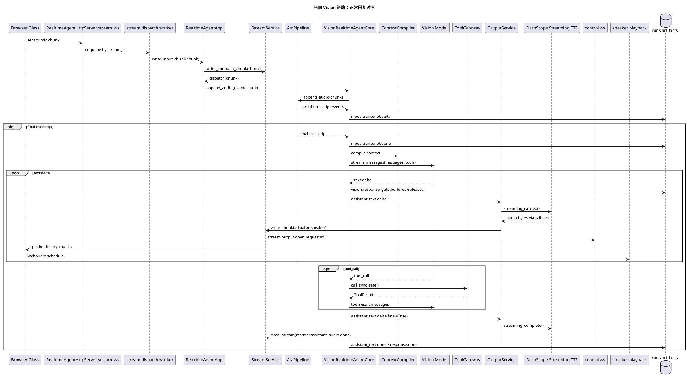
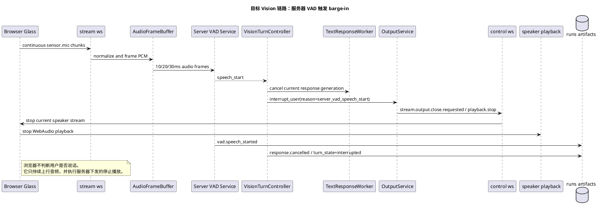
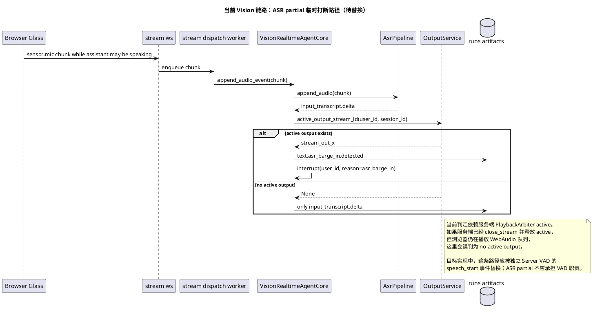
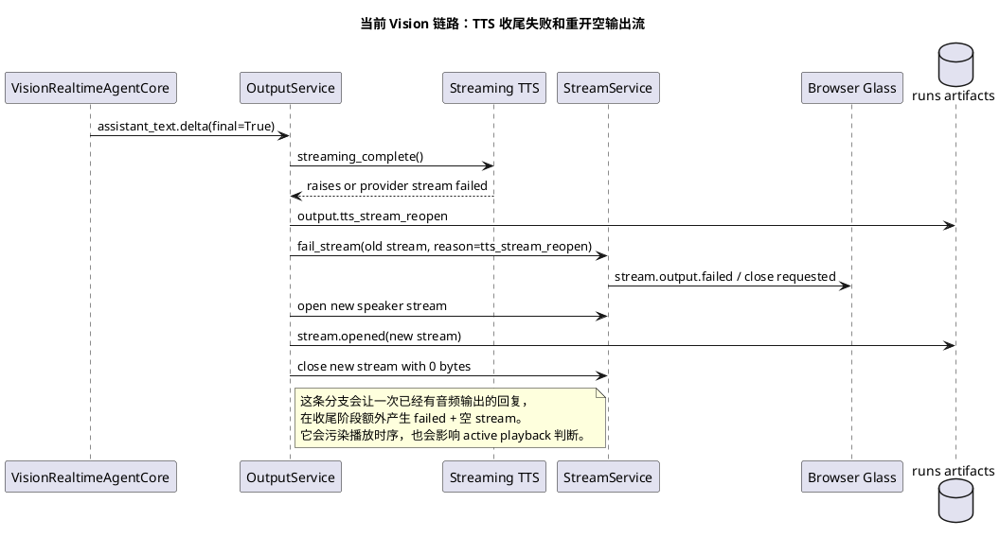
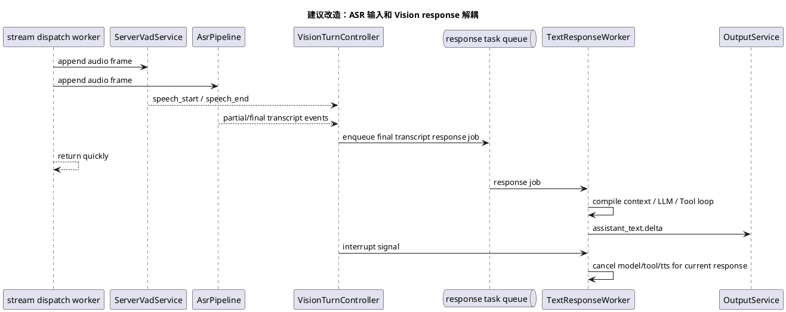
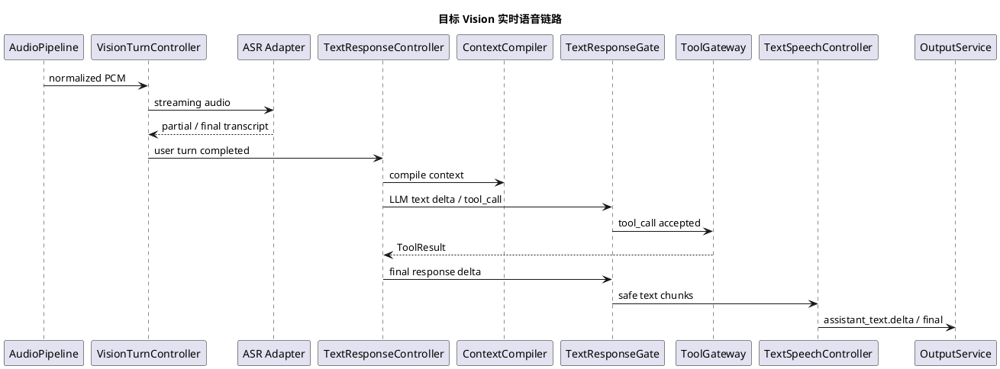
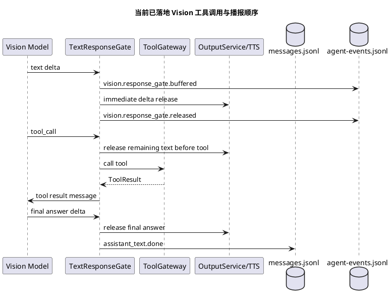

# Vision 链路实时语音化设计

## 背景

当前仓库同时支持两条语音交互链路：

- Omni / realtime 链路：`sensor.mic -> Omni Realtime provider -> 原生 audio delta -> actuator.speaker`
- Vision 链路：`sensor.mic -> ASR -> text LLM -> streaming TTS -> actuator.speaker`

Omni 链路把 ASR、turn detection、LLM、TTS 和工具调用时机交给 provider。Vision 链路使用普通视觉语言模型，必须由 SDK 自己编排 turn、工具调用、TTS、播放和打断。

公开方案调研结论：

- LiveKit Agents 把非 realtime model 语音助手建模为 `STT -> LLM -> TTS` pipeline，并提供 `stt_node()`、`llm_node()`、`tts_node()` 等节点用于插入自定义逻辑。参考：<https://docs.livekit.io/agents/logic/nodes/>
- LiveKit 的 turn detection 把 VAD、STT endpointing、turn detector model、manual turn control 分开处理，并把 interruption 作为一等能力。参考：<https://docs.livekit.io/agents/logic/turns/>
- Pipecat 也采用可组合 pipeline，强调 VAD 只负责 speech/silence，真正 turn end 需要 Smart Turn 或 speech timeout。参考：<https://docs.pipecat.ai/pipecat/learn/speech-input>
- 2026 年 realtime voice agent 教程仍把 cascaded streaming pipeline 作为自托管 voice agent 的实用架构：streaming STT、支持 function calling 的 streaming LLM、streaming TTS。参考：<https://arxiv.org/abs/2603.05413>

因此 Vision 链路不应该模仿 Omni provider 内部黑盒，而应该做成可观测、可控的级联实时管线。

## 真正实时的 Vision 语音链路定义

Vision 链路的“实时”不能只表示服务端使用了 streaming API，而是每一段上游增量都要尽快推动下游工作：

1. 端侧麦克风第一段 `sensor.mic` chunk 到达后，ASR 就开始流式识别，而不是等待整段录音结束。
2. 端侧语音结束时，ASR 应该已经处理完大部分音频，`input_transcript.done` 应尽量与音频结束接近同时出现。
3. Vision model 发出第一个 `vision_delta` 后，SDK 立即把这段文本送入 TTS，不等待自然停顿、长度阈值、完整 assistant 回复或是否会出现后续 tool call。
4. TTS 产生第一段音频 chunk 后，OutputService 立即通过 `actuator.speaker` 数据流下发给端侧，不等待整段 TTS 合成完成。
5. 最终 assistant 消息按已经释放给用户的 delta 顺序写入；如果后续出现 tool call，工具调用前已经播出的自然语言提示必须保留。
6. `server.py` 虽然是 Omni / Vision 共用的 WebSocket 传输层，但它不能让上行 chunk 的同步处理占住 aiohttp event loop；所有可能持续处理或触发下游同步工作的大量 stream chunk，都必须通过线程执行或其他非阻塞方式让出事件循环，保证控制事件和下行音频发送协程能及时运行。

从运行产物观察时，理想时间线应该是：`input_transcript.delta* -> input_transcript.done -> model.request -> vision.response_gate.buffered -> vision.response_gate.released(reason=vision_delta_realtime) -> assistant_text.delta -> assistant_audio.delta* -> stream.output.summary`。其中 `vision.response_gate.buffered` 与 `released` 不应该因为等待标点或完整回复而拉开明显间隔。

浏览器端“打开 speaker stream”和“听到第一段音频”之间允许存在 TTS 首包延迟。真实首响拆解必须按三个边界判断：

- `stream.output.open.requested -> stream.output.first_chunk.enqueued`：主要反映 TTS provider 首音频生成延迟。
- `stream.output.first_chunk.enqueued -> stream.output.first_chunk.sent`：主要反映服务端下行队列、aiohttp event loop 调度和 WebSocket backpressure；正常情况下 `queue_wait_ms` 应接近 0。
- `stream.output.first_chunk.sent -> browser playback first audio chunk`：主要反映端侧 WebSocket 接收、解码和播放调度；正常情况下应在同毫秒到几十毫秒内。

如果 `queue_wait_ms` 升高到秒级，说明问题不在 TTS provider，也不在浏览器播放，而是服务端事件循环或 WebSocket 下行发送被阻塞。2026-05-16 的真实浏览器回放曾观察到 `queue_wait_ms=4903`，根因是 stream WebSocket 接收循环同步处理大量 mic chunk 饿住同一 aiohttp event loop；修复后同场景降为 `queue_wait_ms=0`。

## 官方 API 核对

### DashScope 实时 ASR

官方文档：<https://www.alibabacloud.com/help/zh/model-studio/real-time-speech-recognition>

确认点：

- 官方实时识别目标是“边说边出文字”，Fun-ASR Python 示例使用 `Recognition(model='fun-asr-realtime', format='pcm', sample_rate=16000, semantic_punctuation_enabled=False, callback=callback)`。
- 官方示例流程是：创建 `Recognition`，调用 `recognition.start()`，麦克风循环读取 16k 单声道 PCM，每次读取后调用 `recognition.send_audio_frame(data)`，结束时调用 `recognition.stop()`。
- 识别结果通过 `RecognitionCallback.on_event()` 返回，`RecognitionResult.is_sentence_end(sentence)` 用于区分中间结果和句子结束结果。

当前实现结论：

- `DashScopeAsrProviderAdapter` 使用 `dashscope.audio.asr.Recognition`、`format="pcm"`、`sample_rate=16000`、`semantic_punctuation_enabled=False`，第一段 `sensor.mic` chunk 到达时创建 provider 并启动识别，会对后续音频 chunk 持续调用 `send_audio_frame()`；这符合官方实时 ASR 使用方式。
- 当前每条 `sensor.mic` stream 独立创建 ASR provider，final chunk 到达后调用 `stop()` 并短等待回调收尾，符合官方“开始、持续送帧、结束 stop”的会话生命周期。
- 配置 `asr_model="fun-asr-realtime"` 是实时接口模型；不要把非实时文件识别模型替换到这条链路。

### DashScope 实时 TTS

官方文档：<https://help.aliyun.com/zh/model-studio/cosyvoice-python-sdk>

确认点：

- `SpeechSynthesizer` 有三类调用方式：非流式 `call()`、单向流式 `call()` 加 `ResultCallback.on_data()`、双向流式 `streaming_call()` / `streaming_complete()`。
- 双向流式场景允许多次调用 `streaming_call()` 按顺序提交文本片段，服务端通过 `ResultCallback.on_data()` 实时返回音频；最后必须调用 `streaming_complete()`，否则结尾文本可能无法成功合成为语音。
- 官方文档明确说明：流式输入时服务端会自动分句，完整语句立即合成，不完整语句会缓存到完整后再合成；`streaming_complete()` 会强制合成所有已接收但未处理的文本片段，包括未完成句子。
- `AudioFormat.PCM_24000HZ_MONO_16BIT` 属于官方支持的 PCM 输出格式之一，当前端侧 speaker 配置 24k PCM 可以直接对应。

当前实现结论：

- `DashScopeStreamingTTS` 使用 `dashscope.audio.tts_v2.SpeechSynthesizer`、`streaming_call(text)`、`ResultCallback.on_data()` 和最终 `streaming_complete()`，符合官方双向流式 TTS 用法。
- `OutputService` 的后台 drain pump 会在两次 text delta 之间持续读取 `on_data()` 产生的音频并下发端侧，因此 SDK 侧没有等待完整 TTS 结束才播放。
- 需要注意 provider 限制：即使 SDK 已经把第一个 text delta 立刻送入 `streaming_call()`，CosyVoice 服务端也可能因为文本片段不是完整语句而缓存，不立即返回首个音频 chunk。运行产物应分别观察 `assistant_text.delta`、`assistant_audio.delta` 和 `tts_first_audio_latency_ms`，不能只看 Vision gate 是否释放。

## 关键时间点观测

为了定位“模型文字已经全部打印但端侧还没声音”的真实瓶颈，Vision 链路会在终端和 `agent-events.jsonl` / `model-events.jsonl` 中记录以下时间点：

| 事件 | 含义 |
| --- | --- |
| `text.timeline.audio.first_chunk_received` | 服务端收到第一段 `sensor.mic` 音频 chunk。 |
| `text.timeline.audio.input_done` | 服务端收到麦克风输入 final chunk，即本轮音频输入结束。 |
| `text.timeline.asr.first_char` | ASR 首次返回非空文本。 |
| `text.timeline.asr.done` | ASR 返回最终文本。 |
| `text.timeline.llm.first_token` | Vision model 首次返回非空文本 delta。 |
| `text.timeline.llm.done` | Vision model 本轮最终文本 delta 全部返回。 |
| `text.timeline.tts.first_audio_chunk` | Streaming TTS 首次产生可下发的音频 payload。 |
| `text.timeline.tts.audio_done` | Streaming TTS 本轮音频全部 drain 完成。 |
| `text.timeline.summary` | 以上时间点相对首个音频 chunk 的毫秒级汇总。 |
| `stream.output.first_chunk.enqueued` | 服务端 speaker 音频首个 chunk 写入下行 stream 队列。 |
| `stream.output.first_chunk.sent` | 服务端首个 speaker 音频 chunk 的 `ws.send_bytes()` 已返回，包含 `queue_wait_ms`。 |
| `stream.output.send.summary` | 服务端 output stream 下行发送汇总，包含入队 / 发送 chunk 数、bytes 和首尾发送耗时。 |
| `playback first audio chunk` | 浏览器眼镜收到首个 speaker 音频 chunk，包含 `since_open_ms`。 |
| `playback scheduled` | 浏览器已把首个音频 chunk 放入 WebAudio 调度，包含 `scheduled_delay_ms`。 |

这些事件都带 `since_audio_start_ms` 和 `since_previous_checkpoint_ms`。排查时优先看 `text.timeline.summary`：

- `llm.first_token` 已出现但 `tts.first_audio_chunk` 很晚，说明瓶颈在 TTS provider 生成首包或 SDK drain。
- `tts.first_audio_chunk` 已出现但端侧仍听不到，继续看 `stream.output.first_chunk.enqueued`、`stream.output.first_chunk.sent`、`queue_wait_ms` 和端侧 `playback first audio chunk`。
- `llm.done` 早于 `tts.first_audio_chunk`，说明 TTS 没有在模型输出过程中返回首包，常见原因是 provider 对不完整语句做了缓存。
- `stream.output.first_chunk.enqueued` 很早但 `stream.output.first_chunk.sent` 很晚，说明服务端 event loop 或 WebSocket 下行发送被阻塞；不能把这类问题误判成 TTS 慢。
- `stream.output.first_chunk.sent` 与端侧 `playback first audio chunk` 基本同时出现，但 `since_open_ms` 较大，说明 output stream 打开早于 TTS 首包，真实空等发生在 TTS 首音频生成阶段。

## 当前代码实现时序

更详细的浏览器 / 服务器边界、浏览器音频前处理、服务器 VAD 目标边界和历史浏览器 VAD 问题，见独立图文：[vision-realtime-browser-server-boundary.md](vision-realtime-browser-server-boundary.md)。

设计边界必须统一：唤醒后进入连续对话，端侧建立音频上行长连接。在释放连接之前，音频持续直达服务器；根据音频流做 speech start、speech end、barge-in、turn commit 等判断都是服务器职责。Omni / realtime 链路由 Omni provider 输出 `input_audio_buffer.speech_started` / `speech_stopped` 等事件；Vision 链路由服务器独立 VAD 服务输出等价事件。浏览器或真实眼镜端只负责唤醒、采集、上行、播放和执行服务器下发的停止播放指令。

当前正常回复路径的关键事实：

- `RealtimeAgentHttpServer.stream_ws()` 已经把每个 `stream_id` 的 chunk 放进独立 worker，并用 `asyncio.to_thread(self.audio_app.write_input_chunk, chunk)` 调用应用层；这解决了早期 event loop 被同步处理饿住的问题，但同一个 mic stream 内仍是串行处理。
- `VisionRealtimeAgentCore.append_audio_event()` 同时负责 ASR、模型请求、工具循环、TTS 输出 final flush 和消息写入；也就是说一次 final transcript 会在同一个调用栈中完成整个 Vision turn。
- `OutputService.on_agent_vision_delta()` 在首个文本 delta 释放时就可能打开 speaker stream；真实音频首包取决于 TTS callback，不能用 stream opened 代表用户听到声音。
- `_finish_stream()` 在服务端 TTS 完成后会关闭 output stream 并释放 PlaybackArbiter active 状态；这表示“服务端没有更多音频要发”，不等价于“端侧已经播放完”。

## 当前实现暴露的问题

### 1. 服务端 output stream 完成不等于端侧播放完成

当前 `OutputRouter._finish_stream()` 在 TTS drain 完成后调用 `stream_service.close_stream()`，随后 `PlaybackArbiter.on_playback_finished()` 释放 active。这个时刻只说明服务端已经把音频 chunk 下发完，不说明浏览器 WebAudio 队列已经播放完。

真实日志里经常出现：

- 服务端：`stream.closed reason=assistant_audio.done`
- 浏览器：后续仍有 `scheduled_delay_ms` 或长时间 `playback drained`

因此服务端用 `active_output_stream_id()` 判断 ASR barge-in 是不可靠的。更根本的问题是：ASR partial 不应承担 VAD 职责。Vision 链路应先由服务器 VAD 根据连续上行音频产出 `speech_start`，再由 `speech_start` 取消旧回复和停止端侧播放。

### 2. VisionRealtimeAgentCore 把整轮响应放在 `append_audio_event()` 同步调用栈内

当前 `append_audio_event()` 在拿到 final transcript 后，会继续完成 context compile、LLM streaming、工具调用、TTS final flush、assistant message 写入。虽然 `server.py` 已经把 stream chunk 分发放进 worker，但同一个 mic stream 的 worker 仍会被这一整轮 Vision response 占住。

这导致 Vision 链路和 Omni 的根本差异：

- Omni provider 在一个实时会话里同时处理输入音频、输出音频、打断和 response cancellation。
- Vision 链路目前是 final transcript 后启动一次同步 Vision turn；打断依赖另一路 control event 或下一段 ASR partial 事件。

如果用户插话只能靠服务端 ASR partial 触发，就会受到上面“active playback 状态不可靠”的影响。目标实现不依赖浏览器 VAD，也不依赖 ASR partial 来发现 speech start，而是依赖服务器 VAD。

### 3. 浏览器 VAD 不应作为协议语义

当前浏览器实现里，`control.user.interrupt.detected` 可能由本地 RMS/peak 阈值触发，也可能完全不出现。这个不确定性说明它不能作为连续对话协议语义。15:16 的日志中没有 `control.user.interrupt.detected`，只有后续 `input_transcript.delta/done`，这说明服务端没有收到浏览器打断事件。

正确方案不是继续增强浏览器 VAD，而是移除其默认职责：端侧持续上行音频，服务器 VAD 产出 `speech_start` 后，服务器再取消旧回复并通知端侧停止播放。

### 4. TTS 收尾失败被当成整条输出失败处理

日志中的 `output.tts_stream_reopen reason=streaming_tts_provider_failed` 出现在已经产生 `assistant_audio.done bytes=485760` 之后。也就是说主要音频已经输出，失败发生在 provider 收尾或重开恢复逻辑阶段。

这类失败不应该再打开一个新的空 speaker stream。更合理的处理是：

- 已经输出过音频时，收尾失败降级为 warning。
- 关闭当前 stream 并记录 TTS finalization warning。
- 不再触发 retry/reopen 空流。

## 基于时序图的修改方案

### 修改一：引入服务器 VAD，统一 Vision 的 speech boundary

目标：让服务器根据连续上行音频判断用户是否开始说话、是否结束说话，而不是依赖浏览器或 ASR partial。

建议新增服务端音频节点：

- `AudioFrameBuffer`：把连续 PCM 切成 VAD 算法需要的 10/20/30ms frame，统一采样率和声道。
- `ServerVadService`：专门 VAD 算法，输出 `speech_start`、`speech_end`、`silence_timeout`。
- `VisionTurnController`：消费 VAD 事件，`speech_start` 取消当前 response generation，`speech_end/silence_timeout` 提交本轮输入。

端侧播放状态仍要同步给服务器，但它只表示“当前输出是否已播放完成”，不能替代 VAD。

### 修改二：服务器 speech_start 下发停止播放

目标：让端侧停止播放由服务器决策触发。

建议流程：

1. `ServerVadService` 发现 `speech_start`。
2. `VisionTurnController` 取消当前 Vision response generation。
3. `OutputService` 停止旧 output stream、TTS source 和 sender queue。
4. 服务器通过控制面下发停止当前 speaker stream 的事件。
5. 浏览器或真实眼镜端只执行停止播放，并回报 `stream.output.closed`。

浏览器不再根据本地 VAD 发送 `control.user.interrupt.detected`。手动按钮可以保留为用户显式关闭/打断，但不能作为连续对话默认路径。

### 修改三：Vision response 从 mic stream worker 中拆出去

目标：让同一条 mic stream worker 只负责 ASR 输入和 transcript 事件，不承载 LLM/TTS 的完整响应生命周期。

建议拆成两个阶段：

拆分后：

- mic chunk worker 不再被 LLM/TTS 阻塞。
- VAD speech_start 和手动 interrupt 都能操作同一个 response task。
- 后续可以对 response task 做 generation id，避免旧回复在被打断后继续写消息或音频。

### 修改四：建立 Vision response generation id，防止旧回复越权收尾

当前仅靠 `_cancelled_users` 和 `interrupted_reason` 表示取消，粒度太粗。建议每次 final transcript 创建一个 `response_id`：

- `VisionRealtimeAgentCore` 当前 active response 保存 `response_id`、`user_id`、`device_id`、`input_stream_id`。
- 所有 LLM delta、tool result、TTS delta、final flush 都必须带 `response_id`。
- `interrupt()` 增加当前 response 的 cancelled 标记。
- 任何旧 response 的 final flush、assistant_text.done、TTS retry 都必须先检查 response 是否仍 active。

这样可以明确阻止“旧长笑话被打断后，几十秒后又写入 assistant_text.done”这类现象。

### 修改五：TTS finalization failure 不再 reopen 空输出流

`_retry_vision_output_with_new_source()` 应区分两类错误：

- 首个音频前失败：可以 fallback 或 retry。
- 已经输出过音频后，在 final/complete 阶段失败：记录 warning，关闭当前流，不重开空流。

需要在 `StreamingTtsOutputSource` 或 `OutputRouter` 里记录 `submitted_text`、`written_audio_bytes`、`first_audio_at`，用它判断是否已经产生有效输出。

### 修改六：VAD 观测必须进入 runs

服务器 VAD 事件必须进入 runs，而不是依赖浏览器控制台判断：

- `vad.speech_started`
- `vad.speech_stopped`
- `vad.silence_timeout`
- `vad.probability` 或算法置信度。
- 触发事件的 `input_stream_id`、frame 时间戳和 response generation。

### 推荐实施顺序

1. 先做服务器 VAD 节点和 `VisionTurnController`，把 `speech_start/speech_end` 写入 runs。（当前代码已先落地服务器 VAD 节点和 speech_start 取消旧输出。）
2. 用 `speech_start` 替换浏览器本地 VAD，统一由服务器取消旧 response 并下发停止播放；ASR partial 仅保留为过渡兜底。
3. 再做 Vision response generation id，防止旧 response 在打断后继续 final flush、TTS retry 或写 assistant done。
4. 然后把 Vision response worker 从 mic stream worker 中拆出去，形成 `VAD/ASR event -> response task` 的明确边界。
5. 最后清理 TTS 收尾失败策略：已输出音频后的 finalization failure 不 reopen 空流，只记录 warning。

## 与 Omni 链路的差异

| 维度 | Omni / realtime | Vision |
| --- | --- | --- |
| Turn boundary | provider 内置 VAD / semantic VAD | 目标为服务器独立 VAD；当前临时依赖 ASR final |
| 模型输入 | PCM 音频流和工具 schema | transcript、messages、工具 schema |
| 输出 | provider 原生 PCM audio delta | 文本 delta 经 TTS |
| 工具调用 | provider event 驱动，结果回填 provider | SDK tool loop 驱动，结果回填 vision model |
| 可控性 | 工具前/工具中音频较难硬拦截 | 可以在文字进入 TTS 前做代码级门控 |
| 风险面 | provider 行为黑盒 | pipeline 编排复杂度在 SDK |

## 目标架构

## 核心约束

Vision 链路不能把 “tool_call 之前出现的文本” 简单判定为模型废话。普通视觉语言模型经常会先给用户一句自然提示，例如“我先看一下”或“稍等，我查一下”，然后再发起工具调用。这类内容属于用户可听响应，必须满足：

- 按模型 delta 原顺序进入 TTS。
- 写入本轮 assistant 消息。
- 作为是否需要系统 progress audio 的判断依据。
- 不能因为后续出现 tool_call 而被丢弃。

系统 `Tool.progress_message` 只在模型首输出就是 tool_call、且本轮尚未释放任何模型文本时插入，避免用户听到两段重复的“稍等/正在处理”。

## 分阶段实施

### Phase 1：Vision 私有输出门控

状态：已完成。

目标：先把 vision model 的早期输出纳入代码级门控，避免工具调用、进度音和 TTS 播放时机互相打架，同时保留工具调用前的自然语言提示。

范围：

- 只改 `VisionRealtimeAgentCore` 私有逻辑。
- 不改 Omni provider adapter。
- 不改 `AudioPipeline`、`ToolGateway`、`OutputService` 的共享语义。

策略：

1. 每次 LLM streaming 调用内部新增 Vision response gate。
2. 普通文本 delta 先进入 gate，由 gate 判断何时安全释放给 TTS。
3. 如果本次模型调用最终没有 tool call，则所有未释放文本按原始 delta 顺序释放给 TTS。
4. 如果本次模型调用出现 tool call，也先释放已缓冲文本；这段文本可能是模型对用户的合理提示，不能默认当成废话丢弃。
5. 只有当模型首输出就是 tool call、没有任何已播文本时，才由系统的 `Tool.progress_message` 负责工具前置播报。
6. 记录 `vision.response_gate.buffered/released/discarded`，方便从 runs 中确认门控行为；`discarded` 仅保留给后续更细粒度策略使用。

### Phase 2：Turn 状态机

状态：已完成服务端最小状态机。

目标：显式记录 Vision 链路状态，支撑后续 partial ASR、打断和延迟分析。

已落地状态：

- `listening`
- `transcribing`
- `thinking`
- `tool_running`
- `speaking`
- `interrupted`
- `completed`
- `failed`

状态变化通过统一事件 `agent.turn_state.changed` 写入 `agent-events.jsonl` / `model-events.jsonl`，并同步进入 `AgentEventBuffer`。Vision 和 Realtime / Omni 共用事件名和状态枚举，通过 payload 中的 `agent_core`、`modality`、`provider`、`provider_event` 区分来源。当前阶段先做服务端状态观测，不改变 ASR provider 的 final transcript 语义。

### Phase 3：逐 delta TTS 与首音频下发

状态：已完成首版逐 delta 实时释放。

目标：在不牺牲工具前门控的前提下，把 LLM 首个 text delta 尽快送入 TTS，并让 TTS 首段音频尽快下发端侧。

策略：

- 每个非空 text delta 到达后都立即释放给 OutputService/TTS，释放原因记录为 `vision_delta_realtime`。
- 不再等待中文/英文自然停顿标点，也不再等待完整 assistant 回复。
- tool_call 到来时立即释放已缓冲文本，保证“工具前自然提示”不丢失。
- TTS 侧依赖 streaming source 和后台 drain pump 尽快拉取音频；如果 provider 本身首包慢，运行产物应通过 `assistant_audio.delta` 与 `stream.output.summary` 的时间差暴露。
- 所有释放事件记录 `reason`，例如 `vision_delta_realtime` 或 `explicit_release`。
- Output stream 可以在首个文本 delta 释放时提前打开，但真实首响不能用 `stream.output.open.requested` 衡量；必须以 `stream.output.first_chunk.enqueued`、`stream.output.first_chunk.sent` 和端侧 `playback first audio chunk` 判定。
- `RealtimeAgentHttpServer.stream_ws()` 不能在 aiohttp event loop 内同步执行大量 `write_input_chunk()`；当前按 `stream_id` 建立 dispatch worker，并在 worker 内使用 `asyncio.to_thread()` 调用应用层，避免 ASR/LLM/Tool 或大量 mic chunk 阻塞控制事件与下行音频发送。

当前还没有引入跨 Vision/TTS 的独立背压队列，也没有改变 `OutputService` 的播放仲裁策略；本阶段先保证 Vision gate 不再成为首音频延迟来源。

### Phase 4：打断和已播历史

状态：已完成服务端可测试语义；真机体验仍需人工验收。

目标：用户说话打断时，取消 LLM、TTS 和 output stream，并记录用户实际听到的 assistant 片段。

已落地语义：

- `VisionRealtimeAgentCore.interrupt()` 会取消 vision model 和当前用户输出流；当前不再取消 ASR provider，避免用户插话过程中把正在收音的 ASR 会话直接关掉。
- 如果打断发生在 Vision 模型仍在 streaming 的过程中，工具循环只返回已经释放给 TTS 的文本。
- 最终 assistant 消息带 `interrupted=true` 和 `interrupted_reason`。
- runs 中记录 `response.interrupted`、`agent.response.cancelled` 和 `agent.turn_state.changed(state=interrupted)`。

真实麦克风 speech-start 触发质量、false interruption 过滤和用户实际听感，需要通过服务器 VAD / Omni provider VAD 继续验收；端侧只负责唤醒、持续上行音频和执行服务器下发的停止播放。本阶段当前代码只具备收到 `control.user.interrupt.detected` 后的基本收口语义，目标方案必须改为服务器 speech_start 驱动的 barge-in，见上文“基于时序图的修改方案”。

## Phase 1 验收

必须覆盖：

- 普通文本回答仍能输出并保存 assistant 消息。
- 首输出就是 tool call 时仍会播放系统 progress audio。
- 先输出文本再 tool call 时，工具前文本正常进入 TTS 和 assistant 最终消息，且不重复插入系统 progress audio。
- 工具结果后的最终回答正常进入 TTS 和消息历史。
- Realtime / Omni 相关测试不因 Vision 私有改动失败。

## 当前实现摘要

实现文件：

- `agent-server/realtime_agent/agent_core/text.py`
  - `TextResponseGate`：缓冲、逐 delta 实时释放、显式释放和 discard 观测事件。
  - `VisionRealtimeAgentCore._set_turn_state()`：Vision turn 状态机事件。
  - `VisionRealtimeAgentCore.interrupt()`：服务端打断收口、vision model cancel 和当前输出取消；不取消 ASR。
- `agent-server/realtime_agent/server.py`
  - 下行 speaker stream 记录 `stream.output.first_chunk.enqueued`、`stream.output.first_chunk.sent(queue_wait_ms)` 和 `stream.output.send.summary`。
  - stream WebSocket 接收循环按 `stream_id` 建立 dispatch worker，并在线程中调用 `write_input_chunk()`，避免同步处理饿住 aiohttp event loop。
- `examples/dev-support/devices/browser-glass/index.html`
  - 浏览器日志使用毫秒级时间戳。
  - 只记录 speaker 首包、调度、drain 汇总，不再逐 chunk 打印音频接收日志。
- `agent-server/protocol-tests/sdk/runtime/test_progress_audio.py`
  - 覆盖首输出 tool_call 的 progress audio。
  - 覆盖先文本再 tool_call 时保留工具前文本且不重复播 progress audio。
- `agent-server/protocol-tests/sdk/agent_core/test_agent_core_router.py`
  - 覆盖逐 delta 实时释放，包括无标点首个 delta 立即释放。
  - 覆盖 Vision 状态机事件。
  - 覆盖打断后只保存已释放 assistant 文本。

## 验证记录

- `uv run python -m pytest agent-server/protocol-tests/sdk/runtime/test_progress_audio.py agent-server/protocol-tests/sdk/agent_core/test_agent_core_router.py -k 'vision_agent or progress_audio' -q`
  - 结果：通过，15 passed。
- `uv run python -m pytest agent-server/protocol-tests/sdk/agent_core/test_omni_audio_agent_core.py agent-server/protocol-tests/sdk/agent_core/test_context_compiler.py agent-server/protocol-tests/sdk/runtime/test_voice_session_modes.py -q`
  - 结果：通过，29 passed。
- `uv run python -m realtime_agent_python_playback_glass run --server-url http://127.0.0.1:18765 --suite examples/dev-support/devices/python-playback-glass/suites/smoke.yaml --runs-root /tmp/realtime-agent-text-e2e/runs --report /tmp/realtime-agent-text-e2e/reports/smoke/report.json`
  - 配置：临时 `/tmp/realtime-agent-text-e2e/server.yaml`，`agent.mode=vision`，ASR/Vision/TTS 均为 mock provider，复用 for-blind capabilities，清空临时 denylist 以允许 `capture_photo`。
  - 结果：通过，2 cases passed。
  - 普通问答 case：`messages.jsonl` 记录 `你是谁呀 -> 我是 realtime-agent Vision 链路助手。`，产生 speaker WAV。
  - 普通问答 case：`agent-events.jsonl` 记录每个 `vision.response_gate.buffered` 后立即出现 `assistant_text.delta` 和 `vision.response_gate.released(reason=vision_delta_realtime)`；`stream-events.jsonl` 记录 mock TTS `tts_first_audio_latency_ms=2`。
  - 看图工具 case：`tool-events.jsonl` 记录 `capture_photo ok=true`，`assets.jsonl` 记录 `asset.stored sensor.rgb`，`agent-events.jsonl` 记录 `tool_call.delta`、`tool.progress_message.emitted`、`agent.turn_state.changed(state=tool_running)` 和逐 delta `vision.response_gate.released(reason=vision_delta_realtime)`。
  - 时间线 case：`agent-events.jsonl` 记录 `text.timeline.summary`，mock 链路中 `tts.first_audio_chunk` 早于或接近 `llm.done`，可证明当前观测能区分 LLM 输出和 TTS 首音频返回。
- 2026-05-16 真实浏览器眼镜 + DashScope Vision 链路回放：
  - 修复前：`stream.output.first_chunk.enqueued=13:02:55.683`，`stream.output.first_chunk.sent=13:03:00.586`，`queue_wait_ms=4903`；浏览器同到 `13:03:00.588` 才收到首包，证明瓶颈在服务端 event loop / 下行发送，而不是浏览器播放。
  - 修复后：`stream.output.first_chunk.enqueued=13:22:09.270`，`stream.output.first_chunk.sent=13:22:09.271`，`queue_wait_ms=0`；浏览器 `playback first audio chunk=13:22:09.271`，证明服务端下行和端侧接收已恢复实时。
  - 修复后仍观察到 `since_open_ms≈590`，原因是 output stream 在 `13:22:08.681` 先打开，而 TTS 首音频到 `13:22:09.270` 才生成；这属于 DashScope TTS 首包延迟，不属于 server/browser 传输延迟。

待补充：

- 真实 DashScope ASR/Vision/TTS provider 和真机麦克风/扬声器体验未在本轮验证；本轮是 mock provider + 真实 WebSocket 端侧协议验证。
- `examples/dev-support/unit-tests/playback/test_python_playback.py` 仍有旧 in-process playback 失败：`run_playback()` 兼容占位没有输出 chunk，且测试引用了不存在的 `testdata/audio-sample/wav/看一下我前面有什么.wav`。这不影响本轮使用的网络无头端侧 `python-playback-glass` 结果，但需要后续单独清理旧测试。

## 真实回放发现并修复的问题

1. server 在同一条 stream WebSocket handler 中同步等待 final mic chunk 处理完成，Vision 工具等待端侧图片时会阻塞同一连接继续读取 `sensor.rgb` 二进制帧。
   - 修复：`realtime_agent.server.RealtimeAgentHttpServer.stream_ws()` 对 `sensor.mic final` 使用后台 `asyncio.to_thread()` 分发，不阻塞后续 WebSocket 输入。
2. `python-playback-glass` 在发送图片二进制帧后立即发送 `stream.input.closed`，控制 WebSocket close 事件可能先于 stream 二进制帧被 server 处理，导致图片 chunk 被视为 late chunk。
   - 修复：图片 chunk 发送后短暂等待，再发送 close；runner 对带 sensor fixture 的 case 不再把工具 progress audio 误判为最终输出。
3. `python-playback-glass` 原断言只检查工具被调用，不能发现工具 timeout。
   - 修复：新增 `tools.succeeded` 断言，并在 `look_front.yaml` 要求 `capture_photo` 成功。
