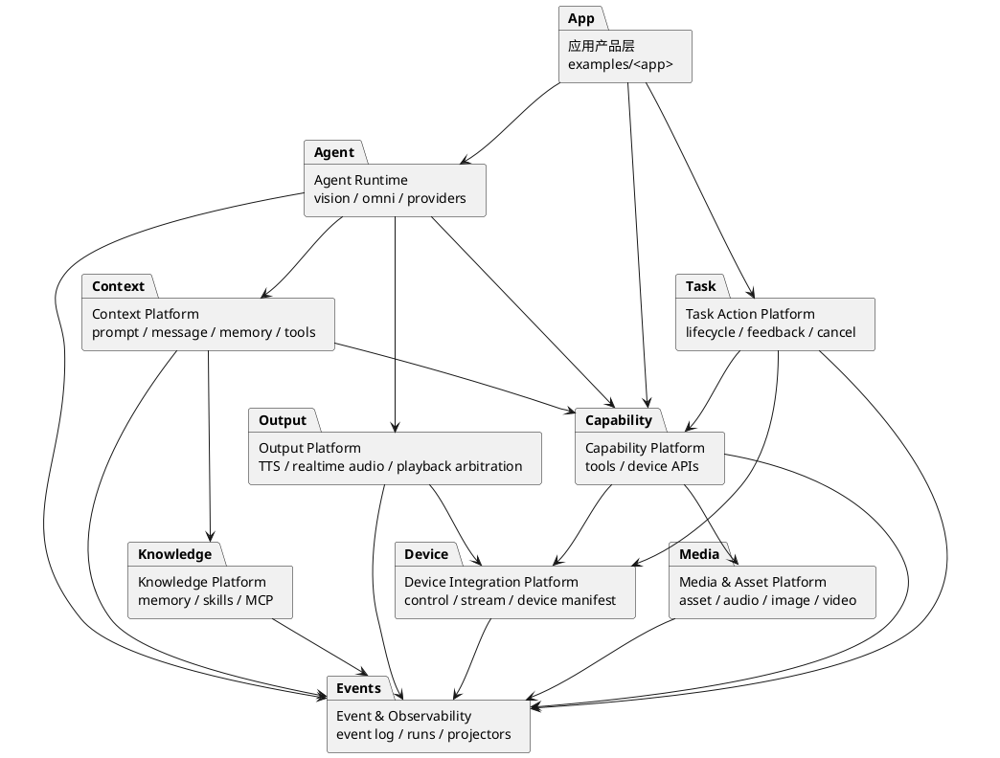

# 问题边界与模块拆分建议

## 背景

当前项目同时在解决语音交互、多设备协议、实时数据流、Agent 上下文、工具调用、长程任务、输出播放、记忆、Skill/MCP、运行产物观测等问题。它们都合理，但如果没有清晰边界，就会继续把所有代码揉进 Agent Core 或示例应用里，最终导致：

- Agent Core 同时承担模型编排、上下文拼接、设备能力选择、业务策略、工具桥接、输出播放和异常恢复。
- 设备协议、任务协议、工具协议和模型上下文互相泄漏。
- 示例应用的业务逻辑容易反向进入 SDK 核心包。
- 后续要做插件市场、设备生态、Task/Skill 扩展时，缺少稳定的开发者入口。

这份文档先定义问题边界，再定义模块拆分方向。后续重构应优先遵守这些边界，而不是先按文件大小机械拆分。

## 总体原则

1. **SDK 核心只提供通用平台能力**：设备协议、数据流、资产、上下文、工具/任务运行时、输出仲裁、观测能力可以在 `realtime_agent`；具体业务工具和任务留在应用目录。
2. **模型只能看到经过编译的上下文**：系统提示、历史消息、记忆、工具描述、Skill 文档、任务状态都应通过 Context 层进入模型请求。
3. **设备只理解协议和能力，不理解 Agent Core**：端侧只处理注册、能力声明、控制事件、数据流和输出播放，不依赖模型实现。
4. **Task 是长程 Action，不是 Agent Core 内部函数**：Task 需要标准生命周期、可取消、可观测、可恢复，而不是一段被工具临时启动的业务代码。
5. **输出播放只有一个仲裁入口**：模型音频、TTS、工具反馈、任务通知都进入 Output 层，由 Output 层决定是否播放、排队或打断。
6. **运行产物是第一等接口**：调试、回放、开发者控制台和自动化测试都应基于结构化事件和产物，而不是解析终端日志。

## 建议的问题边界

| 问题边界 | 解决的问题 | 当前相关模块 | 应拆出的稳定模块 |
| --- | --- | --- | --- |
| 应用产品边界 | 具体用户场景、业务工具、业务 Task、默认配置 | `examples/device_demo/agent-server` | `app packages` |
| 设备集成边界 | 设备注册、能力声明、控制事件、端侧命令、数据流协议 | `control`、`stream`、`spec`、设备示例 | `device integration platform` |
| 事件与状态边界 | 事件记录、状态投影、跨模块通知、可回放调试 | `runs`、`control-events.jsonl`、`task-signals`、`agent-events` | `event bus + event log + projectors` |
| 媒体与资产边界 | 音频、图片、视频、深度图、数据流生命周期、资产引用 | `stream`、`asset`、`audio_pipeline` | `media/asset platform` |
| Agent 运行边界 | Vision Realtime / Omni Realtime 编排、模型 provider、工具调用循环、流式输出 | `agent_core` | `agent runtime` |
| 上下文边界 | prompt、message、memory、tool schema、Skill 文档、预算裁剪 | `agent_core/context`、`prompts`、`memory`、`skills`、`mcp` | `context platform` |
| 能力工具边界 | 短动作能力、工具注册、参数 schema、调用结果 | `tools.py`、`ToolGateway`、应用 `capabilities/tools.py` | `capability/tool platform` |
| 长程任务边界 | 后台任务、状态机、反馈、取消、恢复、任务产物 | `tasks.py`、`task_store`、应用 `capabilities/tasks.py` | `task/action platform` |
| 输出仲裁边界 | TTS、实时音频、工具语音反馈、任务通知、播放队列和打断 | `output`、端侧 speaker/actuator | `output platform` |
| 记忆与知识边界 | 长期记忆、会话摘要、Skill 文档、MCP 外部能力 | `memory`、`skills`、`mcp` | `knowledge platform` |
| 开发者体验边界 | manifest、校验、预检、运行产物查看、插件发布 | `cli`、`spec`、`docs`、`runs` | `developer platform` |

## 模块依赖方向

依赖应单向流动：应用层依赖平台能力，Agent Runtime 依赖上下文和能力平台，设备平台不反向依赖 Agent。

## 各边界的拆分规则

### 1. 应用产品层

| 项目 | 规则 |
| --- | --- |
| 负责 | 用户场景、业务策略、业务工具、业务 Task、应用默认 prompt、应用配置 |
| 允许依赖 | SDK 公开 API、工具/任务基类、上下文 API |
| 禁止依赖 | SDK 内部 WebSocket、Agent Core 私有类、运行时内部服务对象 |
| 当前风险 | `external-business-app` 的业务意图容易通过 fallback、特殊工具名或 prompt 规则进入核心包 |
| 拆分目标 | 应用可以像插件一样安装/卸载，SDK 不知道“找东西”“红绿灯”“路线规划”等业务概念 |

### 2. 设备集成边界

| 项目 | 规则 |
| --- | --- |
| 负责 | 设备注册、能力声明、控制事件、命令生命周期、数据流打开/关闭 |
| 允许依赖 | schema、control、stream、asset 引用 |
| 禁止依赖 | Agent Core、具体模型 provider、业务 Task 实现 |
| 当前风险 | 设备能力、工具能力和业务需求容易混在一起，开发者不知道自己该实现协议还是实现业务逻辑 |
| 拆分目标 | 形成 Device Capability Manifest + 可选 Integration Adapter；ESP32 等端侧只实现协议，不加载 Python 插件 |

### 3. 事件与状态边界

| 项目 | 规则 |
| --- | --- |
| 负责 | 写入事件、投影状态、支持回放、支持开发者查看 |
| 允许依赖 | 所有模块都可以写事件；状态投影只读事件 |
| 禁止依赖 | 业务模块直接解析其他模块的私有内存状态 |
| 当前风险 | 已有 `control-events.jsonl`、`agent-events`、`task-signals`，但事件类型和状态投影还没有成为统一架构中心 |
| 拆分目标 | 关键状态来自事件投影，而不是跨模块对象引用；后台 reactor 可以订阅事件触发动作 |

### 4. Agent 运行边界

| 项目 | 规则 |
| --- | --- |
| 负责 | 模型会话、provider 适配、工具调用循环、流式 delta、错误收敛 |
| 允许依赖 | Context Platform、Capability Platform、Output Platform、Event Platform |
| 禁止依赖 | 应用业务工具名、具体端侧设备对象、prompt 字符串散落拼接 |
| 当前风险 | Realtime Agent 仍承担过多职责，容易继续膨胀 |
| 拆分目标 | Agent Runtime 只消费 `ModelContext` 和工具执行接口，不关心上下文来源和业务语义 |

### 5. 上下文边界

| 项目 | 规则 |
| --- | --- |
| 负责 | prompt 注册、message 编译、记忆注入、工具 schema 选择、token/长度预算、上下文产物记录 |
| 允许依赖 | memory、skills、mcp、tool schema、conversation history |
| 禁止依赖 | 执行业务工具、直接操作设备、直接播放输出 |
| 当前风险 | 系统提示、工具规则、记忆规则、child agent prompt 和 follow-up prompt 容易再次分散 |
| 拆分目标 | 所有模型可见内容都由 ContextCompiler 生成，并记录 context source map |

### 6. 能力工具边界

| 项目 | 规则 |
| --- | --- |
| 负责 | 短生命周期动作、参数校验、结果结构、工具事件 |
| 允许依赖 | ToolContext、Device API、Asset API、Output API |
| 禁止依赖 | Agent Core 私有消息结构、provider SDK 对象、长程后台状态机 |
| 当前风险 | 工具既可能是瞬时动作，也可能偷偷启动后台流程，语义不清 |
| 拆分目标 | 工具只做短动作；需要持续状态的能力迁到 Task Action Platform |

### 7. Task Action 边界

| 项目 | 规则 |
| --- | --- |
| 负责 | 长程任务、状态机、反馈、取消、恢复、任务产物、任务事件 |
| 允许依赖 | TaskContext、Capability Platform、Device Platform、Event Platform |
| 禁止依赖 | Agent Core 循环内部状态、provider message 格式 |
| 当前风险 | 当前叫 Task，但外部契约还不够像 Action，缺少统一 goal/feedback/result/cancel 语义 |
| 拆分目标 | 保留 Task 命名，但补齐 action-style 生命周期：accepted、running、feedback、succeeded、failed、canceled |

### 8. 输出仲裁边界

| 项目 | 规则 |
| --- | --- |
| 负责 | TTS、实时音频 delta、任务通知、播放队列、打断、端侧 actuator/speaker 投递 |
| 允许依赖 | Device Platform、Event Platform、TTS provider |
| 禁止依赖 | 业务工具内部直接操作 speaker 或绕过输出仲裁 |
| 当前风险 | 模型回复、工具反馈、Task 通知和端侧播放回执分散时，容易互相打断或覆盖 |
| 拆分目标 | 所有可听输出都先进入 Output Platform，再由策略决定播放行为 |

### 9. 开发者体验边界

| 项目 | 规则 |
| --- | --- |
| 负责 | manifest、schema 校验、预检、运行产物查看、插件安装/发布、示例生成 |
| 允许依赖 | schema、event log、context source map、capability registry |
| 禁止依赖 | 只靠 README 约定关键协议，不提供机器可校验入口 |
| 当前风险 | 开发者需要同时理解设备协议、工具 API、Task API、prompt 和运行产物，门槛过高 |
| 拆分目标 | 让设备开发者、业务工具开发者、Task 开发者、Skill/MCP 开发者各自面对一套窄接口 |

## 优先重构顺序

| 阶段 | 目标 | 主要收益 |
| --- | --- | --- |
| P0 | 明确边界规则，禁止新增业务逻辑进入 SDK Core | 阻止耦合继续扩散 |
| P1 | 让 Vision/Omni Agent 都通过 ContextCompiler 构造模型请求 | 收口所有模型可见内容 |
| P2 | 拆分 Omni Agent：provider adapter、tool bridge、output adapter、session state、visual context | 降低 Agent Core 文件复杂度 |
| P3 | 抽象 Capability Registry：设备能力、工具能力、Task 能力统一登记但不混同 | 支撑插件和开发者控制台 |
| P4 | 将 Task 升级为 action-style 生命周期契约 | 支撑长程后台任务、取消、恢复、观测 |
| P5 | 建立统一 event bus / event type / state projector | 支撑 reactive agent、自动化、回放调试 |
| P6 | 建立开发者平台：manifest 校验、包结构、运行产物 UI、插件发布流程 | 支撑生态化扩展 |

## 需要立即执行的硬约束

1. `realtime_agent` SDK 核心包不能新增应用业务 Task fallback。
2. Agent Core 不能直接拼接散落 prompt，必须逐步迁入 `prompts` 和 ContextCompiler。
3. 工具和 Task 不能直接操作 WebSocket、设备连接对象或 provider SDK 对象。
4. 端侧参考工程不能依赖 Agent Core 内部类或 prompt 语义。
5. 新协议必须同步 schema、文档、参考端和测试。
6. 新增运行时状态必须同时考虑事件记录和调试查看方式。

## 结论

这个项目不应该简单拆成“更多文件”，而应该拆成几类稳定问题平台：

- Device Integration Platform 解决设备接入。
- Context Platform 解决模型看见什么。
- Agent Runtime 解决模型如何运行。
- Capability/Tool Platform 解决短动作能力。
- Task Action Platform 解决长程后台任务。
- Output Platform 解决所有可听/可见输出仲裁。
- Event & Observability Platform 解决状态、回放和调试。
- Developer Platform 解决第三方开发者如何扩展。

后续每次重构都应先回答：这次改动属于哪个问题边界？它是否跨越了不该跨越的依赖方向？如果答案不清楚，应该先补边界设计，再动实现。
