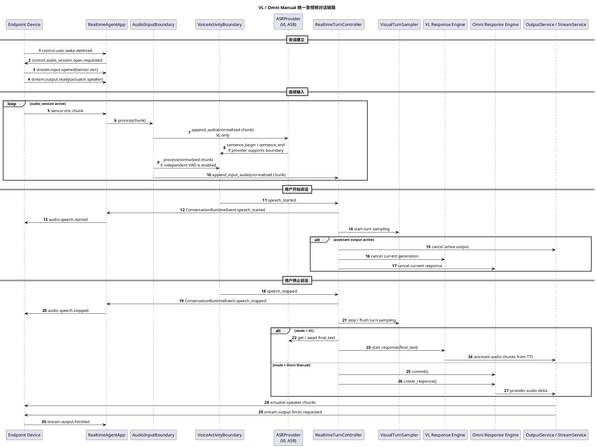

# 音视频对话统一链路设计

## 目标

本文定义 `realtime-agent` 当前和后续重构中的音视频对话统一逻辑框架，用一套输入边界、输出仲裁、视觉采样和端侧会话模型承载 VL 链路与 Omni 链路。

本文替代以下旧文档中的重复或过期内容：

- `实时音频Pipeline设计.md`
- `Vision实时语音链路设计.md`
- `Vision实时服务器侧标准.md`
- `端侧音频会话标准.md`
- `Vision实时Pipeline内部时序.puml`
- `Omni实时Pipeline内部时序.puml`
- `实时Pipeline外部契约时序.puml`
- `实时Pipeline组件边界图.puml`
- `Vision实时端侧音频时序.puml`

Vision 图片、视频资产如何拼入模型请求的细节仍以 [Vision图片视频输入设计.md](Vision图片视频输入设计.md) 为准。本文只约束音视频对话主链路和可复用边界。

## 当前实现结论

当前代码已经落地统一 conversation runtime；`legacy` 分支作为回退路径保留，不再作为推荐音视频主链路。

已落地部分：

1. `agent.conversation.runtime=conversation` 时，`RealtimeAgentApp` 会通过 `build_conversation_runtime()` 创建 Omni 或 VL conversation runtime。
2. `ConversationRuntimeEventEmitter` 已经把两条链路的 `speech_started`、`speech_stopped`、`output_cancel_requested` 等事件收敛成统一 runtime 事件。
3. `ConversationOutputController` 已经包装 `OutputService` 的下行绑定、暂停、恢复、取消和关闭语义。
4. `AudioPipeline` 是 app 外层共享的 `AudioInputBoundary` 实现，负责音频格式校验、重采样和质量诊断；conversation runtime 内部的 turn 边界由 `SpeechInputBoundary` 适配。
5. Vision / VL 链路当前主要依赖 Paraformer 这类 ASR/VAD 合一 provider：同一个实时 ASR 事件里既有转写文本，也有 `sentence_begin` / `sentence_end` 边界字段。
6. VL conversation runtime 已经用 `AsrSpeechInputBoundary` 将 ASR partial、sentence begin、sentence end/final 映射为 `SpeechInputDelta`。
7. Omni conversation runtime 已经支持 Manual 模式，服务器侧 `VoiceActivityBoundary` 负责 speech boundary，provider 不再负责 turn detection。
8. Omni Manual 和 VL conversation runtime 均通过 `RealtimeTurnController` 与 `OutputInterruptionController` 共享 turn 事件和打断判断。
9. `AgentOutputRouter` 已支持设计文档中的 `text/audio/control/task_signal` 四类输出，并保留旧 kind 兼容。

兼容边界：

1. `agent.conversation.runtime=legacy` 仍会进入 `LegacyAgentCoreRouter` 和旧 `VisionRealtimePipeline` / `OmniRealtimePipeline`，这些文件只作为回退路径保留。
2. `realtime_pipeline/*` 与旧 `RealtimeAudioNormalizer` 保留为 legacy-only 兼容文件，不作为 conversation runtime 的依赖。
3. app 层保留 `_handle_pipeline_event()` 作为旧入口兼容包装，conversation runtime 已绑定到 `_handle_runtime_control_event()`。
4. Qwen/DashScope realtime provider adapter 内部协议事件解析保留在 provider adapter 中，属于 provider adapter 职责；AgentLoop 负责 provider callbacks、工具回填、输出接入和 turn 收尾控制。

## 统一逻辑框架

两条链路统一为以下框架：

```text
Endpoint mic PCM
  -> AudioInputBoundary
  -> VoiceActivityBoundary
  -> RealtimeTurnController
  -> Chain-specific Response Engine
  -> OutputService / StreamService
  -> Endpoint speaker
```

核心原则：

1. 端侧只负责唤醒、采集、上传、播放和执行服务器事件。
2. 服务器负责连续对话阶段的语音边界、turn 提交、视觉采样、响应生成和打断决策。
3. `VoiceActivityBoundary` 只输出 `speech_started` 和 `speech_stopped`，不做打断、不做视觉采样、不提交模型。
4. VL 和 Omni 共用语音边界、端侧事件和输出仲裁；只在响应生成方式上保留差异。
5. 一段输出完成使用 `stream.output.finish.requested`，不等价于关闭下行长连接。

## 组件职责

| 组件 | 职责 | 是否共享 |
| --- | --- | --- |
| `RealtimeAgentApp` | 应用编排入口，连接控制事件、数据流、Agent Core、输出服务和运行产物。 | 共享 |
| `AudioInputBoundary` | 上行音频格式校验、重采样、音量诊断和输入分片处理。当前实现对应 app 外层 `AudioPipeline`。 | 共享 |
| `VoiceActivityBoundary` | 输出 `speech_started` / `speech_stopped`。事件可以来自独立 VAD detector，也可以来自 ASR/VAD 合一 provider 的句子边界。 | 共享 |
| `ASRProvider` | 输出实时 ASR 文本增量、final_text 和可选句子边界。当前 VL 主要对应 Paraformer realtime。 | VL 专属为主，Omni provider 内置 |
| `RealtimeTurnController` | 消费 speech 事件，发布端侧控制事件，启停视觉采样，判断是否需要打断，并把 turn 边界交给具体链路。 | 共享骨架，链路分支 |
| `OutputInterruptionController` | 统一判断 speech started 是否需要取消当前输出。第一版已经集中活跃 output stream 和 `thinking/speaking/tool_running` 状态判断；实际 provider cancel 和 output stream cancel 仍通过 app runtime event 调用链路专属 `interrupt()`。 | 共享 |
| `VisualTurnSampler` | 在用户语音 turn 内请求 RGB 帧，保证视觉资产与本轮语音绑定。当前 Vision 和 Omni 各自实现。 | 共享目标 |
| `VlResponseEngine` | ASR final_text -> VL 模型 -> Streaming TTS。 | VL 专属 |
| `OmniResponseEngine` | Omni provider buffer -> `commit()` -> `create_response()` -> provider 原生音频输出。 | Omni 专属 |

## VoiceActivityBoundary

`VoiceActivityBoundary` 是后续重构中最重要的共享输入边界组件。

输入可以有两种来源：

1. 连续 `sensor.mic` PCM chunk，由独立 VAD detector 判断语音边界。
2. ASR/VAD 合一 provider 的结构化 ASR event，例如 Paraformer 的 `sentence_begin` / `sentence_end`。

无论来源是哪一种，下游只看到统一 speech 事件。

输出只允许两类事件：

| 事件 | 语义 |
| --- | --- |
| `speech_started` | 服务器判断用户开始说话。 |
| `speech_stopped` | 服务器判断用户停止说话，本轮输入可以进入提交阶段。 |

内部可以维护：

1. 当前是否处于语音段。
2. 起始 RMS / 语音置信度。
3. 最短有效语音时长。
4. 静音确认窗口。
5. speech start / stop 去重。
6. 前置和尾部音频统计。

内部不允许处理：

1. 是否打断助手输出。
2. 是否采集图片。
3. 是否调用 `commit()` / `create_response()`。
4. 是否启动 VL 模型或 TTS。
5. 是否关闭 audio session。

第一阶段有两个可复用来源：

1. VL 当前路径：把 Paraformer `sentence_begin` / `sentence_end` 适配成 `VoiceActivityBoundary` 事件。
2. Omni Manual 目标路径：先复用当前 `ServerVadProcessor` 的 RMS + 静音窗口逻辑，组件命名和接口按 `VoiceActivityBoundary` 收敛。

后续替换 WebRTC VAD 或 Silero VAD 时，不应影响下游 Turn Controller。

## RealtimeTurnController

`RealtimeTurnController` 负责把语音边界事件转成链路行为。

收到 `speech_started`：

1. 发布统一 conversation runtime `speech_started`。
2. 由 `RealtimeAgentApp` 下发 `audio.speech.started` 给端侧。
3. 启动本轮视觉采样。
4. 检查当前是否有正在生成或播放的助手输出。
5. 如需打断，调用输出打断控制逻辑。

收到 `speech_stopped`：

1. 发布统一 conversation runtime `speech_stopped`。
2. 由 `RealtimeAgentApp` 下发 `audio.speech.stopped` 给端侧。
3. 停止或等待本轮视觉采样收尾。
4. 将本轮输入提交给具体链路：
   - VL：消费 `ASRProvider` 已产生或提交后产生的 final_text，再请求 VL 模型。
   - Omni Manual：调用 provider `commit()`，随后调用 `create_response()`。

`RealtimeTurnController` 可以有共享骨架，但提交阶段必须由链路专属 consumer 实现。

## VL 链路

VL 链路是级联链路：

```text
sensor.mic
  -> AudioInputBoundary
  -> ASRProvider(ASR + optional sentence boundary)
       -> VoiceActivityBoundary(speech_started / speech_stopped)
       -> final_text
  -> VL model
  -> Streaming TTS
  -> actuator.speaker
```

当前实现中，Vision / VL 链路使用 `AsrPipeline` 和 `DashScopeAsrProviderAdapter` 获取 ASR 文本。Paraformer realtime 返回的 `TranscriptEvent` 是现有代码里的 provider 事件类名，它同时包含文本和句子边界，因此当前 VL 不存在一个独立的 VAD 模型；设计抽象层不再使用 transcript 命名。

VL 中 `VoiceActivityBoundary` 与 ASR 文本的关系：

1. `ASRProvider` 持续接收音频，输出 partial ASR text、final_text 和可选句子边界。
2. 当前 Paraformer 路径中，`sentence_begin` 被适配为 `speech_started`，`sentence_end` 被适配为 `speech_stopped`。
3. 如果未来 VL 改用不带边界的 ASR provider，才需要并行接入独立 VAD detector。
4. ASR partial 不应作为主要 VAD 逻辑；它只能作为诊断或补充信号。

VL turn 提交流程：

```text
speech_stopped
  -> stop visual sampler
  -> get / await final_text
  -> append user message
  -> flush turn visual assets into model messages
  -> stream VL model
  -> stream TTS
  -> OutputService
```

## Omni 链路

Omni 链路保留两种模式。

### Provider VAD 模式

当前实现属于该模式：

```text
sensor.mic
  -> AudioInputBoundary
  -> Omni provider turn_detection
  -> provider speech_started / speech_stopped
  -> provider 自动 commit / response
  -> provider audio delta
  -> actuator.speaker
```

该模式仍可保留为兼容和对照路径，但不再作为后续优化主路径。

### Manual 模式

Manual 模式是后续优化主路径：

```text
sensor.mic
  -> AudioInputBoundary
  -> VoiceActivityBoundary
  -> Omni provider append_audio / append_video
  -> speech_stopped
  -> commit()
  -> create_response()
  -> provider audio delta
  -> actuator.speaker
```

Manual 模式要求：

1. `agent.omni.turn_detection` 支持 `manual`。
2. DashScope session update 使用 `enable_turn_detection=False`。
3. 音频 chunk 仍持续 append 到 provider input buffer。
4. 视觉帧仍按语音 turn 追加到 provider buffer。
5. `speech_stopped` 后先确保本轮音频和视觉帧已进入 provider buffer，再调用 `commit()`。
6. `commit()` 后显式调用 `create_response()`。
7. provider 不再负责输出 `speech_started` / `speech_stopped`，相关端侧事件由 `VoiceActivityBoundary` 统一产生。

Omni Manual turn 提交流程：

```text
speech_stopped
  -> stop / flush visual sampler
  -> provider.commit()
  -> provider.create_response()
  -> provider response.audio.delta
  -> OutputService
```

需要额外核对的分支：

1. `capture_photo` 工具回填后，如果需要继续让 Omni 基于新图片回答，Manual 模式下也必须显式 `create_response()`。
2. 打断时要取消当前 provider response，并丢弃旧 response key 的后续 delta。
3. 视觉采样不能再绑定 provider speech 事件，而要绑定统一 speech 事件。

## 视觉采样

视觉采样属于 turn controller 的下游动作，不属于 VAD。

统一策略：

1. `speech_started` 后启动当前 turn 的视觉采样。
2. 采样只绑定当前 `user_id`、`session_id` 和 `stream_id`。
3. `speech_stopped` 后停止采样，并按链路要求 flush。
4. 空闲阶段不持续把图片送给模型。
5. 历史图片不能默认代表当前画面。

VL 与 Omni 差异：

| 链路 | 视觉资产进入模型的方式 |
| --- | --- |
| VL | 先进入 turn photo buffer，再由 `VlVisualAppender` 在模型请求前拼入 message content block。 |
| Omni Manual | 图片可在 turn 内通过 provider `append_video()` 追加到当前 realtime buffer，提交时随音频一起进入 response。 |

图片和视频 message 拼接策略见 [Vision图片视频输入设计.md](Vision图片视频输入设计.md)。

## 输出和打断

打断不是 VAD 的职责。打断是当前系统状态、输出状态和用户语音事件共同决定的控制策略。

统一打断语义：

1. 新的 `speech_started` 到达。
2. Turn Controller 检查当前是否处于 `thinking`、`speaking`、`tool_running`，或是否存在 active output stream。
3. 如果可打断，调用 `OutputInterruptionController` 发布 `output_cancel_requested`。
4. App / Output 层取消当前 output stream。
5. 链路专属 response engine 取消当前模型或 provider response。
6. 旧 generation / response key 的后续回调直接丢弃，不记录为失败，也不播放错误兜底音频。

VL 与 Omni 差异：

| 链路 | 取消对象 |
| --- | --- |
| VL | 取消当前 VL generation、TTS 输出和 output stream。 |
| Omni | 取消当前 provider response、output stream，并忽略旧 response key 的 provider delta。 |

## 端侧会话边界

端侧不关心 VL / Omni 差异。

端侧负责：

1. 本地唤醒。
2. 唤醒后建立控制连接、上行麦克风 stream、下行 speaker stream。
3. 持续上传麦克风音频，直到服务器关闭会话。
4. 维护下行播放 buffer。
5. 执行服务器下发的 `audio.speech.started`、`audio.speech.stopped`、`stream.output.cancel.requested`、`stream.output.finish.requested` 和 audio session close 事件。

端侧不负责：

1. 连续对话阶段 VAD。
2. turn boundary 判断。
3. 模型输入提交。
4. 是否打断当前输出的最终决策。
5. 是否关闭 audio session 的最终决策。

## 统一时序



## 配置建议

后续配置应表达两层含义：

```yaml
audio_pipeline:
  vad: "voice_activity_boundary"
  vad_provider: "paraformer_boundary"  # or rms / webrtc / silero
  vad_rms_threshold: 96
  vad_silence_timeout_ms: 600

agent:
  mode: "omni"
  omni:
    turn_detection: "manual"
```

语义要求：

1. `audio_pipeline.vad` 表示服务器是否启用统一语音边界。
2. `vad_provider` 表示边界来源或算法实现；VL 当前可以是 `paraformer_boundary`，Omni Manual 首版可以是 `rms`。
3. `agent.omni.turn_detection=manual` 表示百炼 Omni provider 关闭 turn detection，由服务器显式提交。
4. `agent.omni.turn_detection=semantic_vad` / `server_vad` 表示继续使用 provider VAD 兼容路径。

具体 YAML 字段可以在实现阶段按现有配置结构微调，但文档和代码必须保持这四条语义。

## 迁移计划

### Phase 1：文档和边界收敛

1. 以本文作为音视频对话链路唯一内部入口。
2. 旧的重复文档和旧时序图移动到 `agent-server/docs/deprecated/`。
3. 明确 `VoiceActivityBoundary` 只输出 `speech_started` / `speech_stopped`。

### Phase 2：统一输入边界组件

1. 抽出 `VoiceActivityBoundary` 接口。
2. 为 VL 提供 `paraformer_boundary` 适配器，把 ASR/VAD 合一事件转换成统一 speech 事件。
3. 为 Omni Manual 提供 `rms` 默认 detector，可由当前 `ServerVadProcessor` 演进而来。
4. 补充最短语音时长、静音确认窗口和事件去重。
5. 让 VL 和 Omni Manual 都消费同一套 speech 事件。

### Phase 3：Omni Manual

1. 支持 `agent.omni.turn_detection=manual`。
2. `QwenOmniRealtimeAdapter` 在 Manual 模式下设置 `enable_turn_detection=False`。
3. `speech_stopped` 后执行 `commit()` + `create_response()`。
4. 视觉采样从 provider speech event 迁移到统一 speech event。
5. 工具回填分支补齐 Manual 模式下的显式 response 创建。

### Phase 4：输出打断控制收敛

1. 把 `speech_started -> output_cancel_requested` 从具体 pipeline bridge 中抽出。
2. 建立统一打断控制入口。
3. 保留 VL generation 和 Omni response key 的链路专属丢弃逻辑。

### Phase 5：消除重复音频处理

1. 在 `AudioPipeline` 和 `RealtimeAudioNormalizer` 之间选择唯一热路径。
2. 避免同一音频 chunk 被重复格式校验和重采样。
3. 更新 preflight，让报告能准确说明当前 VAD/Boundary 模式。

## 验收口径

文档和实现落地后，至少需要验证：

1. VL 和 Omni Manual 均由同一 `VoiceActivityBoundary` 接口产出 `speech_started` / `speech_stopped`，但事件来源可以不同。
2. `VoiceActivityBoundary` 不输出打断事件。
3. Omni Manual 在 `speech_stopped` 后确实调用 `commit()` 和 `create_response()`。
4. VL 在 `speech_stopped` 后能获得 final_text 并触发 VL model + TTS。
5. 两条链路都能在 `speech_started` 时触发统一端侧 `audio.speech.started`。
6. 两条链路都能在助手输出期间被新语音打断。
7. 视觉采样只绑定当前语音 turn。
8. 一段输出完成仍通过 `stream.output.finish.requested`，端侧等待 `output_last_seq` 后 drain。
9. runs 产物能复盘 VAD 边界、turn 提交、视觉帧、模型响应和输出 finish。
