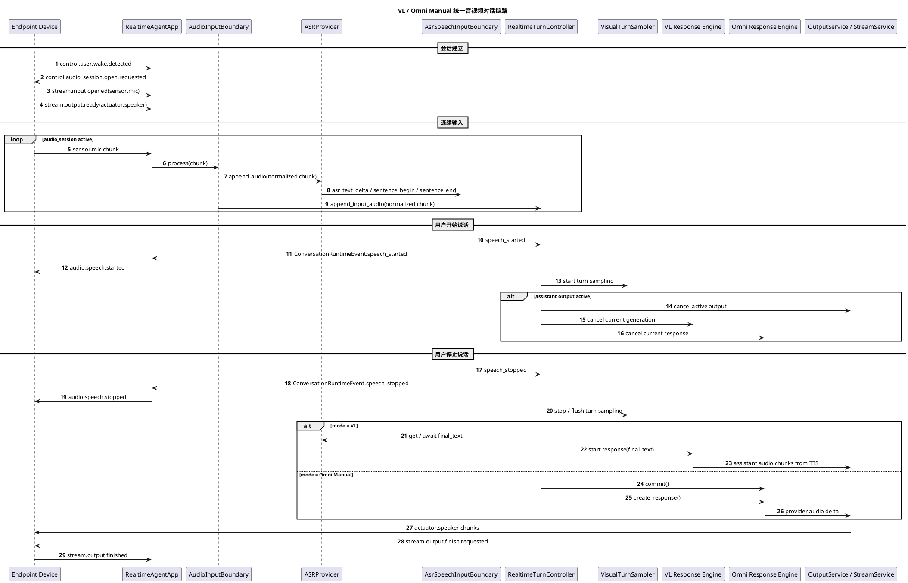

# 音视频对话统一链路设计

## 目标

本文定义 `realtime-agent` 当前和后续重构中的音视频对话统一逻辑框架，用一套输入边界、输出仲裁、视觉采样和端侧会话模型承载 VL 链路与 Omni 链路。

本文替代以下旧文档中的重复或过期内容：

- `实时音频Pipeline设计.md`
- `Vision实时语音链路设计.md`
- `Vision实时服务器侧标准.md`
- `端侧音频会话标准.md`
- `Vision实时Pipeline内部时序.puml`
- `Omni实时Pipeline内部时序.puml`
- `实时Pipeline外部契约时序.puml`
- `实时Pipeline组件边界图.puml`
- `Vision实时端侧音频时序.puml`

Vision 图片、视频资产如何拼入模型请求的细节仍以 [Vision图片视频输入设计.md](Vision图片视频输入设计.md) 为准。本文只约束音视频对话主链路和可复用边界。

## 当前实现结论

当前代码已经落地统一 conversation runtime，并已经成为 `RealtimeAgentApp`
的正式音视频入口；历史 `legacy` runtime 配置只作为配置兼容字段保留，
不会再让 app 回退到旧 `AgentCoreRouter`。

已落地部分：

1. `RealtimeAgentApp` 始终通过 `build_conversation_runtime()` 创建 Omni 或 VL conversation runtime；`agent.conversation.runtime` 中的历史值不会改变正式装配路径。
2. `ConversationRuntimeEventEmitter` 已经把两条链路的 `speech_started`、`speech_stopped`、`output_cancel_requested` 等事件收敛成统一 runtime 事件。
3. `ConversationOutputController` 已经包装 `OutputService` 的下行绑定、暂停、恢复、取消和关闭语义。
4. `AudioPipeline` 是 app 外层共享的 `AudioInputBoundary` 实现，负责音频格式校验、重采样和质量诊断；conversation runtime 内部的 turn 边界由 `SpeechInputBoundary` 适配。
5. Vision / VL conversation runtime 仍依赖 Paraformer 这类 ASR/VAD 合一 provider：同一个实时 ASR 事件里既有转写文本，也有 `sentence_begin` / `sentence_end` 边界字段。
6. Omni Manual conversation runtime 使用本地 `SileroSpeechInputBoundary`：Silero ONNX VAD 产生 `turn_started` / `turn_ended`，`speech_started` 前只缓存短 pre-roll，`speech_started` 后才向 Omni provider append 音频和视觉帧。
7. Omni conversation runtime 只支持 Manual 模式，Omni provider `turn_detection` 固定为 `manual`；speech boundary 由本地 Silero VAD 产生，不再依赖 ASR 句边界，也不再保留 RMS VAD 版 Omni 链路。
8. Omni Manual 和 VL conversation runtime 均通过 `RealtimeTurnController` 与 `OutputInterruptionController` 共享 turn 事件和打断判断。
9. `AgentOutputRouter` 已支持设计文档中的 `text/audio/control/task_signal` 四类输出，并保留旧 kind 兼容。
10. provider 适配器已经通过 `conversation.providers` 暴露正式导入面；ASR / VLM
    provider adapter 实现已迁到 `conversation/providers/model_adapters.py`，
    旧 `agent_core/providers.py` 只保留历史导入 shim。
11. conversation ASR 输入层已使用 `AsrProviderSessionPool` 管理实时 ASR 会话，
    不再依赖旧 `VisionRealtimeAgentCore` 内的 `AsrPipeline`。
12. 旧 `agent_core/router.py` 与 `realtime_pipeline/` 已删除，旧链路不再作为
    代码兼容路径保留。
13. `VisionRealtimeAgentCore` / `OmniRealtimeAgentCore` 的实现宿主已迁到
    `conversation/core/vision_host.py` 和 `conversation/core/omni_host.py`；
    `agent_core/vision.py` 与 `agent_core/omni.py` 只保留历史导入 shim。

兼容边界：

1. app 层保留 `_handle_pipeline_event()` 作为旧事件形态兼容包装，
   conversation runtime 已绑定到 `_handle_runtime_control_event()`。
2. Qwen/DashScope realtime provider adapter 内部协议事件解析保留在 provider adapter 中，属于 provider adapter 职责；AgentLoop 负责 provider callbacks、工具回填、输出接入和 turn 收尾控制。

## 统一逻辑框架

两条链路统一为以下框架：

```text
Endpoint mic PCM
  -> AudioInputBoundary
  -> SpeechInputBoundary
     -> Omni: SileroSpeechInputBoundary
     -> VL: AsrSpeechInputBoundary
  -> RealtimeTurnController
  -> Chain-specific Response Engine
  -> OutputService / StreamService
  -> Endpoint speaker
```

核心原则：

1. 端侧只负责唤醒、采集、上传、播放和执行服务器事件。
2. 服务器负责连续对话阶段的语音边界、turn 提交、视觉采样、响应生成和打断决策。
3. Speech boundary 只输出 turn 边界和链路需要的输入增量，不做打断、不做视觉采样、不提交模型；ASR 文本只由 VL 的 `AsrSpeechInputBoundary` 以 `asr_text_delta/final_text` 输出。
4. VL 和 Omni 共用端侧 speech 事件、视觉 turn 回调和输出仲裁；语音边界来源可以按链路不同选择。
5. 一段输出完成使用 `stream.output.finish.requested`，不等价于关闭下行长连接。

## 组件职责

| 组件 | 职责 | 是否共享 |
| --- | --- | --- |
| `RealtimeAgentApp` | 应用编排入口，连接控制事件、数据流、Agent Core、输出服务和运行产物。 | 共享 |
| `AudioInputBoundary` | 上行音频格式校验、重采样、音量诊断和输入分片处理。当前正式入口是 `conversation.input.RuntimeAudioInputBoundary`，底层复用 `AudioPipeline` 的规范化实现。 | 共享 |
| `AsrSpeechInputBoundary` | 包装实时 ASR provider，输出 `audio_chunk`、`asr_text_delta`、`turn_started`、`turn_ended(final_text)`。当前用于 VL。 | VL |
| `SileroSpeechInputBoundary` | 使用 Silero ONNX VAD 输出 `turn_started` / `turn_ended`，start 前缓存短 pre-roll，start 后才输出 `audio_chunk` 给 Omni。 | Omni Manual |
| `ASRProvider` | 输出实时 ASR 文本增量、final_text 和句子边界。当前作为 VL 输入边界来源。 | VL |
| `RealtimeTurnController` | 消费 speech 事件，发布端侧控制事件，启停视觉采样，判断是否需要打断，并把 turn 边界交给具体链路。 | 共享骨架，链路分支 |
| `OutputInterruptionController` | 统一判断 speech started 是否需要取消当前输出。第一版已经集中活跃 output stream 和 `thinking/speaking/tool_running` 状态判断；实际 provider cancel 和 output stream cancel 仍通过 app runtime event 调用链路专属 `interrupt()`。 | 共享 |
| `VisualTurnSampler` | 在用户语音 turn 内请求 RGB 帧，保证视觉资产与本轮语音绑定。当前 Vision 和 Omni 各自实现。 | 共享目标 |
| `VlResponseEngine` | ASR final_text -> VL 模型 -> Streaming TTS。 | VL 专属 |
| `OmniResponseEngine` | Omni provider buffer -> `commit()` -> `create_response()` -> provider 原生音频输出。 | Omni 专属 |

## ASR-backed SpeechInputBoundary

`AsrSpeechInputBoundary` 是当前 VL conversation runtime 的输入边界组件。

输入来源：

1. 连续 `sensor.mic` PCM chunk。
2. ASR/VAD 合一 provider 的结构化 ASR event，例如 Paraformer 的 `sentence_begin` / `sentence_end`。

下游看到统一 `SpeechInputDelta`。

输出只允许两类事件：

| 事件 | 语义 |
| --- | --- |
| `speech_started` | 服务器判断用户开始说话。 |
| `speech_stopped` | 服务器判断用户停止说话，本轮输入可以进入提交阶段。 |

ASR 句边界适配器内部可以维护：

1. 当前是否处于语音段。
2. ASR sentence id 去重。
3. sentence begin / end 时间。
4. speech start / stop 去重。

内部不允许处理：

1. 是否打断助手输出。
2. 是否采集图片。
3. 是否调用 `commit()` / `create_response()`。
4. 是否启动 VL 模型或 TTS。
5. 是否关闭 audio session。

当前不再为 Omni conversation runtime 保留 RMS VAD 版本；如果未来重新引入独立 VAD detector，应作为新的输入边界方案重新评审，而不是默认回退到旧 `ServerVadProcessor`。

## RealtimeTurnController

`RealtimeTurnController` 负责把语音边界事件转成链路行为。

收到 `speech_started`：

1. 发布统一 conversation runtime `speech_started`。
2. 由 `RealtimeAgentApp` 下发 `audio.speech.started` 给端侧。
3. 启动本轮视觉采样。
4. 检查当前是否有正在生成或播放的助手输出。
5. 如需打断，调用输出打断控制逻辑。

收到 `speech_stopped`：

1. 发布统一 conversation runtime `speech_stopped`。
2. 由 `RealtimeAgentApp` 下发 `audio.speech.stopped` 给端侧。
3. 停止或等待本轮视觉采样收尾。
4. 将本轮输入提交给具体链路：
   - VL：消费 `ASRProvider` 已产生或提交后产生的 final_text，再请求 VL 模型。
   - Omni Manual：调用 provider `commit()`，随后调用 `create_response()`。

`RealtimeTurnController` 可以有共享骨架，但提交阶段必须由链路专属 consumer 实现。

## VL 链路

VL 链路是级联链路：

```text
sensor.mic
  -> AudioInputBoundary
  -> ASRProvider(ASR + optional sentence boundary)
      -> ASR sentence boundary(speech_started / speech_stopped)
       -> final_text
  -> VL model
  -> Streaming TTS
  -> actuator.speaker
```

当前实现中，Vision / VL 链路通过 conversation 输入层的
`AsrProviderSessionPool` 和 `DashScopeAsrProviderAdapter` 获取 ASR 文本。
Paraformer realtime 返回的 `TranscriptEvent` 是现有 provider adapter 的事件类名，
它同时包含文本和句子边界，因此当前 VL 不存在一个独立的 VAD 模型；设计抽象层不再使用 transcript 命名。

VL 中 speech boundary 与 ASR 文本的关系：

1. `ASRProvider` 持续接收音频，输出 partial ASR text、final_text 和可选句子边界。
2. 当前 Paraformer 路径中，`sentence_begin` 被适配为 `speech_started`，`sentence_end` 被适配为 `speech_stopped`。
3. 如果未来 VL 改用不带边界的 ASR provider，才需要并行接入独立 VAD detector。
4. ASR partial 不应作为主要 VAD 逻辑；它只能作为诊断或补充信号。

VL turn 提交流程：

```text
speech_stopped
  -> stop visual sampler
  -> get / await final_text
  -> append user message
  -> flush turn visual assets into model messages
  -> stream VL model
  -> stream TTS
  -> OutputService
```

## Omni 链路

conversation runtime 中 Omni 只保留 Manual 模式：

```text
sensor.mic
  -> AudioInputBoundary
  -> Silero ONNX VAD
  -> SileroSpeechInputBoundary
  -> Omni provider append_audio / append_video
  -> speech_stopped
  -> commit()
  -> create_response()
  -> provider audio delta
  -> actuator.speaker
```

Manual 模式要求：

1. conversation runtime 固定使用 Omni `manual` 模式，不提供 VAD / provider turn detection 选择。
2. DashScope session update 使用 `enable_turn_detection=False`。
3. `speech_started` 前只缓存短 pre-roll，不向 provider append 音频。
4. `speech_started` 后先 flush pre-roll，再持续 append 当前语音 turn 内音频，并立即打开视觉采样窗口追加图片。
5. `speech_stopped` 后停止继续 append 音频和新视觉帧，并立即调用 `commit()`。
6. `commit()` 后显式调用 `create_response()`。
7. Omni provider 不再负责输出 `speech_started` / `speech_stopped`，相关端侧事件由 Silero speech boundary 统一产生。

Omni Manual turn 提交流程：

```text
speech_stopped
  -> stop / flush visual sampler
  -> provider.commit()
  -> provider.create_response()
  -> provider response.audio.delta
  -> OutputService
```

需要额外核对的分支：

1. `capture_photo` 工具回填后，如果需要继续让 Omni 基于新图片回答，Manual 模式下也必须显式 `create_response()`。
2. 打断时要取消当前 provider response，并丢弃旧 response key 的后续 delta。
3. 视觉采样不能再绑定 provider speech 事件，而要绑定统一 speech 事件。

## 视觉采样

视觉采样属于 turn controller 的下游动作，不属于 VAD。

统一策略：

1. `speech_started` 后启动当前 turn 的视觉采样。
2. 采样只绑定当前 `user_id`、`session_id` 和 `stream_id`。
3. `speech_stopped` 后停止采样，并按链路要求 flush。
4. 空闲阶段不持续把图片送给模型。
5. 历史图片不能默认代表当前画面。

VL 与 Omni 差异：

| 链路 | 视觉资产进入模型的方式 |
| --- | --- |
| VL | 先进入 turn photo buffer，再由 `VlVisualAppender` 在模型请求前拼入 message content block。 |
| Omni Manual | 图片可在 turn 内通过 provider `append_video()` 追加到当前 realtime buffer，提交时随音频一起进入 response。 |

图片和视频 message 拼接策略见 [Vision图片视频输入设计.md](Vision图片视频输入设计.md)。

## 输出和打断

打断不是 VAD 的职责。打断是当前系统状态、输出状态和用户语音事件共同决定的控制策略。

统一打断语义：

1. 新的 `speech_started` 到达。
2. Turn Controller 检查当前是否处于 `thinking`、`speaking`、`tool_running`，或是否存在 active output stream。
3. 如果可打断，调用 `OutputInterruptionController` 发布 `output_cancel_requested`。
4. App / Output 层取消当前 output stream。
5. 链路专属 response engine 取消当前模型或 provider response。
6. 旧 generation / response key 的后续回调直接丢弃，不记录为失败，也不播放错误兜底音频。

VL 与 Omni 差异：

| 链路 | 取消对象 |
| --- | --- |
| VL | 取消当前 VL generation、TTS 输出和 output stream。 |
| Omni | 取消当前 provider response、output stream，并忽略旧 response key 的 provider delta。 |

## 端侧会话边界

端侧不关心 VL / Omni 差异。

端侧负责：

1. 本地唤醒。
2. 唤醒后建立控制连接、上行麦克风 stream、下行 speaker stream。
3. 持续上传麦克风音频，直到服务器关闭会话。
4. 维护下行播放 buffer。
5. 执行服务器下发的 `audio.speech.started`、`audio.speech.stopped`、`stream.output.cancel.requested`、`stream.output.finish.requested` 和 audio session close 事件。

端侧不负责：

1. 连续对话阶段 VAD。
2. turn boundary 判断。
3. 模型输入提交。
4. 是否打断当前输出的最终决策。
5. 是否关闭 audio session 的最终决策。

## 统一时序



## 配置建议

后续配置应表达两层含义：

```yaml
audio_pipeline:
  vad: "voice_activity_boundary"
  vad_provider: "paraformer_boundary"  # or rms / webrtc / silero
  vad_rms_threshold: 96
  vad_silence_timeout_ms: 600

agent:
  mode: "omni"
  omni:
    turn_detection: "manual"
```

语义要求：

1. `audio_pipeline.vad` 表示服务器是否启用统一语音边界。
2. `vad_provider` 表示边界来源或算法实现；VL 当前可以是 `paraformer_boundary`，Omni Manual 首版可以是 `rms`。
3. `agent.omni.turn_detection=manual` 表示百炼 Omni provider 关闭 turn detection，由服务器显式提交。
4. `agent.omni.turn_detection=semantic_vad` / `server_vad` 表示继续使用 provider VAD 兼容路径。

具体 YAML 字段可以在实现阶段按现有配置结构微调，但文档和代码必须保持这四条语义。

## 迁移计划

### Phase 1：文档和边界收敛

1. 以本文作为音视频对话链路唯一内部入口。
2. 旧的重复文档和旧时序图移动到 `agent-server/docs/deprecated/`。
3. 明确 ASR-backed speech boundary 只输出 `speech_started` / `speech_stopped`。

### Phase 2：统一输入边界组件

1. 抽出 ASR-backed `SpeechInputBoundary`。
2. 为 VL 提供 `paraformer_boundary` 适配器，把 ASR/VAD 合一事件转换成统一 speech 事件。
3. 保留 sentence id 去重和事件顺序校验。
4. 为 Omni Manual 提供 Silero ONNX VAD 输入边界，避免继续依赖 ASR 句边界。

### Phase 3：Omni Manual

1. 支持 `agent.omni.turn_detection=manual`。
2. `QwenOmniRealtimeAdapter` 在 Manual 模式下设置 `enable_turn_detection=False`。
3. `speech_stopped` 后执行 `commit()` + `create_response()`。
4. 视觉采样从 provider speech event 迁移到统一 speech event。
5. 工具回填分支补齐 Manual 模式下的显式 response 创建。

### Phase 4：输出打断控制收敛

1. 把 `speech_started -> output_cancel_requested` 从具体 pipeline bridge 中抽出。
2. 建立统一打断控制入口。
3. 保留 VL generation 和 Omni response key 的链路专属丢弃逻辑。

### Phase 5：消除重复音频处理

1. `RealtimeAudioNormalizer` 已随旧 `realtime_pipeline/` 删除。
2. `AudioPipeline` 是当前唯一上行音频规范化热路径。
3. 更新 preflight，让报告能准确说明当前 VAD/Boundary 模式。

## 验收口径

文档和实现落地后，至少需要验证：

1. Omni Manual 由 `SileroSpeechInputBoundary` 产出 `speech_started` / `speech_stopped`，VL 由 `AsrSpeechInputBoundary` 产出 `speech_started` / `speech_stopped`。
2. Speech boundary 不输出打断事件。
3. Omni Manual 在 `speech_stopped` 后确实调用 `commit()` 和 `create_response()`。
4. VL 在 `speech_stopped` 后能获得 final_text 并触发 VL model + TTS。
5. 两条链路都能在 `speech_started` 时触发统一端侧 `audio.speech.started`。
6. 两条链路都能在助手输出期间被新语音打断。
7. 视觉采样只绑定当前语音 turn。
8. 一段输出完成仍通过 `stream.output.finish.requested`，端侧等待 `output_last_seq` 后 drain。
9. runs 产物能复盘 VAD 边界、turn 提交、视觉帧、模型响应和输出 finish。
