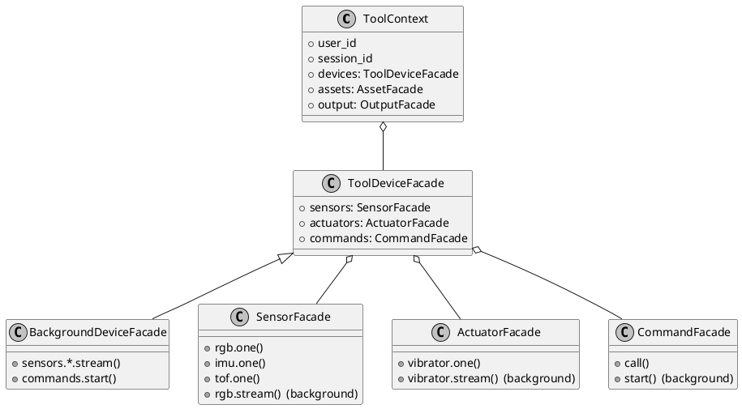
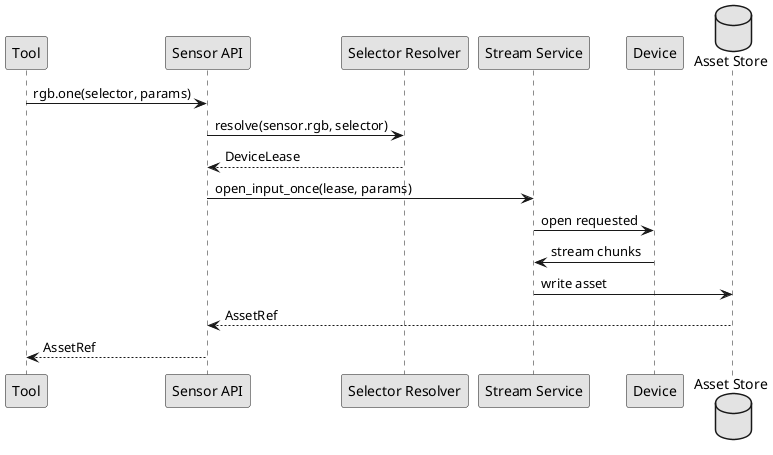
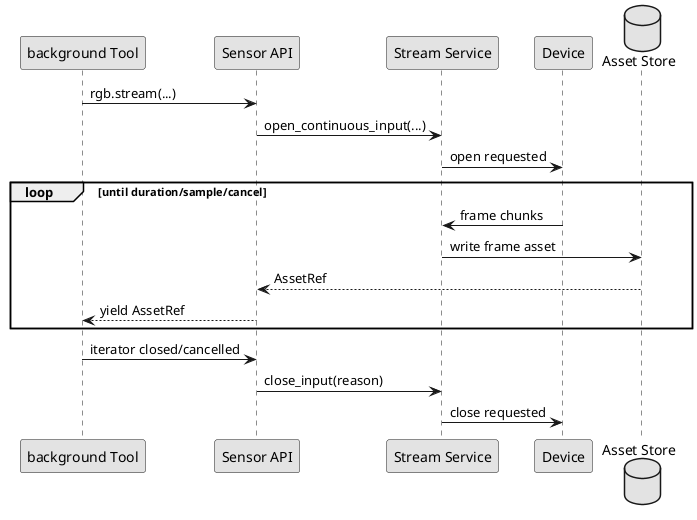

# realtime-agent Context 与设备 API 设计说明

本文是 `realtime-agent` 当前 Context 设备 API 的架构契约和设计说明。它用于固定公开 API、Context 分层、设备能力结构、selector 规则和 AssetRef 边界。

当前仓库以 typed device API 作为唯一推荐开发入口，例如
`context.devices.sensors.rgb.one()`、`context.devices.sensors.rgb.stream()`、
`context.devices.actuators.vibrator.one()`、`context.devices.commands.call()` 和
`context.output.say()`。

## 1. 设计原则

1. 设备通讯底层只有两类协议：控制信令和数据流。
2. 功能开发者写 Tool 时，不拼底层信令，不写 `device_id`。
3. SDK 提供面向能力的高级 API，例如 `context.devices.sensors.rgb.one()`。
4. 传感器和执行器使用固定语义 API，命令类能力使用更柔性的 `commands` API。
5. 麦克风和喇叭属于系统音频通道，不作为普通设备能力开放给 Tool 随意调用。
6. 系统只保留 Tool 与 Tool Run 两个概念：Tool 是能力声明与实现，Tool Run 是一次调用的运行实体。原 Task 的全部职责已并入 Tool（见 [Tool与Task概念统一设计.md](../internal/Tool与Task概念统一设计.md)）。
7. Tool 通过 `ToolSpec.late_result_policy` 选择运行策略：`fail_fast` 工具在等待窗口内完成一次短动作；`background` 工具转后台 runner 驻留运行，可维护持续数据流、异步命令和跨设备状态，结果稍后回流模型。

### 1.1 当前架构状态

当前仓库已经按 typed device API 收敛，且只保留 Tool 一个能力抽象：`fail_fast` 工具拿到 `ToolDeviceFacade`，`background` 工具按 `late_result_policy=background` 自动拿到 `BackgroundDeviceFacade`（在 `ToolDeviceFacade` 基础上额外开放长时 stream 和长命令）。公开入口只保留 typed device API、结构化 `supports` 和 `stream.control.open/close.requested`。

新增代码必须满足两条约束：

1. 不能引入第三套通讯对象；底层仍然只能映射到控制信令和数据流。
2. 不能绕过设备注册、鉴权、运行产物和播放仲裁。

### 1.2 对象模型



只有一个 `ToolContext`。SDK 在创建 Context 时按 `late_result_policy` 决定 `context.devices` 的具体门面：`fail_fast` 工具拿到 `ToolDeviceFacade`，只能用 `one()` / `call()` 这类短动作 API；`background` 工具拿到 `BackgroundDeviceFacade`，在此基础上额外开放 `stream()` 和 `commands.start()` 等长时、异步能力。工具不能通过类型转换绕过门面拿到自己策略外的接口。

## 2. Context 分层

### 2.1 ToolContext（fail_fast 策略）

`ToolContext` 是工具运行时唯一的上下文对象。对 `late_result_policy="fail_fast"` 的工具，它面向 Agent Loop 内部的短生命周期调用：工具应完成一次明确动作并在等待窗口内返回结果。等待窗口由 `tools.default_timeout_seconds` 决定，单个工具可声明更短的 `ToolSpec.timeout_seconds`，但不能超过 `tools.max_wait_timeout_seconds` 上限。
如果能力需要超过等待窗口、持续监听、跨设备编排或可取消恢复，应把工具声明为 `late_result_policy="background"`（见 2.2）。

`fail_fast` 工具允许使用：

```python
context.user_id
context.session_id

context.devices.sensors.rgb.one(...)
context.devices.sensors.tof.one(...)
context.devices.sensors.imu.one(...)
context.devices.actuators.vibrator.one(...)
context.devices.commands.call(...)

context.assets.get(...)
context.output.say(...)
```

不允许使用：

```python
context.devices.sensors.mic
context.devices.actuators.speaker
context.devices.sensors.rgb.stream(...)
context.devices.commands.start(...)
```

ToolContext 中不提供 `tasks`、`memory`、`skills` 这类服务入口。它们应该通过独立 Tool 暴露给模型，例如：

- 查询或写入记忆的专用 Tool。
- 查询 Skill 内容的专用 Tool。
- 封装 MCP 能力的专用 Tool。
- 需要长期运行的能力，本身就是一个 `background` 工具，由模型直接调用。

这样做的原因是：是否运行某个后台能力、是否查询记忆、是否读取 Skill，都应该由模型根据可见工具自行决定，而不是某个业务 Tool 在内部绕过工具列表调用。

### 2.2 background 工具（late_result_policy=background）

`background` 工具仍然使用同一个 `ToolContext`，只是 SDK 给它注入的 `context.devices` 是 `BackgroundDeviceFacade`，从而允许长时、异步和持续数据流。工具的 `run()` 协程在后台 runner 上驻留运行，直到返回结果、被取消或触发后台总超时。

`background` 工具额外允许使用：

```python
context.devices.sensors.rgb.stream(...)
context.devices.sensors.imu.stream(...)
context.devices.sensors.tof.stream(...)
context.devices.actuators.vibrator.stream(...)

context.devices.commands.start(...)
context.devices.commands.stop(...)
context.devices.commands.subscribe_result(...)
```

`background` 工具可以做：

- 持续读取相机、IMU、ToF 等传感器数据。
- 持续发送非音频执行器数据，例如振动序列。
- 调用其他设备执行端侧命令。
- 在协程内内联消费其他设备上报的远程命令执行状态。
- 处理取消、超时和资源清理。

`background` 工具仍然不允许直接打开麦克风，也不允许直接写喇叭。

### 2.3 Context 构造和注入

Context 由 SDK 在工具执行前创建，开发者不手动构造。

`fail_fast` 工具执行时：

1. Agent Core 根据模型 function call 找到 Tool。
2. Tool Gateway 验证输入 schema。
3. SDK 按 `fail_fast` 策略创建 `ToolContext`（`devices` 为 `ToolDeviceFacade`）。
4. 工具在等待窗口内执行并返回结构化结果。
5. Tool Gateway 把结果写回 Agent Loop。

`background` 工具执行时：

1. Agent Core 找到 Tool，Tool Gateway 验证输入 schema。
2. SDK 按 `background` 策略创建 `ToolContext`（`devices` 为 `BackgroundDeviceFacade`），并创建对应的 Tool Run 运行实体。
3. 等待窗口结束后调用返回“已转后台”的运行态，`run()` 协程在后台 runner 上继续启动持续数据流、内联消费远程命令结果。
4. 工具返回、失败、被取消或后台总超时后，Tool Run 收敛终态并清理资源；最终结果由 `FollowUpRouter` 回流模型（或按 `late_result_notify="direct"` 直通播报）。

### 2.4 服务访问边界

`memory`、`skills`、`mcp` 不是通用 Context 服务。它们的公开方式应该是“专用 Tool”，而不是任意 Tool 的内部依赖：

| 能力 | 推荐公开方式 | 原因 |
| --- | --- | --- |
| Memory | `memory.search`、`memory.write` 等专用 Tool。 | 让模型可见何时读写记忆，便于审计。 |
| Skill | `skill.read`、`skill.search` 等专用 Tool。 | Skill 选择应进入 Agent 决策，而不是被某个 Tool 隐式读取。 |
| MCP | MCP wrapper Tool。 | 保持外部服务调用的 schema、权限和日志可见。 |
| 后台能力 | 直接声明为 `background` 工具，由模型调用启动；`tool_run_manager` 提供查询、取消和列表。 | 启动后台能力本身就是一次普通 tool call，应有明确调用记录；查询、取消和列表属于运行时管理。 |

## 3. Asset 是否需要存在

`AssetRef` 这个概念仍然建议保留，但要重新定义边界。

它不应该被解释成“系统必须长期缓存所有数据”，而应该表示“一次传感器读取结果的引用”。这个引用可以指向：

- 内存中的短期对象。
- 本地临时文件。
- 调试运行目录中的文件。
- 远端对象存储。
- 零缓存模式下的一次性读取句柄。

也就是说，`AssetRef` 是返回值抽象，不是强制缓存策略。

为什么仍然需要它：

| 原因 | 说明 |
| --- | --- |
| 避免把大字节放进 ToolResult | 图片、深度图、IMU 窗口不应该直接塞进模型工具结果。 |
| 便于多模型使用 | Omni、视觉模型、规则模块都可以拿同一个引用读取数据。 |
| 便于调试 | 实测照片、深度图、传感器窗口可以落盘查看。 |
| 便于异步处理 | `background` 工具可以逐帧拿引用，而不是阻塞在单个大 payload 上。 |

缓存应该是可配置策略，而不是 API 语义本身。开发者看到的是：

```python
asset = await context.devices.sensors.rgb.one(...)
```

而不是：

```python
cache = ...
```

返回示例：

```python
AssetRef(
    asset_id="asset_xxx",
    stream_type="sensor.rgb",
    mime_type="image/jpeg",
    created_at_ms=1770000000000,
)
```

## 4. 设备能力注册

设备注册文件按传感器和执行器分开声明。

推荐结构如下：

```yaml
$schema: ../../../../agent-server/realtime_agent/spec/realtime-agent-device.schema.json

device_id: dev-browser-glass-001
user_id: user-demo-001
device_name: browser-glass
device_role: front_glass
tags: [primary, wearable]

runtime:
  platform: browser
  language: javascript
  version: 0.1.0

supports:
  sensors:
    - type: rgb
      modes: [single, continuous]
      formats: [jpeg]
      default:
        width: 1280
        height: 720
        fps: 1
        sample_count: 1
      external:
        facing: environment

    - type: imu
      modes: [single, continuous]
      default:
        sample_rate_hz: 50
        duration_seconds: 1
      external:
        axes: [accel, gyro]

    - type: tof
      modes: [single, continuous]
      formats: [png]
      default:
        width: 320
        height: 240
        fps: 10
      external:
        unit: millimeter

  actuators:
    - type: vibrator
      modes: [single, continuous]
      default:
        pattern: short
        strength: 0.8
      external:
        max_duration_ms: 5000
```

字段说明：

| 字段 | 说明 |
| --- | --- |
| `device_id` | 设备实例标识，只用于注册、日志和调试。业务代码不写死它。 |
| `user_id` | 设备绑定的用户。 |
| `device_name` | 设备实现名称，例如 `browser-glass`、`ios-device-demo`。 |
| `device_role` | 设备在当前用户设备组中的角色，例如 `front_glass`、`phone`。 |
| `tags` | 选择器可匹配标签，例如 `primary`、`wearable`。 |
| `supports.sensors[].type` | 传感器类型，例如 `rgb`、`imu`、`tof`。 |
| `supports.actuators[].type` | 执行器类型，例如 `vibrator`。 |
| `default` | SDK 可理解的默认采样或执行参数。 |
| `external` | 设备私有扩展信息，SDK 只透传或用于调试，不解释其业务含义。 |

麦克风和喇叭不作为普通能力暴露在 Tool API 中。设备仍然可以在系统音频配置中声明麦克风和扬声器能力，但它们由音频会话和 Output Service 管理，不进入 `context.devices.sensors` 和 `context.devices.actuators`。

### 4.1 能力命名规范

能力命名分为三层：

| 层级 | 示例 | 说明 |
| --- | --- | --- |
| domain | `sensor` / `actuator` / `command` | 表示能力大类。 |
| type | `rgb` / `imu` / `tof` / `vibrator` | 表示稳定语义类型。 |
| operation | `one` / `stream` / `call` / `start` | 表示开发 API 操作，不写进设备能力 ID。 |

设备能力文件只声明 domain 和 type，例如：

```yaml
supports:
  sensors:
    - type: rgb
  actuators:
    - type: vibrator
```

开发 API 再决定 operation：

```python
await context.devices.sensors.rgb.one(...)
async for frame in context.devices.sensors.rgb.stream(...):
    ...
await context.devices.actuators.vibrator.one(...)
```

### 4.2 默认参数与调用参数合并

设备声明中的 `default` 是能力默认值，工具调用时传入的 `params` 是本次请求覆盖值。SDK 合并规则：

1. 先读取设备能力 `default`。
2. 再叠加 API 调用传入的 `params`。
3. 对合并结果做能力类型校验。
4. 把最终参数放入底层控制信令。

示例：

```yaml
supports:
  sensors:
    - type: rgb
      default:
        width: 1280
        height: 720
        format: jpeg
```

```python
await context.devices.sensors.rgb.one(
    params={"width": 640},
)
```

最终参数：

```json
{
  "width": 640,
  "height": 720,
  "format": "jpeg"
}
```

### 4.3 external 的边界

`external` 只用于设备私有扩展，不作为 SDK 稳定语义。SDK 可以把它用于日志、调试展示或透传，但不能要求业务 Tool 依赖某个 `external` 字段。

推荐：

```yaml
external:
  facing: environment
  vendor_camera_id: "0"
```

不推荐：

```yaml
external:
  business_priority: high
```

业务选择逻辑应该进入 `device_role`、`tags` 或未来明确 schema 字段，而不是藏在 `external` 中。

## 5. Selector

`selector` 用来选择具体设备，但不暴露硬编码 `device_id`。

推荐：

```python
selector = {
    "device_role": "front_glass",
    "capability": "sensor.rgb",
    "tags": ["primary"],
}
```

也可以按设备声明字段筛选：

```python
selector = {
    "device_name": "browser-glass",
    "location": "front",
}
```

规则：

- 单次控制类调用如果匹配到多个设备，可以全部执行。
- 创建输入数据流时，如果匹配到多个设备，SDK 应直接抛出错误，要求调用方补充 selector 约束到一个设备。
- 创建输出数据流时同理，除非 API 明确声明支持广播。
- 不提供 `send_to_device("dev-xxx")` 这类开发者接口。

示例：

```python
# 推荐
await context.devices.sensors.rgb.one(selector={"device_role": "front_glass"})

# 不推荐，默认不开放
context.devices.send_to_device("dev-xxx", ...)
```

SDK 内部根据设备注册时的能力、标签、声明字段和在线状态解析到具体设备。

### 5.1 Selector 字段

推荐 selector 字段：

| 字段 | 示例 | 匹配来源 |
| --- | --- | --- |
| `capability` | `sensor.rgb` | 由 API 自动补齐，也允许调用方显式约束。 |
| `device_role` | `front_glass` | 设备注册顶层字段。 |
| `device_name` | `browser-glass` | 设备注册顶层字段。 |
| `tags` | `["primary"]` | 设备注册顶层字段。 |
| `runtime.platform` | `browser` | `runtime` 子字段。 |
| `location` | `front` | 稳定字段或 properties 扩展字段。 |

不允许 selector 直接匹配 `device_id`。如果调试场景必须指定某台设备，应放在 SDK 内部测试工具或调试 CLI 中，不成为业务 API。

### 5.2 Selector 解析算法

SDK 解析 selector 时按以下顺序执行：

1. 取当前 `user_id` 的在线设备集合。
2. 根据 API 自动推导能力，例如 `rgb.one()` 推导 `sensor.rgb`。
3. 过滤掉不支持该能力的设备。
4. 应用 selector 字段过滤设备。
5. 过滤掉当前不可用设备，例如离线、能力忙、权限不满足。
6. 根据 API 操作类型决定匹配数量是否允许。

匹配数量规则：

| API 类型 | 0 个匹配 | 1 个匹配 | 多个匹配 |
| --- | --- | --- | --- |
| `sensors.*.one()` | 抛出 `DeviceNotFoundError` 或超时。 | 正常打开一次性输入流。 | 抛出 `AmbiguousDeviceError`，要求补充 selector。 |
| `sensors.*.stream()` | 抛出 `DeviceNotFoundError`。 | 正常打开持续输入流。 | 抛出 `AmbiguousDeviceError`。 |
| `actuators.vibrator.one()` | 抛出 `DeviceNotFoundError`。 | 正常执行。 | 默认广播执行，除非调用方设置 `require_single=True`。 |
| `commands.call()` | 抛出 `DeviceNotFoundError`。 | 正常执行。 | 默认广播执行并聚合结果。 |
| `commands.start()` | 抛出 `DeviceNotFoundError`。 | 正常启动远程命令。 | 抛出 `AmbiguousDeviceError`，除非命令声明支持多实例。 |

### 5.3 选择结果对象

selector 解析结果不暴露为 `device_id` 字符串，而是内部 `DeviceLease`：

```python
DeviceLease(
    lease_id="lease_xxx",
    user_id="user-demo-001",
    capability="sensor.rgb",
    device_snapshot={...},
    expires_at_ms=...
)
```

`DeviceLease` 用于 SDK 内部打开 stream、发送控制信令、记录调试产物。业务代码最多看到错误、AssetRef 或 CommandResult，不直接操作 lease。

## 6. 传感器 API

传感器 API 位于：

```python
context.devices.sensors
```

麦克风除外。

### 6.0 通用签名

所有普通传感器都提供 `one()`，`stream()` 只在 `background` 工具的 `BackgroundDeviceFacade` 上提供。

```python
async def one(
    *,
    selector: dict | None = None,
    timeout_seconds: float = 10,
    params: dict | None = None,
) -> AssetRef:
    ...
```

```python
async def stream(
    *,
    selector: dict | None = None,
    duration_seconds: float | None = None,
    sample_count: int | None = None,
    params: dict | None = None,
) -> AsyncIterator[AssetRef]:
    ...
```

`one()` 的语义是“请求一份最新数据”，不保证底层一定只传一个 chunk。设备可以上传多个 chunk，SDK 负责把它们汇聚成一个 `AssetRef`。

`stream()` 的语义是“打开持续数据流并逐个返回引用”。停止条件可以来自：

- `duration_seconds` 到达。
- `sample_count` 到达。
- Tool Run 被取消。
- 设备主动关闭。
- SDK 超时或发生错误。

### 6.0.1 AssetRef 结构

目标 `AssetRef` 字段：

```python
@dataclass(frozen=True)
class AssetRef:
    asset_id: str
    user_id: str
    session_id: str | None
    stream_type: str
    mime_type: str
    created_at_ms: int
    size_bytes: int | None = None
    uri: str | None = None
    metadata: dict = field(default_factory=dict)
```

字段边界：

| 字段 | 说明 |
| --- | --- |
| `asset_id` | 引用 ID，可用于后续模型输入、调试和追踪。 |
| `uri` | 可为空；由存储策略决定是本地路径、对象存储地址还是一次性句柄。 |
| `metadata` | 记录分辨率、采样率、设备快照摘要、correlation_id 等诊断信息。 |

ToolResult 中可以返回 `asset_id`、`mime_type`、业务说明和 `AssetRef` 列表，但不返回媒体字节。

### 6.1 RGB 相机

单次获取：

```python
asset = await context.devices.sensors.rgb.one(
    selector={"device_role": "front_glass"},
    timeout_seconds=10,
    params={
        "width": 1280,
        "height": 720,
        "format": "jpeg",
    },
)
```

持续获取，仅 `background` 工具可用：

```python
async for asset in context.devices.sensors.rgb.stream(
    selector={"device_role": "front_glass"},
    fps=2,
    duration_seconds=10,
    params={
        "width": 640,
        "height": 480,
        "format": "jpeg",
    },
):
    await self.analyze_frame(asset)
```

### 6.2 IMU

```python
asset = await context.devices.sensors.imu.one(
    selector={"device_role": "front_glass"},
    timeout_seconds=5,
    params={
        "sample_rate_hz": 50,
        "duration_seconds": 1,
    },
)
```

```python
async for sample in context.devices.sensors.imu.stream(
    selector={"device_role": "front_glass"},
    sample_rate_hz=50,
    duration_seconds=5,
):
    await self.process_imu(sample)
```

### 6.3 ToF 深度相机

```python
asset = await context.devices.sensors.tof.one(
    selector={"device_role": "front_glass"},
    timeout_seconds=5,
    params={
        "width": 320,
        "height": 240,
        "format": "png",
    },
)
```

```python
async for depth in context.devices.sensors.tof.stream(
    selector={"device_role": "front_glass"},
    fps=10,
    duration_seconds=5,
):
    await self.process_depth(depth)
```

### 6.4 不开放麦克风

不提供：

```python
context.devices.sensors.mic
```

麦克风只属于系统连续对话音频输入链路：

- 端侧负责采集、AEC、NS、AGC、唤醒。
- server 只接收唤醒后的音频 stream。
- 工具不允许直接打开 mic。

### 6.5 输入流生命周期

传感器 `one()` 生命周期：



传感器 `stream()` 生命周期：



## 7. 执行器 API

执行器 API 位于：

```python
context.devices.actuators
```

喇叭除外。

### 7.0 通用签名

```python
async def one(
    *,
    selector: dict | None = None,
    params: dict | None = None,
    timeout_seconds: float = 5,
) -> ActuatorResult:
    ...
```

```python
async def stream(
    *,
    selector: dict | None = None,
    frames: AsyncIterable[bytes] | Iterable[bytes],
    params: dict | None = None,
) -> ActuatorStreamResult:
    ...
```

执行器 `one()` 适合振动一次、闪灯一次、切换一个本地状态。执行器 `stream()` 适合连续振动序列等非音频执行器数据。

### 7.1 振动器

单次执行：

```python
await context.devices.actuators.vibrator.one(
    selector={"device_role": "front_glass"},
    params={
        "pattern": "short",
        "strength": 0.8,
        "duration_ms": 300,
    },
)
```

持续发送，仅 `background` 工具可用：

```python
await context.devices.actuators.vibrator.stream(
    selector={"device_role": "front_glass"},
    frames=pattern_iterable,
    params={
        "strength": 0.8,
    },
)
```

### 7.2 不开放喇叭

不提供：

```python
context.devices.actuators.speaker
```

喇叭输出必须走系统 Output Service / Playback Arbiter：

```python
await context.output.say(
    text="我正在处理",
    priority="low",
)
```

或者由 Agent Core 的模型音频输出自动进入播放仲裁。

### 7.3 输出和播放优先级

普通工具不直接构造 speaker 输出。它们只能表达输出意图：

```python
await context.output.say("我正在处理", priority="low")
```

目标 `OutputFacade`：

```python
class OutputFacade:
    async def say(
        self,
        text: str,
        *,
        priority: str = "normal",
        ttl_seconds: int = 0,
        dedupe_key: str | None = None,
    ) -> None:
        ...
```

`priority` 只影响 Output Service 和 Playback Arbiter，不影响设备选择。扬声器设备仍由系统音频通道和播放仲裁决定。

## 8. Commands API

`commands` 用于非数据流类设备能力，适合更柔性的端侧行为：

- 设置相机参数。
- 启动导航。
- 查询电量。
- 切换设备模式。
- 开启某个端侧算法。
- 获取端侧处理状态。

### 8.1 单次命令

`fail_fast` 和 `background` 工具都可以使用：

```python
result = await context.devices.commands.call(
    name="device.camera.set_zoom",
    selector={"device_role": "front_glass"},
    params={"zoom": 2.0},
    timeout_seconds=5,
)
```

目标返回：

```python
CommandResult(
    command_id="cmd_xxx",
    name="device.camera.set_zoom",
    ok=True,
    data={"zoom": 2.0},
    device_count=1,
    errors=[],
)
```

单次命令的结果聚合规则：

| 匹配设备数 | 默认行为 |
| --- | --- |
| 0 | 抛出 `DeviceNotFoundError`。 |
| 1 | 返回单设备结果。 |
| 多个 | 广播执行，返回聚合结果；如果命令声明 `require_single=True` 则抛出 `AmbiguousDeviceError`。 |

### 8.2 持续命令

仅 `background` 工具可用：

```python
handle = await context.devices.commands.start(
    name="device.navigation.track",
    selector={"device_role": "phone"},
    params={"mode": "walking"},
)

async for result in handle.results():
    await self.update_remote_state(result)

await handle.stop()
```

`background` 工具可以在 `run()` 协程内内联维护远程命令状态：

```python
class NavigationFollowTool(BaseTool):
    spec = ToolSpec(
        name="navigation_follow",
        description="请求手机端执行导航跟踪并维护远程状态。",
        late_result_policy="background",
        cancel_supported=True,
    )

    async def run(self, context: ToolContext, input_data: dict) -> ToolResult:
        handle = await context.devices.commands.start(
            name="device.navigation.track",
            selector={"device_role": "phone"},
            params={"mode": "walking"},
        )
        try:
            async for result in handle.results():
                await self.apply_phone_navigation_state(result)
            return ToolResult.success(message="导航结束。")
        finally:
            await handle.stop()
```

### 8.3 CommandHandle

持续命令返回 `CommandHandle`：

```python
class CommandHandle:
    command_id: str
    name: str

    async def results(self) -> AsyncIterator[CommandEvent]:
        ...

    async def stop(self, *, reason: str = "tool_run_cancelled") -> CommandResult:
        ...
```

`CommandEvent` 表示远程设备状态回报：

```python
CommandEvent(
    command_id="cmd_xxx",
    name="device.navigation.track",
    state="running",
    data={"distance_to_next_turn_m": 12},
    created_at_ms=...
)
```

状态建议：

| state | 含义 |
| --- | --- |
| `accepted` | 设备接受命令。 |
| `running` | 命令正在执行。 |
| `progress` | 中间进度。 |
| `completed` | 设备端完成。 |
| `failed` | 设备端失败。 |
| `cancelled` | 已取消。 |
| `timeout` | 超时。 |

### 8.4 远程命令与 background 工具的关系

`commands.start()` 启动的是“端侧远程命令或端侧任务”，不是 server 侧的运行实体。server 侧由一个 `background` 工具的 Tool Run 负责维护它：

```text
background Tool Run
  -> commands.start(name="device.navigation.track")
  -> 设备端开始导航跟踪
  -> Tool Run 在 run() 协程内消费 CommandEvent
  -> Tool Run 根据状态输出提示或返回结果
  -> Tool Run 被取消时调用 handle.stop()
```

这能避免把端侧实现细节暴露给 Agent Core，同时保留跨设备长流程能力。

peer video 这类跨设备能力也使用同一模型。`background` 工具先选择 phone 端启动 receiver，等待端侧通过
`command.progress status=peer.receiver.ready` 返回 WebSocket 地址，再选择 glass 端启动 sender。这里用工具自己生成的 `peer_session_id` 关联两端：

```python
peer_session_id = f"peer-{uuid.uuid4().hex}"

phone = await context.devices.commands.start(
    name="peer.video.receiver.start",
    selector={"device_role": "phone"},
    params={
        "peer_session_id": peer_session_id,
        "purpose": "find_object",
        "object_name": "水杯",
        "media_config": {"codec": "jpeg", "width": 960, "height": 540, "fps": 5},
        "timeout_seconds": 30,
    },
)

glass = await context.devices.commands.start(
    name="peer.video.sender.start",
    selector={"device_role": "glass"},
    params={
        "peer_session_id": peer_session_id,
        "source": {"stream_type": "sensor.rgb", "codec": "jpeg", "fps": 5},
        "receiver": {"transport": "websocket", "url": "ws://phone:19081/peer-video/<peer_session_id>"},
    },
)
```

这里 `CommandHandle.results()` 只消费端侧状态，视频帧不经过 server，也不放进工具回流载荷或控制信令 payload。

注意：Realtime visual sampler 在用户说话期间也会请求 `sensor.rgb`，但它生成的是带
`request_id` 的单资产采样流。这类流只进入模型 / Asset Service，不会被 Stream
Service 冻结为 phone 的消费者，也不会在 `background` 工具启动前建立眼镜到手机的视频连接。只有
`commands.start(name="peer.video.receiver.start")` 和
`commands.start(name="peer.video.sender.start")` 都发生后，peer video 才开始发送。

### 8.5 命令回报与系统事件的关系

`background` 工具的结果对外回流由 `FollowUpRouter` 统一承接，不再有独立的 `TaskSignal` 实体。`FollowUpRouter` 负责把 Tool Run 的最终结果按策略注入模型（活跃注入 / 忙排队 / 关闭待通知 / 过期丢弃），或在 `late_result_notify="direct"` 时改走 Output Service 直通播报。它不是控制面的系统级 `Event`，也不是端侧命令回执 `CommandEvent`。

三者边界：

| 概念 | 所属层 | 主要用途 |
| --- | --- | --- |
| `Event` / `event_name` | 系统协议和控制面 | 设备注册、stream 开关、端侧命令下发和回执。 |
| `CommandEvent` | Context 设备命令 API | 持续命令或端侧任务的状态回报，由 `background` 工具在协程内消费。 |
| Tool Run 回流（`FollowUpRouter`） | Tool Run 运行时 | `background` 工具最终结果向模型的回流，或按 `direct` 策略的直通播报。 |

### 8.5 SDK 内置模型工具

Server SDK 默认注册一组基础 Tool，作为每个应用都可复用的模型可见能力：

| 工具名 | 主要用途 | 依赖配置 |
| --- | --- | --- |
| `search_web` | 使用 Bocha Web Search 查询公开网页资料。 | `BOCHA_SEARCH_API_KEY`，可选 `BOCHA_SEARCH_API_URL`。 |
| `query_device_state` | 查询当前用户在线设备、设备名称、能力、连接状态或播放状态。 | 无。 |
| `query_system_time` | 查询当前系统时间、日期、星期或指定时区时间；默认北京时间。 | 无。 |
| `query_current_location` | 请求端侧 GPS / 浏览器定位，返回经纬度、精度或不可用原因；主要用于用户主动询问“我在哪里”。 | 端侧需声明 `realtime_agent.location=true` 并消费 `device.location.get_current` 命令。路线规划应直接调用 `query_route_plan(origin="当前位置")`。 |
| `query_route_plan` | 通过 AMap MCP 查询步行路线；会把地址先解析成经纬度，`origin="当前位置"` 时先请求端侧定位。 | 优先使用应用 MCP 配置；未配置时读取 `AMAP_MCP_URL`、`AMAP_MCP_BEARER_TOKEN`、`AMAP_MCP_API_KEY`。定位失败、MCP 超时或业务错误会返回原因。 |

前台 Tool 默认等待时间为 3 秒，由 `tools.default_timeout_seconds` 配置。模型等待
Tool 返回的硬上限由 `tools.max_wait_timeout_seconds` 配置，单个 Tool 的
`ToolSpec.timeout_seconds` 不允许超过该上限。MCP server 可通过
`mcp.prepare_on_startup=true` 在服务启动时预热 Streamable HTTP session，避免首次路线
规划时才执行 MCP 初始化。
| `memory_search` | 查询长期记忆详情。 | `memory.enabled=true` 后可返回真实记忆；未启用时返回结构化权限错误。 |
| `manage_memory` | 维护长期记忆，支持新增、更新、删除或忽略。 | `memory.enabled=true` 后可写入真实记忆；未启用时返回结构化权限错误。 |
| `search_conversation_history` | 只读检索 `runs/<user_id>/<session_id>/messages.jsonl` 中的历史对话片段。 | `runs_root`。 |
| `close_audio_session` | 用户明确要求结束语音会话时关闭当前连续对话。 | Output Service。 |

这些工具都通过 `ToolGateway` 暴露给模型，并写入 `tool-events.jsonl`。业务应用仍然可以通过 denylist 隐藏不适合当前场景的工具。

### 8.6 background 工具与运行时管理 Tool

后台能力不再有独立的 Task 抽象。它就是一个声明了 `late_result_policy="background"` 的普通 `BaseTool`，从模型视角是一次普通 provider tool call，参数 schema 来自 `ToolSpec.input_model`：推荐用 Pydantic `BaseModel` 定义输入，字段类型、必填项、默认值、范围约束和 `Field(description=...)` 会进入 provider tool schema；JSON Schema dict 用于外部 schema 生成场景。

```json
{
  "tool": "find_object",
  "arguments": {
    "object_name": "水杯"
  }
}
```

工具调用后，SDK 创建对应的 Tool Run 并提交到后台 runner。等待窗口（默认 3 秒）内未完成的调用立即返回“已转后台”的运行态，`run()` 协程继续在后台执行。等待窗口由 `tools.default_timeout_seconds` 决定，与表示后台生命周期上限的 `ToolSpec.background_timeout_seconds` 是两个独立预算——后者表示工具最长运行时间（例如找物或红绿灯识别），需要按入参决定预算的工具（如计时器）可覆写 `background_timeout_seconds_for(input_data)`。

`timer`（内置工具 `start_timer`）是 SDK 内置的 `background` 工具示例，用于倒计时、稍后提醒和到点提示。它声明 `late_result_notify="direct"`，到点结果不经模型，直接走 Output Service 通知仲裁播报；取消则经 `tool_run_manager`。其它业务后台能力由应用注册自己的 `background` 工具即可，无需任何启动包装。

`tool_run_manager` 负责已创建 Tool Run 的运行时管理：

| action | 用途 |
| --- | --- |
| `query` | 查询单个 Tool Run。 |
| `cancel` | 取消仍在运行且声明 `cancel_supported=True` 的 Tool Run。 |
| `list_instances` | 列出当前用户的 Tool Run 实例。 |

这样 Tool 与 Tool Run 的职责清晰分层：

| 层 | 责任 |
| --- | --- |
| `BaseTool` + `ToolSpec` | 模型可调用接口与能力声明，含 provider tool schema、`late_result_policy`、`background_timeout_seconds` 等。 |
| Tool Run | 一次调用的运行实体：后台执行、状态机、落盘、取消、后台总超时与结果回流。 |
| `FollowUpRouter` | 把后台结果按策略注入模型，或按 `direct` 直通播报。 |
| `tool_run_manager` | 查询、取消、列出 Tool Run 实例。 |

## 9. 推荐 Tool 示例

```python
from realtime_agent import BaseTool, ToolContext


class CapturePhotoTool(BaseTool):
    """获取用户当前视角的一张照片。"""

    name = "capture_photo"
    description = "获取用户当前视角的一张照片。"
    input_schema = {
        "type": "object",
        "properties": {
            "reason": {"type": "string", "description": "为什么需要获取当前画面。"}
        },
        "required": ["reason"],
    }

    async def run(self, context: ToolContext, input_data: dict):
        asset = await context.devices.sensors.rgb.one(
            selector={"device_role": "front_glass"},
            timeout_seconds=10,
            params={
                "width": 1280,
                "height": 720,
                "format": "jpeg",
                "reason": input_data["reason"],
            },
        )

        return {
            "asset_id": asset.asset_id,
            "mime_type": asset.mime_type,
            "message": "已获取当前视角照片。",
        }
```

关键点：

- Tool 只调用 `rgb.one()`，不关心底层如何打开相机。
- Tool 不写设备 ID。
- Tool 不启动长期循环。
- Tool 返回 `AssetRef` 的结构化信息，不把图片字节塞进返回值。

## 10. 推荐后台能力工具示例

持续运行或耗时的能力声明 `late_result_policy="background"`，其 `run()` 在后台 runner 上执行，
可以驻留消费持续 stream 或长命令。background 工具的 `context.devices` 自动获得长时 stream 和
长命令能力。

```python
from realtime_agent import BaseTool, ToolContext, ToolResult, ToolSpec


class WatchFrontSceneTool(BaseTool):
    """持续观察用户前方画面。"""

    spec = ToolSpec(
        name="watch_front_scene",
        description="持续观察用户前方画面并在发现关注目标时回报。",
        late_result_policy="background",
        cancel_supported=True,
    )

    async def run(self, context: ToolContext, input_data: dict) -> ToolResult:
        async for frame in context.devices.sensors.rgb.stream(
            selector={"device_role": "front_glass"},
            fps=1,
            duration_seconds=30,
            params={"width": 640, "height": 480, "format": "jpeg"},
        ):
            await self.analyze_frame(frame)
        return ToolResult.success(message="已结束观察。")
```

跨设备远程长命令示例（在协程内内联消费端侧回报）：

```python
import asyncio

from realtime_agent import BaseTool, ToolContext, ToolResult, ToolSpec


class PhoneNavigationTool(BaseTool):
    """请求手机端执行导航跟踪，并维护远程命令状态。"""

    spec = ToolSpec(
        name="phone_navigation",
        description="请求手机端执行导航跟踪。",
        late_result_policy="background",
        cancel_supported=True,
    )

    async def run(self, context: ToolContext, input_data: dict) -> ToolResult:
        handle = await context.devices.commands.start(
            name="device.navigation.track",
            selector={"device_role": "phone"},
            params={"mode": "walking"},
        )
        try:
            async for result in handle.results():
                if result.state == "completed":
                    return ToolResult.success(message="已到达目的地。")
                if result.state == "failed":
                    return ToolResult.success(message="导航没有成功。")
            return ToolResult.success(message="导航结束。")
        except asyncio.CancelledError:
            await handle.stop(reason="tool_run_cancelled")
            raise
```

## 11. 功能开发者不需要关心的内容

功能开发者写 Tool 时不应该直接处理：

- 控制信令名称。
- 底层订阅策略。
- WebSocket 连接。
- `device_id` 点对点发送。
- stream 打开和关闭的信令细节。
- 传输 chunk 的序号、编码和帧格式。

这些都由 SDK 的能力 API 处理。

### 11.1 错误类型

能力 API 应返回明确错误，不让开发者从底层信令里猜原因。

| 错误 | 触发场景 | 建议处理 |
| --- | --- | --- |
| `DeviceNotFoundError` | 没有在线设备匹配能力和 selector。 | Tool 返回用户可理解的失败说明。 |
| `AmbiguousDeviceError` | 创建流时匹配到多个设备。 | 要求补充 selector 或调整设备角色。 |
| `DeviceBusyError` | 目标设备能力正在被独占使用。 | 重试、排队或提示用户稍后再试。 |
| `CapabilityNotSupportedError` | 设备在线但不支持请求能力或参数。 | 降级参数或失败。 |
| `StreamTimeoutError` | 打开流后没有收到数据。 | 关闭流并返回超时。 |
| `CommandFailedError` | 端侧命令执行失败。 | 把端侧错误摘要返回给 Agent。 |
| `PlaybackRejectedError` | 输出被播放仲裁拒绝。 | 通常只记录，不让 Tool 直接重试。 |

### 11.2 日志和运行产物

每次能力 API 调用至少应写入以下诊断信息：

| 产物 | 字段 |
| --- | --- |
| capability trace | API 名称、selector、解析设备数量、耗时、结果。 |
| stream trace | stream_type、打开原因、关闭原因、字节数、资产数量。 |
| command trace | command name、状态变化、设备数量、错误。 |
| output trace | text/audio、priority、播放决策。 |

这样开发者看到的是“能力调用为什么失败”，而不是只看到底层连接日志。

## 12. 设备开发者需要关心的内容

设备开发者需要实现三件事：

1. 提交设备注册文件，声明自己有什么传感器、执行器、角色和标签。
2. 按 SDK 下发的控制信令打开或关闭对应硬件能力。
3. 按 stream 协议上传或接收大字节数据。

设备端不需要知道 server 上有哪些 Tool，也不需要知道模型为什么请求某个能力。

设备注册示例：

```yaml
device_id: dev-browser-glass-001
user_id: user-demo-001
device_name: browser-glass
device_role: front_glass
tags: [primary]

supports:
  sensors:
    - type: rgb
      modes: [single, continuous]
      formats: [jpeg]
      default:
        width: 1280
        height: 720
        fps: 1

    - type: imu
      modes: [single, continuous]
      default:
        sample_rate_hz: 50

  actuators:
    - type: vibrator
      modes: [single, continuous]
      default:
        pattern: short
```

设备开发者可以把底层信令理解为 SDK 和设备之间的协议，不是功能开发 API。文档、schema 和参考端会保证不同语言的端侧实现写法一致。

### 12.1 设备端实现状态机

设备端应按能力维护最小状态：

| 状态 | 含义 |
| --- | --- |
| `idle` | 未执行能力。 |
| `opening` | 已收到打开请求，正在准备硬件。 |
| `streaming` | 正在上传或接收数据。 |
| `closing` | 正在释放资源。 |
| `failed` | 最近一次执行失败。 |

传感器设备必须处理重复打开：

- 如果同一能力已经 `streaming`，收到新的 single 请求，应返回 busy 或根据 SDK 策略排队。
- 如果收到 stop，必须尽快关闭硬件并回报关闭。
- 如果网络断开，端侧应释放硬件资源。

### 12.2 设备能力和权限

设备注册时声明“理论能力”，但运行时还要处理权限：

- 浏览器相机权限可能被拒绝。
- iOS 麦克风或相机权限可能未授权。
- ESP32 外设可能初始化失败。

设备端不应该把权限失败伪装成没有响应，而应回报明确失败状态，使 SDK 能生成 `CapabilityNotSupportedError` 或 `StreamTimeoutError` 之外的更具体错误。

## 13. 底层协议映射附录

本节只给设备端、SDK 实现者和协议排障使用。功能开发者写 Tool 时不需要直接使用这些字段。

高级 API：

```python
await context.devices.sensors.rgb.one(
    selector={"device_role": "front_glass"},
    params={"width": 1280, "height": 720},
)
```

SDK 内部映射为控制信令：

```json
{
  "event_name": "stream.control.open.requested",
  "stream_type": "sensor.rgb",
  "selector": {
    "device_role": "front_glass"
  },
  "payload": {
    "mode": "single",
    "params": {
      "width": 1280,
      "height": 720
    }
  }
}
```

持续视频：

```python
context.devices.sensors.rgb.stream(
    selector={"device_role": "front_glass"},
    fps=2,
    duration_seconds=10,
)
```

SDK 内部映射为：

```json
{
  "event_name": "stream.control.open.requested",
  "stream_type": "sensor.rgb",
  "selector": {
    "device_role": "front_glass"
  },
  "payload": {
    "mode": "continuous",
    "fps": 2,
    "duration_seconds": 10
  }
}
```

当前 SDK 只发送 `stream.control.open.requested` / `stream.control.close.requested`。设备收到控制信令后，打开 `sensor.rgb` stream，按请求上传一张图片或连续图片帧，然后关闭 stream。

### 13.1 控制信令命名建议

目标协议保留底层 `event_name`，但对功能开发者隐藏。建议命名：

| 事件名 | 用途 |
| --- | --- |
| `stream.control.open.requested` | 请求设备打开传感器或执行器数据流。 |
| `stream.control.close.requested` | 请求关闭数据流。 |
| `stream.input.opened` | 设备确认输入流已打开。 |
| `stream.input.closed` | 设备确认输入流已关闭。 |
| `stream.output.ready` | 设备确认输出流已准备好接收数据。 |
| `stream.output.closed` | 设备确认输出流已关闭。 |
| `command.requested` | 请求设备执行命令。 |
| `command.accepted` | 设备接受命令。 |
| `command.progress` | 设备回报命令进度。 |
| `command.completed` | 设备命令完成。 |
| `command.failed` | 设备命令失败。 |

### 13.2 协议收敛原则

端侧只需要实现 `stream.control.open.requested` 和 `stream.control.close.requested`；功能代码只使用 typed API，不手写底层控制信令。

## 14. 调试观察点

常用接口：

```bash
curl http://127.0.0.1:8765/api/health
curl http://127.0.0.1:8765/api/debug/devices
curl http://127.0.0.1:8765/api/debug/playback
```

推荐观察顺序：

1. 先看设备是否在线、`user_id` 是否一致、能力和标签是否正确。
2. 再看能力 API 是否解析到唯一设备。
3. 如果是单次传感器读取，看是否返回 `AssetRef`。
4. 如果是持续传感器读取，看 `background` 工具的 Tool Run 是否正确退出或取消。
5. 如果是远程命令，看命令结果是否按 handle 返回。
6. 如果是语音输出，看 Output Service 和 Playback Arbiter 的播放决策。

## 15. 约束清单

功能开发者：

- 使用 `context.devices.sensors.*`、`context.devices.actuators.*`、`context.devices.commands.*`。
- `fail_fast` 工具只做等待窗口内的短生命周期动作。
- 持续 stream、异步命令和长期状态维护只能放进 `late_result_policy="background"` 的工具。
- 不写 `device_id`。
- 不拼底层控制信令。
- 不直接操作 WebSocket。
- 不直接访问麦克风。
- 不直接写喇叭。
- 不在 Tool 内部直接调用 memory、skills、mcp 服务。

设备开发者：

- 使用设备注册文件声明能力。
- 用 `supports.sensors.type` 和 `supports.actuators.type` 表达能力。
- 用 `external` 放设备私有扩展信息。
- 收到 SDK 控制信令后打开或关闭硬件。
- 大字节和连续数据走 stream。
- 收到停止或取消后及时释放硬件资源。

## 16. 架构收敛要求

本仓库的设备 API 只保留当前架构。新增能力必须遵守：

1. 文档、模板和示例只暴露 typed facade。
2. 设备能力文件只使用结构化 `supports.sensors` / `supports.actuators`。
3. 端侧只实现 `stream.control.open.requested` / `stream.control.close.requested` 和 `command.*`。
4. Tool 不直接发布底层事件，不直接请求资产服务，不直接提交音频输出。
5. 持续能力只能通过 `background` 工具的 `BackgroundDeviceFacade` 获取。

从当前实现迁移到目标 API 时，先把业务代码收敛到 typed facade，再清理直接控制信令、
硬编码设备 ID 和内部服务对象访问。

## 17. 一句话总结

新版 API 应该让开发者按“我要用什么能力”写代码，而不是按“我要发什么信令给哪个设备”写代码；底层通讯协议是 SDK 和端侧实现者的契约，能力 API 是功能开发者的主要入口。
