# audio-chat 新 SDK 总体架构设计

更新时间：2026-05-06

## 1. 文档目的

本文档给出新一代 `audio-chat` SDK 的总体设计。它不是对旧 `openaiglass-sdk` 的小修小补，而是基于上一版 SDK 在真实语音链路、Omni Realtime、Text Agent、设备回放、手机任务、播放仲裁和真机联调中暴露的问题，重新定义一个以用户语音会话为中心、对开发者更友好的 Python server SDK。

`audio-chat` 的核心定位：

1. 只承担服务器侧 Python SDK 职责。
2. 不采集麦克风，不驱动喇叭，不实现端侧硬件控制。
3. 面向任意数量、任意形态的端侧设备，统一设备注册、事件订阅、stream 协议、Agent Core、Task Engine、Tool 模板和内置能力。
4. 允许开发者继续使用旧 `openaiglass-sdk`，也允许新项目直接切换到 `audio-chat`。
5. 本仓库提供基础端侧参考实现，但这些端侧实现不属于 Python server SDK 核心包。

## 2. 背景与上一版经验

上一版 SDK 已经验证了很多关键能力：

1. 设备注册、心跳、自动绑定和运行态快照可行。
2. 控制面与媒体字节流拆分是正确方向。
3. 旧版 `MediaFrame` 的二进制切片经验适合沉淀为新版内部 `StreamChunk`，供 Python、ESP32、iOS 和回放端共同实现。
4. 旧版 `BaseTool`、`BaseTask`、`DeviceGroupContext` 已验证了业务能力抽象方向；新版对外统一改为 `BaseTool`、`BaseTask`、`UserDeviceContext`。
5. `phone-mock` 和 `glass-playback` 对开发效率非常关键，不能只依赖真机。
6. 播放仲裁和任务通知不能放在业务层，各业务能力只应提交结构化输出请求。
7. Omni 全模态模型和普通文本模型的 Agent Loop 差异很大，旧版强行塞进一套 `VoiceRuntime` 会导致概念混杂。

上一版主要困难：

1. 旧版 `VoiceRuntime` 同时承担会话管理、ASR、TTS、Omni Realtime、文本 Agent、播放队列、通知桥接、任务事件、进度音频缓存等职责，文件和认知负担都过重。
2. Omni 链路和 Text 链路在 turn 定义、输入提交、工具调用、输出音频生成方式上差异很大，但代码里大量共享热路径。
3. 端侧能力边界不够清晰，容易把语音唤醒、AEC、播放器执行和 server 输出仲裁混在一起讨论。
4. 对外暴露了过多 frame、path、设备类型等低层细节，开发者需要理解太多历史兼容概念。
5. 旧 SDK 同时包含 server、phone、glass 三端产品化职责，导致 Python 包、端侧工程、业务样板和打包发布边界不够干净。
6. 文档里有多条阶段性设计，后续开发者容易分不清哪些是当前真实链路，哪些只是历史方案。

`audio-chat` 的设计目标是把这些经验收敛为更小、更明确、更可替换的模块。

## 3. 产品定位

### 3.1 SDK 名称

新 SDK 名称：`audio-chat`

建议 Python 包名：

```text
audio-chat
```

建议 Python 导入名：

```python
import audio_chat
```

建议 CLI：

```bash
audio-chat.server.run
audio-chat.config.sync
audio-chat.dev.preflight
audio-chat.playback.glass
audio-chat.mock.phone
```

### 3.2 仓库目录

建议在仓库根目录新增独立目录：

```text
audio-chat/
  pyproject.toml
  README.md
  docs/
  server-python/
  examples/
  endpoints/
  tests/
  testdata/
```

说明：

1. `server-python` 是新 SDK 主体。
2. `endpoints` 放参考端侧实现，不进入 Python SDK 核心包。
3. `examples` 放最小应用样例。
4. `tests` 和 `testdata` 保留 SDK 契约、回放、集成测试。
5. 旧 `openaiglass-sdk` 暂不删除，作为历史 SDK 和迁移参考。

### 3.3 SDK 边界

`audio-chat` 负责：

1. 基于 `user_id` 的设备注册、鉴权、心跳和运行中设备集合。
2. Control Service、事件订阅和事件分发。
3. stream 生命周期协议和 stream 字节传输。
4. server 侧 stream 归一、模态转换和质量诊断。
5. Realtime Audio / Text 两类 Agent Core，并允许扩展更多 Agent Core。
6. Agent Loop、Tool、Task、Skill、Memory、MCP 等扩展面。
7. 输出 stream 仲裁。
8. 设备级回放和 mock 工具。
9. 运行态快照、日志、调试产物和预检。

`audio-chat` 不负责：

1. 不负责真实麦克风录音。
2. 不负责真实喇叭播放。
3. 不负责端侧语音唤醒。
4. 不负责端侧 AEC 的具体算法实现。
5. 不负责端侧摄像头驱动。
6. 不负责端侧振动器或双声道播放器驱动。
7. 不负责 iOS/ESP32 的正式二进制分发。
8. 不把某个业务能力硬编码进 SDK 主包。

## 4. 设计原则

### 4.1 Server 只处理 stream，不拥有硬件设备

无论端侧是 ESP32-S3、Web JS、iOS、Android、Python 回放，麦克风、播放器、摄像头、振动器、传感器都在端侧。server 只接收端侧上传的 stream，只向端侧下发 stream 或控制事件。

server 可以决定：

1. 是否接受当前输入 stream。
2. 是否关闭或释放某条 stream。
3. 是否取消正在生成或正在播放的输出。
4. 哪条输出 stream 优先下发。
5. 是否对输入 stream 做服务端归一、诊断或模态转换。

server 不应决定：

1. 端侧如何采样。
2. 端侧如何写播放器。
3. 端侧如何做唤醒词。
4. 端侧如何做本地 AEC。
5. 端侧如何控制摄像头、振动器或其他执行器硬件。

### 4.2 设备没有固定类型，只有能力和订阅

`audio-chat` 对外不要求开发者先理解 glass、phone、web、mock 等固定设备类型。所有设备都注册到同一个 `user_id` 的运行中设备集合里，每个设备通过不同 `device_id` 区分，并声明：

1. 自己能产生哪些 stream。
2. 自己能消费哪些 stream。
3. 自己订阅哪些事件，尤其是可以响应哪些 `*.command.*` 事件。
4. 自己的端侧处理能力，例如 wake word、AEC、本地推理、相机等。

示例：

```json
{
  "user_id": "user-001",
  "device_id": "dev-esp32-glass-001",
  "capabilities": {
    "streams.produce": ["sensor.mic", "sensor.rgb"],
    "streams.consume": ["actuator.speaker", "actuator.haptic"],
    "audio.wake_word": "endpoint",
    "audio.aec": "endpoint",
    "sensor.rgb": true
  },
  "subscriptions": [
    {"event": "control.audio_session.*"},
    {"event": "stream.output.*"},
    {"event": "stream.control.*", "filter": {"stream_type": "sensor.rgb"}},
    {"event": "control.user.state.changed"}
  ]
}
```

server 内部可以建立 capability 和 subscription 索引，用来选择“哪个设备能提供 `sensor.rgb` 样本”或“哪个设备适合消费 `actuator.speaker` stream”。但这种索引不应暴露为强设备类型。

说明：

1. 端侧 task 支持不再是单独概念，统一表达为设备订阅并响应控制事件。
2. 例如拍照不应是特殊 RPC。server 只需要向具备 `sensor.rgb=true` 且订阅了 `stream.control.* + filter(stream_type=sensor.rgb)` 的设备发送采集策略事件，真实图片仍由端侧通过 `sensor.rgb` stream 上传。
3. server 侧 `Task Engine` 仍然存在，它负责长流程状态机；端侧只看到与自己有关的 command/result 事件。

### 4.3 控制信令和 stream 数据分离

控制信令负责语义：

1. 建立用户会话。
2. 注册设备和订阅事件。
3. 声明 stream 开始、结束、取消、失败。
4. 协商 stream 格式。
5. 声明用户打断。
6. 声明 server 释放 stream。
7. 上报播放完成或失败。

stream 数据负责字节：

1. `sensor.mic`
2. `actuator.speaker`
3. `sensor.rgb`
4. `sensor.depth`
5. `sensor.imu`
6. `actuator.haptic`
7. 未来其他传感器或执行器 stream。

控制信令不得直接塞入真实媒体大字节。

### 4.4 对外统一使用 stream，StreamChunk 是内部切片

开发者面对的主要概念是 stream：

1. 输入音频 stream。
2. 输出音频 stream。
3. RGB 相机 stream。
4. 深度相机 stream。
5. 传感器 stream。
6. 执行器输出 stream。

`StreamChunk` 只是 SDK 内部为了网络传输、重放和诊断使用的二进制切片。公开 API 应尽量使用 `StreamHandle`、`StreamReader`、`StreamWriter`、`StreamEvent`，而不是让业务开发者直接处理旧版 `MediaFrame`。

### 4.5 音频是主链路，其他传感器是对话资产

统一使用 stream 不等于所有 stream 都进入同一条实时 Agent 输入链路。

1. `sensor.mic` / `actuator.speaker` 是对话主链路，有专用的音频会话、音频预处理、Realtime Audio Core、Text Core 模态转换和播放仲裁。
2. `sensor.rgb`、`sensor.depth`、`sensor.imu` 等是对话资产，默认进入资产缓存，供 Tool、Task 或模型上下文按需取用。
3. 如果端侧主动上传资产，server 直接缓存并建立索引。
4. 如果缓存中没有需要的资产，Tool 通过 `UserDeviceContext` 请求资产；具体 stream 控制事件由 Control Service 生成并下发。
5. 未来实时视觉模型可以新增专用 Agent Core，但必须显式声明哪些资产 stream 进入实时模型，不能把所有传感器默认推入 Agent Core。

### 4.6 AEC 是端侧能力，server 不能替代

AEC 是回声消除，需要端侧同时拿到麦克风输入、播放器 reference、真实播放时钟和硬件延迟。server 没有这些条件，因此不能真正替代端侧 AEC。

server 可做的是：

1. 重采样。
2. 声道转换。
3. 音量归一。
4. 可选噪声抑制。
5. 可选 VAD。
6. 可选 ASR sidecar。
7. 音频质量诊断，例如能量、丢包、静音、疑似回声。

如果设备声明 `audio.aec=none`，server 可以选择降级为半双工、提示能力不足或关闭全双工模式，但不应在文档或代码中声称 server 开启 AEC。

### 4.7 Agent Core 可扩展，但运行循环不能混用

Realtime Audio 模型、Text 模型、未来视觉实时模型和转写专用模型可能都需要不同 Agent Core。

`audio-chat` 第一版内置：

1. `RealtimeAudioAgentCore`
2. `TextAgentCore`

同时预留：

1. `VisionRealtimeAgentCore`
2. `TranscriptOnlyAgentCore`
3. `HybridAgentCore`
4. 用户自定义 `AgentCore`

所有 Agent Core 复用 Tool Gateway、Task Engine、MCP Gateway、Memory Service、Skill Service、用户消息和设备上下文、Output Service，但不能强行共用同一套模型运行循环。

### 4.8 输出必须端到端流式

大模型原生输出音频时，输出是 `audio_delta`，应进入 output stream 并实时下发。

大模型输出文本时，输出是 `text_delta`，应实时送入 Streaming TTS，再把 TTS 产出的 `audio_delta` 写入 output stream。除非 TTS provider 不支持流式，否则不应等待完整文本后再合成。

### 4.9 用户用 `user_id` 组织运行态和历史消息

外部协议优先使用 `user_id`，不用 `group_id`。同一个 `user_id` 同一时间只允许一个 active device set。

每个 `user_id` 绑定一份消息历史：

```text
runs/audio-chat/users/<user_id>/messages.jsonl
```

或生产环境数据库表。这里保存：

1. 用户输入转写。
2. assistant 输出文本。
3. 工具调用轨迹。
4. 任务事件摘要。
5. 多设备关键事件。
6. 模型请求与响应索引。

## 5. 整体架构与音频会话生命周期

本章从两个角度描述 SDK 的整体运行方式：

1. 静态模块关系：端侧、Control Service、Stream Service、Audio Pipeline、Asset Service、Agent Core、Tool / Task Engine、Output Service 之间如何协作。
2. 动态音频会话：端侧唤醒后如何建立 `sensor.mic` stream，server 如何驱动 Agent Core 和输出链路，连续对话结束后如何释放 stream。

后续章节只展开这些模块的内部实现，不再重复整体架构。

### 5.1 静态模块关系

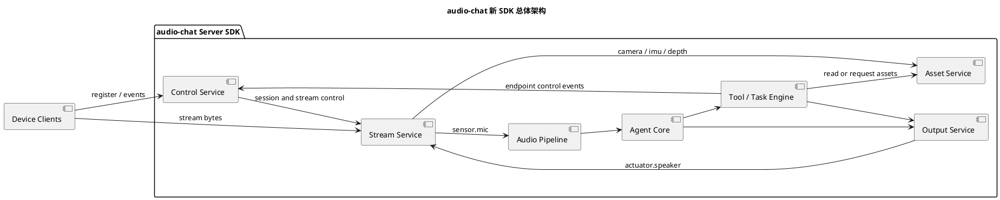

这张图只表达主干关系：

1. 端侧通过控制事件和 stream 字节接入 server。
2. `sensor.mic` 走音频主链路，进入 Agent Core。
3. 相机、IMU、深度等非音频输入走资产链路。
4. Tool / Task 既可以读取或请求资产，也可以通过 `UserDeviceContext` 提交端侧执行意图；具体控制事件由 Control Service 生成并下发。
5. Agent 和 Task 的用户可听输出统一经过输出链路，再以 `actuator.speaker` 下发端侧。

### 5.2 唤醒后连续对话时序

端侧不需要与 server 保持 24 小时音频 stream。推荐模型是：

1. 控制连接长期保持。
2. 端侧在本地等待唤醒。
3. 唤醒后打开 `sensor.mic` stream。
4. server 打开或复用 Agent Core 会话。
5. 连续对话期间维持音频 stream。
6. 用户结束连续对话、server 判定超时、端侧断开或模型异常时释放 stream。
7. 端侧回到下一次唤醒前等待。

参与组件：

| 组件 | 说明 |
| --- | --- |
| Endpoint | 任意端侧设备，例如 ESP32 眼镜、Web、iOS 或 Python 回放端。 |
| Control Service | 控制事件入口，负责设备注册、订阅、用户唤醒、音频会话打开和关闭等控制面事件。 |
| Stream Service | stream 字节入口，负责 `sensor.mic` 和 `actuator.speaker` 等 stream 的打开、写入、关闭。 |
| Audio Pipeline | 音频主链路，负责 `sensor.mic` 的格式归一、质量诊断和路由；文本链路的 ASR / turn boundary 由 `TextAgentCore` 内部完成。 |
| Agent Core | 大模型对话核心，可以是 `RealtimeAudioAgentCore` 或 `TextAgentCore`。 |
| Output Service | 输出链路，负责把 Agent / Task 的输出交给播放仲裁，并最终写入 `actuator.speaker` stream。 |

说明：这张图只表达连续对话主干。`Output Service` 在这里是折叠节点，它内部包含 `Output Router` 和 `Playback Arbiter`。`RealtimeOutputAdapter`、`TextOutputAdapter` 是各自 Agent Core 的内部实现，不在主干时序图中展开；详细输出链路见第 12 章。

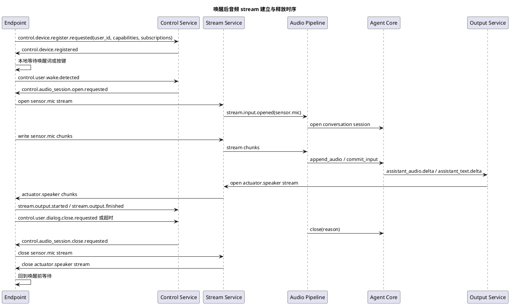

### 5.3 音频会话释放策略

server 可以释放音频会话的情况：

1. 用户显式说“结束对话”。
2. 端侧上报 `control.user.dialog.close.requested`。
3. 连续静默超时。
4. 设备控制连接断开。
5. 模型 provider session 不可恢复。
6. 播放队列清空且会话无活动输入超过阈值。

释放时必须下发：

1. `control.audio_session.close.requested`
2. 对仍打开的输入 stream 下发或记录 `stream.input.closed`
3. 对仍打开的输出 stream 下发 `stream.output.close.requested`，最终记录 `stream.output.closed` 或 `stream.output.cancelled`

## 6. 协议与约定

本章只定义对外协议契约，不描述 server 内部实现。Control Service、Stream Service、Audio Pipeline、Asset Service、Agent Core、Output Service 的内部实现分别放在后续模块章节中。

### 6.1 Event 信封

所有控制事件统一使用事件信封。事件信封只描述事件内容，不描述接收方：

```json
{
  "version": "audio-chat.v1",
  "event_id": "evt_01H...",
  "event_name": "stream.output.open.requested",
  "timestamp_ms": 1760000000000,
  "user_id": "user-001",
  "producer_id": "server-main",
  "session_id": "sess_01H...",
  "stream_id": "stream_out_01H...",
  "payload": {}
}
```

字段说明：

| 字段 | 说明 |
| --- | --- |
| `event_name` | 事件名，支持层级命名和通配订阅。 |
| `user_id` | 事件所属用户。 |
| `producer_id` | 事件生产者编号，例如 `server-main` 或某个端侧 `device_id`。 |
| `session_id` | 可选语音或交互会话。 |
| `stream_id` | 可选 stream。 |
| `payload` | 小型结构化数据，不放大媒体字节。 |

约定：

1. 不使用 `source_device_id` / `target_device_id` 作为事件字段。
2. `producer_id` 只表示谁产生事件，不表示谁接收事件。
3. 事件接收方由 Control Service 根据设备注册时提交的订阅策略解析，不写进事件信封，也不由业务代码硬编码。
4. 如果事件需要描述某个业务对象，优先使用已有字段，例如 `stream_id`、`session_id`、`task_id`；没有专用字段时放入 `payload`。第一版不引入额外 `subject` 字段。
5. 媒体大字节不进入 Event 信封，必须走 Stream Service。

### 6.2 事件命名规范

事件名采用小写点分层级。命名必须先回答“事件属于哪个平面”，再回答“事件描述哪个资源”，最后回答“发生了什么动作”。

```text
<plane>.<resource>.<action>[.<detail>]
```

第一层 `plane` 只允许以下几类：

| 第一层 | 边界 | 示例 |
| --- | --- | --- |
| `control` | 端侧注册、心跳、用户会话、音频会话等控制面事件。 | `control.device.registered` |
| `stream` | stream 生命周期、stream 数据到达、stream 控制请求。 | `stream.input.opened` |
| `agent` | Agent Core 的输入提交、模型响应、工具桥接状态。 | `agent.response.started` |
| `tool` | server 侧工具调用生命周期。 | `tool.call.completed` |
| `task` | server 侧长任务生命周期和状态变化。 | `task.state.changed` |
| `memory` | 长期记忆读写、检索和整理。 | `memory.write.completed` |
| `system` | 系统错误、降级、健康状态和诊断。 | `system.error.raised` |

不再把 `device.*`、`user.*`、`audio.*` 放在第一层，因为这些概念属于控制面资源，应该放在 `control.<resource>.*` 下。例如：

| 旧式平铺命名 | 新命名 |
| --- | --- |
| `device.registered` | `control.device.registered` |
| `user.wake.detected` | `control.user.wake.detected` |
| `audio.session.open` | `control.audio_session.open.requested` |

第二层 `resource` 的含义由第一层决定：

| 第一层 | 第二层资源 |
| --- | --- |
| `control` | `device`、`user`、`audio_session`、`subscription` |
| `stream` | `input`、`output`、`control` |
| `agent` | `session`、`input`、`response`、`transcript`、`tool_bridge` |
| `tool` | `call`、`result` |
| `task` | `instance`、`state`、`event` |
| `memory` | `read`、`write`、`search` |
| `system` | `health`、`error`、`degradation` |

第三层 `action` 使用稳定动词或状态词：

| 动作 | 使用场景 |
| --- | --- |
| `requested` | server 请求某事发生，例如请求打开音频会话。 |
| `opened` / `closed` | 会话或 stream 生命周期。 |
| `started` / `completed` / `failed` | 调用、任务、响应生命周期。 |
| `changed` | 状态变化。 |
| `detected` | 端侧或 server 检测到事实。 |
| `cancelled` | 被取消。 |
| `received` | server 收到数据或事件。 |

命名原则：

1. 第一层必须先确定事件平面，不按业务名随意开新顶级域。
2. 第二层必须是该平面下的资源对象。
3. 第三层必须表达事实或请求，不使用模糊名词。
4. 控制请求使用 `requested`，事实确认使用 `opened`、`closed`、`completed` 等状态词。
5. stream 具体类型不放进事件名，放在 `stream_type` 字段，例如 `stream.input.opened + stream_type=sensor.rgb`。
6. 同一对象生命周期应成对命名，例如 `requested` / `opened` / `closed` / `failed`。

第一版内置事件清单：

设备生命周期：

| 事件 | 生产者 | 说明 |
| --- | --- | --- |
| `control.device.register.requested` | device | 注册设备、能力、订阅和 token。 |
| `control.device.registered` | server | 注册成功。 |
| `control.device.register.failed` | server | 注册失败。 |
| `control.device.heartbeat.received` | device | server 收到设备心跳。 |
| `control.device.state.changed` | device/server | 端侧或 server 记录的设备状态变更。 |

用户与会话：

| 事件 | 生产者 | 说明 |
| --- | --- | --- |
| `control.user.wake.detected` | device | 端侧检测到唤醒。 |
| `control.user.dialog.close.requested` | device/server | 用户或 server 结束连续对话。 |
| `control.audio_session.open.requested` | server | 要求被投递到的端侧打开音频会话。 |
| `control.audio_session.opened` | device | 端侧确认音频会话已打开，`producer_id` 是该端侧设备编号。 |
| `control.audio_session.close.requested` | server | server 要求被投递到的端侧释放会话。 |
| `control.audio_session.closed` | device | 端侧确认关闭，`producer_id` 是该端侧设备编号。 |
| `control.user.interrupt.detected` | device/server | 用户打断或 server 侧取消。 |

Stream：

| 事件 | 生产者 | 说明 |
| --- | --- | --- |
| `stream.input.opened` | device | 端侧已打开输入 stream。 |
| `stream.input.closed` | device/server | 输入 stream 关闭。 |
| `stream.input.failed` | device/server | 输入 stream 失败。 |
| `stream.output.open.requested` | server | server 要求端侧准备消费输出 stream。 |
| `stream.output.close.requested` | server | server 请求端侧关闭输出 stream。 |
| `stream.output.closed` | device/server | 输出 stream 已关闭。 |
| `stream.output.cancel.requested` | server | server 请求端侧取消输出 stream。 |
| `stream.output.cancelled` | server | 输出 stream 被取消。 |
| `stream.output.started` | device | 端侧开始播放或执行。 |
| `stream.output.finished` | device | 端侧播放或执行完成。 |
| `stream.output.failed` | device | 端侧播放或执行失败。 |
| `stream.control.configure.requested` | server | server 请求端侧调整某类 stream 策略，例如通过 `stream_type=sensor.rgb` 请求 RGB 相机单帧或连续上传。 |

Agent、Tool、Task 和系统事件：

| 事件 | 生产者 | 说明 |
| --- | --- | --- |
| `agent.response.started` | server | Agent 开始响应。 |
| `agent.response.completed` | server | Agent 响应完成。 |
| `tool.call.started` | server | 工具调用开始。 |
| `tool.call.completed` | server | 工具调用完成。 |
| `task.state.changed` | server | 任务状态变更。 |
| `system.error.raised` | server | 系统错误。 |

### 6.3 订阅声明

设备注册时提交订阅。订阅只表达“我能处理哪些事件”，不表达“谁应该收到某次事件”。

```json
{
  "event": "stream.output.*",
  "filter": {
    "stream_type": "actuator.speaker"
  }
}
```

或：

```json
{
  "event": "stream.control.*",
  "filter": {
    "stream_type": "sensor.rgb"
  }
}
```

订阅由 `event` 和可选 `filter` 组成。只有事件名称匹配 `event`，并且事件字段同时满足 `filter`，订阅才命中。

`event` 支持：

1. 精确匹配，例如 `stream.output.open.requested`。
2. 前缀通配，例如 `stream.output.*`。
3. 全部事件调试订阅，例如 `*`，只建议 mock 或调试工具使用。

`filter` 第一版只支持字段等值匹配和数组包含匹配，不支持 `and/or/not`、比较运算、正则或脚本表达式。多个字段天然是 `AND` 关系。

filter 字段路径可以引用事件信封字段和 `payload` 内字段：

| 写法 | 匹配字段 |
| --- | --- |
| `producer_id` | 事件信封中的 `producer_id`。 |
| `stream_type` | 事件信封或 stream 元数据中的 `stream_type`。 |
| `payload.mode` | `payload.mode`。 |
| `capabilities.streams.produce` | `payload.capabilities.streams.produce` 或设备状态快照中的同名字段。 |

示例：

```python
subscriptions=[
    Subscription(event="stream.output.*", filter={"stream_type": "actuator.speaker"}),
    Subscription(event="stream.control.*", filter={"stream_type": "sensor.rgb"}),
    Subscription(event="control.user.state.changed"),
]
```

这样开发者只表达“我能处理哪些事件”。某次事件最终推给哪些设备，由 Control Service 根据在线设备和订阅策略自动解析。如果多个设备都匹配，第一版默认都收到；如果某个 Tool 只需要一个结果，应由 Tool 或 Asset Service 在收到多个资产后选择最新、质量最高或优先级最高的结果。

### 6.4 Stream 格式协商

第一版推荐默认音频格式：

| 方向 | codec | sample_rate | channels | chunk_ms |
| --- | --- | --- | --- | --- |
| 上行 `sensor.mic` | `pcm16le` | `16000` | `1` | `20` |
| 下行 `actuator.speaker` | `pcm16le` | `16000` 或 `24000` | `1` | `20` 或 `40` |

说明：

1. ESP32 播放链路可优先使用 16 kHz。
2. OpenAI Realtime PCM 输出常见为 24 kHz，server 可按端侧声明重采样。
3. Qwen Omni Realtime 的音频输入输出可通过 session 配置声明。

## 7. Control Service

### 7.1 职责

Control Service 是控制面入口，负责设备注册、鉴权、在线状态、订阅索引、事件发布和推送。它不传输音频、图片或其他媒体大字节。

职责：

1. 处理 `control.device.register.requested`，建立 `user_id` 下的在线设备记录。
2. 保存设备能力和订阅策略。
3. 维护控制连接和心跳。
4. 校验并发布控制事件。
5. 根据订阅策略解析接收设备，并推送事件。
6. 维护用户消息索引和必要的控制面调试快照。

不负责：

1. 不处理 stream chunk。
2. 不做音频 ASR / TTS。
3. 不决定业务 Tool 是否调用。
4. 不缓存图片、IMU、深度图等资产。

### 7.2 内部类图

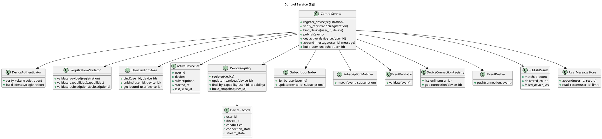

### 7.3 设备注册、验证与用户绑定

设备注册是 Control Service 的第一步。注册成功后，设备才会进入某个 `user_id` 的 active device set，并参与后续事件订阅、stream 打开、任务执行和输出播放。

注册请求必须包含：

```json
{
  "event_name": "control.device.register.requested",
  "user_id": "user-001",
  "producer_id": "dev-esp32-glass-001",
  "payload": {
    "device_id": "dev-esp32-glass-001",
    "device_name": "elio-glass",
    "client_type": "esp32-glass",
    "sdk_version": "audio-chat-endpoint-0.1.0",
    "auth": {
      "mode": "static_token",
      "token": "pair-demo-token"
    },
    "capabilities": {
      "streams.produce": ["sensor.mic", "sensor.rgb"],
      "streams.consume": ["actuator.speaker", "actuator.haptic"],
      "audio.wake_word": "endpoint",
      "audio.aec": "endpoint",
      "sensor.rgb": true
    },
    "subscriptions": [
      {"event": "control.audio_session.*"},
      {"event": "stream.output.*", "filter": {"stream_type": "actuator.speaker"}},
      {"event": "stream.control.*", "filter": {"stream_type": "sensor.rgb"}}
    ]
  }
}
```

字段约束：

| 字段 | 说明 |
| --- | --- |
| `user_id` | 要绑定到的用户。第一版由端侧配置或配对流程写入，不从模型或业务 Tool 推断。 |
| `producer_id` | 事件生产者，必须等于 `payload.device_id`。 |
| `payload.device_id` | 设备稳定标识。由开发者或端侧生成，不能作为事件接收方字段使用。 |
| `payload.device_name` | 人可读名称，只用于调试和设备列表。 |
| `payload.client_type` | 端侧实现标识，例如 `esp32-glass`、`ios-phone`、`python-playback`；只用于调试、兼容和默认配置，不作为强设备类型路由。 |
| `payload.sdk_version` | 端侧协议版本，用于兼容检查。 |
| `payload.auth` | 注册鉴权信息。不同鉴权模式字段不同。 |
| `payload.capabilities` | 设备能力声明。 |
| `payload.subscriptions` | 设备订阅声明。 |

注册处理流程：

```text
输入：control.device.register.requested
1. 校验事件信封：event_name、user_id、producer_id、payload.device_id 必须存在。
2. 校验 producer_id == payload.device_id。
3. 校验协议版本和 sdk_version 是否兼容。
4. 校验 auth：
   - static_token：检查配置中的 auth.device_tokens[device_id] 是否匹配。
   - signed_token：校验签名、过期时间、user_id 和 device_id。
   - disabled：只允许测试环境。
5. 校验 capabilities：stream 类型必须是内置或已注册扩展类型，不能声明未知硬件能力。
6. 校验 subscriptions：事件名必须符合命名规范，filter 只能使用第一版支持的字段等值或数组包含匹配。
7. 绑定 user_id 和 device_id：
   - 首次注册：写入 UserBindingStore。
   - 已绑定同一 user_id：刷新在线状态和能力。
   - 已绑定其他 user_id：拒绝注册，返回 control.device.register.failed。
8. 如果 user.active_device_set_policy=single，确保该 user_id 只有一个 active device set；新设备加入当前集合，不创建第二个集合。
9. 写入 DeviceRegistry、SubscriptionIndex、DeviceConnectionRegistry。
10. 返回 control.device.registered，payload 包含 server 分配的 connection_id、心跳间隔和生效配置。
```

注册成功响应：

```json
{
  "event_name": "control.device.registered",
  "user_id": "user-001",
  "producer_id": "server-main",
  "payload": {
    "device_id": "dev-esp32-glass-001",
    "connection_id": "conn_01H...",
    "heartbeat_interval_seconds": 10,
    "server_time_ms": 1760000000000,
    "effective_config": {
      "control.heartbeat_timeout_seconds": 30,
      "stream.max_chunk_bytes": 8192
    }
  }
}
```

注册失败响应：

```json
{
  "event_name": "control.device.register.failed",
  "user_id": "user-001",
  "producer_id": "server-main",
  "payload": {
    "device_id": "dev-esp32-glass-001",
    "reason": "invalid_token",
    "message": "设备 token 不匹配"
  }
}
```

绑定策略：

1. `device_id` 不能同时绑定多个 `user_id`。
2. 同一个 `user_id` 可以绑定多台设备，它们共同组成 active device set。
3. 设备重新连接时，如果 `device_id` 和 `user_id` 与历史绑定一致，允许覆盖旧连接并刷新能力和订阅。
4. 如果同一个 `device_id` 使用不同 `user_id` 注册，默认拒绝；需要迁移用户时必须走显式解绑或重新配对流程。
5. 设备离线不等于解绑。离线只从 active device set 中移除在线连接；历史绑定仍保留。
6. 解绑会删除 UserBindingStore 中的绑定关系，并强制关闭该设备控制连接和相关 stream。

鉴权模式：

| 模式 | 场景 | 说明 |
| --- | --- | --- |
| `static_token` | 本地联调、固定设备 demo | server 配置 `auth.device_tokens`，设备注册时提交 token。 |
| `signed_token` | 正式部署 | 配对服务或管理端生成短期签名 token，token 内包含 `user_id`、`device_id`、过期时间。 |
| `disabled` | 单元测试、离线回放 | 不校验 token，只能在测试配置中开启。 |

调试与管理接口：

| API | 说明 |
| --- | --- |
| `GET /api/debug/devices` | 查看全部设备注册、在线、绑定和能力状态。 |
| `GET /api/debug/users/{user_id}` | 查看某个用户的 active device set、订阅和消息状态。 |
| `POST /api/admin/devices/{device_id}/unbind` | 显式解绑设备。第一版可只提供本地开发接口，正式部署应接入管理鉴权。 |

### 7.4 事件发布与分发

Control Service 的公开接口保持简单：

```python
class ControlService:
    def publish(self, event: Event) -> PublishResult: ...
```

`publish()` 不接受 `device_id`、`target`、`audience` 之类参数。接收方完全由订阅策略解析：

```text
输入：event
1. 校验 event.user_id、event.event_name、event.producer_id。
2. 读取 user_id 下在线设备。
3. 排除 producer 自身，除非订阅声明 allow_self=true。
4. 对每个设备读取注册时提交的 subscriptions。
5. 先匹配 event 名称。
6. 再匹配 filter 字段。
7. 将事件推送给所有匹配设备。
8. 返回 PublishResult，包含 matched_count、delivered_count、failed_device_ids。
```

server 发布事件时不指定接收设备：

```python
result = control_service.publish(Event(
    event_name="stream.control.configure.requested",
    user_id=user_id,
    producer_id="server-main",
    stream_type="sensor.rgb",
    payload={"mode": "single", "max_samples": 1},
))
```

推送失败处理：

1. 单个设备推送失败，不影响其他匹配设备。
2. 控制连接已断开时，标记设备离线，并返回到 `failed_device_ids`。
3. 第一版不做离线控制事件持久队列；需要持久化的长期任务状态由 Task Engine 记录。
4. Control Service 调试日志只记录事件元数据和匹配结果，不记录音频、图片等大字节内容。

### 7.5 与其他模块的边界

| 模块 | 边界 |
| --- | --- |
| Stream Service | 负责字节 stream，不通过 Control Service 传输媒体大字节。 |
| Audio Pipeline | 消费 `sensor.mic` stream，不负责设备注册和事件订阅。 |
| Asset Service | 通过 Control Service 请求端侧上传资产，资产数据仍走 Stream Service。 |
| Tool / Task | 只通过 `UserDeviceContext`、`DeviceHandle`、`EndpointTaskRef` 或 `OutputIntent` 提交业务意图，不直接找设备连接，也不手写控制事件。 |
| Output Service | 生成并仲裁输出音频，最终通过 Stream Service 写入 `actuator.speaker`。 |

## 8. Stream Service

### 8.1 为什么统一为 Stream Service

上一版使用 `Media Plane` 表达音频和视频字节通道。新 SDK 对外统一使用 `Stream Service`，但不能把所有 stream 都放进同一条 Agent 输入链路。原因是：

1. 输入不只有音频，还有 RGB 相机、深度相机、IMU、GPS、按钮等。
2. 输出不只有音频，还有振动、双声道播放器、屏幕、手机 UI 等执行器。
3. 开发者更容易理解“打开一个 stream、写入 stream、关闭 stream”，而不是先理解 frame 和旧版 media plane。

stream 类型按端侧硬件角色分两类：

1. `sensor.*`：端侧感知器产生的数据，例如麦克风、RGB 相机、深度相机、IMU。
2. `actuator.*`：server 下发给端侧执行器的数据，例如扬声器、振动器。

其中 `sensor.mic` 和 `actuator.speaker` 共同组成对话音频主链路；`sensor.rgb`、`sensor.depth`、`sensor.imu` 默认进入 `Asset Service` 和 `Asset Store`，等待 Tool、Task 或模型上下文按需取用。

底层仍然可以使用二进制 chunk。新版统一称为 `StreamChunk`；旧版 `Frame`、`MediaFrame` 只作为迁移期历史概念出现，不是业务 API。

`Stream Service` 不负责理解业务资产，也不负责决定音频进入哪种 Agent Core。它只负责连接、stream 生命周期和 chunk 收发。输入 chunk 到达后，由 `Stream Dispatcher` 根据 `stream_type` 做机械分发：

1. `sensor.mic` 分发给 `Audio Pipeline`。
2. `sensor.rgb`、`sensor.depth`、`sensor.imu` 分发给 `Asset Service`，写入 `Asset Store`。
3. 未识别或未授权的 `stream_type` 拒绝、关闭或记录为协议错误。

因此总体架构中的关系不是“Stream Service 依赖 Asset Service”，而是“Stream Service 收到字节后交给 Dispatcher，Dispatcher 把非音频主链路的数据交给 Asset Service”。

### 8.2 Stream 类图

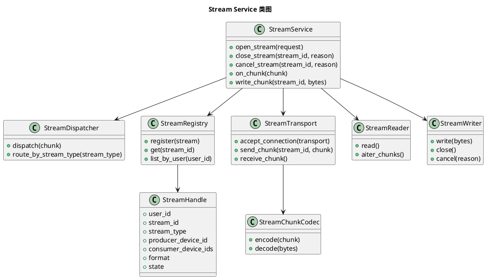

### 8.3 Stream 类型

感知器 stream：

| Stream 类型 | 方向 | 示例 |
| --- | --- | --- |
| `sensor.mic` | endpoint -> server | 唤醒后上传 AEC 后麦克风 PCM，属于对话音频主链路。 |
| `sensor.rgb` | endpoint -> server | RGB 相机图像资产 stream，既可单帧也可连续视频。 |
| `sensor.depth` | endpoint -> server | 深度相机资产 stream。 |
| `sensor.imu` | endpoint -> server | IMU / heading / motion 资产 stream。 |

执行器 stream：

| Stream 类型 | 方向 | 示例 |
| --- | --- | --- |
| `actuator.speaker` | server -> endpoint | assistant 或通知播报音频，属于对话音频主链路。 |
| `actuator.haptic` | server -> endpoint | 振动执行器输出。 |

### 8.4 对话音频和对话资产分流

麦克风虽然也是端侧传感器，但它是整个系统交互的核心依赖，所以 `sensor.mic` 有专用链路：

1. `sensor.mic` 进入 `Audio Pipeline`。
2. 如果 Agent Core 支持原生音频输入，音频 delta 直连进入 `RealtimeAudioAgentCore`。
3. 如果 Agent Core 只支持文本输入，归一后的音频进入 `TextAgentCore`，由其内部 `AsrPipeline` 和 `TextTurnBoundary` 完成 ASR / turn commit。
4. `actuator.speaker` 从模型原生音频或 streaming TTS 进入 `Output Router` 和 `Playback Arbiter`。

相机、深度相机、IMU、GPS 等不是每轮对话的必需输入，不应默认进入 Agent Core。它们更适合作为对话资产：

1. 端侧主动上传时，server 把 chunk 组装成 `AssetRef`，写入 `Asset Store`。
2. Agent、Tool、Task 需要时，通过 `AssetService` 查询最近资产，例如最近一张 RGB 图、最近 2 秒 IMU 片段、最近一帧深度图。
3. 如果缓存里没有满足条件的资产，Tool 通过 `UserDeviceContext` 请求资产；Control Service 再生成 stream 控制事件，请端侧建立或恢复对应 stream 获取数据。
4. 获取到的数据仍然先进入 `Asset Store`，Tool 拿到的是资产引用，而不是直接拿传感器连接。

### 8.5 传感器资产 stream 生命周期

相机、深度相机、IMU、麦克风都在端侧，但除 `sensor.mic` 之外，其他传感器默认按资产 stream 处理。server 不应把某个传感器动作设计成特殊 RPC，例如 `capture_photo`。统一模型是：

1. 端侧根据能力和功耗策略决定何时保持底层硬件打开。
2. 端侧根据唤醒、用户操作、本地策略或 server stream 控制事件决定何时向 server 打开资产 stream。
3. server 通过 `stream.control.*` 事件调整采集模式，例如单帧、低频连续、高频连续、停止上传。
4. 真实数据始终通过 stream chunk 上传，并由 `Asset Service` 写入资产缓存。
5. server 侧 Tool 或 Task 只等待或读取资产，不直接控制硬件。

RGB 相机单帧采集示例：

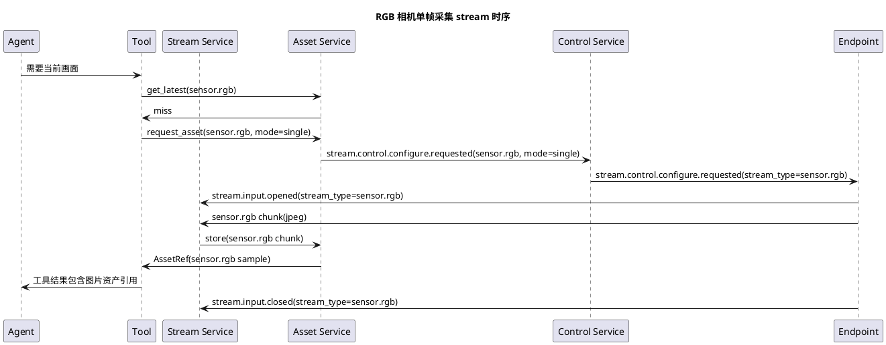

### 8.6 Stream Chunk 内部格式

对外 API 使用 stream。内部 WebSocket binary message 可继续采用：

```text
+----------------------+---------------------+------------------+
| 4 bytes header_len   | header_json bytes   | payload bytes    |
+----------------------+---------------------+------------------+
```

`header_json`：

```json
{
  "version": "audio-chat.v1",
  "user_id": "user-001",
  "session_id": "sess_01H...",
  "stream_id": "stream_in_01H...",
  "stream_type": "sensor.mic",
  "seq": 12,
  "timestamp_ms": 1760000000000,
  "codec": "pcm16le",
  "sample_rate": 16000,
  "channels": 1,
  "duration_ms": 20,
  "payload_size": 640,
  "final": false
}
```

## 9. Audio Pipeline

### 9.1 职责

`Audio Pipeline` 只处理 `sensor.mic`。它是对话主链路的一部分，不处理 `sensor.rgb`、`sensor.depth`、`sensor.imu` 等资产 stream。

职责：

1. 校验音频 stream 格式。
2. 重采样。
3. 声道转换。
4. 音量归一。
5. 可选噪声抑制。
6. 可选质量诊断 VAD，用于判断静音、音量和链路健康。
7. 可选 ASR sidecar，仅用于调试转写或质量诊断，不作为 `TextAgentCore` 主链路输入。
8. 根据 Agent Core 类型把归一后的音频路由到 `RealtimeAudioAgentCore` 或 `TextAgentCore`。

不负责：

1. 不做端侧 AEC。
2. 不决定 Tool 是否调用。
3. 不决定输出播放优先级。
4. 不缓存图片、深度图、IMU 等对话资产。
5. 不负责文本链路的主 ASR 和 turn boundary，这部分属于 `TextAgentCore`。

音频链路分两条：

1. 直连链路：`sensor.mic` -> 格式归一 / 质量诊断 -> `RealtimeAudioAgentCore.append_audio()`。
2. 文本链路：`sensor.mic` -> 格式归一 / 质量诊断 -> `TextAgentCore.append_audio_event()`，再由 `TextAgentCore` 内部完成 ASR / turn commit。

### 9.2 类图

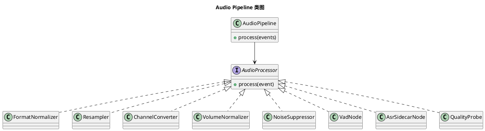

### 9.3 配置示例

```yaml
stream:
  sensor_mic:
    expected_codec: pcm16le
    expected_sample_rate: 16000
    expected_channels: 1
  preprocess:
    resample: auto
    volume_normalize: true
    noise_suppression: optional
    vad: endpoint_or_server
    asr_sidecar: optional
    aec: endpoint_only
```

`aec: endpoint_only` 的含义是：server 只根据端侧声明和音频质量做诊断或降级，不尝试替代端侧做回声消除。

## 10. Asset Service

### 10.1 职责

`Asset Service` 处理非音频主链路的输入 stream。它的目标不是实时驱动对话 turn，而是把端侧上传的数据变成可引用、可过期、可检索的对话资产。

职责：

1. 接收 `sensor.rgb`、`sensor.depth`、`sensor.imu` 等资产 stream。
2. 将 stream chunk 组装成 `AssetRef` 或时间片资产。
3. 写入 `Asset Store`，按 `user_id`、`device_id`、`stream_type`、`session_id`、时间戳建立索引。
4. 为 Tool、Task 和模型上下文提供查询接口。
5. 当缓存没有满足条件的资产时，通过 Control Service 发布控制事件，请求端侧上传。
6. 根据 TTL、容量和隐私策略淘汰资产。

不负责：

1. 不做音频 VAD / ASR。
2. 不把所有传感器数据默认塞进模型上下文。
3. 不绕过端侧功耗策略直接控制硬件。

### 10.2 类图

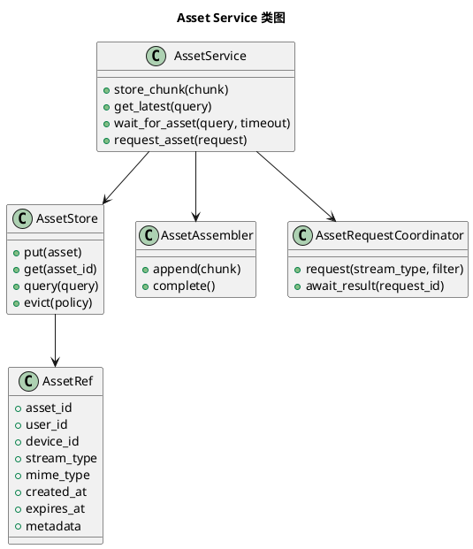

### 10.3 资产获取策略

Tool 或 Task 获取传感器数据时，应优先读取缓存，再按需请求端侧：

```text
1. 查询 Asset Store 是否已有满足条件的资产。
2. 如果命中，直接返回 AssetRef。
3. 如果未命中，根据 capability 和 subscription 找到可提供该 stream 的设备。
4. 发送 stream.control.configure.requested 事件，请端侧上传单帧或短时间片。
5. 等待 Asset Service 写入 Asset Store。
6. 返回 AssetRef，或在超时后返回明确失败原因。
```

示例接口：

```python
asset = await context.assets.get_or_request(
    stream_type="sensor.rgb",
    freshness_seconds=3,
    request={"mode": "single", "max_samples": 1},
    timeout_seconds=5,
)
```

IMU 和深度相机可以使用时间片资产：

```python
motion = await context.assets.get_or_request(
    stream_type="sensor.imu",
    window_seconds=2,
    freshness_seconds=1,
    request={"mode": "window", "sample_rate_hz": 50},
    timeout_seconds=3,
)
```

### 10.4 与 Agent Core 的关系

Agent Core 不应直接接收所有资产 stream。推荐关系是：

1. `RealtimeAudioAgentCore` 只直连音频主链路。
2. `TextAgentCore` 接收归一后的 `sensor.mic` 音频，并在内部完成 ASR、turn boundary 和文本模型循环。
3. 图片、深度图、IMU 作为 Tool 调用结果或上下文附件进入模型请求。
4. 未来如果模型支持实时视觉输入，可以新增 `RealtimeMultimodalAgentCore`，但也应明确哪些视觉 stream 进入实时链路，不能默认把所有资产推给模型。

## 11. Agent Core

### 11.1 Agent Core 抽象

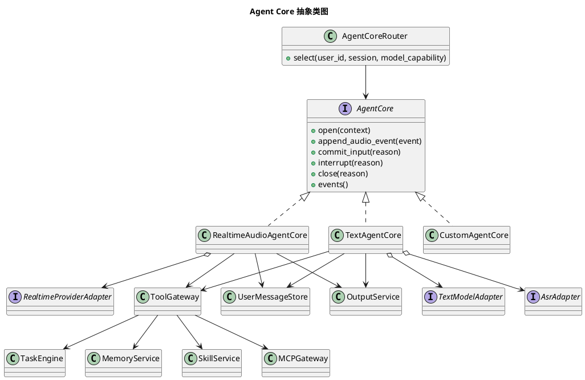

说明：

1. `SkillService` 不应成为 Agent Core 的特殊直连依赖。
2. Skill 会影响工具白名单、工具说明、提示词片段和运行约束，因此由 `ToolGateway` 或更上层 `AgentContextBuilder` 统一读取。
3. 文档类图里把 `SkillService` 挂在 `ToolGateway` 下，是为了强调它和 Memory/MCP/Task 一样属于 Agent Core 的共享上下文与能力面，而不是某个 Agent Core 的私有实现。

核心关系：

1. `RealtimeAudioAgentCore` 和 `TextAgentCore` 是并列的 `AgentCore` 实现，由 `AgentCoreRouter` 根据模型能力和配置选择其中一个。
2. `RealtimeProviderAdapter` 不是 Agent Core，也不是 `TextAgentCore` 的后续步骤；它只是 `RealtimeAudioAgentCore` 内部用来适配外部 realtime 模型供应商协议的接口。
3. 文本模型也有自己的 provider 适配接口，例如 `TextModelAdapter`、`AsrAdapter`。它们和 `RealtimeProviderAdapter` 处在同一抽象层，都是“外部服务适配器”。Streaming TTS 不属于 `TextAgentCore`，统一由 `Output Service` 内部的 `Output Router` 持有。
4. 一个请求不会先经过 `RealtimeAudioAgentCore` 再进入 `TextAgentCore`。两者是两条不同链路：原生音频模型走 realtime 链路，只支持文本模型时走 `TextAgentCore` 内部 ASR + Text Agent + Output Service TTS 链路。

统一事件：

| 事件 | 说明 |
| --- | --- |
| `input_transcript.delta` | 用户输入转写增量，可选。 |
| `input_transcript.done` | 用户输入转写完成，可选。 |
| `assistant_text.delta` | 模型文本输出增量。 |
| `assistant_text.done` | 模型文本输出完成。 |
| `assistant_audio.delta` | 模型或 TTS 音频输出增量。 |
| `assistant_audio.done` | 当前音频输出完成。 |
| `tool_call.started` | 工具调用开始。 |
| `tool_call.delta` | 工具参数增量。 |
| `tool_call.completed` | 工具调用完成。 |
| `tool_call.failed` | 工具调用失败。 |
| `response.done` | 当前模型响应完成。 |
| `session.error` | 会话异常。 |

### 11.2 RealtimeAudioAgentCore

定位：

1. 面向 Qwen Omni Realtime、OpenAI Realtime、以及其他支持原生音频输入输出的模型。
2. 维持 provider 模型长连接。
3. stream 输入直接进入模型。
4. 模型直接输出 audio delta 时，不经过 TTS。
5. 工具调用由 provider realtime event 驱动。

内部模块：

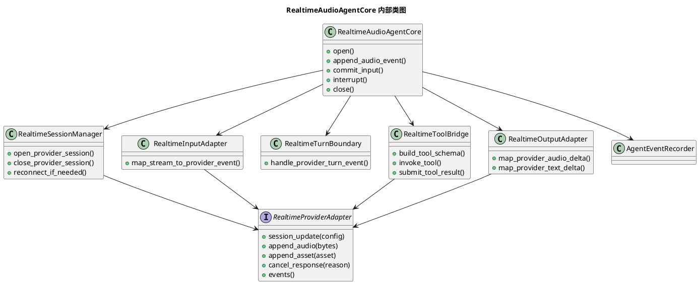

关系说明：

1. `RealtimeAudioAgentCore` 组合一个 `RealtimeProviderAdapter` 实例。
2. `RealtimeProviderAdapter` 负责把 OpenAI Realtime、Qwen Omni Realtime 等 provider 的 WebSocket 事件、音频格式、session 配置和工具调用协议转换成 SDK 内部统一事件。
3. `RealtimeSessionManager`、`RealtimeInputAdapter`、`RealtimeToolBridge`、`RealtimeOutputAdapter` 不各自创建 provider 连接，它们共享同一个 `RealtimeProviderAdapter`。
4. 如果要接入新的 realtime 模型，优先新增一个 `RealtimeProviderAdapter` 实现，而不是新增一个 Agent Core。
5. 只有当模型运行循环本身不同，例如不是长连接 realtime 语义，才新增新的 `AgentCore` 实现。

处理流程：

1. `RealtimeSessionManager` 打开 provider realtime session。
2. `RealtimeProviderAdapter` 发送 session 配置，包括 instructions、voice、音频格式、tool schema、turn detection。
3. `RealtimeInputAdapter` 将 `sensor.mic` stream chunk 映射为 provider audio append 事件。
4. 如果工具结果或上下文包含图片资产，按 provider 能力将 `AssetRef` 映射为 image input；不直接把相机 stream 全量接入实时模型。
5. `RealtimeTurnBoundary` 监听 provider VAD、input committed、response started、response done 等事件。
6. provider 产生 tool call 时，`RealtimeToolBridge` 调用统一 `ToolGateway`。
7. 工具结果回填 provider。
8. provider 产生 `audio_delta` 时，`RealtimeOutputAdapter` 立即转为 `assistant_audio.delta`。
9. provider 产生 `text_delta` 时，记录到 messages 和调试产物。
10. 用户打断时调用 provider cancel，并通知 Output Service 取消旧 output stream。

可复用组件：

1. `RealtimeProviderAdapter` 可支持 Qwen、OpenAI 或其他 provider。
2. `RealtimeToolBridge` 可被其他 realtime agent 复用。
3. `AgentEventRecorder` 可被所有 Agent Core 复用。
4. `RealtimeOutputAdapter` 的 provider 输出事件到统一 assistant delta 的映射可复用。

### 11.3 TextAgentCore

定位：

1. 面向只能接受文本输入，或文本工具循环更稳定的模型。
2. 音频先进入 ASR。
3. 文本进入 Agent Loop。
4. 输出文本 delta 实时交给 Output Service，由其内部 Output Router 送入 Streaming TTS。

内部模块：

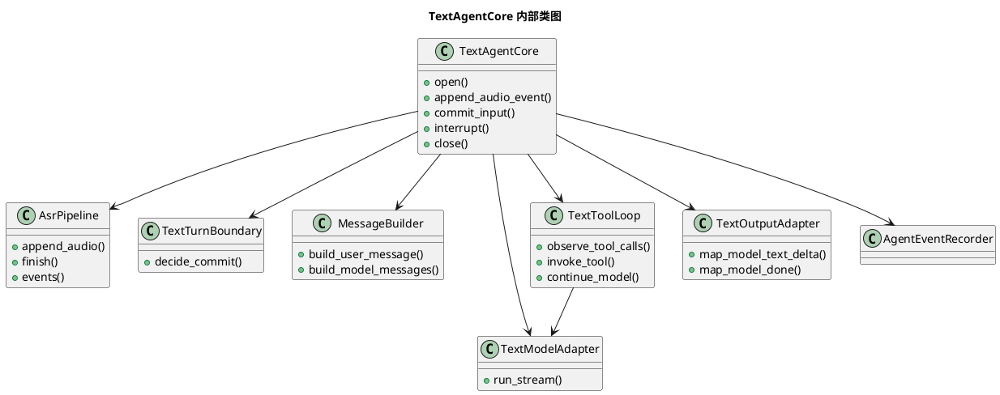

处理流程：

1. `AsrPipeline` 接收 `sensor.mic` stream chunk。
2. `TextTurnBoundary` 根据端侧 commit、server VAD 或最大静音时间决定提交一轮输入。
3. `AsrPipeline` 输出最终 transcript，也可输出转写增量用于日志。
4. `MessageBuilder` 将 transcript、近期 messages、memory、skill、设备上下文组装成模型输入。
5. `TextModelAdapter` 以流式方式调用文本模型。
6. `TextToolLoop` 观察工具调用，调用 `ToolGateway`，再继续模型循环。
7. 模型产生 `text_delta` 时，`TextOutputAdapter` 立即映射为统一 `assistant_text.delta`。
8. `assistant_text.delta` 交给 Output Service，由其内部 Output Router 调用 Streaming TTS 并生成 `assistant_audio.delta`。
9. 完整文本和音频索引写入 `UserMessageStore` 和 runs 产物。

可复用组件：

1. `AsrPipeline` 可给 `HybridAgentCore` 使用。
2. `MessageBuilder` 可给所有文本主导模型使用。
3. `TextToolLoop` 可给文本、视觉文本、多 agent 编排复用。
4. Streaming TTS 能力由 Output Router 统一持有，可给 task notification、tool progress 复用。

### 11.4 未来 Agent Core 扩展

自定义 Agent Core 只需要实现 `AgentCore` 接口，并在 `AgentCoreRouter` 注册：

```python
app.register_agent_core(
    name="my_realtime_core",
    factory=lambda deps: MyRealtimeAgentCore(deps),
    capability={
        "input": ["sensor.mic", "asset:sensor.rgb"],
        "output": ["actuator.speaker", "assistant_text"],
        "tool_calling": True,
    },
)
```

未来可能内置：

| Agent Core | 场景 |
| --- | --- |
| `VisionRealtimeAgentCore` | 视频 stream 直接进入多模态实时模型。 |
| `TranscriptOnlyAgentCore` | 只转写、摘要、归档，不输出语音。 |
| `HybridAgentCore` | 音频输入先 ASR，同时保留 native audio 给模型辅助。 |
| `WorkflowAgentCore` | 不直接调用 LLM，按确定性 workflow 和 task 编排运行。 |

## 12. Output Service

`Output Service` 是独立服务，负责所有 server 到端侧可听输出。它内部包含：

1. `Output Router`：输出生成层，把统一 assistant delta 或 `OutputIntent` 转成可播放音频来源。
2. `Playback Arbiter`：播放仲裁层，决定同一用户或同一端侧当前应该播放哪条输出。

Agent Core 内部的 `RealtimeOutputAdapter`、`TextOutputAdapter` 不属于 `Output Service`。它们只是各自 Agent Core 的内部适配器，负责把模型/provider 的原始输出事件归一化为 SDK 统一事件。

组件归属：

| 组件 | 归属 | 说明 |
| --- | --- | --- |
| `RealtimeOutputAdapter` | `RealtimeAudioAgentCore` 内部 | 将 realtime provider 的 `audio_delta` / `text_delta` 映射成统一 assistant delta。 |
| `TextOutputAdapter` | `TextAgentCore` 内部 | 将文本模型的 `text_delta` 映射成统一 `assistant_text.delta`。 |
| `Streaming TTS` | `Output Router` 内部依赖 | 将文本 delta 实时转成音频 delta，可被 agent reply、tool progress、task notification 复用。 |
| `Output Router` | `Output Service` 内部 | 选择 native audio、Streaming TTS 或缓存音频。 |
| `Playback Arbiter` | `Output Service` 内部 | 根据优先级和打断策略仲裁播放资源。 |

### 12.1 输出来源

server 可能同时产生多类输出：

| 来源 | 示例 |
| --- | --- |
| `agent_reply` | 模型最终回复。 |
| `tool_progress` | “我先看一下”。 |
| `task_notification` | 计时器到点、找物成功。 |
| `safety_alert` | 红绿灯、障碍物、安全提醒。 |
| `system_alert` | 设备断开、权限失败。 |

### 12.2 Output Router

`Output Router` 是输出生成层，不是播放仲裁层，也不是模型 provider 适配层。

职责：

1. 接收统一 `OutputIntent`。
2. 根据输出来源选择输出生成方式。
3. 对 Realtime 模型原生 `audio_delta` 直接透传。
4. 对文本模型 `text_delta` 实时调用 Streaming TTS。
5. 对短提示可使用缓存音频。
6. 把生成出的 output stream 交给 Playback Arbiter。

和相邻模块的分工：

| 模块 | 做什么 | 不做什么 |
| --- | --- | --- |
| `RealtimeOutputAdapter` | 把 provider 原生 realtime 事件映射成统一 `assistant_audio.delta` / `assistant_text.delta`。 | 不决定播放优先级，不直接写端侧 speaker stream。 |
| `TextOutputAdapter` | 把文本模型返回的 delta 映射成统一 `assistant_text.delta`。 | 不持有 TTS，不决定播放优先级。 |
| `Output Router` | 把统一输出事件或 `OutputIntent` 转成可播放的音频来源；native audio 透传，text delta 进入 Streaming TTS，短提示可走缓存音频。 | 不决定是否打断当前播放，不直接选择端侧硬件连接。 |
| `Playback Arbiter` | 对同一用户或同一端侧的播放资源做优先级仲裁，决定立即播放、排队、打断或丢弃。 | 不做 TTS，不理解 provider 原始事件。 |

因此链路是：

```text
Realtime provider event -> RealtimeOutputAdapter -> assistant_audio.delta -> Output Router -> Playback Arbiter -> Stream Service

Text model delta -> TextOutputAdapter -> assistant_text.delta -> Output Router -> Streaming TTS -> Playback Arbiter -> Stream Service
```

输出链路时序：

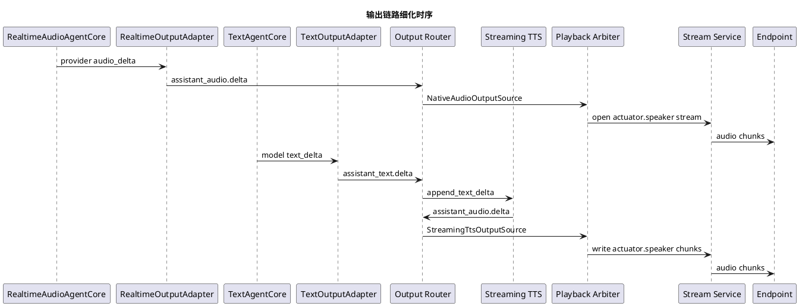

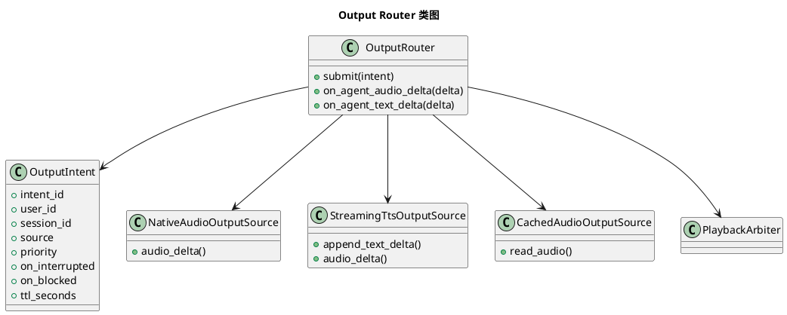

关键要求：

1. native audio delta 不等待 response done，立即进入 output stream。
2. text delta 不等待完整文本，立即进入 Streaming TTS。
3. TTS audio delta 不等待完整 WAV，立即进入 output stream。
4. 如果 provider 不支持流式 TTS，才允许在 `OutputIntent` 中标记 `streaming=false`，并在日志中记录延迟原因。

### 12.3 Playback Arbiter

Playback Arbiter 的决策类型是内部输出，不是给用户直接配置的值。开发者配置的是：

1. `priority`
2. `on_interrupted`
3. `on_blocked`
4. `dedupe_key`
5. `ttl_seconds`

Arbiter 根据当前播放租约、待播队列和新 intent 生成决策。

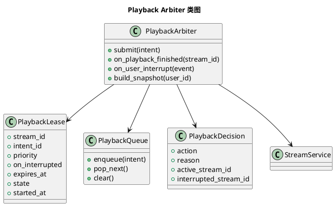

内部决策：

| 决策 | 说明 |
| --- | --- |
| `play_now` | 当前没有活动播放，立即打开新的 output stream。 |
| `queue` | 当前不能被抢占，新输出排队。 |
| `interrupt` | 新输出抢占旧输出。 |
| `drop` | 新输出被去重、过期或策略丢弃。 |
| `cancel_current` | 用户打断当前输出。 |
| `play_next` | 当前播放结束后播放队列下一项。 |

开发者设置：

| 字段 | 建议值 | 说明 |
| --- | --- | --- |
| `priority` | `low`、`normal`、`high`、`critical` | 表达业务重要性。 |
| `on_interrupted` | `drop`、`requeue`、`resume` | 当前播放被更高优先级输出打断后如何处理。第一版实现 `drop` 和 `requeue`，`resume` 作为后续扩展。 |
| `on_blocked` | `queue`、`drop` | 新输出优先级不足、不能抢占当前播放时如何处理。 |
| `dedupe_key` | 任意字符串 | 同类短时间通知去重。 |
| `ttl_seconds` | 秒 | 进入队列后超过该时间还未播放则丢弃。只有 `on_blocked=queue` 或 `on_interrupted=requeue` 时才有意义。 |

默认建议：

| 来源 | priority | on_interrupted | on_blocked | ttl_seconds |
| --- | --- | --- | --- | --- |
| 普通 Agent 回复 | `normal` | `drop` | `drop` | `0` |
| 工具进度提示 | `low` | `drop` | `drop` | `0` |
| 计时器到点 | `high` | `drop` | `queue` | `30` |
| 安全告警 | `critical` | `drop` | `queue` | `10` |
| 系统错误 | `high` | `drop` | `queue` | `30` |

仲裁规则：

1. 新输出的 `priority` 高于当前播放时，Playback Arbiter 产生 `interrupt` 决策。
2. 被打断的旧输出按旧输出自己的 `on_interrupted` 处理：`drop` 表示直接丢弃剩余音频；`requeue` 表示重新排队；`resume` 表示后续从断点恢复，第一版暂不实现。
3. 新输出的 `priority` 不高于当前播放时，按新输出自己的 `on_blocked` 处理：`queue` 表示进入队列；`drop` 表示直接丢弃。
4. 排队输出必须设置 `ttl_seconds`。队列弹出时如果已过期，Playback Arbiter 产生 `drop` 决策并记录原因。
5. 同级优先级默认不抢占，除非后续显式增加更细的策略字段；第一版不增加，避免 `priority` 和策略字段冲突。

### 12.4 插播和 stream 生命周期

插播不能直接把新音频写入已经打开的旧 output stream。原因：

1. 端侧无法知道旧语义已被中断。
2. 播放完成回执无法对应到正确内容。
3. 回放测试无法解释输出边界。
4. 未来 resume/pause 无法实现。

抢播时第一版必须执行：

1. 对旧 output stream 下发 `stream.output.cancelled`，payload 包含 `reason=interrupted_by_higher_priority`、`interrupted_by_intent_id` 和旧输出的 `on_interrupted` 处理结果。
2. 关闭或标记旧 stream 的 server writer。
3. 为新 intent 下发 `stream.output.open.requested`。
4. 将新音频 delta 写入新 output stream。
5. 新 stream 正常结束时下发 `stream.output.close.requested`，端侧完成后回报 `stream.output.closed`。

如果旧输出 `on_interrupted=requeue`，Arbiter 在新输出结束后重新打开一条新的 output stream 继续播放旧输出的剩余内容或重新生成内容。第一版不实现断点级恢复，因此 `requeue` 可以选择从剩余缓存开始，或由输出源重新生成一个新的 stream。后续如果要支持真正从断点恢复，应新增 `stream.output.paused` / `stream.output.resumed`，而不是把多个语义混进同一个 stream。

## 13. Tool、Task 和内置能力

### 13.1 Tool 模板

新 SDK 继续保留 Tool 概念，但简化开发者感知：

```python
class BaseTool:
    name: str
    description: str
    input_model: type[BaseModel]
    output_model: type[BaseModel] | None
    default_priority: str = "normal"

    def run(self, context: ToolContext, input_data: dict) -> ToolResult:
        ...
```

内置 Tool：

| Tool | 说明 |
| --- | --- |
| `get_or_request_asset` | 优先读取资产缓存；缓存未命中时请求端侧上传资产，例如 `sensor.rgb` 单帧图像。 |
| `configure_asset_stream` | 请求端侧调整某类资产 stream 的上传策略，例如单帧、连续、低频或停止。 |
| `start_endpoint_task` | 按 capability 选择端侧设备，并通过 `DeviceHandle` 启动端侧算力任务。 |
| `query_device_state` | 查询用户当前设备集合状态。 |
| `query_task_status` | 查询任务状态。 |
| `cancel_task` | 取消任务。 |
| `read_skill` | 读取受控 Skill。 |
| `memory_search` | 搜索长期记忆。 |
| `manage_memory` | 写入或整理长期记忆。 |

### 13.2 Task 模板

```python
class BaseTask:
    task_type: str
    description: str
    default_priority: str = "normal"

    def on_start(self, context: TaskContext) -> None:
        ...

    def on_event(self, context: TaskContext, event: TaskEvent) -> None:
        ...

    def on_cancel(self, context: TaskContext) -> None:
        ...
```

内置 Task：

| Task | 说明 |
| --- | --- |
| `endpoint_compute_task` | 管理端侧算力任务生命周期。 |
| `sensor_stream_task` | 管理传感器 stream 生命周期，例如相机、深度相机、IMU。 |
| `timer_task` | 最小通用定时任务样板。 |
| `notification_task` | 后台通知和播放请求样板。 |

### 13.3 UserDeviceContext

`UserDeviceContext` 是业务能力访问设备的唯一入口，替代旧文档中的 `DeviceGroupContext` 对外命名：

```python
class UserDeviceContext:
    def get_devices(self, capability: str | None = None) -> list[DeviceSnapshot]: ...
    def find_device(self, capability: str) -> DeviceHandle | None: ...
    def open_stream(self, request: StreamOpenRequest) -> StreamHandle: ...
    def configure_stream(self, request: StreamControlRequest) -> None: ...
    def get_or_request_asset(self, request: AssetRequest) -> AssetRef: ...
    def query_assets(self, query: AssetQuery) -> list[AssetRef]: ...
    def submit_output(self, intent: OutputIntent) -> OutputSubmitResult: ...

class DeviceHandle:
    snapshot: DeviceSnapshot

    def open_stream(self, request: StreamOpenRequest) -> StreamHandle: ...
    def configure_stream(self, request: StreamControlRequest) -> None: ...
    def start_task(self, *, task_type: str, params: dict) -> EndpointTaskRef: ...

class EndpointTaskRef:
    task_id: str
    device: DeviceHandle

    def stop(self, *, reason: str) -> None: ...
```

业务能力不得直接拼控制事件或 stream chunk。

使用场景：

1. Tool 需要读取或请求某个端侧资产，例如“看一下前方有什么”需要 `sensor.rgb` 单帧图像。
2. Tool 需要查询当前用户有哪些在线设备、这些设备声明了哪些能力。
3. Task 需要启动或停止端侧长流程，例如持续低频上传 IMU、启动手机侧导航、启动端侧本地推理。
4. Tool 或 Task 需要向用户发出可听输出，但不应直接打开播放器 stream，而应提交 `OutputIntent` 给 Output Service。
5. Tool 或 Task 需要组合 MCP、Skill、Memory 等能力，并且这些能力需要间接使用当前用户设备能力。

不适合使用的场景：

1. Agent Core 不应直接依赖 `UserDeviceContext` 操作设备。Agent Core 只负责模型运行循环，工具调用应通过 Tool Gateway 进入业务能力。
2. 端侧实现不使用 `UserDeviceContext`。端侧只实现注册、订阅、控制事件处理和 stream 读写。
3. Stream Service、Control Service、Output Service 等底层模块不通过 `UserDeviceContext` 互相调用，它们使用各自内部接口协作。

推荐用法：

```python
class LookAroundTool(BaseTool):
    name = "look_around"
    description = "获取用户当前视野中的一张图片，并返回可供模型分析的资产引用。"

    async def run(self, context: ToolContext, input_data: dict) -> ToolResult:
        asset = await context.devices.get_or_request_asset(
            AssetRequest(
                stream_type="sensor.rgb",
                freshness_seconds=3,
                timeout_seconds=5,
                request={"mode": "single", "max_samples": 1},
            )
        )
        return ToolResult(data={"asset_id": asset.asset_id, "mime_type": asset.mime_type})
```

后台任务示例：

```python
class MotionWindowTask(BaseTask):
    task_type = "motion_window"

    async def on_start(self, context: TaskContext) -> None:
        device = context.devices.find_device(capability="sensor.imu")
        if device is None:
            raise TaskFailed("当前没有可提供 IMU 的在线设备")

        await device.configure_stream(
            StreamControlRequest(
                stream_type="sensor.imu",
                mode="window",
                sample_rate_hz=50,
                window_seconds=2,
            )
        )
```

输出示例：

```python
await context.devices.submit_output(
    OutputIntent(
        text="我正在查看前方环境。",
        priority="normal",
        ttl_seconds=10,
    )
)
```

端侧任务示例：

```python
async def start_navigation_task(context: ToolContext, params: dict) -> ToolResult:
    navigation_device = context.devices.find_device(capability="navigation.endpoint")
    if navigation_device is None:
        return ToolResult(error="当前没有可执行导航的在线设备")

    task = await navigation_device.start_task(task_type="navigation", params=params)
    return ToolResult(data={"task_id": task.task_id})


async def stop_navigation_task(context: TaskContext, task: EndpointTaskRef) -> None:
    await task.stop(reason="user_cancelled")
```

设计约束：

1. `UserDeviceContext` 由 SDK 在每次 Tool / Task 执行时注入，业务开发者不手动构造。
2. 它只暴露“当前 `user_id` 的 active device set”，不会跨用户访问设备。
3. 它内部通过 Control Service、Stream Service、Asset Service、Output Service 完成实际工作；业务开发者不需要理解事件分发细节。
4. `UserDeviceContext` 不提供“向某个 `device_id` 发送事件”的接口。业务代码只能先通过 capability、subscription、stream_type 查询得到 `DeviceHandle`，再通过 `DeviceHandle` 或 `EndpointTaskRef` 执行动作。
5. MCP 和 Skill 不允许直接接收或持有 `UserDeviceContext`。如果 MCP 或 Skill 需要影响设备行为，必须封装成 Tool 或 Task，由 Tool / Task 使用 `UserDeviceContext` 完成设备访问。

## 14. 端侧参考实现

`audio-chat` 提供参考端侧实现，但不把这些实现作为 server SDK 的强依赖。

建议目录：

```text
audio-chat/endpoints/
  esp32-glass/
  web-js/
  ios-phone/
  python-glass-playback/
  python-phone-mock/
```

### 14.1 ESP32 Endpoint

职责：

1. 连接 WiFi。
2. 注册设备能力和订阅。
3. 建立事件信令连接。
4. 唤醒后建立 stream 连接或打开 `sensor.mic` stream。
5. 使用麦克风采集音频。
6. 执行端侧 AEC。
7. 上传 AEC 后 PCM。
8. 接收下行 PCM 并播放。
9. 上报播放开始、完成和失败。
10. 可选维护 `sensor.rgb`、`sensor.depth`、`sensor.imu` 等传感器 stream。

上一版 `test_official_aec.c` 和 `omni_esp32_aec_relay.py` 中的核心经验应沉淀为：

1. AEC reference ring buffer。
2. mic send queue。
3. playback ring buffer。
4. 统一 stream chunk 编码。
5. 播放输出和 AEC reference 同源。
6. 端侧打断事件 `control.user.interrupt.detected`。
7. 相机和 IMU 等传感器不走特殊 RPC，统一按 stream 控制事件调整上传策略。

### 14.2 Web JS Endpoint

职责：

1. 使用浏览器 `getUserMedia` 获取麦克风。
2. 使用 Web Audio API 播放下行音频。
3. 使用浏览器原生 echo cancellation 能力。
4. 与 server 建立事件信令连接和 stream 连接。
5. 适合调试和桌面 demo。

### 14.3 iOS Endpoint

职责：

1. 可产生音频输入 stream。
2. 可消费音频输出 stream。
3. 可执行相机、本地 CoreML 和手机 UI task。
4. 支持注册、心跳、任务执行、stream 回执和本地推理结果事件。

### 14.4 Python Playback Endpoint

职责：

1. 从 testdata 读取音频、图片、视频和传感器数据。
2. 按真实协议注册设备。
3. 按真实 stream chunk 上传。
4. 记录 server 下发的 output stream、事件和执行器状态。
5. 支持断言：
   - 是否收到输出 stream。
   - 是否收到 `stream.control.configure.requested(stream_type=sensor.rgb)` 并上传对应 `sensor.rgb` 样本。
   - 是否启动端侧任务。
   - 是否触发工具。
   - 是否完成 Task。

### 14.5 Python Mock Endpoint

职责：

1. 模拟任意设备能力。
2. 执行 Python 版 `EndpointProcessor`。
3. 返回结构化事件。
4. 用于业务能力在无真实设备时闭环。

## 15. 安装、启动与研发联调

启动链路必须作为 SDK 设计的一部分，而不是业务项目各自写脚本解决。上一版 SDK 的经验是：能力开发人员真正需要的是一套稳定命令，能在同一台开发机上完成 server 启动、配置同步、mock 设备、回放设备、真机入口和预检报告。

### 15.1 日常研发目标

`audio-chat` 第一版应支持四种研发模式：

| 模式 | 用途 | 需要真实设备 |
| --- | --- | --- |
| 最小回放闭环 | 验证协议、Agent Core、TTS、输出仲裁和 runs 产物。 | 不需要 |
| Python Mock 多设备 | 验证多设备注册、订阅、资产请求和端侧 task。 | 不需要 |
| Web / iOS 调试 | 验证手机或浏览器端麦克风、播放器、相机和 UI task。 | 可选 |
| ESP32 真机联调 | 验证 WiFi、唤醒、AEC、I2S 播放、相机和传感器 stream。 | 需要 |

研发流程必须允许开发者先用回放和 mock 快速闭环，再进入真机。真机联调不应该是验证 Tool / Task 业务逻辑的唯一方式。

当前 Phase 2.5 之后，端侧优先验证目标是 `web-glass`：浏览器用 WebRTC AEC / NS / AGC 采集麦克风，并在同一页面播放 server 下行音频。`web-glass + Omni Realtime` 链路不需要页面提交 turn，也不依赖浏览器发送 `final:true` 触发回复；turn 判断交给 provider 的 turn detection / semantic VAD。

### 15.2 安装 SDK 和 CLI

正式发布后安装：

```bash
pip install audio-chat
```

当前仓库开发时使用 editable 安装：

```bash
uv sync --python 3.11
uv pip install -e audio-chat
```

公开导入入口：

```python
import audio_chat
```

统一 CLI 入口使用点分命令。当前仓库已经落地的最小命令是：

```bash
uv run audio-chat.dev.preflight --help
uv run audio-chat.playback.glass --help
uv run audio-chat.server.run --help
```

`audio-chat.server.run` 已不再是占位入口，当前可以读取 YAML 并启动 HTTP / WebSocket 服务，提供 `/api/health`、`/api/debug/devices`、`/ws/control`、`/ws/stream` 和 `/web-glass` 静态参考端侧入口。完整 CLI 目标如下：

| 命令 | 说明 |
| --- | --- |
| `audio-chat.server.run` | 前台启动 server，适合日常开发。 |
| `audio-chat.server.start` | 后台启动 server，写入 PID 和日志。 |
| `audio-chat.server.stop` | 停止后台 server。 |
| `audio-chat.server.logs` | 跟随后台 server 日志。 |
| `audio-chat.config.sync` | 同步 server、mock、iOS、ESP32 的本地联调配置。 |
| `audio-chat.dev.preflight` | 生成预检报告，验证协议事件、stream 类型、配置和依赖。 |
| `audio-chat.playback.glass` | 启动 Python 回放端，上传 testdata 并断言输出。 |
| `audio-chat.mock.phone` | 启动 Python 手机 mock，用于验证手机端 task 和资产回传。 |
| `audio-chat.web.open` | 打开 Web JS endpoint 调试页。 |
| `audio-chat.ios.open` | 打开 iOS endpoint 工程。 |
| `audio-chat.ios.build-sim` | 验证 iOS 模拟器构建。 |
| `audio-chat.esp32.start` | 构建、烧录并监看 ESP32 endpoint。 |

CLI 只负责通用 SDK 工作：配置读取、配置同步、进程管理、健康检查、端侧参考工程启动和工具链调度。业务项目只提供配置、Tool / Task 代码和可选端侧工程路径。

### 15.3 本地配置同步

多端联调时，server、回放端、手机端和 ESP32 端必须使用同一组 `public_url`、`user_id`、`device_id` 和 token。手动修改这些值容易产生“server 正常启动但设备连错地址”的问题，因此需要 `audio-chat.config.sync`。

建议命令：

```bash
uv run audio-chat.config.sync \
  --app-root examples/minimal \
  --config audio-chat/examples/minimal/server.yaml
```

同步命令应做这些事：

1. 探测当前开发机可被端侧访问的局域网 IPv4。
2. 写入 server YAML 的 `server.public_url`。
3. 为参考端侧配置写入 `user_id`、`device_id`、`pair_token`、控制连接地址和 stream 连接地址。
4. 校验 `auth.device_tokens` 中存在对应 `device_id`。
5. 输出本次同步后的启动命令提示。

如果自动探测失败，允许显式指定：

```bash
uv run audio-chat.config.sync \
  --config audio-chat/examples/minimal/server.yaml \
  --public-url http://192.168.1.23:8765
```

同步边界：

1. `config.sync` 不生成业务代码。
2. `config.sync` 不修改密钥文件中的真实 provider API key。
3. `config.sync` 不假设设备类型，只写入端侧参考实现需要的本地配置。
4. 生产部署可以不用 `config.sync`，直接由部署系统生成配置。

### 15.4 启动 server

最小 server 前台启动：

```bash
uv run audio-chat.server.run \
  --config audio-chat/examples/minimal/server.yaml
```

业务项目启动时应允许指定业务装配入口：

```bash
uv run audio-chat.server.run \
  --app-module my_app.server:build_app \
  --config /path/to/my-app/audio-chat.yaml
```

`--app-module` 的职责是注册 Tool、Task、Skill、MCP 配置和自定义 Agent Core。server CLI 负责读取 YAML、创建 SDK 基础服务、执行业务装配入口并启动 HTTP / WebSocket 服务。

启动后检查：

```bash
curl http://127.0.0.1:8765/api/health
curl http://127.0.0.1:8765/api/debug/devices
```

Omni Realtime 联调启动：

```bash
DASHSCOPE_API_KEY=xxx uv run audio-chat.server.run \
  --config audio-chat/examples/minimal/server-omni.yaml
```

然后打开：

```text
http://127.0.0.1:8765/web-glass
```

页面点击“连接并注册”和“模拟唤醒”后，应持续上传 16 kHz PCM `sensor.mic` 20ms chunk。server 按 `agent.mode=realtime_audio` 把音频交给 `RealtimeAudioAgentCore`，Qwen Omni Realtime 返回 `response.audio.delta` 后通过 Output Service 原生音频入口下发 `actuator.speaker`，不经过 TextAgentCore ASR 和 TTS。

后台启动、日志和停止是可选增强，但建议保留：

```bash
uv run audio-chat.server.start --config audio-chat/examples/minimal/server.yaml
uv run audio-chat.server.logs
uv run audio-chat.server.stop
```

### 15.5 最小回放闭环

回放端是新 SDK 的第一优先级研发入口。它应该像真实设备一样注册、订阅事件、上报唤醒、打开 `sensor.mic` stream、接收 `actuator.speaker` stream，并写出断言报告。

推荐命令：

```bash
uv run audio-chat.dev.preflight \
  --report audio-chat/runs/preflight.json

uv run audio-chat.playback.glass \
  --config audio-chat/examples/minimal/playback.yaml
```

回放配置至少包含：

```yaml
server_url: "http://127.0.0.1:8765"
user_id: "user-playback-001"
device_id: "dev-python-playback-001"
pair_token: "pair-playback-token"
input:
  stream_type: "sensor.mic"
  file: "audio-chat/testdata/provider/dashscope-nihao-16k.pcm"
  codec: "pcm16le"
  sample_rate: 16000
  channels: 1
assertions:
  - "control.device.registered"
  - "stream.input.opened"
  - "stream.output.open.requested"
  - "stream.output.closed"
```

回放必须产出：

1. 设备注册结果。
2. 控制事件 JSONL。
3. 输入和输出 stream 元数据。
4. Agent 事件。
5. Playback Arbiter 决策。
6. 断言结果。

### 15.6 Python Mock 多设备联调

Python Mock Endpoint 用于验证“同一 `user_id` 下多设备注册和订阅”的协议设计。例如一个 mock 设备只提供 `sensor.rgb`，另一个 mock 设备只消费 `actuator.speaker`。

推荐命令：

```bash
uv run audio-chat.mock.phone \
  --config audio-chat/examples/minimal/phone-mock.yaml
```

mock 配置应允许声明能力和订阅：

```yaml
user_id: "user-dev-001"
device_id: "dev-python-phone-mock-001"
pair_token: "pair-phone-token"
capabilities:
  streams.produce: ["sensor.rgb", "sensor.imu"]
  streams.consume: []
subscriptions:
  - event: "stream.control.*"
    filter:
      stream_type: "sensor.rgb"
mock_actions:
  stream.control.configure.requested:
    upload_asset:
      stream_type: "sensor.rgb"
      file: "audio-chat/testdata/assets/desk.jpg"
```

mock 不模拟 iOS 系统权限、真实摄像头或真实播放器。它只验证协议、订阅、Tool / Task 和资产链路。

### 15.7 iOS、Web 和 ESP32 启动入口

端侧参考实现不是 Python server SDK 核心包，但 SDK CLI 应提供统一入口，降低研发成本。

iOS：

```bash
uv run audio-chat.ios.open --app-root /path/to/my-app
uv run audio-chat.ios.build-sim --app-root /path/to/my-app
```

Web JS：

```bash
uv run audio-chat.web.open \
  --config audio-chat/examples/minimal/web.yaml
```

ESP32：

```bash
uv run audio-chat.esp32.start \
  --app-root /path/to/my-app \
  --project-dir /path/to/audio-chat/endpoints/esp32-glass \
  --idf-root /path/to/esp-idf \
  --port '/dev/tty.usbmodem*'
```

ESP32 命令需要支持：

1. `--build-only`：只编译。
2. `--flash-only`：只烧录已构建产物。
3. `--monitor-only`：只打开串口监看。
4. `--port` 通配符：匹配多个串口时提示开发者选择。
5. `--config`：显式指定端侧本地配置。

这些命令不改变 SDK 边界：真实录音、播放、唤醒、AEC、相机和传感器驱动仍然由端侧实现负责。

### 15.8 推荐启动顺序

本地研发：

1. `uv pip install -e audio-chat`
2. `uv run audio-chat.config.sync --config audio-chat/examples/minimal/server.yaml`
3. `uv run audio-chat.dev.preflight --report audio-chat/runs/preflight.json`
4. `uv run audio-chat.server.run --config audio-chat/examples/minimal/server.yaml`
5. 另一个终端运行 `uv run audio-chat.playback.glass --config audio-chat/examples/minimal/playback.yaml`
6. 查看 `runs/audio-chat` 和 `/api/debug/*`

多设备 mock：

1. 启动 server。
2. 启动 `audio-chat.playback.glass` 作为语音输入和 speaker 消费设备。
3. 启动 `audio-chat.mock.phone` 作为 RGB / IMU 资产设备。
4. 触发需要资产的 Tool，确认事件订阅和资产回传。

真机联调：

1. 执行 `audio-chat.config.sync`，确保端侧连接 server 的局域网地址正确。
2. 启动 server。
3. 启动 iOS / Web / phone mock 中至少一个端侧算力或资产设备。
4. 构建、烧录并监看 ESP32。
5. 端侧唤醒后观察 `control.audio_session.open.requested`、`stream.input.opened`、`stream.output.open.requested` 和 `control.audio_session.close.requested`。
6. 对齐 server runs 产物、端侧日志和 provider 事件。

### 15.9 研发预检和 live check

`audio-chat.dev.preflight` 应在不启动真实 server 的情况下检查：

1. Python 版本和包安装状态。
2. YAML 是否可解析。
3. 事件名和 stream 类型是否合法。
4. `auth.device_tokens` 是否覆盖回放和 mock 配置中的设备。
5. provider API key 是否存在；如果不存在，是否允许 mock fallback。
6. runs 目录是否可写。
7. 端侧参考工程路径是否存在。

如果 server 已经启动，预检应支持在线检查：

```bash
uv run audio-chat.dev.preflight \
  --config audio-chat/examples/minimal/server.yaml \
  --require-server \
  --report audio-chat/runs/preflight-live.json
```

在线检查应验证：

1. `/api/health` 可访问。
2. `/api/debug/devices` 可访问。
3. 当前注册设备、订阅和 active device set 符合预期。
4. 最近一次回放是否通过断言。

### 15.10 与旧 SDK 启动方式的关系

旧 SDK 的 `openaiglass.config.sync`、`openaiglass.server.run`、`openaiglass.phone.mock`、`openaiglass.glass.start` 已经证明统一 CLI 能显著降低联调成本。`audio-chat` 应保留这个经验，但做两点收敛：

1. 新 SDK 只提供 server SDK 和端侧参考实现的启动入口，不把业务项目和端侧工程塞进同一个 Python 包边界。
2. 所有启动命令都围绕 `user_id`、设备注册、订阅和 stream 协议工作，不再以固定 glass / phone 类型作为协议前提。

## 16. 配置设计

建议从环境变量迁移到 YAML 为主、环境变量覆盖为辅。YAML 用来表达 SDK 行为，环境变量只用于覆盖部署差异和密钥。

下面是第一版完整配置模板。注释说明每个配置项的影响和可选值；真实项目可以删掉注释，但字段名应保持稳定。

```yaml
# server 控制 HTTP / WebSocket 服务本身。
server:
  # 监听地址。开发机可用 "127.0.0.1"，局域网联调用 "0.0.0.0"。
  host: "0.0.0.0"
  # 监听端口。影响端侧连接地址。
  port: 8765
  # 端侧可访问的 server 地址。局域网联调时应填写 Mac 或服务器的局域网 IP。
  public_url: "http://127.0.0.1:8765"
  # 全局日志级别。可选 DEBUG / INFO / WARNING / ERROR；本地开发推荐 DEBUG。
  log_level: "DEBUG"
  # 是否开启 debug HTTP API，例如 /api/debug/devices。可选 true / false。
  debug_api_enabled: true
  # 优雅关闭等待秒数。影响正在运行的 stream、Task 和输出队列收尾时间。
  shutdown_grace_seconds: 10

# auth 控制端侧注册鉴权。
auth:
  # 鉴权模式。可选 static_token / signed_token / disabled。
  # static_token 适合本地联调；signed_token 适合正式部署；disabled 只允许测试环境使用。
  mode: "static_token"
  # static_token 模式下的设备配对 token。key 是开发者自定义 device_id。
  # 不要提交真实 token；正式项目应通过本地私有配置或环境变量覆盖。
  device_tokens:
    dev-esp32-glass-001: "pair-demo-token"
    dev-ios-phone-001: "pair-phone-token"
  # signed_token 模式下的签名密钥环境变量名。
  signed_token_secret_env: "AUDIO_CHAT_DEVICE_TOKEN_SECRET"
  # 注册 token 允许的最大时钟偏差秒数。只影响 signed_token。
  token_clock_skew_seconds: 60

# user 控制用户运行态和历史消息。
user:
  # 同一个 user_id 是否只允许一个 active device set。第一版只推荐 single。
  # 可选 single / multiple_experimental。
  active_device_set_policy: "single"
  # 用户历史消息存储。用于恢复上下文、调试和回放。
  message_store:
    # 可选 jsonl / sqlite。jsonl 适合开发和排障；sqlite 适合单机长时间运行。
    type: "jsonl"
    # 用户消息根目录。每个 user_id 独立文件。
    root: "runs/audio-chat/users"
  # 每个 user_id 保留最近多少条消息用于快速读取。0 表示不限制，由实现自行分页。
  recent_message_limit: 200

# control 控制设备注册、心跳、订阅和事件分发。
control:
  # 控制连接协议。第一版推荐 websocket。
  # 可选 websocket / sse_http_experimental。
  transport: "websocket"
  # 设备心跳超时秒数。超过后 Control Service 标记设备离线。
  heartbeat_timeout_seconds: 30
  # 服务端主动检测控制连接的间隔秒数。
  heartbeat_check_interval_seconds: 5
  # 单个设备最大订阅数量，防止端侧误注册过多通配规则。
  max_subscriptions_per_device: 64
  # 是否允许订阅 "*"。生产环境建议 false；mock 和回放工具可用 true。
  allow_subscribe_all: false
  # 事件 filter 支持级别。第一版只支持 exact。
  # 可选 exact / disabled；exact 表示字段等值和数组包含匹配。
  subscription_filter_mode: "exact"
  # 发布事件时是否默认排除 producer 自己。建议 true，避免事件回环。
  exclude_producer_by_default: true

# stream 控制所有输入输出 stream 的网络、格式和生命周期。
stream:
  # stream 传输协议。第一版推荐 websocket_binary。
  # 可选 websocket_binary / http_chunked_experimental。
  transport: "websocket_binary"
  # 单个 stream chunk 最大字节数。过大影响延迟，过小增加协议开销。
  max_chunk_bytes: 8192
  # 空闲 stream 超时秒数。超过后 Stream Service 可主动关闭。
  idle_timeout_seconds: 20
  # 输入 stream 默认格式，主要用于 sensor.mic。
  default_sensor_mic:
    # 音频编码。第一版可选 pcm16le；后续可扩展 opus。
    codec: "pcm16le"
    # 采样率。ESP32 和多数 ASR 推荐 16000；Realtime provider 可能使用 24000。
    sample_rate: 16000
    # 声道数。第一版推荐 1。
    channels: 1
    # 每个 chunk 覆盖的音频时长毫秒。推荐 20。
    chunk_ms: 20
  # 输出 stream 默认格式，主要用于 actuator.speaker。
  default_actuator_speaker:
    # 音频编码。第一版可选 pcm16le。
    codec: "pcm16le"
    # 播放采样率。ESP32 推荐 16000；OpenAI Realtime 输出常见 24000，可由 server 重采样。
    sample_rate: 16000
    # 声道数。第一版推荐 1；未来双声道播放器可声明 2。
    channels: 1
    # 输出 chunk 时长毫秒。推荐 20 或 40。
    chunk_ms: 40
  # 非音频传感器默认策略。
  sensors:
    # RGB 相机资产默认过期秒数。
    rgb_ttl_seconds: 30
    # 深度相机资产默认过期秒数。
    depth_ttl_seconds: 10
    # IMU 时间片资产默认过期秒数。
    imu_ttl_seconds: 10

# audio_pipeline 控制 sensor.mic 进入 Agent Core 前的音频主链路。
audio_pipeline:
  # AEC 归属。第一版固定 endpoint_only；server 不声明自己能做真正 AEC。
  # 可选 endpoint_only。
  aec: "endpoint_only"
  # 重采样策略。auto 表示按模型和端侧格式自动转换；disabled 表示格式不匹配时报错。
  # 可选 auto / disabled。
  resample: "auto"
  # 是否做音量归一化。影响 ASR 稳定性，但可能改变原始音频诊断特征。
  volume_normalize: true
  # 质量诊断 VAD 所在位置。endpoint_or_server 表示端侧可做，server 可兜底；TextAgentCore 的主 turn boundary 仍在 Agent Core 内部。
  # 可选 endpoint_only / server_only / endpoint_or_server / disabled。
  vad: "endpoint_or_server"
  # ASR sidecar 策略。这里只用于调试转写或质量诊断；TextAgentCore 的主 ASR 由 agent.text.asr_* 配置控制。
  # 可选 required / optional / disabled。
  asr_sidecar: "optional"
  # 连续静默多少秒后可关闭音频会话。
  silence_close_seconds: 15
  # 单次音频会话最长持续秒数，0 表示不限制。
  max_session_seconds: 0

# asset 控制 sensor.rgb、sensor.depth、sensor.imu 等对话资产缓存。
asset:
  # 资产存储类型。filesystem 适合本地开发；sqlite 只存索引不存大文件。
  # 可选 filesystem / memory。
  store_type: "filesystem"
  # 资产文件根目录。
  root: "runs/audio-chat/assets"
  # 单个资产最大字节数，防止端侧误传大文件。
  max_asset_bytes: 10485760
  # 默认资产过期秒数。
  default_ttl_seconds: 60
  # 缓存未命中时等待端侧上传的默认超时秒数。
  request_timeout_seconds: 5
  # 同一个请求如果多个设备返回资产，选择策略。
  # 可选 latest / first / highest_quality。
  selection_policy: "latest"

# agent 控制 Agent Core 选择和模型 provider。
agent:
  # Agent Core 模式。auto 根据模型能力和端侧音频会话自动选择。
  # 可选 auto / realtime_audio / text / custom。
  mode: "auto"
  # 自定义 Agent Core 的 Python 导入路径，仅 mode=custom 时使用。
  custom_core: ""
  realtime:
    # Realtime provider。可选 qwen / openai / custom。
    provider: "qwen"
    # Realtime 模型名。
    model: "qwen3.5-omni-plus-realtime"
    # turn detection 归属。provider 表示使用模型服务内置 turn detection。
    # 可选 provider / server / endpoint。
    turn_detection: "provider"
    # 模型输出音色。取值由 provider 决定。
    voice: "Tina"
    # Realtime 会话空闲超时秒数。
    session_idle_timeout_seconds: 60
    # 自定义 provider adapter 导入路径，仅 provider=custom 时使用。
    custom_adapter: ""
  text:
    # 文本模型 provider。可选 dashscope-compatible / openai-compatible / custom。
    model_provider: "dashscope-compatible"
    # 文本模型名。
    model: "qwen-plus"
    # ASR provider。可选 dashscope / openai-compatible / custom。
    asr_provider: "dashscope"
    # ASR 模型名。
    asr_model: "qwen3-asr-flash"
    # TTS provider。可选 dashscope / openai-compatible / custom。
    tts_provider: "dashscope"
    # TTS 模型名。
    tts_model: "cosyvoice-v3-flash"
    # TTS 音色。取值由 provider 决定。
    tts_voice: "longanhuan"
    # 是否启用流式 TTS。true 可降低首包延迟。
    streaming_tts: true
    # 文本模型最大上下文消息数。
    max_context_messages: 30

# output 控制 assistant_audio.delta / assistant_text.delta 到端侧播放的链路。
output:
  # 默认输出优先级。可选 low / normal / high / critical。
  default_priority: "normal"
  # 默认排队过期秒数。排队超过该时间还未播放则丢弃。
  default_ttl_seconds: 10
  # 同级优先级是否允许抢占。第一版推荐 false。
  allow_same_priority_interrupt: false
  # 当前播放被高优先级打断后的默认处理。
  # 可选 drop / requeue；resume 第一版不实现。
  default_on_interrupted: "drop"
  # 新输出被当前播放阻塞后的默认处理。
  # 可选 queue / drop。
  default_on_blocked: "queue"
  # 输出队列最大长度，超过后低优先级输出会被拒绝或丢弃。
  max_queue_size: 32

# tools 控制 server 侧 Tool 注册和执行。
tools:
  # 是否启用内置工具。
  builtin_enabled: true
  # 允许注册的工具名。空数组表示不限制，由 Skill 或业务配置决定。
  allowlist: []
  # 禁止注册的工具名，优先级高于 allowlist。
  denylist: []
  # 单个工具默认超时秒数。
  default_timeout_seconds: 30
  # 工具是否允许并发执行。
  allow_parallel_calls: true

# tasks 控制 server 侧长任务。
tasks:
  # 同一 user_id 下最大同时运行任务数。
  max_running_per_user: 16
  # 默认任务超时秒数。0 表示不限制。
  default_timeout_seconds: 0
  storage:
    # 任务状态存储。可选 sqlite / jsonl / memory。
    type: "sqlite"
    # sqlite/jsonl 存储路径。
    path: "runs/audio-chat/tasks.sqlite"

# memory 控制长期记忆能力。
memory:
  # 是否启用长期记忆。
  enabled: true
  # 记忆存储类型。可选 jsonl / sqlite / custom。
  store_type: "jsonl"
  # 记忆存储根目录或文件路径。
  path: "runs/audio-chat/memory"

# skill 控制 Skill 读取和约束。
skill:
  # 是否启用 Skill Service。
  enabled: true
  # Skill 根目录。
  roots:
    - "audio-chat/skills"
  # 是否允许 Skill 动态改变工具白名单。
  allow_tool_policy: true

# mcp 控制 MCP Gateway。MCP 不直接拿 UserDeviceContext；需要设备能力时必须封装进 Tool 或 Task。
mcp:
  # 是否启用 MCP Gateway。
  enabled: true
  # MCP server 配置文件路径。
  config_path: "audio-chat/mcp.json"
  # 单次 MCP 调用默认超时秒数。
  default_timeout_seconds: 30

# endpoint_defaults 控制参考端侧的默认配置；真实端侧仍以注册时声明为准。
endpoint_defaults:
  # 端侧唤醒来源。可选 endpoint / server_disabled。
  wake_word: "endpoint"
  # 端侧 AEC 能力声明。可选 endpoint / none。
  aec: "endpoint"
  # 默认订阅模板，用于 mock/playback 端快速启动。
  subscriptions:
    - event: "control.audio_session.*"
    - event: "stream.output.*"
      filter:
        stream_type: "actuator.speaker"

# observability 控制日志、回放、调试快照和运行产物。
# 它不改变业务逻辑，只影响能记录多少信息、是否保存输入输出 stream、是否暴露调试接口。
observability:
  # 运行产物根目录。回放事件、stream 片段、模型请求快照都会写到这里。
  runs_root: "runs/audio-chat"
  # 是否保存输入 stream。排障有用，但可能包含敏感音频，正式环境应谨慎开启。
  record_input_streams: true
  # 是否保存输出 stream。用于验证 TTS、播放仲裁和端侧播放问题。
  record_output_streams: true
  # 是否保存模型事件。用于排查首包延迟、tool call、text_delta/audio_delta。
  record_model_events: true
  # 是否保存控制事件 JSONL。
  record_control_events: true
  # 是否保存 stream 生命周期和 chunk 元数据。
  record_stream_events: true
  # 调试快照最大保留会话数。
  max_debug_sessions: 100
  # 单个运行目录保留天数，0 表示不自动清理。
  retention_days: 7
```

当前实现说明：

1. `agent.mode=text` 已落地为 TextAgentCore。
2. `agent.mode=realtime_audio` 已落地最小 Qwen Omni Realtime 链路，输入为 `sensor.mic` PCM 16 kHz，输出为 native `assistant_audio.delta`，再下发到 `actuator.speaker`。
3. `agent.mode=auto` 当前保守默认走 text；后续稳定读取端侧 `audio.aec=browser_webrtc` 或 `endpoint` 后再自动优先 realtime。
4. `agent.mode=custom` 当前 fail fast，需要业务 `--app-module` 提供自定义 core 工厂后才能启用。

## 17. 可观测性

`audio-chat` 必须把“能联调”作为第一等能力。

### 17.1 日志要求

日志必须结构化，并支持 DEBUG：

1. `user_id`
2. `device_id`
3. `session_id`
4. `stream_id`
5. `turn_id`
6. `generation_id`
7. `connection_id`
8. `provider_session_id`
9. `seq`
10. `latency_ms`
11. `decision_reason`

### 17.2 调试快照

内置 HTTP debug API：

| API | 说明 |
| --- | --- |
| `/api/health` | 健康检查。 |
| `/api/debug/users/{user_id}` | 用户、设备集合、订阅和消息状态。 |
| `/api/debug/devices` | 全部设备状态。 |
| `/api/debug/devices/{device_id}` | 单个设备的绑定用户、在线状态、能力、订阅和最近错误。 |
| `/api/admin/devices/{device_id}/unbind` | 显式解绑设备。第一版可只在本地开发开启，正式部署必须接入管理鉴权。 |
| `/api/debug/streams` | stream 状态。 |
| `/api/debug/audio-sessions` | 音频会话状态。 |
| `/api/debug/playback` | 当前播放、队列、仲裁决策。 |
| `/api/debug/tasks` | 任务运行态。 |
| `/api/debug/session/{session_id}` | 单会话调试快照。 |

### 17.3 运行产物

每个用户和会话建议落盘：

```text
runs/audio-chat/users/<user_id>/
  messages.jsonl

runs/audio-chat/sessions/<session_id>/
  events.jsonl
  stream-events.jsonl
  agent-events.jsonl
  playback-decisions.jsonl
  task-events.jsonl
  model-provider-events.jsonl
  input-<stream_id>.wav
  output-<stream_id>.wav
  model-request.json
  result.json
```

## 18. 测试与验收

### 18.1 单元测试

覆盖：

1. Event 信封编解码。
2. Stream chunk 编解码。
3. 设备注册与鉴权。
4. 事件订阅与投递。
5. `user_id` active device set。
6. stream 格式协商。
7. Agent Core Router。
8. Playback Arbiter。
9. Task Engine。
10. Tool schema 生成。

### 18.2 契约测试

每个端侧参考实现必须通过同一套契约：

1. 注册成功。
2. 心跳正常。
3. 事件订阅生效。
4. 唤醒后能打开 `sensor.mic` stream。
5. 上行 stream chunk 合法。
6. 下行 `actuator.speaker` stream 可播放。
7. 用户打断可上报。
8. server 释放 stream 可执行。

### 18.3 回放测试

必须保留 Python playback endpoint：

```bash
audio-chat.playback.glass \
  --config audio-chat/examples/blind-assistant/playback/look_around.yaml
```

回放断言：

1. `control.device.registered`
2. `control.user.wake.detected`
3. `control.audio_session.opened`
4. `stream.input.opened`
5. `agent.response.started`
6. `assistant_audio.delta`
7. `stream.output.open.requested`
8. `stream.output.closed`
9. `control.audio_session.closed`

### 18.4 真机联调

真机联调顺序：

1. 同步配置。
2. 启动 server。
3. 启动 iOS / Web / phone mock。
4. 启动 ESP32 或 playback endpoint。
5. 端侧唤醒。
6. 观察音频 stream 建立、连续对话、输出播放和 stream 释放。
7. 查看 server 日志、端侧日志和 runs 产物。

## 19. 迁移策略

### 19.1 并存期

`openaiglass-sdk` 和 `audio-chat` 并存：

```text
openaiglass-sdk/
openaiglass-for-blind/
audio-chat/
```

旧业务继续使用旧 SDK。新能力或重构试验优先使用 `audio-chat`。

### 19.2 兼容适配

提供最小兼容层：

1. `OpenAIGlassesSDK.register_tool(...)` -> `AudioChatApp.register_tool(...)`
2. `BaseTool` 兼容导入。
3. `BaseTask` 兼容导入。
4. `DeviceGroupContext` -> `UserDeviceContext` 能力映射。
5. 旧 `phone-mock` 和 `glass-playback` 配置转新配置脚本。

不承诺兼容：

1. 旧 `VoiceRuntime` 私有字段。
2. 旧 `/stream.wav` 下行播放路径。
3. 旧业务直接访问 `ControlRuntime` 私有对象。
4. 旧端侧硬编码的 control message 名称。
5. 旧 `group_id` 对外协议。

### 19.3 推荐迁移顺序

1. 先实现 `audio-chat` 最小 server。
2. 实现 Control Service 和 `user_id` active device set。
3. 实现 Python playback endpoint。
4. 实现 Python mock endpoint。
5. 迁移一个最小 `look_around` 样例，使用 `sensor.rgb` stream 单帧样本，不保留特殊 `capture_photo` RPC。
6. 接入 TextAgentCore。
7. 接入 RealtimeAudioAgentCore。
8. 迁移 ESP32 AEC 试验链路。
9. 迁移 iOS endpoint。
10. 再迁移找物、红绿灯、导航等业务样板。

## 20. 第一阶段最小闭环

第一阶段目标不是一次性重建全部旧 SDK，而是打通正确边界。

最小闭环：

1. `audio-chat` server 启动。
2. Python playback endpoint 注册到 `user_id`。
3. 设备订阅事件。
4. playback 上报 `control.user.wake.detected`。
5. server 下发 `control.audio_session.open.requested`。
6. playback 打开 `sensor.mic` stream。
7. TextAgentCore 做 ASR mock 或固定 transcript。
8. TextAgentCore 输出固定 `text_delta`。
9. Streaming TTS mock 输出 `audio_delta`。
10. Playback Arbiter 打开 `actuator.speaker` stream 并下发 PCM。
11. server 释放 audio session。
12. playback 记录完整事件和 stream 产物。

验收命令：

```bash
uv run python -m pytest audio-chat/tests -q
uv run audio-chat.dev.preflight --report audio-chat/runs/preflight.json
uv run audio-chat.playback.glass --config audio-chat/examples/minimal/playback.yaml
```

## 21. 第二阶段能力

第二阶段引入真实模型和真实端侧：

1. 接 DashScope ASR。
2. 接 DashScope Streaming TTS。
3. 接 OpenAI-compatible 文本模型。
4. 接 Qwen Omni Realtime。
5. 接 ESP32 AEC endpoint。
6. 支持用户打断。
7. 支持端侧播放回执。
8. 支持 `sensor.rgb` 单帧和连续 stream。
9. 支持最小 Task。

## 22. 第三阶段能力

第三阶段迁移业务样板：

1. 找物。
2. 红绿灯。
3. 导航准备。
4. 计时器。
5. 搜索。
6. Skill Service。
7. MCP Gateway。
8. 长期记忆。

## 23. 主要风险

| 风险 | 说明 | 缓解 |
| --- | --- | --- |
| 事件订阅系统过度复杂 | 如果第一版支持完整表达式语言，会拖慢落地。 | 第一版只支持 `event + filter`，filter 限定为字段等值和数组包含匹配。 |
| 新旧 SDK 并存导致认知分裂 | 开发者不知道该用哪套。 | README 明确新项目优先 `audio-chat`，旧项目稳定期保留旧 SDK。 |
| Realtime provider 协议差异 | OpenAI、Qwen、其他 provider 事件名和音频格式不同。 | 建立 `RealtimeProviderAdapter`，只向上输出统一 Agent 事件。 |
| 端侧 AEC 效果不稳定 | ESP32、Web、iOS 表现不同。 | 能力声明 + server 侧质量诊断 + AEC 试验固件持续回放。 |
| 下行输出仲裁复杂 | Agent、Task、安全提醒同时抢播。 | 从第一阶段就实现 `Playback Arbiter`，业务不得直接播。 |
| Tool 副作用和用户打断冲突 | 用户打断时工具可能已执行。 | 引入 `generation_id`、工具副作用日志和可取消任务策略。 |
| 过早抽象 provider | 支持太多模型会拖慢落地。 | 第一阶段只做 mock/text，第二阶段只优先 Qwen Omni + 一套文本模型。 |

## 24. 参考资料

1. OpenAI Realtime API 概览：说明 Realtime API 支持低延迟多模态、原生 speech-to-speech，以及音频和文本输入输出。
   <https://platform.openai.com/docs/guides/realtime/overview>
2. OpenAI Realtime WebSocket 指南：说明 WebSocket 是低层接口，调用方需要发送和处理音频 chunk。
   <https://platform.openai.com/docs/guides/realtime-websocket>
3. OpenAI Realtime 音频能力说明：说明 WebSocket 场景可使用 `input_audio_buffer.append` 输入音频，并监听 `response.output_audio.delta` 获取模型音频输出。
   <https://platform.openai.com/docs/guides/realtime-model-capabilities>
4. Qwen-Omni-Realtime 官方文档：说明 Qwen Omni Realtime 通过 WebSocket 接入，处理流式音频和图像输入，并实时生成文本和音频输出。
   <https://www.alibabacloud.com/help/en/model-studio/realtime>
5. Qwen-Omni-Realtime Client Events：说明 `session.update`、音频格式、工具和 turn detection 等 client event 语义。
   <https://www.alibabacloud.com/help/en/model-studio/client-events>
