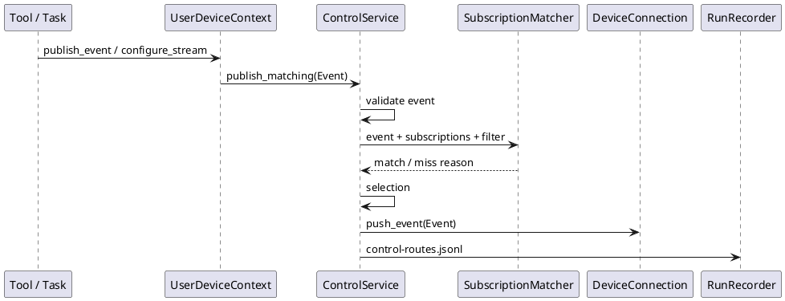

# 事件订阅与分发优化说明

本文记录本轮对事件订阅和分发链路的审查结论与实现调整。目标不是增加一套新的通讯方式，而是让开发者只围绕 `event` 和 `stream` 两个协议概念工作，同时在调试时能看清楚事件为什么发到某台设备，或为什么没有发出去。

## 设计目标

1. 设备开发者只需要在注册事件中声明 `subscriptions`。
2. Tool / Task 开发者只通过 `context.devices` 发布事件、配置 stream 或读取资产。
3. 业务代码不能按 `device_id` 点对点发送事件。
4. `sensor.*` 和 `actuator.*` 只按事件名和 `stream_type` filter 命中，不再额外判断 `capabilities`。
5. 路由失败必须可观察，不能只表现为“没有响应”。

## 当前链路



Stream 输出链路仍然遵守同一规则。`StreamService` 只在打开 `actuator.*` stream 时解析一次订阅者，并把后续 chunk、close、cancel 固定投递给这批 consumer，避免播放过程中因为设备重连或新设备注册改变旧 stream 的语义。

## 订阅规则

设备注册时提交：

```json
{
  "subscriptions": [
    {"event": "stream.control.*", "filter": {"stream_type": "sensor.rgb"}},
    {"event": "stream.output.*", "filter": {"stream_type": "actuator.speaker"}},
    {"event": "control.audio_session.*"}
  ]
}
```

含义：

- `stream.control.* + sensor.rgb`：当 server 发布 `stream.control.configure.requested` 且 `stream_type=sensor.rgb` 时，该设备会因为订阅命中而收到事件。
- `stream.output.* + actuator.speaker`：当 server 发布 `stream.output.open.requested` 且 `stream_type=actuator.speaker` 时，该设备会因为订阅命中而收到事件。
- `control.audio_session.*`：设备愿意接收语音会话生命周期事件。

`filter` 只推荐匹配事件字段，例如：

- `stream_type`
- `producer_id`
- `session_id`
- `payload.command_name`
- `payload.mode`
- `payload.stream_type`

不推荐用 `filter` 匹配设备自身属性。设备自身属性可放在 `properties` 中，供日志、debug API 和人工观察使用，不参与正常路由。

## Tool / Task 开发者怎么用

短控制事件：

```python
result = context.devices.publish_event(
    "control.device.command.requested",
    payload={
        "command_name": "actuator.haptic.pulse",
        "params": {"duration_ms": 200},
    },
    selection="first_available",
)
```

请求单张图片：

```python
asset = context.devices.request_asset(
    "sensor.rgb",
    freshness_seconds=0,
    timeout_seconds=3,
)
```

请求连续 RGB stream：

```python
context.devices.configure_stream(
    "sensor.rgb",
    mode="continuous",
    rate_hz=1,
    payload={"correlation_id": task_id},
    selection="first_available",
)
```

持续消费连续资产：

```python
async for asset in context.devices.watch_assets(
    "sensor.rgb",
    correlation_id=task_id,
    timeout_seconds=30,
):
    await analyze_frame(asset)
```

上面所有代码都不需要，也不允许指定某个设备实例 ID。具体发给谁，由当前在线设备的订阅策略决定。

## 路由诊断

`PublishResult` 现在包含 `route_diagnostics`。它用于开发调试和 runs 产物，不是新的通讯协议。

示例：

```json
{
  "matched_count": 0,
  "delivered_count": 0,
  "route_diagnostics": [
    {
      "device_id": "dev-rgb",
      "name": "浏览器调试设备",
      "connection_state": "online",
      "subscription_matched": false,
      "selected": false,
      "delivered": false,
      "reason": "filter_mismatch",
      "subscription": "stream.control.*",
      "filter": {"stream_type": "sensor.rgb"},
      "detail": {
        "path": "stream_type",
        "expected": "sensor.rgb",
        "actual": "sensor.depth"
      }
    }
  ]
}
```

常见 `reason`：

| reason | 含义 |
| --- | --- |
| `device_offline` | 设备属于当前 user，但当前不在线。 |
| `producer_excluded` | 默认不把事件回发给生产该事件的设备。 |
| `event_name_mismatch` | 订阅事件名没有命中。 |
| `filter_mismatch` | 订阅 filter 没有命中。 |
| `selection_skipped` | `first_available` 已经选中前面的设备。 |
| `delivered` | 已成功推送到设备连接。 |
| `connection_missing` | 设备状态在线，但连接对象不存在。 |
| `event_delivery_failed` | 推送事件时连接抛错。 |

同时，SDK 会把路由摘要写入：

- `runs/audio-chat/control-routes.jsonl`
- `runs/audio-chat/sessions/<session_id>/control-routes.jsonl`

终端只输出 DEBUG 摘要，不打印每个高频 chunk 的细节。

## 与旧 capabilities 字段的关系

旧 SDK 和部分早期示例会在注册 payload 中提交 `capabilities`。新版 SDK 仍保留读取能力，作为历史兼容和 debug 展示字段，但事件分发不会再因为它额外过滤设备。新设备不需要再声明它。

推荐写法是：

- 用 `subscriptions` 表达设备愿意处理哪些事件。
- 用 `properties` 表达便于人观察的硬件和调试信息。
- 用 stream 类型本身表达传感器和执行器能力。
