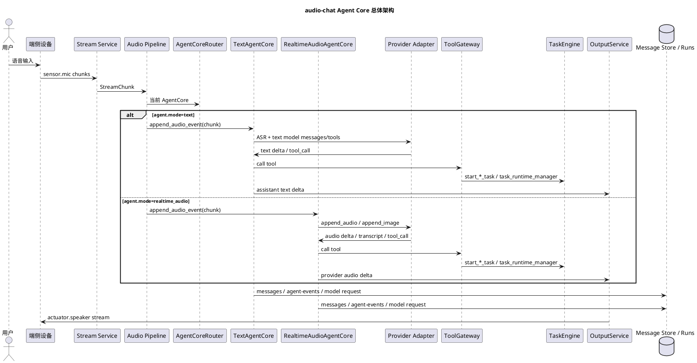

# audio-chat Agent Core 设计

本文是当前新版 `audio-chat` 的正式 Agent Core 设计文档。文档以当前 `audio_chat` 代码实现为准，使用当前实现中的名称，例如 `AgentCore`、`AgentCoreRouter`、`TextAgentCore`、`RealtimeAudioAgentCore`、`RealtimeProviderAdapter`、`ToolGateway`、`ToolResult`、`TaskEngine`、`OutputService`、`RunRecorder` 和 `ControlService`。

## 1. 文档定位

Agent Core 是 `audio-chat` 中负责模型对话运行循环的模块。它接收音频主链路提交的用户输入，驱动模型 provider，处理工具调用，把助手输出交给 Output Service，并把关键过程写入用户消息和 runs 产物。

本文重点回答：

1. Agent Core 与 Audio Pipeline、Tool Core、Task Core、Output Service 的边界。
2. 文本 Agent 和 Realtime Audio Agent 为什么是两条不同运行循环。
3. Tool 调用、Task 启动、视觉帧输入和输出播放如何接入 Agent Core。
4. Agent Core 的上下文、历史消息、错误恢复和可观测性如何设计。
5. 后续新增 provider 或自定义 Agent Core 时应遵守哪些约束。

## 2. 设计目标

Agent Core 的目标：

1. 统一承接模型对话，不让 WebSocket、设备协议、业务 Tool 或 Task 直接操作模型 provider。
2. 支持两类核心运行循环：`TextAgentCore` 和 `RealtimeAudioAgentCore`。
3. 让不同 Agent Core 复用同一套 `ToolGateway`、`TaskEngine`、`OutputService`、`MemoryService`、消息存储和 runs 产物。
4. 把 provider 私有事件转换为 SDK 可理解的统一事件和日志。
5. 让模型只通过 Tool schema 访问业务能力，不感知设备连接、资产落盘、Task actor、MCP、Skill 等内部对象。
6. 让语音回复、工具前置播报、Task 通知都进入 Output Service 的统一播放仲裁。
7. 保留对 provider 差异的适配空间，避免把 Realtime provider 协议泄漏到 Audio Pipeline 或业务代码。

非目标：

1. 不把 Agent Core 设计成自定义模型动作协议。
2. 不要求所有 provider 共用同一个 turn loop。
3. 不让 Agent Core 直接管理长期任务生命周期。
4. 不让 Agent Core 直接操作端侧设备；设备能力必须通过 Tool / Task 的 Context API 间接使用。
5. 不在 Agent Core 内实现端侧硬件控制、TTS 播放队列或 stream 路由。

## 3. 当前核心组件

| 组件 | 说明 |
| --- | --- |
| `AgentCore` | 公共 Protocol，定义 `open()`、`append_audio_event()`、`commit_input()`、`interrupt()`、`close()`、`events()`。 |
| `AgentCoreEvent` / `AgentEventBuffer` | Agent 统一事件快照，供测试、debug 和运行产物使用。 |
| `AgentCoreRouter` | 根据 `agent.mode` 创建 `TextAgentCore`、`RealtimeAudioAgentCore` 或自定义 core。 |
| `TextAgentCore` | 文本模型运行循环：音频先过 ASR，拿到转写文本后执行文本模型 tool loop，再经 TTS 输出。 |
| `AsrPipeline` | `TextAgentCore` 内部 ASR 聚合器，按 `stream_id` 隔离 ASR provider。 |
| `RealtimeAudioAgentCore` | 实时音频模型运行循环：`sensor.mic` PCM 直接 append 给 Realtime provider，由 provider VAD 决定 turn。 |
| `RealtimeProviderAdapter` | Realtime provider 适配接口，当前内置 `QwenOmniRealtimeAdapter` 和 `MockRealtimeProviderAdapter`。 |
| `RealtimeToolBridge` | 把 provider tool call delta / done 聚合成 `ToolGateway` 调用，并把 `ToolResult` 转换为 provider 回填结果。 |
| `TextOutputAdapter` / `RealtimeOutputAdapter` | Agent Core 内部输出适配层，把模型文本 delta 或 provider 音频 delta 交给 Output Service。 |
| `ToolGateway` | Agent Core 访问 Tool 的唯一入口，负责 schema、策略、参数校验、执行、trace 和前置播报。 |
| `RunRecorder` | 记录模型请求、Agent 事件、Tool trace、系统错误、输出摘要和调试产物。 |
| `ControlService` | 提供消息存储、事件发布和设备路由能力；Agent Core 只通过明确入口使用。 |

## 4. 核心边界

### 4.1 Audio Pipeline 负责

1. 接收并归一端侧上传的 `sensor.mic` stream chunk。
2. 做格式校验、重采样、音量归一和质量诊断。
3. 根据 `agent.mode` 把音频 chunk 交给当前 Agent Core。
4. 在输入 stream 关闭、显式提交或用户打断时调用 Agent Core 对应生命周期方法。

Audio Pipeline 不负责：

1. 不做模型 tool loop。
2. 不保存对话历史。
3. 不直接调用 Tool 或 Task。
4. 不解释 provider 私有事件。

### 4.2 Agent Core 负责

1. 打开、复用和关闭模型 provider 会话。
2. 把用户输入送入 provider。
3. 构造模型请求视图，包括 system prompt、历史消息、长期记忆片段、工具 schema 和当前输入。
4. 处理模型输出、工具调用、工具结果回填和最终回复。
5. 将助手文本、provider 音频 delta 或 final flush 交给 Output Service。
6. 将用户转写、助手回复、工具结果写入用户消息存储。
7. 记录 `agent-events.jsonl`、`model-request.json`、Tool trace 和可恢复错误。

Agent Core 不负责：

1. 不直接读写端侧 WebSocket。
2. 不直接打开摄像头、麦克风或扬声器。
3. 不直接持有业务 Tool 实例。
4. 不直接运行长期 Task actor。
5. 不绕过 Output Service 播放音频。

### 4.3 Tool Core 负责

1. 发现和注册 `BaseTool`。
2. 根据 `ToolSpec.input_model` 生成 provider function schema。
3. 按 `ToolPolicy` 过滤模型可见工具。
4. 为 Tool 注入 `ToolContext` 或 `SystemToolContext`。
5. 执行 Tool，校验参数，处理超时和异常。
6. 返回稳定 `ToolResult`。

Agent Core 只消费 `ToolGateway.provider_schemas()` 和 `ToolGateway.call_sync_safe()` / `call()`，不直接 import 业务 Tool。

### 4.4 Task Core 负责

1. 注册 `BaseTask`。
2. 生成 `TaskStartTool`，让模型通过普通工具启动任务。
3. 创建、查询、取消和调度任务。
4. 把端侧 `command.*` 回报转换为 Task 事件。
5. 发布 `TaskSignal`，并按策略交给 Agent Core 或 Output Service。

Agent Core 看到 Task 的方式是 Tool 调用结果中的 `TaskRef`，而不是 Task actor 本身。

### 4.5 Output Service 负责

1. 接收 Agent Core 的文本 delta、Realtime 音频 delta、Tool 前置播报和 Task 通知。
2. 做播放优先级、排队、抢占、取消和 output stream 生命周期管理。
3. 向支持 `actuator.speaker` 的端侧下发音频 stream。

Agent Core 内部的 `TextOutputAdapter` 和 `RealtimeOutputAdapter` 只是适配器，不是播放仲裁器。

## 5. 总体架构



## 6. Agent Core 模式

### 6.1 `text`

`TextAgentCore` 适用于普通文本模型链路：

1. `sensor.mic` chunk 进入 `AsrPipeline`。
2. ASR provider 在 final chunk 后产出最终转写。
3. Agent Core 把用户转写写入消息存储。
4. Agent Core 构造 Chat Completions 风格 messages。
5. 文本模型流式返回文本 delta 或 tool call。
6. 如果出现 tool call，Agent Core 调用 `ToolGateway`，把 `ToolResult` 作为 tool message 回填，再继续模型循环。
7. 文本 delta 交给 `TextOutputAdapter`，再进入 Output Service 做 TTS 和播放。
8. 最终助手文本写入消息存储。

文本链路的 turn boundary 由 ASR final chunk 决定。`commit_input()` 当前只记录公共事件，不强制生成新 turn。

### 6.2 `realtime_audio`

`RealtimeAudioAgentCore` 适用于原生实时音频模型链路：

1. Agent session 打开时创建 Realtime provider 长连接。
2. `sensor.mic` PCM chunk 直接 append 给 provider。
3. provider VAD 负责 `speech_started`、`speech_stopped`、转写完成和 response 生命周期。
4. provider 返回 `response.audio.delta` 时，Agent Core 直接交给 `RealtimeOutputAdapter`，不走 TTS。
5. provider 返回 tool call delta / done 时，`RealtimeToolBridge` 聚合参数并调用 `ToolGateway`。
6. provider 返回用户转写和助手 transcript 时，Agent Core 同步写入消息存储。
7. provider 失败时，Agent Core 标记 session failed，后续音频 chunk 不再继续 append，避免错误刷屏。

Realtime 链路的 turn boundary 不由 server 手动拼接。VAD 模式下，应遵守 provider 文档，只发送 provider 支持的输入事件；显式 `commit_input()` 只在当前 provider adapter 明确支持时使用。

### 6.3 `auto`

`auto` 当前保守落到 `TextAgentCore`。后续如果要让 `auto` 根据端侧能力或 provider 配置选择实时链路，必须保证行为可解释，并在 runs 中记录最终选择原因。

### 6.4 自定义模式

业务可以通过 `AgentCoreRouter.register_factory()` 注册自定义 Agent Core。自定义 core 必须实现 `AgentCore` Protocol，并复用公共服务边界：

1. 工具调用走 `ToolGateway`。
2. 输出播放走 `OutputService`。
3. 消息和调试产物走 `ControlService` / `RunRecorder`。
4. 长任务走 `TaskEngine` 或模型可见 Task Tool。

## 7. 模型上下文

### 7.1 System Prompt

System prompt 只承载：

1. 助手身份和回复风格。
2. 业务必要边界。
3. 长期记忆片段。
4. 已压缩的更早历史摘要。

System prompt 不承载：

1. 设备协议说明。
2. stream 生命周期细节。
3. Task actor 内部状态机。
4. Tool 执行栈或 MCP 内部实现。
5. 让模型输出自定义 action JSON 的规则。

### 7.2 历史消息

当前实现按 `user_id + session_id` 读取用户消息存储：

1. `TextAgentCore` 读取最近 `max_context_messages` 条 `user / assistant` 文本消息。
2. `RealtimeAudioAgentCore` 打开 provider session 时构造等价模型请求视图。
3. 历史 `tool` 消息主要用于审计，不直接作为孤立 tool message 回灌给新一轮模型。
4. 更早历史摘要通过 `ControlService.load_message_summary_fragment()` 拼入 system prompt。

### 7.3 长期记忆

如果 `MemoryService` 启用，Agent Core 在构造 prompt 时调用 `memory.build_prompt_fragment(user_id)`。Memory 只作为上下文片段注入，不改变 Agent Core 的运行循环。

### 7.4 当前输入

1. 文本链路当前输入是 ASR 最终转写文本。
2. Realtime 链路当前输入是 provider 正在接收的音频流；`model-request.json` 中使用 `input_audio_stream` 作为等价视图，方便排障。
3. Realtime 视觉帧是当前 turn 的辅助输入，不是用户消息文本的一部分。

## 8. 工具调用

### 8.1 工具发现

应用启动时：

1. 注册 SDK 内置 Tool。
2. 根据配置自动发现业务 `BaseTool`。
3. 根据 `TaskEngine.list_task_types()` 为每个 Task 生成 `TaskStartTool`。
4. 创建 `ToolGateway`，注入 `ToolPolicy`、`ToolContextFactory`、`RunRecorder`、Skill、Memory、MCP 和 Task 服务。
5. Agent Core 从 `ToolGateway.provider_schemas()` 获取当前 provider 可见 schema。

### 8.2 文本链路工具循环

`TextAgentCore` 的工具循环最多执行有限轮次，当前实现为 4 轮：

1. 模型流式输出文本 delta 或 tool call。
2. 如果首个输出是 tool call，`ToolGateway.emit_progress_once()` 可触发工具前置播报。
3. Agent Core 调用 `ToolGateway.call_sync_safe()`。
4. `ToolResult` 转为 provider tool message 回填给文本模型。
5. 模型继续生成，直到没有新的 tool call。

### 8.3 Realtime 链路工具桥

`RealtimeAudioAgentCore` 不直接假设 provider 的 tool call 事件结构。`RealtimeProviderAdapter` 负责解析 provider 原始事件并通过 callback 上报：

1. `tool_call_delta`：追加函数名或参数增量。
2. `tool_call_done`：提交完整工具调用。
3. `RealtimeToolBridge` 调用 `ToolGateway`。
4. Tool 调用结果写入 messages 和 runs。
5. provider result injection 由具体 adapter 处理。

### 8.4 工具设计原则

1. 模型可见工具应该是用户语义稳定的高层能力。
2. 底层设备操作应封装在 Tool / Task 内部，通过 `context.devices` 使用。
3. Tool 返回稳定 `ToolResult`，不要向 Agent Core 抛业务异常。
4. 长生命周期工作应启动 Task，Tool 本身快速返回 `TaskRef`。
5. 需要播放提示时通过 Tool 的 `progress_message` 或 `context.output`，最终仍由 Output Service 仲裁。

## 9. 视觉输入

### 9.1 文本链路视觉能力

文本链路中，图片通常由模型调用高层 Tool 获取，例如 `capture_photo`。Tool 只负责获取真实资产；是否解释图片、如何回答，由模型在工具结果回填后继续决策。

### 9.2 Realtime 链路视觉采样

当前 `RealtimeAudioAgentCore` 支持 Realtime turn 内同步视觉帧：

1. 收到 provider `omni.input_audio_buffer.speech_started` 后启动视觉采样。
2. 每隔 `agent.realtime.visual_frame_interval_seconds` 请求一次 `sensor.rgb` 单帧。
3. 请求成功后读取 JPEG bytes，通过 provider adapter 的 `append_image()` 追加到当前 Realtime 会话。
4. 收到 `omni.input_audio_buffer.speech_stopped` 后停止采样。
5. 收到 `omni.response.done` 时兜底停止采样，避免线程泄漏。
6. 音频输入 stream 关闭时停止与它配对的视觉采样。

### 9.3 音视频配对约束

Realtime 视觉采样必须和触发它的音频输入配对：

1. 当前实现按 `session_id` 约定同一个设备的音频和 RGB。
2. 每次请求 RGB 前检查当前音频 stream 是否仍然存活。
3. 如果配对音频 stream 已关闭，停止视觉采样并记录 `realtime.visual_sampler.paired_stream_unavailable`。
4. 请求资产时指定 `device_ids=(session_id,)`，避免改用同一用户下其他 RGB 设备。

## 10. 输出与播放

### 10.1 文本输出

`TextAgentCore` 将文本 delta 交给 `TextOutputAdapter`。Output Service 负责：

1. 生成 TTS。
2. 打开 `actuator.speaker` output stream。
3. 推送音频 chunk。
4. 处理播放队列、抢占和关闭。

### 10.2 Realtime 音频输出

`RealtimeAudioAgentCore` 将 provider 原生 `response.audio.delta` 交给 `RealtimeOutputAdapter`。这一路不再经过 TTS，Output Service 只负责 stream 生命周期和播放仲裁。

### 10.3 工具和任务输出

Tool 前置播报、Task 直接通知和模型回复都必须进入 Output Service。同一用户同一会话内，不能由业务代码直接向端侧写音频，否则会绕过播放仲裁。

## 11. 会话生命周期

### 11.1 打开

端侧唤醒或音频会话建立后，应用调用 `agent_core.open(user_id, session_id)`：

1. `TextAgentCore` 只记录会话事件。
2. `RealtimeAudioAgentCore` 建立 provider 长连接，加载工具 schema、历史消息、长期记忆和指令。

### 11.2 输入

Audio Pipeline 将每个归一后的 `sensor.mic` chunk 交给 `append_audio_event()`：

1. 文本链路等待 ASR final。
2. Realtime 链路立即 append 给 provider。

### 11.3 提交

`commit_input()` 是公共接口：

1. 文本链路当前只记录事件，真实提交由 ASR final 决定。
2. Realtime 链路只有在 provider adapter 支持时才转发显式提交。
3. VAD 模式下不应为了凑 turn 随意调用 provider commit。

### 11.4 打断

用户打断时：

1. Agent Core 取消当前模型响应。
2. Output Service 取消当前播放。
3. 文本链路取消 ASR 和文本模型。
4. Realtime 链路调用 provider cancel。

已启动的长任务是否取消，由 Task Core 和业务任务策略决定。

### 11.5 关闭

音频会话关闭时：

1. Realtime 链路关闭 provider session。
2. 停止视觉采样。
3. 中断当前播放。
4. 清理失败状态和 session 映射。
5. 记录 `session.closed` / `realtime.session.closed`。

来自模型、Tool 或 server 内部的关闭请求需要明确授权，避免误关闭持续 Realtime 会话。

## 12. 错误恢复

### 12.1 文本链路

文本链路中模型 provider 或工具循环异常只影响当前 turn：

1. 记录 `response.failed` 和系统错误。
2. 输出可恢复兜底文案。
3. 尽力发送 final flush。
4. 将失败信息写入 assistant message 的 `error` 字段。

### 12.2 Realtime 链路

Realtime provider 失败后：

1. 标记当前 `session_id` failed。
2. 关闭并移除 provider session。
3. 后续同 session 的 mic chunk 不再继续 append。
4. 记录 `realtime.session.failed`、provider error code、provider event id 和原始 message。
5. 等新会话重新打开时清理失败状态。

### 12.3 Tool 错误

Tool 内部异常应由 `ToolExecutor` 转换成 `ToolResult.failed()`。Agent Core 不应把普通工具失败当作自身崩溃。

## 13. 可观测性

Agent Core 必须记录以下信息：

1. `model-request.json`：provider、model、runner、system prompt 或 instructions、messages、tools、tool_count、user_id、session_id。
2. `agent-events.jsonl`：session open/close、输入提交、provider 事件、首个 delta、delta 完成、tool call、tool result、视觉帧追加、错误恢复。
3. `messages.jsonl`：用户转写、助手最终文本、工具调用和工具结果审计。
4. `tool trace`：工具名、入参、耗时、结果和错误。
5. `system.error.raised`：组件、错误类型、provider error code、provider event id、可读错误信息。

日志字段命名必须表达真实含义。普通事件 payload 不应塞进 `error_message` 这类错误字段。

## 14. 配置

Agent Core 由 `agent` 配置段控制：

```yaml
agent:
  mode: realtime_audio
  realtime:
    provider: qwen
    model: qwen3.5-omni-plus-realtime
    turn_detection: provider
    voice: Tina
    visual_frame_interval_seconds: 1.0
    visual_frame_timeout_seconds: 1.5
    visual_frame_freshness_seconds: 0.0
  text:
    model_provider: mock
    model: mock-text
    asr_provider: mock
    asr_model: mock-asr
    tts_provider: mock
    tts_model: mock-tts
```

配置原则：

1. `agent.mode` 决定运行循环，不只是 provider 名称。
2. Realtime provider 差异通过 `RealtimeProviderAdapter` 适配。
3. 文本链路 provider 差异通过 ASR、TextModel 和 TTS provider adapter 适配。
4. 工具是否可见由 Tool registry、Skill policy 和 Tool policy 决定，不在 Agent Core 中硬编码。

## 15. 扩展规范

### 15.1 新增文本模型 provider

新增文本模型 provider 时，应实现文本模型 adapter 的流式接口，并支持：

1. 普通文本 delta。
2. provider tool call 事件。
3. cancel。
4. 可观测 provider 名称和 model 名称。

不要为单个文本 provider 新增 Agent Core。

### 15.2 新增 Realtime provider

新增 Realtime provider 时，应优先实现 `RealtimeProviderAdapter`：

1. `open()`
2. `append_audio()`
3. `append_image()`
4. `commit_input()`，仅在 provider 支持时实现。
5. `cancel()`
6. `close()`

Adapter 负责把 provider 私有事件转换成 `RealtimeProviderCallbacks`，例如 audio delta、audio done、provider event、tool call delta、tool call done 和 error。

### 15.3 新增 Agent Core

只有当新的模型类型需要完全不同的运行循环时，才新增 Agent Core。例如未来的专用视频实时模型、离线批处理 Agent 或多 Agent 协作 core。

新增 Agent Core 必须：

1. 实现 `AgentCore` Protocol。
2. 在 `AgentCoreRouter` 注册 factory。
3. 复用 `ToolGateway`，不直接持有业务 Tool。
4. 复用 `OutputService`，不直接播放。
5. 复用 `RunRecorder`，记录模型请求和关键事件。
6. 明确 turn boundary 和输入提交规则。

## 16. 当前不采用的设计

当前正式设计不采用：

1. 让模型输出 `action=final_answer / ask_user / call_tool` 的自定义协议。
2. 在 prompt 中让模型理解 stream、asset、Task actor、MCP、设备路由等内部架构。
3. 把所有传感器 stream 默认推给 Agent Core。
4. 让 Agent Core 直接查询设备并操作硬件。
5. 让 Task 在 Tool 调用里阻塞等待最终完成。
6. 为每个 provider 新增一个 Agent Core。
7. 让业务代码绕过 Output Service 直接下发音频。

## 17. 与 Task Core 的协作

Agent Core 和 Task Core 平级协作：

1. 模型通过 `start_*_task` 或 `task_runtime_manager` 进入 Task Core。
2. `TaskStartTool` 快速返回 `TaskRef`，Agent Core 不等待任务最终完成。
3. Task Core 通过 `TaskSignalBridge` 发布结构化信号。
4. 需要模型开放式决策的信号应回流 Agent Core。
5. 允许直接通知用户的信号必须进入 Output Service 仲裁。
6. Task Core 不直接重入 provider 私有 API。

## 18. 设计结论

1. `audio-chat` 当前 Agent Core 是模型运行循环层，不是设备层、播放层或任务层。
2. `TextAgentCore` 和 `RealtimeAudioAgentCore` 必须保持独立运行循环，共享工具、任务、输出、记忆和观测基础设施。
3. Tool 是模型访问业务能力的唯一稳定入口；Task 通过 Tool 启动和管理。
4. Realtime 视觉帧只在 provider VAD 的当前语音 turn 内按需采样，并与同设备音频输入配对。
5. Provider 私有协议只允许出现在 provider adapter 内部。
6. 所有用户可听输出都必须进入 Output Service。
7. Agent Core 的核心质量标准是：turn 边界清晰、工具调用可追踪、错误可恢复、日志能解释真实行为。
