# Text Realtime 服务器侧标准模型

## 目标

本文把服务器中 Text Realtime 语音链路定为标准实现模型。

该标准只约束服务器内部的 Text 链路：上行麦克风音频进入服务器后，如何接入 Paraformer realtime ASR，如何驱动文本模型和流式 TTS，如何处理用户插话，以及服务器如何关闭当前连续对话。

服务器侧标准时序图见：[text-realtime-server-side-sequence.puml](text-realtime-server-side-sequence.puml)。

端侧与服务器之间的音频会话标准见：[device-audio-session-standard.md](device-audio-session-standard.md)。端侧只负责唤醒、采集、上行、播放缓存和执行服务器事件，不负责连续对话阶段的 VAD、turn boundary 或打断判断。

## 适用范围

本文适用于 Text Realtime 链路：

```text
sensor.mic -> AudioPipeline -> Paraformer Realtime V2 -> TextAgentCore -> TextModelProvider -> Streaming TTS -> actuator.speaker
```

不适用于 Omni Realtime 链路。Omni Realtime 的 speech start / speech stop 由 Omni provider 直接给出；Text Realtime 的 speech start / speech stop 由 Paraformer realtime ASR 结果解释得到。

## 核心组件

服务器侧必须使用现有代码组件表达链路，不再引入抽象的“控制面”“数据面”等概念。

| 组件 | 代码职责 |
| --- | --- |
| `AudioChatServer.control_ws` | 处理端侧控制 WebSocket，例如设备注册、唤醒、audio session open / close、端侧回执。 |
| `AudioChatServer.stream_ws` | 处理端侧音频数据 WebSocket，包括上行麦克风连接和下行扬声器连接。 |
| `AudioChatApp` | 服务器应用编排入口，把 WebSocket 事件转交给控制、数据流、Agent Core 和输出服务。 |
| `ControlService` | 发布控制事件，并把事件路由到目标端侧设备。 |
| `StreamService` | 管理 stream 生命周期、chunk 写入、output finish / cancel 等数据流状态。 |
| `AudioPipeline` | 对上行音频做格式适配、重采样和轻量诊断。 |
| `TextAgentCore` | Text Realtime 状态机，负责听说状态、ASR 事件解释、LLM 请求、上下文写入、打断和关闭连续对话。 |
| `AsrPipeline` | 管理每条上行麦克风 stream 对应的 ASR provider wrapper。 |
| `DashScopeAsrProviderAdapter` | 连接 DashScope `paraformer-realtime-v2`，发送音频帧并解析 provider 事件。 |
| `OutputService` | 管理 TTS session、输出仲裁、下行 speaker stream 写入、finish 和 cancel。 |
| `TextModelProvider` | 文本大模型 provider，负责流式输出 `text_delta` 和 tool call。 |
| `StreamingTTS Provider` | 流式 TTS provider，负责把文本增量合成为音频增量。 |

## 关键边界

### 1. 长连接建立前完成身份和会话绑定

端侧唤醒后，先通过控制连接完成设备注册和 audio session open。

上行麦克风连接和下行扬声器连接建立成功时，服务器已经知道该连接属于哪个 `user_id`、`device_id`、`session_id` 和 `stream_id`。后续音频帧路径不再反复做身份、session、stream 类型判断。

如果连接不能被绑定到合法设备和合法 session，应在连接建立阶段失败，而不是让音频帧进入 Text Realtime 后再补充校验。

### 2. Provider 连接必须提前建立

为了降低首轮响应延迟，provider 连接不能等到首帧音频或首段文本到达时才建立。

上行麦克风连接建立后，`TextAgentCore` 必须让 `AsrPipeline` 预先创建 ASR provider：

```text
TextAgentCore -> AsrPipeline -> DashScopeAsrProviderAdapter -> paraformer-realtime-v2
```

下行扬声器连接建立后，`OutputService` 必须预先创建流式 TTS session：

```text
OutputService -> StreamingTTS Provider
```

之后音频帧和文本增量只进入已经准备好的 provider session。

### 3. 上行音频持续进入服务器

进入连续对话后，端侧会持续发送麦克风音频。服务器必须把上行音频持续送入：

```text
AudioChatServer.stream_ws -> AudioChatApp -> AudioPipeline -> TextAgentCore -> AsrPipeline -> DashScopeAsrProviderAdapter
```

`AudioPipeline` 只负责格式适配、重采样和轻量诊断，不负责判断用户是否开始说话。

`AsrPipeline` 只负责 ASR provider wrapper 生命周期，不负责对话状态。

用户开始说话、停止说话、是否打断当前回复，由 `TextAgentCore` 根据 Paraformer provider 事件解释后决定。

### 4. Paraformer Realtime V2 是 Text 链路的 ASR 和语音边界来源

Text Realtime 使用 `paraformer-realtime-v2` 作为 ASR provider。

该 provider 不返回独立的 `speech_started` / `speech_stopped` 事件。服务器必须使用 `result-generated.output.sentence` 中的字段解释语音边界：

| Paraformer 字段 | 服务器语义 |
| --- | --- |
| `sentence_begin=true` | 用户开始说话。`TextAgentCore` 发布 `audio.speech.started`。 |
| partial `text` | ASR 中间文本。只作为 transcript delta，不单独承担 VAD 职责。 |
| `sentence_end=true` 或带 `end_time` 的最终句子 | 用户停止说话，并形成一轮最终输入。`TextAgentCore` 发布 `audio.speech.stopped`，然后启动文本模型响应。 |

Paraformer 的句子等待时间必须来自配置项，例如：

```yaml
audio_pipeline:
  asr:
    max_sentence_silence_ms: 800
```

具体配置名可以在实现阶段按现有配置结构确定，但语义必须固定：这是 ASR provider 的句子等待时间，不允许在链路中写死。

## 标准流程

### 1. 端侧唤醒和 audio session 建立

1. 端侧通过 `AudioChatServer.control_ws` 注册设备。
2. 端侧本地语音唤醒成功后，发送 `control.user.wake.detected`。
3. 服务器发布 `control.audio_session.open.requested`。
4. 端侧确认 `control.audio_session.opened`。
5. `AudioChatApp` 打开 `TextAgentCore` session。
6. 端侧分别建立上行麦克风长连接和下行扬声器长连接。
7. 上行连接建立时，服务器预热 ASR provider。
8. 下行连接建立时，服务器预热 TTS session。

### 2. 上行音频和 ASR 事件

上行麦克风音频持续进入服务器后，必须持续送入 Paraformer。

当 Paraformer 返回 `sentence_begin=true`：

1. `DashScopeAsrProviderAdapter` 转换成 `TranscriptEvent(sentence_begin=true)`。
2. `AsrPipeline` 把 provider 事件交给 `TextAgentCore`。
3. `TextAgentCore` 发布 `audio.speech.started` 给端侧。
4. 如果当前存在正在生成或播放的助手输出，`TextAgentCore` 通知 `OutputService` 打断。
5. `OutputService` cancel 当前 speaker stream。
6. 端侧收到事件和 stream cancel 后停止继续播放旧回复。

当 Paraformer 返回最终句子：

1. `DashScopeAsrProviderAdapter` 转换成 `TranscriptEvent(final=true, sentence_end=true)`。
2. `TextAgentCore` 发布 `audio.speech.stopped`。
3. `TextAgentCore` 写入用户消息。
4. `TextAgentCore` 启动新一轮文本模型响应。

### 3. 文本模型和流式 TTS

`TextAgentCore` 收到最终用户输入后，向 `TextModelProvider` 发起流式请求。

每个文本 delta 必须按顺序处理：

1. 追加到当前 assistant message buffer。
2. 发送给 `OutputService`。
3. `OutputService` 推送到已经预热的 TTS session。
4. TTS 返回音频 chunk。
5. `OutputService` 写入当前 speaker stream。
6. `StreamService` 下发到端侧下行连接。

文本模型完成后：

1. `TextAgentCore` flush 当前输出。
2. `TextAgentCore` 把完整 assistant message 写入消息历史。
3. `OutputService` 对当前 output stream 发出 `finish` 语义。
4. 端侧播放队列 drain 完成后回报 `stream.output.finished`。
5. `TextAgentCore` 回到 listening 状态。

这里的 `finish` 表示“一段助手输出已经完整发送完毕”，不表示关闭下行长连接。下行长连接只在关闭连续对话时关闭。

### 4. 用户插话

用户插话是正常控制流，不是异常。

当助手正在生成或播放时，如果 Paraformer 返回新的 `sentence_begin=true`：

1. `TextAgentCore` 发布 `audio.speech.started`。
2. `TextAgentCore` 把当前 generation 已经生成的文本追加到 assistant message。
3. 该 assistant message 的内容末尾必须追加 `<用户打断>`。
4. `TextAgentCore` 通知 `OutputService` cancel 当前 speaker stream。
5. `OutputService` 停止继续向端侧发送旧回复音频。
6. 旧 generation 后续返回的 LLM / TTS 回调只能丢弃，不能写成 `response.failed`，也不能播放错误兜底音频。
7. 新用户句子结束后，`TextAgentCore` 启动下一轮模型响应。

这样下一轮模型能看到真实上下文：助手确实说过一部分内容，并且是在这里被用户打断。

### 5. 关闭连续对话

关闭连续对话表示结束当前 audio session，释放上行 ASR、下行 TTS 和上下行音频长连接，并让端侧回到本地等待唤醒阶段。

服务器决定关闭连续对话只有两个标准时机。

#### 5.1 空闲超时

当 `TextAgentCore` 处于 listening 状态，且在配置的超时时间内没有收到新的有效用户语音输入时，服务器主动关闭连续对话。

超时时长必须是配置项，例如：

```yaml
audio_session:
  idle_timeout_ms: 30000
```

具体配置名可以在实现阶段按现有配置结构确定，但语义必须固定：这是连续对话 listening 状态的空闲关闭时间。

#### 5.2 大模型调用关闭连接 Tool

当用户表达结束对话、停止连续交流、暂时不用等意图时，服务器不应让端侧自行决定关闭。

标准流程是：

1. 用户最终文本进入 `TextAgentCore`。
2. `TextAgentCore` 请求文本模型。
3. 文本模型根据上下文调用关闭连接 Tool。
4. `TextAgentCore` 写入 tool call 和 tool result 消息。
5. `TextAgentCore` 发布 `control.audio_session.close.requested`。

关闭连接 Tool 是模型可调用的普通工具，但其语义固定为“请求服务器关闭当前连续对话 audio session”。

#### 5.3 关闭顺序

关闭动作必须按以下顺序收敛：

1. `TextAgentCore` 发布 `control.audio_session.close.requested`。
2. 端侧收到关闭事件后关闭上行麦克风连接。
3. 服务器关闭或取消当前 ASR provider。
4. `OutputService` 停止接收新的输出。
5. TTS session 完成 pending text 和已经生成音频的 drain。
6. `OutputService` 显式关闭预建立的 TTS session。
7. 当前 output stream 执行 `finish` 或 `cancel`。
8. 端侧等待已经进入播放器的音频结束后关闭下行扬声器连接。
9. 端侧回报 `control.audio_session.closed`。
10. `AudioChatApp` 关闭当前 session，`TextAgentCore` 清理状态。

关闭 continuous dialog 时必须同时释放 ASR 和 TTS provider。只关闭上行麦克风连接而保留 TTS session 是不完整的关闭。

## 标准时序图

```plantuml
@startuml
title Text Realtime 服务器侧时序（现有代码组件 + Paraformer Realtime V2）

autonumber
skinparam responseMessageBelowArrow true
skinparam sequenceMessageAlign center

participant "Endpoint Device\n端侧设备" as Device

box "AudioChat Server / 现有代码组件" #F3F8E8
participant "AudioChatServer.control_ws\n/ws/control" as ControlWs
participant "AudioChatServer.stream_ws\n/ws/stream" as StreamWs
participant "AudioChatApp\n应用编排" as App
participant "ControlService\n事件发布/设备路由" as Control
participant "StreamService\nstream 生命周期" as Stream
participant "AudioPipeline\n格式适配/重采样" as AudioPipe
participant "TextAgentCore\n文本实时状态机" as TextCore
participant "AsrPipeline\nASR provider wrapper" as AsrPipe
participant "DashScopeAsrProviderAdapter\nParaformer 适配器" as AsrAdapter
participant "OutputService\nTTS/输出仲裁" as Output
end box

box "External Providers / 外部服务" #FFF4E5
participant "DashScope\nparaformer-realtime-v2" as Paraformer
participant "TextModelProvider\n文本模型" as LLM
participant "StreamingTTS Provider\n流式 TTS" as TTS
end box

== 1. 端侧唤醒后建立 audio session 和上下行长连接 ==

Device -> ControlWs: control.device.register.requested
ControlWs -> App: register_device(event, connection)
App -> Control: register_device()
Control --> ControlWs: control.device.registered
ControlWs --> Device: control.device.registered

Device -> ControlWs: control.user.wake.detected
ControlWs -> App: handle control event
App -> Control: publish(control.audio_session.open.requested)
Control --> ControlWs: route to endpoint
ControlWs --> Device: control.audio_session.open.requested

Device -> ControlWs: control.audio_session.opened
ControlWs -> App: open agent session
App -> TextCore: open(user_id, session_id)

Device -> StreamWs: open /ws/stream for upstream mic
StreamWs -> App: bind stream connection to registered device
App -> Stream: open/register sensor.mic stream
App -> TextCore: on upstream mic stream opened
TextCore -> AsrPipe: prepare_provider(stream_id)
AsrPipe -> AsrAdapter: create DashScopeAsrProviderAdapter
AsrAdapter -> Paraformer: WebSocket connect
AsrAdapter -> Paraformer: run-task(model=paraformer-realtime-v2,\nheartbeat=true,\nmax_sentence_silence=config.asr.max_sentence_silence_ms)
Paraformer --> AsrAdapter: task-started

Device -> StreamWs: open /ws/stream for downstream speaker
StreamWs -> App: bind stream connection to registered device
App -> Stream: open/register actuator.speaker stream
App -> Output: on downstream speaker stream opened
Output -> TTS: prepare streaming TTS session
TTS --> Output: tts session ready

note over Device,Stream
连接建立成功后，上行 mic 连接已经绑定 user_id / device_id / session_id / stream_id。
后续音频帧路径不再反复做身份、session、stream 类型判断。
ASR 和 TTS provider 连接在上下行长连接建立时预热，
避免等第一帧音频或第一段文本到达时才承担 provider 建连延迟。
end note

== 2. 上行音频进入 Text Realtime ==

loop continuous dialog until server closes session
  Device -> StreamWs: sensor.mic audio bytes
  StreamWs -> App: StreamChunk(bound mic stream)
  App -> AudioPipe: process(chunk)
  AudioPipe -> TextCore: append_audio_event(normalized chunk)
  TextCore -> AsrPipe: append_audio(chunk)

  AsrPipe -> AsrAdapter: append_audio(chunk)
  AsrAdapter -> Paraformer: binary audio frame

  alt Paraformer sentence_begin
    Paraformer --> AsrAdapter: result-generated(sentence_begin=true,\ntext="", sentence_id, begin_time)
    AsrAdapter --> AsrPipe: TranscriptEvent(sentence_begin=true,\ntext="", final=false)
    AsrPipe --> TextCore: provider event
    TextCore -> Control: publish(audio.speech.started)
    Control --> ControlWs: route to endpoint
    ControlWs --> Device: audio.speech.started
    TextCore -> Output: interrupt_user(reason=paraformer_sentence_begin)
    Output -> Stream: cancel current speaker stream if any
    Stream --> StreamWs: stream.output.cancel.requested / cancelled
    StreamWs --> Device: stop current playback
  end

  alt Paraformer partial text
    Paraformer --> AsrAdapter: result-generated(text partial,\nend_time=null)
    AsrAdapter --> AsrPipe: TranscriptEvent(text, final=false)
    AsrPipe --> TextCore: input_transcript.delta
  end

  alt Paraformer sentence_end
    Paraformer --> AsrAdapter: result-generated(sentence_end=true,\nend_time, final text)
    AsrAdapter --> AsrPipe: TranscriptEvent(text, final=true,\nsentence_end=true)
    AsrPipe --> TextCore: provider event + input_transcript.done(text)
    TextCore -> Control: publish(audio.speech.stopped)
    Control --> ControlWs: route to endpoint
    ControlWs --> Device: audio.speech.stopped
    TextCore -> TextCore: start response generation N
  end
end

note over AudioPipe,AsrPipe
AudioPipeline 只做音频格式适配、重采样和轻量诊断。
AsrPipeline 只是 ASR provider wrapper，管理每条 mic stream 对应的 provider。
判断用户开始/结束说话的是 Paraformer result-generated.sentence 字段，
解释这些字段并改变对话状态的是 TextAgentCore。
Paraformer 的句子等待时间必须来自配置项，例如 config.asr.max_sentence_silence_ms，
不能在链路中固定写死为 800ms。
end note

== 3. 正常回复生成和下行音频 ==

TextCore -> LLM: stream_messages(context + final transcript)

loop assistant text delta
  LLM --> TextCore: text delta
  TextCore -> TextCore: append delta to current assistant message buffer
  TextCore -> Output: on_assistant_text_delta(text)
  Output -> TTS: push text to prepared TTS session
  TTS --> Output: assistant audio chunk
  Output -> Stream: write actuator.speaker chunk
  Stream --> StreamWs: queued speaker chunk
  StreamWs --> Device: assistant audio bytes
end

LLM --> TextCore: done
TextCore -> Output: final empty delta / flush
TextCore -> TextCore: append assistant message(content=full generated text)
Output -> Stream: finish current output stream
Stream --> StreamWs: stream.output.finish.requested
StreamWs --> Device: stream.output.finish.requested
Device -> ControlWs: stream.output.finished(reason=playback_drained)
ControlWs -> App: output finished
App -> Output: on_playback_finished()
TextCore -> TextCore: state = listening

== 4. 用户插话：sentence_begin 打断当前回复 ==

Device -> StreamWs: sensor.mic audio bytes while assistant playing
StreamWs -> App: StreamChunk(bound mic stream)
App -> AudioPipe: process(chunk)
AudioPipe -> TextCore: append_audio_event(chunk)
TextCore -> AsrPipe: append_audio(chunk)
AsrPipe -> AsrAdapter: append_audio(chunk)
AsrAdapter -> Paraformer: binary audio frame

Paraformer --> AsrAdapter: result-generated(sentence_begin=true,\ntext="", sentence_id=M)
AsrAdapter --> AsrPipe: TranscriptEvent(sentence_begin=true)
AsrPipe --> TextCore: provider event

TextCore -> Control: publish(audio.speech.started)
Control --> ControlWs: route to endpoint
ControlWs --> Device: audio.speech.started
TextCore -> TextCore: append interrupted assistant message\ncontent=generated_text + "<用户打断>"
TextCore -> Output: interrupt_user(reason=paraformer_sentence_begin)
Output -> Stream: cancel current speaker stream
Stream --> StreamWs: stream.output.cancel.requested / cancelled
StreamWs --> Device: stop current playback
TextCore -> TextCore: mark generation N interrupted

note over TextCore,Output
插话是正常控制流。
当前 generation 已经产生并下发过的 text_delta 不能丢。
TextAgentCore 需要把已生成文本追加到 assistant message，
并在 content 末尾加 "<用户打断>"，让下一轮 LLM 看见真实上下文。
旧 generation 的后续 LLM/TTS 回调只能被丢弃，
不应写 response.failed，也不应播放错误兜底。
end note

Paraformer --> AsrAdapter: result-generated(partial text)
AsrAdapter --> AsrPipe: TranscriptEvent(text, final=false)
AsrPipe --> TextCore: input_transcript.delta

Paraformer --> AsrAdapter: result-generated(sentence_end=true,\nfinal text)
AsrAdapter --> AsrPipe: TranscriptEvent(final=true,\nsentence_end=true)
AsrPipe --> TextCore: input_transcript.done(new text)
TextCore -> LLM: start response generation N+1

== 5. 服务器关闭连续对话 ==

alt listening idle timeout
  TextCore -> TextCore: idle timer reached\nconfig.audio_session.idle_timeout_ms
else LLM calls close audio session tool
  LLM --> TextCore: tool_call(close_audio_session)
  TextCore -> TextCore: append tool call/result messages
end

TextCore -> Control: publish(control.audio_session.close.requested)
Control --> ControlWs: route to endpoint
ControlWs --> Device: control.audio_session.close.requested

Device -> StreamWs: close upstream mic connection
StreamWs -> App: input stream closed
App -> TextCore: close / cancel ASR
TextCore -> AsrPipe: cancel providers
AsrPipe -> AsrAdapter: cancel()
AsrAdapter -> Paraformer: finish-task / close WebSocket

TextCore -> Output: stop accepting new output
Output -> TTS: finish pending text / drain generated audio
TTS --> Output: remaining audio chunks / tts done
Output -> TTS: close prepared TTS session
Output -> Stream: finish or cancel speaker stream
Device -> StreamWs: close downstream speaker connection after playback drained
Device -> ControlWs: control.audio_session.closed
ControlWs -> App: close session
App -> TextCore: close(user_id)

@enduml

```



如果文档渲染环境不支持 `!include`，请直接打开 [text-realtime-server-side-sequence.puml](text-realtime-server-side-sequence.puml) 查看完整时序图。

## 实现约束

1. 上下行音频连接建立后，热路径不再反复补做身份、session、stream 类型校验。
2. ASR provider 在上行麦克风连接建立时预热。
3. TTS session 在下行扬声器连接建立时预热。
4. `AudioPipeline` 不做 VAD 决策。
5. ASR partial text 不作为打断依据。
6. `sentence_begin=true` 是 Text 链路 speech start 的标准来源。
7. `sentence_end=true` 或带 `end_time` 的最终句子是 Text 链路 speech stop 和 turn commit 的标准来源。
8. output stream 完成使用 `finish` 语义，不使用 `close` 表达一段音频结束。
9. 用户插话时，已生成 assistant 文本必须写入消息历史，并以 `<用户打断>` 结尾。
10. 关闭连续对话必须关闭 ASR provider、TTS session、上行音频连接和下行音频连接。
11. 连续对话只能由服务器关闭，标准触发条件为空闲超时或关闭连接 Tool。

## 待实现配置项

后续代码实现必须至少补齐以下配置语义：

| 配置语义 | 用途 |
| --- | --- |
| `asr.max_sentence_silence_ms` | Paraformer 句子等待时间，用于控制 sentence end 的等待时长。 |
| `audio_session.idle_timeout_ms` | TextAgentCore listening 状态空闲多久后关闭连续对话。 |

配置项命名可以根据现有 `server.yaml` 层级微调，但不能改变语义。
