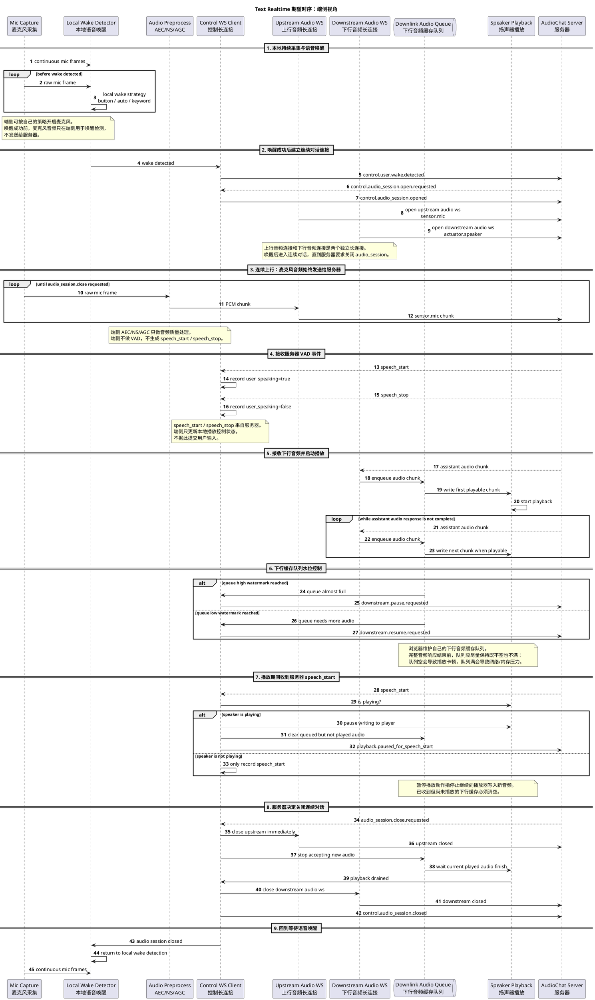

# 端侧音频会话标准模型

## 目标

本文定义所有端侧设备与 `audio-chat` 服务器进行实时音频交互时必须遵守的标准模型。

该标准适用于浏览器眼镜、原生眼镜、手机、Python mock 设备和后续新增端侧。无论服务器内部最终走 Text realtime、Omni realtime，还是其他语音 Agent Core，端侧与服务器之间的音频会话边界都应保持一致。

标准时序图见：[text-realtime-device-side-sequence.puml](text-realtime-device-side-sequence.puml)。

## 核心边界

端侧负责：

1. 按自身策略开启麦克风。
2. 在本地持续进行语音唤醒检测。
3. 唤醒后持续采集并上传麦克风音频。
4. 接收服务器下行音频，维护播放缓存队列，并写入播放器。
5. 执行服务器下发的 `speech_start`、`speech_stop`、暂停、恢复、关闭会话等控制事件。

服务器负责：

1. 在音频会话建立后持续接收上行音频。
2. 根据上行音频执行 VAD / ASR / 对话状态判断。
3. 判断用户是否开始说话、停止说话，以及是否需要打断当前播放。
4. 生成下行音频并发送给端侧。
5. 决定何时关闭当前连续对话音频会话。

端侧不负责：

1. 在连续对话期间自行判断 VAD。
2. 自行提交一轮用户输入。
3. 自行决定关闭 `audio_session`。

## 标准流程

### 1. 本地麦克风采集与语音唤醒

麦克风采集可以长期进行，但音频上传给服务器必须以唤醒成功为边界。

端侧根据自己的策略开启麦克风，例如按钮开启、自动开启、系统权限恢复或其他设备策略。麦克风开启后，端侧可以持续进行本地语音唤醒检测。

在语音唤醒检测成功之前，麦克风采集到的音频只在端侧本地用于唤醒检测，不发送给服务器。

### 2. 唤醒后建立独立上下行长连接

语音唤醒触发后，端侧立刻与服务器创建音频上行长连接和音频下行长连接。

上行长连接和下行长连接是两个独立连接：

| 连接           | 方向         | 用途                             |
| -------------- | ------------ | -------------------------------- |
| 上行音频长连接 | 端侧到服务器 | 持续发送麦克风采集到的音频数据。 |
| 下行音频长连接 | 服务器到端侧 | 接收服务器生成的助手音频响应。   |

上下行连接建立后，当前设备进入连续对话阶段。

### 3. 连续上行音频

进入连续对话阶段后，麦克风采集到的声音必须全部持续写入上行音频长连接。

等待服务器返回音频流响应之前，上行音频也不能暂停。端侧不能因为“正在等待模型回复”“还没收到下行音频”“当前没有检测到用户说话”等状态停止上行音频。

端侧可以执行系统级音频前处理，例如 AEC、降噪、自动增益，但这些处理只改变音频质量，不产生对话状态事件。

### 4. 服务器 VAD 事件

上行音频发送过程中，服务器会持续进行 VAD，并可能随时下发以下事件：

| 事件             | 含义                     | 端侧行为                                                     |
| ---------------- | ------------------------ | ------------------------------------------------------------ |
| `speech_start` | 服务器判断用户开始说话。 | 更新本地状态；如果正在播放，则暂停播放动作并清空未播放队列。 |
| `speech_stop`  | 服务器判断用户停止说话。 | 更新本地状态；等待服务器后续下行音频或其他控制事件。         |

这些事件来自服务器。端侧只处理事件，不自行生成这些事件。

### 5. 下行音频播放

端侧收到服务器响应的下行音频后，应立刻将音频写入下行音频缓存队列，并在具备可播放数据后开启播放。

下行音频不能绕过缓存队列直接写入播放器。播放器只从本地缓存队列消费音频。

### 6. 下行音频缓存队列和水位控制

为降低网络抖动对播放体验的影响，端侧必须维护自己的下行音频缓存队列。

队列目标是在一段完整的助手音频发送完之前保持稳定水位：

1. 队列不能长期为空，否则播放会卡顿。
2. 队列不能被写满，否则会造成端侧内存压力或下行网络背压。

端侧应根据队列容量通知服务器暂停或继续发送：

| 队列状态         | 端侧动作                     |
| ---------------- | ---------------------------- |
| 队列达到高水位   | 通知服务器暂停发送下行音频。 |
| 队列回落到低水位 | 通知服务器继续发送下行音频。 |
| 队列处于安全水位 | 正常接收并播放。             |

具体高低水位阈值由端侧实现根据设备性能、网络质量和播放器特性配置。

### 7. 播放期间收到 `speech_start`

播放过程中，端侧仍然可能收到服务器下发的 `speech_start` 事件。

收到 `speech_start` 后，端侧必须检查是否有正在播放的音频：

1. 如果没有正在播放的音频，只更新本地状态。
2. 如果有正在播放的音频，端侧必须暂停播放动作。
3. 暂停播放动作是指停止继续向播放器写入音频。
4. 已经收到但尚未播放的下行音频缓存队列必须清空。

该行为表达的是“服务器判断用户开始说话后，端侧停止继续播放旧助手回复”。端侧不需要也不应该自行判断这个 `speech_start` 是否准确。

### 8. 服务器决定关闭音频会话

长连接持续过程中，服务器可能会下发 `audio_session.close` 事件，通知端侧关闭当前音频会话。

关闭时机由服务器决定，不需要浏览器或其他端侧主动发起。端侧只需配合执行关闭流程。

### 9. 关闭音频会话

关闭 `audio_session` 表示结束当前连续对话。

端侧收到服务器关闭事件后，应按以下顺序执行：

1. 立刻关闭上行音频连接，停止向服务器发送麦克风音频。
2. 停止接收新的下行音频。
3. 等待当前已经进入播放器的音频结束。
4. 关闭下行音频连接。
5. 向服务器确认 `audio_session` 已关闭。
6. 重新进入等待本地语音唤醒的阶段。

关闭音频会话不表示关闭麦克风硬件。端侧可以继续按本地策略采集麦克风，用于下一次语音唤醒检测。

## 标准时序图

如果文档渲染环境不支持 `!include`，请直接打开 [text-realtime-device-side-sequence.puml](text-realtime-device-side-sequence.puml) 查看完整时序图。

## 实现要求

所有端侧实现都应满足以下要求：

1. 唤醒前不上传麦克风音频。
2. 唤醒后上行音频持续发送，直到服务器关闭音频会话。
3. 上行音频连接和下行音频连接独立管理。
4. 下行音频必须进入端侧缓存队列，再由播放器消费。
5. 端侧必须实现下行缓存队列水位控制，并能通知服务器暂停或继续发送。
6. 端侧收到 `speech_start` 后，如果正在播放，必须停止继续写播放器并清空未播放队列。
7. 端侧收到服务器关闭音频会话事件后，必须关闭上下行连接并回到本地语音唤醒状态。
8. 端侧不得把本地播放状态、音量检测或 ASR 片段当作服务器 VAD 事件。

## 与服务器实现的关系

本文只定义端侧与服务器之间的标准交互模型，不规定服务器内部如何实现 VAD、ASR、Text LLM、Omni provider、TTS 或输出仲裁。

服务器内部实现可以变化，但不能要求端侧承担连续对话中的 VAD、turn boundary 或 barge-in 决策职责。端侧只执行标准事件和数据流协议。
