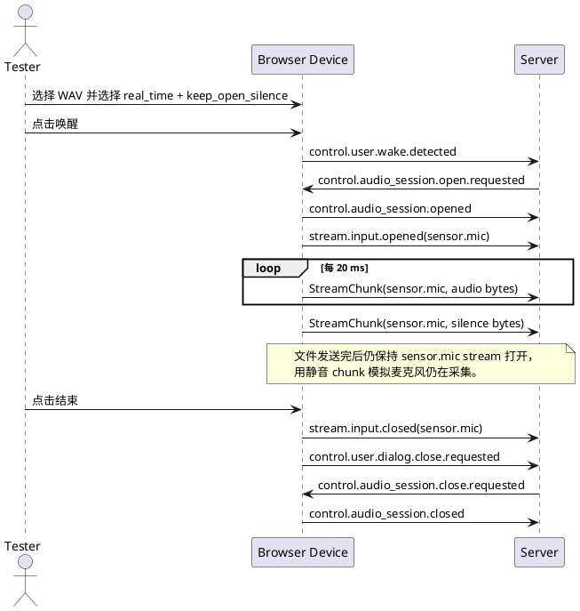
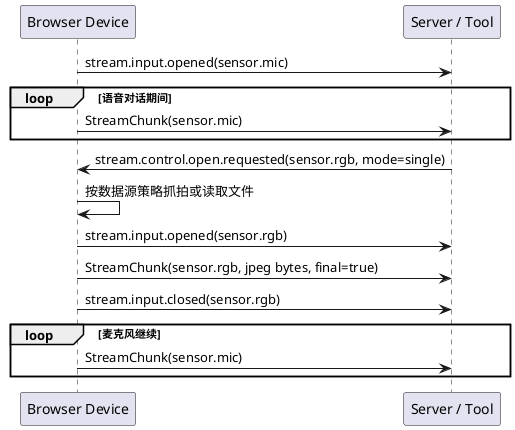
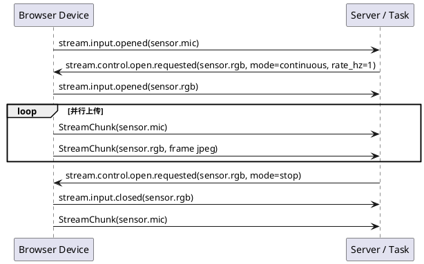
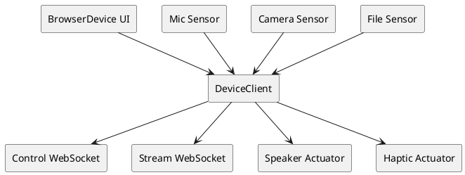

# Browser Device 设计文档

更新时间：2026-05-08

文档状态：浏览器参考端设计文档。当前可运行端侧仍位于 `device-examples/browser-glass`，能力文件是 `device.audio-chat.yaml`。当前设备接入操作以 [设备注册与功能开发说明](device-capability-development-guide.md) 为准；本文主要说明浏览器参考端的目标形态和设计边界。

## 1. 文档目的

本文档定义 `browser-glass` 设备示例的目标形态。当前仓库已经使用 `device-examples/browser-glass` 作为浏览器参考端目录，后续工作主要是继续拆分 JS 模块和补齐端侧能力，而不是再做目录重命名。

`browser-glass` 是一个运行在浏览器中的 Device 示例。它承担眼镜类设备在开发测试中的角色：负责感知和执行，帮助开发者快速验证 server、Agent Core、Tool、Task、事件协议和 stream 协议。

它不是协议类型，也不是 SDK 对开发者设备形态的约束。开发者真实设备可以运行在任意语言、任意硬件、任意仓库，只要遵守 Device 注册、事件和 stream 协议即可。

## 2. 定位

`browser-glass` 的核心定位是交互式调试设备，而不是业务功能实现。

它应该支持：

1. 手动注册设备。
2. 手动触发常见控制事件。
3. 使用浏览器真实麦克风上传 `sensor.mic`。
4. 使用浏览器真实摄像头上传 `sensor.rgb`。
5. 手动上传音频、图片、视频文件并转换为对应 stream。
6. 消费 server 下发的 `actuator.speaker` stream 并真实播放。
7. 模拟 `actuator.haptic` 等非音频执行器。
8. 展示收发事件、stream 生命周期、chunk 统计、错误和 debug 信息。
9. 支持全链路真实语音对话，尤其是 Omni Realtime 链路。

它不应该承担：

1. server SDK 内部功能。
2. Agent Core、Tool、Task 的业务逻辑。
3. 真实硬件固件职责。
4. 自动化批量回放和 CI 主入口。

自动化批量回放和 CI 应由 `python-device-sim` 承担。

## 3. 目标目录

目标目录如下：

```text
device-examples/
  browser-glass/
    README.md
    browser-glass.yaml
    index.html
    src/
      protocol.js
      stream-codec.js
      device-client.js
      sensors/
        mic.js
        camera.js
        file-upload.js
      actuators/
        speaker.js
        haptic.js
      ui/
        logs.js
        panels.js
```

现阶段当前仓库中对应历史目录是：

```text
device-examples/browser-glass/
```

后续迁移重点是把当前单页实现逐步拆成 `src/` 模块，并让文档、CLI 默认路径、测试路径和 package-check 保持一致。

## 4. 协议视角

`browser-glass` 注册为普通 Device。server 不知道它是浏览器、眼镜、手机还是模拟器。

开发者只需要理解：

```text
你是谁：device_id / user_id
你叫什么：name
你想听什么：supports
你有哪些调试或硬件说明：properties
你收到事件后如何生产或消费 stream
```

示例注册 payload：

```json
{
  "device_id": "dev-browser-001",
  "name": "浏览器调试设备",
  "client_type": "browser-glass",
  "sdk_version": "audio-chat-browser-glass-0.1.0",
  "auth": {"mode": "disabled"},
  "supports": [
    {"event": "control.audio_session.*"},
    {"event": "stream.output.*", "filter": {"stream_type": "actuator.speaker"}},
    {"event": "stream.output.*", "filter": {"stream_type": "actuator.haptic"}},
    {"event": "stream.control.*", "filter": {"stream_type": "sensor.rgb"}}
  ],
  "properties": {
    "audio.aec": "browser_webrtc",
    "audio.input.sample_rate": 16000,
    "audio.input.chunk_ms": 20,
    "camera.facing": "front",
    "debug.manual_events": true,
    "debug.file_upload": true
  }
}
```

`name` 只用于日志、debug API 和人工观察，不参与路由。

`properties` 也不参与事件路由，只用于 debug、日志、硬件说明或页面默认值。设备是否真的能上传 `sensor.mic`、响应 `sensor.rgb` 抓拍、消费 `actuator.speaker`，由它订阅到事件后的实际 stream 行为证明。控制事件 payload 不携带媒体大字节；音频、图片、视频、IMU 和执行器输出都通过 stream 传输。

## 5. 功能分区

### 5.1 设备注册区

字段：

1. `server_url`
2. `user_id`
3. `device_id`
4. `name`
5. `auth`
6. `supports`
7. `properties`

操作：

1. 连接 `/ws/control`。
2. 发送 `control.device.register.requested`。
3. 注册成功后连接 `/ws/stream?device_id=...`。
4. 显示 `connection_id`、心跳状态和在线状态。

### 5.2 事件控制区

事件控制区用于模拟设备侧真实行为，也用于手动制造边界条件。它不应该变成 server RPC 调试器；发送的内容必须仍然是协议事件。

内置事件按钮：

1. `control.user.wake.detected`
2. `control.user.interrupt.detected`
3. `control.user.dialog.close.requested`
4. `control.device.heartbeat.received`
5. `stream.input.opened`
6. `stream.input.closed`
7. 自定义事件编辑器。

事件按钮应按当前 session 状态启用或禁用：

1. 未注册前只能连接和注册，不能发送业务事件。
2. 注册后可以发送 heartbeat 和 wake。
3. 收到 `control.audio_session.open.requested` 后，页面进入对话会话状态。
4. 对话会话状态下才允许打开 `sensor.mic`、`sensor.rgb`、`sensor.imu` 等输入 stream。
5. `control.user.dialog.close.requested` 只表达用户侧请求结束，真正关闭以后仍要等待 server 下发 `control.audio_session.close.requested`，设备再回 `control.audio_session.closed`。
6. `control.user.interrupt.detected` 用于模拟用户打断，页面应停止或标记当前播放中的 `actuator.speaker`，但是否关闭会话由 server 决定。

事件日志需要显示：

1. 时间。
2. 方向：发送 / 接收。
3. `event_name`。
4. `stream_type`。
5. `session_id`。
6. 简化后的 payload。

自定义事件编辑器必须内置安全校验：

1. 不允许 payload 中包含音频、图片、视频等大字节字段。
2. 必须自动补齐 `user_id`、`producer_id=device_id`、`session_id` 和 `timestamp`。
3. 允许选择 `stream_type`，但不允许写死目标设备。
4. 对高频事件默认折叠，只显示首条、最后一条和统计。

### 5.3 麦克风区

麦克风区是 `browser-glass` 最复杂的部分，因为语音测试至少分为四类：

1. 真实麦克风实时对话。
2. 离线音频实时注入，用文件模拟真实麦克风长连接。
3. 离线音频快速回放，用于快速复现问题。
4. 混合测试：离线音频播放期间，仍允许手动触发拍照、上传图片或响应 server 的 `sensor.rgb` 请求。

真实麦克风默认使用浏览器能力：

```js
navigator.mediaDevices.getUserMedia({
  audio: {
    echoCancellation: true,
    noiseSuppression: true,
    autoGainControl: true
  }
})
```

上传给 server 前统一转为 `sensor.mic` stream。默认目标格式：

```text
codec: pcm16
sample_rate: 16000
channels: 1
chunk_ms: 20
```

#### 5.3.1 真实麦克风实时对话

真实麦克风模式用于最接近真机的全链路验证。

流程：

1. 设备已注册并建立 `/ws/control`。
2. 用户点击“唤醒”，页面发送 `control.user.wake.detected`。
3. server 下发 `control.audio_session.open.requested`。
4. 页面回复 `control.audio_session.opened`。
5. 页面打开 `/ws/stream`，如果已经打开则复用同一条连接。
6. 页面发送 `stream.input.opened`，`stream_type=sensor.mic`。
7. 页面持续上传 `sensor.mic` chunk。
8. Omni Realtime 场景下，页面不发送“提交本轮”事件，turn 判断由 provider 完成。
9. 用户点击结束时，页面发送 `stream.input.closed` 和 `control.user.dialog.close.requested`。
10. server 下发 `control.audio_session.close.requested` 后，页面回复 `control.audio_session.closed`。

这个模式下，麦克风 stream 在一次连续对话期间保持打开，直到用户或 server 结束会话。

#### 5.3.2 离线音频实时注入

离线音频实时注入用于“不需要真人说话，但仍然模拟真实长连接”的测试。它和快速上传文件不同，必须按真实时间节奏发送 chunk。

流程：

1. 用户选择 WAV / PCM 文件。
2. 页面解码并转换为目标格式，例如 16 kHz、单声道、PCM16。
3. 用户点击唤醒，等待 `control.audio_session.open.requested`。
4. 页面回复 `control.audio_session.opened`。
5. 页面发送 `stream.input.opened`。
6. 页面按 `chunk_ms` 定时发送音频片段，例如每 20 ms 发送 640 bytes。
7. 文件播放完以后有两种策略：
   - `auto_close`：发送 `stream.input.closed` 和 `control.user.dialog.close.requested`。
   - `keep_open`：继续保持 `sensor.mic` stream 打开，发送静音 chunk 或暂停发送，用于模拟“用户说完但设备仍处于连续对话窗口”。

`keep_open` 是实时对话测试的关键。很多 Omni / Realtime 链路依赖持续连接和服务端 turn detection。如果文件发送完就立刻关闭 stream，测试到的是“单轮文件提交”，不是“连续对话长连接”。

页面应提供这些选项：

1. `send_mode=real_time`：按真实时间发送。
2. `after_file=auto_close | keep_open_silence | keep_open_idle`。
3. `silence_ms`：文件前后补静音。
4. `loop`：循环播放文件，用于长时间稳定性测试。
5. `start_offset_ms` / `max_duration_ms`：截取部分音频。

其中：

1. `keep_open_silence` 表示继续发送静音 chunk。
2. `keep_open_idle` 表示 stream 状态保持打开，但暂时不发 chunk。

优先推荐 `keep_open_silence`，因为它更接近麦克风仍在采集环境声的真实状态。

#### 5.3.3 离线音频快速回放

快速回放用于复现服务端处理问题，不用于评估真实延迟。

流程：

1. 选择音频文件。
2. 打开 `sensor.mic` stream。
3. 尽快发送所有 chunk，可以按浏览器任务调度分批发送，避免阻塞 UI。
4. 文件发送完成后关闭 stream。

页面必须明确标记该模式：

```text
fast_replay 只用于回归复现，不代表真实实时对话。
```

该模式不应用来判断首字延迟、VAD、打断、AEC 或连续对话行为。

#### 5.3.4 混合测试：音频期间采集新数据

真实对话中，模型可能在语音仍然打开时调用 Tool，例如请求拍照、请求连续视频、请求 IMU 或触发执行器。`browser-glass` 必须允许麦克风 stream 与其他 sensor stream 并行存在。

典型流程：

1. `sensor.mic` stream 已打开，真实麦克风或离线音频实时注入正在进行。
2. server 因 Tool 调用下发 `stream.control.open.requested`，`stream_type=sensor.rgb`。
3. 页面不关闭 `sensor.mic`。
4. 页面根据当前设置选择数据源：
   - 真实摄像头抓拍。
   - 用户预先选择的图片。
   - 用户预先选择的视频当前帧。
   - 手动弹出确认，让测试人员选择文件。
5. 页面另开一个 `sensor.rgb` stream，发送 `stream.input.opened`。
6. 图片或帧数据通过 `/ws/stream` 上传。
7. 页面发送 `stream.input.closed`，只关闭 `sensor.rgb`，不影响 `sensor.mic`。

因此页面内部不能只有一个“当前输入 stream”。它应维护多个并行 stream 状态：

```text
sensor.mic        长连接，连续对话期间保持打开
sensor.rgb        按需 single 或 continuous
sensor.imu        可选连续上传
sensor.depth      可选按需上传
actuator.speaker  server 下行播放
actuator.haptic   server 下行动作
```

每个 stream 独立拥有：

1. `stream_id`
2. `stream_type`
3. `state`
4. `seq`
5. `format`
6. `opened_at`
7. `bytes_sent` 或 `bytes_received`
8. `close_reason`

页面应显示：

1. 浏览器实际麦克风 settings。
2. chunk 数。
3. 已上传字节数。
4. 当前 stream 状态。
5. 首 chunk 时间和关闭时间。
6. 当前音频来源：真实麦克风 / 离线实时注入 / 快速回放 / 静音保持。
7. 是否存在并行 sensor stream。

### 5.4 摄像头和文件区

摄像头区支持：

1. 浏览器摄像头抓拍。
2. 手动上传图片。
3. 手动上传视频。
4. 视频按固定帧率拆成 `sensor.rgb` stream。

当收到 `stream.control.open.requested` 且 `stream_type=sensor.rgb` 时，页面可以按 payload 中的 `mode` 决定：

1. `single`：抓拍或上传一帧。
2. `continuous`：持续上传图片帧。
3. `stop`：停止当前 `sensor.rgb` stream。

媒体字节必须通过 `/ws/stream` 发送，不放进控制事件 payload。

摄像头和文件区需要有明确的数据源策略：

1. `live_camera`：收到请求时直接调用浏览器摄像头。
2. `selected_image`：收到请求时上传测试人员预先选择的图片。
3. `selected_video_current_frame`：收到请求时上传当前视频帧。
4. `manual_confirm`：收到请求时暂停等待测试人员选择数据。
5. `auto_fail`：用于测试端侧失败，回复 `stream.input.failed`。

当 `sensor.mic` 正在实时上传时，以上策略都不能关闭或重建麦克风 stream。页面只新增或复用对应的 `sensor.rgb` stream。

### 5.5 执行器区

执行器区支持：

1. 播放 `actuator.speaker` 下行音频。
2. 显示播放状态。
3. 模拟 `actuator.haptic`。
4. 上报 output stream started / finished / closed。

音频播放要尽量使用同一页面完成，以便浏览器 AEC 能拿到真实远端播放参考。

### 5.6 全链路对话区

全链路对话区提供最小按钮：

1. 连接并注册。
2. 唤醒。
3. 开始麦克风。
4. 停止麦克风。
5. 结束对话。

Omni Realtime 链路中不应要求用户点击“提交本轮”。浏览器持续上传 `sensor.mic`，turn 判断交给 provider 的 VAD 或 semantic turn detection。

## 6. 关键时序

### 6.1 离线音频模拟实时长连接



### 6.2 语音长连接期间响应拍照



### 6.3 语音长连接期间上传视频帧



## 7. 组件关系



## 8. 开发者如何使用

最小使用流程：

```bash
# 在项目根目录执行
uv run audio-chat.server.run --config app-examples/for-blind-app/server.yaml
```

然后打开浏览器设备页面：

```bash
open device-examples/browser-glass/index.html
```

当前迁移前可以继续打开：

```bash
open device-examples/browser-glass/index.html
```

使用步骤：

1. 填写 `server_url`、`user_id`、`device_id` 和 `name`。
2. 点击连接并注册。
3. 点击唤醒。
4. 授权麦克风或上传音频文件。
5. 观察 server 下发事件和音频播放。
6. 如果测试拍照或视觉能力，授权摄像头或上传图片 / 视频。

## 9. 验收目标

`browser-glass` 完成后应满足：

1. 可以通过浏览器注册为普通 Device。
2. debug API 能看到 `name`、`device_id`、`supports` 和 `properties`。
3. 可以手动发送 wake / interrupt / close。
4. 可以上传真实麦克风 `sensor.mic`。
5. 可以用本地 WAV 按真实时间模拟 `sensor.mic` 长连接。
6. 可以在离线音频结束后继续发送静音 chunk，维持连续对话窗口。
7. 可以快速回放本地音频，并明确标注该模式不代表实时链路。
8. 可以在 `sensor.mic` 打开期间响应 `sensor.rgb` 抓拍请求。
9. 可以在 `sensor.mic` 打开期间上传连续视频帧。
10. 可以播放 `actuator.speaker` 下行音频。
11. 可以模拟 `actuator.haptic`。
12. 所有大字节数据都走 stream，不进入控制事件 payload。
13. 页面日志不刷屏，只展示 stream 打开、首 chunk、统计和关闭。
14. 每个并行 stream 都有独立状态，关闭图片或视频 stream 不影响麦克风 stream。
