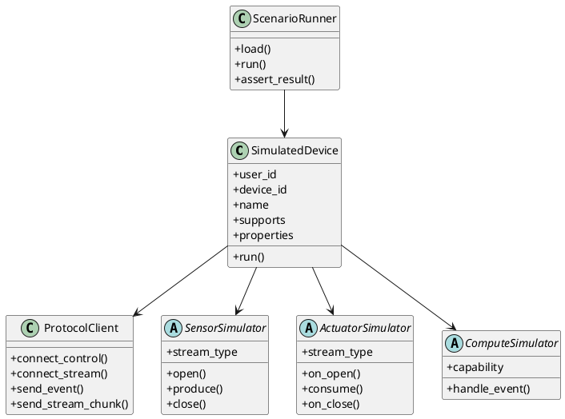

# Python Device Sim 设计文档

更新时间：2026-05-08

文档状态：目标设计文档。当前仓库仍保留 `device-examples/python-glass`、`device-examples/python-phone` 等参考端；本文描述的是后续收敛为统一无头设备模拟器的目标形态。当前可运行端侧和开发方式见 [设备注册与功能开发说明](device-capability-development-guide.md)。

## 1. 文档目的

本文档定义 `python-device-sim` 无头设备模拟器的目标形态。它用于收敛当前历史实现中的 `python-glass` 和 `python-phone`，为 server、Agent Core、Tool、Task 和协议回归测试提供稳定的自动化设备。

`python-device-sim` 是 Device 示例，不是 SDK 协议类型。它只是一套用 Python 实现的设备，用来帮助 SDK 开发和业务能力开发者快速构造可重复的测试场景。

## 2. 定位

`python-device-sim` 的核心定位是无头、可脚本化、可回放、可自动验收的设备模拟器。

它应该承担：

1. 音频回放。
2. 图片回放。
3. 视频逐帧回放。
4. IMU / 深度相机等传感器轨迹回放。
5. 执行器消费记录，例如 speaker 输出落盘、haptic 输出写日志。
6. 端侧算力任务模拟，例如视觉识别、OCR、简单本地模型。
7. 多设备场景模拟。
8. CI 和本地批量测试。

它不应该承担：

1. 真实麦克风权限验证。
2. 浏览器 WebRTC AEC 验证。
3. 真实摄像头调试 UI。
4. 手动交互式调试主入口。

这些应由 `browser-glass` 承担。

## 3. 目标目录

目标目录如下：

```text
device-examples/
  python-device-sim/
    README.md
    scenarios/
      audio-playback.yaml
      photo-capture.yaml
      vision-task.yaml
      multi-device.yaml
    audio_chat_device_sim/
      __init__.py
      device.py
      protocol_client.py
      scenario.py
      sensors/
        mic_wav.py
        camera_file.py
        video_file.py
        imu_trace.py
        depth_file.py
      actuators/
        speaker_file.py
        haptic_log.py
      compute/
        vision_task.py
        ocr_task.py
        local_model.py
      cli.py
```

现阶段当前仓库中对应历史目录是：

```text
device-examples/python-glass/
device-examples/python-phone/
```

后续应把这两个实现收敛到 `python-device-sim`。

## 4. 设计原则

### 4.1 Device 优先

模拟器内部可以有 Sensor、Actuator、Compute 等对象，但对 server 来说，它们都只是一个或多个普通 Device。

模拟器启动时注册 Device：

```text
device_id / user_id / name / supports / properties
```

server 不知道它是“回放眼镜”、“手机 mock”还是“算力端”。所有行为都通过事件和 stream 完成。

### 4.2 Stream 优先

模拟器向 server 发送的数据都应该走 stream：

1. 音频：`sensor.mic`
2. 图片：`sensor.rgb`
3. 视频帧：`sensor.rgb`
4. 深度图：`sensor.depth`
5. IMU：`sensor.imu`
6. 播放器输出：`actuator.speaker`
7. 震动输出：`actuator.haptic`

控制事件 payload 只携带控制参数、采样策略、状态和关联 ID，不携带媒体大字节。

### 4.3 场景可重复

模拟器必须能用配置文件完整描述一次测试：

1. 注册几个设备。
2. 每个设备订阅哪些事件。
3. 每个设备有哪些可选调试或硬件属性。
4. 使用哪些音频、图片、视频或传感器轨迹。
5. 何时发送 wake / interrupt / close。
6. 期望收到哪些事件。
7. 输出产物写到哪里。

### 4.4 不绕过协议

模拟器不应该调用 server 内部 Python 对象来完成设备行为。网络模式必须走：

```text
/ws/control
/ws/stream
```

单进程 in-process 模式可以用于快速单元测试，但验收和开发者示例必须保留真实网络模式。

## 5. 内部对象模型



## 6. 传感器模拟

### 6.1 MicWavSensor

输入：

```text
wav_path
sample_rate
channels
chunk_ms
```

行为：

1. 读取 WAV。
2. 必要时转换为 16 kHz、单声道、PCM16。
3. 按 `chunk_ms` 切片。
4. 发送 `stream.input.opened`。
5. 通过 `/ws/stream` 上传 `sensor.mic` chunk。
6. 发送 `stream.input.closed`。

### 6.2 CameraFileSensor

输入：

```text
image_path
mime_type
```

行为：

1. 监听 `stream.control.open.requested`。
2. 当 `stream_type=sensor.rgb` 且 `mode=single` 时上传图片。
3. 通过 `sensor.rgb` stream 上传 JPEG / PNG 字节。

### 6.3 VideoFileSensor

输入：

```text
video_path
fps
duration_seconds
```

行为：

1. 将视频拆成图片帧。
2. 当 `mode=continuous` 时按 fps 上传 `sensor.rgb`。
3. 当收到 `mode=stop` 或超时后关闭 stream。

### 6.4 ImuTraceSensor

输入：

```text
jsonl_path
rate_hz
```

行为：

1. 读取 IMU 轨迹。
2. 按时间戳或固定频率发送 `sensor.imu` chunk。
3. payload 可以是 JSON bytes，但仍走 stream。

## 7. 执行器模拟

### 7.1 SpeakerFileActuator

行为：

1. 订阅 `stream.output.*`，过滤 `stream_type=actuator.speaker`。
2. 收到 output open 后创建输出文件。
3. 收到音频 chunk 后写入文件。
4. 上报 started / finished / closed。
5. 在结果中记录字节数、chunk 数和音频格式。

### 7.2 HapticLogActuator

行为：

1. 订阅 `stream.output.*`，过滤 `stream_type=actuator.haptic`。
2. 收到震动 payload 后写入 `actuators.jsonl`。
3. 上报执行状态。

## 8. 算力模拟

算力模拟仍然是普通 Device 行为，不是新协议。

默认可以通过订阅设备命令事件来表达，例如：

```text
compute.vision.describe
compute.ocr.read_text
phone.task.find_object_phone_task
phone.task.traffic_light_phone_task
```

事件形式：

```text
command.requested
command.accepted
command.progress
command.completed
command.failed
```

算力模拟器可以从场景配置中读取固定返回，也可以调用本地模型或测试 stub。

## 9. 场景配置

示例：

```yaml
server_url: http://127.0.0.1:8765
user_id: user-playback-001
runs_root: runs/device-sim

devices:
  - device_id: dev-sim-glass-001
    name: 音频回放和播放器模拟设备
    supports:
      - event: control.audio_session.*
      - event: stream.output.*
        filter:
          stream_type: actuator.speaker
      - event: stream.control.*
        filter:
          stream_type: sensor.rgb
    properties:
      audio.input.sample_rate: 16000
      sensor.rgb.fixture: front.jpg
    sensors:
      mic:
        type: wav
        path: testdata/audio-sample/wav/看一下我前面有什么.wav
      camera:
        type: file
        path: testdata/images/front.jpg
    actuators:
      speaker:
        type: file
        output: runs/device-sim/speaker.pcm

scenario:
  - at: 0.0
    send_event: control.user.wake.detected
  - at: 0.2
    start_sensor: sensor.mic
  - after_sensor_closed: sensor.mic
    send_event: control.user.dialog.close.requested

expect:
  events:
    - control.device.registered
    - control.audio_session.open.requested
    - stream.output.open.requested
```

## 10. CLI 目标

目标 CLI：

```bash
uv run audio-chat.device.sim \
  --config device-examples/python-device-sim/scenarios/audio-playback.yaml
```

兼容 CLI：

```bash
uv run audio-chat.playback.glass --config app-examples/for-blind-app/host/glass-playback/sdk-playback.yaml
uv run python -m audio_chat_python_phone_mock --config device-examples/python-device-sim/scenarios/vision-task.yaml
```

CLI 入口应保持单一当前实现。

## 11. 开发者如何使用

能力开发者使用它做自动化验证：

```bash
# 在项目根目录执行
uv run audio-chat.server.run --config app-examples/for-blind-app/server.yaml
uv run audio-chat.device.sim \
  --config device-examples/python-device-sim/scenarios/audio-playback.yaml
```

设备开发者使用它对照协议：

1. 查看注册事件如何声明 `supports` 和可选 `properties`。
2. 查看如何建立 `/ws/control` 和 `/ws/stream`。
3. 查看如何上传 `sensor.*` stream。
4. 查看如何消费 `actuator.*` stream。
5. 查看如何用事件完成端侧任务 started / progress / completed。

## 12. 验收目标

`python-device-sim` 完成后应满足：

1. 能替代当前 `python-glass` 完成 WAV 回放。
2. 能替代当前 `python-phone` 完成视觉任务模拟。
3. 支持单设备和多设备场景。
4. 支持真实网络模式。
5. 支持 in-process 快速测试模式。
6. 所有媒体和传感器数据都走 stream。
7. 输出 `events.jsonl`、`streams.jsonl`、`actuators.jsonl` 和 `result.json`。
8. 场景失败时能指出是注册、订阅、控制事件、stream 上传、stream 消费还是期望断言失败。
9. 当前 CLI 入口使用统一配置。
