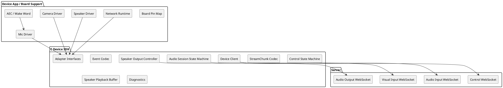
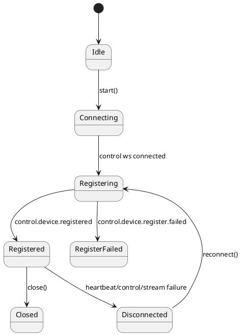
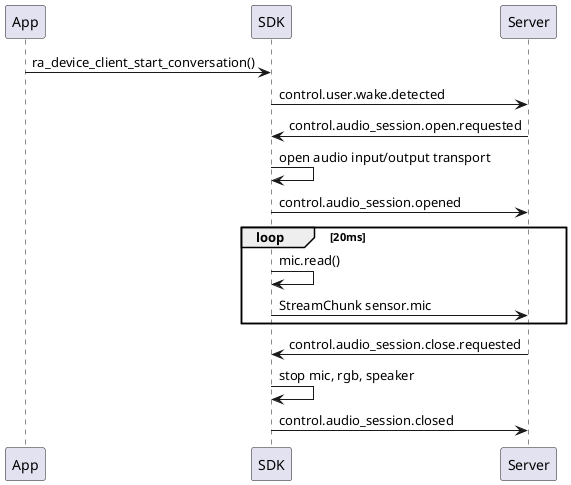
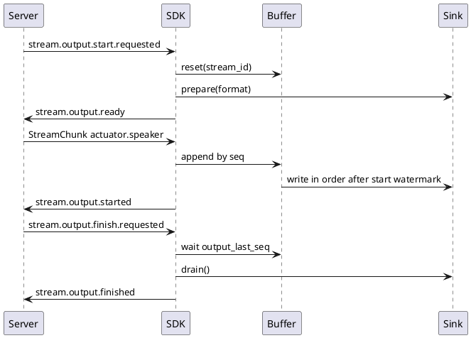

# C Device SDK 设计草案

本文定义 `devices/c/` 的目标设计。C Device SDK 面向 ESP32-S3、嵌入式 Linux、网关设备和其他自定义 C 运行时，负责实现 realtime-agent 端侧协议核心；具体硬件引脚、传感器驱动、Wi-Fi、ESP-IDF 任务和板级初始化不放进通用 SDK。

## 1. 设计目标

C Device SDK 的目标是提供一套可移植的端侧协议核心：

- 设备注册、心跳和连接状态。
- `/ws/control` 控制事件收发。
- `/ws/stream/audio/input` 麦克风上行。
- `/ws/stream/audio/output` speaker 下行。
- `/ws/stream/visual/input` RGB 单帧上行。
- `Event` JSON 编解码和 `StreamChunk` 二进制编解码。
- audio session、speaker output、RGB 单帧请求的标准状态机。
- SDK 内置 speaker 播放 buffer、水位线、finish、drain 和 cancel。
- mic、camera、speaker、transport、timer、log 的 adapter 接口。
- 轻量诊断快照和可配置日志级别。

非目标：

- 不内置 ESP32-S3 引脚表。
- 不直接初始化 I2S、PDM、camera、功放、WakeNet 或 AEC。
- 不绑定 ESP-IDF、POSIX、libwebsockets 或某个 JSON 库。
- 不实现业务 Tool / Task。
- 不让 App 手写标准协议事件状态机。

## 2. 分层边界



核心原则：硬件接口定义放在 C SDK；硬件实现放在 App、demo 或 board support package。C SDK 只关心“能否读到 PCM、抓到 JPEG、写入 PCM、发送 WebSocket 帧”，不关心这些能力来自哪颗芯片、哪组 GPIO 或哪种传感器。

## 3. 目录结构

目标结构：

```text
devices/c/
  CMakeLists.txt
  README.md
  C_DEVICE_SDK_DESIGN.md
  include/realtime_agent_device/
    ra_client.h
    ra_config.h
    ra_event.h
    ra_stream_chunk.h
    ra_transport.h
    ra_hardware.h
    ra_speaker_buffer.h
    ra_diagnostics.h
    ra_log.h
  src/
    ra_client.c
    ra_event.c
    ra_stream_chunk.c
    ra_speaker_buffer.c
    ra_diagnostics.c
  tests/
    test_event_codec.c
    test_stream_chunk_codec.c
    test_speaker_buffer.c
    test_client_state_machine.c
```

## 4. 公开 API 形态

App 创建 client 时只传身份、server 地址和 adapter：

```c
ra_device_client_config_t config = {
    .server_url = "http://192.168.10.10:8765",
    .device_id = "dev-esp32-s3-001",
    .user_id = "user-device-demo",
    .name = "ESP32-S3 Device",
    .client_type = "esp32-s3",
    .mic = &mic_source,
    .speaker = &speaker_sink,
    .camera = &camera_source,
    .transport = &transport,
    .log_level = RA_LOG_DEBUG,
};

ra_device_client_t *client = ra_device_client_create(&config);
ra_device_client_register_custom_command(client, "demo.ping", on_demo_ping, user_data);
ra_device_client_start(client);
```

App 不直接发送 `control.device.register.requested`、`control.audio_session.opened`、`stream.output.ready` 等标准事件。标准事件由 SDK 状态机处理。

## 5. 硬件 Adapter 接口

### 5.1 麦克风输入

```c
typedef struct {
    const char *codec;      /* pcm16le */
    int sample_rate;        /* 默认 16000 */
    int channels;           /* 默认 1 */
    int chunk_ms;           /* 默认 20 */
} ra_audio_format_t;

typedef struct {
    void *ctx;
    ra_audio_format_t format;
    int (*start)(void *ctx);
    int (*read)(void *ctx, uint8_t *out, size_t capacity, size_t *written);
    int (*stop)(void *ctx);
} ra_mic_source_t;
```

约束：

- `read()` 返回的是协议格式 PCM，默认 `pcm16le / 16000Hz / mono / 20ms`。
- 如果设备使用 AEC，`read()` 应返回 AEC 后的 mic PCM。
- SDK 不判断 VAD，不把短语结束写成 `final=true`。
- audio session 未打开时 SDK 不调用 `read()` 上传实时 mic chunk。

### 5.2 相机输入

```c
typedef struct {
    void *ctx;
    const char *codec;  /* jpeg */
    int (*capture_jpeg)(void *ctx, const uint8_t **data, size_t *size);
    void (*release_jpeg)(void *ctx, const uint8_t *data);
} ra_camera_source_t;
```

约束：

- 只在收到 `stream.control.open.requested` 且 `stream_type=sensor.rgb` 后抓一帧。
- 成功后 SDK 发送 `stream.input.opened`、一个 `sensor.rgb` chunk `final=true`、`stream.input.closed`。
- 失败后 SDK 发送 `stream.input.failed`。
- SDK 不做后台连续上传。

### 5.3 Speaker 输出

```c
typedef struct {
    void *ctx;
    int (*prepare)(void *ctx, const ra_audio_format_t *format);
    int (*write)(void *ctx, const uint8_t *pcm, size_t size, int duration_ms);
    int (*drain)(void *ctx);
    int (*cancel)(void *ctx);
} ra_speaker_sink_t;
```

约束：

- speaker sink 只负责真实播放、drain 和 cancel。
- seq 重排、水位线、pause/resume、finish 等待和 cancel 清空由 SDK 的 speaker buffer 负责。
- `stream.output.finished` 必须等 SDK buffer 和 sink drain 完成后发送。

## 6. Transport Adapter

C SDK 不绑定 WebSocket 实现。transport 只提供四条通道能力：

```c
typedef enum {
    RA_TRANSPORT_CONTROL,
    RA_TRANSPORT_AUDIO_INPUT,
    RA_TRANSPORT_AUDIO_OUTPUT,
    RA_TRANSPORT_VISUAL_INPUT,
} ra_transport_channel_t;

typedef struct {
    void *ctx;
    int (*connect)(void *ctx, ra_transport_channel_t channel, const char *url);
    int (*send_text)(void *ctx, ra_transport_channel_t channel, const char *text, size_t size);
    int (*send_binary)(void *ctx, ra_transport_channel_t channel, const uint8_t *data, size_t size);
    int (*recv_text)(void *ctx, ra_transport_channel_t channel, char *out, size_t capacity, size_t *size);
    int (*recv_binary)(void *ctx, ra_transport_channel_t channel, uint8_t *out, size_t capacity, size_t *size);
    int (*close)(void *ctx, ra_transport_channel_t channel);
} ra_transport_t;
```

ESP32-S3 demo 可以用 `esp_websocket_client` 实现该接口；嵌入式 Linux 可以用 libwebsockets 或其他实现。

## 7. 注册 payload 生成

SDK 根据配置自动生成注册 payload：

| 配置 | 注册字段 |
| --- | --- |
| `mic != NULL` | `properties.realtime_agent.audio_input=sensor.mic` |
| `mic.format` | `properties.realtime_agent.audio_input.format` |
| `speaker != NULL` | `properties.realtime_agent.audio_output=actuator.speaker` |
| `speaker_buffer` | `properties.realtime_agent.audio_output.buffer` |
| `camera != NULL` | `supports.sensors[].type=rgb` |
| custom command handler | `properties.realtime_agent.custom_commands` |

SDK 不生成旧 `routes` 或旧 `capabilities` 字段。

## 8. 协议状态机

### 8.1 连接和注册



断连由 SDK 本地判断，不能等待 server 下发事件。断连后必须统一收口：

1. 停止 heartbeat。
2. 停止 control receive loop。
3. 停止 mic 上传。
4. 取消 RGB 采集。
5. cancel speaker sink。
6. 清空 speaker buffer。
7. 关闭四条 transport channel。
8. 标记 `registered=false` 并通知 App。

### 8.2 实时音频会话



`sensor.mic` 不发送 `stream.input.opened/closed` 表达系统音频主链路生命周期。该生命周期由 `control.audio_session.opened/closed` 表达。

### 8.3 Speaker 下行



收到 `stream.output.cancel.requested` 后，SDK 必须立即：

1. 停止 drain loop。
2. 清空 speaker buffer。
3. 调用 `speaker.cancel()`。
4. 发送 `stream.output.cancelled`。

cancel 优先级高于 finish、水位线和 drain。

## 9. StreamChunk 编解码

格式与 Swift SDK 保持一致：

```text
uint32 header_length_be
utf8_json_header
payload_bytes
```

header 至少包含：

```json
{
  "version": "realtime-agent.v1",
  "user_id": "user-device-demo",
  "session_id": "session-id",
  "stream_id": "stream-id",
  "stream_type": "sensor.mic",
  "seq": 0,
  "timestamp_ms": 0,
  "codec": "pcm16le",
  "sample_rate": 16000,
  "channels": 1,
  "duration_ms": 20,
  "payload_size": 640,
  "final": false,
  "metadata": {}
}
```

解码必须检查：

- 原始数据长度至少 4 字节。
- header length 合法。
- header 是 JSON object。
- `payload_size == payload bytes`。
- 必填字段存在。

## 10. Speaker Buffer

默认配置与 Swift SDK 对齐：

```text
start_watermark_ms = 120
low_watermark_ms = 300
high_watermark_ms = 800
max_buffer_ms = 1200
```

行为：

- 按 `seq` 暂存 chunk。
- 重复 chunk 忽略。
- 乱序 chunk 等待缺失序号，不直接写 speaker。
- 达到 `start_watermark_ms` 后发送 `stream.output.started` 并开始 drain。
- 达到高水位发送 `downstream.pause.requested`。
- 回到低水位发送 `downstream.resume.requested`。
- 收到 finish 且有 `output_last_seq` 时，先等该 seq 入 buffer。
- 收到 cancel 立即清空，不等待低水位或 drain。

嵌入式内存较紧时，可以把 buffer 做成固定块池：

```text
chunk slot: header metadata + payload pointer + seq + duration_ms
payload pool: 固定大小 PCM 块，超限时按 max_buffer_ms 拒收或触发 failed
```

## 11. 回声抑制和打断边界

C SDK 不实现具体 AEC 算法，但必须支持 AEC 后 mic 输入和播放参考链路。

推荐边界：

- AEC 算法实现放在硬件 adapter 或 board support 中，例如 ESP32-S3 的 `esp_aec.h`。
- `ra_mic_source_t.read()` 返回 AEC 后 PCM。
- `ra_speaker_sink_t.write()` 实际写 speaker 的同一帧 PCM，应由 ESP32-S3 adapter 同步写入 AEC reference ring。
- C SDK 记录 `audio.aec=endpoint`、`audio.playback_reference=endpoint_ring_buffer` 等诊断属性，但不声称自己实现 AEC。

打断边界：

- 默认模式：播放期间继续上传 AEC 后 mic，由 server/provider 判定是否打断。
- SDK 只响应 `stream.output.cancel.requested`。
- 端侧本地 VAD 或 wake word 可作为诊断信号，但不默认直接 cancel output。
- 如果某个产品必须播放期间静音 mic，应作为 adapter 配置，例如 `mute_mic_during_speaker=true`，并在注册和诊断中明确标记该设备不支持真正全双工插话。

## 12. 日志和诊断

SDK 提供：

```c
typedef struct {
    bool registered;
    const char *connection_state;
    const char *conversation_state;
    uint32_t sent_events;
    uint32_t received_events;
    uint32_t sent_stream_chunks;
    uint32_t received_output_chunks;
    uint32_t speaker_buffered_ms;
    uint32_t speaker_buffered_bytes;
    uint32_t speaker_out_of_order_chunks;
    uint32_t speaker_duplicate_chunks;
    const char *last_event_name;
    const char *last_error;
} ra_diagnostics_t;
```

日志要求：

- 高频音频路径只做计数，不格式化大日志。
- 协助排查使用 DEBUG。
- 连接、注册、会话打开和关闭使用 INFO。
- 协议错误、超时、buffer overflow 使用 WARNING 或 ERROR。

## 13. 测试策略

无硬件测试：

- Event JSON round-trip。
- StreamChunk 编解码。
- 注册 payload 不包含旧 `routes/capabilities`。
- audio session open 后才开始 mic 上传。
- speaker start/ready/started/finish/finished。
- speaker cancel 高优先级。
- RGB 单帧 open/chunk/closed。
- 断连统一收口。

测试必须使用 mock transport、mock mic、mock camera、mock speaker。不要为了跑通测试而依赖 ESP-IDF。

硬件测试由 ESP32-S3 demo app 承担，不放进通用 C SDK。

## 14. 与历史 ESP32-S3 实现的关系

历史 `for-blind-app` ESP32-S3 固件提供了可复用经验：

- PDM mic 使用 I2S0。
- speaker 使用 I2S1。
- camera 使用 esp32-camera。
- WakeNet 使用 ESP-SR model partition。
- speaker ring buffer 放 PSRAM。
- WebSocket task 需要足够栈和重连保护。
- 官方 AEC 实验使用 `esp_aec.h`、playback ring 和 reference ring。

但历史实现使用旧协议，不能直接恢复为当前 SDK：

- 旧 `audio-chat.v1` 需要改成 `realtime-agent.v1`。
- 旧单 `/ws/stream` 需要改成三条媒体 WebSocket。
- 旧 `stream.output.open/close.requested` 需要改成 `start/finish/cancel.requested`。
- 旧 mic `stream.input.opened/closed` 不再用于系统麦克风主链路。

新 C SDK 应复用硬件经验和测试思路，重写协议状态机。

