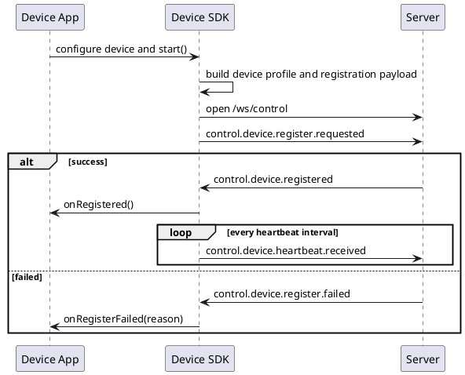
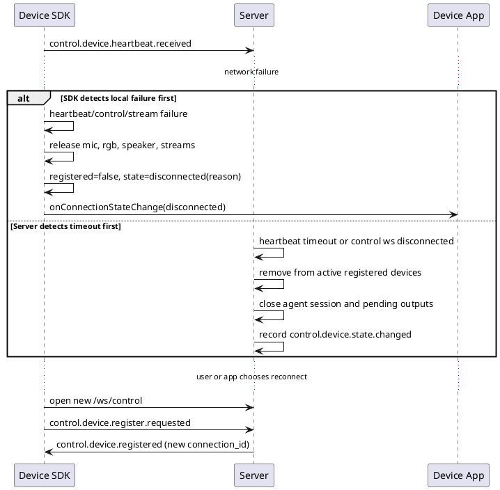
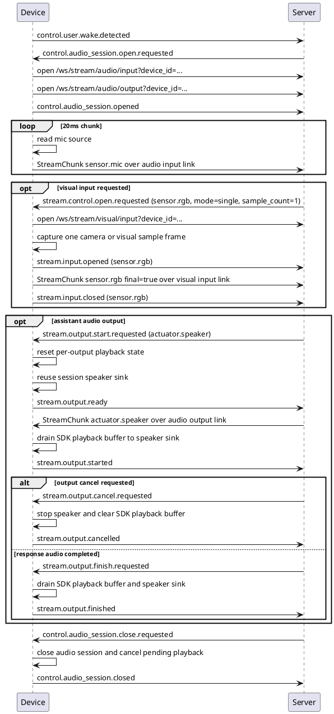
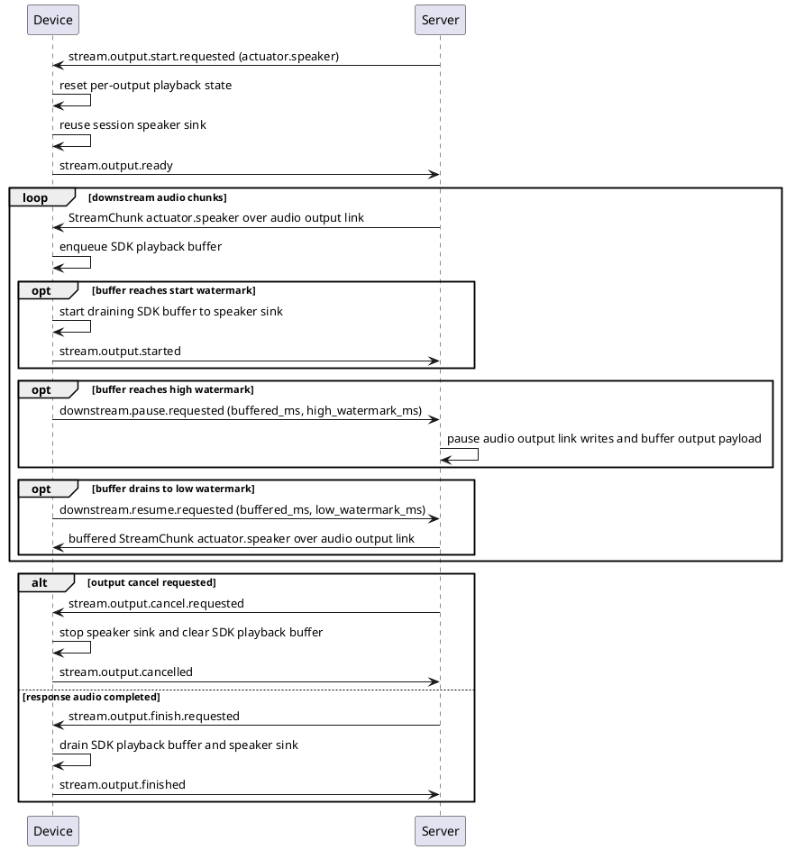

# 设备事件行为标准

本文整理 server 与 device 之间三类基础功能的标准事件行为：设备注册、开启实时对话、设备消费其他 server 事件。本文描述目标协议行为；如果当前实现仍与本文不一致，应以本文作为后续改造边界。

## 1. 设计边界

server 与 device 的通讯分为控制通道和多条媒体传输链路。控制通道只承载 JSON
事件；媒体链路按方向和媒体类型拆开，不能把麦克风上行、speaker 下行和视觉帧
塞进同一条物理 WebSocket。

| 通道 | 地址 | 内容 |
| --- | --- | --- |
| control WebSocket | `/ws/control` | JSON `Event`，用于注册、心跳、会话、命令、stream 生命周期控制和回执。 |
| audio input WebSocket | `/ws/stream/audio/input?device_id=<device_id>` | 端侧到 server 的 `sensor.mic` 二进制 `StreamChunk`。 |
| audio output WebSocket | `/ws/stream/audio/output?device_id=<device_id>` | server 到端侧的 `actuator.speaker` 二进制 `StreamChunk`。 |
| visual input WebSocket | `/ws/stream/visual/input?device_id=<device_id>` | server 请求后，端侧到 server 的 `sensor.rgb` 单帧图片 `StreamChunk`。 |

控制事件里不能放音频、图片、视频等大字节数据。大字节数据必须走对应的媒体
WebSocket 或资产服务。`stream_id` 和 `stream_type` 只表示逻辑流，不表示所有
逻辑流共享同一条物理连接。

`sensor.mic` 和 `actuator.speaker` 属于系统音频主链路，不作为普通 `supports` 能力声明：

- `properties.realtime_agent.audio_input=sensor.mic` 表示设备可以作为系统麦克风输入端。
- `properties.realtime_agent.audio_output=actuator.speaker` 表示设备可以作为系统扬声器输出端。
- 普通视觉、执行器能力仍放在结构化 `supports.sensors` / `supports.actuators` 中，例如 `rgb`、`vibrator`。

## 2. 设备注册

标准动作：

1. App 通过 Device SDK 配置设备身份、启用的硬件能力和自定义事件 handler。
2. SDK 根据配置生成设备 profile 和注册 payload。
3. SDK 建立 `/ws/control`。
4. SDK 发送 `control.device.register.requested`。
5. server 处理注册请求。
6. server 建立该设备后续可消费的事件范围。
7. server 返回 `control.device.registered` 或 `control.device.register.failed`。
8. SDK 收到 `control.device.registered` 后启动周期心跳 `control.device.heartbeat.received`。

App 开发者不应该手写注册 JSON。注册事件、`supports`、`properties` 和心跳都由 Device SDK 根据配置自动生成。

目标 SDK 使用形态：

```text
sdk = DeviceClient(
  device_id="dev-browser-glass-001",
  user_id="user-browser-glass-001",
  name="浏览器调试设备",
  runtime=Runtime.browser(),
  audio_input=AudioInput.enabled(),
  camera=Camera.enabled(),
  speaker=Speaker.enabled(buffer=PlaybackBuffer.default())
)

sdk.on_custom_command("haptic.vibrate", handleVibrate)
sdk.on_event("custom.navigation.route.updated", handleRouteUpdated)

sdk.start()
```

上面的示例是高层语言的目标形态。C/C++、ESP32-S3、Linux 网关等实现可以改用配置结构体或初始化函数传入 `mic_source`、`camera_source`、`speaker_sink`、`transport` 等 adapter。协议行为必须一致，但具体 API 名称不要求和 Swift、Python 或浏览器 SDK 完全相同。

SDK 内部生成的注册 payload 必须使用结构化能力，不允许生成旧 `routes` 或旧 `capabilities`。例如启用 camera 时，SDK 自动生成 `supports.sensors[].type=rgb`；启用 audio input / speaker 时，SDK 自动生成对应的系统音频 `properties`。完整 JSON 信封只放在通讯协议和 SDK 实现蓝图中，作为 SDK 开发者和协议测试参考，不作为 App 接入方式。



### 2.1 心跳、断连和重新注册

心跳是设备和 server 之间的健康检查。设备注册成功后，server 在 `control.device.registered.payload.heartbeat_interval_seconds` 中返回心跳间隔；Device SDK 按该间隔发送 `control.device.heartbeat.received`。该事件表示“server 收到了设备心跳”，不表示 App 业务层的一次对话动作。

断连分为端侧本地断连和 server 侧断连，两者不依赖同一个事件完成：

- 端侧本地断连：Device SDK 在 heartbeat 发送失败、control WebSocket receive 失败、control WebSocket EOF、必要媒体 stream 超过重试上限等情况下自行判定。端侧不能等待 server 下发断连事件，因为网络断开时它通常收不到任何控制事件。
- server 侧断连：server 在 control WebSocket 断开或 heartbeat 超时后判定。server 应记录 `control.device.state.changed`，用于 runs、debug API 和其他仍在线观察方；该事件不是通知已断开设备的可靠机制。

端侧 SDK 判定断连后必须执行本地收口：

1. 停止 heartbeat、control receive loop 和媒体 stream receive loop。
2. 停止 `sensor.mic` 上传和未完成的 `sensor.rgb` 采集。
3. cancel `actuator.speaker` sink，清空 SDK 播放 buffer，取消待完成的 start/finish/drain 任务。
4. 清理本地 audio session、stream、output stream 临时状态。
5. 标记 `registered=false`、control/stream 状态为 `disconnected`。
6. 向 App 发布 SDK 本地连接状态，例如 `disconnected(reason)`。

server 判定断连后必须执行 server 侧收口：

1. 从 active registered devices 中移除该设备；它不再参与事件路由、设备选择或 output consumer 集合。
2. 释放该设备关联的 control connection 和 stream connection。
3. 如果该设备是当前用户的实时音频会话端点，关闭 Agent session、输出流和播放仲裁状态，记录 `audio_session.closed`，原因使用 `control_ws_disconnected` 或 `heartbeat_timeout`。
4. 失败化该设备上未完成的远程命令、资产请求或等待端侧回执的任务。
5. 保留必要的绑定关系和最近错误，供 debug API 和重新注册鉴权使用。

重新注册必须走完整注册流程。设备不能复用旧 `connection_id`，也不能假设旧 stream 仍可用。同一 `device_id` 和同一 `user_id` 在断连后重新注册时，server 应允许注册并返回新的 `connection_id`；如果同一 `device_id` 换成其他 `user_id`，仍按绑定策略拒绝或走显式解绑流程。



## 3. 开启实时对话

实时对话不是 device 自己直接进入对话状态，而是先由唤醒事件触发 server 下发音频会话打开请求。会话打开后，对话过程同时包含三条主链路：麦克风音频上行、按请求触发的单帧视觉上行、server 音频下行播放。

端侧 SDK 负责封装硬件接入、协议状态机和 stream chunk。麦克风、相机、喇叭默认禁用；App 必须显式 enable 或显式绑定 adapter 后，SDK 才会注册这些能力。Swift、浏览器等平台可以使用 SDK 默认 hardware adapter；C/C++、ESP32-S3、Linux 网关等场景通常由 App、BSP 或示例工程提供 adapter，例如板级麦克风 source、相机 source、speaker sink 和 transport。SDK 的职责是把输入字节或帧封装成 `StreamChunk` 写入对应的媒体链路，把 server 下发的 speaker output chunk 从音频下行链路写入播放 buffer 和 speaker sink。

目标 SDK 使用形态：

```text
sdk = DeviceClient(
  audio_input=AudioInput.enabled(),
  camera=Camera.enabled(),
  speaker=Speaker.enabled(buffer=PlaybackBuffer.default())
)

sdk.on_custom_command("haptic.vibrate", handleVibrate)
sdk.on_event("custom.navigation.route.updated", handleRouteUpdated)

sdk.start()
```

显式 enable 或绑定 adapter 后，App 不需要在业务代码里手写 WebSocket 发送麦克风字节，也不需要手写 WebSocket 接收 speaker 字节。平台默认 adapter 可用时，App 可以不手动绑定硬件；没有默认 adapter 的 C/嵌入式场景，板级代码负责绑定 source/sink，但仍不应重写协议状态机。

标准动作：

1. device 已完成注册和心跳。
2. 用户触发唤醒，device 发送 `control.user.wake.detected`。
3. server 向设备下发 `control.audio_session.open.requested`。
4. device 确认可以进入实时音频状态，建立或复用音频上行 `/ws/stream/audio/input?device_id=<device_id>` 和音频下行 `/ws/stream/audio/output?device_id=<device_id>` 两条链路，并确认 SDK 已启用且可读取 `sensor.mic`、session 级 `actuator.speaker` sink/runtime 已准备或可复用。
5. device 发送 `control.audio_session.opened`，表示端侧已经接受本次音频会话打开请求；payload 中携带本次 `sensor.mic` 上行 stream 标识和音频格式。
6. server 收到 `control.audio_session.opened` 后，才能把本轮实时对话视为可用并消费后续 `sensor.mic` chunk；SDK 从绑定的 `sensor.mic` source 按 `chunk_ms` 读取 PCM 字节，封装为 `StreamChunk sensor.mic`，通过音频上行链路持续发送。
7. 麦克风硬件或系统录音资源由端侧自行决定何时打开；语音唤醒设备可以在注册完成后就保持麦克风采集。
8. server 根据连续音频流自行判断语音开始、语音结束和 turn 边界；device 不做 VAD，不用 `final=True` 表达一句话结束。
9. 如果实时对话需要视觉输入，server 下发一次 `stream.control.open.requested`，声明 `stream_type=sensor.rgb`、`mode=single`、`sample_count=1`、`request_id` 和格式参数。
10. device 打开或复用 SDK 默认相机 adapter，或 App 覆盖的摄像头、视频文件、图片样例 source，建立或复用视觉上行链路，发送 `stream.input.opened`，采集一帧后通过视觉上行链路上传一个 `sensor.rgb` 图片 chunk，且该 chunk 必须 `final=true`。
11. 一次视觉请求只产生一张图片。device 发送该图片后立即发送 `stream.input.closed`；采集失败时发送 `stream.input.failed`。当前阶段不定义端侧主动后台推送，也不定义周期性采集画面。
12. 当 server 需要播放模型回复音频时，下发 `stream.output.start.requested (actuator.speaker)`；这个事件不要求重新建立 `/ws/stream/audio/output`，也不要求每轮重建播放器，而是在已建立的音频下行链路和 session 级 speaker runtime 上重置本轮逻辑 output stream 状态，例如 `stream_id`、seq 计数、start/finish/cancel 标记、上轮残留 buffer 和水位线状态。如果本轮音频格式和当前 speaker sink 格式不同，SDK 才需要重新配置 sink。端侧完成本轮逻辑状态重置后发送 `stream.output.ready`。
13. server 必须等待 `stream.output.ready` 后，才向音频下行链路写入本轮 `actuator.speaker` chunk。`stream.output.started` 只表示端侧达到起播水位并开始本地播放，不表示 speaker runtime 准备完成。
14. SDK 负责维护内置的 speaker 播放 buffer，并按配置的播放启动水位线、高水位线和低水位线决定何时开始播放、何时暂停或恢复 server 下行写出。App 开发者只配置 SDK 的播放 buffer 参数，不在业务 App 中实现这套 buffer。
15. 播放期间麦克风仍持续上行；端侧不判断用户是否开始说话，也不判断是否构成打断。端侧只需要响应 server 下发的 `stream.output.cancel.requested`。
16. device 收到 `stream.output.cancel.requested` 后立即停止本地 speaker 播放、丢弃 SDK 播放 buffer 中未播放的数据，并发送 `stream.output.cancelled`。
17. 如果没有被打断，server 写完本轮回复音频后下发 `stream.output.finish.requested`；对 speaker 音频，finish payload 会尽量携带 `output_chunk_count`、`output_last_seq` 和 `output_bytes`，device 先确认最后一帧已经进入 SDK 播放 buffer，再等 buffer 和本地 sink drain 完成后发送 `stream.output.finished`。
18. 如果 server 请求关闭会话，会下发 `control.audio_session.close.requested`；device 停止麦克风和未完成的视觉采集，取消尚未完成的 speaker 输出和待播放 buffer，发送 `control.audio_session.closed`。音频会话关闭是会话级资源收口，不等同于某轮 speaker 输出的 `finish`；正常听完一轮回复仍由 `stream.output.finish.requested/finished` 表达。

系统音频会话不再额外发送 `stream.input.opened (sensor.mic)` 或 `stream.input.closed (sensor.mic)`，避免和 `control.audio_session.opened/closed` 重复。浏览器参考端的真实麦克风模式使用 `pcm16le / 16000Hz / mono / 20ms`。端侧应该先建立音频上行链路并发送 `control.audio_session.opened`，再持续发二进制 chunk；server 应等待 `control.audio_session.opened` 后再按本轮会话处理麦克风音频。不要把麦克风音频放进 control event。`StreamChunk.final` 只表示该输入 stream 的最后一包数据，不表示端侧识别出了一句话或一次语音结束。

麦克风的最小契约是：SDK 在显式启用或绑定音频输入后，必须能从默认 adapter 或 App/BSP 提供的 source 读取 `codec/sample_rate/channels/chunk_ms` 一致的音频字节。source 可以是真实系统麦克风、浏览器 `MediaStream`、音频文件、测试样例，或 C/ESP32-S3 中封装 PDM/I2S、AEC 前处理后的板级 source。SDK 不关心底层硬件具体打开时机，但在 `control.audio_session.opened` 后必须能持续读取并上传。

视觉输入使用独立的视觉上行链路上传 `sensor.rgb`，不能和麦克风上行或 speaker 下行共用一条物理 WebSocket。当前阶段视觉链路是请求驱动的单帧采集：server 每次需要画面上下文时下发一次 `stream.control.open.requested (sensor.rgb, mode=single, sample_count=1)`，端侧只采集并上传一张图片，然后关闭该逻辑输入流。如果已经选择图片或视频样例，端侧只从样例中取一帧；没有样例时再打开摄像头采集一帧。图片字节不能放进 control event，也不能在没有 server 请求时无节制后台上传。

系统音频下行使用独立的 `actuator.speaker` output 链路。音频下行物理 WebSocket 和 session 级 speaker runtime 已经在 `control.audio_session.opened` 之前建立或准备完成；`stream.output.start.requested` 只表示 server 希望在这条已建立的链路上开始一轮逻辑 speaker 输出。device 必须在本轮逻辑 output stream 状态重置完成后发送 `stream.output.ready`，server 收到该回执后才能向音频下行链路写 speaker chunk。`stream.output.finish.requested` 只表示 server 已写完音频数据，不表示用户已经听完；device 必须等本地播放队列 drain 完成后再发送 `stream.output.finished`。由于控制事件和音频下行 chunk 走不同 WebSocket，`stream.output.finish.requested` 可能先于最后几个 speaker chunk 到达端侧；当 payload 携带 `output_last_seq` 时，Device SDK 必须先等到该序号的 chunk 已经进入播放 buffer，再执行 drain 和完成回执。如果对话过程中收到 `stream.output.cancel.requested`，device 应立即停止当前播放并回 `stream.output.cancelled`。

喇叭的最小契约是：SDK 在显式启用或绑定 speaker 后，必须能把 `actuator.speaker` chunk 写入默认播放器 adapter 或 App/BSP 提供的 sink。为了减轻 App 负担，SDK 应优先处理协议格式、buffer 和播放调度；sink 只需要提供平台播放、`drain` 和 `cancel` 能力。对 C/ESP32-S3 这类需要回声抑制的实现，speaker sink 还可以在板级内部把已播放或待播放音频写入 AEC reference，但这不改变协议事件。`stream.output.finished` 必须在 SDK 播放 buffer 和 sink 本地播放队列 drain 后发送，不能在 server 下发 finish 时立即发送。

端侧 speaker 播放 buffer 由 SDK 实现，而不是由业务 App 或 speaker sink 实现。App 开发者只需要在 SDK 初始化时配置 buffer 大小和水位线，用来在播放流畅度和内存占用之间取舍：

- SDK buffer 达到高水位线：SDK 发送 `downstream.pause.requested`，payload 至少包含当前 `stream_id`、`buffered_ms`、`high_watermark_ms` 和 `reason="speaker_buffer_high"`。
- SDK buffer 下降到低水位线：SDK 发送 `downstream.resume.requested`，payload 至少包含当前 `stream_id`、`buffered_ms`、`low_watermark_ms` 和 `reason="speaker_buffer_low"`。
- 暂停期间 SDK 继续把本地 buffer 中的数据写入 speaker sink；server 不应继续在音频下行链路写出新的 speaker chunk，而应等 resume 后再恢复写出。该背压只影响音频下行链路，不能阻塞 `sensor.mic` 或 `sensor.rgb` 上行。
- cancel 优先级高于水位线。收到 `stream.output.cancel.requested` 后，SDK 必须停止播放并清空本地 buffer，不再等待低水位线。

打断不是音频会话关闭。播放期间端侧仍只负责持续上传 `sensor.mic` chunk；端侧不需要知道 server 为什么发出 `stream.output.cancel.requested`。收到该事件后，端侧停止正在播放的下行音频并回执。



### 3.1 音频下行播放与水位线流控

音频下行播放单独作为一条子链路维护。`stream.output.start.requested` 只表示 server 准备在已建立的音频下行 WebSocket 和 session 级 speaker runtime 上开始一轮逻辑 speaker 输出；真正的播放节奏由端侧 SDK 的播放 buffer 和本地 speaker sink 共同决定。server 必须等 `stream.output.ready` 后再写出第一包 speaker 音频。

SDK 内置播放 buffer，App 不需要自己实现接收队列、水位线判断或 `downstream.pause/resume` 事件。App 只在初始化 SDK 时配置 buffer 参数，例如启动播放水位线、低水位线、高水位线和最大 buffer 时长；SDK 根据这些参数向 server 反馈暂停或恢复下行写出。



## 4. 设备消费其他 server 事件

本节只定义注册、实时对话主链路之外的 server 事件。device 只消费自己通过注册路由订阅到的事件。标准事件按标准生命周期回执；`custom.*` 事件不强制标准回执，App 如需回报业务结果，应发送另一个 `custom.*` 事件。

严格按“前三章没有讲过的新 server -> device 事件名”计算，标准协议事件不应该在本节继续扩展含义。`command.requested` 属于标准命令事件族；`stream.output.start.requested` / `stream.output.finish.requested` / `stream.output.cancel.requested` 属于标准 output stream 生命周期，已经在第 3 节作为 `actuator.speaker` 下行播放生命周期讲过。为了避免和这些内置事件族冲突，业务扩展必须使用 `custom.*` 事件名。

端侧 SDK 的事件分发必须使用明确的命名空间隔离，不能只靠“未命中内置 handler 再兜底”这种隐式约定。标准事件继续使用 `control.*`、`stream.*`、`command.*`、`system.*` 等命名空间；所有业务扩展或 App 自定义事件必须使用 `custom.*` 命名空间。

SDK 路由规则：

1. `event_name` 以 `custom.` 开头：SDK 不进入任何标准内置状态机，只进入自定义事件分发器。
2. `event_name` 不以 `custom.` 开头：SDK 按标准协议处理，只能进入注册、音频会话、视觉单帧采集、speaker 播放、标准命令等内置状态机。
3. 标准事件不能再投递给自定义 `on_event`。比如 `stream.output.start.requested (actuator.speaker)` 只能进入第 3 节的 speaker 播放链路，不应再触发自定义事件处理。

未来端侧 SDK 应提供的额外消费入口如下：

| server 事件 | 目标 SDK 消费方式 | 含义 | 端侧动作 |
| --- | --- | --- | --- |
| `custom.command.requested` | `on_custom_command(...)`；也可以用 `on_event(...)` | 业务自定义的低频端侧动作，例如业务模式切换、peer video 控制、自定义硬件动作 | 执行业务命令；如需回报业务结果，使用 `ctx.emit("custom.<domain>.<event>", payload)` 发送自定义事件 |
| 其他 `custom.<domain>.*` | `on_event(...)` | 项目扩展事件或 App 自定义事件 | App 自己解释 payload；如事件有生命周期要求，必须按自定义事件自己的协议回执 |

视觉单帧采集的 `stream.control.open.requested (sensor.rgb)` 已在第 3 节定义，不在本节重复。实时音频会话的 `control.audio_session.*` 也由第 3 节定义。

自定义事件命名建议使用 `custom.<app_or_domain>.<event_name>`，必要时追加状态后缀，例如：

```json
{
  "event_name": "custom.navigation.route.updated",
  "payload": {
    "route_id": "route_001",
    "distance_m": 120
  }
}
```

`custom.*` 事件不能伪装成标准事件生命周期。`custom.command.*` 是独立的自定义事件族，只用于业务扩展；不能替代标准 `command.*`。speaker 音频播放永远使用标准 `stream.output.* (actuator.speaker)` 链路。非音频业务动作优先使用 `custom.command.requested` 或普通 `custom.<domain>.*` 事件，不暴露 `custom.output.*` 作为 App 开发者主路径。

当前协议实现已经允许 `custom.*` 事件名通过 schema 和 server 运行时校验。App 通过端侧 SDK 的 `on_custom_command(...)` / `on_event(...)` 注册回调后，SDK 会在设备注册 payload 的 properties 中声明自定义消费能力，server 再据此生成 `custom.command.requested` 或具体 `custom.<domain>.*` 投递路由。App 不需要手写 routes。

文档中的 `on_event(...)`、`on_custom_command(...)` 表示 SDK 暴露给 App 的公开注册 API；`handle*` / `dispatch*` 只表示 SDK 内部状态机和路由函数，不是端侧 App 开发者直接实现的 API。

### 4.1 自定义命令事件

`custom.command.requested` 用于低频、离散、以业务语义为中心的端侧动作，例如：

- 震动一次：`payload.command="haptic.vibrate"`。
- 切换端侧模式：例如进入低功耗、静音、引导模式。
- 启动或停止本地业务能力：例如 peer video sender / receiver、本地导航、本地推理任务。

这类事件不承载媒体数据，也不要求后续一定有 stream chunk。payload 只描述命令名、参数和关联 ID。SDK 不强制 App 返回固定生命周期事件；如需回报业务结果，App 通过 `ctx.emit(...)` 发送自定义事件。

标准动作：

1. server 下发 `custom.command.requested`。
2. handler 执行业务动作。
3. 如果需要告诉 server 业务结果，handler 调用 `ctx.emit("custom.<domain>.<event>", payload)`。

### 4.2 未来 SDK 消费方式示例

以下示例是目标 SDK 设计，不表示当前代码已经全部实现。设计目标是各语言 SDK 都能用 `on_event` 或更语义化的 `on_*` 入口直接消费事件，不要求业务代码手写 control WebSocket 分发。

#### Python

```python
async def handle_vibrate(ctx):
    duration_ms = ctx.payload.get("duration_ms", 120)
    await device.haptics.vibrate(duration_ms)
    await ctx.emit("custom.haptic.vibrate.done", {"duration_ms": duration_ms})

client.on_custom_command("haptic.vibrate", handle_vibrate)
client.on_event("custom.navigation.route.updated", lambda event: app.handle_custom_event(event))
```

#### Swift

```swift
client.onCustomCommand("haptic.vibrate") { ctx in
    let durationMs = ctx.payload["duration_ms"] as? Int ?? 120
    try await haptics.vibrate(durationMs: durationMs)
    try await ctx.emit("custom.haptic.vibrate.done", ["duration_ms": durationMs])
}

client.onEvent("custom.navigation.route.updated") { event in
    try await app.handleCustomEvent(event)
}
```

#### Java

```java
client.onCustomCommand("haptic.vibrate", ctx -> {
    int durationMs = ctx.payload().getInt("duration_ms", 120);
    haptics.vibrate(durationMs);
    ctx.emit("custom.haptic.vibrate.done", Map.of("duration_ms", durationMs));
});

client.onEvent("custom.navigation.route.updated", event -> {
    app.handleCustomEvent(event);
});
```

#### C

下面示例只表达 C 语言的目标接入风格。实际 C SDK 可以使用不同的 context、payload 和 emit API 名称；关键要求是 handler 不直接处理 WebSocket 路由。

```c
static void on_vibrate(ra_command_t *cmd, void *user_data) {
    int duration_ms = ra_command_payload_int(cmd, "duration_ms", 120);
    app_haptics_vibrate(duration_ms);
    ra_command_emit(cmd, "custom.haptic.vibrate.done", "{ \"duration_ms\": 120 }");
}

ra_client_on_custom_command(client, "haptic.vibrate", on_vibrate, NULL);
ra_client_on_event(client, "custom.navigation.route.updated", on_custom_event, NULL);
```

SDK 应保证这些 handler 只收到本设备已订阅且路由命中的事件；handler 内只关心业务动作和回执，不需要自己解析底层 WebSocket 路由。

## 5. 当前回归测试入口

标准行为测试落在：

```bash
uv run python -m pytest agent-server/protocol-tests/sdk/runtime/test_device_event_behavior_standard.py -q
```

该测试文件当前覆盖：

- browser-glass 形状注册后，设备能按声明消费标准 server 事件。
- wake 后必须先收到 `control.audio_session.open.requested`，端侧回 `control.audio_session.opened` 后实时对话才进入可用状态。
- 系统 `sensor.mic` 输入由 `control.audio_session.opened/closed` 表达生命周期，音频数据通过音频上行链路持续发送；语音边界由 server 判定。
- device 消费视觉单帧采集 `stream.control.open.requested` 后，必须通过视觉上行链路上传一个 `final=true` 的 RGB chunk，并发送 `stream.input.closed`。
- device 消费 `custom.command.requested` 后，如需回报业务结果，使用 `ctx.emit("custom.<domain>.<event>", payload)` 发送自定义事件。
- 非音频业务动作必须使用 `custom.command.requested` 或普通 `custom.<domain>.*`，不能复用标准 `stream.output.*`。

本次 speaker 下行时序调整后，需要补齐的回归点：

- speaker 下行物理 WebSocket 和 session 级 speaker runtime 已经在音频会话打开阶段建立或准备；每轮回复必须先收到 `stream.output.start.requested`，端侧重置本轮逻辑 output stream 状态后回 `stream.output.ready`，server 再下发 `actuator.speaker` chunk；`stream.output.started` 只表示端侧已经开始本地播放，正常播完后端侧回 `stream.output.finished`。
