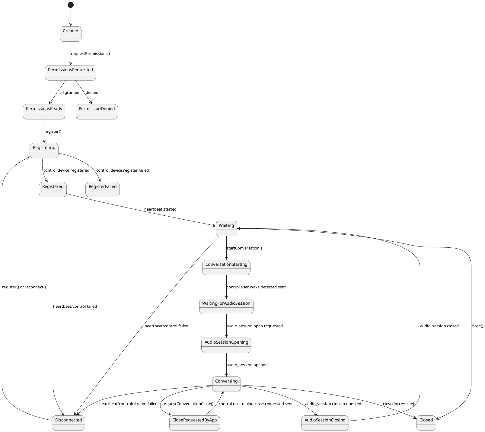
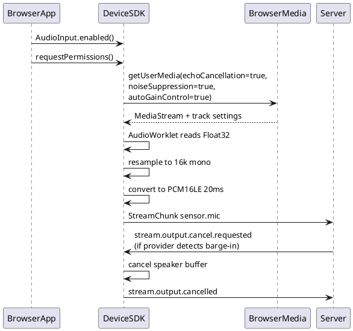

# JavaScript Device SDK 设计草案

本文定义 `devices/javascript/` 的 JavaScript Device SDK 目标设计。该 SDK 面向浏览器、Node、Electron 和 WebView 端侧，负责把 JavaScript 运行环境接入 realtime-agent 的标准设备协议。Swift Device SDK 是当前主要参考实现，`dev-support/devices/browser-glass/` 只作为浏览器音视频链路经验来源，不作为正式 SDK 边界。

## 1. 设计目标

JavaScript Device SDK 负责封装端侧开发者不应该手写的协议和媒体链路：

- 设备注册、心跳、control WebSocket 和连接状态机。
- 音频上行、音频下行、视觉上行三条媒体 WebSocket。
- 标准控制事件消费和回执。
- 麦克风、speaker、RGB 单帧输入的协议状态机。
- 浏览器默认麦克风、相机和 speaker adapter。
- Node 默认 mock / file adapter，便于单元测试和离线回放。
- speaker 播放 buffer、乱序重排、水位线、finish/drain 和 cancel 抢占。
- 浏览器实时麦克风链路的回声抑制、噪声抑制、自动增益和 PCM 转换。
- `custom.*` 事件和自定义命令语法糖。
- SDK diagnostics、debug log 和可复制排障快照。

端侧 App 不需要处理协议细节。App 负责：

- 页面、按钮、状态展示和用户交互。
- 何时创建 client、申请权限、注册、开始和结束对话。
- 业务 `custom.*` 事件的具体行为。
- 浏览器标签页、WebView 或 Electron 生命周期策略。
- 断连后的手动重连、后台重试或错误展示策略。

## 2. 设计原则

1. SDK 默认不启用硬件，App 必须显式启用麦克风、相机和 speaker。
2. 标准协议事件只进入 SDK 内置状态机，不投递给 App 的普通事件 handler。
3. App 只能通过 `onCustomCommand(...)` 和 `onEvent("custom.*", ...)` 消费业务扩展。
4. 音频、图片和视频字节必须走媒体 WebSocket，不放进 control JSON。
5. 新实现只使用正式三条媒体链路，不使用旧的单一 `/ws/stream?device_id=...`。
6. speaker 播放使用 `start` / `finish` / `cancel` 语义，不再使用旧 `open` / `close` 表达播放生命周期。
7. speaker buffer 是 SDK 内置能力，不交给 App 或 speaker sink 实现。
8. cancel 优先级最高，必须能抢占 start、playing、finish/drain 任意阶段。
9. 端侧不做 VAD 语义裁决。浏览器本地可提供输入质量诊断，但真正打断仍由 server/provider 决策，再下发 `stream.output.cancel.requested`。
10. 浏览器实时对话的最大风险是外放回采导致自打断。SDK 默认 browser mic adapter 必须优先启用浏览器 WebRTC AEC 能力，并记录真实 track settings 供排查。
11. 断连不能依赖 server 下发事件。control、heartbeat 或关键 stream 失败后，SDK 必须先完成本地资源收口，再通知 App。
12. Node 环境不默认声明真实麦克风、相机和 speaker；只有注入 adapter 或使用测试 adapter 时才注册对应能力。

## 3. 目标使用形态

浏览器 App 的目标 API：

```js
import {
  AudioInput,
  Camera,
  DeviceClient,
  PlaybackBuffer,
  Speaker,
} from "@realtime-agent/device";

const client = new DeviceClient({
  serverUrl: "http://192.168.10.10:8765",
  deviceId: "dev-device-demo-web-001",
  userId: "user-device-demo",
  name: "Device Demo Web",
  clientType: "web-chat",
  audioInput: AudioInput.enabled(),
  camera: Camera.enabled(),
  speaker: Speaker.enabled({
    buffer: PlaybackBuffer.default(),
    duplexMode: "full_duplex_server_barge_in",
  }),
  auth: {mode: "disabled"},
  properties: {
    "demo.name": "device_app_demo",
    "demo.interaction": "audio_video_conversation",
  },
  logLevel: "debug",
});

client.onCustomCommand("demo.ping", async (context) => {
  await context.emit("custom.demo.pong", {ok: true});
});

client.onEvent("custom.demo.message", async (event) => {
  console.debug("custom event", event.payload);
});

client.onConnectionStateChange((state) => {
  app.renderConnectionState(state);
});

client.onConversationStateChange((state) => {
  app.renderConversationState(state);
});

await client.requestPermissions();
await client.register();
await client.startConversation({reason: "web_chat_start_button"});
```

Node 或测试环境目标 API：

```js
const client = new DeviceClient({
  serverUrl: "http://127.0.0.1:8765",
  deviceId: "dev-node-test-001",
  userId: "user-device-demo",
  name: "Node test device",
  audioInput: AudioInput.enabled({source: filePcmSource}),
  camera: Camera.enabled({source: fixtureFrameSource}),
  speaker: Speaker.enabled({sink: recordingSpeakerSink}),
});
```

## 4. SDK 和 App 边界

| 能力 | JavaScript SDK | Web / Node App |
| --- | --- | --- |
| 设备 profile | 根据配置生成注册 payload | 填写身份、名称、属性和启用能力 |
| control WebSocket | 负责连接、收发、重连入口 | 不直接创建 |
| 心跳 | 注册成功后自动发送，失败时触发断连 | 只展示连接状态 |
| audio input stream | 负责连接和发送 `sensor.mic` chunk | 不手写 WebSocket 或 chunk |
| audio output stream | 负责接收 `actuator.speaker` chunk | 不直接消费下行 chunk |
| visual input stream | 收到请求后上传 `sensor.rgb` 单帧 | 只提供预览或自定义 frame source |
| 麦克风 AEC | browser adapter 默认启用 WebRTC AEC 约束并记录 settings | 不在页面里临时处理回声抑制 |
| PCM 转换 | adapter 转成 `pcm16le / 16000Hz / mono / 20ms` | 不手写音频切片 |
| speaker buffer | SDK 维护乱序、去重、水位线、finish、cancel | 可配置 buffer 参数 |
| speaker sink | 调用默认 Web Audio 或注入 sink | 不实现协议状态机 |
| 标准事件 | SDK 内部消费并回执 | 不通过 `onEvent` 处理 |
| `custom.*` | 提供语法糖和 context | 负责业务动作 |
| diagnostics | 维护计数、状态、最近错误和音频诊断 | 展示、复制或落盘 |
| 断连收口 | 停止 heartbeat、mic、camera、speaker、stream | 决定重连策略 |

## 5. 包结构

建议第一版采用 ESM JavaScript + JSDoc 类型，先降低构建复杂度；后续需要发布 npm 包时再补 TypeScript declaration 或迁移 TypeScript。

```text
devices/javascript/
  package.json
  README.md
  JAVASCRIPT_DEVICE_SDK_DESIGN.md
  src/
    index.js
    device-client.js
    device-profile.js
    diagnostics.js
    event.js
    stream-chunk.js
    options.js
    custom-command-context.js
    transport/
      browser-websocket-transport.js
      node-websocket-transport.js
    media/
      browser-camera-frame-source.js
      browser-microphone-source.js
      browser-speaker-sink.js
      file-microphone-source.js
      noop-speaker-sink.js
      pcm.js
      speaker-playback-buffer.js
  test/
    device-client.test.js
    device-profile.test.js
    event.test.js
    speaker-playback-buffer.test.js
    stream-chunk.test.js
```

## 6. 核心模块职责

| 模块 | 职责 | 不负责 |
| --- | --- | --- |
| `DeviceClient` | SDK 门面 API，组合注册、事件、媒体、状态回调 | 直接做 UI 或业务行为 |
| `DeviceProfile` | 生成结构化 `properties` / `supports` 注册 payload | 维护 App 表单状态 |
| `ControlChannel` | `/ws/control` JSON 事件收发 | 标准事件业务语义 |
| `StreamChannel` | 三条媒体 WebSocket 二进制 chunk 收发 | 播放水位线和 PCM 转换 |
| `EventRouter` | 分发标准事件和 `custom.*` | App 页面状态 |
| `HeartbeatManager` | 周期发送 heartbeat，失败时上报断连 | App 是否后台重试 |
| `ConversationSessionController` | wake、audio session open/close、mic/speaker/rgb 协调 | 浏览器按钮文案 |
| `BrowserMicrophoneSource` | getUserMedia、AEC 约束、PCM16 转换、20ms chunk | 判断用户是否打断 |
| `BrowserSpeakerSink` | Web Audio 播放、drain、cancel | 维护协议 buffer |
| `BrowserCameraFrameSource` | camera preview 复用、canvas 抓 JPEG 单帧 | 后台连续上传视频 |
| `SpeakerPlaybackBuffer` | seq 重排、去重、水位线、finish 等待、cancel 清空 | 真实播放硬件 |
| `Diagnostics` | 汇总连接、stream、音频、speaker buffer 状态 | 替代 runs 产物 |

## 7. 生命周期状态机



`requestConversationClose()` 只发送 `control.user.dialog.close.requested`，不直接关闭本地资源。server 下发 `control.audio_session.close.requested` 后，SDK 才停止麦克风、取消 speaker、清理 stream 并发送 `control.audio_session.closed`。

## 8. 浏览器实时麦克风与回声抑制

浏览器端音视频对话最大的端侧风险是 speaker 外放被麦克风采回，server/provider 误判为用户插话，进而下发 cancel。Swift 侧依赖 iOS Voice Processing；浏览器侧没有同等 AVAudioSession 能力，第一版应复用 `browser-glass` 已验证的 WebRTC capture 约束作为默认 AEC 策略：

```js
const stream = await navigator.mediaDevices.getUserMedia({
  audio: {
    echoCancellation: true,
    noiseSuppression: true,
    autoGainControl: true,
  },
});
const track = stream.getAudioTracks()[0];
diagnostics.recordMicSettings(track.getSettings());
```

SDK 的 browser mic adapter 必须做到：

1. 默认开启 `echoCancellation`、`noiseSuppression`、`autoGainControl`。
2. 记录 `track.getSettings()`，包括浏览器实际是否启用了 echo cancellation。
3. 使用同一个 `AudioContext` 管理 mic capture 和 speaker playback，避免页面创建多套不可控音频上下文。
4. 把浏览器输入重采样为 `pcm16le / 16000Hz / mono / 20ms`。
5. 在 audio processing callback 内只做轻量复制、重采样和 buffer 拼接，不做网络重连、复杂日志或 DOM 更新。
6. 不在 SDK 内做 VAD 决策；只可暴露 mic RMS、回声风险、underrun 等诊断数据。
7. speaker 播放期间仍默认持续上传麦克风，以支持 server/provider 侧 barge-in；如后续发现浏览器 AEC 不稳定，可通过配置加入诊断型 warmup mute，但不能替代 server cancel 语义。

第一版可以沿用 `browser-glass` 的处理思路：从 `MediaStreamSource` 读取 Float32，线性重采样到 16kHz，转 PCM16，累计到 20ms 后发送。实现时优先使用 `AudioWorklet`，只有在目标浏览器不支持时再考虑轻量 fallback。`ScriptProcessorNode` 已过时，只能作为临时兼容路径，不能成为长期主线。



## 9. Speaker 下行播放

SDK 内置 `SpeakerPlaybackBuffer`。浏览器默认 sink 只负责 Web Audio 播放：

1. `stream.output.start.requested` 到达后，SDK 重置本轮 output state，准备 sink，发送 `stream.output.ready`。
2. SDK 接收 `actuator.speaker` chunk，按 `seq` 暂存、去重和顺序 drain。
3. buffer 达到 `startWatermarkMS` 后发送 `stream.output.started`。
4. buffer 达到高水位线后发送 `downstream.pause.requested`。
5. buffer 降到低水位线后发送 `downstream.resume.requested`。
6. 收到 `stream.output.finish.requested` 后，如果 payload 有 `output_last_seq`，必须先等待该 seq 进入 buffer，再 drain sink，最后发送 `stream.output.finished`。
7. 收到 `stream.output.cancel.requested` 后立即清空 buffer、停止 sink、取消 finish/drain task，并发送 `stream.output.cancelled`。

浏览器 `BrowserSpeakerSink` 推荐用 `AudioWorklet` 播放 PCM16。sink 可以记录 underrun、queued frames、drain 完成时间，但不负责协议回执。

## 10. Camera 单帧输入

`sensor.rgb` 当前阶段是请求驱动的单帧输入，不做后台连续上传：

1. server 下发 `stream.control.open.requested`，`stream_type=sensor.rgb`。
2. SDK 打开或复用视觉上行 WebSocket。
3. SDK 从默认 browser camera source 或 App 注入 source 读取一帧。
4. SDK 发送 `stream.input.opened`。
5. SDK 上传一个 JPEG `StreamChunk`，`final=true`。
6. SDK 发送 `stream.input.closed`；失败时发送 `stream.input.failed`。

App 可以展示 camera preview，但不能手写 `sensor.rgb` chunk。SDK 默认 source 可以复用 App 传入的 `<video>` 或内部隐藏 video/canvas。

## 11. 事件处理

标准事件由 SDK 内部消费：

- `control.audio_session.open.requested`
- `control.audio_session.close.requested`
- `stream.control.open.requested`
- `stream.control.close.requested`
- `stream.output.start.requested`
- `stream.output.finish.requested`
- `stream.output.cancel.requested`
- `command.requested`

App 只消费：

- `custom.command.requested` 中注册过的业务 command。
- 普通 `custom.*` 事件。
- SDK 连接状态、对话状态和 debug log 回调。

`onEvent(eventName, handler)` 必须只接受 `custom.*`。如果 App 尝试注册标准事件，SDK 应直接抛错或拒绝注册。

## 12. 断连收口

SDK 判定本地断连后必须按顺序执行：

1. 停止 heartbeat、control receive loop 和 stream receive loop。
2. 停止 mic AudioWorklet / processor，关闭 `MediaStreamTrack`。
3. 停止未完成的 camera capture。
4. cancel speaker sink，清空 SDK playback buffer，取消 start/finish/drain task。
5. 关闭 control 和 stream WebSocket。
6. 清理本地 session、stream、output stream 状态。
7. 标记 `registered=false`，状态改为 `disconnected(reason)`。
8. 通过 `onConnectionStateChange` 通知 App。

重新注册必须重新打开 control WebSocket 并发送新的 `control.device.register.requested`，不能复用旧 `connection_id`。

## 13. 诊断日志

SDK 至少提供以下 diagnostics：

- connection state、conversation state、control state、stream state。
- sent / received control event count。
- sent / received stream chunk count。
- 当前 mic format、chunk_ms、已发送 seq、已发送字节数。
- browser mic `track.getSettings()`。
- audio context state、sample rate。
- speaker buffer 水位、queued chunks、nextDrainSeq、out-of-order、duplicate。
- speaker sink queued frames、underrun 次数、drain 耗时。
- 最近一次断连原因、最近一次标准事件、最近一次错误。

协助排查的日志使用 DEBUG；用户可见状态使用 INFO；协议不一致、超时、硬件不可用使用 WARNING 或 ERROR。

## 14. 测试策略

第一版测试重点不是覆盖 UI，而是验证 SDK 协议边界：

- `Event` JSON round-trip。
- `StreamChunk` 编解码和 payload size mismatch。
- 启用硬件后生成正确 `properties` / `supports`。
- 注册成功后发送 heartbeat。
- heartbeat/control receive 失败后进入 `disconnected` 并释放资源。
- `startConversation()` 会注册、准备 stream 并发送 `control.user.wake.detected`。
- `requestConversationClose()` 只发送 `control.user.dialog.close.requested`。
- audio session open 后启动 mic source 并上传 `sensor.mic`。
- `custom.command.requested` 调用对应 handler。
- 标准事件不会触发 App `onEvent`。
- `sensor.rgb` open 请求会通过视觉上行发送单帧并回 closed。
- speaker buffer 按 seq 顺序 drain 乱序 chunk。
- finish 等待 `output_last_seq`。
- cancel 抢占 pending finish/drain。
- browser mic adapter 构造 `getUserMedia` 时默认启用 `echoCancellation`、`noiseSuppression`、`autoGainControl`。

建议命令：

```bash
cd devices/javascript
npm test
```

如果后续引入真实浏览器验证，再补 Playwright 测试确认 Web Audio、getUserMedia mock、camera preview 和 UI 状态。
