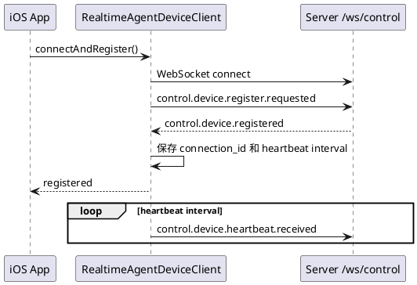
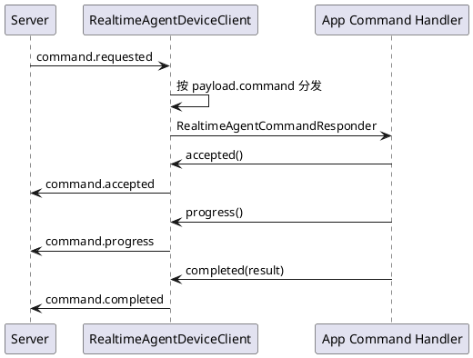
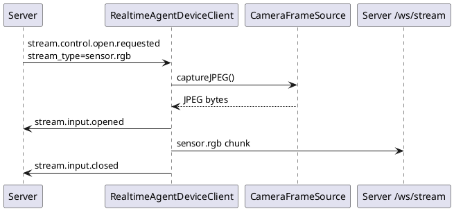
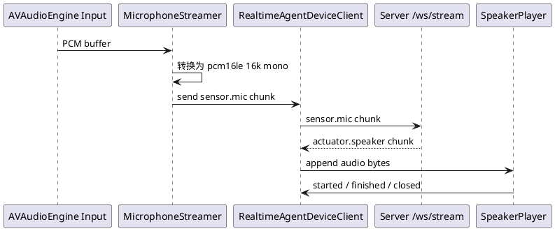
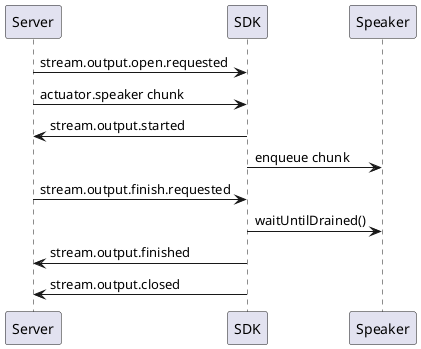

# iOS 设备侧 SDK 设计文档与开发计划

本文面向 `devices/swift/` 下的 `RealtimeAgentDeviceKit`。目标是把当前 Swift
协议模型和 stream codec 扩展为可在 iOS App 中直接使用的设备侧 SDK，让手机端用少量
Swift 代码完成和 realtime-agent server 的实时音视频协作，并能响应 server Task
通过协议下发的端侧事件。

本文以当前 `realtime-agent.v1` 协议为准。SDK 只负责端侧通讯、媒体采集播放适配和协议
生命周期管理，不内置 for-blind-app 的业务 Task 逻辑，也不依赖 Server SDK 内部对象。

## 当前状态

`RealtimeAgentDeviceKit` 当前已经具备：

1. `RealtimeAgentDevice`：构建设备注册 payload。
2. `RealtimeAgentEvent`：控制事件信封模型。
3. `RealtimeAgentStreamChunk` / `RealtimeAgentStreamChunkCodec`：`/ws/stream` 二进制帧编解码。
4. Swift Package 结构和基础单元测试。

制定计划时的缺口：

1. 没有封装 `URLSessionWebSocketTask` 客户端。
2. 没有注册等待、注册失败处理、自动心跳、重连和诊断状态。
3. 没有 `command.requested` 与 `stream.control.open.requested` 的回调分发 API。
4. 没有输入 stream helper，开发者仍需手写 `stream.input.opened/chunk/closed/failed`。
5. 没有输出 stream helper，端侧播放状态回执仍需手写。
6. 没有 iOS 麦克风、扬声器、相机的适配层。
7. iOS 参考端中的通用运行时逻辑尚未迁回 Swift SDK。

## 目标

最终目标 API 应让业务 App 的主流程接近：

```swift
import RealtimeAgentDeviceKit

let device = RealtimeAgentDevice(deviceID: "dev-ios-phone-001")
    .user("user-001")
    .named("iPhone")
    .role("phone")
    .sensorRgb(modes: ["single", "continuous"], format: "jpeg", frequencyHz: 5)
    .actuatorVibrator()

let client = RealtimeAgentDeviceClient(
    serverURL: URL(string: "http://192.168.1.23:8765")!,
    device: device
)

client.onCommand("phone.scan_object") { command in
    try await command.accepted()
    try await command.completed(["status": "ok"])
}

client.onStreamOpen("sensor.rgb") { request in
    let frame = try await camera.captureJPEG()
    try await request.opened(["request_id": request.requestID ?? ""])
    try await request.write(frame, codec: "jpeg", sampleRate: 1, channels: 1, final: true)
    try await request.closed()
}

try await client.connectAndRegister()
try await client.startMicrophone()
try await client.startSpeaker()
```

达到这个目标后，App 开发者只需要关心：

1. 自己声明哪些设备能力。
2. 为 Task/Command 注册本地 handler。
3. 选择是否启用内置麦克风、扬声器、相机适配器。
4. 处理 iOS 权限、UI 和产品生命周期。

## 非目标

1. 不在 SDK core 中写死业务 Task，例如找物体、导航、交通灯识别等。
2. 不绕过 server 新增端侧私有 RPC。
3. 不把音频、图片、视频 bytes 放进 control event。
4. 不把 `device_id` 当作业务路由 API 暴露给应用层。
5. 不在 SDK 内部直接依赖 `examples/for-blind-app`。
6. 不承诺第一版支持 WebRTC；当前协议主路径仍是 control event 加 `/ws/stream`。

## 协议边界

### 控制通道

控制通道使用：

```text
/ws/control
```

SDK 负责发送和接收以下事件：

| 方向 | 事件 | SDK 行为 |
| --- | --- | --- |
| Device -> Server | `control.device.register.requested` | 由 `connectAndRegister()` 发送。 |
| Server -> Device | `control.device.registered` | 标记注册成功，读取 `connection_id` 和心跳间隔。 |
| Server -> Device | `control.device.register.failed` | 抛出注册失败错误，记录诊断状态。 |
| Device -> Server | `control.device.heartbeat.received` | 注册成功后按 server 返回间隔自动发送。 |
| Server -> Device | `command.requested` | 分发给 `onCommand` 注册的 handler。 |
| Device -> Server | `command.accepted/progress/completed/failed` | 通过 `CommandResponder` 发送。 |
| Server -> Device | `stream.control.open.requested` | 分发给 `onStreamOpen` 注册的 handler。 |
| Device -> Server | `stream.input.opened/closed/failed` | 通过 `InputStreamRequest` 发送。 |
| Server -> Device | `stream.output.open.requested` | 准备本地输出播放或执行器。 |
| Server -> Device | `stream.output.close.requested` | 本地播放收尾后回报 finished/closed。 |
| Server -> Device | `stream.output.finish.requested` | 等待本地缓冲播放完成后回报 finished/closed。 |
| Server -> Device | `stream.output.cancel.requested` | 立即取消本地输出并回报 cancelled。 |
| Device -> Server | `stream.output.started/finished/closed/failed/cancelled` | 由输出 helper 或媒体适配器发送。 |

### Stream 通道

stream 通道使用：

```text
/ws/stream?device_id=<device_id>
```

二进制帧格式保持当前实现：

```text
4 bytes big-endian header length
JSON header bytes
payload bytes
```

header 必须包含：

| 字段 | 说明 |
| --- | --- |
| `version` | 固定为 `realtime-agent.v1`。 |
| `user_id` | 当前用户 ID。 |
| `session_id` | 当前设备会话或 server 请求中的 session。 |
| `stream_id` | stream 标识。 |
| `stream_type` | `sensor.mic`、`sensor.rgb`、`actuator.speaker` 等。 |
| `seq` | 单个 stream 内递增序号。 |
| `timestamp_ms` | 端侧生成时间。 |
| `codec` | `pcm16le`、`jpeg`、`png` 等。 |
| `sample_rate` | 采样率或帧率语义值。 |
| `channels` | 通道数。 |
| `duration_ms` | chunk 对应时长。 |
| `payload_size` | payload 字节数，解码时必须校验。 |
| `final` | 是否最后一帧。 |
| `metadata` | 可选扩展字段，例如 `request_id`、`turn_id`、`capture_reason`。 |

### 能力声明

注册 payload 中的 `supports` 使用结构化能力声明：

```swift
let device = RealtimeAgentDevice(deviceID: "dev-ios-phone-001")
    .user("user-001")
    .role("phone")
    .sensorRgb(modes: ["single", "continuous"], format: "jpeg", frequencyHz: 5)
    .actuatorVibrator(commands: ["vibrate"])
```

系统音频不作为普通 `supports` 暴露：

1. `sensor.mic` 由系统音频输入链路进入 server。
2. `actuator.speaker` 由输出播放链路进入端侧。
3. SDK 可以提供 `startMicrophone()` 和 `startSpeaker()`，但注册能力里不新增普通
   `sensors[].type=mic` 或 `actuators[].type=speaker`。

## 目标模块

```text
devices/swift/Sources/RealtimeAgentDeviceKit/
  RealtimeAgentDevice.swift
  RealtimeAgentEvent.swift
  RealtimeAgentStreamChunk.swift
  RealtimeAgentDeviceClient.swift
  RealtimeAgentCommandResponder.swift
  RealtimeAgentInputStreamRequest.swift
  RealtimeAgentOutputStreamSession.swift
  RealtimeAgentDiagnostics.swift
  RealtimeAgentErrors.swift
  Media/
    MicrophoneStreamer.swift
    SpeakerPlayer.swift
    CameraFrameSource.swift
```

### `RealtimeAgentDeviceClient`

主要职责：

1. 管理 control WebSocket。
2. 管理 stream WebSocket。
3. 发送注册事件并等待注册结果。
4. 注册成功后自动心跳。
5. 接收 control event 并分发。
6. 接收 stream chunk 并分发到输出 stream session。
7. 对外提供诊断快照。
8. 支持显式关闭和可控重连。

建议 API：

```swift
public final class RealtimeAgentDeviceClient {
    public init(serverURL: URL, device: RealtimeAgentDevice, configuration: RealtimeAgentClientConfiguration = .default)

    public func connect() async throws
    public func register(startHeartbeat: Bool = true) async throws -> RealtimeAgentEvent
    public func connectAndRegister(startHeartbeat: Bool = true) async throws
    public func close() async

    public func sendEvent(_ event: RealtimeAgentEvent) async throws
    public func sendEvent(name: String, payload: [String: Any], sessionID: String?, streamID: String?, streamType: String?) async throws

    public func ensureStream() async throws
    public func sendStreamChunk(_ chunk: RealtimeAgentStreamChunk) async throws

    public func onCommand(_ command: String, handler: @escaping @Sendable (RealtimeAgentCommandResponder) async throws -> Void)
    public func onStreamOpen(_ streamType: String, handler: @escaping @Sendable (RealtimeAgentInputStreamRequest) async throws -> Void)
    public func onOutputStream(_ streamType: String, handler: @escaping @Sendable (RealtimeAgentOutputStreamSession) async throws -> Void)

    public func diagnosticsSnapshot() async -> RealtimeAgentDiagnostics
}
```

`actor` 可以降低 WebSocket 状态、seq、handler 字典和诊断计数的并发风险。媒体采集和播放可在
独立对象中运行，通过 client actor 发送事件和 chunk。

### `RealtimeAgentCommandResponder`

封装 `command.*` 回执：

```swift
public struct RealtimeAgentCommandResponder {
    public let request: RealtimeAgentEvent
    public let commandID: String
    public let command: String

    public func accepted(_ payload: [String: Any] = [:]) async throws
    public func progress(_ payload: [String: Any] = [:]) async throws
    public func completed(_ payload: [String: Any] = [:]) async throws
    public func failed(code: String, message: String, retryable: Bool = false) async throws
}
```

关联字段优先级：

1. `payload.command_id`
2. `event_id`

`command` 字段来自 `payload.command`。如果业务 Task 继续使用 `task_type`，应在应用 handler
中解释，不在 SDK core 中写死。

### `RealtimeAgentInputStreamRequest`

封装 server 请求端侧打开输入 stream 的生命周期：

```swift
public struct RealtimeAgentInputStreamRequest {
    public let request: RealtimeAgentEvent
    public let streamID: String
    public let streamType: String
    public let requestID: String?

    public func opened(_ payload: [String: Any] = [:]) async throws
    public func write(_ payload: Data, codec: String, sampleRate: Int, channels: Int, durationMS: Int, final: Bool, metadata: [String: Any]) async throws
    public func closed(reason: String = "completed") async throws
    public func failed(code: String, message: String) async throws
}
```

`sensor.rgb` 的 handler 可以由 App 自己实现，也可以接入 SDK 的 `CameraFrameSource`。

### `RealtimeAgentOutputStreamSession`

封装端侧输出生命周期，第一版主要服务 `actuator.speaker` 和 `actuator.haptic`：

```swift
public struct RealtimeAgentOutputStreamSession {
    public let streamID: String
    public let streamType: String

    public func started() async throws
    public func append(_ chunk: RealtimeAgentStreamChunk) async throws
    public func finished() async throws
    public func closed(reason: String) async throws
    public func failed(code: String, message: String) async throws
    public func cancelled(reason: String) async throws
}
```

默认行为：

1. 收到第一帧 `actuator.speaker` chunk 时发送 `stream.output.started`。
2. 收到 `stream.output.finish.requested` 或 `stream.output.close.requested` 后，等待本地播放缓冲清空。
3. 缓冲清空后发送 `stream.output.finished` 和 `stream.output.closed`。
4. 收到 `stream.output.cancel.requested` 后立即停止播放并发送 `stream.output.cancelled`。

## 生命周期设计

### 注册与心跳



### Task / Command 事件响应



如果没有 handler：

1. 默认第一版可以返回 `false` 并由 App 自行处理。
2. 后续可提供配置项 `autoFailUnhandledCommands`，打开后自动发送 `command.failed`。
3. 默认不应静默吞掉未处理命令，诊断日志必须记录。

### RGB 单帧采集



### 实时音频对话



第一版应先支持：

1. `pcm16le`。
2. 16 kHz。
3. 单声道。
4. 20ms chunk。

如果 iOS 原始采样率不是 16 kHz，`MicrophoneStreamer` 应负责重采样。不要让业务 App 直接拼
stream header。

### 输出播放收尾



## iOS 媒体适配器

### `MicrophoneStreamer`

职责：

1. 请求麦克风权限。
2. 使用 `AVAudioEngine` 采集输入。
3. 转为 server 期望的 PCM 格式。
4. 按固定 chunk 大小调用 `client.sendStreamChunk()`。
5. 暂停、恢复、停止时发送对应 stream 生命周期事件。

第一版参数：

| 参数 | 默认值 |
| --- | --- |
| codec | `pcm16le` |
| sampleRate | `16000` |
| channels | `1` |
| chunkMS | `20` |
| streamType | `sensor.mic` |

### `SpeakerPlayer`

职责：

1. 消费 `actuator.speaker` stream chunk。
2. 支持顺序播放和缓冲队列。
3. 支持 cancel 时立即清空队列。
4. 播放开始、播放完成、关闭和失败时自动回执。

第一版可以先支持 `pcm16le`。如果 server 下行是 WAV 或其他 codec，SDK 应抛出清晰错误或通过
配置声明支持范围。

### `CameraFrameSource`

职责：

1. 请求相机权限。
2. 提供 `captureJPEG()` 单帧能力。
3. 后续提供 `startContinuous()` 连续采样能力。
4. 根据 server payload 中的 `mode`、`frequency_hz`、`sample_count` 控制采样。
5. 把 `request_id`、`turn_id`、`capture_reason` 透传到 chunk metadata。

第一版优先实现 `single` 模式，连续视频流作为第二阶段。

## 配置与诊断

### `RealtimeAgentClientConfiguration`

建议字段：

```swift
public struct RealtimeAgentClientConfiguration {
    public var protocolVersion: String = "realtime-agent.v1"
    public var connectTimeoutSeconds: TimeInterval = 8
    public var heartbeatGraceSeconds: TimeInterval = 3
    public var reconnectPolicy: RealtimeAgentReconnectPolicy = .exponentialBackoff(maxAttempts: 5)
    public var autoFailUnhandledCommands: Bool = false
    public var logLevel: RealtimeAgentLogLevel = .debug
}
```

### `RealtimeAgentDiagnostics`

建议记录：

1. control 连接状态。
2. stream 连接状态。
3. 是否已注册。
4. 最近一次注册失败原因。
5. 最近收到和发送的 event name。
6. 已发送 event 数量。
7. 已接收 event 数量。
8. 已发送 stream chunk 数量。
9. 已接收输出 chunk 数量。
10. 最近一次媒体错误。

## 错误处理原则

1. URL 无效、未连接、注册失败、协议 JSON 错误、stream payload size 不一致都使用明确错误类型。
2. 未处理 command 不应伪装成功。
3. stream 写入失败时应尽量发送 `stream.input.failed`。
4. 输出播放失败时应发送 `stream.output.failed`。
5. 重连后必须重新注册，不能假设旧 `connection_id` 仍有效。
6. 本地权限拒绝属于端侧能力不可用，应回报可诊断错误。

## 开发计划

### Phase 0：协议对齐和测试基线

目标：确保 Swift SDK 与当前协议 fixture 和 schema 对齐。

任务：

1. 梳理 Swift 当前模型和 Python SDK 的能力差距。
2. 增加 command fixture 往返测试。
3. 增加 stream output fixture 解码测试。
4. 增加无效 payload size、缺字段、未知 event 的错误测试。
5. 保留现有 `swift test` 作为最小回归入口。

验收：

```bash
cd devices/swift
swift test
```

### Phase 1：通讯客户端核心

目标：提供可连接 server 的 Swift Device SDK。

任务：

1. 新增 `RealtimeAgentDeviceClient`。
2. 实现 control WebSocket connect/register/close。
3. 实现注册成功等待和注册失败错误。
4. 实现自动心跳。
5. 实现 stream WebSocket ensure/send/receive。
6. 实现 `RealtimeAgentDiagnostics`。
7. 增加本地 mock WebSocket server 测试，覆盖注册和 stream 上传。

验收：

1. Swift 单元测试通过。
2. mock server 能收到 `control.device.register.requested`。
3. mock server 下发 `stream.control.open.requested(sensor.rgb)` 后能收到 opened、chunk、closed。

### Phase 2：Command 与 Stream helper

目标：让 App 不再手写生命周期事件。

任务：

1. 新增 `RealtimeAgentCommandResponder`。
2. 新增 `RealtimeAgentInputStreamRequest`。
3. 新增 `RealtimeAgentOutputStreamSession`。
4. 实现 `onCommand`、`onStreamOpen`、`onOutputStream`。
5. 实现未处理事件的诊断记录。
6. 增加 command accepted/progress/completed/failed 测试。
7. 增加 stream.input.opened/write/closed/failed 测试。
8. 增加 output started/finished/closed/cancelled 测试。

验收：

1. 用 20 行以内 Swift 测试代码完成命令响应。
2. 用 helper 完成 RGB 单帧上传，不直接拼 JSON。

### Phase 3：迁移 iOS 参考端通用运行时

目标：减少 `examples/for-blind-app/devices/native-ios-phone` 中的协议重复实现。

任务：

1. 在 iOS 工程中引入本地 Swift Package。
2. 删除参考端本地重复的 `RealtimeAgentEvent` 和 `StreamChunkCodec`，改用 SDK。
3. 把参考端现有 WebSocket 注册、事件接收和 stream 发送逻辑迁移到 SDK API。
4. 保留 App target 内的 UI、配置读取、直连相机接收服务和权限逻辑。
5. 更新 iOS 参考端 README。

验收：

```bash
cd examples/for-blind-app/devices/native-ios-phone
xcodebuild -scheme RealtimeAgentPhone -destination 'platform=iOS Simulator,name=iPhone 16' build
```

无 Xcode 环境时至少运行：

```bash
uv run python -m pytest \
  examples/for-blind-app/app-tests/endpoints/test_ios_phone_endpoint_contract.py \
  examples/for-blind-app/app-tests/config/test_endpoint_config_sync.py \
  -q
```

### Phase 4：iOS 音频适配器

目标：手机端能接入实时语音对话。

任务：

1. 新增 `MicrophoneStreamer`。
2. 新增 `SpeakerPlayer`。
3. 支持 PCM16LE 16k mono 20ms chunk。
4. 支持扬声器输出队列和 cancel。
5. 支持音频权限失败回报。
6. 增加音频格式转换单元测试。
7. 增加模拟 stream output 播放生命周期测试。

验收：

1. iOS Simulator 构建通过。
2. 真机能注册并上传 `sensor.mic`。
3. server 下发 `actuator.speaker` 时端侧能播放或至少完整消费并回执。
4. runs 中能看到 `sensor.mic` chunk、`actuator.speaker` chunk 和输出回执事件。

### Phase 5：iOS 相机适配器

目标：手机端能响应 `sensor.rgb` 单帧和连续采样请求。

任务：

1. 新增 `CameraFrameSource`。
2. 支持 `captureJPEG()`。
3. 支持 `stream.control.open.requested(sensor.rgb)` 的 `single` 模式。
4. 透传 `request_id`、`turn_id`、`capture_reason`。
5. 第二步支持 `continuous` 模式、`frequency_hz` 和 `sample_count`。
6. 增加权限失败、相机不可用、编码失败测试。

验收：

1. server 请求 `sensor.rgb` 后能收到真实 iPhone 相机 JPEG。
2. runs 中 `photos/` 和 `assets.jsonl` 能看到对应资产。
3. 连续采样模式能按 fps 和 sample_count 停止。

### Phase 6：端到端联调和文档发布

目标：形成可复用 iOS SDK 文档和示例。

任务：

1. 更新 `devices/swift/README.md` 的最小接入示例。
2. 增加 iOS 真机联调说明。
3. 增加跨设备联调流程：server、iOS phone、browser-glass 或 ESP32。
4. 增加 runs 观察点说明。
5. 准备 Swift Package tag 或独立发布说明。

验收：

1. 开发者按 README 能完成注册、语音输入、扬声器输出和 RGB 采集。
2. `swift test` 通过。
3. iOS build 通过。
4. server `/api/debug/devices` 能看到 iOS 设备、能力和在线状态。
5. runs 中能查到 control events、stream events、audio、photos 和 output decisions。

## 测试策略

### Swift SDK 单元测试

放在：

```text
devices/swift/Tests/RealtimeAgentDeviceKitTests/
```

覆盖：

1. 设备注册 payload 构造。
2. 控制事件 JSON 往返。
3. stream chunk 编解码。
4. command responder 生命周期。
5. input stream request 生命周期。
6. output stream session 生命周期。
7. 诊断状态更新。

### Swift SDK 真实 WebSocket 契约测试

目标：对齐 Python SDK 现有真实 WebSocket contract test。

建议实现一个 Swift 测试专用 mock server：

1. Swift 侧如果不想引入额外 server 依赖，可以先用 `URLProtocol` 或本地轻量 server fixture。
2. 如果实现成本过高，先保留 Python mock server 驱动 Swift client 的集成测试脚本。
3. 不为了测试简单而改弱协议断言。

### iOS 参考端构建测试

至少保留：

```bash
cd examples/for-blind-app/devices/native-ios-phone
xcodebuild -scheme RealtimeAgentPhone -destination 'platform=iOS Simulator,name=iPhone 16' build
```

### 跨设备联调

本地联调顺序：

1. 启动 server。
2. 运行 iOS phone 真机或模拟器。
3. 调用 `/api/debug/devices` 确认注册。
4. 触发语音输入或 RGB 请求。
5. 检查 runs 产物。

观察点：

1. `control-events.jsonl` 是否有注册、心跳、command、stream 生命周期事件。
2. `stream-events.jsonl` 是否有 `sensor.mic`、`sensor.rgb`、`actuator.speaker`。
3. `audio/` 是否有输入或输出音频。
4. `photos/` 和 `assets.jsonl` 是否有 RGB 资产。
5. `output-decisions.jsonl` 和 `playback-decisions.jsonl` 是否符合播放仲裁预期。

## 风险与决策点

1. `URLSessionWebSocketTask` 的长连接重连语义较弱，需要重点测试后台切换和网络恢复。
2. iOS 音频重采样和播放队列容易引入延迟，Phase 4 要先做可观测性。
3. 连续视频帧如果走 JPEG chunk，会比 WebRTC 更简单，但延迟和带宽压力更高。
4. 如果未来协议引入 WebRTC，当前 SDK 仍应保留 control event 作为能力协商和 Task 编排面。
5. `command.requested` 的业务语义应由 App handler 解释，SDK core 只负责生命周期回执。

## 第一轮落地建议

最小可交付范围建议只做 Phase 1 和 Phase 2：

1. Swift SDK 能连接、注册、心跳。
2. Swift SDK 能分发 `command.requested`。
3. Swift SDK 能响应 `stream.control.open.requested(sensor.rgb)` 并上传一帧 Data。
4. Swift SDK 能消费 `actuator.speaker` chunk 并按 helper 回执。
5. iOS 参考端先复用 SDK 通讯层，但真实麦克风和真实相机适配放到后续 Phase。

这样可以先把“通讯 SDK 可用”打通，再推进真实音频和视频。否则媒体层和协议层一起改，问题定位会很困难。

## 实施记录

### Phase 0：协议对齐和测试基线

- 状态：已完成。
- 目标：确保 Swift SDK 的事件、stream chunk 和异常处理仍符合 `realtime-agent.v1`。
- 实现：为 `RealtimeAgentEvent` 增加 JSON data/string 初始化与序列化；为
  `RealtimeAgentStreamChunkCodec` 增加 header/payload 解码入口；补充 payload size
  不一致的错误测试。
- 文件：
  - `Sources/RealtimeAgentDeviceKit/RealtimeAgentEvent.swift`
  - `Sources/RealtimeAgentDeviceKit/RealtimeAgentStreamChunk.swift`
  - `Tests/RealtimeAgentDeviceKitTests/RealtimeAgentDeviceKitTests.swift`
- 验证：`swift test`，通过 17 个 Swift Testing 用例。
- 风险：当前测试仍以 SDK 内 mock transport 为主，未覆盖真实 server 长连接抖动。

### Phase 1：通讯客户端核心

- 状态：已完成。
- 目标：提供能连接 server、注册、等待注册结果、心跳、连接 stream 通道和收发 chunk 的 Swift
  Device SDK。
- 实现：新增 `RealtimeAgentDeviceClient`、`RealtimeAgentDiagnostics`、
  `RealtimeAgentClientConfiguration` 和 `URLSessionRealtimeAgentTransport`。客户端支持
  `/ws/control`、`/ws/stream?device_id=...`、注册成功等待、注册失败抛错、自动心跳、诊断快照。
- 文件：
  - `Sources/RealtimeAgentDeviceKit/RealtimeAgentDeviceClient.swift`
  - `Sources/RealtimeAgentDeviceKit/RealtimeAgentDiagnostics.swift`
  - `Sources/RealtimeAgentDeviceKit/RealtimeAgentTransport.swift`
- 验证：`swift test` 中 `clientRegistersAndSendsHeartbeatOverTransport` 覆盖注册和 WebSocket URL。
- 风险：真实 URLSession WebSocket 网络断线重连未做端到端验证。

### Phase 2：Command 与 Stream helper

- 状态：已完成。
- 目标：让 App 不需要手写 `command.*`、`stream.input.*` 和 `stream.output.*` 生命周期事件。
- 实现：新增 `RealtimeAgentCommandResponder`、`RealtimeAgentInputStreamRequest`、
  `RealtimeAgentOutputStreamSession`；`RealtimeAgentDeviceClient` 支持 `onCommand`、
  `onAnyCommand`、`onEvent`、`onStreamOpen`、`onOutputStream`、`onOutputChunk`、`dispatchEvent` 和
  `dispatchStreamChunk`。App 可以通过 `onOutputChunk("actuator.speaker")` 消费服务端
  下发的真实音频 payload。
- 文件：
  - `Sources/RealtimeAgentDeviceKit/RealtimeAgentCommandResponder.swift`
  - `Sources/RealtimeAgentDeviceKit/RealtimeAgentInputStreamRequest.swift`
  - `Sources/RealtimeAgentDeviceKit/RealtimeAgentOutputStreamSession.swift`
  - `Sources/RealtimeAgentDeviceKit/RealtimeAgentDeviceClient.swift`
- 验证：`swift test` 覆盖 command accepted/progress/completed、任意 command 兜底处理、
  自定义 control event、RGB opened/chunk/closed、output finished/closed 和 output chunk
  handler 分发。
- 风险：未处理 command 当前默认只记录诊断，只有开启 `autoFailUnhandledCommands` 才自动 failed。

### Phase 3：迁移 iOS 参考端通用运行时

- 状态：已完成。
- 目标：让 `examples/for-blind-app/devices/native-ios-phone` 复用 Swift Package 的事件模型、codec
  和客户端。
- 实现：为 `RealtimeAgentPhone.xcodeproj` 增加本地 `RealtimeAgentDeviceKit` Swift Package
  依赖；将参考端本地 `RealtimeAgentEvent.swift` 和 `StreamChunkCodec.swift` 从 target Sources
  移除；`RealtimeAgentEndpointRuntime.swift` 和 `DirectCameraFrameCodec.swift` 改为
  `import RealtimeAgentDeviceKit` 并使用 SDK 公开类型。参考端通用 WebSocket 注册、心跳、
  control 接收分发、stream chunk 收发和输出 chunk 消费已迁移到 `RealtimeAgentDeviceClient`；
  App target 只保留 UI、配置读取、直连相机接收服务和本地状态展示。
- 验证：使用现有参考端代码运行
  `xcodebuild -scheme RealtimeAgentPhone -destination 'platform=iOS Simulator,name=iPhone 17' build`，
  构建通过。计划文档中的 `iPhone 16` 目标在本机不存在，命令失败并列出了可用模拟器。
- 待验收：参考端仍保留本地历史源文件作为迁移对照，但不再参与 target 编译；后续可以在确认无回退需求后删除。
- 风险：真机后台切换、网络断连重连、server 长连接抖动仍未做端到端验证。

### Phase 4：iOS 音频适配器

- 状态：本机可测协议能力已完成，真机媒体待验收。
- 目标：为实时语音对话提供 SDK 侧协议适配。
- 实现：新增 `MicrophoneStreamer`，负责打开 `sensor.mic` input stream、发送 PCM16LE chunk、
  关闭或失败回报。新增 `SpeakerPlayer`，可绑定 `RealtimeAgentDeviceClient` 并通过
  `onOutputChunk` 收集 `actuator.speaker` payload。新增 `AudioPCMConverter`，支持 Float32
  采样转 PCM16LE，并提供 16k mono 20ms chunk 字节数计算。三者都只处理协议生命周期和
  bytes 传递，不在 SDK core 内直接绑定 `AVAudioEngine` 或 `AVAudioPlayerNode`。
- 文件：
  - `Sources/RealtimeAgentDeviceKit/Media/MicrophoneStreamer.swift`
  - `Sources/RealtimeAgentDeviceKit/Media/SpeakerPlayer.swift`
  - `Sources/RealtimeAgentDeviceKit/Media/AudioPCMConverter.swift`
- 验证：`swift test` 中 `microphoneStreamerUploadsPCMChunk` 覆盖 opened/chunk/closed；
  `clientDispatchesOutputChunkToHandler` 覆盖服务端输出 chunk 分发；
  `outputSessionSendsCancelEvent` 覆盖 cancel 回执；`audioPCMConverterCreatesTwentyMSMonoChunk`
  覆盖 Float32 到 PCM16LE 的 20ms 单声道 chunk 转换。
- 待验收：真机麦克风权限、AVAudioEngine 采集、重采样、AVAudioPlayerNode 播放队列和
  后台/前台生命周期未验证。

### Phase 5：iOS 相机适配器

- 状态：本机可测协议能力已完成，真机相机待验收。
- 目标：为 `sensor.rgb` 单帧请求提供 SDK 侧协议适配。
- 实现：新增 `RealtimeAgentCameraFrameSource`、`ClosureCameraFrameSource`、
  `CameraFrameUploader.registerSingleFrameHandler` 和 `CameraFrameUploader.registerFrameHandler`。
  App 可注入自己的相机采集闭包，SDK 负责 opened、JPEG chunk、metadata 透传和 closed。
  continuous 请求会读取 `sample_count` 和 `frequency_hz`，按 sample_count 停止并把采样信息写入
  chunk metadata。
- 文件：
  - `Sources/RealtimeAgentDeviceKit/Media/CameraFrameSource.swift`
- 验证：`swift test` 中 `cameraUploaderRespondsToRgbRequest` 覆盖 `request_id` 和
  `capture_reason` metadata 透传；`cameraUploaderRespondsToContinuousRgbRequest` 覆盖
  continuous 模式、`frequency_hz`、`sample_count` 和 final chunk。
- 待验收：真实 `AVCaptureSession`、权限拒绝、相机不可用和 JPEG 编码失败未验证。

### Phase 6：端到端联调和文档发布

- 状态：部分完成。
- 目标：更新 Swift SDK 文档和可复现验证入口。
- 实现：更新 `README.md`，补充 `RealtimeAgentDeviceClient`、Command、RGB、Microphone 和
  CameraFrameUploader、SpeakerPlayer 示例，说明参考端迁移状态和当前限制。
- 文件：
  - `README.md`
  - `IOS_DEVICE_SDK_DESIGN_PLAN.md`
- 验证：
  - `cd devices/swift && swift test`：通过 17 个用例。
  - `uv run python -m pytest examples/for-blind-app/app-tests/endpoints/test_ios_phone_endpoint_contract.py examples/for-blind-app/app-tests/config/test_endpoint_config_sync.py -q`：通过 9 个用例。
  - `cd examples/for-blind-app/devices/native-ios-phone && xcodebuild -scheme RealtimeAgentPhone -destination 'platform=iOS Simulator,name=iPhone 17' build`：构建通过。
- 待验收：真实 iPhone 与 server 的注册、语音上传、扬声器播放、RGB 采集和 runs 产物检查仍需真机联调。
