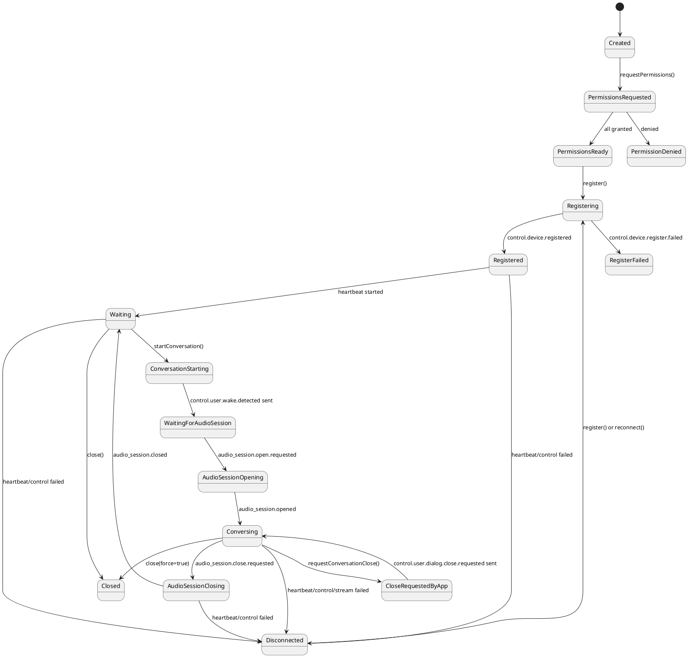
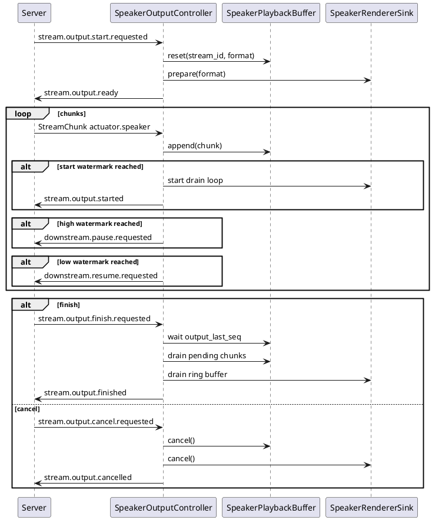

# Swift Device SDK 正式设计草案

本文定义下一版 Swift Device SDK 的目标 API、内部模块、协议状态机和音频播放链路设计。设计以当前端侧事件文档为准，上一版 `devices/swift-backup/` 只作为经验来源，不作为实现边界。

## 1. 设计目标

Swift Device SDK 面向所有 iOS 开发者，负责把设备接入 realtime-agent 的通用能力封装起来：

- 设备注册、心跳和控制通道。
- 连接状态机、断连检测、断连资源收口和重新注册入口。
- 显式硬件权限申请和硬件 adapter 绑定。
- 麦克风、speaker、RGB 单帧输入的标准协议状态机。
- 音频上行、音频下行、视觉上行三条媒体 WebSocket。
- speaker 播放 buffer、水位线、drain、cancel 清理。
- iOS Voice Processing / AEC 音频会话配置。
- 标准事件消费、`custom.*` 事件语法糖和自定义命令语法糖。
- 结构化诊断日志和可复制诊断快照。

iOS App 不需要处理协议细节。App 负责：

- UI 样式、按钮位置、按钮可用状态。
- 何时注册、何时点击开始通话、何时请求结束通话。
- 业务 `custom.*` 事件的具体行为，例如震动、导航、页面展示。
- App 生命周期与前后台策略。

## 2. 设计原则

1. SDK 默认不启用硬件，App 必须显式启用并授权。
2. 标准协议事件只进入 SDK 内置状态机，不投递给 App 的 `onEvent`。
3. App 只能通过 `onCustomCommand` 和 `onEvent("custom.*")` 消费业务扩展。
4. speaker 播放链路只使用 `start` / `finish` 语义，不再以 `open` / `close` 表达播放生命周期。
5. 播放、水位线、AEC、打断清理必须拆成独立模块。
6. “全双工可打断式对话”是可插拔能力，关闭后不影响播放、录音、finish/drain 和 server cancel。
7. 端侧不做 VAD 语义裁决。端侧可提供可选本地 gate，但真正对话打断仍应优先由 server/provider 决策，再下发 `stream.output.cancel.requested`。
8. cancel 优先级最高，必须能抢占 start、playing、finish/drain 任意阶段。
9. 音频 callback 内只做轻量复制或写 ring buffer，不做网络请求、文件写入和复杂日志格式化。
10. control WebSocket、heartbeat 或媒体 stream 任一主链路确认断连后，SDK 必须先完成本地资源收口，再把断连状态暴露给 App；App 只决定手动重连、后台重试或展示错误。
11. 断连不能依赖 server 下发事件，因为网络断开时端侧通常收不到任何控制事件。server 的 `control.device.state.changed` 只用于 server 侧观测、runs 产物和其他仍在线观察方。

## 3. App 侧目标使用形态

下面是 App 使用 SDK 的目标形态，只描述 SDK API，不设计 App UI：

```swift
let client = try DeviceClient(
    serverURL: "http://192.168.10.10:8765",
    deviceID: "dev-ios-001",
    userID: "user-device-demo",
    name: "iPhone",
    audioInput: .enabled(),
    speaker: .enabled(
        buffer: .default,
        duplexMode: .fullDuplexServerBargeIn
    ),
    camera: .enabled()
)

client.onCustomCommand("haptic.vibrate") { context in
    let durationMS = context.payload["duration_ms"] as? Int ?? 120
    try await haptics.vibrate(durationMS: durationMS)
    try await context.emit("custom.haptic.vibrate.done", ["duration_ms": durationMS])
}

client.onEvent("custom.navigation.route.updated") { event in
    try await navigation.update(event.payload)
}

try await client.requestPermissions()
try await client.register()

client.onConnectionStateChange { state in
    // App 可选择展示“连接断开，点击重连”，也可以按策略后台重试。
}

// App 可在注册和授权成功后点亮“开始通话”按钮。
try await client.startConversation()

// App 主动结束时，只请求 server 关闭；最终仍等待 server 下发 audio_session.close.requested。
try await client.requestConversationClose(reason: "user_tapped_end")
```

App 启动后的推荐阶段：

1. App 创建 `DeviceClient`，声明需要的硬件能力和自定义事件 handler。
2. App 调用 `requestPermissions()`，SDK 申请麦克风、相机等权限。
3. App 调用 `register()`，SDK 建立 control WebSocket、注册设备并启动心跳。
4. 注册成功且权限授权成功后，App 进入等待状态。
5. App 点击“开始通话”后调用 `startConversation()`。
6. SDK 准备硬件资源，向 server 发送唤醒事件，并按 server 请求打开音频会话。
7. 对话过程中 SDK 维护 mic、speaker、rgb、control 事件。
8. 结束对话时，server 下发 `control.audio_session.close.requested`；端侧停止输入、取消未完成输出和待播放资源、回 `control.audio_session.closed`。正常播完一轮回复仍由 `stream.output.finish.requested/finished` 表达。
9. 任一控制或媒体主链路断连时，SDK 停止心跳、录音、视觉采集和 speaker 播放，清空待播放资源，标记本地 `registered=false`，通知 App 进入断连态；App 可以调用 SDK 重新注册。

## 4. 生命周期状态机



`requestConversationClose()` 不直接关闭本地资源。SDK 先发送 `control.user.dialog.close.requested`，server 接受后再下发 `control.audio_session.close.requested`，端侧按标准链路关闭并回执。这样可以保持 server 对会话生命周期的最终仲裁。

`Disconnected` 是 SDK 本地状态，不要求也不等待 server 下发事件。进入该状态时，SDK 必须完成以下动作：

1. 停止 heartbeat、control receive loop、stream receive loop。
2. 停止麦克风上传和未完成的视觉采集。
3. cancel speaker sink、清空 SDK playback buffer、取消 start/finish/drain 任务。
4. 清理本地 stream/session 临时状态，`registered=false`，`controlState=disconnected`，`streamState=disconnected`。
5. 向 App 发出连接状态回调，并把对话状态收敛为等待或断连展示态。

断连后 App 不直接重用旧 `connection_id`。重新连接必须重新打开 control WebSocket、重新发送 `control.device.register.requested`，以 server 返回的新 `connection_id` 为准。

建议 SDK 暴露独立连接状态：

```swift
public enum DeviceConnectionState: Sendable, Equatable {
    case idle
    case connecting
    case registering
    case registered
    case disconnected(DeviceDisconnectReason)
    case closed
}

public enum DeviceDisconnectReason: Sendable, Equatable {
    case heartbeatFailed(String)
    case controlReceiveFailed(String)
    case streamReceiveFailed(String)
    case serverClosed(String)
    case localClose
}
```

App 通过 `onConnectionStateChange` 消费连接状态。Demo App 推荐手动重连：断连后按钮显示 `连接断开\n重连`，点击后重新执行权限检查和注册；正式 App 可以选择后台自动重试。

建议端侧请求结束事件：

```json
{
  "event_name": "control.user.dialog.close.requested",
  "stream_type": null,
  "payload": {
    "reason": "user_tapped_end"
  }
}
```

## 5. 包结构

建议 Swift Package 结构：

```text
devices/swift/
  Package.swift
  Sources/RealtimeAgentDeviceKit/
    DeviceClient.swift
    DeviceClientConfiguration.swift
    DeviceProfile.swift
    Events/
      RealtimeAgentEvent.swift
      EventRouter.swift
      CustomCommandContext.swift
      CommandResponder.swift
    Transport/
      ControlChannel.swift
      StreamChannel.swift
      WebSocketTransport.swift
      ReconnectPolicy.swift
    Session/
      RegistrationManager.swift
      HeartbeatManager.swift
      ConversationSessionController.swift
      HardwarePermissionManager.swift
    Media/
      AudioFormat.swift
      StreamChunk.swift
      MicrophoneCapturePipeline.swift
      VoiceProcessingAudioSession.swift
      CameraFrameSource.swift
      CameraFrameUploader.swift
      SpeakerOutputController.swift
      SpeakerPlaybackBuffer.swift
      SpeakerRendererSink.swift
      AVFoundationSpeakerRenderer.swift
      FloatRingBuffer.swift
    Interruption/
      DuplexMode.swift
      InterruptionSignalProvider.swift
      InterruptDecisionGate.swift
      PlaybackInterruptionCoordinator.swift
    Diagnostics/
      DeviceDiagnostics.swift
      AudioInteractionDiagnostics.swift
      AudioDiagnosticsLogger.swift
  Tests/RealtimeAgentDeviceKitTests/
```

## 6. 核心模块职责

| 模块 | 职责 | 不负责 |
| --- | --- | --- |
| `DeviceClient` | SDK 门面 API，组合注册、会话、媒体、事件语法糖 | 直接处理 WebSocket 字节或 AVAudioEngine 细节 |
| `RegistrationManager` | 生成 profile、发送注册、处理 registered/failed | 硬件权限和媒体连接 |
| `ConnectionStateStore` | 维护 idle/connecting/registering/registered/disconnected/closed，向 App 发布状态 | App 重连 UI 策略 |
| `HeartbeatManager` | 注册成功后周期发送心跳，发送失败时上报断连 | App 是否后台重试 |
| `ControlChannel` | `/ws/control` JSON 事件收发 | 标准事件业务语义 |
| `StreamChannel` | audio input/output/visual input 二进制 chunk 收发 | 播放水位线和音频格式转换 |
| `EventRouter` | 按标准事件或 `custom.*` 分发 | App UI 行为 |
| `ConversationSessionController` | 对话启动、音频会话打开/关闭、三条媒体链路协调 | speaker buffer 内部算法 |
| `HardwarePermissionManager` | 麦克风、相机权限申请和状态检查 | 自动弹 UI 或决定按钮状态 |
| `MicrophoneCapturePipeline` | 打开 input tap、输出 AEC 后 PCM chunk | 打断判断 |
| `VoiceProcessingAudioSession` | 配置 `.playAndRecord + .voiceChat`、input voice processing、路由诊断 | 播放队列 |
| `SpeakerOutputController` | `start/ready/started/finish/finished/cancel/cancelled` 状态机 | iOS AEC 和 VAD |
| `SpeakerPlaybackBuffer` | seq 重排、去重、水位线、finish 等待、cancel 清空 | 真实播放 |
| `SpeakerRendererSink` | 平台播放、ring buffer、drain、cancel | 协议事件 |
| `InterruptionSignalProvider` | 可选提供本地/远端打断候选信号 | 直接清理播放资源 |
| `InterruptDecisionGate` | warmup、RMS、去重等过滤策略 | 网络请求和播放器操作 |
| `PlaybackInterruptionCoordinator` | 可信打断后协调 speaker cancel 和协议回执 | 音频格式转换 |

### 6.1 断连收口职责

所有断连入口必须收敛到同一个 SDK 内部方法，例如 `handleConnectionLost(reason:)`。禁止 heartbeat、control receive loop、stream receive loop 各自只写诊断状态后退出。

断连入口包括：

- heartbeat 发送失败或连续失败达到阈值。
- control WebSocket receive 抛错、EOF 或被 server 关闭。
- 必要媒体 stream 在对话中确认不可恢复。
- App 调用 `close(force:)`；该路径进入 `closed`，不是 `disconnected`。

对话中的 stream 短抖可以先按 `ReconnectPolicy` 重试；一旦超过最大重试次数或 control 已断开，就必须进入统一断连收口。收口完成后，SDK 不再发送旧会话的 `stream.output.finished`、`control.audio_session.closed` 等回执，因为旧 control 连接已不可用；server 侧会通过心跳超时或 control ws 断开完成自己的清理。

## 7. 设备注册和权限

硬件默认禁用，App 显式启用后 SDK 自动生成注册 payload：

| App 配置 | 注册字段 |
| --- | --- |
| `audioInput: .enabled()` | `properties.realtime_agent.audio_input = sensor.mic` |
| `speaker: .enabled()` | `properties.realtime_agent.audio_output = actuator.speaker` |
| `camera: .enabled()` | `supports.sensors[].type = rgb` |
| `onCustomCommand("x")` | `properties.realtime_agent.custom_commands` |
| `onEvent("custom.x")` | `properties.realtime_agent.custom_event_subscriptions` |

权限 API：

```swift
public struct HardwarePermissionStatus: Sendable {
    public let microphone: PermissionState
    public let camera: PermissionState
}

public func requestPermissions() async throws -> HardwarePermissionStatus
public func currentPermissionStatus() async -> HardwarePermissionStatus
```

`register()` 不应隐式申请权限。权限申请是 App 可感知的用户交互，应由 App 在合适时机调用；但 SDK 负责具体系统 API 和状态返回。

## 8. 开始通话

`startConversation()` 的职责是请求 server 开始实时对话，不直接把本地状态改成 conversing：

```swift
public func startConversation(reason: String = "app_start_requested") async throws {
    try await ensureRegistered()
    try await prepareConversationHardware()
    try await sendEvent(
        "control.user.wake.detected",
        payload: ["reason": reason]
    )
}
```

`prepareConversationHardware()` 只做本地资源预热：

- 确认权限仍有效。
- 建立或预连接 audio input/output stream WebSocket。
- 准备 `VoiceProcessingAudioSession`。
- 准备 speaker renderer runtime，但不启动任何 output stream。
- 准备 camera source，但不主动上传图片。

真正进入对话以 server 下发 `control.audio_session.open.requested` 为准。

## 9. 音频会话打开

收到 `control.audio_session.open.requested` 后：

1. SDK 确认 audio input 已启用且 source 可读。
2. SDK 确认 speaker 已启用时 audio output channel 和 renderer runtime 可用。
3. SDK 建立或复用 `/ws/stream/audio/input?device_id=...`。
4. SDK 建立或复用 `/ws/stream/audio/output?device_id=...`。
5. SDK 发送 `control.audio_session.opened`，payload 包含 mic stream id 和格式。
6. SDK 启动 `MicrophoneCapturePipeline`，持续发送 `sensor.mic` chunk。
7. SDK 启动 audio output receive loop，等待 `actuator.speaker` chunk。

`sensor.mic` 不再发送 `stream.input.opened/closed`，其生命周期由 `control.audio_session.opened/closed` 表达。

## 10. Speaker 播放链路

### 10.1 协议流程



### 10.2 状态机

```text
idle
  -> starting       收到 stream.output.start.requested
  -> ready          renderer prepare 完成，发送 stream.output.ready
  -> buffering      接收 chunk，写入 SDK buffer
  -> playing        达到 start watermark，发送 stream.output.started
  -> finishing      收到 stream.output.finish.requested
  -> drained        SDK buffer 和 renderer drain 完成
  -> finished       发送 stream.output.finished

starting/ready/buffering/playing/finishing
  -> cancelling     收到 cancel 或本地可信打断
  -> cancelled      buffer + renderer 清理完成，发送 stream.output.cancelled
```

### 10.3 Buffer 默认值

正式默认值采用 `playback_chain_experiment` E4 推荐的小 buffer：

```swift
public struct SpeakerBufferConfiguration: Sendable, Equatable {
    public var startWatermarkMS: Int = 120
    public var lowWatermarkMS: Int = 300
    public var highWatermarkMS: Int = 800
    public var maxBufferMS: Int = 1200
}
```

压力测试值 `600/3000/12000/20000` 只作为调试配置，不作为默认配置。大 buffer 会增加插话后的可听残留风险。

### 10.4 Buffer 规则

`SpeakerPlaybackBuffer` 必须满足：

- 按 `seq` 暂存，连续 drain。
- 重复 chunk 忽略。
- 乱序 chunk 不直接写入 renderer。
- 达到 `startWatermarkMS` 才允许开始 drain。
- 达到 `highWatermarkMS` 发送 `downstream.pause.requested`。
- 降到 `lowWatermarkMS` 发送 `downstream.resume.requested`。
- 收到 finish 后，如果 payload 有 `output_last_seq`，必须等待该 seq 进入 buffer 后再 drain。
- cancel 必须立即清空所有未播放 chunk，不等待低水位。

### 10.5 Renderer 规则

默认 renderer 使用 `AVAudioEngine + AVAudioSourceNode + FloatRingBuffer`：

- `write(chunk)` 只做 PCM16LE 到 Float 转换并 append ring buffer。
- `render` 回调只从 ring buffer 拉样本，不做锁外网络或日志。
- `drain()` 等 ring buffer 播放完成，并保留短 tail check。
- `cancel()` 立即 reset ring buffer，并停止或重置播放器内部队列。
- `diagnostics()` 返回 buffered frames、underrun、dropped frames、engine running、sample rate。

正式第一版不依赖 `engine.outputNode.setVoiceProcessingEnabled(true)`。实验已显示 24k/mono source renderer 直接调用 output voice processing 可能触发底层异常，输出侧 voice processing 只能作为后续独立探针。

## 11. AEC 和麦克风链路

### 11.1 音频会话配置

默认配置：

```swift
public struct VoiceProcessingConfiguration: Sendable {
    public var category: AVAudioSession.Category = .playAndRecord
    public var mode: AVAudioSession.Mode = .voiceChat
    public var options: AVAudioSession.CategoryOptions = [.defaultToSpeaker, .allowBluetoothHFP]
    public var preferredSampleRate: Double = 16_000
    public var preferredIOBufferDuration: TimeInterval = 0.02
    public var enableInputVoiceProcessing: Bool = true
    public var prefersEchoCancelledInput: Bool = false
}
```

实现要求：

- 启用 `inputNode.setVoiceProcessingEnabled(true)`。
- 记录实际 input sample rate、channels、route、IO buffer、voice processing 状态。
- 真机实际 input format 可能是 48k mono，SDK 必须按实际格式转换为协议格式。
- `setPrefersEchoCancelledInput(true)` 只作为 iOS 18.2+ 可选增强和诊断字段，不作为主方案依赖。

### 11.2 Mic chunk

协议默认：

```text
codec = pcm16le
sample_rate = 16000
channels = 1
chunk_ms = 20
```

VAD 或本地 gate 推荐使用 100ms 聚合 chunk，但不能改变 `sensor.mic` 上行 cadence。即：

- 上行给 server 的 `sensor.mic` 保持 20ms。
- 本地或远端 VAD signal provider 可从同一份 AEC 后 PCM 聚合成 100ms。
- 诊断 `vad_upload.wav` 必须来自实际发送给 VAD 的音频。

### 11.3 播放期间 mic 策略

```swift
public enum MicrophonePlaybackPolicy: Sendable {
    case keepUploadingProcessedAudio
    case uploadSilenceDuringSpeakerPlayback(tailMS: Int)
}
```

默认建议为 `keepUploadingProcessedAudio`，配合 server/provider 做打断判断。`uploadSilenceDuringSpeakerPlayback` 只作为兼容或强抑制配置，适合不支持全双工插话的产品模式。

## 12. 全双工和打断设计

### 12.1 高层模式

```swift
public enum ConversationDuplexMode: Sendable {
    case playbackOnly
    case fullDuplexServerBargeIn
    case fullDuplexLocalDiagnostic(InterruptionConfiguration)
}
```

含义：

- `playbackOnly`：不启用 mic 或播放时不支持插话；仍响应 server cancel。
- `fullDuplexServerBargeIn`：播放期间持续上传 AEC 后 mic，由 server/provider 判断是否 cancel；SDK 只执行 server 下发的 `stream.output.cancel.requested`。
- `fullDuplexLocalDiagnostic`：SDK 可在本地运行 E4 风格的 warmup/RMS gate 作为诊断信号，但默认不直接触发协议 cancel。

第一版默认建议 `fullDuplexServerBargeIn`，因为它最符合当前协议：端侧不判断用户是否打断，只响应 server cancel。E4 中的 warmup gate、本地 RMS gate、speech_started 去重等“是否构成打断”的判断，正式主链路应迁移到 server 的打断仲裁模块中实现。SDK 保留 AEC 后 mic 上传、播放状态回执、speaker cancel 清理和诊断能力。

### 12.2 E4 逻辑的归属

E4 实验中的逻辑分为两类：

| 逻辑 | 正式归属 |
| --- | --- |
| iOS input voice processing / AEC | Swift SDK |
| speaker 水位线 buffer、ring renderer、finish/drain/cancel 清理 | Swift SDK |
| 播放开始时间、started/finished/cancelled 回执 | Swift SDK 产生，server 记录 |
| `speech_started` 是否可信 | server 打断仲裁 |
| warmup 忽略窗口 | server 打断仲裁，起点使用端侧 `stream.output.started` 时间 |
| RMS / peak 能量门限 | server 打断仲裁，基于 server 收到的 AEC 后 mic PCM 计算 |
| `speech_stopped` 后续收口 | server turn / session 策略 |

SDK 可以保留本地 E4 gate 作为诊断或离线实验模块，但不能作为第一版主协议路径的默认打断来源。正式默认路径应是：

```text
Swift SDK 上传 AEC 后 sensor.mic
-> server/provider 产生 speech_started
-> server 打断仲裁应用 warmup/RMS/状态检查
-> server 下发 stream.output.cancel.requested
-> Swift SDK 清理播放资源并回 stream.output.cancelled
```

### 12.3 本地诊断 Gate

本地 gate 只用于诊断、实验或后续可选模式，而不是播放模块的一部分：

```swift
public struct InterruptionConfiguration: Sendable {
    public var vadChunkMS: Int = 100
    public var warmupIgnoreMS: Int = 1500
    public var minInterruptRMS: Double = 0.025
    public var lookupWindowChunks: Int = 2
    public var acceptFirstOnly: Bool = true
    public var waitForSpeechStopAfterInterrupt: Bool = false
    public var speechStopTimeoutMS: Int = 8000
}
```

模块接口：

```swift
public protocol InterruptionSignalProvider: Sendable {
    func start(outputStreamID: String) async
    func appendProcessedMicChunk(_ chunk: ProcessedMicChunk) async
    func stop() async
}

public protocol InterruptDecisionGate: Sendable {
    func evaluate(_ signal: InterruptionSignal, context: InterruptionContext) async -> InterruptionDecision
}
```

`speech_started` 只是候选信号。Gate 处理：

1. 播放实际开始后 `warmupIgnoreMS` 内忽略打断。
2. 按 `audio_ms` 映射到 VAD chunk index。
3. 查 `center +/- lookupWindowChunks` 范围的 RMS/peak。
4. `max_rms >= minInterruptRMS` 才接受。
5. 每轮 output 只接受第一个可信 `speech_started`。

诊断 gate 接受后默认只记录日志：

```swift
audioDiagnostics.recordLocalInterruptCandidate(...)
```

如果未来产品明确需要离线端侧打断模式，才允许通过独立配置启用本地 cancel。该模式必须清楚标记为“端侧本地打断”，避免和 server 仲裁路径混淆。

## 13. RGB 单帧链路

RGB 只响应 server 的单帧请求：

1. 收到 `stream.control.open.requested`，`stream_type=sensor.rgb`。
2. SDK 打开或复用 camera source。
3. SDK 发送 `stream.input.opened`。
4. SDK 上传一个 `sensor.rgb` chunk，`final=true`。
5. SDK 发送 `stream.input.closed`。
6. 失败时发送 `stream.input.failed`。

SDK 不做后台持续上传。App 可以覆盖 camera source，但不需要手写 WebSocket 或 chunk。

## 14. 结束对话

server 主动结束：

```text
Server -> SDK: control.audio_session.close.requested
SDK: stop mic capture
SDK: stop pending rgb capture
SDK: cancel pending speaker output and clear playback buffer
SDK -> Server: control.audio_session.closed
```

App 主动结束：

```text
App -> SDK: requestConversationClose(reason)
SDK -> Server: control.user.dialog.close.requested
Server -> SDK: control.audio_session.close.requested
SDK -> Server: control.audio_session.closed
```

如果 server 长时间没有响应 App 主动结束请求，SDK 可进入本地保护性关闭：

```swift
public struct ConversationCloseConfiguration: Sendable {
    public var serverCloseAckTimeoutMS: Int = 5000
    public var forceLocalCloseOnTimeout: Bool = true
}
```

超时保护必须记录诊断，并在 control channel 恢复后补发状态或重新注册。第一版可先实现请求事件和日志，不默认强制关闭。

## 15. 诊断日志

SDK 提供轻量 debug 回调：

```swift
public func onDebugLog(_ handler: @escaping @Sendable (DeviceDebugLog) async -> Void)
```

关键字段：

### 播放

```text
speaker.start_requested stream_id format
speaker.ready stream_id prepare_ms
speaker.chunk_received stream_id seq bytes duration_ms
speaker.buffer_started buffered_ms
speaker.pause_requested buffered_ms high_watermark_ms
speaker.resume_requested buffered_ms low_watermark_ms
speaker.finish_requested output_last_seq output_chunk_count
speaker.drain_started buffered_ms ring_frames
speaker.finished drain_ms
speaker.cancel_requested reason phase
speaker.buffer_cleared chunks duration_ms
speaker.renderer_cleared frames duration_ms
speaker.late_chunk_ignored stream_id seq
```

### AEC / mic

```text
audio_session.configured category mode route sample_rate io_buffer_ms
mic.voice_processing_enabled enabled
mic.chunk_sent stream_id seq bytes gap_ms rms peak
mic.capture_error error
```

### 打断

```text
interrupt.signal speech_started event_seq audio_ms
interrupt.rejected reason=warmup elapsed_ms warmup_ms max_rms
interrupt.rejected reason=low_energy max_rms min_rms chunks
interrupt.accepted reason=diagnostic_candidate max_rms max_peak
```

诊断快照：

```swift
public struct AudioInteractionDiagnostics: Sendable {
    public let audioSessionState: String
    public let microphoneState: String
    public let playbackState: String
    public let currentOutputStreamID: String?
    public let bufferedMS: Int
    public let rendererBufferedFrames: Int
    public let underrunEvents: Int
    public let droppedFrames: Int
    public let lastAcceptedInterruptAtMS: Int?
    public let lastRejectedInterruptReason: String?
}
```

## 16. 测试计划

### 16.1 单元测试

- 注册 payload 不包含旧 `routes/capabilities`。
- `onEvent` 只接受 `custom.*`。
- `control.user.dialog.close.requested` 构造正确。
- heartbeat 发送失败后进入 disconnected，停止录音和 speaker，并允许重新 register。
- control receive loop 断开后进入 disconnected，`registered=false`。
- disconnected 后重新 register 必须使用新的 control 连接和 server 返回的新 `connection_id`。
- `stream.output.start.requested` 后必须先发送 `stream.output.ready`。
- `stream.output.finish.requested` 等待 `output_last_seq`。
- finish 等待中收到 cancel，必须发送 `stream.output.cancelled`，不发送 `stream.output.finished`。
- 乱序 chunk 按 seq drain。
- 高低水位触发 pause/resume。
- cancel 清空 SDK buffer。
- E4 gate：warmup 拒绝、低能量拒绝、正常 RMS 接受、重复 speech_started 忽略。

### 16.2 模拟 transport 集成测试

- 注册后心跳持续发送。
- 音频会话 open 后连接 audio input/output 两条 stream。
- mic chunk 只走 audio input channel。
- speaker chunk 只走 audio output channel。
- RGB 只在请求时走 visual input channel，且 final=true。
- stream receive loop 断线后按策略重连；超过重试上限后进入统一 disconnected 收口。

### 16.3 真机验证

复用 `playback_chain_experiment` 的验收口径：

- 正常长音频播放：不卡顿，finish 后 drain，回 `stream.output.finished`。
- server finish 后 cancel：旧音频立即停止。
- 无人说话外放回采：不触发本地打断，或被 warmup/low-energy gate 过滤。
- 真人插话：server cancel 或本地可选 gate 能触发 cancel。
- cancel 后继续录音：mic 不因 speaker cancel 被关闭。
- VAD 服务慢响应：播放不被 VAD HTTP 卡住。

### 16.4 运行证据

每次真机问题定位必须同时看：

- App 侧 SDK debug log。
- `AudioInteractionDiagnostics` 快照。
- server runs 中的 `events.jsonl`、`stream-events.jsonl`、`output-decisions.jsonl`、`playback-decisions.jsonl`。
- 必要时保存 `vad_upload.wav` 和 `mic.wav` 对照。

## 17. 第一版实施顺序

1. 搭建 Swift Package 和基础事件 / transport / profile 类型。
2. 实现注册、权限、心跳、custom 事件语法糖。
3. 实现连接状态机、断连统一收口和重新注册入口。
4. 实现 `control.user.wake.detected` 和 `control.user.dialog.close.requested`。
5. 实现 audio session open/close 状态机。
6. 实现 mic capture + input voice processing + audio input stream。
7. 实现 speaker start/finish/cancel 状态机，先只响应 server 下发的 cancel，不接入端侧本地 VAD 打断判断。
8. 实现 `SpeakerPlaybackBuffer` 和 `AVFoundationSpeakerRenderer`。
9. 实现 RGB 单帧请求链路。
10. 实现 diagnostics 和 debug log。
11. 可选接入 E4 `InterruptionSignalProvider + InterruptDecisionGate` 作为本地诊断，默认不触发 cancel。
12. 跑 Swift 单元测试、模拟 transport 集成测试，再做真机 E4 口径验证。

## 18. 需要同步 server / 协议的事项

当前新 SDK 设计要求 server 侧也统一到新文档语义：

- speaker 开始使用 `stream.output.start.requested`，不再发 `stream.output.open.requested`。
- speaker 正常结束端侧回 `stream.output.finished`，不再把 `stream.output.closed` 作为 speaker 主成功回执。
- 保留 `stream.output.cancel.requested/cancelled`。
- 确认 `control.user.dialog.close.requested` 被 server 接收后，server 下发 `control.audio_session.close.requested`。
- control WebSocket 断开或心跳超时时，server 必须从 active registered devices 中移除该设备，释放关联音频会话、输出流、未完成命令和资产请求；同一设备同一 user 后续重新注册应创建新的 `connection_id`。
- 在 server 打断仲裁中接入 E4 迁移逻辑：provider `speech_started` 先进入 warmup/RMS/输出状态检查，通过后才调用 output interrupt 并下发 `stream.output.cancel.requested`。
- server 需要记录端侧 `stream.output.started` 时间、当前 output stream、mic chunk RMS/peak、provider event 的 `audio_ms` 或 fallback chunk index，用于解释 accepted/rejected interrupt。
- 协议 schema、`EventName`、协议状态测试、文档需要同步。

如果 server 短期仍保留旧 `open/close`，新 Swift SDK 不应把旧语义写进核心状态机。可以临时提供兼容 adapter，但必须放在协议适配层，并默认关闭，避免重新污染播放链路设计。
