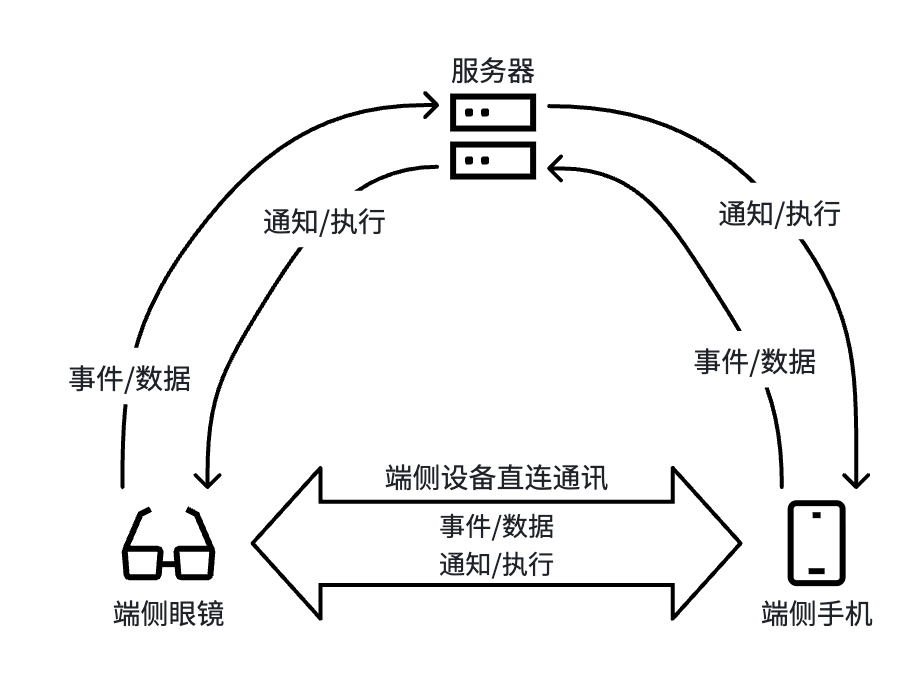
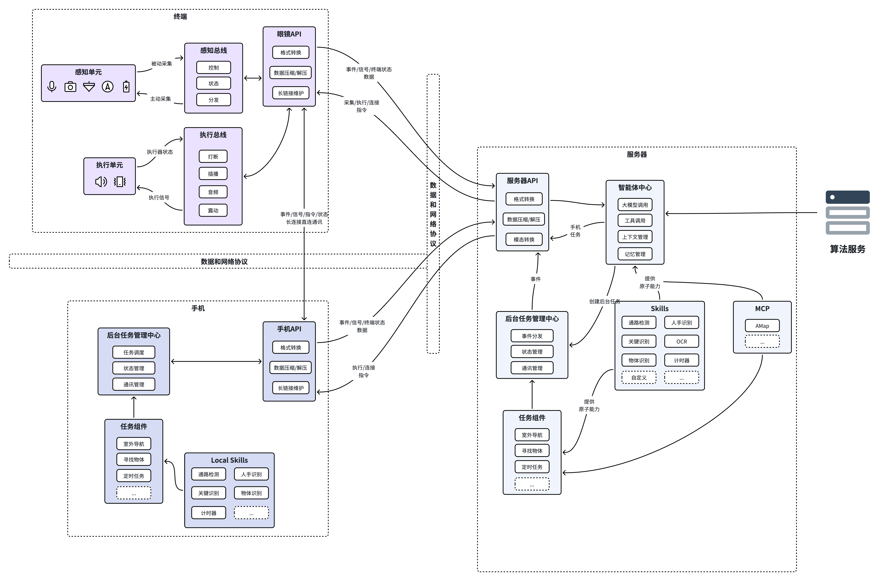

# 软件架构设计与第一阶段开发计划

## 1. 功能设想与总体方案

### 1.1 室内主动系统

重要等级：高，核心功能

#### 1.1.1 语音发起寻找常见物体

基于现有 YOLO 能力实现。可由用户关键词触发，例如“帮我找一下”“找一下”“寻找”，也可由大模型助手根据用户意图主动调用。

方案：

- 将现有寻找物体能力封装成工具或 Skill。
- 大模型助手运行在服务器端。
- 服务器分别向眼镜和手机发送任务开启指令。
- 眼镜与手机建立一条直连长连接，可采用 WebSocket 或其他更合适的方式。
- 眼镜持续向手机发送图像帧。
- 手机使用 YOLO 完成检测，并按照现有逻辑生成语义播报指令发送给眼镜。
- 眼镜接收播报指令后继续发送下一帧，形成持续闭环。
- 任务结束时由手机发出结束指令，双方断开连接。
- 任务进行期间，持续将任务状态上报服务器，供服务器记录并供大模型查询。

#### 1.1.2 阅读纸质书籍 / 药品说明书

可由用户关键词触发，也可由大模型助手主动调用。

方案：

- 服务器识别到阅读任务后，立即向眼镜发送拍照指令。
- 眼镜拍照后将图片发送回服务器。
- 智能体接收到图片后，调用云端全模态大模型进行解读，例如 `qwen3.5-omni`。
- 云端模型流式返回音频给服务器。
- 服务器将音频流式转发给眼镜并完成播放。

### 1.2 室外主动系统

重要等级：高，核心功能

#### 1.2.1 点到点引导导航

可由用户关键词或大模型助手触发，例如“我想去桂林路地铁站”“我想去最近的书店”。

方案：

- 大模型先与用户交互，确认明确的目的地。
- 若用户表达模糊目标，例如“最近的书店”，则先查询候选地点，再与用户确认具体目标。
- 将最终确认的位置发送给高德地图 MCP 服务。
- 获取导航路径后与用户确认，再开启导航任务。

待确认事项：

- 设备间具体通信方案。
- 高德地图 SDK 的接入方式。
- 是否直接调起高德地图 App。

#### 1.2.2 方向矫正（IMU + 手机 GPS）

方案：

- 作为导航功能的内置组成部分实现。

#### 1.2.3 寻找通路（毫米波 / 视觉算法 / 引路）

可由用户关键词或大模型助手触发，例如“帮我引路”“前面能过去吗”“我该怎么走过去”。

方案：

- 技术方案与“寻找物体”相似。
- 以统一 Skill 形式接入服务器、眼镜与手机的通信体系。

#### 1.2.4 红绿灯 / 盲道 / 非机动车道等关键因素识别

方案：

- 初步考虑基于 YOLO。
- 任务形态与寻找物体、寻找通路类似。
- 均作为 Skill，以统一方式与服务器和眼镜通信。
- 内部实现细节待进一步明确。

#### 1.2.5 室外最后 10 米引导

方案：

- 暂未确定。

问题：

- 该能力是在导航完成后自动触发，还是由用户主动发起，尚未明确。
- 该任务不同于普通“寻找物体”，更接近对相机中某个目标的点到点引导或通路检测，实现难度较高。

### 1.3 用户自定义系统

重要等级：高，核心功能

#### 1.3.1 定时检查画面变化

例如：每隔 3 秒检查一次某个目标是否发生变化，参数包括检查周期与提示词。

方案：

- 由用户关键词或大模型助手触发。
- 设计后台运行的 Skill。
- 周期性向眼镜发送拍照指令。
- 获取图片后自动执行检查任务。
- 将结果通知给眼镜或主智能体。
- 定时任务能力应作为通用基础能力，可被其他服务器侧 Skill 复用。

#### 1.3.2 用户可修改提示词 / 编写 Skills / 自定义知识库 / 设置记忆时长

方案：

- 当前场景只有单会话，因此不需要会话隔离。
- 但由于上下文会持续增长，需要定期压缩上下文。
- 从上下文中提取长期记忆并写入记忆库。

问题：

- 当前场景中知识库的必要性仍需进一步论证。

### 1.4 自然语言视觉交互系统

重要等级：中，实现相对简单

#### 1.4.1 VL：语言理解与快速回复

方案：

- 基于全模态大模型。
- 配合智能体运行时管理完成语言理解与响应。

### 1.5 提示系统设置

重要等级：中，实现相对简单

#### 1.5.1 提示音与震动设置

方案：

- 将眼镜设置能力封装成 Skill。
- 由用户主动触发，或由大模型按需调用。

### 1.6 系统功能

重要等级：低，可在后续迭代

#### 1.6.1 电源管理功能

- 低优先级，待定。
- 理论上不影响本期核心功能实现。

#### 1.6.2 远程 OTA 功能

- 低优先级，待定。
- 理论上不影响本期核心功能实现。

#### 1.6.3 后端用户数据管理

方案：

- 服务器所有动作先记录到日志。
- 初期通过日志查看。
- 后续如有需要，再补充 Web 管理页面。
- 不上传手机 App 与眼镜直连通信中的原始数据。

#### 1.6.4 状态管理

范围包括眼镜端休眠状态、激活状态、功能状态等。

方案：

- 待定。
- 可考虑服务器轮询查询。
- 也可考虑设备进入某个状态前主动通知服务器。

## 2. 架构总体说明

系统包含三个设备：

- 服务器：主要业务逻辑运行平台，负责与眼镜、手机交互，管理任务状态与大模型运行状态，并调用云端算力完成大模型或其他模型推理，使用 Python 开发。
- 眼镜：感知与执行终端，通过 ESP32 连接多个传感器和执行器，运行于 ESP32 平台，使用 Arduino 开发。
- 手机：移动轻量算力平台，负责 YOLO 等图像检测任务，承接对实时性要求较高但资源消耗较大的任务处理。

### 2.1 通信拓扑

### 2.2 架构图

## 3. 模块说明

### 3.1 眼镜侧

| 设备 | 模块 | 模块名称 | 模块定位 | 模块职责 | 其他说明 |
| --- | --- | --- | --- | --- | --- |
| 眼镜 | 眼镜 API | `glass-api` | 眼镜端与系统主控之间的设备接入边界，负责端侧消息接入与连接维护。 | 完成格式转换、数据压缩/解压、长连接维护；封装眼镜端上行事件与下行控制消息。 | 无 |
| 眼镜 | 感知总线 | `sensor-hub` | 感知单元的总控，主动或被动通过感知单元采集信息。 | 接收不同任务的采集指令并统一处理和分发；持续采集特定信号；对所有传感器信号进行时间对齐。 | 主要用于避免多任务并行时多个任务同时争用同一采集器，例如障碍物检测与寻找物体都需要相机，但帧率与清晰度要求不同。 |
| 眼镜 | 执行总线 | `actuator-hub` | 执行侧统一控制器，负责把运行层输出的通知或控制命令转成实际动作。 | 承接运行层下发的执行信号；向执行单元下发指令；接收执行器反馈；维护执行器状态；依据通知类型与优先级控制打断、插播、音频、震动等执行调度策略。 | 无 |
| 眼镜 | 感知单元 | `sensor` | 眼镜端原始输入采集入口。 | 采集麦克风、摄像头、定位/方向、姿态、速度、电量等原始信号。 | 无 |
| 眼镜 | 执行单元 | `actuator` | 眼镜端通知与反馈执行终端，是最终直接作用于用户的硬件输出集合。 | 根据执行控制组件命令，执行声音播放、插播、震动等动作。 | 后续可能还需要设备控制能力，例如音量调节、提醒频率调节等，当前暂考虑通过 Skill 实现。 |

### 3.2 服务器侧

| 设备 | 模块 | 模块名称 | 模块定位 | 模块职责 | 其他说明 |
| --- | --- | --- | --- | --- | --- |
| 服务器 | 服务器 API | `server-api` | 服务器侧统一接入边界。 | 负责服务端与眼镜、手机、外部能力之间的消息接入与转发。 | 原文未展开，后续需补充详细职责。 |
| 服务器 | 智能体中心 | `agent-core` | 开放式任务的核心处理中心，主要承接依赖大模型能力的开放式、交互式任务。 | 负责大模型调用、工具调用、上下文管理、记忆管理；处理用户即时提问、开放式检查、计划、分析和响应；可在需要时发起后台任务创建请求。 | 当前计划直接使用开源 AgentCore SDK 实现。智能体中心与后台任务中心都应具备直接与感知总控和执行总控建立长连接的能力。 |
| 服务器 | 后台任务管理中心 | `backend-task-core` | 统一承接由服务器智能体启动的后台任务。 | 负责后台任务的创建、运行、调度；管理后台任务状态与通信事件；支持多个后台任务并行存在。 | 无 |
| 服务器 | 任务组件 | `task` | 面向真实使用场景抽象出的可实例化后台任务模板集合。 | 定义并封装具体后台任务流程，如室外导航、寻找物体、定时任务等；组合调用 Skills 与 MCP，形成固定 Workflow；在长期运行中持续产出状态、通知和执行请求。 | 计划通过手写 Workflow 将原子能力组合成更高层能力，例如将高德地图导航、障碍物检测、红绿灯检测、斑马线检测组合成室外点到点导航。 |
| 服务器 | Skills | `skill` | 系统内部原子能力集合，是开放式任务与后台任务的基础能力库。 | 提供标准化能力接口，例如避障检测、OCR、物体识别、人手识别、计时器，以及用户安装的 Skills。 | 对特定检测算法应屏蔽底层实现细节，向上输出结构化结果。 |
| 服务器 | MCP | `mcp` | 外部平台与工具能力的标准化接入层。 | 统一接入并调用外部能力，例如 AMap 等。 | 也可以视实际情况封装进 Skill；若 MCP Server 数量不多，也可统一按 Skill 概念处理。 |

### 3.3 手机侧

| 设备 | 模块 | 模块名称 | 模块定位 | 模块职责 | 其他说明 |
| --- | --- | --- | --- | --- | --- |
| 手机 | 手机 API | `phone-api` | 手机主控应用与系统运行层之间的接入边界。 | 完成格式转换、数据压缩/解压、长连接维护、模态转换。 | 模态转换主要包括 ASR；即使采用全模态大模型，运行层仍不可避免需要处理文本模态数据。 |
| 手机 | 本地任务中心 | `backend-task-core` | 手机内置后台任务统一运行时中心，承载长生命周期、持续感知、持续响应的后台任务实例。 | 创建、运行、调度、暂停、恢复和结束后台任务；管理任务状态、通信事件和实例生命周期；支持多个后台任务并行存在，并持续对新信息作出反应。 | 无 |
| 手机 | 任务组件 | `task` | 手机端任务模板集合。 | 与服务器任务组件类似，但运行于手机端。 | 无 |
| 手机 | Skills | `skill` | 手机本地原子能力集合，是后台任务组件的能力提供方。 | 与服务器侧 Skills 概念一致，但部署在手机本地。 | 无 |

## 4. 数据与网络协议

系统内部需要统一的数据承载与通信协议层，用于描述眼镜、手机、运行层之间的通信模型。

参考定义如下：

### 4.1 Command

表示“让对方做一件事”。

示例：

- 开始录音
- 停止录音
- 准备 `peer-link`
- 开始找物
- 播放音频

### 4.2 Event

表示“某个事实已经发生了”。

示例：

- 说话开始
- 说话结束
- 录音文件已生成
- `peer-link` 已断开
- 任务已完成

### 4.3 State

表示“当前状态快照”。

示例：

- 设备在线状态
- 当前任务状态
- 当前链路状态
- 当前 `bootstrap` 状态

### 4.4 Stream

表示“持续的数据流”。

示例：

- 音频块
- 图片帧
- 视频流
- IMU 高频数据

## 5. 架构开发计划

- 完成数据模型与通信模型设计，覆盖软件架构与功能设想中的核心对象和设备交互关系。
- 按照架构设计分别完成三个设备侧的架构抽象。
- 建立基础目录结构、抽象类、核心方法。
- 实现统一的数据模型与通信模型，为后续功能开发提供约束与脚手架。

## 6. 功能开发整体要求

### 6.1 功能开发前文档要求

每个功能开发前都需要编写方案文档，文档至少包含：

- 需求理解
- 现状分析
- 实现方案描述
- 流程图、时序图（PlantUML），描述完整运行过程
- 自动化测试方案，包括单元测试（方法级）和功能测试（功能级）

### 6.2 架构一致性要求

- 每个功能都必须严格遵守当前架构设计。
- 功能方案文档末尾需追加“当前方案与架构设计的契合程度”段落。
- 若发现架构存在不合理之处，可以在文档中提出改进建议。
- 在获得批准前，不能直接修改既定架构。

### 6.3 开发完成后的补充要求

- 功能实现完成后，必须完成自动化测试。
- 文档末尾需追加“开发后测试结果”段落。
- 文档末尾还需追加“当前实现进展”段落，记录功能当前实现状态。

## 7. 第一期功能开发计划

### 7.1 开发目标

- 实现架构、通信、数据模型等脚手架代码。
- 基于当前架构，完成眼镜与服务器之间的大模型语音对话、工具调用、任务创建等基础能力。
- 初步引入手机参与，主要完成通信模型验证。

### 7.2 需顺序执行的开发内容

#### 7.2.1 实现眼镜与服务器配对，并将眼镜注册到服务器

参考资料：

- 参考文档：[OpenAIglasses_demo/server](https://github.com/OpenAIglasses/OpenAIglasses_demo/tree/main/server)
- 参考代码 1：[server/app.py](https://github.com/OpenAIglasses/OpenAIglasses_demo/blob/main/server/app.py)
- 参考代码 2：[esp32/esp32.ino](https://github.com/OpenAIglasses/OpenAIglasses_demo/blob/main/esp32/esp32.ino)

#### 7.2.2 实现眼镜与服务器基于大模型的非实时语音对话

要求：

- 不支持用户打断。
- 使用 `qwen3.5-omni-plus` 模型。
- 调用阿里云百炼实现非实时语音对话。
- 使用眼镜端麦克风录音。
- 结合 VAD 识别用户语音。

参考资料：

- [阿里云百炼文档（非实时语音对话）](https://bailian.console.aliyun.com/cn-beijing?spm=5176.30371578.J_-b3_dpUGUU3dm_j_tEufi.1.1f9d154aBDc2ys&tab=doc#/doc/?type=model&url=2867839)

#### 7.2.3 实现实时语音对话，支持用户打断

要求：

- 参考资料中的实现可能与现有架构设计不完全一致。
- 实现过程中必须优先满足架构一致性约束。

参考资料：

- [阿里云百炼文档（实时语音对话）](https://bailian.console.aliyun.com/cn-beijing?spm=5176.30371578.J_-b3_dpUGUU3dm_j_tEufi.1.1f9d154aBDc2ys&tab=doc#/doc/?type=model&url=2880812)

#### 7.2.4 引入 AgentCore 调用工具，使大模型运行时可以调用服务器上的工具

要求：

- 需要先调研 AgentCore 的概念。
- 了解常见的大模型运行时维护方式。
- 调研是否存在成熟开源方案，优先考虑使用开源 SDK 实现。

参考资料：

- [pi-mono/packages/agent](https://github.com/badlogic/pi-mono/tree/main/packages/agent)

#### 7.2.5 引入 Skills 与 MCP，使大模型可以调用更多工具和服务

要求：

- 可先实现少量简单的 Skills 和 MCP 用于联调测试。

#### 7.2.6 实现拍照 Skill，并让大模型根据图片完成解读

要求：

- 提示词示例：“请帮我看一下眼前有什么”。
- 由大模型自主调用“拍照” Skill。

#### 7.2.7 基于高德地图 AMap MCP 实现导航能力

要求：

- 例如用户说“导航去桂林路地铁站”。
- 模型需要与用户共同确认导航参数，例如步行还是公交、走最近还是绕行更少。
- 导航能力是否封装为单独 Skill，取决于后续具体方案。

#### 7.2.8 实现服务器“后台任务管理” Skill，并使用 LLM 创建和管理后台任务

示例：

- 用户说“帮我计时三分钟”。
- 大模型应调用后台任务创建 Skill，创建一个计时器后台任务。

要求：

- “后台任务管理” Skill 应接收后台任务类型与参数。
- 启动具体后台任务实例。
- 任务很可能以异步方式提交，具体取决于实现方案。
- 已启动后台任务需统一注册到后台任务管理器中。
- 大模型应可随时查询任务状态。
- 当后台任务完成后，例如计时器结束，应能够通知大模型或直接通知用户。

#### 7.2.9 引入手机设备，将手机注册到服务器，实现手机与服务器配对，并实现眼镜与手机一对一绑定

参考资料：

- [OpenAIglasses_demo/flutter_app/lib](https://github.com/OpenAIglasses/OpenAIglasses_demo/tree/main/flutter_app/lib)

#### 7.2.10 允许大模型通过 Skill 创建手机与眼镜直连的后台任务

示例：

- 存在一个 Skill 叫“手机录视频”。
- 大模型调用该 Skill 后，眼镜与手机建立网络直连。
- 眼镜将视频流直接发送到手机。

要求：

- 手机端测试 App 需要提供一个页面，用于实时回显眼镜发送过来的流式视频。

