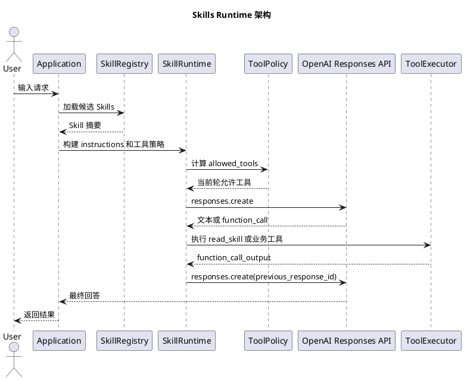
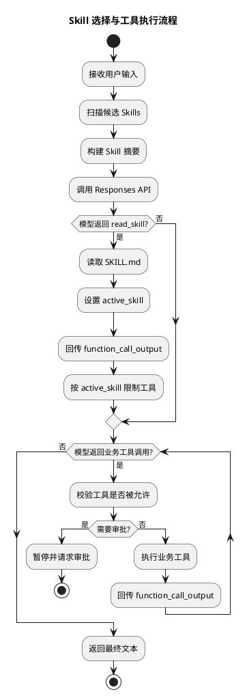
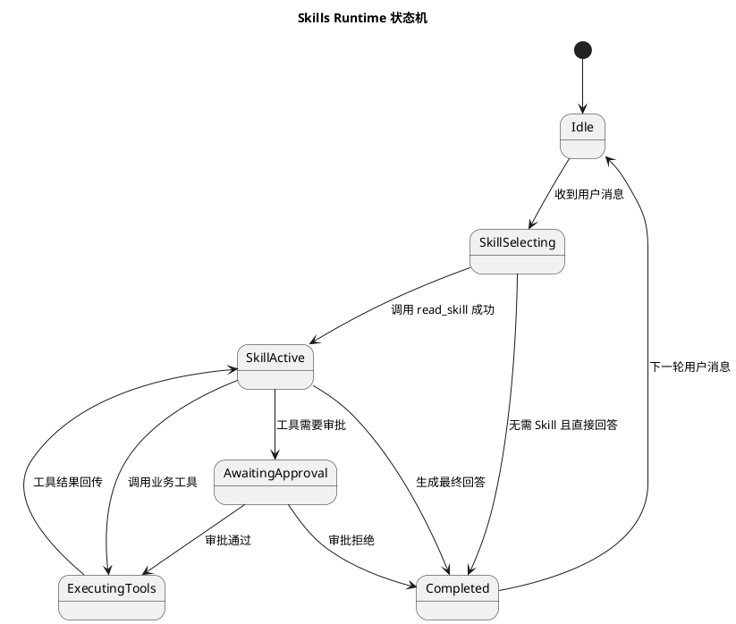

# 基于 OpenAI SDK 自实现 Skills Runtime 设计文档

## 1. 背景

OpenAI 官方 Skills 机制把 Skill 定义为一个带 `SKILL.md` 的文件包，模型先看到 Skill 的 `name`、`description` 和路径，再按需读取完整 Skill 指令。官方原生 Skills 当前主要与 shell 工具环境结合，适合本地或托管 shell 自动化场景。

如果业务目标是让模型在自定义函数工具、审批流、业务 API、MCP 网关或内部系统中使用 Skills，则更推荐在应用层实现一个 Skills Runtime：用 Responses API 提供函数工具循环，用 `read_skill` 暴露 Skill 内容，用会话状态记录 active skill，用工具策略限制后续可调用工具。

参考官方文档：

- OpenAI Skills: https://developers.openai.com/api/docs/guides/tools-skills
- Function calling: https://developers.openai.com/api/docs/guides/function-calling
- Conversation state: https://developers.openai.com/api/docs/guides/conversation-state

## 2. 设计目标

- 让模型在回答前能看到候选 Skills 摘要。
- 让模型只在明确需要时读取一个完整 `SKILL.md`。
- 让 Skill 激活后影响后续工具选择和执行约束。
- 支持会话级 active skill、版本锁定、审计日志和审批扩展。
- 支持自定义业务工具，而不是只绑定 shell。
- 为未来接入 OpenAI 原生 Skills、MCP、插件工具保留扩展点。

## 3. 非目标

- 不直接让终端用户上传任意 Skill 并立即生效。
- 不把完整 Skills 全量塞进上下文。
- 不把 Skill 当成无权限边界的普通 prompt 文本。
- 不在最小原型里实现真实审批、远程工具执行和多租户隔离。

## 4. 核心概念

### Skill

Skill 是一个目录，最少包含 `SKILL.md`。`SKILL.md` 使用 frontmatter 描述元数据，正文描述模型行为规范。

最小字段：

```yaml
---
name: math-report
description: Use when the user asks to calculate numbers and write a short calculation report.
tools: add_numbers, save_text
---
```

建议生产字段：

```yaml
---
name: jira-triage
description: Use when triaging Jira tickets and writing reproduction summaries.
version: 2026.04.23
tools: jira_get_issue, jira_search, save_text
requires_env: JIRA_TOKEN
risk_level: medium
requires_approval: false
---
```

### Active Skill

Active Skill 是当前会话中已经被模型读取并确认使用的 Skill。Runtime 应把 active skill 记录在会话状态里，并基于它限制工具集合。

### Tool Policy

Tool Policy 负责决定某一轮模型请求允许调用哪些工具。

- 未激活 Skill：只允许 `read_skill`。
- 已激活 Skill：允许 `read_skill` 和该 Skill 声明的工具。
- 高风险工具：进入审批状态后才允许执行。

## 5. 总体架构



## 6. 运行时流程



## 7. 状态机



## 8. 数据模型

### SkillManifest

```python
@dataclass
class SkillManifest:
    id: str
    name: str
    description: str
    tools: list[str]
    version: str | None
    path: Path
```

### SkillSession

```python
@dataclass
class SkillSession:
    previous_response_id: str | None
    active_skill_id: str | None
    active_skill_version: str | None
```

生产环境建议额外记录：

- `session_id`
- `user_id`
- `workspace_id`
- `skill_snapshot_hash`
- `tool_trace`
- `approval_trace`
- `created_at`
- `updated_at`

## 9. Prompt 设计

`instructions` 中应包含：

- 可用 Skill 摘要。
- 选择规则。
- “最多先读一个 Skill”的约束。
- active skill 信息。

建议模板：

```text
You are an assistant with optional Skills.

Before answering:
- Inspect <available_skills>.
- If exactly one skill clearly applies, call read_skill with that skill_id.
- If several skills may apply, choose the most specific one and call read_skill.
- If no skill applies, answer without reading a skill.
- Do not read more than one skill before proceeding.

<available_skills>
- id="math-report" name="math-report" description="..."
</available_skills>
```

这个设计避免把所有 Skill 正文放入上下文，只让模型先做轻量选择。

## 10. Tool 设计

### read_skill

`read_skill` 是 Runtime 内置工具，负责读取完整 `SKILL.md`。

安全约束：

- 只能读取 Registry 中已注册的 Skill。
- 不能接受任意文件路径。
- 不能返回 Skill 目录外的文件。
- 返回内容应带上 Skill 名称、版本和正文。

### 业务工具

业务工具由应用提供，例如：

- `add_numbers`
- `save_text`
- `jira_get_issue`
- `send_message`
- `mcp_call_tool`

所有工具都应使用严格 schema。

## 11. 工具限权策略

工具限权不应该只靠 prompt，而应该由 Runtime 强制执行。

推荐策略：

- 每次请求仍可传完整工具定义。
- 用 `tool_choice.allowed_tools` 控制当前轮允许调用的子集。
- 工具真正执行前再次校验是否在 active skill allowlist 中。
- 对写操作、外发消息、删除操作增加审批。

## 12. 会话与上下文

Responses API 可以用 `previous_response_id` 延续上下文。Runtime 应记录每次响应的 ID。

最小实现：

- 内存保存 `previous_response_id`
- 当前进程内保存 `active_skill_id`

生产实现：

- 数据库存储会话状态。
- 每轮持久化 response ID。
- Skill 激活后记录 Skill 版本或内容 hash。
- 会话恢复时校验 Skill 是否仍存在。

## 13. 安全模型

Skills 应被当成高权限指令来源。

必要控制：

- Skill 来源必须受信。
- Skill 变更要走审核。
- 不能允许用户传任意 Skill 路径。
- `read_skill` 不能读取任意文件。
- 工具执行前必须做 allowlist 校验。
- 高风险工具必须审批。
- 保存审计日志。

推荐审计字段：

- `session_id`
- `user_input`
- `candidate_skills`
- `active_skill`
- `tool_name`
- `tool_args`
- `tool_result`
- `approval_status`
- `response_id`

## 14. 与 OpenAI 原生 Skills 的关系

本设计是“应用层 Skills Runtime”，适合函数工具和业务系统。

OpenAI 原生 Skills 适合 shell 场景：

- hosted shell：上传 Skill 后通过 `skill_reference` 挂载。
- local shell：通过本地 `path` 挂载 Skill。

二者可以共存：

- shell 自动化任务使用 OpenAI 原生 Skills。
- 业务函数调用、审批、MCP 路由使用本 Runtime。

## 15. 最小原型与生产化差距

当前 `skills_agent.py` 已实现：

- Skill 扫描。
- frontmatter 解析。
- `read_skill` 工具。
- active skill。
- allowed tools。
- 业务工具执行。
- `previous_response_id` 续接。

尚未实现：

- 数据库存储。
- 多用户隔离。
- 审批流。
- Skill 安全扫描。
- 版本锁定。
- MCP 工具桥接。
- 流式输出。
- 单元测试。

## 16. 推荐演进路线

第一阶段：

- 固定本地 Skills 目录。
- 支持 `read_skill`、active skill、allowed tools。
- 记录 JSONL 审计日志。

第二阶段：

- 增加 SQLite/PostgreSQL session store。
- 增加 Skill 版本 hash。
- 增加工具风险等级。

第三阶段：

- 接入审批流。
- 接入 MCP 工具。
- 支持远程 Skill Registry。

第四阶段：

- 对 shell 类 Skill 接入 OpenAI 原生 Skills。
- 对业务类 Skill 继续使用自实现 Runtime。

