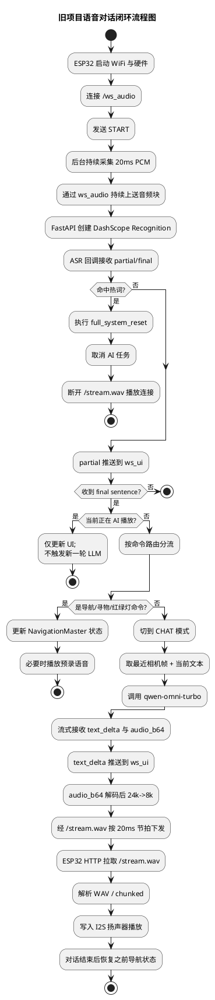
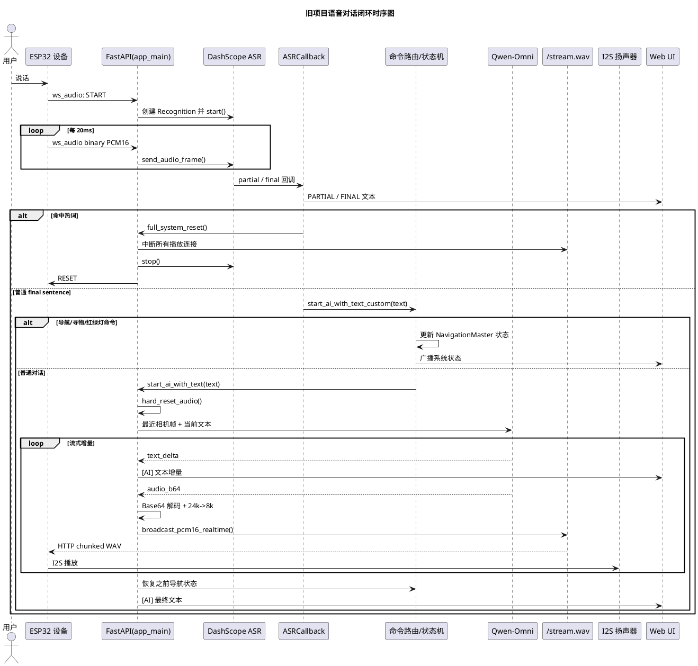

# OpenAIglasses_for_Navigation 旧项目实现分析

## 1. 目标与阅读范围

### 1.1 本次文档目标

本次文档不是为旧项目补功能，而是为后续重构建立可靠基线。目标是基于 `/Users/elio/dev/llm-project/OpenAIglasses_for_Navigation` 的真实代码，回答下面几个问题：

1. 旧项目真实的运行入口在哪里。
2. 语音对话能力是如何从眼镜端收音一路闭环到大模型播报的。
3. 视觉导航、寻物、红绿灯检测与语音对话是如何互相切换和互相影响的。
4. 哪些部分已经具备重构价值，哪些部分属于明显技术债。

### 1.2 本次重点阅读范围

重点阅读了以下文件：

- `app_main.py`
- `asr_core.py`
- `audio_stream.py`
- `audio_player.py`
- `omni_client.py`
- `navigation_master.py`
- `qwen_extractor.py`
- `compile/compile.ino`
- `README.md`
- `PROJECT_STRUCTURE.md`

### 1.3 结论先行

旧项目的真实运行链路并不是 `server/`、`phone/`、`glass/` 这类分层目录，而是根目录下的单体应用：

- 服务端主入口是 `app_main.py`
- 设备端主入口是 `compile/compile.ino`
- 语音上行走 WebSocket `/ws_audio`
- 语音下行走 HTTP `/stream.wav`
- 视频上行走 WebSocket `/ws/camera`
- 文本状态和可视化走 `/ws_ui`、`/ws/viewer`、`/ws`

也就是说，旧项目已经做出了“设备实时采集 + 服务端实时识别 + 多模态大模型回复 + 设备扬声器播报”的完整闭环，但整体形态仍然是高度耦合的单进程编排。

## 2. 项目整体实现逻辑

### 2.1 真实运行架构

从代码实际实现看，项目的运行结构可以概括为：

1. ESP32 设备端负责摄像头采集、麦克风采集、扬声器播放、IMU 上报。
2. FastAPI 单进程服务负责承接所有设备连接、视觉推理、状态机调度、ASR、LLM 调用和音频下发。
3. 浏览器页面只承担监控与状态展示作用，不参与核心控制。
4. 语音对话不是一个独立子系统，而是被直接编排在 `app_main.py` 里，与导航状态机、相机帧缓存、音频播放总闸共用同一批全局状态。

### 2.2 真实入口与目录角色

从代码现状看，目录可以分成三类：

- 真实运行主链路
  - `app_main.py`
  - `compile/compile.ino`
  - `navigation_master.py`
  - `workflow_blindpath.py`
  - `workflow_crossstreet.py`
  - `yolomedia.py`
  - `asr_core.py`
  - `omni_client.py`
  - `audio_stream.py`
  - `audio_player.py`
- 资源和支撑文件
  - `voice/`
  - `music/`
  - `templates/`
  - `static/`
  - `model/`
- 演进中的重构骨架
  - `server/`
  - `phone/`
  - `glass/`

其中 `server/`、`phone/`、`glass/` 在旧项目仓库里基本还是占位骨架，不是这套系统实际跑起来时所依赖的主路径。

### 2.3 单体编排的核心特征

旧项目采用的是“一个 FastAPI 进程统管全部能力”的实现方式，主要特征如下：

- 设备连接、视觉处理、语音识别、语音播报、UI 推送都在一个 Python 进程内完成。
- 大量运行态数据以全局变量方式保存，例如：
  - `last_frames`
  - `esp32_audio_ws`
  - `esp32_camera_ws`
  - `orchestrator`
  - `current_partial`
  - `recent_finals`
- 视觉和语音之间通过共享最近一帧图片、共享状态机状态、共享音频总闸来协作。

这套方式实现快，但后续重构难点也正来源于这里。

## 3. 语音对话完整闭环

## 3.1 闭环总览

旧项目已经实现的语音对话闭环，不是“本地录一段再上传”的非实时模式，而是“设备持续上传 20ms PCM 帧，服务端做实时识别，但只让 final sentence 触发一次 LLM”的半实时模式。

完整链路如下：

1. 眼镜端麦克风持续采集 16k 单声道 PCM。
2. 眼镜端通过 `/ws_audio` 把二进制音频块持续上送给服务端。
3. 服务端使用 DashScope `paraformer-realtime-v2` 建立实时识别会话。
4. DashScope 回调持续返回 partial / final 文本。
5. `ASRCallback` 只允许 final sentence 驱动后续逻辑。
6. 服务端根据识别文本决定是：
   - 导航控制命令
   - 红绿灯命令
   - 寻物命令
   - 普通 Omni 对话
7. 如果进入普通对话，服务端会取最近一帧相机图像，与文本一起发给 `qwen-omni-turbo`。
8. Qwen-Omni 流式返回文本增量和音频增量。
9. 服务端把文本推给浏览器 UI，把音频转为 8k PCM 并推送到 `/stream.wav`。
10. ESP32 通过独立 HTTP 长连接持续拉取 `/stream.wav`，解码后写入 I2S 扬声器播放。

这就是旧项目语音对话能力的完整闭环。

## 3.2 设备端上行：麦克风采集与音频上传

设备端在 `compile/compile.ino` 中完成收音和上传。

### 3.2.1 采集格式

设备端配置为：

- 采样率：`16000`
- 位宽：`16bit`
- 声道：`MONO`
- 分片周期：`20ms`

实现点：

- `init_i2s_in()` 初始化 PDM 麦克风输入
- `taskMicCapture()` 每次采集一个 `20ms` 音频块
- `taskMicUpload()` 将音频块经 `wsAud.sendBinary()` 上送

### 3.2.2 设备端行为特点

设备端行为并不是按说话轮次启停录音，而是：

- WebSocket 音频链路连上后直接 `START`
- `run_audio_stream = true` 后持续采集
- 没有看到显式本地 VAD
- 没有本地“说话开始/说话结束”状态机

这意味着：

- README 中“VAD”更接近云端 ASR 的句子结束能力，而不是设备端本地分段能力。
- 设备端始终处于流式上送状态，服务端才是实际的语音轮次边界判定方。

## 3.3 服务端上行接入：`/ws_audio`

服务端在 `app_main.py` 中通过 `/ws_audio` 处理设备音频上行。

### 3.3.1 建立 ASR 会话

当设备发来文本命令 `START` 时，服务端会：

1. 停掉旧识别会话。
2. 组装 `ASRCallback`。
3. 创建 DashScope `Recognition` 实例。
4. 调用 `recognition.start()`。
5. 保存当前识别对象到全局总闸。
6. 开启 `keepalive_loop()`。

这一层相当于把设备音频流接到了 DashScope 实时识别上。

### 3.3.2 keepalive 机制

服务端为了维持云端实时识别会话，会在上行静默超过 `0.35s` 时主动补静音帧：

- 每次补发约 `600ms` 的静音
- 避免实时识别链路因短时无数据而断开

这说明旧项目的实时 ASR 会话是“持续占用型”的，而不是“按轮次短连接型”的。

## 3.4 ASR 回调：partial 只展示，final 才驱动

### 3.4.1 回调策略

`ASRCallback` 的设计目标非常明确：

1. 热词中断优先。
2. AI 播放期间不接受普通打断。
3. partial 只用于 UI 展示。
4. 只有 final sentence 才驱动后续动作。

### 3.4.2 热词中断

热词默认是：

- `停下`
- `别说了`
- `停止`

一旦识别文本命中热词，就会执行 `full_system_reset()`，其效果是：

- 停掉当前 AI 播放任务
- 断掉所有 `/stream.wav` 播放连接
- 停止当前 ASR 识别流
- 清空 UI 状态
- 清空最近相机帧
- 试图通知设备端重置

### 3.4.3 非热词情况下的“不可打断”

旧项目并不是完全支持双工打断，而是采用如下策略：

- AI 正在播报时，用户讲话仍然会继续被 ASR 识别
- partial / final 仍然会发到 UI
- 但如果 `is_playing_now()` 为真，则不会触发新的 LLM 回合

换句话说：

- 用户可以“说话”
- 系统也能“看到文本”
- 但不会启动新的模型回复

这是一种“识别不断流，但对话不打断”的实现。

## 3.5 识别文本后的命令分流

识别出的 final sentence 并不会直接进入 LLM，而是先经过 `start_ai_with_text_custom()` 做分流。

### 3.5.1 被识别的几类命令

服务端会优先识别：

- 盲道导航控制
  - `开始导航`
  - `盲道导航`
  - `停止导航`
  - `结束导航`
- 过马路控制
  - `开始过马路`
  - `帮我过马路`
  - `过马路结束`
- 红绿灯控制
  - `检测红绿灯`
  - `看红绿灯`
  - `停止检测`
- 寻物控制
  - `找一下 xxx`
  - `找到了`
  - `拿到了`
- 普通对话触发
  - 其余非控制文本

### 3.5.2 与导航状态机的协作

这里最关键的设计点不是“命令识别”，而是“命令识别与导航状态机耦合在一起”：

- 如果当前处于导航态，普通对话会先把 `orchestrator` 强制切到 `CHAT`
- Omni 对话结束后，再恢复之前的导航状态
- 寻物模式会暂停当前导航，并在结束后可恢复
- 红绿灯检测模式与盲道导航互斥

也就是说，语音对话在旧项目里不仅是输入能力，同时还是整个多任务状态机的主要入口。

## 3.6 普通对话路径：Qwen-Omni 多模态调用

### 3.6.1 输入内容

进入普通对话后，服务端并不是只发文本，而是会把最近一帧 JPEG 一并发给模型：

- 从 `last_frames[-1]` 取最近相机帧
- 转成 `data:image/jpeg;base64,...`
- 与本轮识别文本一起放入 `content_list`

所以旧项目的语音对话本质上是“语音转文本后的图文多模态问答”，而不是纯语音聊天。

### 3.6.2 模型接入方式

模型侧方案是：

- SDK：`openai` Python SDK
- 接口：DashScope OpenAI 兼容模式
- 模型：
  - `qwen-omni-turbo` 用于多模态对话
  - `qwen-turbo` 用于中文物品名转英文标签

### 3.6.3 输出处理

`stream_chat()` 会流式产出两种增量：

- 文本增量 `text_delta`
- 音频增量 `audio_b64`

服务端对这两路增量分别处理：

- 文本增量拼接后推给 `/ws_ui`
- 音频增量解码后转成下行音频流

### 3.6.4 没有会话记忆

旧项目普通对话每一轮都是单轮请求：

- 输入只有当前一句文本
- 外加最近一帧图像
- 没有显式历史消息堆叠

因此它更接近“看当前画面并回答这一句”，而不是严格意义上的多轮记忆对话。

## 3.7 服务端下行：统一音频流通道

### 3.7.1 统一下行不是 WebSocket，而是 `/stream.wav`

旧项目的下行语音实现很关键的一点是：

- 设备上行音频走 WebSocket `/ws_audio`
- 设备下行音频不走 WebSocket
- 而是走 HTTP 流式接口 `/stream.wav`

这意味着语音闭环其实是“双通道模型”：

- 控制与上行：`/ws_audio`
- 播放与下行：`/stream.wav`

### 3.7.2 AI 音频的处理方式

Qwen-Omni 返回的音频增量在服务端会被处理成：

1. Base64 解码
2. 按注释假定源音频为 `24k PCM16`
3. 重采样为 `8k PCM16`
4. 降低音量到 `0.60`
5. 通过 `broadcast_pcm16_realtime()` 按 `20ms` 节拍下发

### 3.7.3 播放总闸

`audio_stream.py` 提供了一个非常重要的“总闸”能力：

- `current_ai_task` 表示当前 LLM 音频生成任务
- `stream_clients` 表示当前 `/stream.wav` 播放连接
- `hard_reset_audio()` 可以同时取消 AI 任务并切断播放连接

这个设计是旧项目里比较值得保留的部分，因为它把“播放打断”统一成了一个跨模块动作。

## 3.8 设备端下行：HTTP 拉流与扬声器播放

### 3.8.1 拉流方式

设备端在 `loop()` 中连接成功 `/ws_audio` 后，会同时启动：

- `wsAud.send("START")`
- `startStreamWav()`

`startStreamWav()` 会创建一个独立任务，通过 HTTP 持续拉取 `/stream.wav`。

### 3.8.2 设备端播放逻辑

设备端播放逻辑是：

1. 建立 HTTP 长连接。
2. 解析返回头部，看是否是 chunked。
3. 解析 WAV 头，检查格式是否合法。
4. 如果采样率变化，则重配 I2S 输出采样率。
5. 每次按约 `20ms` 字节量读取音频体。
6. 将 `mono16` 转为 `stereo32`。
7. 写入 I2S 扬声器。

这套逻辑说明旧项目已经把“服务端生成 PCM -> 设备端稳定播报”的关键底层问题解决掉了。

## 3.9 导航语音与 AI 语音的区别

旧项目其实同时存在两套语音输出路径：

### 3.9.1 导航语音

导航语音不是在线 TTS，而是预录音频：

- `voice/` 目录保存大量中文 WAV
- `audio_player.py` 启动时预加载并缓存这些文件
- `play_voice_text()` 根据中文文案匹配资源并播放

这一路主要用于：

- 盲道引导
- 过马路提示
- 红绿灯提示
- 障碍物提醒
- 状态切换提示

### 3.9.2 AI 对话语音

AI 对话语音不是本地音频资源，而是：

- 由 `qwen-omni-turbo` 实时流式返回
- 服务端转采样后直接下发

因此旧项目的音频系统实际上同时支撑：

- 预录提示音播放
- 在线生成回复播放

这也是后续重构必须保留的双路径能力。

## 4. 视觉与语音是如何耦合的

## 4.1 最近相机帧是普通对话的重要输入

语音对话之所以能“看懂当前画面”，是因为摄像头链路会不断更新 `last_frames`，而普通对话在发给 Qwen-Omni 前会取最后一帧加入请求。

这意味着：

- 语音链路依赖视频链路处于正常状态
- 语音对话质量和最近相机帧质量直接相关
- 语音模块并不是独立服务，而是依赖摄像头共享状态

## 4.2 语音是状态机入口

`NavigationMaster` 管理的状态包括：

- `CHAT`
- `BLINDPATH_NAV`
- `SEEKING_CROSSWALK`
- `WAIT_TRAFFIC_LIGHT`
- `CROSSING`
- `SEEKING_NEXT_BLINDPATH`
- `TRAFFIC_LIGHT_DETECTION`
- `ITEM_SEARCH`

语音命令通过 `start_ai_with_text_custom()` 或 `NavigationMaster.on_voice_command()` 修改这些状态；视觉帧处理又会根据状态决定：

- 是否运行导航
- 是否运行红绿灯检测
- 是否暂停给 `yolomedia`
- 是否恢复普通对话

所以旧项目的真实控制面不是 UI，而是“语音识别结果 + 视觉状态机”。

## 4.3 视觉输出也会触发语音播报

相机帧进入 `orchestrator.process_frame()` 后，如果返回 `guidance_text`，主线程会：

1. 先 `play_voice_text(res.guidance_text)`
2. 再通过 `/ws_ui` 广播文字

因此旧项目并不是“先文本后播报”，而是视觉工作流直接产出可播报的中文文案。

## 5. 旧项目采用的关键技术方案

## 5.1 技术选型总结

- 服务框架：`FastAPI + asyncio + WebSocket`
- 设备侧：`ESP32-S3 + Arduino + I2S + WiFi`
- 实时识别：DashScope `paraformer-realtime-v2`
- 多模态大模型：DashScope OpenAI 兼容模式下的 `qwen-omni-turbo`
- 标签抽取：`qwen-turbo`
- 视频模型：YOLO 系列、MediaPipe、OpenCV
- 语音下行：HTTP 流式 WAV
- 导航语音：预录音频资源 + 本地匹配

## 5.2 方案层面的优点

- 语音闭环已经打通，链路真实可运行。
- 设备侧播放实现考虑了 chunked、采样率切换、I2S 写入等实际细节。
- 服务端通过 `hard_reset_audio()` 把“停播”和“取消旧任务”统一起来，打断语义比较清晰。
- 导航语音和 AI 语音分路清晰，适合后续独立抽象。
- 普通对话可携带最新画面，具备多模态价值。

## 5.3 方案层面的主要问题

### 5.3.1 单体耦合过重

`app_main.py` 同时承担：

- 设备连接管理
- 模型加载
- ASR 会话管理
- 命令分流
- 状态机编排
- 音频总闸
- UI 广播
- 视觉处理分发

这会导致后续重构时难以按边界拆分。

### 5.3.2 设备端没有本地 VAD

旧项目对“说话轮次”的切分主要依赖云端实时识别的 `sentence_end`，而不是本地 VAD。这会带来：

- 上行带宽常驻占用
- 播放期间麦克风仍持续上传
- 对设备功耗和链路稳定性不友好

### 5.3.3 语音上下行协议不对称

上行走 WebSocket，下行走 HTTP 流，虽然能用，但后续如果做更标准的设备协议和追踪体系，需要明确这是不是最终架构。

### 5.3.4 存在多处硬编码

代码中存在明显硬编码：

- API Key 默认值
- Windows 本地路径
- 服务器地址
- WiFi 名称与密码

这些都不适合作为可维护系统继续沿用。

### 5.3.5 存在实现不一致

比较典型的一处不一致是：

- 服务端 `full_system_reset()` 会向设备发送 `RESET`
- 设备端 `wsAud.onMessage()` 只处理 `RESTART`

这意味着服务端声明的“通知设备端重置”在当前固件上并没有真正闭环。

### 5.3.6 README 与真实代码有偏差

文档和实现之间至少有这些偏差：

- README 把 `server/`、`phone/`、`glass/` 这种分层结构说得比较完整，但真实运行链路仍然集中在根目录单体代码中。
- README 强调 VAD，但代码里没有设备本地 VAD 状态机。
- README 容易让人理解为完整移动端/三端工程已落地，但仓库中的这部分仍主要是骨架。

### 5.3.7 还有两处典型实现债

- `omni_client.py` 虽然对外暴露为 `async` 生成器，但内部实际直接迭代同步 SDK 流，这会让事件循环承受阻塞风险。
- `app_main.py` 通过修改 `audio_stream` 模块字典的方式写入 `current_ai_task`，说明当前任务状态共享方式仍然比较脆弱。

## 6. 对后续重构的直接启发

## 6.1 建议保留的能力边界

重构时建议保留并独立抽象下面这些能力边界：

1. 设备接入层
   - 摄像头上行
   - 麦克风上行
   - 扬声器下行
   - IMU 上报
2. 语音接入层
   - ASR 会话管理
   - 识别回调适配
   - 热词中断
3. 命令路由层
   - 导航命令
   - 寻物命令
   - 普通对话
4. 对话编排层
   - 文本输入
   - 图文拼装
   - 模型调用
   - 文本与音频流拆分
5. 音频播放层
   - 预录语音播放
   - 生成语音播放
   - 统一播放总闸
6. 状态机层
   - 导航模式
   - 红绿灯模式
   - 寻物模式
   - 对话模式

## 6.2 建议优先拆分顺序

为了降低风险，建议重构优先级如下：

1. 先拆 `设备连接管理` 与 `业务编排`
2. 再拆 `ASR 会话管理` 与 `LLM 会话管理`
3. 再拆 `导航状态机` 与 `普通对话状态`
4. 最后统一协议、日志和测试

原因是：

- 旧项目最先需要解决的是职责边界不清
- 不是先换模型
- 也不是先换固件协议
- 而是先把“谁负责接入、谁负责编排、谁负责状态”分开

## 6.3 建议新增的明确接口

后续新架构中，建议显式定义以下接口：

- `AudioInputSession`
- `AsrSession`
- `VoiceCommandRouter`
- `ConversationService`
- `AudioOutputService`
- `DeviceAudioChannel`
- `VisionContextProvider`
- `TaskStateCoordinator`

这样可以把当前散落在 `app_main.py` 里的隐式耦合变成可测试、可替换的显式边界。

## 7. 语音对话闭环流程图

## 8. 语音对话闭环时序图

## 9. 关键代码定位

后续如果继续做拆分和迁移，建议优先从下面这些位置回看：

- `compile/compile.ino`
  - 麦克风采集与上传：约第 `267` 到 `309` 行
  - `/stream.wav` HTTP 拉流与扬声器播放：约第 `467` 到 `689` 行
  - 设备启动、连接 `/ws_audio` 并启动拉流：约第 `994` 到 `1008` 行
- `app_main.py`
  - 系统级音频与识别重置：约第 `322` 到 `355` 行
  - 语音识别结果分流与模式切换：约第 `410` 到 `608` 行
  - 普通 Omni 对话启动与音频下发：约第 `611` 到 `697` 行
  - `/ws_audio` 上行接入与 DashScope 实时识别：约第 `728` 到 `860` 行
  - `/ws/camera` 视觉帧、状态机处理与导航播报：约第 `863` 到 `1009` 行
- `asr_core.py`
  - ASR 事件抽取、热词中断、final 触发：约第 `36` 到 `204` 行
- `audio_stream.py`
  - 播放总闸与 `/stream.wav`：约第 `59` 到 `152` 行
- `audio_player.py`
  - 预录语音资源映射与预加载：约第 `112` 到 `160` 行
  - 队列化播放与实时性策略：约第 `201` 到 `311` 行
  - 中文文案到语音资源的匹配：约第 `327` 到 `389` 行
- `navigation_master.py`
  - 状态定义与状态切换接口：约第 `245` 到 `398` 行
  - 主状态机处理：约第 `420` 到 `698` 行
- `omni_client.py`
  - DashScope OpenAI 兼容接入与流式输出封装：约第 `8` 到 `71` 行
- `qwen_extractor.py`
  - 中文物品名转英文标签：约第 `7` 到 `64` 行

## 10. 现有测试情况与后续测试建议

### 9.1 旧项目当前测试情况

从旧项目仓库现状看：

- 根目录运行主链路几乎没有围绕语音闭环的自动化测试。
- 仓库中虽然存在 `server/test/` 目录，但对应的是演进中的新骨架，不是当前真实运行主链路。
- 因此旧项目“语音收音 -> ASR -> 路由 -> Omni -> 扬声器播放”这条路径，基本依赖联调验证而不是自动化测试。

### 9.2 后续重构建议补齐的测试

后续重构建议至少补齐：

- 单元测试
  - 识别结果事件解析
  - 热词中断逻辑
  - 命令分流逻辑
  - 导航状态恢复逻辑
  - 音频重采样与播放队列逻辑
- 集成测试
  - `/ws_audio` 建链、`START`、音频帧上传、回调触发
  - 普通对话回合的多模态请求组装
  - `/stream.wav` 的播放中断与连接重建
- 设备联调测试
  - 连续说话
  - 播放中说话
  - 热词停止
  - 网络抖动重连

## 11. 当前旧方案与新架构设计的契合程度

当前旧方案与新架构设计的契合程度，我的判断是：`中等偏低`。

原因如下：

- 契合的部分
  - 已经验证了真实设备链路可行
  - 已经证明了多模态问答与导航状态切换可以共存
  - 已经具备较完整的设备端扬声器播放闭环
- 不契合的部分
  - 服务端职责过于集中
  - 新旧目录结构并存，但运行入口没有真正迁移
  - 协议、状态、模型调用、设备接入没有清晰边界
  - 测试与运行代码不在同一主路径上

因此，旧项目非常适合作为“能力基线”和“迁移源代码”，但不适合作为后续版本的继续演进基础。

## 12. 当前实现进展

当前进展如下：

- 已完成对 `OpenAIglasses_for_Navigation` 旧项目主链路的代码阅读。
- 已确认真实运行入口是根目录单体应用，而不是仓库中的新分层骨架。
- 已梳理出语音对话完整闭环的实现逻辑、关键协议、关键状态切换点与主要技术债。
- 已产出本分析文档，作为后续重构设计的输入基线。

## 13. 本次文档说明

本次仅完成代码阅读与实现分析，没有修改旧项目运行代码，也没有执行旧项目联调测试。

如果下一步继续推进，我建议直接基于这份文档输出第二份文档：

- `旧项目能力迁移与重构拆分方案`

那份文档再进一步回答：

1. 哪些代码可以直接迁移。
2. 哪些能力需要重写。
3. 新仓库的模块边界、协议边界和测试边界应如何定义。
