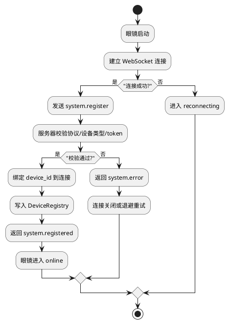
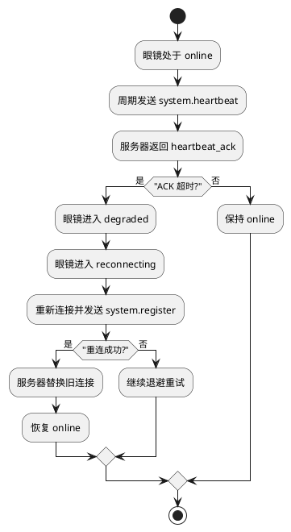
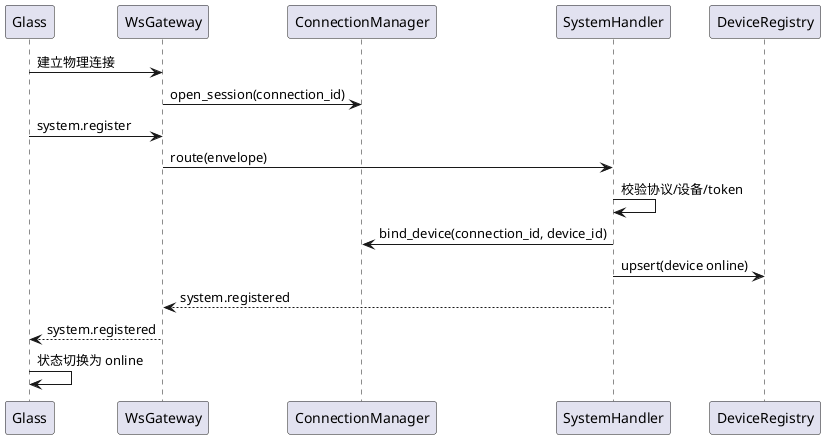
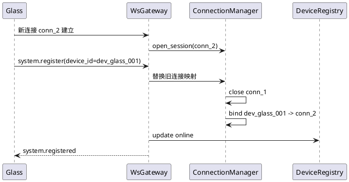

# 眼镜与服务器配对注册详细设计

## 1. 需求理解

### 1.1 功能目标

按照《第一期功能开发计划》第 1 项要求，完成眼镜与服务器之间的最小控制链路建立，使眼镜能够：

- 与服务器建立常驻长连接
- 完成设备身份校验与注册
- 被服务器记录为在线设备
- 周期性发送心跳，维持在线状态
- 在断线后使用相同 `device_id` 重连并覆盖旧连接

### 1.2 本任务中的“配对”定义

本任务中的“配对”不等同于后续第 9 项中的“眼镜与手机一对一绑定”。

本任务中的“配对”定义为：

- 眼镜与服务器之间建立可信控制链路
- 服务器确认该 `device_id` 的设备可被接纳进入系统
- 后续所有任务命令都可以基于该设备在线状态进行路由

第一期最小实现不引入二维码、人工确认页、蓝牙配对等复杂交互，而采用“预置 `device_id + auth token`”的轻量配对方案。

### 1.3 范围

本设计包含：

- `glass <-> server` 控制链路建立
- `system.register` / `system.registered`
- `system.heartbeat` / `system.heartbeat_ack`
- 在线状态维护
- 断线重连与旧连接覆盖
- 注册失败、协议不一致、鉴权失败等异常处理
- 与后续语音任务共用的最小接入底座

本设计不包含：

- 眼镜与手机绑定
- 手机接入
- 任务下发与执行细节
- 实时流媒体直连

### 1.4 架构依赖

本任务严格依赖以下架构能力：

- A1 统一协议与数据模型
- A2 三端工程骨架
- A3 设备注册与连接管理
- A4 消息路由与追踪
- A14 日志与测试底座

## 2. 现状分析

### 2.1 已有文档约束

从架构文档和结构设计文档看，当前任务已有以下明确约束：

- 所有设备必须“先注册，再通信”
- 第一阶段控制平面统一使用长连接
- 注册消息统一使用 `Envelope`
- 注册消息名固定为 `system.register`
- 注册响应消息名固定为 `system.registered`
- 服务器需要维护 `DeviceRegistry`、`ConnectionSession`、`ConnectionManager`
- 心跳与在线状态需要被持续追踪

### 2.2 当前代码已实现部分

服务端当前已经具备较完整的注册骨架：

- 协议模型已实现：`server/src/protocol/messages/envelope.py`
- 注册载荷已实现：`server/src/protocol/messages/payloads.py`
- 设备注册中心已实现：`server/src/api/session/device_registry.py`
- 连接会话与连接管理已实现：`server/src/api/session/connection_session.py`、`server/src/api/session/connection_manager.py`
- 系统消息处理器已实现：`server/src/api/handlers/system_handler.py`
- 路由与网关已实现：`server/src/api/router/message_router.py`、`server/src/api/gateway/ws_gateway.py`
- 健康巡检已接入运行循环：`server/src/app/runtime_loop.py`

测试骨架也已覆盖最小主链路：

- 注册集成测试：`server/test/integration/test_device_register_flow.py`
- 注册校验失败测试：`server/test/integration/test_register_validation.py`
- 重连覆盖测试：`server/test/api/test_connection_manager.py`

眼镜侧已经具备最小状态机骨架：

- 启动入口：`glass/src/app/main.ino`
- 控制链路状态机：`glass/src/glass_api/transport/server_client.cpp`

### 2.3 当前代码与目标之间的缺口

虽然服务端骨架较完整，但距离“可联调的真实配对注册能力”还存在明显缺口。

#### 2.3.1 鉴权仅校验“有无”，未校验“真伪”

`server/src/api/handlers/system_handler.py` 当前只要求 `register.auth` 存在，没有真正验证 token 是否匹配设备。

这会导致：

- 任意伪造设备都可能进入 `DeviceRegistry`
- “配对”语义不成立，只剩“注册报文格式正确”

#### 2.3.2 连接绑定时机过早

`server/src/api/gateway/ws_gateway.py` 在收到任意消息后，会先根据 `envelope.source.device_id` 调用 `ConnectionManager.bind_device()`，再进入 `system.register` 校验。

这会带来一个隐藏风险：

- 未通过鉴权的连接，也可能先占用某个 `device_id`
- 若使用相同 `device_id` 伪造连接，可能提前挤掉旧连接

因此，真实实现中必须将“物理连接建立”和“通过注册后的设备绑定”分离。

#### 2.3.3 眼镜侧还没有真实传输实现

`glass/src/glass_api/transport/server_client.cpp` 当前只有状态机骨架，还没有：

- 真实 WebSocket 连接
- 注册消息 JSON 编码
- 心跳消息发送
- 服务端响应解析

#### 2.3.4 失效连接尚未主动清理

`SystemHandler.reconcile_device_health()` 已能根据心跳时间更新设备状态，但运行循环尚未调用 `ConnectionManager.prune_stale_sessions()` 主动回收失效会话。

#### 2.3.5 Session 模型尚未真正落地

架构文档定义了 `pairing_session`，但当前代码中尚无独立 `SessionRegistry` 或持久化 PairingSession 模型。

第一期可接受的折中方案是：

- 不单独引入新的持久化 Session 子系统
- 以 `trace_id + connection_id + device_id` 表征当前注册链路
- 在日志中保留“注册轮次”与“重连轮次”信息

### 2.4 当前测试现状

当前仓库文档中记录过服务端测试通过，但本工作树下直接执行：

- `pytest`
- `uv run pytest`

均未获得可用结果，当前阻塞主要有两类：

- 运行环境落到错误解释器或错误站点包路径
- `server/src` 下多个包缺少显式导出文件，导致测试导入失败

因此，本任务设计文档中的“开发后测试结果”需要明确区分“既有历史记录”与“当前工作树现状”。

## 3. 实现方案描述

### 3.1 总体方案

本任务采用“预置身份 + 长连接注册 + 心跳保活 + 原 `device_id` 重连覆盖”的最小闭环方案。

实现后的主链路：

1. 眼镜启动，建立到服务器的 WebSocket 长连接
2. 连接建立后发送 `system.register`
3. 服务器校验协议版本、设备类型、设备身份
4. 校验成功后再将连接提升为已绑定设备连接
5. 服务器写入 `DeviceRegistry`，返回 `system.registered`
6. 眼镜进入 `online`
7. 眼镜周期性发送 `system.heartbeat`
8. 服务器返回 `system.heartbeat_ack`
9. 若连接中断，眼镜使用相同 `device_id` 重新注册，服务器替换旧连接

### 3.2 模块职责划分

#### 3.2.1 服务端

`WsGateway`

- 负责原始消息编解码
- 负责连接与会话的初始关联
- 负责幂等缓存
- 负责将消息交给 `MessageRouter`

`SystemHandler`

- 负责注册与心跳消息的业务校验
- 负责调用设备注册中心与连接管理器
- 负责生成 `system.registered` / `system.heartbeat_ack`

`DeviceRegistry`

- 保存设备注册结果
- 保存设备能力与在线状态

`ConnectionManager`

- 维护连接会话
- 管理重连覆盖
- 提供在线设备查找能力

`RuntimeLoop`

- 周期性执行健康巡检
- 回收超时连接

#### 3.2.2 眼镜端

`ServerClient`

- 建立与服务器的控制连接
- 发送注册和心跳
- 处理 `system.registered` / `system.heartbeat_ack` / `system.error`
- 维护本地连接状态机

`MessageCodec`

- 负责 `Envelope` JSON 编解码

`main.ino`

- 启动时读取预置配置
- 驱动 `ServerClient` 进入连接与注册流程

### 3.3 配对注册的状态模型

#### 3.3.1 服务端连接状态

- `physical_connected`
- `registering`
- `authenticated`
- `online`
- `degraded`
- `offline`

说明：

- `physical_connected` 仅表示 TCP/WebSocket 已连通
- 只有在鉴权成功后，才允许把 `device_id` 绑定到逻辑会话

#### 3.3.2 眼镜端状态

- `offline`
- `connecting`
- `registering`
- `online`
- `degraded`
- `reconnecting`
- `error`

与现有 `ServerClient` 状态机保持一致。

### 3.4 协议与载荷设计

#### 3.4.1 注册请求

消息：

- `message_type = command`
- `message_name = system.register`
- `requires_ack = true`

关键载荷：

- `device.device_id`
- `device.device_type = glass`
- `device.protocol_version`
- `device.capabilities`
- `device.status = registering`
- `auth.token`

建议扩展字段：

- `device.device_model`
- `device.firmware_version`
- `network.rssi`
- `network.ip`

#### 3.4.2 注册响应

消息：

- `message_type = event`
- `message_name = system.registered`

关键载荷：

- `result = ok`
- `server_time`
- `protocol_version`
- `heartbeat_interval_seconds`

建议补充：

- `session_hint`
- `reconnect_backoff_ms`

#### 3.4.3 心跳请求与响应

心跳请求：

- `message_name = system.heartbeat`
- 由眼镜周期性发送

关键载荷：

- `device_status`
- `battery_level`
- `active_task_ids`
- `connection_quality`

心跳响应：

- `message_name = system.heartbeat_ack`
- `payload.ack_status = processed`

### 3.5 鉴权方案

#### 3.5.1 第一阶段采用静态设备凭据

为避免在功能 1 中引入过重账户体系，本阶段采用静态白名单方案：

- 眼镜固件预置 `device_id`
- 眼镜固件预置 `auth token`
- 服务器预置允许接入的 `device_id -> token` 映射

#### 3.5.2 服务端建议新增组件

建议新增：

- `server/src/api/session/device_authenticator.py`

职责：

- 校验 `device_id`
- 校验 `device_type`
- 校验 token
- 输出结构化鉴权失败原因

这样可以避免把鉴权逻辑直接写死在 `SystemHandler` 中。

#### 3.5.3 鉴权失败处理

若校验失败：

- 不写入 `DeviceRegistry`
- 不建立逻辑设备绑定
- 返回 `system.error`
- 记录 `trace_id`、`device_id`、失败原因
- 当前连接可直接关闭，或进入短暂冷却后关闭

### 3.6 连接绑定时机修正

这是本任务实现中的关键约束。

建议修改为两阶段绑定：

1. `WsGateway.open_connection()` 仅创建匿名连接会话
2. 收到 `system.register` 后，仅暂存“候选源设备 ID”
3. `SystemHandler` 鉴权通过后，显式调用 `ConnectionManager.bind_device()`
4. 鉴权失败则不执行绑定

这样可以避免伪造连接抢占设备映射。

### 3.7 重连与旧连接覆盖

#### 3.7.1 重连触发

眼镜端出现以下情况进入 `reconnecting`：

- WebSocket 断开
- 长时间未收到 `system.heartbeat_ack`
- 接收到链路错误

#### 3.7.2 重连流程

1. 眼镜保留原 `device_id`
2. 重新建立物理连接
3. 再次发送 `system.register`
4. 服务器校验通过后，替换旧连接
5. 服务器将设备状态恢复为 `online`

#### 3.7.3 服务器侧要求

重连覆盖必须具备幂等性：

- 相同 `message_id` 的重复注册返回同一结果
- 相同 `device_id` 的新注册覆盖旧连接
- 旧连接被关闭后不再接受路由投递

### 3.8 日志与追踪

必须记录的关键节点：

- `glass.connection.connecting`
- `glass.connection.registering`
- `system.register.received`
- `system.register.authenticated`
- `system.register.rejected`
- `system.registered`
- `system.heartbeat_ack`
- `glass.connection.degraded`
- `glass.connection.reconnecting`

日志字段至少包含：

- `trace_id`
- `message_id`
- `device_id`
- `module`
- `event_name`

### 3.9 异常与降级策略

#### 3.9.1 协议版本不匹配

- 返回 `system.error`
- 错误类型为 `validation_error`
- 不进入在线态

#### 3.9.2 鉴权失败

- 返回 `system.error`
- 不绑定设备
- 记录安全日志

#### 3.9.3 心跳超时

- 先进入 `degraded`
- 达到离线阈值后进入 `offline`
- 由运行循环回收超时连接

#### 3.9.4 重复注册

- 同连接重复注册：返回幂等结果
- 新连接顶替旧连接：关闭旧连接并保留最新连接

## 4. 流程图

### 4.1 注册流程图

### 4.2 心跳与重连流程图

## 5. 时序图

### 5.1 正常注册时序

### 5.2 重连覆盖时序

## 6. 自动化测试方案

### 6.1 单元测试

#### 6.1.1 协议与载荷

- `Envelope` 编解码正确性
- `RegisterPayload.from_dict()` 正确解析
- 注册消息字段缺失时抛出预期错误

#### 6.1.2 鉴权

- 合法 `device_id + token` 可通过
- token 缺失或错误返回失败
- 不支持的 `device_type` 返回失败

#### 6.1.3 连接管理

- 新连接打开成功
- 同一 `device_id` 新连接覆盖旧连接
- 关闭连接后设备映射被移除
- 过期连接可被 `prune_stale_sessions()` 清理

#### 6.1.4 系统处理器

- 注册成功后设备状态变为 `online`
- 协议版本不匹配返回 `system.error`
- 心跳后更新时间戳与状态
- 健康巡检可将设备置为 `degraded` / `offline`

#### 6.1.5 眼镜端状态机

- `registerDevice()` 后进入 `registering`
- 收到 `system.registered` 后进入 `online`
- 心跳 ACK 超时后进入 `degraded`
- `degraded -> reconnecting -> registering`

### 6.2 功能测试

#### 6.2.1 最小注册闭环

使用 Fake Transport / Mock WebSocket 验证：

1. 打开连接
2. 发送 `system.register`
3. 服务器返回 `system.registered`
4. `DeviceRegistry` 中设备为 `online`

#### 6.2.2 心跳闭环

1. 注册成功
2. 连续发送若干 `system.heartbeat`
3. 服务器返回 `system.heartbeat_ack`
4. 设备保持 `online`

#### 6.2.3 重连覆盖

1. 连接 1 完成注册
2. 连接 2 用相同 `device_id` 再次注册
3. 旧连接被关闭
4. 新连接成为唯一在线连接

#### 6.2.4 异常场景

- 协议版本错误
- token 错误
- 心跳超时
- 重复注册

### 6.3 联调测试

建议准备一个最小眼镜模拟端脚本，覆盖：

- 启动即注册
- 周期性心跳
- 人工触发断线后自动重连
- 服务器日志可完整追踪 `trace_id`

## 7. 当前方案与架构设计的契合程度

当前方案与现有架构设计高度契合，主要体现在：

- 严格沿用 `Envelope + system.*` 协议模型
- 严格沿用 `server-api -> session/registry -> runtime_loop` 的职责边界
- 不把注册逻辑写进业务任务层或 Agent 层
- 心跳、在线状态、重连均属于 A3/A4/A14 既定范围

需要特别说明的地方：

- 架构文档中定义了 `pairing_session`，但当前方案不引入新的 Session 子系统，而是采用轻量实现
- 该取舍不会破坏现有架构，只是将 Session 的正式持久化推迟到后续阶段

改进建议：

- 后续如设备数增多，应补充显式 `SessionRegistry`
- 鉴权能力后续可升级为更独立的设备密钥管理模块

## 8. 开发后测试结果

截至本方案文档编写时，本任务对应的“新增功能实现”尚未完成，因此暂无本轮开发后的最终测试结论。

当前已确认的测试现状如下：

- 文档历史记录中，服务端架构骨架曾于 `2026-04-08` 通过全量测试
- 但在当前工作树下执行 `pytest` 与 `uv run pytest` 时，均出现收集阶段失败
- 当前失败主要由 Python 解释器/环境偏差与包导出缺失引起，尚不能代表本任务功能逻辑本身的最终质量

因此，本任务开发完成后应重新补充：

- 注册链路单元测试结果
- 注册/心跳/重连功能测试结果
- 最小联调测试结果

## 9. 当前实现进展

当前进展判断如下：

- 服务端注册、心跳、在线状态、重连覆盖骨架：已完成
- 服务端协议模型、网关、路由、日志骨架：已完成
- 眼镜端控制链路状态机：已完成骨架
- 眼镜端真实长连接、JSON 编解码、真实注册报文发送：未完成
- 设备鉴权真值校验：未完成
- 连接绑定时机修正：未完成
- 失效连接主动清理：部分完成，仍需补齐

结论：

- 当前代码已满足“进入功能开发与联调”的底座条件
- 但尚未达到“真实眼镜设备可稳定注册上线”的完成态
- 第 1 项任务后续开发重点应放在眼镜端真实接入、鉴权补齐和绑定时机修正
