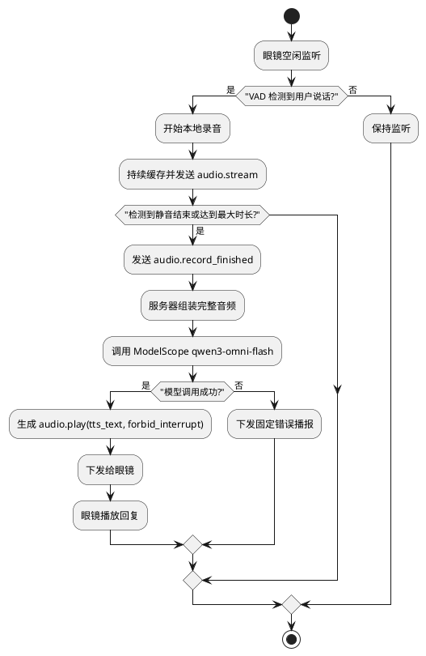
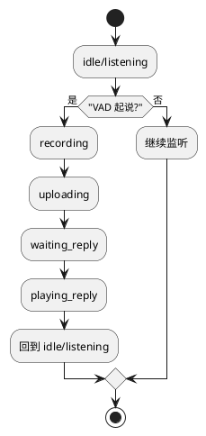
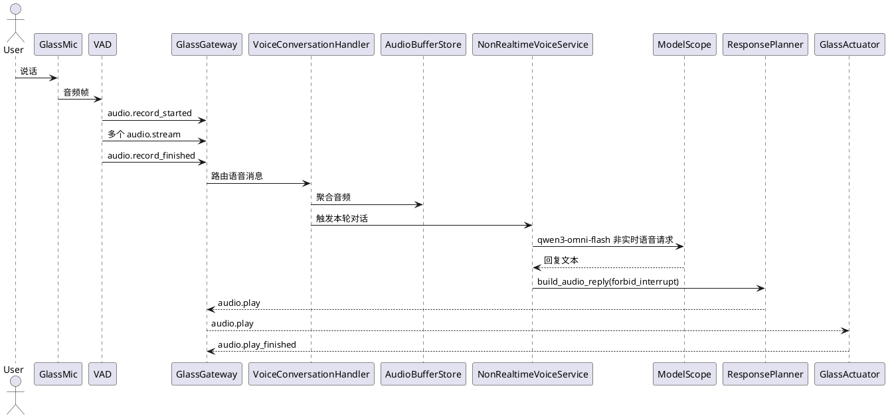
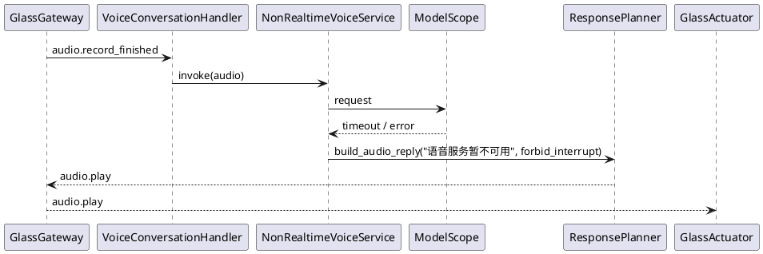

# 非实时语音对话详细设计

## 1. 需求理解

### 1.1 功能目标

按照《第一期功能开发计划》第 2 项要求，实现眼镜与服务器之间基于大模型的非实时语音对话闭环。

用户体验目标：

1. 用户对着眼镜说话
2. 眼镜端通过 VAD 自动识别本轮语音起止
3. 眼镜将本轮完整语音发送给服务器
4. 服务器通过 `ModelScope` 的 OpenAI SDK 兼容接口调用 `qwen3-omni-flash`
5. 服务器得到回复结果后，下发音频播放命令给眼镜
6. 眼镜完成播放

### 1.2 明确约束

本任务必须满足：

- 不支持用户打断
- 使用眼镜端麦克风录音
- 结合 VAD 识别用户语音
- 模型供应方统一表述为 `ModelScope`
- 模型使用 `qwen3-omni-flash`
- 模型接入方式统一为 OpenAI SDK 兼容模式

### 1.3 范围

本设计包含：

- 眼镜端本地 VAD 与录音分段
- 音频上行协议
- 服务端音频聚合与会话编排
- `ModelScope` 模型调用
- 模型回复转成眼镜可播放的 `audio.play` 指令
- 非打断模式下的播放与状态控制

本设计不包含：

- 实时流式语音对话
- 用户打断
- Tool/Skill 扩展对话
- 图片理解、任务创建、MCP 调用

### 1.4 架构依赖

严格依赖：

- A1 统一协议与数据模型
- A2 三端工程骨架
- A3 设备注册与连接管理
- A4 消息路由与追踪
- A5 眼镜感知总线
- A6 眼镜执行总线
- A14 日志与测试底座

轻量复用但不新增强依赖：

- 当前仓库中已存在的 `agent-core` 骨架

说明：

- 依赖矩阵中 F1 未把 A7 作为前置，这是合理的
- 但当前代码库已经有 `agent-core` 骨架，因此本任务可以复用它承接模型调用
- 该复用不应演化为“提前实现第 4、5 项的通用 Tool/Skill 功能”

## 2. 现状分析

### 2.1 文档侧约束

从架构与结构设计文档看，非实时语音对话必须遵守以下边界：

- 控制链路仍然走 `glass <-> server` 长连接
- 用户音频属于 `Stream / Media` 范畴
- 眼镜录音归属 A5 感知总线
- 回复播报归属 A6 执行总线
- 任务 2 不应绕开统一协议直接写临时接口

### 2.2 当前代码已实现部分

#### 2.2.1 服务端

已有能力：

- `AgentRuntime` 已支持文本上下文与模型调用：`server/src/agent_core/runtime/agent_runtime.py`
- 当前存在以旧术语命名的模型适配骨架：`server/src/agent_core/model_adapter/bailian_adapter.py`
- 当前存在以旧术语命名的 HTTP 客户端骨架：`server/src/agent_core/model_adapter/bailian_client.py`
- `ResponsePlanner` 已能生成 `audio.play` 命令：`server/src/agent_core/runtime/response_planner.py`
- `AudioHandler` 已覆盖 `audio.start_record` / `audio.stop_record` / `audio.play` 等最小消息名：`server/src/api/handlers/audio_handler.py`

#### 2.2.2 眼镜端

已有能力：

- 启动骨架与服务端连接状态机已存在：`glass/src/app/main.ino`、`glass/src/glass_api/transport/server_client.cpp`
- 麦克风、音频执行器等硬件边界已有头文件占位：
  - `glass/src/sensor/mic/mic_sensor.h`
  - `glass/src/actuator/audio/audio_actuator.h`

### 2.3 当前代码与目标之间的关键缺口

#### 2.3.1 当前 `AgentRuntime` 只支持文本输入

`server/src/agent_core/runtime/agent_runtime.py` 当前入口是：

- `AgentInput.text`

它尚未支持：

- 音频输入
- 多轮语音会话元数据
- 非实时语音专用上下文

#### 2.3.2 当前模型适配器命名、模型名与能力都不符合任务要求

`server/src/agent_core/model_adapter/bailian_adapter.py` 当前默认模型是：

- `qwen3.5-omni-plus`

而任务要求是：

- `qwen3-omni-flash`

同时当前适配器只抽象了：

- `generate(prompt, context)`
- `generate_with_tools(prompt, context, tools)`

并未抽象：

- 音频输入请求构造
- `ModelScope` 非实时语音对话响应解析
- 基于 OpenAI SDK 的兼容客户端调用

#### 2.3.3 当前音频处理器只是占位回显

`server/src/api/handlers/audio_handler.py` 当前行为是：

- 收到 `audio.stop_record` 就直接返回一个带占位 `audio_ref` 的 `audio.record_finished`
- 收到 `audio.play` 就立即回显 `audio.play_started` / `audio.play_finished`

这还不是“真实对话闭环”，而只是协议消息占位。

#### 2.3.4 当前没有“音频分片聚合 -> 模型调用 -> 回复播放”的编排层

当前代码中并不存在以下闭环：

- 上行 `audio.stream` 的缓存和拼装
- `audio.record_finished` 驱动模型调用
- 模型返回后自动调用 `ResponsePlanner`
- 通过 `WsGateway.send()` 把回复下发给眼镜

#### 2.3.5 当前没有 VAD 落地

眼镜侧还没有：

- 本地 VAD 检测
- 录音窗口控制
- 静音超时收尾
- 播放期禁止再次开启录音

#### 2.3.6 当前回复策略与“不可打断”冲突

`ResponsePlanner.build_audio_reply()` 当前固定使用：

- `interrupt_policy = allow_interrupt`

这与本任务“非实时语音对话，不支持用户打断”的要求不一致。

### 2.4 当前测试现状

当前测试只覆盖了非常浅的两层：

- 旧命名模型适配器的结构化工具调用解析：`server/test/agent_core/test_bailian_adapter.py`
- `AudioHandler` 的占位行为：`server/test/api/test_audio_handler.py`

尚未覆盖：

- 音频分片组装
- 语音会话编排
- `ModelScope` 非实时语音请求构造
- 回复下发给眼镜
- 非打断播放策略

## 3. 实现方案描述

### 3.1 总体方案

本任务采用“眼镜端本地 VAD 分段 + 非实时整段上传 + 服务端整段推理 + 回复播报”的最小闭环方案。

方案核心原则：

- VAD 放在眼镜本地，减少控制往返
- 只在一段语音结束后再发起模型调用
- 首期不做边录边传边播
- 首期不做打断
- 首期不开放工具调用，避免把后续任务提前耦合进来

### 3.2 核心链路设计

#### 3.2.1 眼镜端语音采集策略

眼镜端新增一个本地“非实时语音会话控制器”，负责：

- 监听麦克风 PCM 数据
- 使用 VAD 判断“开始说话”与“说话结束”
- 在一次语音段内持续缓存音频
- 到达静音阈值或最大时长时结束当前轮
- 将本轮语音包装为协议消息并发送给服务器

建议状态：

- `idle`
- `listening`
- `recording`
- `uploading`
- `waiting_reply`
- `playing_reply`

#### 3.2.2 上行协议设计

为兼容统一协议，采用：

- `audio.record_started`
- `audio.stream`
- `audio.record_finished`

三段式方案。

推荐顺序：

1. 眼镜检测到有效语音开始，发送 `audio.record_started`
2. 眼镜持续发送 `audio.stream`
3. 眼镜发送 `audio.record_finished`，标识本轮音频完成

关键约束：

- 同一轮语音必须共享同一个 `trace_id`
- 同一轮语音必须共享同一个 `media_id`
- `audio.stream` 中带 `chunk_index`
- 最后一片需带 `is_final = true`

建议音频格式：

- `sample_rate = 16000`
- `channels = 1`
- `codec = pcm16`
- `format = wav` 或原始 PCM + 服务端封装 WAV

#### 3.2.3 服务端新增编排组件

建议新增组件：

- `server/src/api/handlers/voice_conversation_handler.py`
- `server/src/agent_core/runtime/non_realtime_voice_service.py`
- `server/src/infra/storage/audio_buffer_store.py`

职责拆分如下。

`voice_conversation_handler.py`

- 接收 `audio.record_started` / `audio.stream` / `audio.record_finished`
- 调用 `AudioBufferStore` 完成音频缓存与收尾
- 在 `record_finished` 后触发语音服务

`audio_buffer_store.py`

- 按 `trace_id + media_id + device_id` 缓存音频分片
- 保证乱序、重复片、最终片组装规则
- 生成可供模型调用的完整音频对象

`non_realtime_voice_service.py`

- 读取对话上下文
- 通过 OpenAI SDK 兼容接口调用 `ModelScope` 非实时语音接口
- 生成回复文本
- 调用 `ResponsePlanner`
- 通过网关向目标眼镜发送回复

### 3.3 路由策略

当前 `MessageRouter` 允许“精确消息名优先于 domain handler”。

因此建议路由方式为：

- `audio.record_started` -> 精确注册到 `VoiceConversationHandler`
- `audio.stream` -> 精确注册到 `VoiceConversationHandler`
- `audio.record_finished` -> 精确注册到 `VoiceConversationHandler`
- `audio.play` / `audio.stop` / 播放完成类消息仍走 `AudioHandler`

这样可以避免把“设备播放控制”和“用户语音输入编排”混在同一个 `AudioHandler` 中。

### 3.4 Agent 运行时收敛策略

本任务不需要在语音主链路中开放通用 Tool/Skill。

建议在非实时语音模式下采用简化运行时：

1. 将音频转成模型输入
2. 只获取模型回复文本
3. 不对模型暴露 Tool 列表
4. 如模型返回工具调用意图，仅记录日志并忽略

原因：

- 当前任务目标是打通基础问答闭环
- 第 4、5 项才是 Tool/Skill/MCP 的正式引入阶段
- 这样能避免功能边界提前膨胀

### 3.5 `ModelScope` 模型适配方案

#### 3.5.1 适配器修改

建议将当前旧命名的 `BailianQwenOmniAdapter` 演进为统一命名的 `ModelScopeQwenOmniAdapter`。

适配器需要新增非实时语音方法，例如：

- `generate_from_audio(audio_bytes, mime_type, context)`

并将默认模型改为：

- `qwen3-omni-flash`

#### 3.5.2 请求构造

适配器需要负责：

- 使用 OpenAI SDK 创建 `OpenAI(base_url=..., api_key=...)` 客户端
- 把完整音频按 `ModelScope` OpenAI 兼容接口要求组织为请求体
- 附带当前对话上下文
- 统一处理超时、HTTP 错误、空响应

不建议继续在业务实现中直接扩散旧的 `BailianHttpClient` 命名。更合适的收口方式是：

- 保留 `model_adapter` 抽象层
- 将底层客户端替换为 `ModelScopeOpenAIClient` 或等价命名
- 由适配器对上层屏蔽 SDK 细节

#### 3.5.3 响应策略

第一期建议以“文本回复 + 眼镜侧播报”为主：

- 模型返回文本
- 服务端使用 `audio.play.tts_text`
- 眼镜端执行播放

原因：

- 当前协议和执行总线已经自然支持 `tts_text`
- 不必在任务 2 中额外引入模型原生音频流的复杂解析
- 后续若需要模型直接回音频，可再扩展 `audio_ref` / `audio_data`

### 3.6 ResponsePlanner 调整

需要新增一个“非实时语音回复”专用方法，或为现有方法增加参数：

- `interrupt_policy = forbid_interrupt`
- `play_mode = normal`

在本任务中，回复播报期间：

- 眼镜侧不接收新的用户录音轮次
- VAD 可以继续采集环境噪声，但不能触发新会话

### 3.7 眼镜端 VAD 与执行总线协同

#### 3.7.1 VAD 规则

建议参数：

- 预热缓存：200ms
- 起说阈值：连续若干帧超过能量阈值
- 收尾阈值：静音 800ms 到 1200ms
- 单轮最大录音时长：15s 到 20s

#### 3.7.2 与播放互斥

因为本任务不支持打断，眼镜端在 `playing_reply` 状态下必须：

- 暂停触发 VAD 会话开始
- 忽略新的说话起点
- 待 `audio.play_finished` 后恢复 `idle/listening`

### 3.8 会话与上下文策略

建议：

- 以 `conversation_id = conv_{device_id}` 维护短期上下文
- 每轮语音复用同一个 `conversation_id`
- 每一轮对话单独生成新的 `trace_id`

上下文内容保留：

- 最近若干轮用户/助手文本
- 最近一次失败摘要

不保留：

- 原始音频二进制
- 大段协议日志

### 3.9 失败处理与降级

#### 3.9.1 音频上行失败

- 记录 `audio.upload_failed`
- 清理缓存
- 给用户播报“刚才没有听清，请再说一次”

#### 3.9.2 `ModelScope` 调用失败

- 捕获超时、网络错误、空响应
- 服务端返回一个固定可播报文案
- 不让眼镜长时间悬停在 `waiting_reply`

#### 3.9.3 回复下发失败

- 若目标眼镜连接已失效，则仅记录日志并结束当前轮
- 不重试到无限次

#### 3.9.4 上下文异常增长

- 仍沿用 `ConversationContextStore.max_turns`
- 首期不做长期记忆，不写知识库

## 4. 流程图

### 4.1 非实时语音对话流程图

### 4.2 眼镜端状态流程图

## 5. 时序图

### 5.1 正常语音对话时序

### 5.2 `ModelScope` 失败降级时序

## 6. 自动化测试方案

### 6.1 单元测试

#### 6.1.1 音频缓冲与拼装

- `audio.stream` 按 `chunk_index` 正常拼装
- 重复片可去重或覆盖
- `is_final = true` 后不可继续追加
- 超时未完成的缓存可清理

#### 6.1.2 语音编排服务

- `record_finished` 能触发模型调用
- 模型成功返回时生成 `audio.play`
- 模型失败时生成固定降级播报
- 播报命令的 `interrupt_policy` 必须为 `forbid_interrupt`

#### 6.1.3 `ModelScope` 适配器

- 请求体模型名必须为 `qwen3-omni-flash`
- 请求必须通过 OpenAI SDK 兼容客户端发起
- 音频输入请求构造正确
- 超时、HTTP 错误、空响应处理正确

#### 6.1.4 上下文管理

- 同一设备多轮对话能复用 `conversation_id`
- 超过最大轮次时正确裁剪旧上下文

#### 6.1.5 眼镜端本地状态机

- `idle -> recording -> uploading -> waiting_reply -> playing_reply -> idle`
- 播放期间 VAD 不可开启新轮次

### 6.2 功能测试

#### 6.2.1 最小问答闭环

使用模拟眼镜端发送：

1. `audio.record_started`
2. 多个 `audio.stream`
3. `audio.record_finished`

服务端使用 Fake `ModelScope` Client 返回固定文本，验证：

- 服务端成功组装音频
- 触发模型调用
- 成功向眼镜发送 `audio.play`

#### 6.2.2 多轮对话

连续发送两轮语音，验证：

- 第二轮能读到第一轮上下文
- `conversation_id` 保持稳定

#### 6.2.3 失败降级

模拟 `ModelScope` 超时，验证：

- 服务端不崩溃
- 眼镜仍收到降级播报
- 当前轮会话被正确结束

#### 6.2.4 非打断约束

在 `audio.play_started` 到 `audio.play_finished` 期间，模拟新的 VAD 起说事件，验证：

- 新语音不会进入新的对话轮

### 6.3 联调测试

建议联调顺序：

1. 先用本地 Fake Glass 验证音频协议闭环
2. 再接真实眼镜麦克风与本地 VAD
3. 最后接入真实 `ModelScope` 接口

建议保留联调工具：

- 消息抓包与回放脚本：`script/message_capture_replay.py`
- 结构化日志追踪 `trace_id`

## 7. 当前方案与架构设计的契合程度

当前方案与架构设计整体契合度高，原因如下：

- 上行语音仍走统一协议的 `audio.*` 消息，而不是私有旁路接口
- 采集放在眼镜 A5，播报放在眼镜 A6，职责边界清晰
- 服务端仍由 `server-api` 接收消息，由运行时编排模型调用
- 不引入手机、不引入后台任务、不提前耦合 MCP

需要说明的地方：

- 本方案会轻量复用已存在的 `agent-core` 骨架来调用 `ModelScope`
- 这并不意味着任务 2 需要提前完成第 4、5 项的 Tool/Skill/MCP 能力
- 若后续评审认为 F1 依赖矩阵需要体现“复用 A7 骨架”，可在架构文档中补充说明，但不应在未批准前直接改架构

改进建议：

- 后续进入实时语音任务时，建议把“非实时语音服务”和“实时语音服务”明确拆分
- 当前 `AudioHandler` 建议保持纯播放控制，语音输入编排应由独立 Handler 承接

## 8. 开发后测试结果

截至本方案文档编写时，本任务的完整功能实现尚未完成，因此暂无“开发完成态”的最终测试结果。

当前已确认现状如下：

- `ModelScope` 适配器与音频处理器只有骨架级测试
- 当前工作树中的全量 `pytest` / `uv run pytest` 仍在收集阶段失败
- 因此还不能给出本任务已完成的质量结论

本任务开发完成后必须补充以下结果：

- 音频缓冲与拼装单元测试结果
- `ModelScope` 非实时语音请求测试结果
- 最小语音问答闭环功能测试结果
- 真实眼镜联调结果

## 9. 当前实现进展

当前进展判断如下：

- 服务端 `agent-core` 文本问答骨架：已完成
- 旧命名 HTTP 客户端骨架：已完成，但术语待统一
- `ModelScope` 非实时语音输入适配：未完成
- 模型名切换到 `qwen3-omni-flash`：未完成
- 眼镜端 VAD：未完成
- 眼镜端真实录音上传：未完成
- 服务端音频分片缓存与组装：未完成
- `audio.record_finished -> 模型调用 -> audio.play` 编排链路：未完成
- “不可打断”播放策略：未完成

结论：

- 当前仓库已经具备承载本任务开发的协议、接入和运行时骨架
- 但距离“非实时语音对话可联调”的完成态还有明显实现差距
- 第 2 项任务后续开发应优先补齐语音输入编排、`ModelScope` 音频适配、回复播放策略三块核心能力
