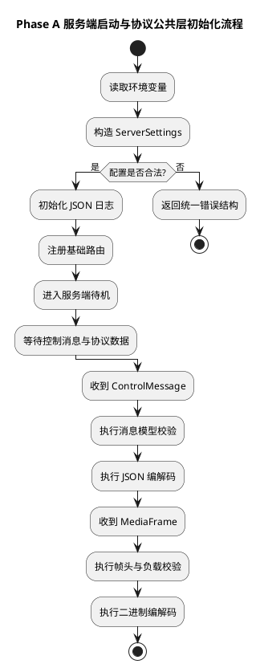
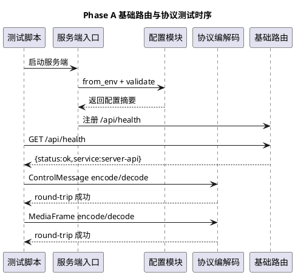

# Phase A 三端脚手架与协议公共层实施文档

## 1. 需求理解

本阶段目标对应 [第一期前三项开发落地计划.md](/Users/elio/dev/llm-project/OpenAIglassesDemo_2/doc/plan/第一期前三项开发落地计划.md) 的 Phase A，核心是先把可运行的工程底座搭起来，为后续注册链路与语音链路提供稳定公共能力。

本阶段必须交付：

1. 三端目录与启动入口可运行。
2. 服务端具备配置读取、结构化日志、统一错误模型。
3. 协议公共层具备 `ControlMessage` 与 `MediaFrame` 编解码。
4. 基础自动化测试可一键执行。

## 2. 现状分析

当前仓库在 Phase A 开始前存在以下情况：

1. `server/src`、`phone/src`、`glass/src` 无可运行业务代码。
2. 新架构协议文档已明确，但缺少落地模型代码和编解码实现。
3. 测试目录为空，无法自动验证协议与配置行为。
4. 启动命令和环境变量规范未形成统一文档。

## 3. 实现方案描述

### 3.1 目录与入口

本次新增：

1. 服务端入口：`server/src/app/main.py`
2. 服务端基础路由：`server/src/api/http_server.py`
3. 手机端模拟入口：`phone/src/main.py`
4. 眼镜端 ESP-IDF 入口：`glass/src/main/glass_main.c`
5. 眼镜端工程构建文件：`glass/src/CMakeLists.txt`、`glass/src/main/CMakeLists.txt`

### 3.2 配置、日志、错误

本次新增：

1. 配置模块：`server/src/infra/config/settings.py`
2. 日志模块：`server/src/infra/logging/logger.py`
3. 错误模型：`server/src/infra/errors/error_codes.py`

关键点：

1. 配置模块支持环境变量读取、默认值、合法性校验。
2. 日志模块支持 `trace_id/session_id/device_id/message_id` 透传。
3. 错误模型统一输出 `code/message/retryable/details`。

### 3.3 协议公共层

本次新增：

1. 控制消息模型：`server/src/protocol/messages/control_message.py`
2. JSON 编解码：`server/src/protocol/codec/json_codec.py`
3. 媒体帧模型：`server/src/protocol/media/media_frame.py`
4. 消息工厂：`server/src/protocol/utils/message_factory.py`
5. 最小幂等索引：`server/src/protocol/idempotency.py`

关键点：

1. `ControlMessage` 严格校验必填字段和 `semantic/channel` 白名单。
2. `MediaFrame` 使用 `4 bytes header_len + header_json + payload` 编解码。
3. 错误输入会抛出结构化协议错误。

### 3.4 测试框架

本次新增：

1. 单元测试目录：`server/test/unit`
2. 集成测试目录：`server/test/integration`
3. 一键测试脚本：`script/run_phase_a_tests.sh`

覆盖范围：

1. 配置解析与校验。
2. 错误模型结构。
3. `ControlMessage` round-trip 与非法字段。
4. `MediaFrame` round-trip 与错误帧。
5. 服务端 `/api/health` 冒烟可用性。

## 4. 流程图（PlantUML）



## 5. 时序图（PlantUML）



## 6. 自动化测试方案

### 6.1 单元测试

1. 配置模块：合法配置、非法端口、设备映射解析。
2. 错误模块：错误对象字典化。
3. 控制消息：往返编解码、非法 semantic 拦截。
4. 媒体帧：往返编解码、负载长度异常拦截。

### 6.2 集成测试

1. 启动临时服务端实例。
2. 调用 `/api/health`，验证返回结构。

### 6.3 运行命令

```bash
bash script/run_phase_a_tests.sh
```

## 7. 当前方案与架构设计的契合程度

契合度评估：`高`。

理由：

1. 与统一 `ControlMessage` / `MediaFrame` 协议方向一致。
2. 三端目录和入口已经建立，符合后续模块化演进方向。
3. 错误模型与追踪日志字段已与架构文档约束对齐。
4. 当前实现仍是最小基础层，没有提前引入不必要复杂状态机，符合第一期“先最小可运行”的原则。

## 8. 开发后测试结果

执行时间：2026-04-12。

执行命令：

```bash
bash script/run_phase_a_tests.sh
```

结果汇总：

1. 共执行 9 个测试。
2. 通过 9 个。
3. 失败 0 个。

补充说明：

1. 集成测试中的本地端口绑定在受限沙箱下会被拒绝。
2. 在允许本地端口绑定的执行环境下，测试已通过。

## 9. 当前实现进展

Phase A 当前状态：`已完成核心代码与自动化测试落地`。

已完成项：

1. 三端入口、服务端基础路由。
2. 配置、日志、错误码统一模型。
3. 协议公共层模型与编解码。
4. 单元测试与冒烟测试、一键测试脚本、启动说明文档。

下一步建议：

1. 进入 Phase B，开始 `/ws/control` 与注册消息处理。
2. 在注册链路中复用当前协议公共层，避免重复定义字段与错误结构。
