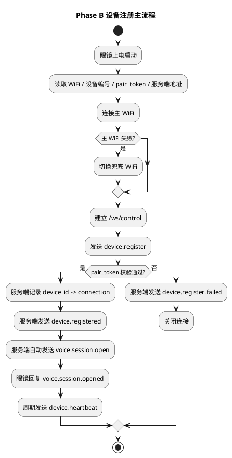
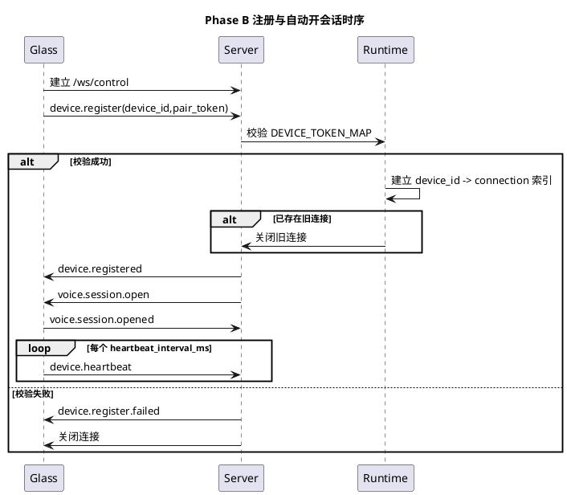

# Phase B 设备配对注册实施文档

## 1. 需求理解

本阶段目标对应 [第一期前三项开发落地计划.md](/Users/elio/dev/llm-project/OpenAIglassesDemo_2/doc/plan/第一期前三项开发落地计划.md) 的 Phase B，核心是把“设备真实注册”链路落到代码，而不是停留在协议模型或模拟入口。

本阶段必须交付：

1. 服务端实现 `/ws/control` 控制连接与注册消息处理。
2. 服务端实现 `pair_token` 校验、`device_id -> control_connection` 索引、重连覆盖、心跳超时离线。
3. 注册成功后，服务端自动下发 `voice.session.open`。
4. 眼镜端从真实 ESP-IDF 启动流程中完成 WiFi 连接、控制连接、`device.register`、`voice.session.opened`、`device.heartbeat`。
5. 补齐自动化测试、联调脚本、启动方式、日志观察与验收说明。

## 2. 现状分析

Phase A 完成后，仓库已有协议模型、配置、日志和基础 HTTP 路由，但距离真实注册链路仍有明显缺口：

1. 服务端还没有 WebSocket 控制面，也没有在线设备运行态。
2. `device.register/device.registered/device.register.failed/device.heartbeat` 还未进入真实处理逻辑。
3. 眼镜端仍停留在 Phase A 的空转心跳任务，没有 WiFi、控制连接和注册行为。
4. 仓库缺少独立的 Phase B 联调脚本和验收说明，无法稳定指导本地模拟联调和 ESP32 真机联调。

## 3. 实现方案描述

### 3.1 服务端控制面

本次新增与修改：

1. `server/src/api/http_server.py`
2. `server/src/api/ws/control_runtime.py`
3. `server/src/api/ws/websocket_transport.py`
4. `server/src/infra/config/settings.py`

关键实现：

1. 复用现有 `ThreadingHTTPServer`，在 `/ws/control` 上接入最小可用 WebSocket 握手与文本帧收发。
2. 新增 `ControlRuntime` 维护控制连接、在线设备索引、会话状态与心跳超时清理线程。
3. 注册成功后立即回 `device.registered`，并自动下发 `voice.session.open`。
4. 对同一 `device_id` 的新连接执行覆盖策略，旧连接主动关闭。
5. 暴露 `/api/runtime/devices` 运行态接口，供联调和验收观察在线设备、连接与 `voice_opened` 状态。

### 3.2 配置与运行参数

`ServerSettings` 新增：

1. `HEARTBEAT_INTERVAL_MS`
2. `HEARTBEAT_TIMEOUT_MS`
3. `SERVER_DEVICE_ID`

约束：

1. `HEARTBEAT_TIMEOUT_MS` 必须大于 `HEARTBEAT_INTERVAL_MS`。
2. `DEVICE_TOKEN_MAP` 继续作为第一版静态 `device_id -> pair_token` 配置来源。

### 3.3 眼镜端 Phase B 固件

本次新增与修改：

1. `glass/src/main/glass_main.c`
2. `glass/src/main/Kconfig.projbuild`
3. `glass/src/main/CMakeLists.txt`

关键实现：

1. 保留 `Glass Runtime Config` 配置定义，但主流程改为从本地私有配置文件生成 `sdkconfig.local`，不要求每次进入交互式 `menuconfig`。
2. 使用 ESP-IDF 的 `esp_wifi` 完成 STA 模式联网，并在主 WiFi 失败后自动切换兜底 WiFi。
3. 使用 `esp_websocket_client` 连接服务端 `/ws/control`。
4. 连接成功后自动发送 `device.register`。
5. 收到 `device.registered` 后更新心跳间隔。
6. 收到 `voice.session.open` 后自动回 `voice.session.opened`。
7. 通过独立 FreeRTOS 任务周期发送 `device.heartbeat`。

### 3.4 联调与验收辅助

本次新增：

1. `script/run_phase_b_tests.sh`
2. `script/run_server_phase_b.sh`
3. `script/phase_b_control_client.py`
4. `script/run_glass_phase_b.sh`
5. [第一期前三项-PhaseB联调说明.md](/Users/elio/dev/llm-project/OpenAIglassesDemo_2/doc/plan/第一期前三项-PhaseB联调说明.md)

作用：

1. 一键执行 Phase B 自动化测试。
2. 一键启动服务端并跟随日志。
3. 在无真机时，用本地模拟设备跑真实 WebSocket 注册链路。
4. 在有真机时，用脚本统一完成“读取本地私有配置 -> 生成 `sdkconfig.local` -> build/flash/monitor”。

## 4. 流程图（PlantUML）



## 5. 时序图（PlantUML）



## 6. 自动化测试方案

### 6.1 单元测试

1. `ServerSettings` 新增心跳参数与约束校验。
2. 保留 Phase A 中协议、错误模型、编解码测试，保证 Phase B 没有破坏底层公共层。

### 6.2 集成测试

新增 `server/test/integration/test_control_register_flow.py`，覆盖：

1. 注册成功。
2. 注册失败。
3. 同设备重连覆盖旧连接。
4. 心跳超时后在线设备数回到 0。

测试实现原则：

1. 不引入第三方 WebSocket 依赖。
2. 使用最小原生 WebSocket 客户端模拟设备，验证真实 `/ws/control` 行为。
3. 通过 `/api/runtime/devices` 断言运行态。

### 6.3 功能测试 / 联调测试

1. 本地模拟设备联调：`python3 script/phase_b_control_client.py ...`
2. 真机联调：`bash script/run_glass_phase_b.sh -m`
3. 服务端观察：`bash script/run_server_phase_b.sh all`
4. 运行态观察：`curl http://127.0.0.1:8765/api/runtime/devices`

## 7. 当前方案与架构设计的契合程度

契合度评估：`高`。

理由：

1. 严格沿用架构文档中的 `/ws/control`、`device.register`、`device.registered`、`device.register.failed`、`device.heartbeat`、`voice.session.open`、`voice.session.opened`。
2. 注册通过后自动进入语音待命态，符合“注册成功后由服务端主动发起 `voice.session.open`”的既定设计。
3. 控制面、运行态和配对校验都保持最小实现，没有提前引入完整设备中心或复杂状态恢复，符合第一期最小可运行目标。

可改进点：

1. 当前 WebSocket 传输层是仓库内最小实现，只覆盖本期文本控制面；后续若进入更复杂控制流，可评估替换为成熟异步网络栈。

## 8. 开发后测试结果

执行时间：2026-04-12。

执行命令：

```bash
bash script/run_phase_b_tests.sh
```

结果汇总：

1. 共执行 15 个测试。
2. 通过 15 个。
3. 失败 0 个。

补充说明：

1. 自动化测试覆盖的是服务端真实注册链路与运行态，不包含真机烧录步骤。
2. 沙箱内独立前台端口绑定受限，因此 `run_server_phase_b.sh start` 在当前沙箱无法完成启动验证；仓库内集成测试使用进程内临时端口方式已通过。
3. 真机编译、烧录、串口日志观察已在联调说明中给出标准操作方式。

## 9. 当前实现进展

Phase B 当前状态：`核心代码已完成，可进入本地联调和真机联调`。

已完成项：

1. 服务端真实 `/ws/control`、配对注册、在线索引、重连覆盖、心跳超时。
2. 注册成功后的 `voice.session.open` 自动下发与 `voice.session.opened` 回包确认。
3. 眼镜端真实 ESP-IDF 启动、WiFi、控制连接、注册、心跳代码。
4. 自动化测试、联调脚本、启动脚本、验收说明。

下一步建议：

1. 进入 Phase C，开始 `/ws_audio`、音频段聚合、模型调用与 `/stream.wav` 下行播放。
