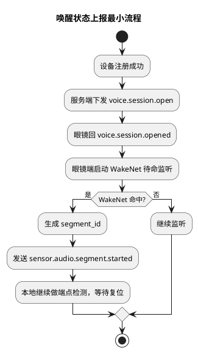
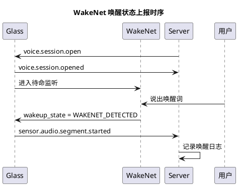

# Phase C 语音唤醒状态上报实施文档

## 1. 需求理解

本次开发目标是在当前 Phase B 注册链路已打通的基础上，向 Phase C 再推进一步：

1. 在眼镜端接入基于 ESP-SR 的 WakeNet 唤醒检测。
2. 当本地唤醒词命中后，眼镜端通过现有 `/ws/control` 控制连接向服务器发送一条语音唤醒状态消息。
3. 不在本次范围内接入 `/ws_audio` 上行、模型调用和 `/stream.wav` 播放链路。

本次最小交付物：

1. 眼镜端收到 `voice.session.open` 后进入 WakeNet 待命监听。
2. 唤醒成功后发送 `sensor.audio.segment.started`。
3. 服务端接收并记录该消息。

## 2. 现状分析

当前仓库已有：

1. Phase B 注册、心跳和 `voice.session.open` 自动下发。
2. WakeNet 试验结果已经合并进入主工程 `glass/src`，不再保留独立 spike 作为联调入口。
3. 协议文档中已冻结 `sensor.audio.segment.started` 作为“WakeNet 唤醒成功后开始一轮语音采集”的标准消息名。

当前缺口：

1. 主工程 `glass/src` 还未接入 `esp-sr`、模型分区和 PDM Mic 输入。
2. 眼镜端虽然已能注册成功，但在 `voice.session.opened` 后还不会真正进入唤醒监听态。
3. 文档与脚本需要统一到单一主流程，避免注册联调和 WakeNet 联调混用历史 spike 入口。

## 3. 实现方案描述

### 3.1 工程前置件

本次新增：

1. `glass/src/main/idf_component.yml` 增加 `espressif/esp-sr`
2. `glass/src/partitions.csv`
3. `glass/src/sdkconfig.defaults`

作用：

1. 为主工程提供 WakeNet 所需的 `esp-sr` 依赖。
2. 提供 `model` 分区，支持 `CONFIG_MODEL_IN_FLASH=y`。
3. 默认启用 `wn9_hilexin`、PSRAM 和 8MB Flash 配置。
4. 保持与 `glass/config/local_build.env -> sdkconfig.local` 的非交互式构建流程兼容。

### 3.2 眼镜端主流程扩展

本次修改：

1. `glass/src/main/glass_main.c`

关键逻辑：

1. 保留现有 WiFi、控制连接、注册、心跳流程。
2. 每次构建均从本地私有配置文件 `glass/config/local_build.env` 生成 `sdkconfig.local`，不使用交互式配置作为主路径。
3. 启动时初始化 PDM Mic 和 AFE/WakeNet 运行时。
4. 收到 `voice.session.open` 并回 `voice.session.opened` 后，打开唤醒监听开关。
5. `sr_pipeline_task` 持续执行 `feed/fetch`。
6. 当 `wakeup_state == WAKENET_DETECTED` 时，生成 `segment_id` 并发送 `sensor.audio.segment.started`。
7. 本地仍执行尾静音/超时判断，仅用于复位当前段状态，为下一次唤醒做准备；本次不接入音频上行。

### 3.3 服务端接收行为

本次修改：

1. `server/src/api/ws/control_runtime.py`

关键逻辑：

1. 显式接收 `sensor.audio.segment.started`。
2. 记录 `segment_id/stream_id` 日志，不再落入“忽略未支持消息”分支。

## 4. 流程图（PlantUML）

## 5. 时序图（PlantUML）

## 6. 自动化测试方案

### 6.1 服务端测试

更新 `server/test/integration/test_control_register_flow.py`：

1. 注册成功后发送 `voice.session.opened`。
2. 随后再发送一条 `sensor.audio.segment.started`。
3. 断言服务端链路不中断，运行态保持在线。

### 6.2 真机功能测试

1. 服务端启动并完成注册。
2. 串口看到 `WakeNet model selected: ...`。
3. 收到 `voice.session.open` 后，串口看到 `WakeNet listening enabled ...`。
4. 说出唤醒词后，串口看到 `WakeNet detected: segment_id=...`。
5. 服务端日志看到 `收到控制消息: sensor.audio.segment.started` 与 `收到语音唤醒状态上报: ...`。

## 7. 当前方案与架构设计的契合程度

契合度评估：`高`。

理由：

1. 完全复用既有协议消息 `sensor.audio.segment.started`。
2. 与架构文档中“WakeNet 命中后由设备上报开始一轮采集”的时序一致。
3. 本次只推进唤醒状态上报，没有提前把音频上行和模型链路混进来，边界清晰。

## 8. 开发后测试结果

本次已完成：

1. 服务端自动化测试已补充 `sensor.audio.segment.started` 路径。
2. 真机串口验证需要在本地 ESP-IDF 环境中完成。
3. WakeNet 联调默认使用 `bash script/run_glass_esp32.sh`，不再使用独立 spike 工程。

## 9. 当前实现进展

当前状态：`已完成 WakeNet 命中后的控制消息上报接入`。

下一步建议：

1. 接入 `/ws_audio`，让 `segment.started` 后真正开始上行音频块。
2. 在本地端点检测结束时发送 `sensor.audio.segment.finished`。
