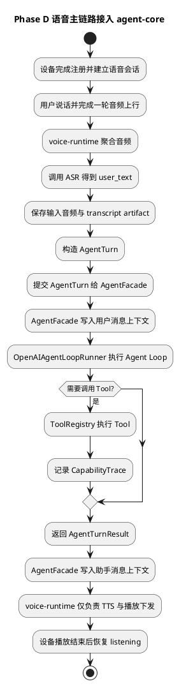
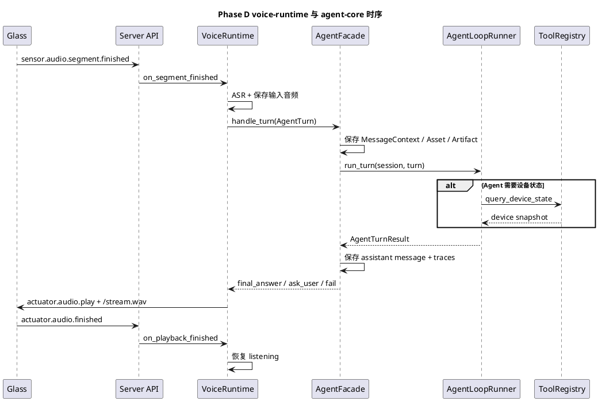

# Phase D agent-core 最小运行时实施文档

## 1. 需求理解

本阶段目标对应 [第二阶段第4-8项开发落地计划.md](/Users/elio/dev/llm-project/OpenAIglassesDemo_2/doc/plan/第二阶段第4-8项开发落地计划.md) 的 Phase D，核心是把当前已完成的语音主链路，从“ASR 后直接在 `voice-runtime` 里调用大模型”升级为“ASR 后提交 `AgentTurn` 到 `agent-core` 再统一决策”。

本阶段必须交付：

1. 定义 `voice-runtime -> agent-core` 的最小输入输出边界。
2. 落地 `AgentFacade / AgentSession / AgentTurn / DialogState / CapabilityTrace` 最小对象模型。
3. 落地基于 OpenAI Agents SDK 的最小 `Runner` 封装。
4. 落地首个 Tool 注册表，并完成至少一个 Tool 的调用链路。
5. 让当前非实时语音对话闭环改经 `agent-core`，并保持现有注册、收音、播报链路不回退。

## 2. 现状分析

Phase C 完成后，仓库已有以下基础：

1. `server-api` 已打通 `/ws/control`、`/ws_audio`、`/stream.wav`。
2. `VoiceRuntime` 已能完成单轮音频聚合、ASR、模型回复音频下发和播放控制。
3. 眼镜端已完成 `voice.session.open`、WakeNet、音频上行和播放闭麦主流程。
4. 服务端测试已覆盖注册链路和非实时语音主链路。

当前缺口：

1. `voice-runtime` 仍直接承担“历史组装 + 模型调用 + 回复决策”，未真正引入 `agent-core`。
2. 缺少统一的会话上下文存储，语音输入、转写结果、回复结果尚未进入统一上下文模型。
3. 缺少最小 Tool 注册表和调用轨迹记录，后续 Skill / MCP / Task 无统一承载体。
4. 缺少可替换的 Agent Runner，测试无法在不依赖真实模型接口的情况下验证 `agent-core` 链路。

## 3. 实现方案描述

### 3.1 总体策略

本次实现遵循以下策略：

1. `voice-runtime` 继续保留语音输入输出边界职责，不回退到“大一统编排器”。
2. `agent-core` 先完成“最小决策层”，仅承接：
   - 当前轮文本输入
   - 短期消息历史
   - 首批 Tool 调用
   - 统一错误包装
3. 生产路径采用 OpenAI Agents SDK；测试路径允许注入假 Runner，避免自动化测试依赖真实模型接口。
4. Phase D 不提前实现完整 Skill / MCP / Task Runtime，只为 Phase E/F 预留接口和上下文结构。

### 3.2 新增模块

本次新增：

1. `server/src/agent_core/context/models.py`
2. `server/src/agent_core/context/session_store.py`
3. `server/src/agent_core/context/assembler.py`
4. `server/src/agent_core/tools/registry.py`
5. `server/src/agent_core/runtime/runner.py`
6. `server/src/agent_core/facade/agent_facade.py`

关键职责如下：

1. `AgentSessionStore`
   - 保存 `session_id -> AgentSession`
   - 保存 `MessageContext / MediaAssetRef / DerivedArtifact / CapabilityTrace`
2. `ContextAssembler`
   - 负责把最近短期历史和当前轮输入装配成 Agent 输入文本
3. `ToolRegistry`
   - 管理首批 Tool 注册
   - 当前首批 Tool 仅实现 `query_device_state`
4. `OpenAIAgentLoopRunner`
   - 基于 OpenAI Agents SDK 的 `Agent + Runner.run_sync`
   - 支持 Tool 调用与结构化最终输出
5. `AgentFacade`
   - 作为 `voice-runtime` 的统一接入点
   - 负责上下文写入、调用运行循环、返回统一 `AgentTurnResult`

### 3.3 `voice-runtime` 接入改造

本次修改：

1. `server/src/runtime/voice_runtime.py`
2. `server/src/api/ws/control_runtime.py`
3. `server/src/api/http_server.py`

关键变化：

1. `VoiceRuntime` 新增 `agent_facade` 注入点。
2. `sensor.audio.segment.finished` 之后，服务端改为：
   - 先做 ASR
   - 落盘用户输入音频
   - 落盘转写结果 `DerivedArtifact`
   - 构造 `AgentTurn`
   - 调用 `AgentFacade.handle_turn`
3. `AgentFacade` 返回统一的 `AgentTurnResult` 后，`voice-runtime` 只负责：
   - 基于最终文本执行 TTS 音频生成
   - 发送 `actuator.audio.play`
   - 下发 `/stream.wav`
   - 在播报完成后恢复待命
4. 助手回复音频也会写回统一上下文，并挂到当前轮助手消息上。

### 3.4 Tool 最小闭环

本次首批 Tool 只落一个：

1. `query_device_state`

实现方式：

1. 通过 `ToolRegistry` 注册。
2. 对 OpenAI Agents SDK 暴露为 `function_tool`。
3. 同时保留手工 `invoke()` 入口，便于单元测试和未来 `SkillGateway` 复用。
4. Tool 调用时生成 `CapabilityTrace`，无论成功或失败都写入轨迹。

### 3.5 测试策略

本次测试采用“两层验证”：

1. 单元测试
   - `AgentFacade` 是否写入上下文
   - Tool 是否返回结果并记录轨迹
   - `OpenAIAgentLoopRunner` 是否正确委托 OpenAI Agents SDK
2. 集成测试
   - 复用现有 `/ws_audio + /stream.wav` 主链路
   - 在服务端注入假 `AgentLoopRunner`
   - 验证 `voice-runtime -> agent-core -> voice-runtime` 已形成闭环

## 4. 流程图（PlantUML）



## 5. 时序图（PlantUML）



## 6. 自动化测试方案

### 6.1 单元测试

新增 `server/test/unit/test_agent_core.py`，覆盖：

1. `AgentFacade` 写入用户消息、助手消息和调用轨迹。
2. `AgentFacade` 对 Runner 异常做统一失败包装。
3. `query_device_state` Tool 返回设备状态并记录 `CapabilityTrace`。
4. `OpenAIAgentLoopRunner` 能正确调用 OpenAI Agents SDK 封装层。

### 6.2 集成测试

更新 `server/test/integration/test_voice_dialog_flow.py`，覆盖：

1. 设备注册成功并自动进入 `voice.session.open`。
2. `/ws_audio` 上行和 `segment.finished` 之后，会进入 `AgentFacade`。
3. `agent-core` 返回文本后，`voice-runtime` 仍能通过 `/stream.wav` 完成播报。
4. 播放完成后，运行态会回到 `listening`。

### 6.3 执行命令

推荐执行：

```bash
bash script/run_phase_d_tests.sh
```

该脚本会在 `uv` 环境下执行：

```bash
PYTHONPATH=server/src uv run python -m unittest discover -s server/test -p 'test_*.py' -v
```

## 7. 当前方案与架构设计的契合程度

契合度评估：`高`。

理由：

1. 严格遵守 [agent-core设计.md](/Users/elio/dev/llm-project/OpenAIglassesDemo_2/doc/structure-design/agent-core设计.md) 中“`voice-runtime` 只负责语音边界、`agent-core` 承担开放式决策”的边界。
2. `agent-core` 的主循环确实采用 OpenAI Agents SDK，而不是继续在 `voice-runtime` 中自研一套新 loop。
3. 上下文模型已按 `MessageContext / MediaAssetRef / DerivedArtifact / CapabilityTrace` 落地最小结构。
4. 当前只实现最小 Tool 注册表，没有提前引入复杂 Skill Runtime，符合第二阶段计划里的 Phase D 范围。

当前仍保留的限制：

1. 当前 Tool 仅有 `query_device_state`，Skill / MCP / Task 仍待后续 Phase E/F 落地。
2. 生产路径已接 OpenAI Agents SDK，但自动化测试仍通过假 Runner 验证，真实模型联调仍需后续环境验证。
3. `voice-runtime` 目前仍沿用模型 TTS 输出链路，尚未把 TTS 独立成专门能力模块。

## 8. 开发后测试结果

执行时间：2026-04-13。

执行命令：

```bash
bash script/run_phase_d_tests.sh
```

结果汇总：

1. 共执行 25 个测试。
2. 通过 25 个。
3. 失败 0 个。

补充说明：

1. 其中新增 4 个 `agent-core` 单元测试。
2. 语音主链路集成测试已改为经 `agent-core` 返回结果再完成播报。
3. 当前自动化测试未直接访问真实模型接口，真实接口联调需要配置 `DASHSCOPE_API_KEY` 后再进行。

## 9. 当前实现进展

当前状态：`Phase D 核心代码、自动化测试与实施文档已完成`。

已完成项：

1. `AgentFacade / AgentSessionStore / ContextAssembler / ToolRegistry / OpenAIAgentLoopRunner`。
2. `voice-runtime -> agent-core -> voice-runtime` 最小闭环。
3. 首个 Tool：`query_device_state`。
4. `MessageContext / MediaAssetRef / DerivedArtifact / CapabilityTrace` 最小存储结构。
5. `uv` 环境下的一键测试脚本。

下一步建议：

1. 进入 Phase E，先补 `capture_photo`、`create_timer`、`query_task_status`、`cancel_task` 等最小 Tool。
2. 再进入 Skill / MCP gateway，实现 `photo_interpret` 和 `amap` 的统一承载层。
