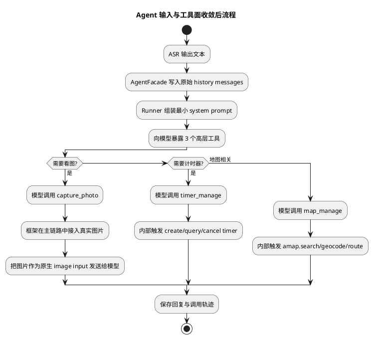
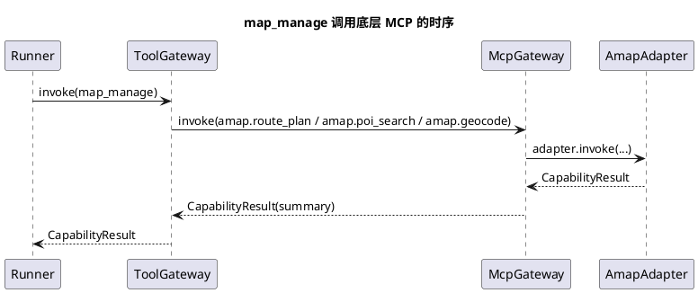

# Phase E Agent 输入与工具面收敛实施文档

## 1. 需求理解

本次调整目标有三点：

1. 不再在大模型提示词中引入任何架构层概念，例如“资产”“派生结果”“运行阶段”等。
2. 模型侧工具面收敛为 3 个：
   - `capture_photo`
   - `timer_manage`
   - `map_manage`
3. `agent-core` 默认模型切换为 `qwen3.6-plus`，同时保留当前 `qwen3.5-omni-plus` 作为 TTS 模型。

本次调整强调“框架负责上下文与能力编排，模型只负责理解用户输入、选择少量高层工具并生成回答”。

## 2. 现状分析

在本次调整前，代码已经完成了 Tool / MCP 的统一承载层，但仍有三个问题：

1. 模型侧可见工具过多，既有 `capture_photo / timer_manage / map_manage`，也暴露了 `create_timer / query_task_status / cancel_task / amap_poi_search / amap_geocode` 等底层能力。
2. 默认 `agent-core` 模型仍是 `qwen3-max`，与本次希望统一使用 `qwen3.6-plus` 处理文本和图片的目标不一致。
3. 文档和样例文件仍保留旧工具面与旧模型名称，容易误导后续开发。

## 3. 实现方案描述

### 3.1 总体策略

本次不改跨设备协议，也不新增额外的运行分流逻辑，只做三件事：

1. 缩减模型可见工具面。
2. 切换 `agent-core` 默认模型。
3. 同步测试与文档。

### 3.2 模型提示词收敛

`OpenAIAgentLoopRunner._build_instructions()` 继续保留最小 system prompt，只包含：

1. 助手身份。
2. 回答语言和风格。
3. “必要时可以调用工具”这一最小提示。

不再在提示词中引入任何框架内部概念。

### 3.3 工具面收敛为 3 个

本次调整后，`ToolRegistry` 分成两层：

1. 内部注册层：
   - `capture_photo`
   - `create_timer`
   - `query_task_status`
   - `cancel_task`
   - `amap_route_plan`
   - `amap_poi_search`
   - `amap_geocode`
2. 模型可见层：
   - `capture_photo`
   - `timer_manage`
   - `map_manage`

其中：

1. `capture_photo` 负责“需要看图时先拍照拿到当前画面”。
2. `timer_manage` 负责“创建、查询、取消计时器”。
3. `map_manage` 负责“地点搜索、地址解析、路线规划”，内部再调用 `amap.*` 方法。

### 3.4 地图工具合并方案

新增 `MapManageTool`，输入支持：

1. `action=search/geocode/route/auto`
2. `query`
3. `address`
4. `origin`
5. `destination`
6. `city`
7. `strategy`

自动判断规则：

1. 有 `origin` 或 `destination` 时走路线规划。
2. 有 `address` 时走地址解析。
3. 其余情况走地点搜索。

### 3.5 模型配置调整

配置调整为：

1. `AGENT_MODEL_NAME` 默认 `qwen3.6-plus`
2. `VOICE_MODEL_NAME` 默认 `qwen3.5-omni-plus`

其中：

1. `agent-core` 文本决策与图片解读统一使用 `agent_model_name`
2. TTS 继续使用 `voice_model_name`

## 4. 流程图（PlantUML）



## 5. 时序图（PlantUML）



## 6. 自动化测试方案

### 6.1 单元测试

重点覆盖：

1. `ToolRegistry` 只向模型暴露 3 个工具。
2. `capture_photo` 会生成真实图片资产。
3. `map_manage` 能内部调用 `amap.route_plan` 并同时记录 `mcp + tool` 轨迹。
4. 主链路图片理解使用 `agent_model_name`。
5. `ServerSettings` 默认 `agent_model_name=qwen3.6-plus`。

### 6.2 功能测试

重点覆盖：

1. `AgentPhaseEFlow` 中一轮输入能串起：
   - `capture_photo`
   - `map_manage`
2. 真实音频样例批量工具写出的 `result.json` 中，`model_request.model` 已切换为 `qwen3.6-plus`。

### 6.3 跨设备联调方案

服务端：

```bash
cd /home/liuh/dev/OpenAIglassesDemo_2
AGENT_MODEL_NAME=qwen3.6-plus \
VOICE_MODEL_NAME=qwen3.5-omni-plus \
LOG_LEVEL=DEBUG LOG_FILE=logs/server.log \
PYTHONPATH=server/src uv run python -m app.main --host 0.0.0.0 --port 8765
```

眼镜端：

1. 保持当前控制通道与相机抓拍链路。
2. 使用现有设备启动脚本连接服务端。
3. 发出“我眼前是什么”“帮我定时 5 分钟”“导航去最近的咖啡店”等语音。

联调时重点检查：

1. `openai._base_client` 日志中的模型是否为 `qwen3.6-plus`
2. 模型工具列表是否只有 3 个
3. 拍照问题是否先触发 `capture_photo`
4. 地图问题是否触发 `map_manage`

## 7. 当前方案与架构设计的契合程度

本次调整与既有架构总体契合，主要体现在：

1. 没有破坏 `ToolRegistry / McpRegistry` 两层结构。
2. 只调整模型可见层，不破坏底层能力实现。
3. 进一步符合“框架承载编排，模型只感知少量高层工具”的方向。

需要指出的改进建议是：

1. 设计文档中原先“模型直接可见更多原子 Tool”的表述，已经不再适合当前实现，应以 3 个高层工具为准。

## 8. 开发后测试结果

已执行：

```bash
PYTHONPATH=server/src uv run python -m unittest \
  server.test.unit.test_settings \
  server.test.unit.test_agent_core \
  server.test.integration.test_agent_phase_e_flow \
  server.test.unit.test_audio_sample_batch_runner -v
```

结果：

1. 共 29 个测试全部通过。
2. `map_manage` 新增路径通过。
3. `qwen3.6-plus` 默认配置通过。
4. 3 工具收敛行为通过。

## 9. 当前实现进展

当前已经完成：

1. 模型提示词收敛，不再引入架构概念。
2. 模型可见工具收敛为 `capture_photo / timer_manage / map_manage`。
3. `agent-core` 默认模型切换到 `qwen3.6-plus`。
4. 图片理解改用 `agent_model_name`。
5. 联调样例、测试和说明文档同步完成。
