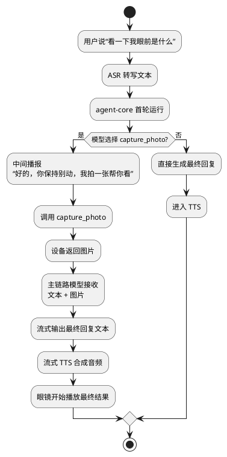
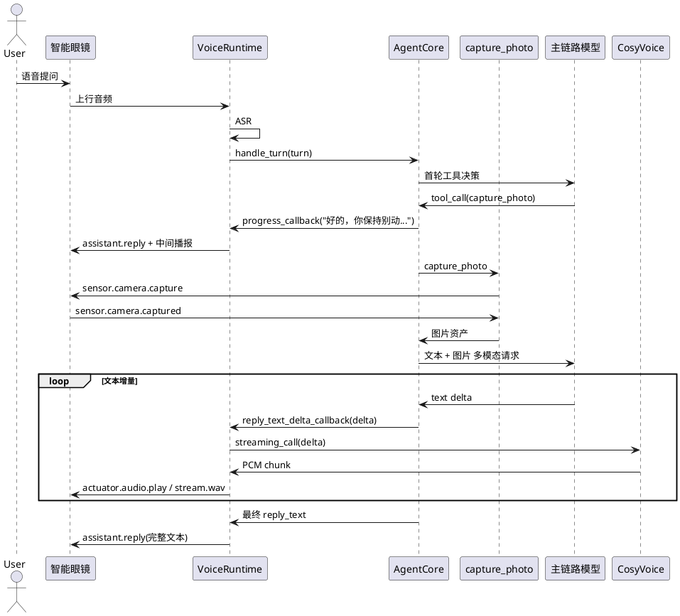

# PhaseE 流式交互与拍照主链路改造实施文档

## 1. 需求理解

本次改造聚焦 3 个目标：

1. `agent-loop` 在长耗时能力执行期间不再长时间静默，要能先给用户一句中间反馈。
2. “拍照”工具只负责拍照取图，不负责在工具内部完成图片解读；图片理解必须回到主链路模型。
3. 语音播报链路要支持更低首包延迟，优先接入 `cosyvoice-v3-flash` 的流式 TTS，并把模型文本增量尽快转成音频下发给眼镜。

## 2. 现状分析

改造前存在 3 个明显问题：

1. 主链路只有最终回复会播报给用户，视觉问题会经历“工具选择 -> 拍照 -> 图片解读 -> 二次总结”多个阶段，用户只能一直等待。
2. `photo_interpret` 既负责拍照，又在 Skill 内部直接调用视觉模型，导致主链路模型并没有真正看到图片。
3. TTS 只有在最终文本完整生成后才启动，虽然音频下发是流式的，但文字生成与语音合成之间仍然是串行关系。

## 3. 实现方案描述

### 3.1 主链路交互改造

1. `VoiceRuntime` 调用 `AgentFacade.handle_turn(...)` 时，新增：
   - `progress_callback`
   - `reply_text_delta_callback`
2. `OpenAIAgentLoopRunner` 在需要增强交互时，不再只走 `Runner.run_sync(...)`，而是切到 `Runner.run_streamed(...)` 观察中间事件。
3. 当模型选择 `capture_photo` 时：
   - 若模型在工具前已经给出一段短回复，则直接播报该短回复。
   - 若模型没有先说话，则框架补一句固定短反馈，例如“好的，你保持别动，我拍一张帮你看。”

### 3.2 拍照与图片理解职责拆分

1. 模型可见工具从 `photo_interpret / timer_manage / map_manage` 调整为：
   - `capture_photo`
   - `timer_manage`
   - `map_manage`
2. `capture_photo` 只负责：
   - 调用设备相机
   - 落盘图片
   - 返回图片资产引用
3. 当 `capture_photo` 完成后：
   - 中止旧的工具总结 loop
   - 不再把 `asset_id / storage_uri` 这类内部信息继续当成文本工具结果喂给模型
   - 由 `OpenAIAgentLoopRunner` 直接发起“主链路图片解读”请求
   - 把当前用户问题和真实图片一起作为多模态输入发给 `agent_model_name`
4. 拍照后的第二段模型提示词单独收敛为“看图直接回答”：
   - 明确当前已经拿到真实照片
   - 要求直接根据图片回答
   - 禁止只说“我已经拍照了”或追问“是否保存照片”
5. 拍照续跑只接受本次新抓拍图片：
   - 进入抓拍前先记录当前会话里已有的图片编号
   - 抓拍完成后只等待一张本次新增图片
   - 不允许回退复用历史旧图

### 3.3 流式 TTS 改造

1. `VoiceModelClient` 新增 `create_streaming_tts_session(...)` 接口。
2. 默认实现 `BufferedStreamingTtsSession`：
   - 在不支持真正增量合成时，先缓存文本
   - 在 `finish()` 时回退到旧的全文 TTS
3. `DashscopeVoiceModelClient` 优先创建 `DashscopeCosyVoiceTtsSession`：
   - 使用官方 `dashscope.audio.tts_v2` WebSocket 能力
   - 模型每产生一段文本增量，就立刻调用 `streaming_call(...)`
   - 音频回调收到 PCM 后，立即送入眼镜播放流
4. 若本地缺少 `dashscope` 依赖或初始化失败，则自动降级到旧链路。
5. 若同一轮内出现“中间播报 + 最终播报”等多条语音回复：
   - 后续播放流进入待播放队列
   - 只有前序播放结束后，下一条才会启动 `actuator.audio.play`
   - 不再允许后序语音直接覆盖前序语音

## 4. 流程图



## 5. 时序图



## 6. 自动化测试方案

### 6.1 单元测试

1. `test_tool_registry_only_exposes_three_model_facing_tools`
   - 验证模型可见工具已切换为 `capture_photo / timer_manage / map_manage`
2. `test_openai_runner_delegates_to_agents_sdk`
   - 验证普通路径仍能通过 SDK loop 返回最终回复
3. `test_openai_runner_creates_event_loop_in_worker_thread`
   - 验证工作线程仍能补齐事件循环
4. `test_capture_photo_tool_uses_real_camera_gateway_result`
   - 验证拍照工具只负责生成图片资产

### 6.2 功能测试

1. `test_full_voice_dialog_flow`
   - 验证 `voice-runtime -> agent-core -> TTS -> 眼镜播放` 的闭环未被破坏
2. `test_agent_turn_can_chain_tool_skill_and_mcp`
   - 验证能力层集成路径仍然可用

## 7. 跨设备联调方案

服务端启动：

```bash
cd /Users/elio/dev/llm-project/OpenAIglassesDemo_2
LOG_LEVEL=DEBUG \
LOG_FILE=logs/server.log \
PYTHONPATH=server/src \
uv run python -m app.main --host 0.0.0.0 --port 8765
```

若要显式指定新的 TTS 配置：

```bash
cd /Users/elio/dev/llm-project/OpenAIglassesDemo_2
AGENT_MODEL_NAME=qwen3.6-plus \
TTS_MODEL_NAME=cosyvoice-v3-flash \
TTS_VOICE=longanhuan \
TTS_WEBSOCKET_API_URL=wss://dashscope.aliyuncs.com/api-ws/v1/inference \
LOG_LEVEL=DEBUG \
LOG_FILE=logs/server.log \
PYTHONPATH=server/src \
uv run python -m app.main --host 0.0.0.0 --port 8765
```

眼镜端启动：

```bash
cd /Users/elio/dev/llm-project/OpenAIglassesDemo_2
bash script/run_glass.sh
```

联调重点观察日志：

1. 是否先出现 `tool.call name=capture_photo`
2. 是否出现中间播报对应的 `assistant.reply`
3. 是否出现 `拍照后切换到主链路图片解读`
4. 图片请求里是否包含 `image_url`
5. 是否能在最终文本尚未全部完成前就看到 `actuator.audio.play`
6. 是否出现 `CosyVoice 流式 TTS 初始化成功`

## 8. 当前方案与架构设计的契合程度

本方案与当前架构设计基本契合，原因如下：

1. 仍然以 OpenAI Agents SDK 作为通用 `agent loop` 基座，没有重新引入自定义模型动作协议。
2. 拍照工具的职责被进一步收紧，只负责取图，与 `agent-core设计.md` 中“图片理解应由主链路模型完成”的方向一致。
3. 中间播报与流式 TTS 都放在 `voice-runtime` 侧实现，继续保持“设备协议与播报策略由框架负责”的边界。

需要注意的架构改进点：

1. 当前“拍照完成后中止旧 loop，再进入主链路图片解读”仍然是项目侧编排，不是 Agents SDK 原生一次完成的多模态工具闭环。
2. 非视觉场景下，普通文本回复暂时仍以“整句完成后再 TTS”为主，尚未完全统一成全量 token 级播报。

## 9. 开发后测试结果

已执行：

```bash
PYTHONPATH=server/src uv run python -m unittest \
  server.test.unit.test_agent_core \
  server.test.integration.test_voice_dialog_flow \
  server.test.integration.test_agent_phase_e_flow -v
```

结果：

1. 24 个测试全部通过。

另执行：

```bash
PYTHONPATH=server/src uv run python -m unittest \
  server.test.unit.test_settings \
  server.test.unit.test_agent_core -v
```

结果：

1. 26 个测试全部通过。

## 10. 当前实现进展

当前已完成：

1. `agent-loop` 现在支持在长耗时视觉链路里先给出中间播报。
2. 模型可见工具已切换为 `capture_photo / timer_manage / map_manage`。
3. 视觉问题在拍照后会直接进入主链路模型的多模态图片解读，不再依赖 `photo_interpret` 把答案先算好。
4. 拍照后的第二段主链路提示词已单独收敛，避免模型只复述“已经拍照”或转而追问保存照片。
5. 每次拍照续跑都会等待本次新抓拍图片，不再复用会话中的历史旧图。
6. 同一轮内若先播中间反馈、再播最终结果，播放流会按顺序排队，后一条语音不会覆盖前一条未播完的语音。
7. TTS 已接入增量会话接口，优先尝试 `cosyvoice-v3-flash`，缺失依赖时自动回退旧链路，并会在日志中明确打印成功或降级原因。

当前仍未完成：

1. 非视觉普通问答还没有完全改造成 token 级文本到语音联动。
2. 真实服务器环境下还需要再跑一轮跨设备延迟对比，量化首包时间改善幅度。
