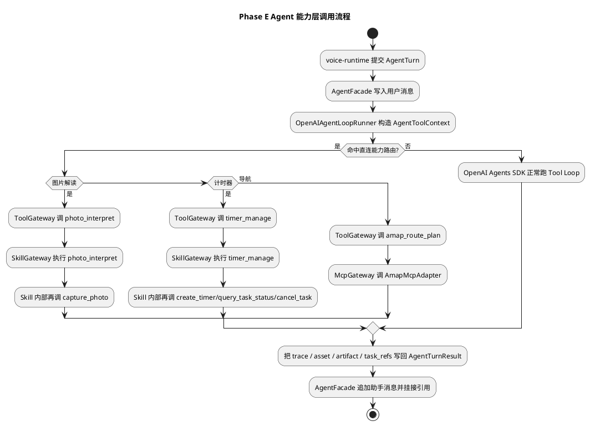
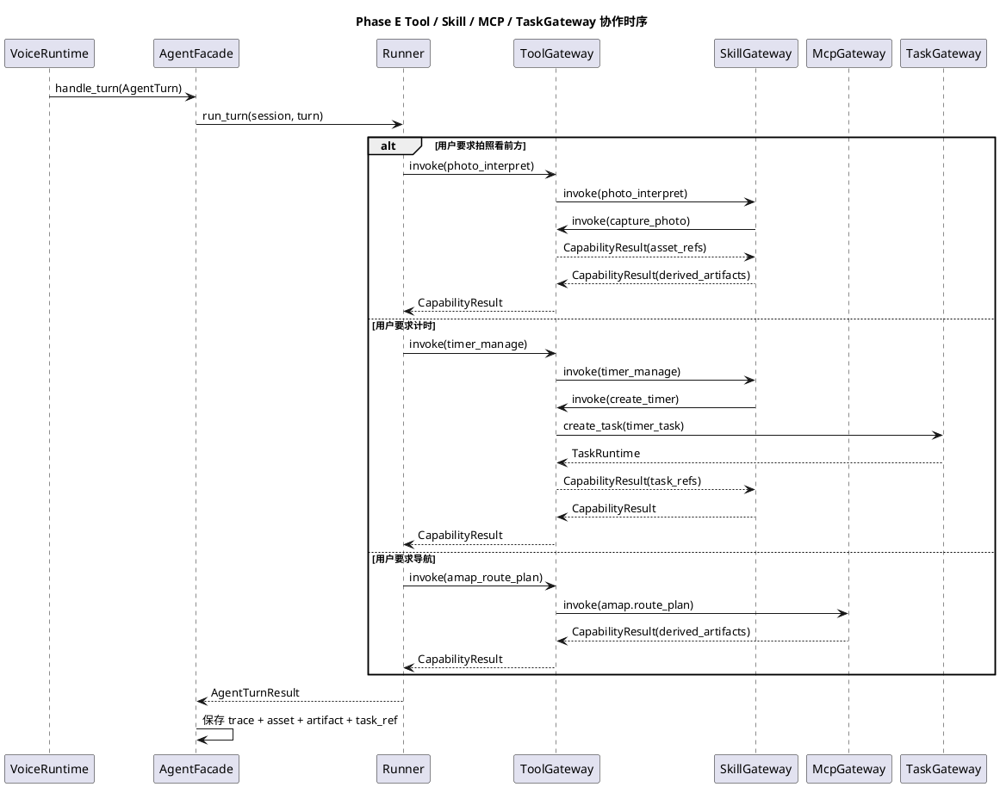

# Phase E 能力层骨架实施文档

## 1. 需求理解

本阶段目标对应 [第二阶段第4-8项开发落地计划.md](/Users/elio/dev/llm-project/OpenAIglassesDemo_2/doc/plan/第二阶段第4-8项开发落地计划.md) 的 Phase E，核心是把 Phase D 已完成的最小 `agent-core` 运行时升级为可承载 Tool / Skill / MCP 的统一能力层。

本阶段必须交付：

1. 建立统一 `ToolRegistry / ToolGateway`，并落地首批 Tool：
   - `query_device_state`
   - `capture_photo`
   - `create_timer`
   - `query_task_status`
   - `cancel_task`
2. 建立最小 `SkillRegistry / SkillGateway`，并落地首批 Skill：
   - `photo_interpret`
   - `timer_manage`
3. 建立最小 `McpRegistry / McpGateway` 与 `AmapMcpAdapter`，并打通：
   - `amap.poi_search`
   - `amap.geocode`
   - `amap.route_plan`
4. 让 `AgentFacade / OpenAIAgentLoopRunner` 能承接能力层产出的资产、派生结果与任务引用。
5. 补齐自动化测试、联调说明与当前阶段主测试脚本。

## 2. 现状分析

Phase D 完成后，仓库已有以下基础：

1. `AgentFacade / AgentSessionStore / ContextAssembler / OpenAIAgentLoopRunner` 已经形成最小闭环。
2. `query_device_state` 已经以“单个 Tool”的方式跑通。
3. `voice-runtime -> agent-core -> voice-runtime` 的最小文本回复路径已完成。

但进入 Phase E 后，主要缺口如下：

1. `agent_core/tools/__init__.py`、`agent_core/skills/__init__.py`、`agent_core/mcp/__init__.py` 已预留导出面，但对应源码并未真正落地。
2. `ToolRegistry` 仍是 Phase D 的单工具注册器，无法承载统一 schema、统一网关与统一错误包装。
3. `backend_task_core` 仅保留导出和字节码缓存，缺少可维护的最小源代码实现。
4. Skill 与 MCP 还没有最小对象模型，也没有统一的 `skill.call/result/failed`、`mcp.call/result` 记录结构。
5. 能力调用产生的 `MediaAssetRef / DerivedArtifact / TaskRef` 还不会自动回写到会话上下文。

## 3. 实现方案描述

### 3.1 总体策略

本次实现遵循以下策略：

1. 保持“模型侧只感知统一 Tool 调用面”的总体架构不变。
2. Skill 与 MCP 在工程实现层仍保留独立注册表与网关，但最终通过 Tool 代理统一暴露给 Agent。
3. 所有能力调用都走统一 trace / error / result 契约，不允许 Function、Skill、MCP 各走一套。
4. `backend-task-core` 在 Phase E 仍只提供最小内存网关，不提前做 Phase F 的完整状态机和事件总线。
5. 自动化测试必须在没有 `openai-agents` 依赖的情况下也能运行本地能力层。

### 3.2 新增与补齐模块

本次新增或补齐：

1. `server/src/agent_core/models/capability_models.py`
2. `server/src/agent_core/tools/base.py`
3. `server/src/agent_core/tools/gateway.py`
4. `server/src/agent_core/tools/builtins/*.py`
5. `server/src/agent_core/skills/base.py`
6. `server/src/agent_core/skills/registry.py`
7. `server/src/agent_core/skills/gateway.py`
8. `server/src/agent_core/skills/builtins/*.py`
9. `server/src/agent_core/mcp/base.py`
10. `server/src/agent_core/mcp/registry.py`
11. `server/src/agent_core/mcp/gateway.py`
12. `server/src/agent_core/mcp/adapters/amap_adapter.py`
13. `server/src/backend_task_core/models.py`
14. `server/src/backend_task_core/gateway.py`

关键职责如下：

1. `CapabilityResult / ToolSpec / SkillSpec / McpMethodSpec`
   - 固定能力层输入输出契约
   - 统一承载 `asset_refs / derived_artifacts / task_refs`
2. `ToolGateway / SkillGateway / McpGateway`
   - 统一处理参数校验
   - 统一处理错误包装
   - 统一记录 `CapabilityTrace`
3. `ToolRegistry`
   - 统一注册 Function Tool
   - 把 Skill 与 MCP 代理为模型可见 Tool
4. `SkillRegistry`
   - 管理 `photo_interpret`、`timer_manage`
5. `McpRegistry`
   - 管理 `amap.*` 原子方法
6. `InMemoryTaskGateway`
   - 先承接 `create_timer / query_task_status / cancel_task`
   - 为 Phase F 切换真正的 `TaskManager` 保留接口边界

### 3.3 首批 Tool 落地

本次首批 Tool 具体如下：

1. `query_device_state`
   - 沿用 Phase D 的设备状态查询能力
2. `capture_photo`
   - 生成一张最小模拟图片
   - 写入 `voice_runs_root/<session_id>/image/capture`
   - 返回 `MediaAssetRef`
3. `create_timer`
   - 调用 `InMemoryTaskGateway.create_task`
   - 返回 `TaskRef`
4. `query_task_status`
   - 查询任务实例
   - 产出 `task_status_snapshot` 派生结果
5. `cancel_task`
   - 取消任务实例
   - 回写最新 `TaskRef`

### 3.4 Skill 落地

本次首批 Skill 如下：

1. `photo_interpret`
   - 内部先通过 `ToolGateway` 触发 `capture_photo`
   - 再生成最小模拟视觉描述
   - 回写 `image_interpretation` 派生结果
2. `timer_manage`
   - 内部根据输入自动路由到 `create_timer / query_task_status / cancel_task`
   - 产出对用户可直接播报的摘要

这里保持了“Skill 是业务型高级 Tool”的设计结论：模型侧仍只看到 `photo_interpret / timer_manage` 两个 Tool 名，内部编排细节留在 Skill 层。

### 3.5 MCP 与 AMap Adapter 落地

本次实现 `AmapMcpAdapter` 的 mock 版本，打通：

1. `amap.poi_search`
2. `amap.geocode`
3. `amap.route_plan`

当前策略：

1. Phase E 默认只启用 `mock_mode=True`
2. 对上层业务隐藏底层 provider 差异
3. 所有 AMap 结果都统一产出结构化字典与 `DerivedArtifact`

同时通过 `McpToolProxy` 把 `amap.route_plan` 这类 MCP 方法暴露成模型可见 Tool，例如：

1. `amap_route_plan`
2. `amap_poi_search`
3. `amap_geocode`

### 3.6 Agent 结果回写改造

本次同时改造：

1. `server/src/agent_core/facade/agent_facade.py`
2. `server/src/agent_core/runtime/runner.py`

关键变化：

1. `AgentFacade.build_default()` 现在默认装配：
   - `InMemoryTaskGateway`
   - `ToolRegistry`
   - `ToolGateway`
   - `OpenAIAgentLoopRunner`
2. `OpenAIAgentLoopRunner` 现在会把 `settings / session_store / task_gateway / skill_gateway / mcp_gateway` 注入 `AgentToolContext`
3. 能力调用过程中产出的 `asset_refs / derived_artifacts / task_refs` 会挂到 `AgentTurnResult.meta`
4. `AgentFacade._persist_result()` 会把这些引用写回当前会话，并挂到助手消息上

这一步是 Phase E 的关键，因为它让图片、任务和地图结果真正进入统一上下文，而不是停留在临时变量里。

### 3.7 测试脚本与历史脚本整理

按照 [功能开发文档要求.md](/Users/elio/dev/llm-project/OpenAIglassesDemo_2/doc/restriction/功能开发文档要求.md) 的联调脚本命名约束：

1. 当前阶段主测试脚本改为 `script/run_tests.sh`
2. 历史 Phase D 测试脚本归档到 `script/deprecated/run_phase_d_tests_phase_d.sh`

同时更新了 Phase D 文档中的引用路径，避免主流程文档继续引用已归档脚本。

## 4. 流程图（PlantUML）



## 5. 时序图（PlantUML）



## 6. 自动化测试方案

### 6.1 单元测试

更新 `server/test/unit/test_agent_core.py`，覆盖：

1. `ToolRegistry` 自动发现首批 Tool / Skill / MCP 能力
2. `query_device_state` 仍能记录 trace
3. `photo_interpret` 会组合 `capture_photo`
4. `timer_manage` 会组合任务 Tool
5. `amap_route_plan` 会生成 `mcp` 类型 trace
6. `OpenAIAgentLoopRunner` 的 SDK 委托与事件循环兼容性仍然成立

### 6.2 集成测试

新增 `server/test/integration/test_agent_phase_e_flow.py`，覆盖：

1. 单轮 `AgentTurn` 中串起：
   - `capture_photo`
   - `photo_interpret`
   - `amap_route_plan`
2. `CapabilityTrace` 会按顺序写回
3. 助手消息会挂接能力产出的资产和派生结果

### 6.3 执行命令

当前阶段推荐执行：

```bash
bash script/run_tests.sh
```

若只想验证 Phase E 相关能力层，可执行：

```bash
PYTHONPATH=server/src python -m unittest \
  server.test.unit.test_agent_core \
  server.test.integration.test_agent_phase_e_flow -v
```

## 7. 当前方案与架构设计的契合程度

契合度评估：`高`。

理由：

1. 严格遵守 [agent-core设计.md](/Users/elio/dev/llm-project/OpenAIglassesDemo_2/doc/structure-design/agent-core设计.md) 中“模型侧统一 Tool 调用面”的结论。
2. Skill 与 MCP 虽然内部保留独立 registry / gateway，但最终都通过 Tool 代理统一暴露。
3. `backend-task-core` 仍保持与 `agent-core` 平级，仅通过 `TaskGateway` 被调用，没有重新侵入主循环。
4. `MediaAssetRef / DerivedArtifact / TaskRef / CapabilityTrace` 全部进入统一上下文模型，没有出现旁路存储。

当前仍保留的限制：

1. `AmapMcpAdapter` 当前仍是 mock/stub 版本，真实环境接入留到 Phase H 或专门的 provider 接入阶段。
2. `capture_photo` 仍是模拟抓拍，只提供最小图片资产闭环，真实相机控制和图片上传留到 Phase G。
3. `InMemoryTaskGateway` 还不是完整 `backend-task-core`，Phase F 仍需补状态机、调度器、事件总线和通知桥。

## 8. 开发后测试结果

执行时间：2026-04-18。

已执行命令：

```bash
PYTHONPATH=server/src python -m unittest \
  server.test.unit.test_agent_core \
  server.test.integration.test_agent_phase_e_flow -v
```

结果汇总：

1. 共执行 15 个测试。
2. 通过 15 个。
3. 失败 0 个。

补充说明：

1. 额外尝试执行 `server.test.integration.test_voice_dialog_flow` 以验证 Phase D 语音主链路未回退。
2. 当前沙箱环境不允许绑定本地测试端口，执行时会在 `http.server` 绑定阶段报 `PermissionError: [Errno 1] Operation not permitted`。
3. 因此本次提交确认了能力层自动化测试通过，但未在当前沙箱里完成 socket 级语音联调复验。

## 9. 当前实现进展

当前状态：`Phase E 已完成`。

已完成：

1. `Tool / Skill / MCP` 三层骨架源码补齐。
2. 首批 Tool / Skill / MCP 与最小 `backend_task_core` 网关打通。
3. 能力调用结果可写回 `AgentSessionStore`。
4. Phase E 自动化测试与联调说明已补齐。
5. 当前阶段主测试脚本已切换为 `script/run_tests.sh`。

下一步建议：

1. 进入 Phase F，替换 `InMemoryTaskGateway` 为真正的 `TaskRegistry / TaskManager / TaskEventBus`。
2. 把 `timer_task` 从“内存 stub”升级为真实后台任务闭环。
