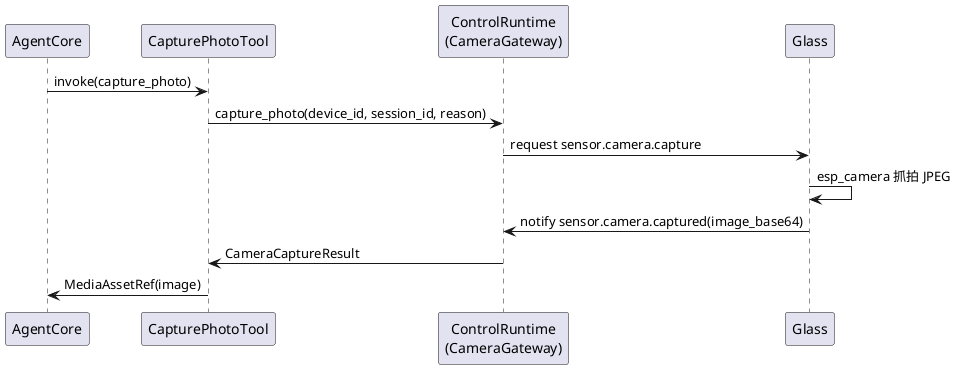
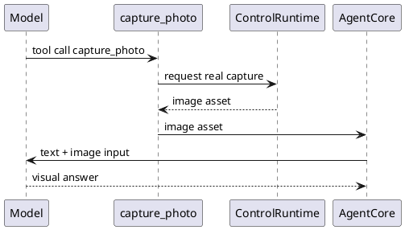

# PhaseG 真实抓拍图片实施文档

## 1. 需求理解

本次功能目标不是继续沿用本地 mock PNG，而是把 `capture_photo` 升级成真实设备抓拍链路，至少完成下面闭环：

1. 服务端可向指定眼镜设备下发 `sensor.camera.capture`。
2. 眼镜端真实调用摄像头抓拍一张 JPEG 图片。
3. 眼镜端把图片回传给服务端。
4. 服务端把图片落盘为 `MediaAssetRef`，供主链路模型使用 OpenAI SDK 原生图片输入继续解读。

## 2. 现状分析

开发前现状如下：

1. `capture_photo` 只会在服务端本地写入一张 1x1 mock PNG。
2. 主链路图片理解已经支持把图片作为 SDK 原生 image input 传给模型，但它依赖的图片仍是假图。
3. 协议设计和阶段计划中已经预留了 `sensor.camera.capture / sensor.camera.captured`。
4. 当前 `glass/src/main/glass_main.c` 只有控制面和语音链路，没有真实相机初始化与抓拍逻辑。
5. 仓库里的 `origin-project/compile/compile.ino` 已有一套可参考的 `esp_camera` 初始化和单张 JPEG 抓拍实现。

## 3. 实现方案描述

### 3.1 服务端方案

服务端新增 `camera_gateway` 抽象，并由 `ControlRuntime` 直接实现：

1. `AgentToolContext` 增加 `camera_gateway`。
2. `ToolRegistry` 增加 `bind_camera_gateway / get_camera_gateway`。
3. `AgentFacade` 支持在 `ControlRuntime` 就绪后补绑真实相机网关。
4. `capture_photo` 不再生成假图，而是调用 `camera_gateway.capture_photo(...)`。
5. `ControlRuntime` 维护待完成抓拍请求表，发送 `sensor.camera.capture` 后阻塞等待 `sensor.camera.captured`。
6. 模型配置分工调整为：
   - `AGENT_MODEL_NAME=qwen3.6-plus` 负责文本决策与图片理解
   - `VOICE_MODEL_NAME=qwen3.5-omni-plus` 继续负责 TTS

### 3.2 设备端方案

眼镜端在 `glass_main.c` 中补齐最小单次抓拍链路：

1. 引入 `esp_camera` 依赖和 XIAO ESP32S3 Sense 摄像头引脚配置。
2. 开机初始化摄像头；若失败则保留语音链路继续工作。
3. 收到 `sensor.camera.capture` 后创建一次性抓拍任务。
4. 抓拍任务使用 `esp_camera_fb_get()` 获取 JPEG 帧。
5. 把图片做 base64 编码后通过 `sensor.camera.captured` 回传。
6. 摄像头按“单次抓拍”模式配置为 `fb_count=1 + CAMERA_GRAB_WHEN_EMPTY`，避免空闲时持续产出帧导致 `cam_hal: FB-OVF`。

### 3.3 当前阶段的工程取舍

架构设计中更理想的做法是：

1. 控制面发 `sensor.camera.capture`
2. 图片字节走 `/ws/camera + MediaFrame`

本次先没有直接落完整 `/ws/camera`，而是采用“控制面消息 + base64 图片”做单次抓拍闭环，原因如下：

1. 用户当前目标是先升级成真实抓拍图片，而不是同时完成持续视频流改造。
2. 单张抓拍的业务频率较低，先用 base64 可以最短路径打通真实硬件。
3. 消息名、调用边界和 `camera_gateway` 抽象都已按架构预留，后续切换到 `MediaFrame` 时不需要重写 `agent-core`。

## 4. 流程图、时序图

### 4.1 服务端到眼镜端单次抓拍时序



### 4.2 主链路使用真实抓拍图片



## 5. 自动化测试方案

### 5.1 单元测试

1. `test_capture_photo_tool_uses_real_camera_gateway_result`
   - 目标：验证 `capture_photo` 会把相机网关返回的真实字节写成图片资产。
2. `test_openai_runner_can_emit_progress_before_capture_photo`
   - 目标：验证视觉主链路会在抓拍前先发出中间反馈。

### 5.2 功能测试

1. `test_camera_capture_round_trip_returns_real_image_bytes`
   - 目标：验证服务端 `sensor.camera.capture -> sensor.camera.captured` 控制链路。
2. `test_agent_turn_can_chain_tool_skill_and_mcp`
   - 目标：验证 Phase E 主链路在接入真实 `camera_gateway` 后仍可工作。

### 5.3 跨设备联调方案

联调建议按下面顺序执行：

1. 服务端启动
   - `LOG_LEVEL=DEBUG LOG_FILE=logs/server.log PYTHONPATH=server/src uv run python -m app.main --host 0.0.0.0 --port 8765`
2. 眼镜端重新编译烧录
   - 需确保 `glass/src/main/idf_component.yml` 已拉到最新，并拉取 `espressif/esp32-camera`
3. 设备注册成功后，直接说：
   - “看一下我前面有什么”
4. 检查结果：
   - 服务端日志中出现 `sensor.camera.capture`
   - 设备端串口日志中出现“开始执行单次抓拍”
   - `result.json` 中 `agent_session.assets` 出现真实图片资产

## 6. 当前方案与架构设计的契合程度

契合度评估：`中高`。

理由：

1. `agent-core` 没有直接侵入设备控制细节，而是通过新增 `camera_gateway` 保持分层。
2. `capture_photo` 仍然是统一 Tool，模型通过该工具拿到图片后，再由主链路模型继续完成图片理解。
3. 控制消息仍使用既定的 `sensor.camera.capture / sensor.camera.captured`，没有引入临时字符串协议。

当前与理想架构的偏差：

1. 图片字节暂未走 `MediaFrame` 二进制通道，而是先走 base64 文本回传。
2. 这个偏差只发生在设备适配层，没有改变 `agent-core / backend-task-core` 的职责边界。
3. 后续若进入持续视觉流阶段，应把单张图片回传也收敛到 `/ws/camera + MediaFrame`。

## 7. 开发后测试结果

执行时间：2026-04-18。

已执行命令：

```bash
PYTHONPATH=server/src uv run python -m unittest \
  server.test.unit.test_agent_core \
  server.test.integration.test_control_register_flow \
  server.test.integration.test_agent_phase_e_flow -v
```

结果汇总：

1. 共执行 25 个测试。
2. 全部通过。
3. 新增控制链路测试已验证服务端可等待设备回传真实图片字节。

## 8. 当前实现进展

当前已完成：

1. 服务端 `camera_gateway` 抽象与 `ControlRuntime` 真实抓拍等待链路。
2. `capture_photo` 从 mock 改为真实设备抓拍落盘。
3. 眼镜端 `esp_camera` 初始化、单次 JPEG 抓拍、`sensor.camera.captured` 回传。
4. 相机缓冲模式已调整为单次抓拍配置，降低帧缓冲溢出风险。

当前未完成：

1. 尚未升级到 `/ws/camera + MediaFrame` 二进制图片上传。
2. 尚未在真实硬件上完成本轮仓库内自动化编译验收，仍需按联调说明做跨设备验证。
