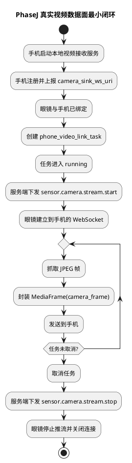
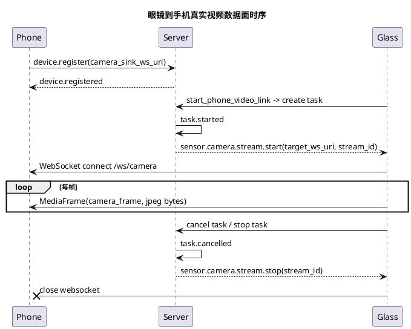

# PhaseJ 真实视频数据面实施文档

## 1. 需求理解

本次功能目标是在上一轮“直连视频任务最小闭环”的基础上，继续把第 10 项推进到真实数据面闭环，至少完成下面能力：

1. 手机端在本地启动最小视频接收服务。
2. 手机注册时把自己的视频接收地址上报给服务端。
3. 服务端在 `phone_video_link_task` 启动后，向眼镜下发 `sensor.camera.stream.start`。
4. 眼镜端真实抓取 JPEG 帧，并通过 WebSocket 二进制 `MediaFrame(camera_frame)` 持续发送到手机端。
5. 取消任务后，服务端向眼镜下发 `sensor.camera.stream.stop`，眼镜停止视频流。

本阶段必须交付：

1. `sensor.camera.stream.start / stop` 控制链路。
2. 眼镜端最小持续视频推流能力。
3. 手机端最小视频接收能力。
4. 自动化测试覆盖服务端控制编排与手机端接收端最小能力。

本阶段不要求：

1. 手机端实时图形界面优化。
2. 手机端视觉检测算法接入。
3. 点对点 NAT 穿透或复杂网络协商。
4. 生产级视频编码压缩与丢帧优化。

当前目标是先把“控制面 + 数据面”两条链路同时打通。

## 2. 现状分析

当前仓库在本次实现前已有如下基础：

1. 服务端已具备 `phone_video_link_task` 最小运行时。
2. 手机接入与设备绑定最小闭环已经完成。
3. 眼镜端已经具备：
   - `esp_camera` 初始化
   - 单次 `sensor.camera.capture`
   - `/ws_audio` WebSocket 二进制发送经验
4. 协议层已具备统一 `MediaFrame` 定义，可直接复用为 `camera_frame`。
5. 服务端 WebSocket 传输层目前只支持 `/ws/control` 和 `/ws_audio`。

主要缺口如下：

1. 手机端尚无本地 WebSocket 服务接收视频帧。
2. 手机注册时没有上报视频接收地址。
3. 服务端没有在视频任务启动/取消时向眼镜下发相机流开始/停止消息。
4. 眼镜端尚未实现持续视频流任务。
5. 服务端当前还没有独立的相机流路由或转发逻辑。

结论：

1. 当前最适合的最小方案是“服务端只协调，视频数据面直接从眼镜推到手机”。
2. 这样符合当前架构中“眼镜与手机直连，服务器只维护控制和状态”的原则。

## 3. 实现方案描述

### 3.1 总体策略

本次实现遵循以下策略：

1. 服务端继续只做控制面协调，不中转原始视频字节。
2. 手机端通过启动本地 WebSocket 接收端，向服务端登记 `camera_sink_ws_uri`。
3. 服务端收到 `phone_video_link_task.task.started` 后，下发 `sensor.camera.stream.start` 给眼镜。
4. 服务端收到 `phone_video_link_task.task.cancelled` 后，下发 `sensor.camera.stream.stop` 给眼镜。
5. 眼镜端单独维护一条相机流 WebSocket 客户端连接，不复用控制链路和音频链路。
6. 手机点击“完成”时，先请求服务端停流，再保持手机控制连接与绑定关系不变，便于再次开启视频。
7. 本地主流程优先采用局域网直连与独立配置文件，不再依赖远端服务器作为唯一调试入口。

### 3.2 手机端方案

手机端当前正式方案已切换为 iOS 原生应用 [GlassesVideoReceiver.xcodeproj](/Users/elio/dev/llm-project/OpenAIglassesDemo_2/phone/ios/GlassesVideoReceiver.xcodeproj)，原 [phone/src/main.py](/Users/elio/dev/llm-project/OpenAIglassesDemo_2/phone/src/main.py) 仅保留为桌面调试工具。

iOS 方案当前承担两部分能力：

1. 本地视频接收 WebSocket 服务
2. 控制面注册、心跳、自动绑定与状态展示

当前接收服务职责：

1. 接收 `MediaFrame(camera_frame)`
2. 支持分片 WebSocket 二进制消息重组
3. 解析头部字段并校验 `payload_size`
4. 将最近一帧 JPEG 实时刷新到页面
5. 展示最近事件、接收地址、帧序号、注册状态和绑定状态

当前首版仍不实现：

1. 多路视频并发
2. 正式视觉算法
3. 长时稳定性与性能优化

### 3.3 服务端方案

服务端主要改造如下：

1. `ControlRuntime` 在注册阶段保存设备额外能力信息，例如 `camera_sink_ws_uri`
2. `build_runtime_snapshot()` 增加设备能力摘要
3. 增加任务事件监听器，订阅 `phone_video_link_task`
4. 当事件为：
   - `task.started`
     - 向眼镜下发 `sensor.camera.stream.start`
   - `task.cancelled`
     - 向眼镜下发 `sensor.camera.stream.stop`

`sensor.camera.stream.start.payload` 首版建议字段：

```json
{
  "stream_id": "stream_cam_xxx",
  "target_ws_uri": "ws://<phone-host>:<port>/ws/camera",
  "frame_interval_ms": 500,
  "codec": "jpeg"
}
```

### 3.4 眼镜端方案

眼镜端新增最小持续视频流任务。

关键实现：

1. 新增相机流 WebSocket 客户端句柄
2. 处理 `sensor.camera.stream.start`
3. 处理 `sensor.camera.stream.stop`
4. 后台任务循环：
   - `esp_camera_fb_get()`
   - 组装 `MediaFrame(camera_frame)`
   - 通过 WebSocket 二进制发送
   - `esp_camera_fb_return()`
   - 按 `frame_interval_ms` 节流

首版约束：

1. 仅发送 JPEG 帧
2. 一次只允许一条视频流任务
3. 若相机正被单次抓拍任务占用，则视频流启动失败

### 3.5 任务与控制消息协作

首版协作关系如下：

1. `start_phone_video_link`
   - 创建 `phone_video_link_task`
2. `phone_video_link_task.task.started`
   - 服务端下发 `sensor.camera.stream.start`
3. 用户取消或上层取消任务
   - `task.cancelled`
   - 服务端下发 `sensor.camera.stream.stop`
4. `task.cancelled` 不再触发额外的 Agent/TTS 播报，避免手动结束视频时产生误导性语音。

当前不引入：

1. `peer_link.prepare / ready / failed`
2. 复杂的多阶段协商状态

原因：

1. 当前目标是最小真实数据面闭环，先避免控制面再次过度设计。

## 4. 流程图（PlantUML）



## 5. 时序图（PlantUML）



## 6. 自动化测试方案

### 6.1 单元测试

1. 测试目标：验证手机端 WebSocket 接收端可解析 `camera_frame`  
测试方法：构造一帧合法 `MediaFrame` 发给接收服务。  
预期结果：iOS 端成功解析图像并更新最近帧元信息。

2. 测试目标：验证服务端在 `phone_video_link_task.task.started` 时下发 `sensor.camera.stream.start`  
测试方法：构造任务事件并注入控制运行时。  
预期结果：眼镜设备收到控制消息，消息包含 `target_ws_uri` 与 `stream_id`。

3. 测试目标：验证服务端在任务取消时下发 `sensor.camera.stream.stop`  
测试方法：构造 `task.cancelled` 事件。  
预期结果：眼镜设备收到停止消息。

### 6.2 功能测试

1. 测试目标：验证手机注册时可登记 `camera_sink_ws_uri`  
测试方法：使用手机端主程序启动本地接收服务并完成注册。  
预期结果：服务端运行态中可看到该地址。

2. 测试目标：验证视频任务启动后，服务端会发出相机流开始指令  
测试方法：眼镜与手机完成绑定，调用 `start_phone_video_link`。  
预期结果：眼镜收到 `sensor.camera.stream.start`。

3. 测试目标：验证手机端可收到至少一帧真实 JPEG  
测试方法：真机联调启动任务。  
预期结果：iOS 页面持续显示最新 JPEG，帧序号持续增长。

## 7. 跨设备联调方案

联调建议顺序：

1. 启动服务端
2. 启动手机端本地接收服务并完成注册
3. 启动眼镜端并完成注册绑定
4. 创建视频直连任务
5. 观察手机端是否收到 JPEG 帧

联调观察点：

1. 服务端运行态中的 `camera_sink_ws_uri`
2. 眼镜端串口日志中的：
   - `收到 sensor.camera.stream.start`
   - `相机流 WebSocket 已连接`
   - `已发送 camera_frame`
3. 手机端页面中的：
   - 服务端状态
   - 当前绑定眼镜
   - 最近帧序号
   - 最近事件
4. 取消任务后，眼镜端是否打印停止推流日志，且手机是否仍保持已注册在线

## 8. 当前方案与架构设计的契合程度

契合度评估：高。

理由如下：

1. 控制面继续走 `ControlMessage`，数据面继续走 `MediaFrame`，与当前协议设计一致。
2. 服务端没有承担视频字节转发，只负责任务协调与状态维护，符合新架构。
3. 真实视频链路建立在已经存在的 `phone_video_link_task` 之上，没有绕开后台任务中心。

可改进点：

1. 当前仍是最小局域网直连方案，后续若进入复杂网络环境，需要补正式 `peer_link` 协商协议。
2. 当前手机端回显仍偏调试与联调工具属性，后续可以再升级成正式手机运行时页面。

## 9. 开发后测试结果

最近一次补充更新时间：2026-04-23。

已执行命令：

```bash
PYTHONPATH=server/src uv run --python 3.11 python -m unittest \
  server.test.integration.test_control_register_flow -v
```

```bash
PYTHONPATH=server/src uv run --python 3.11 python -m unittest \
  server.test.unit.test_backend_task_core \
  server.test.unit.test_agent_core -v
```

结果汇总：

1. `server.test.integration.test_control_register_flow` 共 15 个测试，全部通过。
2. `server.test.unit.test_backend_task_core + server.test.unit.test_agent_core` 共 25 个测试，全部通过。
3. `xcodebuild test -project phone/ios/GlassesVideoReceiver.xcodeproj -scheme GlassesVideoReceiver -destination 'platform=iOS Simulator,name=iPhone 17' -derivedDataPath phone/ios/build` 通过。
4. `bash script/run_glass.sh` 已完成眼镜端编译与刷机，最终监视步骤因当前终端不是 TTY 未执行。
5. 本次新增验证点已覆盖：
   - 手机注册并上报 `camera_sink_ws_uri`
   - 视频任务启动后服务端向眼镜下发 `sensor.camera.stream.start`
   - `start_phone_video_link` 能解析目标手机的视频接收地址
   - `phone_video_link_task` 可携带 `target_ws_uri / stream_id / frame_interval_ms`
   - iOS 端媒体帧解析与 WebSocket 分片重组
   - 点击“完成”后服务端停流接口保持幂等
   - 手机保持在线待命，支持结束后再次启动视频
   - 手机前台运行时注册失败自动重试

补充说明：

1. 眼镜端已在本地完成 ESP-IDF 编译和刷机，当前剩余工作主要是继续观察串口日志并做长时间稳定性验证。
2. 真机上已经验证了视频开始、停流和再次启动的主链路，但仍需要继续补充更长时长、更差网络条件下的回归测试。

## 10. 当前实现进展

当前已完成：

1. iOS 应用 [GlassesVideoReceiver.xcodeproj](/Users/elio/dev/llm-project/OpenAIglassesDemo_2/phone/ios/GlassesVideoReceiver.xcodeproj) 已承接手机端正式视频接收、注册、心跳与状态展示能力。
2. 手机注册时已可向服务端上报 `camera_sink_ws_uri`，并支持手机先启动或眼镜先启动两种自动绑定路径。
3. 服务端 [control_runtime.py](/Users/elio/dev/llm-project/OpenAIglassesDemo_2/server/src/api/ws/control_runtime.py) 已保存该地址，并在 `phone_video_link_task.task.started / task.cancelled` 时向眼镜下发：
   - `sensor.camera.stream.start`
   - `sensor.camera.stream.stop`
4. `start_phone_video_link` 已可从运行态快照中解析目标手机的视频接收地址，并把它写入任务输入。
5. 眼镜端 [glass_main.c](/Users/elio/dev/llm-project/OpenAIglassesDemo_2/glass/src/main/glass_main.c) 已补齐：
   - 相机流 WebSocket 客户端
   - `sensor.camera.stream.start / stop` 控制消息处理
   - 最小 `camera_stream_task`
   - `MediaFrame(camera_frame)` 发送逻辑
6. 手机端“完成”按钮已调整为“结束当前视频会话但保持手机在线与绑定”，支持后续再次开启视频。
7. 眼镜端控制连接重连逻辑已优化，不再在心跳线程里重复 `start()`，Wi‑Fi 逻辑已改为两个 Wi‑Fi 每轮各尝试一次，失败后等待 5 秒继续无限轮询。

当前未完成：

1. 尚未补充当前阶段专门的联调说明文档。
2. 尚未完成更长时长的视频流稳定性、弱网和频繁切网回归。
3. 手机端仍是最小验证与联调页面，尚未演进为完整手机本地任务中心。

当前判断：

1. 第 10 项“眼镜到手机真实视频数据面最小闭环”已经打通。
2. 当前主要剩余工作不再是链路是否存在，而是把它收口为稳定的本地主流程与后续视觉算法承载底座。
