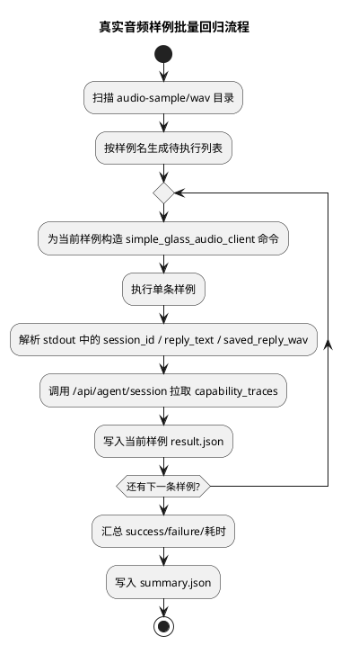
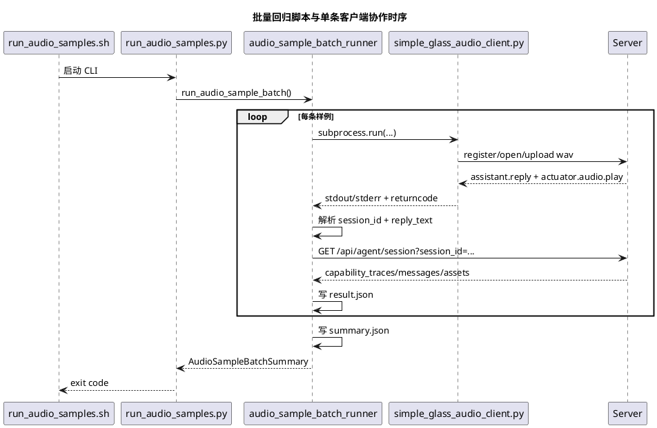

# 真实音频样例批量回归实施文档

## 1. 需求理解

当前仓库已经有真实音频样例目录 [audio-sample](/Users/elio/dev/llm-project/OpenAIglassesDemo_2/server/test/data/audio-sample)，其中包含多条 `m4a` 与已转换好的 `wav`。现阶段需要补一套可复用的批量测试脚本和对应文档，用于把这批真实音频样例逐条送入当前服务端，观察真实语音对话与 `agent-core` 能力层的回归情况。

本次交付目标：

1. 新增可批量执行真实音频样例的测试脚本。
2. 支持筛选单条或多条样例执行，而不是只支持手写单次命令。
3. 为每条样例落盘结构化结果，至少包含：
   - 样例名
   - 输入 wav 路径
   - 执行是否成功
   - 客户端 stdout/stderr
   - 回复文本
   - 回复 wav 路径
   - 会话 `session_id`
   - 本轮 `agent_session` 调试快照
4. 为整批执行落盘汇总结果。
5. 补齐自动化测试与使用说明文档。

## 2. 现状分析

仓库在本次实现前已有基础如下：

1. [simple_glass_audio_client.py](/Users/elio/dev/llm-project/OpenAIglassesDemo_2/script/simple_glass_audio_client.py) 已能把单条 `16kHz/mono/16bit wav` 样例发送到服务端，并下载回复音频。
2. 历史单条样例脚本已归档为 [run_sample_audio_phase_c.sh](/Users/elio/dev/llm-project/OpenAIglassesDemo_2/script/deprecated/run_sample_audio_phase_c.sh)。
3. [audio-sample](/Users/elio/dev/llm-project/OpenAIglassesDemo_2/server/test/data/audio-sample) 目录已维护多条真实语音样例：
   - `你是谁呀`
   - `给我讲个笑话吧`
   - `帮我设置一个三分钟的计时器`
   - `看一下我前面有什么`
   - `桂平路270号 6`
   - 等

当前缺口：

1. 没有批量脚本，执行多条样例只能人工重复敲命令。
2. 没有统一结果落盘结构，回归比对成本高。
3. 没有针对批量回归工具本身的自动化测试。
4. 现有联调说明主要围绕 Phase C/Phase D 主链路，没有专门说明真实样例批量回归的使用方式。

## 3. 实现方案描述

### 3.1 总体策略

本次实现遵循以下策略：

1. 不重复发明眼镜侧协议客户端，直接复用现有 [simple_glass_audio_client.py](/Users/elio/dev/llm-project/OpenAIglassesDemo_2/script/simple_glass_audio_client.py)。
2. 新增一个“批量编排器”负责：
   - 发现样例
   - 逐条调用单条客户端
   - 解析 stdout
   - 拉取服务端会话调试快照
   - 落盘单条结果与批量汇总
3. 把核心逻辑放进 `server/src/devtools`，方便复用和单元测试。
4. CLI 只做薄封装，便于命令行直接使用。
5. 联调场景下允许通过 `LOG_FILE` 同步落盘服务端结构化日志，方便与 `result.json` 对照排查。

### 3.2 新增模块

本次新增：

1. [audio_sample_batch_runner.py](/Users/elio/dev/llm-project/OpenAIglassesDemo_2/server/src/devtools/audio_sample_batch_runner.py)
2. [run_audio_samples.py](/Users/elio/dev/llm-project/OpenAIglassesDemo_2/script/run_audio_samples.py)
3. [run_audio_samples.sh](/Users/elio/dev/llm-project/OpenAIglassesDemo_2/script/run_audio_samples.sh)
4. [test_audio_sample_batch_runner.py](/Users/elio/dev/llm-project/OpenAIglassesDemo_2/server/test/unit/test_audio_sample_batch_runner.py)

关键职责如下：

1. `audio_sample_batch_runner.py`
   - 发现 `wav` 样例
   - 构造单条执行命令
   - 解析客户端输出中的 `voice_session_open / reply_text / saved_reply_wav`
   - 调用 `/api/agent/session` 拉取本轮会话快照
   - 写入 `result.json` 与 `summary.json`
2. `run_audio_samples.py`
   - 提供 Python CLI 入口
3. `run_audio_samples.sh`
   - 提供当前阶段主脚本入口
4. `test_audio_sample_batch_runner.py`
   - 验证样例发现、stdout 解析、命令构造和结果落盘

### 3.3 结果目录结构

批量回归默认输出到：

`runs/audio-sample-regression`

其中每条样例会落盘到：

```text
runs/audio-sample-regression/
  summary.json
  你是谁呀/
    reply.wav
    result.json
  给我讲个笑话吧/
    reply.wav
    result.json
  帮我设置一个三分钟的计时器/
    reply.wav
    result.json
```

单条 `result.json` 至少包含：

1. `sample_name`
2. `wav_path`
3. `ok`
4. `returncode`
5. `reply_text`
6. `reply_wav_path`
7. `session_id`
8. `agent_session`
9. `stdout`
10. `stderr`
11. `started_at_ms / finished_at_ms / duration_ms`

其中 `agent_session` 当前来自服务端调试接口 `/api/agent/session?session_id=...`，包含：

1. `messages`
2. `assets`
3. `artifacts`
4. `tasks`
5. `capability_traces`
6. `model_request`

其中 `messages` 会保留完整消息文本，并在首条补入当前运行配置中的 `system_prompt`，便于把模型看到的完整上下文直接落盘到 `result.json`。

其中 `model_request` 表示 agent-core 在调用模型前最终拼装出的请求视图，当前至少包含 `model / instructions / messages`，用于和 SDK DEBUG 日志中的 `json_data.messages` 对照排查。

服务端若设置 `LOG_FILE`，则 `tool.call/result`、`mcp.call/result` 这些 DEBUG 结构化日志也会同步落到日志文件中，便于和单条 `result.json` 做双向比对。

### 3.4 命令行参数

当前支持以下关键参数：

1. `--host / --port`
2. `--device-id / --pair-token`
3. `--samples-dir`
4. `--output-root`
5. `--sample`
6. `--timeout-seconds`
7. `--chunk-interval-ms`
8. `--fail-fast`

其中：

1. 不传 `--sample` 时默认执行目录下全部 `wav`
2. 可重复传 `--sample` 只跑指定样例
3. `--fail-fast` 用于发现第一条失败后立即停止

## 4. 流程图（PlantUML）



## 5. 时序图（PlantUML）



## 6. 自动化测试方案

### 6.1 单元测试

新增 [test_audio_sample_batch_runner.py](/Users/elio/dev/llm-project/OpenAIglassesDemo_2/server/test/unit/test_audio_sample_batch_runner.py)，覆盖：

1. 样例发现是否只扫描 `wav` 并按名称排序。
2. `voice_session_open / reply_text / saved_reply_wav` 是否能从客户端 stdout 中稳定解析。
3. 单条客户端命令是否包含必要参数。
4. 批量执行是否会写入每条 `result.json` 和整体 `summary.json`。
5. `result.json` 是否包含 `agent_session.capability_traces`。

### 6.2 功能测试

功能级验证建议直接使用真实服务端联调环境执行：

```bash
bash script/run_audio_samples.sh
```

或指定单条样例：

```bash
bash script/run_audio_samples.sh --sample "你是谁呀"
```

### 6.3 执行命令

自动化测试推荐执行：

```bash
PYTHONPATH=server/src python -m unittest \
  server.test.unit.test_audio_sample_batch_runner \
  server.test.unit.test_logging \
  server.test.unit.test_settings -v
```

## 7. 当前方案与架构设计的契合程度

契合度评估：`高`。

理由：

1. 该脚本只是联调与回归工具，不改变 `server-api / voice-runtime / agent-core / backend-task-core` 任何架构边界。
2. 批量回归器复用现有单条眼镜侧客户端，不绕过正式协议。
3. 结果落盘以观察和回归为目的，不引入新的业务运行时依赖。

当前限制：

1. 该工具依赖外部服务端可访问，当前不会自行拉起服务端。
2. 批量结果当前依赖服务端调试接口 `/api/agent/session`，若会话尚未完成落盘，可能拿不到快照。
3. 若服务端切到了新的设备 ID 或 pair token，需要同步修改命令参数。

## 8. 开发后测试结果

执行时间：2026-04-18。

已执行命令：

```bash
PYTHONPATH=server/src python -m unittest \
  server.test.unit.test_audio_sample_batch_runner \
  server.test.unit.test_logging \
  server.test.unit.test_settings -v
```

结果预期：

1. 样例发现测试通过
2. stdout 解析测试通过
3. 命令构造测试通过
4. 结果落盘测试通过
5. 日志文件输出测试通过
6. `LOG_FILE` 配置读取测试通过

补充说明：

1. 当前沙箱环境不适合直接连真实服务端做 socket 级回归，因此本次只验证了批量回归工具本身。
2. 真正的真实音频样例执行，需要在可访问目标服务端的环境中运行脚本。

## 9. 当前实现进展

当前状态：`批量回归脚本与文档已完成`。

已完成：

1. 批量脚本 CLI
2. 结果落盘结构
3. 单元测试
4. 使用文档
5. 服务端日志文件输出能力

待执行：

1. 在真实联调环境中运行整批 `audio-sample/wav`
2. 基于 `summary.json` 记录当前样例通过率与异常样例
