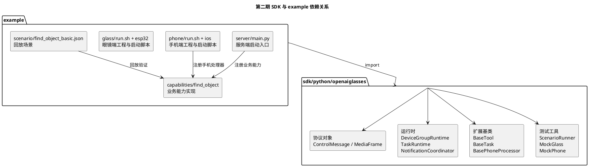
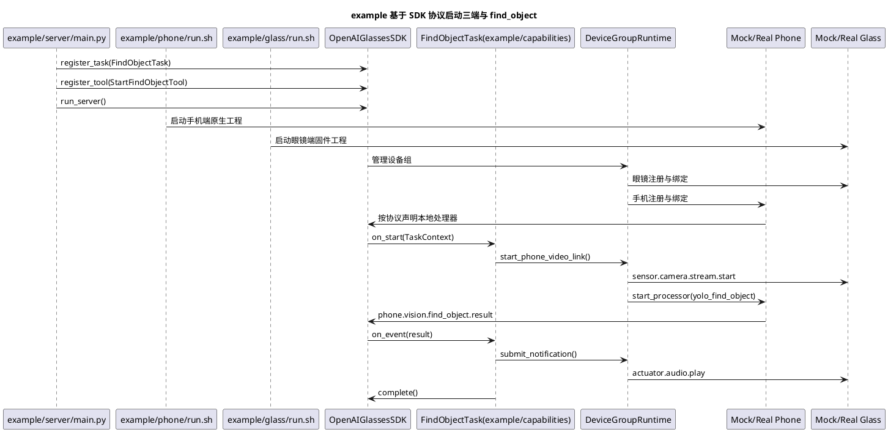

# 第二期 SDK 核心运行时与开发者扩展面产品化开发计划

## 1. 需求理解

第二期目标不是继续增加某一个具体业务功能，而是把当前已经完成的设备注册、设备绑定、语音运行时、任务运行时、手机视频链路和 `find_object` 最小闭环，收敛成面向开源开发者可使用的 SDK 形态。

第二期必须完成：

1. 明确 SDK 框架代码与业务样例代码的目录边界。
2. 固化 `DeviceGroupRuntime`，承接设备组、设备绑定、组内路由和能力查询。
3. 固化 `DeviceGroupContext`，作为 Tool、Task 和后续 PhoneProcessor 的统一开发者上下文。
4. 收敛服务器侧扩展面，形成稳定的 `BaseTool / BaseTask / TaskContext`。
5. 定义手机侧扩展面最小骨架，形成 `BasePhoneProcessor / BasePhoneTask / BaseSensorProvider`。
6. 将 `find_object_task` 迁移为 SDK 官方样例能力，而不是继续作为框架内部特殊逻辑。
7. 建立最小样例回放测试结构，支持后续开发者不依赖真机完成能力自测。

第二期暂不完成：

1. 完整导航业务实现。
2. 完整 Android / iOS 原生 SDK 发布形态。
3. 手机侧真实模型热更新、模型下载和多模型管理。
4. 完整插件市场、能力包发布和版本兼容机制。
5. 生产级鉴权、租户隔离和远程 OTA。

## 2. 现状分析

当前仓库已经具备以下基础：

1. `server/src/agent_core` 中已经有 `BaseTool` 和工具注册表。
2. `server/src/backend_task_core` 中已经有 `TaskSpec / TaskRuntime / TaskEvent / TaskGateway`。
3. `server/src/api/ws/control_runtime.py` 中已经支持眼镜和手机注册、绑定、运行态查询、视频链路启动和停止。
4. `server/src/runtime/voice_runtime.py` 已经承担语音会话、模型调用、回复播报和通知播放。
5. `phone/ios` 已经有手机视频接收和找物体最小闭环。
6. `PhaseK` 已经证明 `find_object_task` 可以作为首个三端视觉样板能力。

当前主要缺口：

1. 设备组逻辑仍散在 `ControlRuntime` 中，没有独立的 `DeviceGroupRuntime`。
2. Tool 仍通过 `AgentToolContext.device_state_reader()` 读取运行态快照，开发者可能接触到底层绑定表。
3. 当前 `AgentToolContext` 更像系统内部上下文，不是面向 SDK 开发者的高层 `DeviceGroupContext`。
4. `BaseTask` 还没有作为开发者可继承的稳定抽象。
5. 手机侧扩展面还没有产品化，当前手机代码仍偏具体 App 实现。
6. 当前业务能力和 SDK 框架边界不够清楚，后续若继续把能力写进 `server/src`，会导致 SDK 难以开源复用。

结论：

1. 第二期最重要的不是补更多业务功能，而是完成 SDK 框架层和业务扩展层的隔离。
2. `find_object_task` 应从“项目内置能力”调整为唯一官方 `example` 中的业务实现，用于反向验证 SDK 是否足够高层。
3. 只有当 `example` 中的业务代码不再处理设备绑定、WebSocket、媒体链路和任务回流，SDK 形态才算初步成立。

## 3. 第二期阶段划分

第二期可以按四个阶段推进。每个阶段都应该有独立验收结果，避免把 SDK 产品化改造成一次高风险大重构。

### 3.0 当前阶段判断（2026-04-24）

结合当前仓库实现、样例目录和自动化测试结果，当前开发阶段可以判断为：

| 阶段 | 当前状态 | 说明 |
| --- | --- | --- |
| Phase A：目录边界与 SDK 包骨架 | 已完成 | `sdk/python/openaiglasses` 包骨架、`example/` 官方案例目录、`example/server/main.py` 启动入口均已落地，依赖方向保持为 `example -> sdk`。 |
| Phase B：DeviceGroupRuntime 与 DeviceGroupContext | 已完成 | `DeviceGroupRuntime` 与 `DeviceGroupContext` 已实现，抓拍、查询设备、启动手机视频链路、通知提交、任务创建等高层接口已经具备。 |
| Phase C：服务器侧与手机侧扩展面 | 基本完成 | `BaseTool / BaseTask / TaskContext`、`BasePhoneProcessor / BasePhoneTask / BaseSensorProvider`、能力注册表、`OpenAIGlassesSDK` 主入口、真实服务端装配能力均已完成，当前主要是文档和边界继续收口。 |
| Phase D：find_object 官方 example 与回放测试最小闭环 | 已完成最小闭环 | `example/capabilities/find_object` 的服务端 Tool/Task、手机端 Processor/PhoneTask 已落地，`ScenarioRunner` 与相关单元测试已可以验证最小闭环，但回放资产与场景丰富度仍需扩展。 |

当前整体判断：

1. 第二期已经从“方案设计阶段”进入“收口与产品化补完阶段”。
2. 当前工作重点不再是证明 SDK 是否可行，而是继续把已实现的能力整理成更稳定的开发者使用面。
3. 从阶段位置上看，当前已处于第二期后半段，接近 Phase D 完成后的收尾阶段，可以开始为下一期复杂能力样板做准备。

### 3.0.1 收口验证状态（2026-04-25）

当前已经完成一次 SDK 联调前预检收口：

```bash
uv run python script/run_sdk_preflight.py --report logs/sdk-preflight-current.json
```

预检结果：

1. `compileall` 通过。
2. 官方三端入口检查通过。
3. `testdata/scenario` 下 4 个场景回放全部通过。
4. 第二期核心 pytest 通过。
5. 服务端 `/api/health` 健康检查通过。

本轮修复了运行态快照中 `diagnostics` 字段不可达的问题，使音频旁路设备诊断可以稳定出现在 `/api/runtime/devices` 响应中。当前第二期已经具备进入官方 `find_object` 真机联调验收的条件。

### 3.1 第二期 Phase A：目录边界与 SDK 包骨架

目标：

1. 建立 `sdk/python/openaiglasses` 包骨架。
2. 建立唯一官方 `example` 目录。
3. 在 `example` 中同时放置三端可运行入口和业务能力实现。
4. 明确 SDK 与 `example` 的依赖方向。
5. 保留现有 `server/phone/glass` 目录可运行。

验收标准：

1. `example` 中的业务代码可以通过 import 使用 SDK。
2. `example` 中的服务端可以通过 Python SDK 启动对应运行时。
3. `example` 中的手机端和眼镜端可以通过脚本或对应平台开发工具启动，并接入 SDK 定义的协议与设备组运行时。
4. SDK 包不反向 import `example`。
5. 现有自动化测试不因目录调整失效。

### 3.2 第二期 Phase B：DeviceGroupRuntime 与 DeviceGroupContext

目标：

1. 从现有 `ControlRuntime` 中抽出设备组运行时职责。
2. 固化 `DeviceGroupRuntime`。
3. 固化 `DeviceGroupContext`。
4. 让 Tool / Task 通过 `DeviceGroupContext` 使用设备组能力。

验收标准：

1. Tool 不再直接解析 `glass_to_phone` 绑定表。
2. Tool 不再直接读取底层 WebSocket 连接对象。
3. `DeviceGroupContext` 可以完成抓拍、查询设备、启动手机视频链路和提交通知。

### 3.3 第二期 Phase C：服务器侧与手机侧扩展面

目标：

1. 稳定 `BaseTool / BaseTask / TaskContext`。
2. 定义 `BasePhoneProcessor / BasePhoneTask / BaseSensorProvider`。
3. 增加能力注册表和 SDK 主入口。
4. 让外部业务能力以注册方式进入运行时。

验收标准：

1. 开发者可以实现并注册一个自定义 `BaseTask`。
2. 开发者可以实现并注册一个自定义 `BasePhoneProcessor`。
3. 注册能力后，运行时可以查询并调度该能力。

### 3.4 第二期 Phase D：find_object 官方 example 与回放测试最小闭环

目标：

1. 将当前 `find_object_task` 迁移为 `example/capabilities/find_object`。
2. 建立 `MockGlassRuntime / MockPhoneRuntime` 最小版本。
3. 建立 `ScenarioRunner` 最小版本。
4. 用样例回放验证唯一官方 `example` 可以完成三端闭环。

验收标准：

1. `example` 中的 `find_object` 业务实现不直接处理设备绑定、WebSocket 和媒体协议。
2. Mock 场景可以驱动任务进入 `completed`。
3. 真机联调入口仍可使用同一个 `example` 能力。

## 4. 目录结构设计

### 4.1 总体原则

项目目录应区分两类代码：

1. SDK 框架代码：面向开源社区复用，提供运行时、协议、上下文和扩展基类。
2. `example` 案例代码：模拟外部开发者项目，包含实际业务能力实现，也包含服务端、手机端、眼镜端三个可运行入口。服务端通过 import 使用 Python SDK，手机端和眼镜端使用各自平台代码接入 SDK 协议。

开发者新增业务能力时，不应该修改 SDK 框架代码，而应该参考 `example/` 的结构，在自己的项目中实现 `BaseTool / BaseTask / BasePhoneProcessor` 子类。

### 4.2 推荐目录结构

建议后续逐步调整为：

```text
.
├── sdk/
│   ├── python/
│   │   └── openaiglasses/
│   │       ├── __init__.py
│   │       ├── protocol/
│   │       ├── runtime/
│   │       │   ├── device_group.py
│   │       │   ├── notifications.py
│   │       │   ├── tasks.py
│   │       │   └── voice.py
│   │       ├── capabilities/
│   │       │   ├── base_tool.py
│   │       │   ├── base_task.py
│   │       │   └── registry.py
│   │       ├── phone/
│   │       │   ├── base_processor.py
│   │       │   ├── base_phone_task.py
│   │       │   └── sensor_provider.py
│   │       └── testing/
│   │           ├── scenario_runner.py
│   │           ├── mock_glass.py
│   │           └── mock_phone.py
│   ├── phone/
│   │   └── README.md
│   └── glass/
│       └── README.md
├── example/
│   ├── README.md
│   ├── config/
│   ├── server/
│   │   └── main.py
│   ├── phone/
│   │   ├── README.md
│   │   ├── run.sh
│   │   └── ios/
│   ├── glass/
│   │   ├── README.md
│   │   ├── run.sh
│   │   └── esp32/
│   ├── capabilities/
│   │   └── find_object/
│   │       ├── server/
│   │       │   ├── task.py
│   │       │   └── tool.py
│   │       └── phone/
│   │           └── processor.py
│   └── scenario/
│       └── find_object_basic.json
├── testdata/
│   ├── audio/
│   ├── image/
│   ├── video/
│   ├── sensor/
│   ├── map/
│   └── scenario/
├── server/
├── phone/
└── glass/
```

### 4.3 目录迁移策略

为了降低改造风险，不要求一次性把现有 `server/phone/glass` 全部迁移到新目录。

建议采用三步迁移：

1. 第一阶段：先新增 `sdk/python/openaiglasses` 和 `example`，保留旧目录可运行。
2. 第二阶段：把框架稳定抽象从 `server/src` 复制或迁移到 `sdk/python/openaiglasses`，旧代码通过兼容导入继续工作。
3. 第三阶段：把 `example/server`、`example/phone`、`example/glass` 作为本仓库官方可运行案例，SDK 框架代码只保留在 `sdk/` 下。

第二期只要求完成第一阶段和关键抽象迁移，不要求完全删除旧路径。

### 4.4 SDK 与 example 的依赖方向

依赖方向必须固定为：

```text
example -> sdk
sdk -> 不依赖 example
```

禁止出现：

```text
sdk -> example
```

原因：

1. SDK 必须可以独立发布。
2. `example` 只是 SDK 使用案例，不应成为框架运行时依赖。
3. `example` 同时提供三端启动入口和业务能力实现，用于模拟真实开发者项目如何集成 SDK。

### 4.5 手机端与眼镜端代码放置原则

手机端和眼镜端不是 Python SDK 的一部分，也不要求改写成 Python 代码。

建议放置方式：

1. `example/phone/ios`：放 iOS 原生工程，例如当前 `phone/ios` 中的手机端实现。
2. `example/phone/run.sh`：放手机端示例启动脚本，可调用 `xcodebuild`、XcodeBuildMCP 或其他平台工具。
3. `example/glass/esp32`：放 ESP32 / ESP-IDF / Arduino 工程，例如当前 `glass/src` 中的眼镜端实现。
4. `example/glass/run.sh`：放眼镜端示例构建、烧录或串口启动脚本，可调用 `idf.py`、Arduino CLI 或其他端侧工具。
5. `example/server/main.py`：放服务端 Python 示例入口，通过 Python SDK 装配运行时和业务能力。

职责边界：

1. `sdk/python/openaiglasses` 提供服务端 SDK、协议对象、运行时抽象、测试工具和跨端契约。
2. `example/phone` 提供手机侧实际工程代码，负责接入 SDK 协议、注册手机设备、运行本地处理器、接收媒体流。
3. `example/glass` 提供眼镜侧实际工程代码，负责接入 SDK 协议、采集传感器、推送媒体帧、执行音频和震动反馈。
4. SDK 不直接 import 手机或眼镜工程代码，手机和眼镜工程也不需要 import Python SDK。
5. 三端共享的是协议、配置和设备组模型，而不是同一种编程语言。

## 5. 核心抽象设计

### 5.1 `DeviceGroupRuntime`

`DeviceGroupRuntime` 是第二期最关键的系统模块。

主要职责：

1. 管理 `DeviceGroup` 的创建、查询和销毁。
2. 维护 `glass / phone / server` 三类设备角色。
3. 维护眼镜与手机绑定关系。
4. 提供组内控制消息路由。
5. 提供设备能力查询。
6. 提供媒体链路创建、停止和状态查询入口。
7. 向上层生成 `DeviceGroupContext`。

当前 `ControlRuntime` 中与设备组相关的逻辑，后续应逐步迁移到该模块。

### 5.2 `DeviceGroupContext`

`DeviceGroupContext` 是开发者写 Tool 和 Task 时最重要的上下文对象。

建议首版包含：

1. `group_id`
2. `session_id`
3. `task_id`
4. `require_glass()`
5. `require_phone()`
6. `query_devices()`
7. `capture_photo()`
8. `start_phone_video_link()`
9. `stop_phone_video_link()`
10. `submit_notification()`
11. `emit_task_event()`
12. `create_task()`

开发者不应直接接触：

1. WebSocket 连接对象。
2. 原始设备连接表。
3. `glass_to_phone` 字典。
4. 原始控制消息发送函数。
5. 媒体帧编码和解码细节。

### 5.3 `BaseTool`

`BaseTool` 作为短时能力抽象。

开发者只需要关心：

1. 输入参数模型。
2. 业务逻辑。
3. 结构化返回结果。

示例：

```python
from openaiglasses import BaseTool, CapabilityResult, DeviceGroupContext


class DescribeCurrentSceneTool(BaseTool):
    """描述当前画面的工具。

    主要功能：
    1. 调用 SDK 抓拍当前眼镜画面。
    2. 把图片交给业务模型进行描述。
    3. 返回可被智能体使用的结构化结果。

    主要方法：
    1. run：执行当前画面描述能力。
    """

    name = "describe_current_scene"

    def run(self, context: DeviceGroupContext, input_data: dict) -> CapabilityResult:
        """执行当前画面描述。

        功能：
        1. 通过上下文抓拍当前画面。
        2. 调用业务侧视觉理解逻辑。
        3. 返回自然语言摘要和图片引用。

        参数：
        1. context：SDK 提供的设备组上下文。
        2. input_data：模型或调用方传入的业务参数。

        返回值：
        1. CapabilityResult：结构化能力执行结果。

        异常情况：
        1. 如果当前设备组没有在线眼镜，由 SDK 抛出设备不可用错误。
        """

        photo = context.capture_photo(reason="describe_current_scene")
        summary = describe_image(photo)
        return CapabilityResult.success(summary=summary, asset_refs=[photo])
```

这段 example 不应出现设备绑定、WebSocket、HTTP 路由或控制消息拼装。

### 5.4 `BaseTask`

`BaseTask` 作为长生命周期任务抽象。

开发者只需要关心：

1. 任务输入。
2. 启动逻辑。
3. 外部事件如何推进任务。
4. 任务完成或取消条件。

首版建议接口：

```python
from openaiglasses import BaseTask, TaskContext, TaskEvent


class FindObjectTask(BaseTask):
    """寻找物体任务。

    主要功能：
    1. 启动眼镜到手机的视频链路。
    2. 请求手机侧处理器寻找目标物体。
    3. 根据手机回传结果推进任务状态。

    主要方法：
    1. on_start：任务启动时调用。
    2. on_event：收到外部事件时调用。
    3. on_cancel：任务取消时调用。
    """

    task_type = "find_object_task"

    def on_start(self, context: TaskContext) -> None:
        """启动寻找物体任务。

        功能：
        1. 从任务输入中读取目标物体。
        2. 通过 SDK 启动手机视频链路。
        3. 请求手机侧处理器开始检测。

        参数：
        1. context：SDK 提供的任务上下文。

        返回值：
        1. 无。

        异常情况：
        1. 如果没有绑定手机，由 SDK 抛出设备组不完整错误。
        """

        target = context.input["target_object"]
        context.device_group.start_phone_video_link(reason="find_object")
        context.phone.start_processor("yolo_find_object", {"target_object": target})
        context.emit_state("running", {"target_object": target})

    def on_event(self, context: TaskContext, event: TaskEvent) -> None:
        """处理手机侧检测事件。

        功能：
        1. 接收手机侧处理器输出的结构化检测结果。
        2. 未找到目标时更新任务上下文。
        3. 找到目标时提交通知并完成任务。

        参数：
        1. context：SDK 提供的任务上下文。
        2. event：手机侧或系统侧产生的任务事件。

        返回值：
        1. 无。

        异常情况：
        1. 如果事件格式非法，SDK 应记录错误并拒绝推进任务状态。
        """

        if event.name != "phone.vision.find_object.result":
            return
        context.update({"last_detection": event.payload})
        if event.payload.get("found"):
            context.device_group.submit_notification(
                text=event.payload.get("summary", "找到目标了"),
                priority="high",
            )
            context.complete(result=event.payload)
```

### 5.5 手机侧扩展面

第二期先定义手机侧接口，不要求完全发布原生 SDK。

首版需要包含：

1. `BasePhoneProcessor`
2. `BasePhoneTask`
3. `BaseSensorProvider`
4. `PhoneProcessorContext`
5. `PhoneTaskContext`

示例：

```python
from openaiglasses.phone import BasePhoneProcessor, PhoneProcessorContext


class YoloFindObjectProcessor(BasePhoneProcessor):
    """手机侧寻找物体处理器。

    主要功能：
    1. 接收眼镜视频帧。
    2. 在手机本地运行目标检测。
    3. 输出结构化检测结果。

    主要方法：
    1. on_frame：处理单帧图像。
    """

    processor_type = "yolo_find_object"

    def on_frame(self, context: PhoneProcessorContext, frame) -> None:
        """处理一帧图像。

        功能：
        1. 读取当前任务目标物体。
        2. 执行本地检测。
        3. 把检测结果交给 SDK 回传。

        参数：
        1. context：手机处理器上下文。
        2. frame：SDK 解码后的图像帧。

        返回值：
        1. 无。

        异常情况：
        1. 模型不可用时应返回结构化错误事件，而不是让任务无声失败。
        """

        target = context.params["target_object"]
        result = detect_object(frame, target)
        context.emit_result(result)
```

## 6. example 设计

### 6.1 example 的定位

`example/` 目录不是临时测试代码，而是 SDK 开源后的唯一官方参考案例。

它应该满足：

1. 整个 `example` 像一个外部开发者项目。
2. `example` 通过 import 使用 SDK。
3. `example` 尽量少依赖仓库内部路径。
4. `example` 有 README，说明业务目标、三端启动方式和测试方式。
5. `example` 有可回放 scenario，降低真机依赖。
6. `example` 中包含服务端 Python 入口、手机端脚本和眼镜端脚本。
7. `example` 中包含实际业务能力实现，例如 `find_object` 的 Tool、Task 和 PhoneProcessor。

### 6.2 唯一官方案例

第二期只提供一个官方案例：`example/`。该目录本身就是完整案例，不再额外拆出多个样例目录。

该案例必须同时验证：

1. 服务端入口可以通过 Python SDK 启动 `DeviceGroupRuntime`、Agent 运行时和 Task 运行时。
2. 手机端工程可以通过 SDK 协议接入设备组，并启动本地处理器实现。
3. 眼镜端工程可以通过 SDK 协议或端侧适配层接入设备组，执行采集和播报。
4. 业务能力代码放在 `example/capabilities/find_object` 下。
5. 业务能力通过 SDK 注册，不直接接触系统底层连接。

### 6.3 example 不应承担的职责

`example` 中的业务能力实现禁止直接处理：

1. 设备注册。
2. 设备绑定。
3. WebSocket 路由。
4. 媒体帧协议编解码。
5. 通知抢占调度。
6. 任务存储。
7. Agent Loop。

说明：

1. `example/server/main.py` 可以作为服务端 Python 入口调用 SDK 启动运行时。
2. `example/phone/run.sh` 可以作为手机端启动入口，调用 iOS 或其他手机平台开发工具启动原生工程。
3. `example/glass/run.sh` 可以作为眼镜端启动入口，调用 ESP-IDF、Arduino CLI 或其他端侧工具构建、烧录和运行。
4. `example/capabilities` 下的业务代码不应处理上述系统职责。
5. 如果业务能力实现需要写这些逻辑，说明 SDK 抽象仍不合格。

## 7. 实现方案描述

### 7.1 总体策略

第二期采用“先抽上下文，再迁移样例”的策略。

实施顺序：

1. 新增 `sdk/python/openaiglasses` 包骨架。
2. 新增 `example` 目录和 README。
3. 在 SDK 中定义 `DeviceGroupRuntime / DeviceGroupContext`。
4. 将当前 `ControlRuntime` 中的设备组能力逐步委托给 `DeviceGroupRuntime`。
5. 在 SDK 中定义 `BaseTask / TaskContext`，并适配现有 `TaskGateway`。
6. 在 SDK 中定义手机侧扩展基类。
7. 将当前 `find_object` 的业务逻辑迁移到 `example/capabilities/find_object`。
8. 在 `example/server` 中提供服务端 Python 启动入口。
9. 在 `example/phone` 中放置手机端原生工程和启动脚本。
10. 在 `example/glass` 中放置眼镜端原生工程和启动脚本。
11. 保留旧接口兼容，确保现有真机联调不被一次性打断。

### 7.2 兼容策略

第二期不应大规模重写现有主链路。

兼容原则：

1. 旧的 `server/src` 仍可启动。
2. 旧的测试应继续通过。
3. 新 SDK 包先通过适配层调用旧运行时能力。
4. 等 `DeviceGroupRuntime` 稳定后，再逐步反向让旧代码依赖 SDK。

### 7.3 import 方式

`example` 中的业务代码应采用类似方式：

```python
from openaiglasses import BaseTask, BaseTool
from openaiglasses.phone import BasePhoneProcessor
```

`example/server/main.py` 装配时采用类似方式：

```python
from openaiglasses import OpenAIGlassesSDK
from example.capabilities.find_object.server.task import FindObjectTask
from example.capabilities.find_object.server.tool import StartFindObjectTool
from example.capabilities.find_object.phone.processor import YoloFindObjectProcessor


sdk = OpenAIGlassesSDK()
sdk.register_task(FindObjectTask())
sdk.register_tool(StartFindObjectTool())
sdk.register_phone_processor(YoloFindObjectProcessor())
sdk.run()
```

这能清楚表达：

1. SDK 提供框架能力。
2. `example/capabilities` 提供业务能力。
3. `example/server` 负责启动服务端运行时。
4. `example/phone`、`example/glass` 负责通过脚本或平台工具启动对应端侧工程。

## 8. 流程图（PlantUML）



## 9. 时序图（PlantUML）



## 10. 自动化测试方案

### 10.1 单元测试

1. 测试目标：验证 `DeviceGroupRuntime` 可以创建设备组。  
测试方法：构造眼镜和手机注册事件，调用设备组运行时。  
预期结果：生成包含 glass 和 phone 的设备组。

2. 测试目标：验证 `DeviceGroupContext.require_phone()` 在无绑定手机时返回结构化错误。  
测试方法：构造只有眼镜的设备组，调用 `require_phone()`。  
预期结果：抛出设备组不完整错误，错误信息包含当前 group_id。

3. 测试目标：验证 `example` 不能被 SDK 包反向 import。  
测试方法：扫描 `sdk/python/openaiglasses` 源码中的 import 语句。  
预期结果：不存在 `example` 导入。

4. 测试目标：验证 `BaseTask` 子类可注册。  
测试方法：定义测试任务并调用 `OpenAIGlassesSDK.register_task()`。  
预期结果：任务出现在能力注册表中。

### 10.2 组件测试

1. 测试目标：验证 `example` 中的 `find_object` 能力可通过 SDK 注册。  
测试方法：加载 `example.capabilities.find_object` 中的 Task、Tool、PhoneProcessor。  
预期结果：SDK 注册表包含对应能力。

2. 测试目标：验证 `FindObjectTask` 不直接访问底层 WebSocket。  
测试方法：扫描 `example/capabilities/find_object` 源码中的底层协议关键词。  
预期结果：不出现 `websocket`、`glass_to_phone`、`ControlRuntime` 等框架内部细节。

3. 测试目标：验证 `DeviceGroupContext.start_phone_video_link()` 可调用旧视频链路。  
测试方法：用适配层连接现有 `ControlRuntime`，启动视频链路。  
预期结果：眼镜收到推流指令，手机收到处理器启动指令。

### 10.3 跨端模拟测试

1. 测试目标：验证 `example` 在 MockGlass 和 MockPhone 下完成闭环。  
测试方法：使用 `ScenarioRunner` 加载 `example/scenario/find_object_basic.json`。  
预期结果：任务进入 `completed`，通知列表包含“找到目标”。

2. 测试目标：验证手机侧处理器结果可回流服务器任务。  
测试方法：MockPhone 投递 `phone.vision.find_object.result(found=true)`。  
预期结果：`FindObjectTask.on_event()` 被调用，任务完成。

3. 测试目标：验证取消任务会停止视频链路。  
测试方法：在 scenario 中插入 `task.cancel` 事件。  
预期结果：MockGlass 收到 `sensor.camera.stream.stop`，MockPhone 收到处理器停止事件。

## 11. 验收标准

第二期完成后应满足：

1. 仓库中存在 `sdk/python/openaiglasses` 包骨架。
2. 仓库中存在唯一官方 `example` 目录。
3. `example` 中包含服务端 Python 入口、手机端原生工程和眼镜端固件工程。
4. `example/capabilities/find_object` 中包含实际业务能力实现。
5. `example` 通过 import 使用 SDK，不直接依赖 `server/src/api/ws/control_runtime.py`。
6. `DeviceGroupRuntime` 能承接现有设备注册、绑定和组内查询能力。
7. `DeviceGroupContext` 能为 Tool 和 Task 提供高层设备组能力。
8. `BaseTask` 和 `TaskContext` 可支持 `find_object_task` 从业务代码中实现。
9. 手机侧扩展基类至少有接口定义和 Mock 测试。
10. `example` 可以通过 MockGlass / MockPhone 回放测试完成闭环。
11. `example` 可以通过 SDK 启动服务端代码，并通过脚本或平台工具启动手机端和眼镜端代码。
12. 现有服务器测试继续通过。
13. 现有真机联调入口不被破坏。

## 12. 风险与处理策略

### 12.1 一次性迁移风险

风险：

1. 当前主链路已经可运行，如果一次性大规模迁移，容易破坏语音、视频和找物体联调。

处理策略：

1. 使用适配层渐进迁移。
2. 先新增 SDK 包，再逐步让旧代码委托给 SDK。
3. 每一步都保留旧测试。

### 12.2 SDK 抽象过早冻结风险

风险：

1. 如果过早冻结 API，后续导航等复杂能力可能发现上下文能力不足。

处理策略：

1. 首版 API 标记为 experimental。
2. 用唯一官方 `example` 中的 `find_object` 能力校验接口。
3. 真正对外发布前再冻结字段和命名。

### 12.3 example 与 SDK 边界再次混淆

风险：

1. 为了快速跑通功能，开发者可能又把业务逻辑写回 SDK。

处理策略：

1. 增加源码扫描测试，禁止 SDK import `example`。
2. 在文档中明确 `example` 是外部开发者项目形态的案例代码。
3. 新业务能力如果只是案例实现，应放入 `example/capabilities`，不能写入 SDK 框架层。

## 13. 当前方案与架构设计的契合程度

契合度评估：高。

理由：

1. 第二期把 SDK 视角从“项目功能实现”切换为“开发者扩展产品”。
2. 目录结构明确区分框架代码和业务代码。
3. `DeviceGroupRuntime / DeviceGroupContext` 直接解决设备绑定、组内路由和上下文泄漏问题。
4. `BaseTask / BasePhoneProcessor` 让开发者主要围绕能力开发。
5. `example/capabilities/find_object` 可以成为判断 SDK 是否合格的第一块试金石。

与以下已有架构设计文档的契合情况如下：

1. 与 `/Users/elio/dev/llm-project/OpenAIglassesDemo_2/doc/restriction/软件架构设计.md` 保持一致：系统层继续由“眼镜 + 手机 + 服务器”三端协同构成，SDK 只是把系统职责进一步产品化抽象，并没有改变原始分层关系。
2. 与 `/Users/elio/dev/llm-project/OpenAIglassesDemo_2/doc/sdk-design/SDK产品形态与多端职责定义.md` 保持一致：服务端负责运行时编排与能力装配，手机侧负责本地处理器与传感器任务，眼镜侧负责采集与反馈，职责边界没有被回退到业务代码中。
3. 与 `/Users/elio/dev/llm-project/OpenAIglassesDemo_2/doc/sdk-design/开发者如何基于SDK完成一期与设想功能开发.md` 保持一致：开发者已经可以主要围绕 Tool、Task、PhoneProcessor、PhoneTask 等业务扩展面开发，而不必直接处理底层连接和绑定细节。
4. 与 `/Users/elio/dev/llm-project/OpenAIglassesDemo_2/doc/sdk-design/SDK测试架构与样例回放设计.md` 基本一致：最小回放能力已经进入代码实现，但测试资产目录、场景清单规范和更丰富的回放数据还没有完全补齐。

如果第二期完成后，开发者仍然需要阅读 WebSocket 协议、设备绑定细节或媒体帧传输实现才能写 `find_object`，说明第二期没有真正完成。

## 14. 后续开发计划

### 14.1 第二期剩余收口工作

当前建议优先完成以下收口事项，使第二期能够从“功能已跑通”进入“可对外说明、可持续演进”的状态：

1. **补齐测试资产规范**
   - 建立更正式的 `testdata/` 目录规范。
   - 为 `ScenarioRunner` 增加场景清单、输入资产说明和回放结果断言约定。
   - 让回放测试从“能跑通一个样例”提升到“可持续新增样例”。
2. **补齐跨端联调文档与脚本引用**
   - 统一 `example/server`、`example/phone`、`example/glass` 的启动说明。
   - 按照当前脚本命名约定整理主流程联调脚本和历史归档脚本。
   - 在文档中明确本地开发、跨设备联调、Mock 回放三种使用路径。
3. **继续收口手机侧 SDK 边界**
   - 明确 `PhoneRuntime`、`PhoneTaskContext`、`SensorProvider` 的最小稳定接口。
   - 把当前偏样例性质的手机端对接方式继续整理为更可复用的宿主接入模式。
4. **继续完善官方样例的表达能力**
   - 在 `find_object` 官方样例基础上，补充更多任务状态、异常路径和取消路径说明。
   - 让官方样例不仅能证明成功路径，也能证明失败、取消、设备缺失等场景下 SDK 的行为边界。

### 14.2 下一期建议方向

第二期收口后，建议进入“复杂能力样板验证阶段”，重点不再是最小闭环，而是验证 SDK 对真实复杂业务的承载能力：

1. 方向一：SDK 样例回放测试体系
   - 完整实现 `ScenarioRunner`。
   - 完整实现 `MockGlassRuntime / MockPhoneRuntime`。
   - 建立 `testdata` 目录规范。
2. 方向二：复合导航 SDK 样板能力
   - 实现 `NavigationPrepareTool`。
   - 实现 `NavigationTask`。
   - 定义 `PhoneNavigationTask`。
   - 定义 `GuidanceProcessor`、`TrafficLightProcessor`、`ObstacleProcessor` 等手机侧处理器。

这两个阶段分别验证：

1. SDK 是否容易测试。
2. SDK 是否能承载真实复杂三端业务能力。

### 14.3 当前优先级建议

如果按“离最终开源 SDK 形态更近”为原则排序，建议接下来按以下优先级推进：

1. **第一优先级：完成第二期收口**
   - 先把当前已经具备的运行时、扩展面、样例和测试说明整理完整。
   - 这是后续继续扩功能而不失控的前提。
2. **第二优先级：补强测试与回放体系**
   - 让 SDK 开发者能脱离真机完成日常能力自测。
   - 这是开源可用性的关键门槛之一。
3. **第三优先级：推进导航类复合能力样板**
   - 用更复杂的跨端任务验证当前抽象是否足够稳。
   - 如果导航能力无法顺畅落在当前扩展面上，就说明第二期接口仍需迭代。

## 15. 开发后测试结果

本次阶段总结与文档补充前，对当前第二期相关实现执行了以下自动化验证：

1. 单元测试命令：

   ```bash
   uv run pytest server/test/unit/test_sdk_phase_two.py -q
   ```

   结果：**14 个测试全部通过**。

2. 相关核心链路测试命令：

   ```bash
   uv run pytest server/test/unit/test_agent_core.py server/test/unit/test_backend_task_core.py server/test/integration/test_control_register_flow.py -q
   ```

   结果：**46 个测试全部通过**。

3. 语法编译检查命令：

   ```bash
   python -m compileall sdk/python/openaiglasses example/server/main.py example/capabilities/find_object
   ```

   结果：**编译检查通过**，未发现语法错误。

4. 当前已知告警：
   - `server/test/integration/test_control_register_flow.py` 中的 `TestWebSocketClient` 因定义了 `__init__`，触发 1 条 `PytestCollectionWarning`。
   - 该告警当前不影响主要测试通过，但后续建议单独整理测试辅助类命名或结构，避免误导测试收集过程。

结论：

1. 当前第二期核心运行时、扩展面装配、官方样例接入和关键兼容链路均已具备基本稳定性。
2. 当前主要剩余工作集中在工程化收口、文档补完、测试资产扩展和跨端接入说明，而不是核心链路不可用。

## 16. 当前实现进展

截至 2026-04-24，第二期实现进展可总结为：

### 16.1 已完成内容

1. 已完成 `sdk/python/openaiglasses` 主包骨架建设，并具备对外导出能力。
2. 已完成 `DeviceGroupRuntime` 与 `DeviceGroupContext` 的核心能力落地。
3. 已完成 `BaseTool / BaseTask / TaskContext` 与能力注册表的主要实现。
4. 已完成 `BasePhoneProcessor / BasePhoneTask / BaseSensorProvider / PhoneRuntime` 的最小运行时抽象。
5. 已完成 `OpenAIGlassesSDK` 主入口、`build_agent_facade()`、`build_server_handle()`、`run_server()` 等真实装配能力。
6. 已完成服务端与现有 `agent_core`、`backend_task_core`、`control_runtime` 的桥接适配。
7. 已完成官方 `example/capabilities/find_object` 样例，包括服务端 Tool/Task 与手机端 Processor/PhoneTask。
8. 已完成第二期相关单元测试、集成测试和编译检查，能够验证最小闭环。

### 16.2 基本完成但仍需补强的内容

1. `ScenarioRunner` 与 Mock 体系已经具备最小版本，但回放场景覆盖度仍然偏低。
2. 手机侧扩展面已具备接口和样例接入方式，但距离“更稳定、可宿主复用”的产品化形态还有收口空间。
3. 官方样例已经可以证明正向闭环，但异常场景、失败路径、设备缺失路径的文档和测试还可以继续补强。
4. 快速开始文档和样例说明已初步建立，但与联调脚本、测试资产、跨端运行说明之间还可以继续统一。

### 16.3 尚未完成内容

1. 尚未提供导航类复合能力的官方样板实现。
2. 尚未完成完整 Android / iOS 原生 SDK 发布形态。
3. 尚未完成正式的能力包发布、插件市场、版本兼容与升级策略。
4. 尚未完成生产级鉴权、租户隔离、远程 OTA 等产品化能力。

### 16.4 当前阶段结论

1. 第二期目标已经基本达成，尤其是 SDK 核心运行时与开发者扩展面的主体能力已经落地。
2. 当前阶段最合理的推进方式不是继续无序加功能，而是先把第二期剩余工程化事项收口。
3. 当第二期收口完成后，项目就具备进入下一期复杂能力样板验证的条件。
