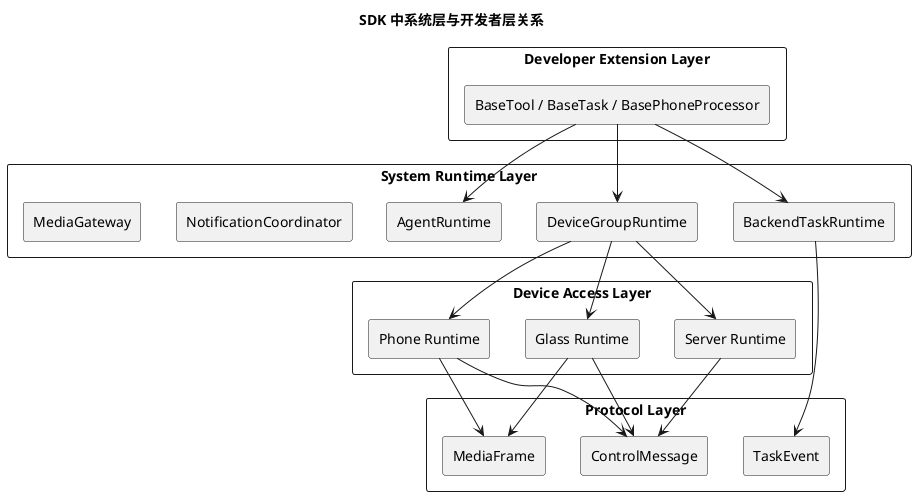

# SDK 产品形态与多端职责定义

## 1. 文档定位

本文档用于回答当前项目在进入 SDK 化阶段后最关键的两个问题：

1. 这个项目最终要交付的到底是不是一个 Python SDK。
2. 在 SDK 语境下，眼镜、手机、服务器三端各自应该扮演什么角色。

本文档不讨论某一个具体业务功能的实现细节，而是讨论 SDK 的产品形态、边界、职责拆分和后续落地方向。

本文档的目标是为后续架构演进提供统一判断标准，避免项目继续沿着“单项目功能实现”的思路扩展，导致系统层细节不断泄漏给业务开发者。

---

## 2. 背景与问题定义

当前项目的长期目标已经发生了明显变化。

项目不再只是为了交付一个“眼镜 + 手机 + 服务器”的具体产品原型，而是要进一步抽象成一个可开源、可扩展、可复用的 SDK 平台，使社区开发者可以在该平台上持续扩展业务能力。

期望中的开发体验是：

1. 开发者只关心“我要实现什么能力”。
2. 开发者只关心“这个能力是一个 Tool，还是一个 Task”。
3. 开发者不需要自己处理三端绑定、路由、长连接、媒体流、上下文同步、任务回流等系统问题。
4. 开发者实现完能力后，系统可以自动把该能力放入既有运行时中工作。

在这个前提下，一个很容易产生误解的问题是：

- 如果 SDK 主要用 Python 实现，那么手机端怎么接入。
- 如果手机端不能直接使用 Python SDK，那手机在 SDK 体系中的定位是什么。

本文档的核心结论就是围绕这个问题展开。

---

## 3. 结论先行

### 3.1 最重要的结论

本项目最终要交付的 **不是“一个 Python SDK”**。

本项目最终要交付的是一个 **多设备协同运行时 SDK 体系**。

其中：

1. Python 主要承担服务器侧 SDK 的实现。
2. 手机侧需要独立的运行时接入层，不应被强行等价为 Python 包。
3. 眼镜侧需要独立的设备接入层，不应被强行等价为 Python 包。
4. 三端共享的核心不是“同一种语言”，而是“同一种系统模型”。

### 3.2 统一理解方式

应当把 SDK 拆成以下四层来理解：

1. 协议与对象模型层
2. 系统运行时层
3. 多端接入层
4. 开发者扩展层

其中：

1. 协议与对象模型层是跨语言共享根基。
2. 系统运行时层主要在服务器端落地。
3. 多端接入层分别由眼镜端、手机端各自实现。
4. 开发者扩展层主要面向服务器侧和手机侧开放。

也就是说：

- `Python` 是服务器扩展面的主要实现语言。
- `glass / phone / server` 是三种设备角色。
- “设备角色”和“开发语言”不是同一个维度。

---

## 4. SDK 的正式产品定义

建议把本项目定义为：

**面向“眼镜 + 手机 + 服务器”设备组的多端协同运行时 SDK。**

该 SDK 的目标不是单独提供某一个端的函数库，而是提供一整套稳定的协同基础设施，使开发者可以在既定运行时之上新增业务能力。

### 4.1 SDK 要解决的系统问题

SDK 应统一解决以下非业务问题：

1. 设备注册与鉴权
2. 设备组绑定与关系维护
3. 设备组内消息路由
4. 控制消息与媒体流的统一协议
5. 语音会话与多轮上下文维护
6. 后台任务生命周期管理
7. 通知编排与执行调度
8. 手机与眼镜之间的直连协作
9. 服务器与手机之间的能力调用协调
10. Tool、Task、MCP、设备能力的统一注册与调用

### 4.2 SDK 不应要求开发者处理的问题

SDK 的目标是让开发者完全不需要关注下列问题：

1. 眼镜和手机如何绑定
2. 消息应该发到哪个 WebSocket
3. 视频流该走哪条链路
4. 播放时如何闭麦
5. 任务完成后如何回流 agent
6. 高优先级通知如何抢占
7. 设备断线后如何恢复状态
8. 媒体资产如何落盘与索引

如果开发者仍需要显式处理这些问题，则说明 SDK 分层仍然不够成熟。

---

## 5. 三端角色定义

## 5.1 总体原则

在 SDK 视角下，`glass`、`phone`、`server` 不是三套松散组件，而是一个 `DeviceGroup` 中的三类角色节点。

建议统一采用以下角色定义：

### 5.1.1 glass

`glass` 是 **感知与执行节点**。

主要职责：

1. 采集麦克风、摄像头、IMU 等原始信号
2. 执行音频播放、震动等用户反馈动作
3. 维护本地轻量实时状态机，例如待机、录音、播放
4. 作为用户最直接接触的交互终端

不承担的职责：

1. 不承担复杂业务编排
2. 不承担长期任务调度
3. 不承担大模型上下文维护
4. 不承担复杂视觉算法主计算

### 5.1.2 phone

`phone` 是 **边缘计算节点**。

主要职责：

1. 承接实时性较高但计算量较大的本地任务
2. 接收来自眼镜的连续媒体流
3. 运行本地视觉、检测、跟踪、导航辅助等算法
4. 作为设备组中的弹性算力补充

不承担的职责：

1. 不负责智能体完整运行态
2. 不负责开放式多轮会话上下文
3. 不负责全局任务编排决策

### 5.1.3 server

`server` 是 **协调、上下文、智能体与任务中心节点**。

主要职责：

1. 管理设备组生命周期
2. 维护智能体运行态与多轮上下文
3. 维护 Tool、Task、MCP 等能力注册表
4. 负责任务创建、通知协调和全局调度
5. 决定某项能力应在服务器、手机还是眼镜侧执行

不承担的职责：

1. 不必承接所有实时感知计算
2. 不应继续把所有视觉算法都塞回服务端

---

## 6. 为什么不能把 SDK 等同于 Python 包

## 6.1 根本原因

如果把 SDK 理解成“一个 Python 包”，会立刻产生两个问题：

1. 手机端无法自然接入
2. 眼镜端无法自然接入

因为：

1. 眼镜端运行在 ESP32 / ESP-IDF 环境中
2. 手机端主要运行在 Android / iOS 原生或跨平台宿主环境中
3. 这两类环境都不应该以 Python 包作为主接入方式

### 6.2 正确理解

正确的理解应当是：

**Python SDK 只是整个多端 SDK 体系中的“服务器扩展面实现”。**

换句话说：

1. “SDK 产品”是多端协同体系
2. “Python SDK”是该体系中的服务器侧实现之一

### 6.3 更准确的产品表达

建议在后续对内对外表述中，避免使用下面这种说法：

- “我们要做一个 Python SDK”

建议改为：

- “我们要做一个多设备协同 SDK，其中服务器扩展面优先以 Python 提供”

这两句话的方向完全不同。

前者容易误导团队把所有问题都当成 Python 工程问题处理。  
后者会迫使团队优先定义跨端模型、协议和职责边界。

---

## 7. SDK 的推荐分层

建议 SDK 最终按下面四层组织。

## 7.1 第一层：协议与对象模型层

这一层是跨语言共享层，是整个 SDK 的根基。

建议固定的核心内容包括：

1. `ControlMessage`
2. `MediaFrame`
3. `DeviceIdentity`
4. `DeviceGroup`
5. `TaskSpec`
6. `TaskEvent`
7. `NotificationRequest`
8. `CapabilityResult`
9. `ToolContext`
10. `DeviceGroupContext`

这一层应尽量语言无关，文档与字段定义要先于代码实现冻结。

## 7.2 第二层：系统运行时层

这一层主要落在服务器侧，是 SDK 的核心。

建议包含：

1. `DeviceGroupRuntime`
2. `AgentRuntime`
3. `BackendTaskRuntime`
4. `NotificationCoordinator`
5. `ContextStore`
6. `DeviceGateway`
7. `MediaGateway`
8. `CapabilityRegistry`

这一层的职责是统一吃掉系统复杂度，不把底层细节泄漏给业务扩展面。

## 7.3 第三层：多端接入层

这一层分别在眼镜端与手机端落地。

### 7.3.1 眼镜端接入层

建议包含：

1. `glass-api`
2. `sensor-hub`
3. `actuator-hub`
4. 媒体流适配
5. 本地轻量状态机

### 7.3.2 手机端接入层

建议包含：

1. `phone-api`
2. `phone-task-runtime`
3. `media-receiver`
4. `phone-tool-runtime`
5. 本地推理执行框架

## 7.4 第四层：开发者扩展层

这是 SDK 最终真正面向社区开发者的层。

建议暴露的核心抽象包括：

1. `BaseTool`
2. `BaseTask`
3. `BasePhoneProcessor`
4. `DeviceGroupContext`
5. `TaskEventHandler`
6. `CapabilityResult`

开发者新增能力时，原则上只应与这一层打交道。

---

## 8. 多端职责与扩展面定义

## 8.1 服务器侧扩展面

服务器侧是 SDK 的主扩展面，优先提供 Python 版本。

建议开放给开发者的能力包括：

1. 新增 `Tool`
2. 新增 `Task`
3. 组合 Tool、Task、MCP 形成复合能力
4. 订阅任务事件
5. 查询设备组状态
6. 发起通知和执行请求

开发者不应直接接触：

1. 控制连接底层发送函数
2. 原始 WebSocket 路由
3. 原始设备会话结构
4. 具体媒体缓存实现

## 8.2 手机侧扩展面

手机侧不是主编排端，而是主计算扩展端。

建议未来开放给开发者的能力包括：

1. 新增本地视觉处理器
2. 新增视频帧处理任务
3. 新增本地检测、识别、跟踪、路径理解能力
4. 输出结构化检测结果给服务器或眼镜

建议不要让开发者直接处理：

1. 与眼镜直连链路建立过程
2. 手机注册和绑定协议
3. 原始协议编解码
4. 与服务器的任务编排关系

更理想的形式是：

- 开发者只需要实现一个 `FrameProcessor` 或 `PhoneTask`
- 系统自动把上游视频流、下游结果回传、异常恢复统一处理

## 8.3 眼镜侧扩展面

眼镜侧不建议作为主要业务扩展面。

建议只开放有限扩展能力：

1. 新增轻量感知采集器
2. 新增执行器适配
3. 新增本地唤醒、播放、状态切换策略

不建议社区开发者在眼镜端实现复杂业务能力，原因如下：

1. 端侧资源有限
2. 端侧调试成本高
3. 复杂业务逻辑更适合放在服务器或手机侧

因此眼镜端更适合作为“设备接入 SDK”，而不是“业务能力 SDK”。

---

## 9. 推荐的核心系统抽象

为了实现“开发者不关心系统层问题”的目标，建议优先固化以下系统抽象。

## 9.1 DeviceGroupRuntime

这是下一阶段最关键的系统模块。

建议它统一负责：

1. 创建与管理 `DeviceGroup`
2. 维护眼镜、手机、服务器之间的绑定关系
3. 提供统一的组内消息路由能力
4. 向上层暴露“当前设备组可用能力”

开发者应通过它拿到一个稳定的 `DeviceGroupContext`，而不是自己持有三端连接对象。

## 9.2 DeviceGroupContext

建议这是以后所有 Tool / Task 的首要上下文对象。

它至少应包含：

1. 当前设备组编号
2. 当前会话编号
3. 当前可用设备角色
4. 当前任务编号
5. 统一设备能力入口
6. 统一通知入口
7. 统一媒体入口

开发者应从这里获取系统能力，而不是直接依赖某个底层 runtime。

## 9.3 BaseTool

建议作为短时能力统一抽象。

适合承载：

1. 抓拍
2. 地图查询
3. 设备状态查询
4. 创建某个后台任务

## 9.4 BaseTask

建议作为长生命周期能力统一抽象。

适合承载：

1. 导航
2. 寻物
3. 计时器
4. 手机直连视频任务
5. 周期检查任务

## 9.5 BasePhoneProcessor

这是未来手机侧扩展必须补齐的抽象。

建议它承载：

1. 连续帧输入
2. 本地模型执行
3. 结构化结果输出
4. 资源初始化与释放

例如：

- YOLO 目标检测
- 红绿灯检测
- 障碍物检测
- 盲道识别

都应在这个层级上扩展，而不是由开发者自己实现手机网络接入与帧接收。

---

## 10. 下一阶段的产品化优先级

如果下一期目标切换为 SDK 产品化，建议优先级如下。

## 10.1 第一优先级

1. 固化 `DeviceGroup` 概念
2. 固化 `DeviceGroupRuntime`
3. 固化 `DeviceGroupContext`
4. 固化服务器侧 `BaseTool / BaseTask`
5. 固化手机侧 `BasePhoneProcessor`

这一步的目标不是多做业务，而是先让开发者扩展面成型。

## 10.2 第二优先级

1. 手机注册与设备组绑定最小闭环
2. 手机与眼镜直连媒体链路最小闭环
3. 连续视频帧通道最小闭环

这一步的目标是让“手机作为边缘算力节点”的系统定位真正落地。

## 10.3 第三优先级

用一个真正具有代表性的三端能力作为 SDK 样板能力。

建议优先选：

**寻找物体**

原因：

1. 它天然覆盖眼镜采集
2. 它天然覆盖手机侧推理
3. 它天然覆盖服务器任务编排
4. 它比计时器更能证明 SDK 的系统封装是否成立

---

## 11. 建议的样板能力落地方式

为了验证 SDK 是否真的达到了“开发者只关注业务”的目标，建议用一个样板能力做验收。

推荐样板能力：

- `find_object_task`

建议由系统与业务分层如下：

### 11.1 系统层负责

1. 设备组绑定
2. 眼镜到手机的视频流建立
3. 手机帧接收
4. 任务生命周期管理
5. 通知协调
6. 结果回流 agent

### 11.2 开发者负责

1. 定义目标物体识别逻辑
2. 实现手机端检测处理器
3. 定义“目标在左侧 / 中间 / 右侧 / 已接近”的业务判定
4. 定义任务完成条件

如果这个样板能力落地时，开发者仍然需要自己写连接管理、消息路由、任务回调桥接，那么说明 SDK 设计还没有达标。

---

## 12. 建议的工程交付形态

为了让开源社区能够真正使用，后续工程形态也应同步调整。

建议逐步形成如下结构：

```text
doc/
  sdk-design/
sdk/
  protocol/
  server/
  phone/
  glass/
examples/
  server-tool-demo/
  timer-task-demo/
  find-object-demo/
```

建议含义如下：

1. `sdk/protocol`
   - 跨语言共享协议定义与对象模型说明
2. `sdk/server`
   - Python 服务器扩展面
3. `sdk/phone`
   - 手机端运行时与扩展面
4. `sdk/glass`
   - 眼镜端接入层
5. `examples`
   - 面向开发者的最小样例工程

---

## 13. 流程图（PlantUML）

下面用一张简化流程图说明 SDK 中系统层与开发者层的关系。



---

## 14. 最终结论

本文档最终希望团队统一以下判断：

1. 本项目最终产品不是单一 Python SDK，而是多设备协同运行时 SDK。
2. Python 主要承担服务器侧扩展面，不应被视为整个 SDK 的唯一实现形态。
3. 眼镜的定位是感知与执行节点，手机的定位是边缘计算节点，服务器的定位是协调与上下文中心节点。
4. SDK 的价值在于吃掉所有系统复杂度，让开发者只写业务能力。
5. 下一阶段最重要的不是继续堆更多功能，而是先把 `DeviceGroupRuntime`、扩展抽象和手机侧运行时正式产品化。

如果后续设计与开发仍然围绕“先做一个功能，再补一点系统逻辑”推进，那么最终很难形成一个真正适合社区扩展的 SDK。

相反，如果从现在开始把目标明确切换为：

**先固化多端协同运行时，再把业务能力作为插件式扩展接入**

那么当前项目已有的协议设计、agent-core、backend-task-core、camera tool、notification coordinator 等成果，都可以自然收敛成未来 SDK 的系统内核。
