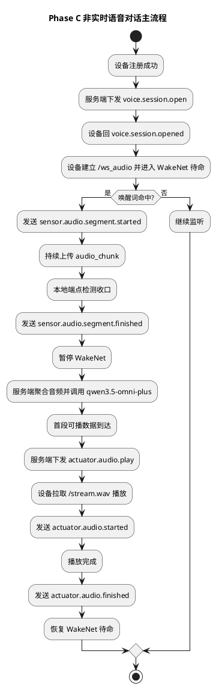
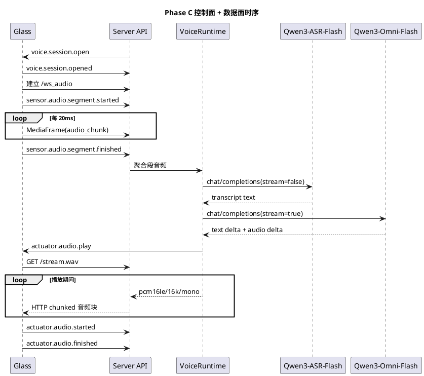

# Phase C 非实时语音对话实施文档

## 1. 需求理解

本阶段目标对应 [第一期前三项开发落地计划.md](/Users/elio/dev/llm-project/OpenAIglassesDemo_2/doc/stage1/plan/第一期前三项开发落地计划.md) 的 Phase C，要求在已完成的注册链路基础上，真正打通“唤醒 -> 收音 -> 上行 -> 模型 -> 播放 -> 恢复监听”的非实时语音对话主链路。

本阶段必须交付：

1. 眼镜端完成 WakeNet 后的真实音频上行、端点收口、播放闭麦与恢复监听。
2. 服务端完成 `/ws_audio` 接入、音频聚合、最小 `VoiceSessionController`、`qwen3.5-omni-plus` 调用与 `/stream.wav` 下行。
3. 服务端和眼镜端完成 `sensor.audio.segment.finished`、`actuator.audio.play`、`actuator.audio.started`、`actuator.audio.finished` 的控制闭环。
4. 补齐自动化测试、联调脚本、联调说明和验收方案。

## 2. 现状分析

Phase B 和“Phase C 语音唤醒状态上报”完成后，仓库已有以下基础：

1. `/ws/control` 注册链路可用，设备注册成功后会自动收到 `voice.session.open`。
2. 眼镜端已接入 ESP-SR WakeNet，并可在命中唤醒词时发送 `sensor.audio.segment.started`。
3. 协议公共层中的 `ControlMessage` 与 `MediaFrame` 已完成实现和测试。

当前缺口：

1. 服务端仍没有 `/ws_audio` 数据接入和 `/stream.wav` 下行通道。
2. 服务端没有独立的语音会话控制器，`segment.started` 之后没有真正进入音频聚合和模型调用。
3. 眼镜端本地端点检测结束后只会复位本地状态，没有发送 `sensor.audio.segment.finished`，也没有真实的音频上行与扬声器播放链路。
4. 文档和脚本仍以 Phase B/唤醒上报为主，缺少完整 Phase C 联调入口。

## 3. 实现方案描述

### 3.1 服务端最小语音运行时

本次新增与修改：

1. `server/src/runtime/voice_runtime.py`
2. `server/src/api/ws/control_runtime.py`
3. `server/src/api/ws/websocket_transport.py`
4. `server/src/api/http_server.py`
5. `server/src/infra/config/settings.py`

关键实现：

1. 引入最小 `VoiceRuntime`，为每台设备维护一条 `VoiceSessionController`。
2. `ControlRuntime` 继续负责注册与控制路由，但把 `segment` 聚合、模型调用、播放编排下沉到 `VoiceRuntime`。
3. 新增 `/ws_audio` WebSocket 二进制接入，按 `MediaFrame` 校验 `stream_id/segment_id/seq` 并聚合音频。
4. 新增 `/stream.wav` HTTP chunked 下行通道，首段返回 WAV 头，后续持续推 `pcm16le/16kHz/mono` 音频块。
5. 新增 `actuator.audio.play` 下发与 `actuator.audio.started/finished` 回报处理。

### 3.2 模型调用

本次实现严格按 [语音对话协议与时序设计.md](/Users/elio/dev/llm-project/OpenAIglassesDemo_2/doc/structure-design/语音对话协议与时序设计.md) 的约束执行：

1. 用户输入不会直接送入对话模型，而是先通过百炼 `qwen3-asr-flash` 转写成文本。
2. 对话阶段再通过百炼 OpenAI 兼容 `chat/completions` 调用 `qwen3.5-omni-plus`。
3. 对话请求为 `stream=true`，输出模态固定为 `["text","audio"]`。
4. 音频输出按流式 SSE 增量读取。
5. 服务端把模型返回的 `24kHz` PCM 增量实时重采样为 `16kHz`，并送入 `/stream.wav` 播放流。
6. 当前轮用户输入与回复音频都会落盘到 `VOICE_RUNS_ROOT/session_id/audio/{input|output}`。

### 3.3 眼镜端主状态机

本次修改：

1. `glass/src/main/glass_main.c`

关键实现：

1. `voice.session.open` 到达后，除开启 WakeNet 待命外，还会建立 `/ws_audio` 连接。
2. `sr_pipeline_task` 在 `segment_active` 期间把 AFE 输出编码为 `MediaFrame`，通过 `/ws_audio` 持续上送。
3. 本地端点检测达到尾静音或超时后，发送 `sensor.audio.segment.finished` 并暂停 WakeNet。
4. 收到 `actuator.audio.play` 后，构造 `/stream.wav?device_id=...&stream_id=...` 地址并启动 HTTP 播放任务。
5. 播放任务在首段音频写入扬声器时上报 `actuator.audio.started`，结束后上报 `actuator.audio.finished`，随后恢复 WakeNet 待命。

### 3.4 联调与验收辅助

本次新增：

1. `script/run_phase_c_tests.sh`
2. `script/deprecated/run_server_phase_c.sh`
3. `script/deprecated/run_server_phase_c_remote.sh`
4. `script/deprecated/run_glass_phase_c.sh`
5. `script/phase_c_voice_client.py`
6. [第一期前三项-PhaseC联调说明.md](/Users/elio/dev/llm-project/OpenAIglassesDemo_2/doc/stage1/develop/第一期前三项-PhaseC联调说明.md)

作用：

1. 一键执行 Phase C 自动化测试。
2. 一键启动带模型参数的本地或远端 Phase C 服务端。
3. 复用现有 ESP-IDF 固件构建脚本进入 Phase C 联调。
5. 在无真机或模型接口排障时，用本地 Python 模拟设备跑完整控制面、音频上行和播放下行。

## 4. 流程图（PlantUML）



## 5. 时序图（PlantUML）



## 6. 自动化测试方案

### 6.1 单元测试

1. 新增 `server/test/unit/test_voice_runtime.py`，覆盖：
2. `24kHz -> 16kHz` 流式重采样。
3. `/stream.wav` WAV 头生成。
4. ASR `data:` URL 与多轮文本历史消息构造。

### 6.2 集成测试

新增 `server/test/integration/test_voice_dialog_flow.py`，覆盖：

1. 控制连接注册成功并自动进入 `voice.session.open`。
2. `/ws_audio` 建链与 `MediaFrame(audio_chunk)` 上行。
3. `sensor.audio.segment.finished` 先触发 ASR，再触发对话模型调用。
4. 服务端下发 `actuator.audio.play`。
5. 设备通过 `/stream.wav` 拉到回复音频。
6. `actuator.audio.started/finished` 回报后，会话状态回到 `listening`。

### 6.3 运行命令

```bash
bash script/run_phase_c_tests.sh
```

## 7. 当前方案与架构设计的契合程度

契合度评估：`高`。

理由：

1. 严格沿用 [语音对话协议与时序设计.md](/Users/elio/dev/llm-project/OpenAIglassesDemo_2/doc/structure-design/语音对话协议与时序设计.md) 中定义的 `sensor.audio.segment.started`、`sensor.audio.segment.finished`、`actuator.audio.play`、`actuator.audio.started`、`actuator.audio.finished`。
2. 媒体上行继续使用 `/ws_audio + MediaFrame`，下行继续使用 `/stream.wav`，与 [媒体流传输格式设计.md](/Users/elio/dev/llm-project/OpenAIglassesDemo_2/doc/structure-design/媒体流传输格式设计.md) 一致。
3. 服务端没有提前引入完整 `agent-core`，而是按 [agent-core设计.md](/Users/elio/dev/llm-project/OpenAIglassesDemo_2/doc/structure-design/agent-core设计.md) 落地最小 `VoiceSessionController`。

当前仍保留的限制：

1. 第一版不支持用户打断播放。
2. 设备端仍采用最小 HTTP 拉流播放器，没有扩展到更复杂的缓冲和恢复策略。

## 8. 开发后测试结果

执行时间：2026-04-12。

执行命令：

```bash
bash script/run_phase_c_tests.sh
```

结果汇总：

1. 共执行 18 个测试。
2. 通过 18 个。
3. 失败 0 个。

补充说明：

1. 自动化测试中的模型调用使用假模型客户端，验证的是 Phase C 会话编排、音频接入和播放通道，不依赖真实外部 API。
2. 真机固件编译、烧录、WakeNet 实际命中和扬声器播放需在本地 ESP-IDF 环境中完成。

## 9. 当前实现进展

Phase C 当前状态：`服务端主链路已完成，固件主状态机已推进到真实上行/下行闭环，进入真机联调阶段`。

已完成项：

1. 服务端 `/ws_audio`、音频段聚合、最小语音运行时、`/stream.wav`、`actuator.audio.play` 控制闭环。
2. 服务端 `qwen3-asr-flash -> qwen3.5-omni-plus` 两阶段百炼兼容接口适配与 `24kHz -> 16kHz` 流式重采样。
3. 眼镜端 `audio_chunk` 上行、`sensor.audio.segment.finished`、HTTP 播放任务、播放闭麦与恢复监听。
4. 自动化测试、启动脚本、本地模拟联调客户端、联调说明。
5. 服务端日志已补齐 ASR 转写结果、完整模型输入 `messages` 与最终文本回复，便于多轮历史联调排障。

下一步建议：

1. 在真实设备上跑通完整唤醒、上行、播放链路。
2. 根据真机串口和服务端日志，继续收敛播放失败和网络抖动恢复策略。
