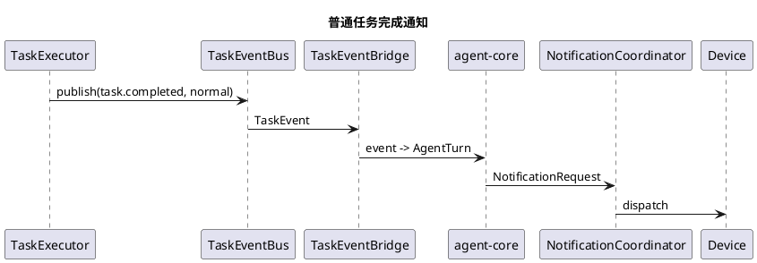
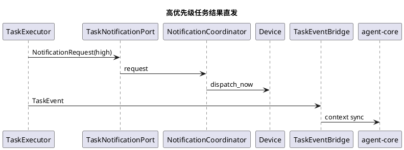
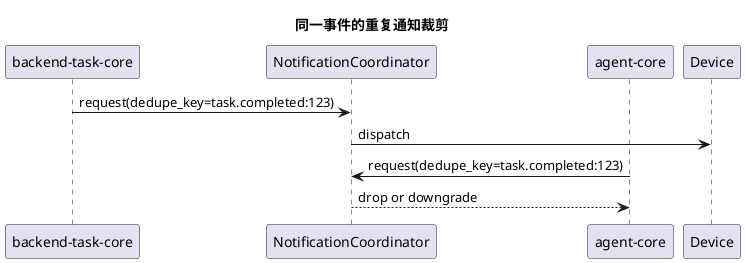

# agent-core 与 backend-task-core 通知协调设计

## 1. 文档定位

本文档专门讨论 `agent-core` 与 `backend-task-core` 在通知端侧时的协调机制。

本文档不展开任务状态机和任务对象模型，这些内容见：

- [agent-core设计.md](/Users/elio/dev/llm-project/OpenAIglassesDemo_2/doc/structure-design/agent-core设计.md)
- [backend-task-core设计.md](/Users/elio/dev/llm-project/OpenAIglassesDemo_2/doc/structure-design/backend-task-core设计.md)

本文档重点回答以下问题：

1. 哪些模块允许发通知。
2. 通知如何统一申请、裁决和下发。
3. 什么时候应先回流 `agent-core`，什么时候允许直发端侧。
4. 两边同时想通知时如何避免冲突、重复和抢占失控。

---

## 2. 设计目标

通知协调机制需要实现以下目标：

1. 让 `agent-core` 与 `backend-task-core` 都能在需要时向端侧发通知。
2. 保证通知行为可控，不能出现两个模块各自抢着播报。
3. 保证高优先级通知可以及时触达端侧。
4. 保证大多数任务结果仍能先回流 `agent-core`，利用大模型做更自然的决策。
5. 保证通知具备统一优先级、统一去重和统一调度规则。

---

## 3. 核心问题

如果没有统一协调机制，会出现以下问题：

1. `backend-task-core` 任务完成后直接播报，同时 `agent-core` 也收到事件并再次播报，导致重复通知。
2. 一个低优先级任务完成通知打断正在进行的重要对话。
3. 多个后台任务同时完成，端侧连续收到多条无组织通知。
4. `agent-core` 和 `backend-task-core` 各自维护一套通知优先级，最终行为不可预测。

因此必须明确：

1. 通知是独立的一条控制平面。
2. 通知不是谁先想到就先发。
3. 所有通知都必须经过同一个协调器。

---

## 4. 最终设计结论

### 4.1 通知的三个阶段

所有通知都必须经过三个阶段：

1. `NotificationRequest`
   - 某个模块提出通知申请。
2. `NotificationDecision`
   - 统一协调器判断是否发送、何时发送、是否抢占、是否合并。
3. `NotificationDispatch`
   - 下发到设备侧或 UI 侧。

### 4.2 通知的两个来源

当前只允许两类来源申请通知：

1. `agent-core`
2. `backend-task-core`

其中：

1. `agent-core` 的通知通常是大模型决策后的结果通知。
2. `backend-task-core` 的通知通常是任务事件触发的系统通知。

### 4.3 主路径与旁路

建议统一采用以下策略：

1. 主路径：任务结果先回流 `agent-core`，再由 `agent-core` 决定是否通知。
2. 旁路：在高优先级、强时效或安全相关场景下，允许 `backend-task-core` 申请直发端侧。
3. 即使走旁路，事件仍必须回流 `agent-core` 做上下文同步。

### 4.4 唯一协调中心

建议引入统一模块：

`NotificationCoordinator`

它是唯一有权做以下决策的模块：

1. 是否允许发送。
2. 是否立即发送。
3. 是否抢占当前播报。
4. 是否排队等待。
5. 是否和其他通知合并。
6. 是否丢弃重复通知。

---

## 5. 整体架构

建议通知相关模块如下：

1. `NotificationCoordinator`
2. `NotificationQueue`
3. `NotificationPolicy`
4. `NotificationDeduplicator`
5. `NotificationDispatcher`
6. `NotificationStateStore`

### 5.1 `NotificationCoordinator`

职责：

1. 接收来自 `agent-core` 和 `backend-task-core` 的通知申请。
2. 调用策略模块做决策。
3. 把通知送入立即发送、排队或丢弃路径。

### 5.2 `NotificationQueue`

职责：

1. 保存待发送通知。
2. 支持按优先级排序。
3. 支持延迟发送。
4. 支持批量合并窗口。

### 5.3 `NotificationPolicy`

职责：

1. 根据优先级判断是否允许直发。
2. 根据端侧当前状态判断是否可打断。
3. 根据通知类型判断是否需要合并。
4. 根据来源判断默认策略。

### 5.4 `NotificationDeduplicator`

职责：

1. 避免同一事件被多次播报。
2. 避免 `backend-task-core` 直发后，`agent-core` 再次用同一内容播报。
3. 基于 `event_id`、`task_id`、`session_id`、`notification_key` 去重。

### 5.5 `NotificationDispatcher`

职责：

1. 把最终获批的通知下发到端侧。
2. 选择具体通道，例如：
   - 音频播报
   - 震动
   - 卡片提示
   - HUD 提示

### 5.6 `NotificationStateStore`

职责：

1. 维护当前设备是否正在播报。
2. 维护当前正在播放的通知优先级。
3. 维护最近已发送通知的短期索引。

---

## 6. 统一通知对象模型

## 6.1 NotificationRequest

表示某个模块提出的通知申请。

建议字段：

```json
{
  "request_id": "notify_req_01J...",
  "source_module": "backend-task-core",
  "session_id": "sess_01J...",
  "device_id": "glass-001",
  "task_id": "task_01J...",
  "priority": "high",
  "notification_type": "task_completed",
  "delivery_mode": "audio",
  "allow_interrupt": true,
  "allow_merge": false,
  "requires_agent_context_sync": true,
  "dedupe_key": "task.completed:task_01J...",
  "payload": {
    "text": "三分钟计时已结束"
  }
}
```

## 6.2 NotificationDecision

表示统一协调器的裁决结果。

建议字段：

```json
{
  "request_id": "notify_req_01J...",
  "decision": "dispatch_now",
  "reason": "high_priority_interrupt_allowed",
  "queue_delay_ms": 0,
  "merged_into": null
}
```

`decision` 建议取值：

1. `dispatch_now`
2. `enqueue`
3. `merge`
4. `drop`

## 6.3 NotificationRecord

表示已经发送或已经裁决的通知记录。

用途：

1. 排障。
2. 去重。
3. 防止重复播报。

---

## 7. 优先级设计

### 7.1 统一优先级

建议通知优先级统一为：

1. `low`
2. `normal`
3. `high`
4. `critical`

### 7.2 各优先级的默认策略

#### `low`

默认策略：

1. 不允许打断当前播报。
2. 默认排队。
3. 更适合回流 `agent-core` 后再决定是否播报。

适用场景：

1. 任务普通进度更新。
2. 非关键状态变化。

#### `normal`

默认策略：

1. 默认不打断当前播报。
2. 可排队。
3. 通常由 `agent-core` 决定最终话术。

适用场景：

1. 普通任务完成。
2. 普通查询结果。

#### `high`

默认策略：

1. 在允许场景下可打断低优先级播报。
2. 允许 `backend-task-core` 申请直发端侧。
3. 仍必须同步回流 `agent-core`。

适用场景：

1. 计时器到点。
2. 导航关键节点提醒。

#### `critical`

默认策略：

1. 允许立即抢占当前非关键播报。
2. 应优先直发端侧。
3. 同时必须回流 `agent-core` 做上下文同步。

适用场景：

1. 安全警报。
2. 紧急故障。
3. 用户必须立刻知晓的任务结果。

---

## 8. 协调规则

### 8.1 来源优先级不高于事件优先级

不应简单地认为：

1. `agent-core` 发的就一定更重要。
2. `backend-task-core` 发的就一定更低级。

真正决定策略的是：

1. 事件优先级
2. 当前设备状态
3. 当前是否正在播报
4. 是否存在重复通知

### 8.2 默认先回流 agent-core

对于大多数任务事件：

1. 先回流 `agent-core`
2. 由 `agent-core` 做开放式决策
3. 再由 `agent-core` 提交通知申请

这是默认路径。

### 8.3 直发端侧的准入条件

`backend-task-core` 申请直发端侧时，建议至少满足以下条件之一：

1. 优先级为 `high` 或 `critical`
2. 时效性要求强，等待模型决策会明显影响体验
3. 属于安全相关或用户强约定提醒

### 8.4 直发后仍必须回流 agent-core

原因：

1. 需要同步会话上下文。
2. 需要让大模型知道用户刚刚已经被提醒过。
3. 需要避免后续再次重复提醒。

### 8.5 重复通知裁剪

若 `backend-task-core` 已经直发，随后 `agent-core` 基于同一事件又发起通知申请，则协调器应优先：

1. 判断是否为同一 `dedupe_key`
2. 若是同一事件且内容等价，则丢弃或降级
3. 若 `agent-core` 的通知包含明显新增语义，则允许补充播报

---

## 9. 排队、合并与打断

### 9.1 排队

以下情况默认排队：

1. `low` 和 `normal` 通知
2. 当前端侧正在播放更高优先级通知
3. 当前用户正在进行主动语音交互，且通知不紧急

### 9.2 合并

以下情况可以考虑合并：

1. 同一任务短时间内多次进度更新
2. 多个低优先级结果在短窗口内同时到达
3. 多个相同类型的状态同步通知

建议只对：

1. 文本类通知
2. 非关键提醒

做合并。

### 9.3 打断

打断必须严格受控。

建议规则：

1. `critical` 可以打断 `low`、`normal`、`high`
2. `high` 可以打断 `low`、`normal`
3. `normal` 不打断 `normal`
4. `low` 不打断任何通知

### 9.4 与当前对话的冲突

当用户正在和眼镜对话时，应额外考虑：

1. 若通知不紧急，优先排队。
2. 若通知是用户主动创建且预期中的提醒，可适当提高权重。
3. 若通知是安全类事件，应允许打断当前对话。

---

## 10. 典型时序

### 10.1 普通任务完成，由 agent-core 决定通知



### 10.2 高优先级任务结果直发端侧



### 10.3 直发后 agent-core 再次申请，协调器去重



---

## 11. 第一阶段建议范围

第一阶段不需要把通知系统做得过重。

建议最小实现如下：

1. 统一 `NotificationRequest`
2. 统一四级优先级
3. 最小 `NotificationCoordinator`
4. 最小去重逻辑
5. 最小排队逻辑
6. 只支持音频播报这一种主要通知通道

第一阶段可以暂不实现：

1. 复杂批量合并
2. 多设备多端同步裁决
3. 个性化通知偏好
4. 丰富 UI 通知样式

---

## 12. 当前建议

### 12.1 架构建议

建议把通知协调模块放在 `agent-core` 与 `backend-task-core` 之上的共享控制层，或至少作为两者共同依赖的独立模块。

不建议：

1. 放到 `agent-core` 内部
2. 放到 `backend-task-core` 内部

因为这样都会让另一侧失去平等的申请权和统一裁决机制。

### 12.2 行为建议

建议统一采用：

1. 默认先回流 `agent-core`
2. 高优先级允许 `backend-task-core` 申请直发
3. 所有通知必须经过统一协调器
4. 所有直发事件仍必须同步回流 `agent-core`

### 12.3 对当前代码演进的指导意义

后续实现时，应优先固化以下接口：

1. `TaskEvent -> AgentTurn` 的桥接接口
2. `NotificationRequest` 的统一结构
3. `NotificationCoordinator` 的裁决接口
4. `TaskNotificationPort` 与 `agent-core` 的通知申请接口

---

## 13. 最终结论

1. `agent-core` 与 `backend-task-core` 都允许通知端侧，但都不应绕过统一通知协调机制。
2. 任务结果的主路径仍是“结构化事件回流 `agent-core`，由大模型决定下一步动作”。
3. 高优先级、强时效或安全相关事件允许 `backend-task-core` 申请直发端侧，但仍必须同步回流 `agent-core`。
4. 通知协调的核心不是“谁来发”，而是“谁来裁决是否发、何时发、是否打断、是否去重”。
5. `NotificationCoordinator` 应成为这条控制链路中的唯一裁决中心。
